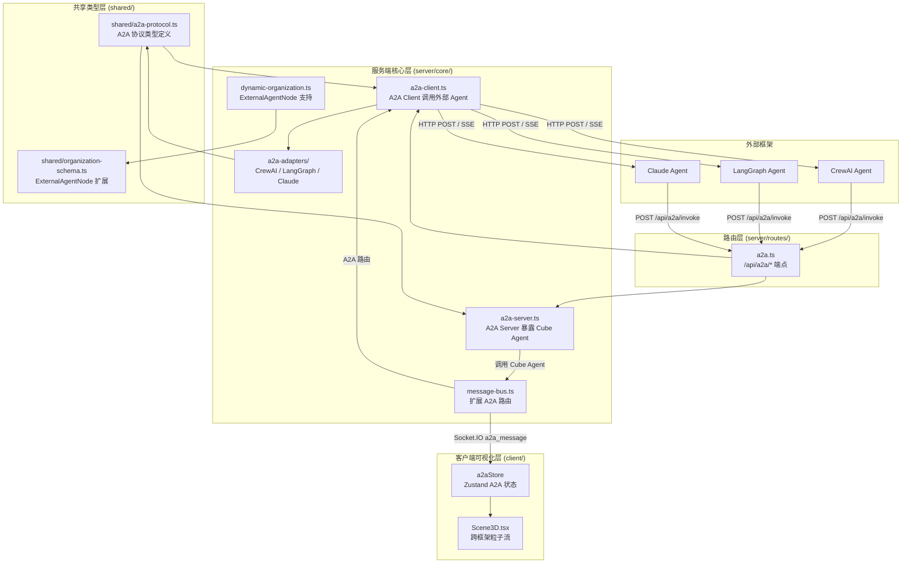
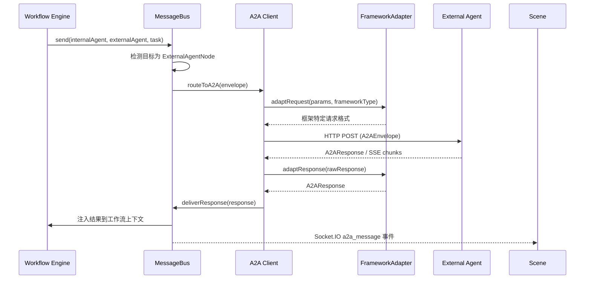
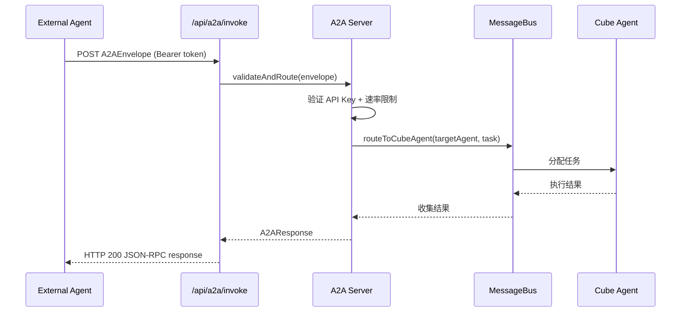
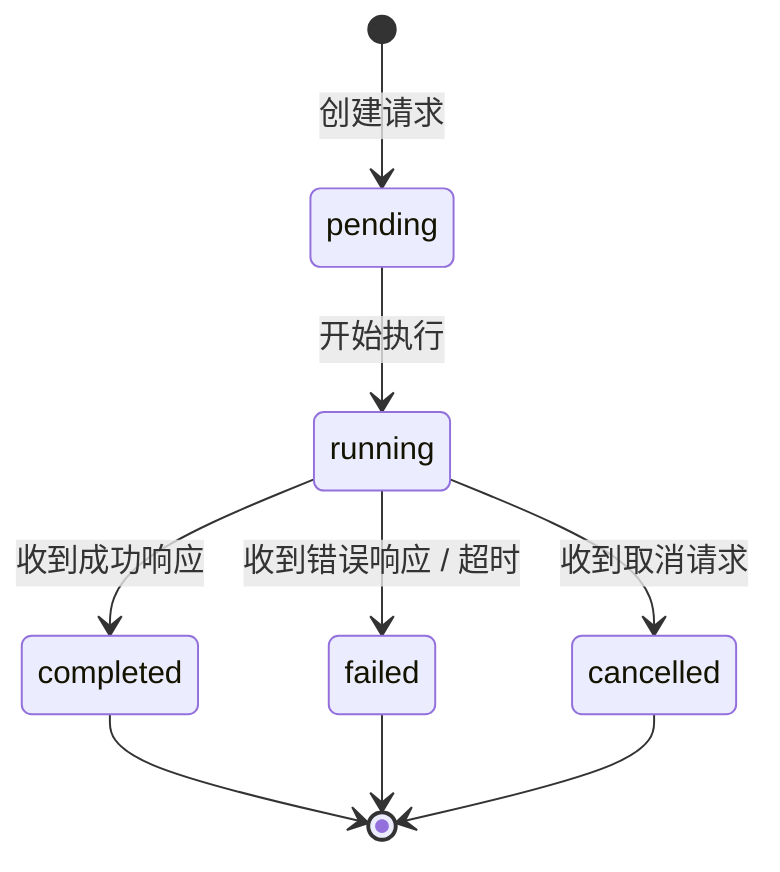
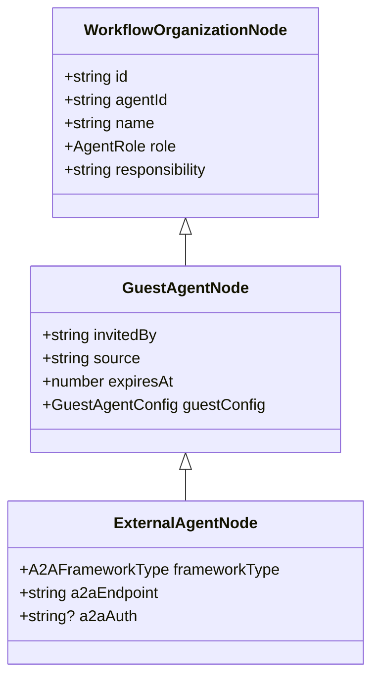

# A2A 协议 设计文档

## 概述

A2A 协议在 Cube Pets Office 现有的 MessageBus、动态组织生成、Mission Runtime 和 Guest Agent 机制基础上，新增跨框架 Agent 互操作层。该层包含三个核心模块：A2A 协议类型定义（共享层）、A2A Client（发起对外调用）和 A2A Server（接收外部调用），以及针对 CrewAI / LangGraph / Claude 的框架适配器。

核心设计原则：

- **协议优先**：基于 JSON-RPC 2.0 定义统一信封格式，所有框架适配器基于同一协议工作
- **复用 Guest Agent 基础设施**：ExternalAgentNode 继承 GuestAgentNode，复用注册、生命周期和 3D 渲染逻辑
- **最小侵入**：通过 MessageBus 元数据标记和路由扩展集成，不修改现有消息流核心逻辑
- **适配器模式**：新增外部框架只需实现一个 FrameworkAdapter，无需修改协议层

### 设计决策

1. **JSON-RPC 2.0 作为协议基础**：成熟标准，轻量级，与 MCP 协议风格一致，便于外部框架集成
2. **HTTP POST + SSE 双模式**：同步调用用 HTTP POST，流式响应用 SSE，避免 WebSocket 长连接管理复杂度
3. **复用 GuestAgentNode**：ExternalAgentNode 继承 GuestAgentNode 而非 WorkflowOrganizationNode，复用访客代理的注册、权限隔离和生命周期管理
4. **API Key 简单认证**：本轮不实现联邦身份，使用环境变量配置的 API Key 列表，满足基本安全需求
5. **上下文摘要传递**：跨框架调用传递上下文摘要（最大 2000 字符）而非完整上下文，降低带宽和隐私风险
6. **框架适配器为纯函数**：每个适配器将 A2A 参数转换为框架特定格式，无副作用，便于测试

## 架构



### 数据流

#### Cube 调用外部 Agent



#### 外部 Agent 调用 Cube Agent



## 组件与接口

### 1. A2A 协议类型定义 (`shared/a2a-protocol.ts`)

新建文件，定义所有 A2A 协议相关类型：

```typescript
/** 支持的外部框架类型 */
export type A2AFrameworkType = "crewai" | "langgraph" | "claude" | "custom";

/** 支持的 A2A 方法 */
export type A2AMethod = "a2a.invoke" | "a2a.stream" | "a2a.cancel";

/** A2A 协议信封（基于 JSON-RPC 2.0） */
export interface A2AEnvelope {
  jsonrpc: "2.0";
  method: A2AMethod;
  id: string;
  params: A2AInvokeParams;
  auth?: string;
}

/** 调用参数 */
export interface A2AInvokeParams {
  targetAgent: string;
  task: string;
  context: string; // 最大 2000 字符
  capabilities: string[];
  streamMode: boolean;
}

/** 调用响应 */
export interface A2AResponse {
  jsonrpc: "2.0";
  id: string;
  result?: A2AResult;
  error?: A2AError;
}

/** 成功结果 */
export interface A2AResult {
  output: string;
  artifacts: A2AArtifact[];
  metadata: Record<string, string>;
}

/** 产物 */
export interface A2AArtifact {
  name: string;
  type: string; // MIME type
  content: string; // base64 或文本
}

/** 错误信息 */
export interface A2AError {
  code: number;
  message: string;
  data?: unknown;
}

/** 流式响应块 */
export interface A2AStreamChunk {
  jsonrpc: "2.0";
  id: string;
  chunk: string;
  done: boolean;
}

/** A2A 会话状态 */
export type A2ASessionStatus =
  | "pending"
  | "running"
  | "completed"
  | "failed"
  | "cancelled";

/** A2A 会话 */
export interface A2ASession {
  sessionId: string;
  requestEnvelope: A2AEnvelope;
  status: A2ASessionStatus;
  frameworkType: A2AFrameworkType;
  startedAt: number;
  completedAt?: number;
  response?: A2AResponse;
  streamChunks: A2AStreamChunk[];
}

/** 外部 Agent 注册信息 */
export interface ExternalAgentRegistration {
  id: string;
  name: string;
  frameworkType: A2AFrameworkType;
  endpoint: string;
  auth?: string;
  capabilities: string[];
  description: string;
}

/** A2A 标准错误码 */
export const A2A_ERROR_CODES = {
  PARSE_ERROR: -32700,
  INVALID_REQUEST: -32600,
  METHOD_NOT_FOUND: -32601,
  INVALID_PARAMS: -32602,
  INTERNAL_ERROR: -32603,
  AUTH_FAILED: -32001,
  AGENT_NOT_FOUND: -32002,
  RATE_LIMITED: -32003,
  TIMEOUT: -32004,
  CANCELLED: -32005,
  FRAMEWORK_ERROR: -32006,
} as const;

/** 序列化 A2AEnvelope 为 JSON */
export function serializeEnvelope(envelope: A2AEnvelope): string;

/** 从 JSON 反序列化 A2AEnvelope */
export function deserializeEnvelope(json: string): A2AEnvelope;

/** 序列化 A2ASession 为 JSON */
export function serializeSession(session: A2ASession): string;

/** 从 JSON 反序列化 A2ASession */
export function deserializeSession(json: string): A2ASession;

/** 验证 context 长度不超过 2000 字符 */
export function validateContext(context: string): boolean;

/** 构建 A2AEnvelope 的工厂函数 */
export function createEnvelope(
  method: A2AMethod,
  params: A2AInvokeParams,
  auth?: string
): A2AEnvelope;
```

### 2. ExternalAgentNode 类型扩展 (`shared/organization-schema.ts`)

在现有文件中新增：

```typescript
/** 外部框架 Agent 节点（继承 GuestAgentNode） */
export interface ExternalAgentNode extends GuestAgentNode {
  frameworkType: A2AFrameworkType;
  a2aEndpoint: string;
  a2aAuth?: string;
}
```

### 3. A2A Client (`server/core/a2a-client.ts`)

```typescript
export class A2AClient {
  constructor(options: A2AClientOptions);

  /** 同步调用外部 Agent */
  async invoke(
    params: A2AInvokeParams,
    frameworkType: A2AFrameworkType,
    endpoint: string,
    auth?: string
  ): Promise<A2AResponse>;

  /** 流式调用外部 Agent */
  async invokeStream(
    params: A2AInvokeParams,
    frameworkType: A2AFrameworkType,
    endpoint: string,
    auth?: string
  ): AsyncGenerator<A2AStreamChunk>;

  /** 取消正在进行的调用 */
  async cancel(sessionId: string): Promise<void>;

  /** 获取所有活跃会话 */
  getActiveSessions(): A2ASession[];

  /** 获取会话详情 */
  getSession(sessionId: string): A2ASession | undefined;

  /** 终止超时会话 */
  terminateTimedOutSessions(): A2ASession[];
}

interface A2AClientOptions {
  maxConcurrentSessions: number; // 默认 10
  defaultTimeoutMs: number; // 默认 60000
  adapters: Map<A2AFrameworkType, FrameworkAdapter>;
}
```

### 4. A2A Server (`server/core/a2a-server.ts`)

```typescript
export class A2AServer {
  constructor(options: A2AServerOptions);

  /** 处理外部调用请求 */
  async handleInvoke(
    envelope: A2AEnvelope,
    apiKey: string
  ): Promise<A2AResponse>;

  /** 处理流式调用请求 */
  async handleStream(
    envelope: A2AEnvelope,
    apiKey: string
  ): AsyncGenerator<A2AStreamChunk>;

  /** 处理取消请求 */
  async handleCancel(sessionId: string, apiKey: string): Promise<void>;

  /** 获取可被外部调用的 Agent 列表 */
  listExposedAgents(): ExposedAgentInfo[];

  /** 验证 API Key */
  validateApiKey(key: string): boolean;

  /** 检查速率限制 */
  checkRateLimit(key: string): { allowed: boolean; retryAfterSeconds?: number };
}

interface A2AServerOptions {
  apiKeys: string[];
  rateLimitPerMinute: number; // 默认 60
  agentDirectory: AgentDirectory;
  messageBus: MessageBus;
}

interface ExposedAgentInfo {
  id: string;
  name: string;
  capabilities: string[];
  description: string;
}
```

### 5. 框架适配器 (`server/core/a2a-adapters/`)

每个适配器实现统一接口：

```typescript
/** 框架适配器接口 */
export interface FrameworkAdapter {
  frameworkType: A2AFrameworkType;

  /** 将 A2A 参数转换为框架特定的请求格式 */
  adaptRequest(params: A2AInvokeParams): {
    url: string;
    headers: Record<string, string>;
    body: unknown;
  };

  /** 将框架特定的响应转换为 A2A 响应 */
  adaptResponse(rawResponse: unknown): A2AResult;
}
```

三个适配器文件：

- `server/core/a2a-adapters/crewai.ts` — CrewAI task execution 格式
- `server/core/a2a-adapters/langgraph.ts` — LangGraph graph invoke 格式
- `server/core/a2a-adapters/claude.ts` — Claude Messages API 格式

```typescript
// crewai.ts
export class CrewAIAdapter implements FrameworkAdapter {
  frameworkType = "crewai" as const;
  adaptRequest(params: A2AInvokeParams): {
    url: string;
    headers: Record<string, string>;
    body: unknown;
  };
  adaptResponse(raw: unknown): A2AResult;
}

// langgraph.ts
export class LangGraphAdapter implements FrameworkAdapter {
  frameworkType = "langgraph" as const;
  adaptRequest(params: A2AInvokeParams): {
    url: string;
    headers: Record<string, string>;
    body: unknown;
  };
  adaptResponse(raw: unknown): A2AResult;
}

// claude.ts
export class ClaudeAdapter implements FrameworkAdapter {
  frameworkType = "claude" as const;
  adaptRequest(params: A2AInvokeParams): {
    url: string;
    headers: Record<string, string>;
    body: unknown;
  };
  adaptResponse(raw: unknown): A2AResult;
}
```

### 6. MessageBus A2A 路由扩展 (`server/core/message-bus.ts`)

在现有 MessageBus 类上新增方法：

```typescript
class MessageBus {
  // 现有方法保持不变...

  /** 发送 A2A 消息（内部 Agent → 外部 Agent） */
  async sendA2A(
    fromId: string,
    toExternalId: string,
    content: string,
    workflowId: string,
    metadata?: A2AMessageMetadata
  ): Promise<MessageRow>;

  /** 投递 A2A 响应（外部 Agent → 内部 Agent） */
  async deliverA2AResponse(
    sessionId: string,
    response: A2AResponse,
    workflowId: string
  ): Promise<void>;
}

interface A2AMessageMetadata {
  a2a: true;
  frameworkType: A2AFrameworkType;
  sessionId: string;
  direction: "outbound" | "inbound";
}
```

### 7. A2A API 路由 (`server/routes/a2a.ts`)

```
POST   /api/a2a/invoke    — 外部 Agent 调用 Cube Agent（同步）
POST   /api/a2a/stream    — 外部 Agent 调用 Cube Agent（流式 SSE）
POST   /api/a2a/cancel    — 取消正在进行的调用
GET    /api/a2a/agents    — 列出可被外部调用的 Cube Agent
GET    /api/a2a/sessions  — 查询活跃 A2A 会话列表
```

### 8. 3D 可视化组件

#### Zustand Store (`client/src/lib/a2a-store.ts`)

```typescript
interface A2AState {
  activeSessions: A2ASession[];
  a2aMessages: A2AMessageEvent[];
  addSession(session: A2ASession): void;
  updateSession(sessionId: string, update: Partial<A2ASession>): void;
  removeSession(sessionId: string): void;
  addA2AMessage(event: A2AMessageEvent): void;
}
```

#### 跨框架粒子流组件 (`client/src/components/three/CrossFrameworkParticles.tsx`)

```typescript
/** 渲染跨框架 A2A 调用粒子流动画 */
export function CrossFrameworkParticles(): JSX.Element;
```

视觉规则：

- 菱形粒子 + 渐变色轨迹（区别于跨 Pod 的圆形粒子）
- CrewAI 调用：蓝色（#3B82F6）
- LangGraph 调用：紫色（#8B5CF6）
- Claude 调用：橙色（#F59E0B）
- Custom 调用：灰色（#6B7280）
- 活跃会话在外部 Agent 节点上显示框架类型标签
- 完成时绿色脉冲，失败时红色脉冲

## 数据模型

### A2ASession 状态机



### ExternalAgentNode 继承关系



### 消息元数据扩展

A2A 消息在 MessageBus 中的元数据：

```typescript
{
  a2a: true,
  frameworkType: "crewai" | "langgraph" | "claude" | "custom",
  sessionId: string,
  direction: "outbound" | "inbound"
}
```

### 速率限制数据结构

内存中维护，使用滑动窗口计数器：

```typescript
interface RateLimitEntry {
  apiKey: string;
  windowStart: number; // 当前窗口起始时间戳
  count: number; // 当前窗口内请求计数
}

Map<string, RateLimitEntry>; // key: apiKey
```

### 环境变量

| 变量名                      | 默认值 | 说明                            |
| --------------------------- | ------ | ------------------------------- |
| A2A_API_KEYS                | ""     | 允许的 API Key 列表（逗号分隔） |
| A2A_RATE_LIMIT_PER_MINUTE   | 60     | 每个 API Key 每分钟最大调用次数 |
| A2A_DEFAULT_TIMEOUT_MS      | 60000  | A2A 调用默认超时时间            |
| A2A_MAX_CONCURRENT_SESSIONS | 10     | 最大并发 A2A 会话数             |
| A2A_CONTEXT_MAX_LENGTH      | 2000   | 上下文摘要最大字符数            |

## 正确性属性

_正确性属性是系统在所有有效执行中都应保持为真的特征或行为——本质上是关于系统应该做什么的形式化陈述。属性是人类可读规范与机器可验证正确性保证之间的桥梁。_

### Property 1: A2AEnvelope 序列化往返一致性

_For any_ 合法的 A2AEnvelope 对象，调用 `serializeEnvelope` 后再调用 `deserializeEnvelope`，应产生与原始对象深度相等的结果。

**Validates: Requirements 1.6**

### Property 2: A2ASession 序列化往返一致性

_For any_ 合法的 A2ASession 对象，调用 `serializeSession` 后再调用 `deserializeSession`，应产生与原始对象深度相等的结果。

**Validates: Requirements 9.5**

### Property 3: 上下文长度验证

_For any_ 字符串，`validateContext` 应在字符串长度不超过 2000 时返回 true，超过 2000 时返回 false。当 A2A_Client 构建调用请求时，提取的上下文摘要长度不应超过 2000 字符。

**Validates: Requirements 1.2, 9.1**

### Property 4: 会话失败状态标记

_For any_ A2ASession，当调用超时或收到错误响应时，`terminateTimedOutSessions` 或错误处理逻辑应将该会话的 status 设为 "failed"。已超时的会话（startedAt + timeoutMs < currentTime）应被标记为 failed，未超时的会话不应被影响。

**Validates: Requirements 2.5, 9.4**

### Property 5: 并发会话数量限制

_For any_ 正整数 N 作为 maxConcurrentSessions 配置值，A2A_Client 中活跃会话数不应超过 N。当活跃会话数已达 N 时，新的调用请求应被拒绝。

**Validates: Requirements 2.6**

### Property 6: 无效认证令牌拒绝

_For any_ 不在已配置 API Key 列表中的字符串（包括空字符串），`validateApiKey` 应返回 false。对于列表中的有效 Key，应返回 true。

**Validates: Requirements 3.6, 5.1**

### Property 7: 不存在的 Agent 返回错误

_For any_ 不在 AgentDirectory 中注册的 Agent ID，A2A_Server 的 `handleInvoke` 应返回包含 AGENT_NOT_FOUND 错误码的 A2AResponse。

**Validates: Requirements 3.7**

### Property 8: 速率限制执行

_For any_ API Key 和正整数 R 作为 rateLimitPerMinute 配置值，在同一分钟窗口内第 R+1 次调用 `checkRateLimit` 应返回 `{ allowed: false, retryAfterSeconds: N }`（N > 0）。前 R 次调用应返回 `{ allowed: true }`。

**Validates: Requirements 5.4, 5.5**

### Property 9: 框架适配器请求格式正确性

_For any_ 合法的 A2AInvokeParams 和支持的框架类型（crewai / langgraph / claude），对应的 FrameworkAdapter.adaptRequest 应返回包含非空 url、headers 和 body 的对象。CrewAI 的 body 应包含 agent role 和 task description；LangGraph 的 body 应包含 input state；Claude 的 body 应包含 messages 数组。

**Validates: Requirements 4.1, 4.2, 4.3**

### Property 10: 框架适配器响应归一化

_For any_ 框架适配器和合法的框架特定响应对象，`adaptResponse` 应返回包含 output（string）和 artifacts（数组）字段的 A2AResult 对象。

**Validates: Requirements 4.4**

### Property 11: 不支持的框架类型拒绝

_For any_ 不在 ["crewai", "langgraph", "claude", "custom"] 中的字符串作为 frameworkType，系统应返回错误并包含支持的框架列表。

**Validates: Requirements 4.5**

### Property 12: 出站信封包含认证令牌

_For any_ 配置了认证令牌的外部 Agent 调用，A2A_Client 构建的 A2AEnvelope 的 auth 字段应等于配置的令牌值。

**Validates: Requirements 5.3**

### Property 13: ExternalAgentNode 快照兼容性

_For any_ 合法的 ExternalAgentNode，将其加入 WorkflowOrganizationSnapshot 的 nodes 数组后，快照的序列化和反序列化应正常工作，且 nodes 数组中应包含该 ExternalAgentNode。

**Validates: Requirements 6.3**

### Property 14: A2A 消息路由与元数据正确性

_For any_ 发送给 ExternalAgentNode 的消息，MessageBus 应将其路由到 A2A_Client，且消息元数据应包含 `a2a: true`、正确的 `frameworkType` 和 `sessionId`。

**Validates: Requirements 7.1, 7.3**

### Property 15: 可调用 Agent 列表完整性

_For any_ AgentDirectory 中标记为可外部调用的 Agent 集合，`listExposedAgents` 返回的列表应包含所有这些 Agent，且每个条目包含 id、name、capabilities 和 description 字段。

**Validates: Requirements 3.5**

## 错误处理

| 场景                    | 错误码                    | 处理方式                                       |
| ----------------------- | ------------------------- | ---------------------------------------------- |
| A2A 请求 JSON 解析失败  | -32700 (PARSE_ERROR)      | 返回 HTTP 400，JSON-RPC 错误响应               |
| A2A 请求缺少必填字段    | -32600 (INVALID_REQUEST)  | 返回 HTTP 400，JSON-RPC 错误响应               |
| 不支持的 A2A method     | -32601 (METHOD_NOT_FOUND) | 返回 HTTP 400，JSON-RPC 错误响应               |
| 参数类型或值无效        | -32602 (INVALID_PARAMS)   | 返回 HTTP 400，JSON-RPC 错误响应               |
| 服务端内部错误          | -32603 (INTERNAL_ERROR)   | 返回 HTTP 500，JSON-RPC 错误响应（不暴露堆栈） |
| API Key 无效或缺失      | -32001 (AUTH_FAILED)      | 返回 HTTP 401，JSON-RPC 错误响应               |
| 目标 Agent 不存在       | -32002 (AGENT_NOT_FOUND)  | 返回 HTTP 404，JSON-RPC 错误响应               |
| 速率限制超出            | -32003 (RATE_LIMITED)     | 返回 HTTP 429，包含 retryAfter 秒数            |
| 调用超时                | -32004 (TIMEOUT)          | 标记会话为 failed，通知调用方                  |
| 调用被取消              | -32005 (CANCELLED)        | 标记会话为 cancelled，清理资源                 |
| 外部框架返回错误        | -32006 (FRAMEWORK_ERROR)  | 包装为 A2AError 返回，保留原始错误信息         |
| 并发会话数达上限        | -32602 (INVALID_PARAMS)   | 返回错误，提示当前活跃会话数和上限             |
| 不支持的框架类型        | -32602 (INVALID_PARAMS)   | 返回错误，包含支持的框架列表                   |
| 外部 Agent LLM 调用失败 | -32006 (FRAMEWORK_ERROR)  | 记录错误日志，通知上级 Manager                 |
| 上下文摘要超长          | 自动截断                  | 截断到 2000 字符，不返回错误                   |

## 测试策略

### 属性测试（Property-Based Testing）

使用 `fast-check` 库进行属性测试，每个属性至少运行 100 次迭代。

需要实现的生成器：

- `arbitraryA2AInvokeParams`: 生成随机的 A2A 调用参数（随机 targetAgent、task、context、capabilities、streamMode）
- `arbitraryA2AEnvelope`: 生成随机的 A2A 信封（基于 arbitraryA2AInvokeParams）
- `arbitraryA2AResponse`: 生成随机的 A2A 响应（包含 result 或 error）
- `arbitraryA2ASession`: 生成随机的 A2A 会话（随机状态、时间戳、请求和响应）
- `arbitraryA2AStreamChunk`: 生成随机的流式响应块
- `arbitraryExternalAgentNode`: 生成随机的外部 Agent 节点
- `arbitraryFrameworkType`: 从支持的框架类型中随机选择

属性测试覆盖：

- **Feature: a2a-protocol, Property 1**: A2AEnvelope 序列化往返一致性
- **Feature: a2a-protocol, Property 2**: A2ASession 序列化往返一致性
- **Feature: a2a-protocol, Property 3**: 上下文长度验证
- **Feature: a2a-protocol, Property 4**: 会话失败状态标记
- **Feature: a2a-protocol, Property 5**: 并发会话数量限制
- **Feature: a2a-protocol, Property 6**: 无效认证令牌拒绝
- **Feature: a2a-protocol, Property 7**: 不存在的 Agent 返回错误
- **Feature: a2a-protocol, Property 8**: 速率限制执行
- **Feature: a2a-protocol, Property 9**: 框架适配器请求格式正确性
- **Feature: a2a-protocol, Property 10**: 框架适配器响应归一化
- **Feature: a2a-protocol, Property 11**: 不支持的框架类型拒绝
- **Feature: a2a-protocol, Property 12**: 出站信封包含认证令牌
- **Feature: a2a-protocol, Property 13**: ExternalAgentNode 快照兼容性
- **Feature: a2a-protocol, Property 14**: A2A 消息路由与元数据正确性
- **Feature: a2a-protocol, Property 15**: 可调用 Agent 列表完整性

### 单元测试

单元测试聚焦于具体示例和边界情况：

- 各框架适配器对最小参数的输出验证
- API 路由的 400/401/404/429/500 错误响应
- 流式响应的 SSE 格式正确性
- 空 capabilities 列表、空 context 的边界情况
- 会话状态机转换的具体示例
- Socket.IO 事件发射验证

### 测试不覆盖的范围

- 3D 渲染效果（需求 8.1-8.5）：需要手动视觉验证
- 外部框架的实际 HTTP 调用：使用 mock 测试调用流程
- Socket.IO 实时性能（需求 8.4 的 200ms 要求）：需要端到端性能测试
- 动态组织生成器的 LLM 解析质量（需求 6.2）：LLM 输出非确定性，通过 mock 测试调用流程

### 测试配置

- 属性测试库：`fast-check`（项目已使用 vitest，fast-check 与 vitest 兼容）
- 每个属性测试最少 100 次迭代
- 每个属性测试必须以注释标注对应的设计属性编号
- 标注格式：`// Feature: a2a-protocol, Property N: {property_text}`
- 测试文件：`server/tests/a2a-protocol.test.ts`
