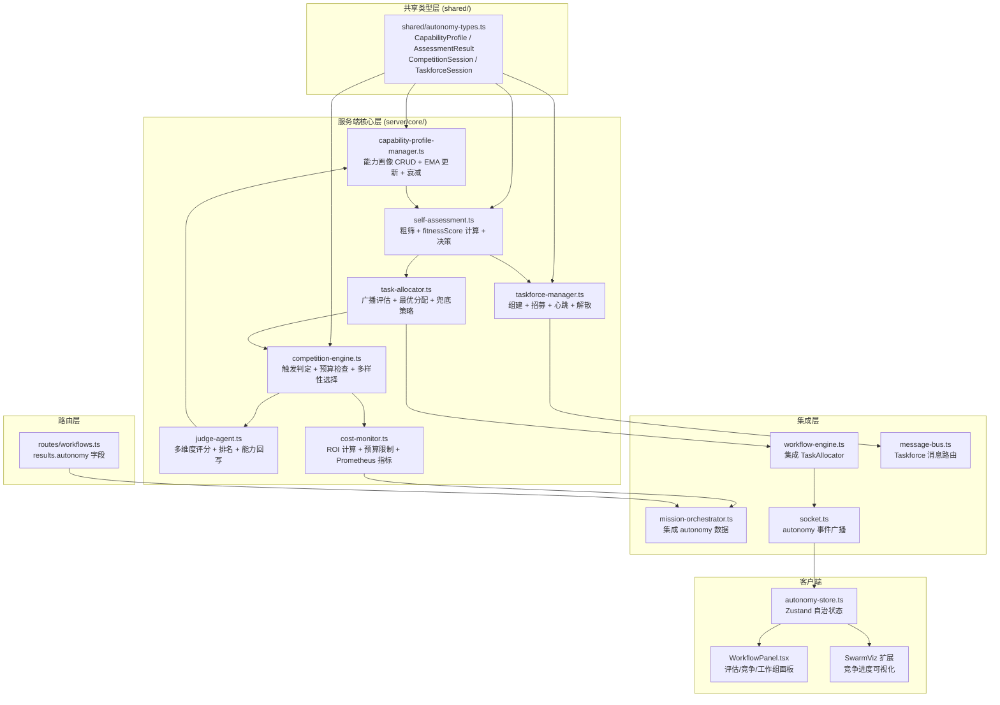
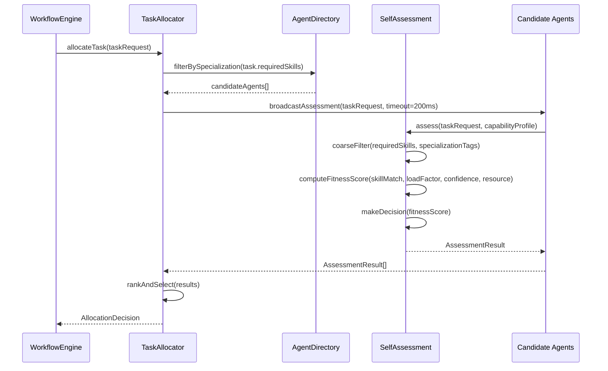
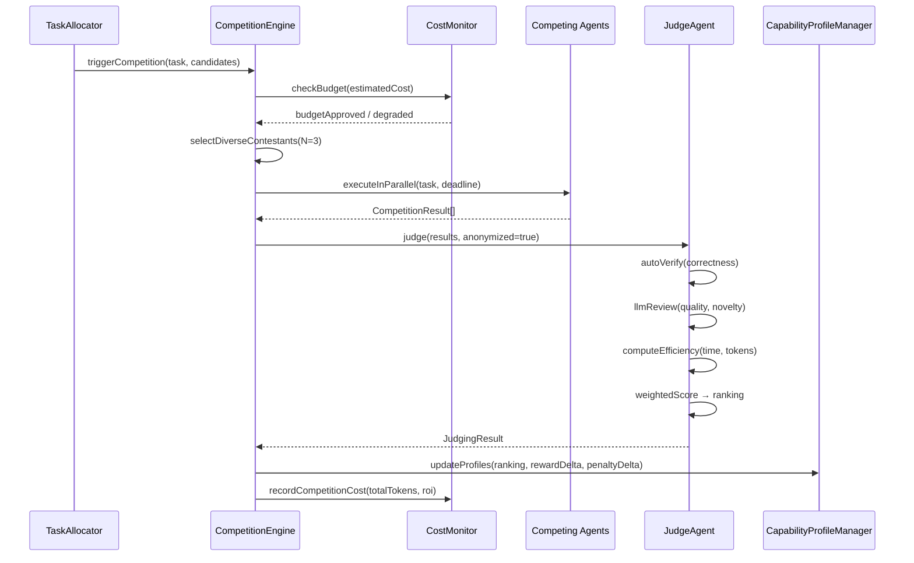
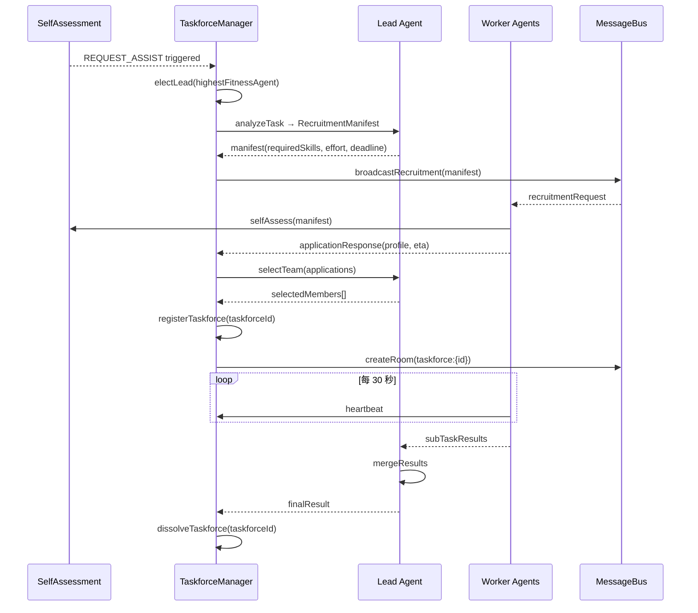
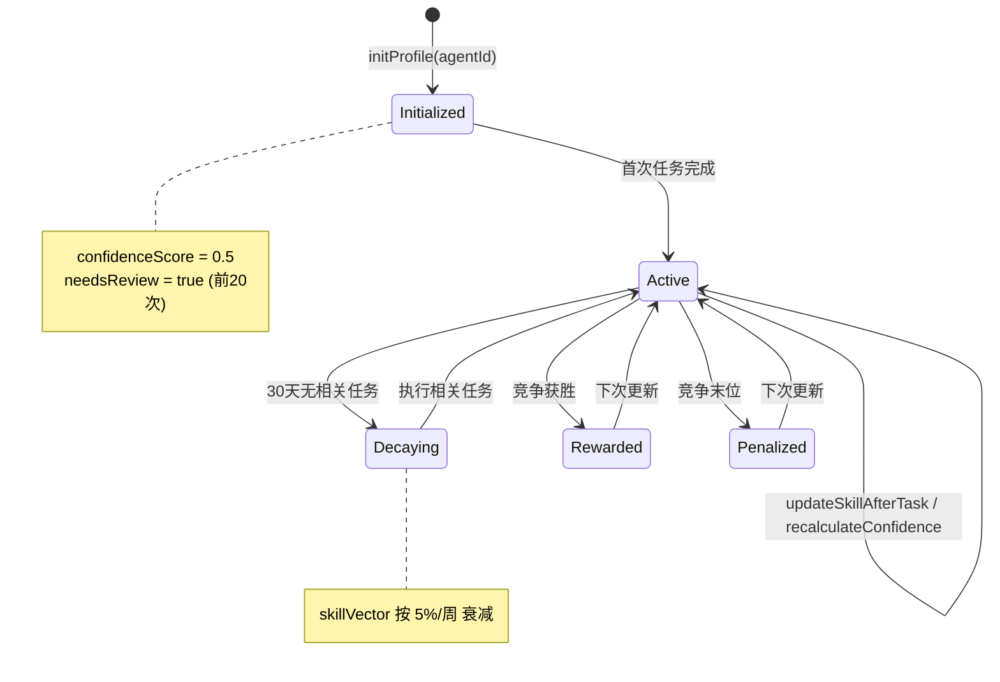
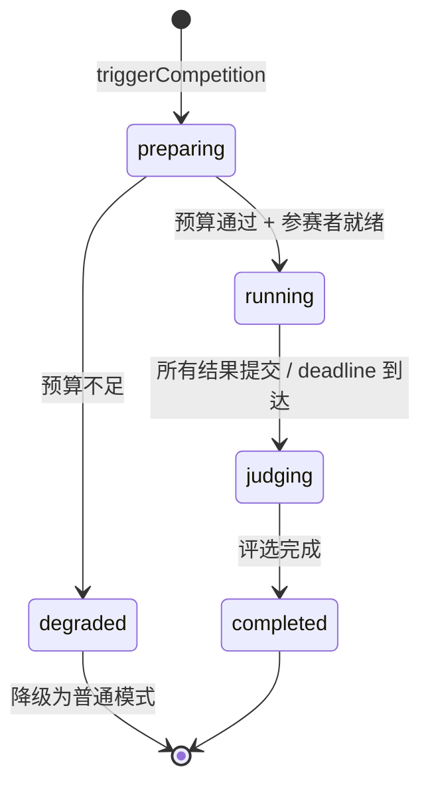
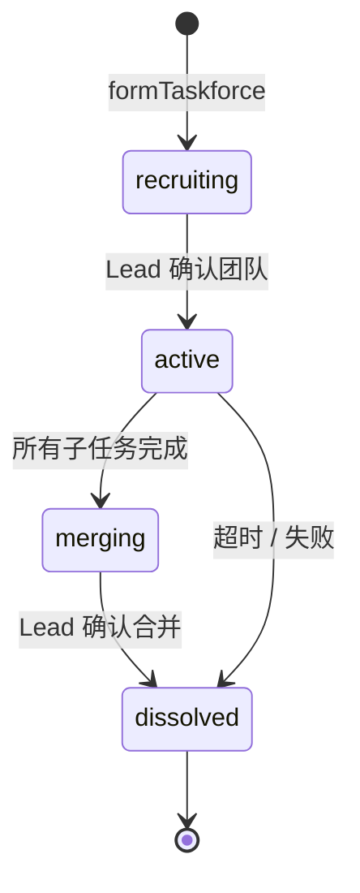

# 设计文档：Agent 自治能力升级

## 概述

本设计在 Cube Brain 现有的 WorkflowEngine、AgentDirectory、MessageBus、CapabilityRegistry 和 MissionOrchestrator 基础上，新增四个核心模块：

1. **CapabilityProfile 管理器** — 扩展现有 `capability-registry.ts`，为每个 Agent 维护实时能力画像
2. **SelfAssessment 模块** — Agent 接收任务时的胜任度自评估引擎
3. **CompetitionEngine** — 高价值任务的多 Agent 竞争执行与裁判评选
4. **TaskforceManager** — 动态协作网络的临时工作组生命周期管理

### 设计决策

1. **扩展而非替换 CapabilityRegistry**：现有 `capability-registry.ts` 已实现 EMA 置信度更新，新模块在其基础上扩展 CapabilityProfile 数据结构，复用 EMA 更新逻辑
2. **纯计算自评估**：fitnessScore 计算为纯数学运算（余弦相似度 + 加权求和），不涉及 LLM 调用，确保 < 50ms 性能要求
3. **竞争执行复用 Lobster Executor**：参赛 Agent 的隔离执行复用现有 Docker 执行器基础设施，每个参赛者分配独立容器
4. **Taskforce 基于 WebSocket Room**：工作组内通信复用 Socket.IO 的 Room 机制，创建以 `taskforce:{taskforceId}` 命名的子房间
5. **全局开关设计**：`autonomy.enabled` 开关控制所有自治能力，关闭时 TaskAllocator 回退到现有的静态分配逻辑（WorkflowEngine 原有的 direction → planning 流程）
6. **Judge Agent 复用 meta_audit 模式**：裁判评选复用现有工作流引擎的 LLM 匿名评审模式，去掉 Agent 标识后交给高能力 LLM 打分

## 架构



### 数据流

#### 自评估与智能分配流程



#### 竞争执行与裁判评选流程



#### 临时工作组生命周期



## 组件与接口

### 1. 共享类型定义 (`shared/autonomy-types.ts`)

```typescript
/** Agent 能力画像 */
export interface CapabilityProfile {
  agentId: string;
  skillVector: Map<string, number>;       // 技能类别 → 熟练度 0.0-1.0
  loadFactor: number;                      // activeTasks / maxConcurrentTasks
  confidenceScore: number;                 // 综合置信度
  resourceQuota: ResourceQuota;
  specializationTags: string[];
  avgLatencyMs: Map<string, number>;       // 技能类别 → 平均耗时 ms
  taskHistory: RingBuffer<TaskHistoryEntry>; // 最近 100 次任务
  needsReview: boolean;
  completedTaskCount: number;
  lastUpdatedAt: number;
}

export interface ResourceQuota {
  remainingTokenBudget: number;
  memoryMb: number;
  cpuPercent: number;
}

export interface TaskHistoryEntry {
  taskId: string;
  skillCategory: string;
  qualityScore: number;    // 0.0-1.0
  success: boolean;
  completedAt: number;
}

/** 自评估结果 */
export type AssessmentDecision =
  | "ACCEPT"
  | "ACCEPT_WITH_CAVEAT"
  | "REQUEST_ASSIST"
  | "REJECT_AND_REFER";

export interface AssessmentResult {
  agentId: string;
  taskId: string;
  fitnessScore: number;
  decision: AssessmentDecision;
  reason: string;
  referralList: string[];   // 仅 REJECT_AND_REFER 时有值
  assessedAt: number;
  durationMs: number;
}

/** 自评估权重配置 */
export interface AssessmentWeights {
  w1_skillMatch: number;    // 默认 0.4
  w2_loadFactor: number;    // 默认 0.2
  w3_confidence: number;    // 默认 0.25
  w4_resource: number;      // 默认 0.15
}

/** 分配决策 */
export type AllocationStrategy =
  | "DIRECT_ASSIGN"
  | "CAVEAT_ASSIGN"
  | "TASKFORCE"
  | "FORCE_ASSIGN";

export interface AllocationDecision {
  taskId: string;
  strategy: AllocationStrategy;
  assignedAgentId: string;
  assessments: AssessmentResult[];
  reason: string;
  forceAssignReason?: string;
  timestamp: number;
}

/** 竞争执行会话 */
export interface CompetitionSession {
  id: string;
  taskId: string;
  contestants: ContestantEntry[];
  status: "preparing" | "running" | "judging" | "completed" | "degraded";
  deadline: number;
  budgetApproved: boolean;
  degradationReason?: string;
  judgingResult?: JudgingResult;
  competitionCost?: CompetitionCost;
  startedAt: number;
  completedAt?: number;
}

export interface ContestantEntry {
  agentId: string;
  isExternal: boolean;
  result?: string;
  submittedAt?: number;
  tokenConsumed: number;
  timedOut: boolean;
}

/** 裁判评选结果 */
export interface JudgingResult {
  scores: JudgingScore[];
  ranking: string[];          // agentId 按总分降序
  rationaleText: string;
  winnerId: string;
  mergeRequired: boolean;     // Top1 与 Top2 差 < 5%
}

export interface JudgingScore {
  agentId: string;
  correctness: number;        // 权重 0.35
  quality: number;            // 权重 0.30
  efficiency: number;         // 权重 0.20
  novelty: number;            // 权重 0.15
  totalWeighted: number;
}

export interface CompetitionCost {
  totalTokens: number;
  estimatedNormalTokens: number;
  roi: number;                // qualityScore / normalQualityEstimate
}

/** 工作组会话 */
export interface TaskforceSession {
  taskforceId: string;
  taskId: string;
  leadAgentId: string;
  members: TaskforceMember[];
  status: "recruiting" | "active" | "merging" | "dissolved";
  recruitmentManifest?: RecruitmentManifest;
  subTasks: SubTask[];
  createdAt: number;
  dissolvedAt?: number;
}

export interface TaskforceMember {
  agentId: string;
  role: "lead" | "worker" | "reviewer";
  joinedAt: number;
  lastHeartbeat: number;
  online: boolean;
}

export interface RecruitmentManifest {
  requiredSkills: string[];
  estimatedEffort: string;
  deadline: number;
  taskDescription: string;
}

export interface SubTask {
  id: string;
  assignedTo: string;
  description: string;
  status: "assigned" | "in_progress" | "review" | "done" | "failed";
  reviewerId?: string;
  result?: string;
}

/** Taskforce 消息类型 */
export type TaskforceMessageType =
  | "TASK_ASSIGN"
  | "PROGRESS_UPDATE"
  | "HELP_REQUEST"
  | "REVIEW_REQUEST"
  | "REVIEW_RESULT"
  | "MERGE_REQUEST";

/** 自治能力全局配置 */
export interface AutonomyConfig {
  enabled: boolean;
  assessmentWeights: AssessmentWeights;
  competition: {
    defaultContestantCount: number;   // 默认 3，范围 2-5
    maxDeadlineMs: number;            // 默认 300000
    budgetRatio: number;              // 默认 0.3
  };
  taskforce: {
    heartbeatIntervalMs: number;      // 默认 30000
    maxMissedHeartbeats: number;      // 默认 3
  };
  skillDecay: {
    inactiveDays: number;             // 默认 30
    decayRatePerWeek: number;         // 默认 0.05
  };
}

/** API 返回的 autonomy 数据 */
export interface AutonomyData {
  assessments: AssessmentResult[];
  competitions: CompetitionSession[];
  taskforces: TaskforceSession[];
}
```

### 2. RingBuffer 工具类 (`shared/ring-buffer.ts`)

```typescript
export class RingBuffer<T> {
  private buffer: (T | undefined)[];
  private head: number = 0;
  private count: number = 0;

  constructor(private readonly capacity: number) {
    this.buffer = new Array(capacity);
  }

  push(item: T): void;
  toArray(): T[];
  get length(): number;

  /** 序列化为 JSON 兼容格式 */
  toJSON(): { capacity: number; items: T[] };

  /** 从 JSON 恢复 */
  static fromJSON<T>(data: { capacity: number; items: T[] }): RingBuffer<T>;
}
```

### 3. CapabilityProfileManager (`server/core/capability-profile-manager.ts`)

扩展现有 `capability-registry.ts`，新增完整的 CapabilityProfile 管理：

```typescript
export class CapabilityProfileManager {
  private profiles: Map<string, CapabilityProfile>;
  private config: AutonomyConfig;

  constructor(config: AutonomyConfig);

  /** 获取 Agent 能力画像 */
  getProfile(agentId: string): CapabilityProfile | undefined;

  /** 初始化新 Agent 的能力画像 */
  initProfile(agentId: string, specializationTags: string[]): CapabilityProfile;

  /** 任务完成后更新 skillVector（EMA 公式） */
  updateSkillAfterTask(agentId: string, skillCategory: string, taskQuality: number): void;

  /** 更新 loadFactor */
  incrementLoad(agentId: string): void;
  decrementLoad(agentId: string): void;

  /** 重新计算 confidenceScore */
  recalculateConfidence(agentId: string): void;

  /** 执行技能衰减（定时调用） */
  applySkillDecay(): void;

  /** 竞争结果回写 */
  applyCompetitionReward(agentId: string, delta: number): void;

  /** 序列化/反序列化（持久化到 Mission 数据源） */
  serialize(): string;
  static deserialize(json: string): Map<string, CapabilityProfile>;
}
```

### 4. SelfAssessment 模块 (`server/core/self-assessment.ts`)

```typescript
export class SelfAssessment {
  constructor(
    profileManager: CapabilityProfileManager,
    config: AutonomyConfig
  );

  /** 执行完整自评估 */
  assess(agentId: string, taskRequest: TaskRequest): AssessmentResult;

  /** 粗筛：specializationTags 交集检查 */
  coarseFilter(agentTags: string[], requiredSkills: string[]): boolean;

  /** 计算加权余弦相似度 */
  computeSkillMatch(agentSkills: Map<string, number>, requiredSkills: Map<string, number>): number;

  /** 计算 fitnessScore */
  computeFitnessScore(
    skillMatch: number,
    loadFactor: number,
    confidenceScore: number,
    resourceAdequacy: number,
    weights: AssessmentWeights
  ): number;

  /** 基于 fitnessScore 做出决策 */
  makeDecision(fitnessScore: number): AssessmentDecision;

  /** 生成推荐列表（REJECT_AND_REFER 时） */
  generateReferralList(taskRequest: TaskRequest, excludeAgentId: string, maxCount: number): string[];
}
```

### 5. TaskAllocator (`server/core/task-allocator.ts`)

```typescript
export class TaskAllocator {
  constructor(
    selfAssessment: SelfAssessment,
    profileManager: CapabilityProfileManager,
    agentDirectory: AgentDirectory,
    config: AutonomyConfig
  );

  /** 智能分配任务 */
  async allocateTask(taskRequest: TaskRequest): Promise<AllocationDecision>;

  /** 广播评估请求并收集结果 */
  async broadcastAssessment(
    taskRequest: TaskRequest,
    candidates: string[],
    timeoutMs: number
  ): Promise<AssessmentResult[]>;

  /** 基于评估结果选择最优 Agent */
  selectBestAgent(results: AssessmentResult[]): AllocationDecision;

  /** 兜底策略：强制分配 */
  forceAssign(results: AssessmentResult[], taskRequest: TaskRequest): AllocationDecision;

  /** 更新 Agent 拒绝率滑动窗口 */
  updateRejectRate(agentId: string, rejected: boolean): void;

  /** 检查是否需要触发高拒绝率告警 */
  checkRejectRateAlert(agentId: string): boolean;
}
```

### 6. CompetitionEngine (`server/core/competition-engine.ts`)

```typescript
export class CompetitionEngine {
  constructor(
    profileManager: CapabilityProfileManager,
    costMonitor: CostMonitor,
    config: AutonomyConfig
  );

  /** 判断是否应触发竞争模式 */
  shouldTrigger(task: TaskRequest, bestFitness: number): boolean;

  /** 计算任务不确定性评分 */
  computeUncertainty(task: TaskRequest, bestFitness: number): number;

  /** 多样性优先选择参赛者 */
  selectContestants(
    candidates: string[],
    count: number,
    profileManager: CapabilityProfileManager
  ): string[];

  /** 执行竞争 */
  async runCompetition(
    task: TaskRequest,
    contestants: string[],
    deadline: number
  ): Promise<CompetitionSession>;

  /** 检查外部 Agent 安全级别 */
  checkDataSecurity(agentId: string, task: TaskRequest): boolean;
}
```

### 7. JudgeAgent (`server/core/judge-agent.ts`)

```typescript
export class JudgeAgent {
  private judgeConfidenceScore: number = 1.0;

  constructor(llmProvider: LLMProvider, config: AutonomyConfig);

  /** 执行完整评选流程 */
  async judge(session: CompetitionSession): Promise<JudgingResult>;

  /** 自动化验证（correctness 维度） */
  async verifyCorrectness(result: string, constraints: string[]): Promise<number>;

  /** LLM 匿名评审（quality + novelty 维度） */
  async llmReview(results: { id: string; content: string }[]): Promise<Map<string, { quality: number; novelty: number; rationale: string }>>;

  /** 计算效率分（efficiency 维度） */
  computeEfficiency(contestants: ContestantEntry[]): Map<string, number>;

  /** 加权计算总分 */
  computeWeightedScores(scores: JudgingScore[]): JudgingScore[];

  /** 检查是否需要合并（差距 < 5%） */
  checkMergeRequired(scores: JudgingScore[]): boolean;

  /** 用户推翻评选结果时下调置信度 */
  onJudgmentOverridden(): void;
}
```

### 8. TaskforceManager (`server/core/taskforce-manager.ts`)

```typescript
export class TaskforceManager {
  private activeSessions: Map<string, TaskforceSession>;

  constructor(
    selfAssessment: SelfAssessment,
    profileManager: CapabilityProfileManager,
    messageBus: RuntimeMessageBus,
    config: AutonomyConfig
  );

  /** 组建工作组 */
  async formTaskforce(task: TaskRequest, triggerAgentId: string): Promise<TaskforceSession>;

  /** 选举 Lead */
  electLead(candidates: AssessmentResult[]): string;

  /** 处理招募响应 */
  async processApplications(
    taskforceId: string,
    applications: TaskforceApplication[]
  ): Promise<TaskforceMember[]>;

  /** 处理心跳 */
  handleHeartbeat(taskforceId: string, agentId: string): void;

  /** 检查离线成员并重新分配 */
  checkOfflineMembers(taskforceId: string): string[];

  /** 解散工作组 */
  async dissolveTaskforce(taskforceId: string): Promise<void>;

  /** 获取活跃工作组 */
  getActiveTaskforces(): TaskforceSession[];
}
```

### 9. CostMonitor (`server/core/cost-monitor.ts`)

```typescript
export class CostMonitor {
  constructor(config: AutonomyConfig);

  /** 检查竞争预算 */
  checkCompetitionBudget(
    estimatedTokens: number,
    missionRemainingBudget: number
  ): { approved: boolean; reason?: string };

  /** 记录竞争成本 */
  recordCompetitionCost(session: CompetitionSession): CompetitionCost;

  /** 计算 ROI */
  computeROI(winnerQuality: number, normalEstimate: number): number;

  /** 获取 Prometheus 指标 */
  getMetrics(): AutonomyMetrics;

  /** 检查是否应禁用竞争 */
  isCompetitionDisabled(missionId: string): boolean;
}
```

## 数据模型

### CapabilityProfile 生命周期



### CompetitionSession 状态机



### TaskforceSession 状态机



### 数据持久化策略

| 数据 | 存储位置 | 生命周期 |
|------|----------|----------|
| CapabilityProfile | 内存 + Mission 原生数据源快照 | 跨 Mission 持久化 |
| AssessmentResult | ExecutionPlan 调试日志 | 随 Workflow 归档 |
| CompetitionSession | Mission 原生数据源 | 随 Mission 归档 |
| JudgingResult | Mission 原生数据源 | 随 Mission 归档 |
| TaskforceSession | Mission 原生数据源 | 随 Mission 归档 |
| CompetitionCost | Mission 原生数据源 + Prometheus | 永久保留指标 |
| AutonomyConfig | .env + 配置中心 | 全局配置 |

### 关键公式

**EMA 技能更新**：
```
newSkill = 0.1 * taskQuality + 0.9 * oldSkill
```

**fitnessScore 计算**：
```
fitness = 0.4 * skillMatch + 0.2 * (1 - loadFactor) + 0.25 * confidenceScore + 0.15 * resourceAdequacy
```

**加权余弦相似度**：
```
skillMatch = Σ(agent[i] * task[i]) / (||agent|| * ||task||)
```

**裁判加权总分**：
```
total = 0.35 * correctness + 0.30 * quality + 0.20 * efficiency + 0.15 * novelty
```

**不确定性评分**：
```
uncertainty = w_fail * historicalFailRate + w_fit * (1 - bestFitnessScore) + w_ambig * descriptionAmbiguity
```

**技能衰减**：
```
decayedSkill = skill * (1 - 0.05) ^ weeksInactive  // 每周衰减 5%
```

## 正确性属性

*属性是系统在所有合法执行中都应保持为真的特征或行为——本质上是对系统应做什么的形式化陈述。属性是人类可读规范与机器可验证正确性保证之间的桥梁。*

### Property 1: CapabilityProfile 结构完整性

*For any* 已注册的 Agent，调用 `getProfile(agentId)` 返回的 CapabilityProfile 对象应包含所有必需字段：skillVector（Map）、loadFactor（number）、confidenceScore（number）、resourceQuota（object）、specializationTags（string[]）、avgLatencyMs（Map），且 skillVector 中所有值在 [0.0, 1.0] 范围内，loadFactor 在 [0.0, 1.0] 范围内，confidenceScore 在 [0.0, 1.0] 范围内。

**Validates: Requirements 1.1, 1.7**

### Property 2: EMA 技能更新公式正确性

*For any* Agent、任意技能类别和任意 taskQuality 值（0.0-1.0），调用 `updateSkillAfterTask` 后，新的 skillVector 值应等于 `0.1 * taskQuality + 0.9 * oldSkill`，结果应保持在 [0.0, 1.0] 范围内。

**Validates: Requirements 1.2**

### Property 3: loadFactor 不变量

*For any* Agent 和任意序列的 `incrementLoad` / `decrementLoad` 操作，loadFactor 应始终等于 `activeTasks / maxConcurrentTasks`，且 loadFactor 值始终在 [0.0, 1.0] 范围内（activeTasks 不会低于 0 或超过 maxConcurrentTasks）。

**Validates: Requirements 1.3**

### Property 4: confidenceScore 基于 RingBuffer 计算

*For any* 长度不超过 100 的任务历史序列，confidenceScore 应仅基于该序列中的条目计算。当序列超过 100 条时，最早的条目应被丢弃，confidenceScore 仅基于最近 100 条计算。

**Validates: Requirements 1.4**

### Property 5: 新 Agent 初始化不变量

*For any* 新注册的 Agent，初始 confidenceScore 应等于 0.5，needsReview 应为 true。在完成 20 次任务后，needsReview 应变为 false。在完成第 19 次任务时，needsReview 仍应为 true。

**Validates: Requirements 1.5**

### Property 6: 技能衰减公式正确性

*For any* 技能值和任意非负整数周数 N，衰减后的值应等于 `skill * (0.95 ^ N)`。衰减后的值应始终非负且不超过原始值。

**Validates: Requirements 1.6**

### Property 7: 粗筛匹配正确性

*For any* 两个字符串集合 requiredSkills 和 specializationTags，`coarseFilter` 返回 true 当且仅当两个集合的交集非空。交集为空时返回 false。

**Validates: Requirements 2.1**

### Property 8: fitnessScore 加权求和正确性

*For any* skillMatch、loadFactor、confidenceScore、resourceAdequacy 值（均在 [0.0, 1.0] 范围内）和任意权重配置（w1+w2+w3+w4=1.0），`computeFitnessScore` 的结果应等于 `w1*skillMatch + w2*(1-loadFactor) + w3*confidenceScore + w4*resourceAdequacy`，且结果在 [0.0, 1.0] 范围内。

**Validates: Requirements 2.2**

### Property 9: 余弦相似度数学性质

*For any* 两个非负技能向量，`computeSkillMatch` 的结果应在 [0.0, 1.0] 范围内。当两个向量相同（且非零）时，结果应为 1.0。当两个向量完全正交时，结果应为 0.0。

**Validates: Requirements 2.3**

### Property 10: 决策阈值正确性

*For any* fitnessScore 值，`makeDecision` 应返回：fitnessScore >= 0.8 → ACCEPT；0.6 <= fitnessScore < 0.8 → ACCEPT_WITH_CAVEAT；0.4 <= fitnessScore < 0.6 → REQUEST_ASSIST；fitnessScore < 0.4 → REJECT_AND_REFER。

**Validates: Requirements 2.4**

### Property 11: 推荐列表长度限制

*For any* REJECT_AND_REFER 决策，referralList 的长度应不超过 3，且列表中的 Agent 应按 fitnessScore 降序排列。

**Validates: Requirements 2.5**

### Property 12: 候选 Agent 筛选正确性

*For any* 任务的 requiredSkills 和 AgentDirectory 中的所有 Agent，筛选结果中的每个 Agent 的 specializationTags 应与 requiredSkills 有非空交集。不满足条件的 Agent 不应出现在结果中。

**Validates: Requirements 3.1**

### Property 13: 分配优先级与兜底策略

*For any* 评估结果集合，分配策略应遵循：若存在 ACCEPT 决策，选择其中 fitnessScore 最高者；若无 ACCEPT 但有 ACCEPT_WITH_CAVEAT，选择其中最高分者；若仅有 REQUEST_ASSIST，触发 Taskforce 组建；若全部为 REJECT，执行 FORCE_ASSIGN 到推荐频次最高的 Agent。

**Validates: Requirements 3.3, 3.4**

### Property 14: 拒绝率滑动窗口告警

*For any* Agent 的最近 50 次分配记录，若拒绝次数超过 30 次（60%），`checkRejectRateAlert` 应返回 true。否则返回 false。

**Validates: Requirements 3.5**

### Property 15: 竞争模式触发条件

*For any* 任务，当 priority 为 critical、qualityRequirement 为 high、不确定性评分 > 0.7、或用户手动指定时，`shouldTrigger` 应返回 true。当所有条件均不满足时，返回 false。

**Validates: Requirements 4.1**

### Property 16: 竞争预算检查

*For any* 估算 token 消耗和 Mission 剩余预算，当估算消耗超过 `remainingBudget * competitionBudgetRatio` 时，`checkCompetitionBudget` 应返回 `approved: false`。未超出时返回 `approved: true`。

**Validates: Requirements 4.2, 8.2**

### Property 17: 多样性优先参赛者选择

*For any* 候选 Agent 集合（大小 >= N），`selectContestants(N)` 应返回恰好 N 个 Agent。第一个应为 fitnessScore 最高者。后续每个应为与已选集合 skillVector 余弦距离最大且 fitnessScore >= 0.5 的 Agent。所有返回的 Agent 的 fitnessScore 应 >= 0.5。

**Validates: Requirements 4.3**

### Property 18: 外部 Agent 安全校验

*For any* 外部 Agent 和敏感任务（dataSecurityLevel 为 sensitive），`checkDataSecurity` 应返回 false。对于非敏感任务，应返回 true。

**Validates: Requirements 4.4**

### Property 19: 竞争 deadline 计算

*For any* 任务的 estimatedDurationMs 和配置的 maxDeadlineMs，实际 deadline 应等于 `min(estimatedDurationMs * 1.5, maxDeadlineMs)`。

**Validates: Requirements 4.6**

### Property 20: 裁判加权评分公式

*For any* 四个维度分数（correctness, quality, efficiency, novelty，均在 [0.0, 1.0] 范围内），加权总分应等于 `0.35*correctness + 0.30*quality + 0.20*efficiency + 0.15*novelty`，且结果在 [0.0, 1.0] 范围内。

**Validates: Requirements 5.1**

### Property 21: 竞争结果能力画像回写

*For any* 竞争排名结果，第 1 名 Agent 的相关 skillVector 值应增加 0.05（不超过 1.0），末位 Agent 应减少 0.03（不低于 0.0），中间名次不变。

**Validates: Requirements 5.4**

### Property 22: Judge 置信度下调

*For any* 次数 N 的判决推翻事件，judgeConfidenceScore 应减少 N * 0.1。当 judgeConfidenceScore 低于 0.5 时，应触发 JUDGE_RELIABILITY_LOW 告警。

**Validates: Requirements 5.5**

### Property 23: 合并触发条件

*For any* 两个最高分的 JudgingScore，当 `|top1.totalWeighted - top2.totalWeighted| / max(top1.totalWeighted, top2.totalWeighted) < 0.05` 时，`checkMergeRequired` 应返回 true。差距 >= 5% 时返回 false。

**Validates: Requirements 5.7**

### Property 24: Lead 选举正确性

*For any* 非空候选 Agent 集合及其 fitnessScore，`electLead` 应返回 fitnessScore 最高的 Agent ID。

**Validates: Requirements 6.1**

### Property 25: 应征资格条件

*For any* Agent，当 fitnessScore >= 0.5 且 loadFactor < 0.8 时，该 Agent 有资格应征。不满足任一条件时无资格。

**Validates: Requirements 6.3**

### Property 26: Taskforce 角色约束

*For any* TaskforceSession，恰好有一个成员角色为 lead。所有成员角色为 lead、worker 或 reviewer 之一。一个 Agent 可同时拥有 worker 和 reviewer 角色。

**Validates: Requirements 6.5**

### Property 27: 心跳离线检测

*For any* Taskforce 成员，当连续 3 次心跳间隔（90 秒）未收到心跳时，该成员应被标记为 offline。在此之前应保持 online 状态。

**Validates: Requirements 6.7**

### Property 28: 竞争 ROI 计算与告警

*For any* 竞争会话的总 token 消耗和获胜方案质量分，ROI 应等于 `winnerQuality / normalEstimate`。当 ROI < 1.0 时应触发 COMPETITION_LOW_ROI 告警。

**Validates: Requirements 8.1**

### Property 29: 全局开关回退

*For any* AutonomyConfig 中 `enabled = false` 的配置，TaskAllocator 应跳过自评估流程，直接使用静态分配逻辑。CompetitionEngine 不应触发。TaskforceManager 不应组建新工作组。

**Validates: Requirements 8.5**

### Property 30: RingBuffer 往返一致性

*For any* 合法的 RingBuffer 实例，调用 `toJSON()` 后再调用 `RingBuffer.fromJSON()` 应产生包含相同元素（相同顺序）的 RingBuffer。

**Validates: Requirements 1.4, 1.8**

## 错误处理

### CapabilityProfileManager 层

| 错误场景 | 处理方式 |
|----------|----------|
| getProfile 查询不存在的 Agent | 返回 undefined，调用方负责处理 |
| skillVector 更新后值超出 [0,1] | clamp 到 [0.0, 1.0] 范围 |
| loadFactor decrementLoad 时 activeTasks 已为 0 | 保持 activeTasks = 0，不抛异常 |
| RingBuffer 序列化/反序列化失败 | 记录错误日志，初始化空 RingBuffer |
| 技能衰减计算溢出 | 衰减值低于 0.001 时直接置 0 |

### SelfAssessment 层

| 错误场景 | 处理方式 |
|----------|----------|
| Agent 能力画像不存在 | 返回 REJECT_AND_REFER，reason 说明画像缺失 |
| requiredSkills 为空 | 跳过粗筛，直接进入 fitnessScore 计算 |
| skillVector 为空向量（余弦相似度除零） | skillMatch 返回 0.0 |
| 权重配置总和不为 1.0 | 归一化权重后计算 |

### TaskAllocator 层

| 错误场景 | 处理方式 |
|----------|----------|
| 无候选 Agent（AgentDirectory 为空） | 返回错误，记录 NO_CANDIDATES_AVAILABLE |
| 所有候选 Agent 评估超时 | 全部视为 REJECT，执行兜底策略 |
| 兜底策略无推荐 Agent | 返回错误，记录 ALLOCATION_FAILED，触发人工介入 |
| autonomy.enabled = false | 跳过自评估，使用静态分配逻辑 |

### CompetitionEngine 层

| 错误场景 | 处理方式 |
|----------|----------|
| 预算不足 | 降级为普通模式，记录 competitionDegradationReason |
| 候选参赛者不足 N 个 | 减少参赛数到可用数量（最少 2 个），不足 2 个则取消竞争 |
| 参赛者全部超时 | 竞争标记为 failed，回退到普通分配 |
| 外部 Agent 安全校验失败 | 排除该 Agent，从内部 Agent 中补充 |
| Docker 容器创建失败 | 该参赛者标记为 failed，其他继续 |

### JudgeAgent 层

| 错误场景 | 处理方式 |
|----------|----------|
| LLM 评审调用失败 | quality 和 novelty 使用默认分 0.5，记录 WorkflowIssue |
| 自动化验证全部失败 | 所有参赛者 correctness = 0，仅基于其他维度评选 |
| 评分解析异常 | 使用默认评分（各维度 0.5），记录错误 |
| judgeConfidenceScore 降至 0 | 触发 JUDGE_RELIABILITY_CRITICAL 告警，建议更换 Judge LLM |

### TaskforceManager 层

| 错误场景 | 处理方式 |
|----------|----------|
| 无 Agent 应征 | Taskforce 组建失败，回退到普通分配 |
| Lead Agent 离线 | 从剩余 Worker 中选举新 Lead（fitnessScore 最高者） |
| 子任务全部失败 | Taskforce 标记为 failed，通知编排器 |
| 心跳超时后二次招募无响应 | 未完成子任务标记为 failed，Lead 尝试合并已有结果 |
| WebSocket Room 创建失败 | 回退到 MessageBus 普通消息通道 |

### CostMonitor 层

| 错误场景 | 处理方式 |
|----------|----------|
| Prometheus 指标推送失败 | 记录错误日志，不影响业务逻辑 |
| ROI 计算除零（normalEstimate = 0） | ROI 设为 Infinity，触发告警 |
| 配置中心不可用 | 使用本地缓存的最后有效配置 |

## 测试策略

### 测试框架

- **单元测试与属性测试**：vitest（项目已使用）
- **属性测试库**：fast-check（与 vitest 兼容，项目其他 spec 已采用）
- **测试文件**：`server/tests/agent-autonomy-upgrade.test.ts`

### 双重测试方法

#### 属性测试（Property-Based Testing）

每个正确性属性对应一个属性测试，使用 fast-check 生成随机输入，最少运行 100 次迭代。

每个测试标注对应的设计属性：
```typescript
// Feature: agent-autonomy-upgrade, Property N: {property_title}
// Validates: Requirements X.Y
```

需要实现的生成器：
- `arbitrarySkillVector`: 生成随机技能向量（Map<string, number>，值在 [0,1]）
- `arbitraryCapabilityProfile`: 生成随机能力画像
- `arbitraryTaskRequest`: 生成随机任务请求（含 requiredSkills、priority、qualityRequirement）
- `arbitraryAssessmentResult`: 生成随机自评估结果
- `arbitraryAssessmentWeights`: 生成随机权重配置（总和为 1.0）
- `arbitraryJudgingScore`: 生成随机裁判评分（各维度 [0,1]）
- `arbitraryContestantEntry`: 生成随机参赛者条目
- `arbitraryTaskforceMember`: 生成随机工作组成员
- `arbitraryRingBufferEntries`: 生成随机 RingBuffer 条目序列

属性测试覆盖：
- **Property 1**: CapabilityProfile 结构完整性
- **Property 2**: EMA 技能更新公式
- **Property 3**: loadFactor 不变量
- **Property 4**: confidenceScore RingBuffer 计算
- **Property 5**: 新 Agent 初始化不变量
- **Property 6**: 技能衰减公式
- **Property 7**: 粗筛匹配正确性
- **Property 8**: fitnessScore 加权求和
- **Property 9**: 余弦相似度数学性质
- **Property 10**: 决策阈值正确性
- **Property 11**: 推荐列表长度限制
- **Property 12**: 候选 Agent 筛选
- **Property 13**: 分配优先级与兜底
- **Property 14**: 拒绝率滑动窗口
- **Property 15**: 竞争触发条件
- **Property 16**: 竞争预算检查
- **Property 17**: 多样性参赛者选择
- **Property 18**: 外部 Agent 安全校验
- **Property 19**: deadline 计算
- **Property 20**: 裁判加权评分
- **Property 21**: 竞争结果能力回写
- **Property 22**: Judge 置信度下调
- **Property 23**: 合并触发条件
- **Property 24**: Lead 选举
- **Property 25**: 应征资格条件
- **Property 26**: Taskforce 角色约束
- **Property 27**: 心跳离线检测
- **Property 28**: ROI 计算与告警
- **Property 29**: 全局开关回退
- **Property 30**: RingBuffer 往返一致性

#### 单元测试

单元测试聚焦于具体示例和边界情况：
- 空 skillVector 的余弦相似度（除零保护）
- fitnessScore 恰好在阈值边界（0.4, 0.6, 0.8）的决策
- RingBuffer 容量为 1 和 100 的边界情况
- 竞争预算恰好等于限额的边界
- 全部 Agent REJECT 时的兜底分配流程
- 评估超时 200ms 的模拟
- Taskforce 中 Lead 离线后的重新选举
- Judge 置信度降至 0 的极端情况
- 技能衰减后值接近 0 的处理

### 测试不覆盖的范围

- 前端 3D 可视化效果（需求 7.1-7.6）：需要手动视觉验证
- LLM 评审输出质量（需求 5.2 的 LLM 匿名评审）：LLM 输出非确定性，通过 mock 测试调用流程
- Docker 容器隔离（需求 4.5）：需要集成测试环境
- WebSocket Room 实时通信（需求 6.6）：需要端到端测试
- Prometheus 指标推送（需求 8.3）：需要监控基础设施
- 性能要求（需求 2.7 的 50ms、需求 3.2 的 200ms 超时）：需要性能测试环境

### 测试配置

```typescript
// vitest 配置
{
  test: {
    include: ['server/tests/agent-autonomy-upgrade.test.ts'],
    testTimeout: 30000,
  }
}

// fast-check 配置
fc.assert(fc.property(...), { numRuns: 100 });
```
