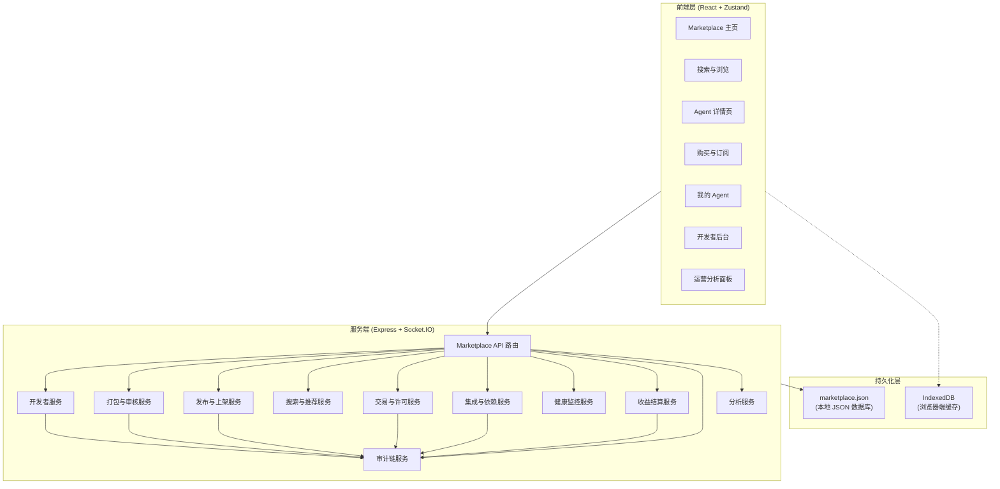
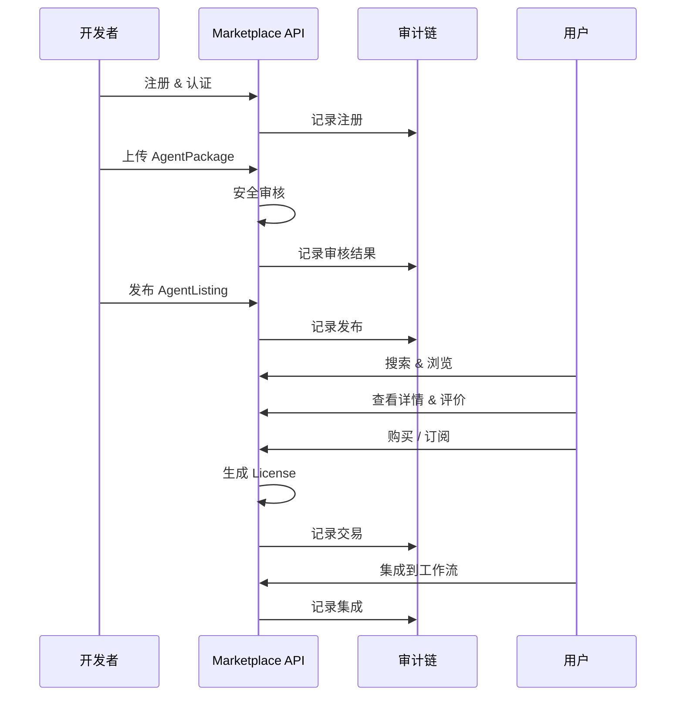

# 设计文档：Agent Marketplace Platform

## 概述

Agent Marketplace Platform 是 Cube Pets Office 的开放 Agent 交易市场模块。本设计遵循项目现有的架构模式：`shared/` 定义契约类型和 API 路由常量，`server/` 实现 Express 路由和业务逻辑，`client/` 使用 React + Zustand 构建前端界面，通过 Socket.IO 实现实时通信。

系统分为六个核心子系统：

1. **开发者与账户子系统** — 开发者注册、认证、团队管理
2. **Agent 生命周期子系统** — 打包、审核、发布、版本管理
3. **交易与许可子系统** — 购买、订阅、许可证、收益分配
4. **搜索与发现子系统** — 浏览、搜索、推荐、详情展示
5. **集成与运行子系统** — Agent 集成、依赖管理、健康监控
6. **生态与治理子系统** — 社区、套件、安全策略、合规、分析

## 架构

### 整体架构



### 数据流



## 组件和接口

### 共享契约层 (`shared/marketplace/`)

#### `contracts.ts` — 核心数据模型

定义所有 Marketplace 数据类型，遵循项目现有的 contracts 模式。

#### `api.ts` — API 路由常量和请求/响应类型

定义所有 REST API 路由常量和类型化的请求/响应接口。

#### `socket.ts` — Socket 事件常量

定义 Marketplace 相关的 Socket.IO 事件类型。

### 服务端路由层 (`server/routes/marketplace.ts`)

统一的 Marketplace API 路由入口，挂载到 `/api/marketplace/*`。

### 服务端业务逻辑层 (`server/marketplace/`)

| 文件                     | 职责                                 |
| ------------------------ | ------------------------------------ |
| `developer-service.ts`   | 开发者注册、认证、团队管理           |
| `package-service.ts`     | Agent 打包验证、元数据提取           |
| `audit-service.ts`       | 安全审核（代码/权限/依赖/隐私/合规） |
| `listing-service.ts`     | Agent 发布、上架、下架、状态管理     |
| `search-service.ts`      | 全文搜索、分类浏览、推荐引擎         |
| `review-service.ts`      | 用户评价、评分计算                   |
| `transaction-service.ts` | 购买、订阅、支付处理                 |
| `license-service.ts`     | 许可证生成、激活、转移、过期管理     |
| `integration-service.ts` | Agent 集成配置、使用监控             |
| `dependency-service.ts`  | 依赖解析、冲突检测、自动安装         |
| `health-service.ts`      | 健康检查、性能监控、告警             |
| `version-service.ts`     | 版本管理、兼容性检查、回滚           |
| `revenue-service.ts`     | 收益计算、结算、提现                 |
| `feedback-service.ts`    | 用户反馈收集、分类、统计             |
| `community-service.ts`   | 社区论坛、协作、排行榜               |
| `suite-service.ts`       | Agent 套件管理、捆绑定价             |
| `security-service.ts`    | 安全策略、沙箱、权限控制             |
| `compliance-service.ts`  | 合规检查、GDPR/CCPA 支持             |
| `analytics-service.ts`   | 运营分析、趋势识别                   |
| `audit-chain.ts`         | 审计链记录（不可篡改日志）           |
| `marketplace-store.ts`   | 本地 JSON 数据库存储层               |

### 前端层 (`client/src/`)

| 文件                                     | 职责                                  |
| ---------------------------------------- | ------------------------------------- |
| `pages/marketplace/MarketplacePage.tsx`  | Marketplace 主页（热门/推荐/新发布）  |
| `pages/marketplace/SearchPage.tsx`       | 搜索与浏览页                          |
| `pages/marketplace/AgentDetailPage.tsx`  | Agent 详情页                          |
| `pages/marketplace/PurchasePage.tsx`     | 购买与订阅页                          |
| `pages/marketplace/MyAgentsPage.tsx`     | 我的 Agent 页                         |
| `pages/marketplace/DevDashboardPage.tsx` | 开发者后台                            |
| `pages/marketplace/AnalyticsPage.tsx`    | 运营分析页                            |
| `lib/marketplace-store.ts`               | Zustand store（Marketplace 状态管理） |
| `lib/marketplace-client.ts`              | Marketplace REST API 封装             |

## 数据模型

### 核心类型定义 (`shared/marketplace/contracts.ts`)

```typescript
// ===== 常量 =====

export const MARKETPLACE_CONTRACT_VERSION = "2025-01-01" as const;

// 开发者认证级别
export const DEVELOPER_VERIFICATION_LEVELS = [
  "unverified",
  "individual",
  "enterprise",
  "certified_enterprise",
] as const;
export type DeveloperVerificationLevel =
  (typeof DEVELOPER_VERIFICATION_LEVELS)[number];

// Agent 打包格式
export const AGENT_PACKAGE_FORMATS = ["docker", "wasm", "python"] as const;
export type AgentPackageFormat = (typeof AGENT_PACKAGE_FORMATS)[number];

// 审核类型
export const AUDIT_TYPES = [
  "code",
  "permission",
  "dependency",
  "privacy",
  "compliance",
] as const;
export type AuditType = (typeof AUDIT_TYPES)[number];

// 审核状态
export const AUDIT_STATUSES = [
  "pending",
  "in_progress",
  "passed",
  "failed",
  "requires_changes",
] as const;
export type AuditStatus = (typeof AUDIT_STATUSES)[number];

// 发布状态
export const LISTING_STATUSES = [
  "draft",
  "pending_review",
  "published",
  "delisted",
] as const;
export type ListingStatus = (typeof LISTING_STATUSES)[number];

// 定价模式
export const PRICING_MODELS = [
  "free",
  "one_time",
  "subscription",
  "usage_based",
] as const;
export type PricingModel = (typeof PRICING_MODELS)[number];

// 购买类型
export const PURCHASE_TYPES = [
  "one_time",
  "subscription",
  "usage_based",
] as const;
export type PurchaseType = (typeof PURCHASE_TYPES)[number];

// 许可证状态
export const LICENSE_STATUSES = [
  "active",
  "inactive",
  "expired",
  "revoked",
  "transferred",
] as const;
export type LicenseStatus = (typeof LICENSE_STATUSES)[number];

// 版本状态
export const VERSION_STATUSES = [
  "stable",
  "beta",
  "pre_release",
  "deprecated",
  "end_of_life",
] as const;
export type VersionStatus = (typeof VERSION_STATUSES)[number];

// 收益结算状态
export const REVENUE_STATUSES = [
  "pending",
  "calculated",
  "settled",
  "paid",
] as const;
export type RevenueStatus = (typeof REVENUE_STATUSES)[number];

// 反馈类型
export const FEEDBACK_TYPES = [
  "feature_suggestion",
  "bug_report",
  "performance_issue",
  "usage_issue",
] as const;
export type FeedbackType = (typeof FEEDBACK_TYPES)[number];

// 健康检查状态
export const HEALTH_CHECK_STATUSES = [
  "healthy",
  "degraded",
  "unhealthy",
  "unknown",
] as const;
export type HealthCheckStatus = (typeof HEALTH_CHECK_STATUSES)[number];

// ===== 数据模型 =====

export interface DeveloperAccount {
  developerId: string;
  email: string;
  name: string;
  company?: string;
  website?: string;
  description?: string;
  verificationStatus: DeveloperVerificationLevel;
  bankAccount?: string;
  taxInfo?: string;
  teamMembers?: TeamMember[];
  createdAt: number;
  updatedAt: number;
}

export interface TeamMember {
  userId: string;
  name: string;
  role: "owner" | "admin" | "member";
  permissions: string[];
  addedAt: number;
}

export interface AgentPackage {
  packageId: string;
  agentName: string;
  version: string;
  description: string;
  capabilities: string[];
  requirements: SystemRequirements;
  dependencies: AgentDependency[];
  metadata: Record<string, unknown>;
  format: AgentPackageFormat;
  soulMd: string;
  documentation: string;
  createdAt: number;
  developerId: string;
}

export interface SystemRequirements {
  minMemory?: string;
  gpu?: boolean;
  os?: string[];
  runtime?: string;
}

export interface AgentDependency {
  type: "agent" | "mcp_tool" | "model" | "system";
  name: string;
  version?: string;
  optional?: boolean;
}

export interface SecurityAudit {
  auditId: string;
  packageId: string;
  auditType: AuditType;
  auditStatus: AuditStatus;
  findings: AuditFinding[];
  recommendations: string[];
  auditTime: number;
  reviewerId?: string;
  automated: boolean;
}

export interface AuditFinding {
  severity: "critical" | "high" | "medium" | "low" | "info";
  category: string;
  description: string;
  location?: string;
  suggestion?: string;
}

export interface AgentListing {
  listingId: string;
  packageId: string;
  developerId: string;
  title: string;
  description: string;
  category: string;
  tags: string[];
  icon?: string;
  screenshots: string[];
  pricing: PricingInfo;
  releaseNotes?: string;
  publishStatus: ListingStatus;
  averageRating: number;
  reviewCount: number;
  downloadCount: number;
  createdAt: number;
  updatedAt: number;
}

export interface PricingInfo {
  model: PricingModel;
  price?: number;
  currency?: string;
  billingPeriod?: "monthly" | "quarterly" | "yearly";
  usageUnit?: string;
  usagePrice?: number;
}

export interface Review {
  reviewId: string;
  agentId: string;
  userId: string;
  rating: number;
  comment: string;
  screenshots?: string[];
  upvotes: number;
  replies: ReviewReply[];
  reported: boolean;
  createdAt: number;
  updatedAt: number;
}

export interface ReviewReply {
  replyId: string;
  userId: string;
  content: string;
  createdAt: number;
}

export interface Purchase {
  purchaseId: string;
  userId: string;
  agentId: string;
  purchaseType: PurchaseType;
  price: number;
  currency: string;
  paymentMethod: string;
  purchaseTime: number;
  expiryTime?: number;
  licenseKey: string;
  autoRenew?: boolean;
  status: "completed" | "refunded" | "cancelled";
}

export interface License {
  licenseId: string;
  userId: string;
  agentId: string;
  licenseKey: string;
  activationTime?: number;
  expiryTime?: number;
  status: LicenseStatus;
  deviceLimit: number;
  usageLimit?: number;
  currentDevices: number;
  currentUsage: number;
  usagePeriod?: "monthly" | "yearly";
}

export interface AgentIntegration {
  integrationId: string;
  userId: string;
  agentId: string;
  workflowId?: string;
  configuration: Record<string, unknown>;
  status: "active" | "inactive";
  selectedVersion?: string;
  permissions: string[];
  lastUsedTime?: number;
  callCount: number;
  totalCost: number;
}

export interface DependencyGraph {
  agentId: string;
  dependencies: AgentDependency[];
  conflicts: DependencyConflict[];
  compatibilityMatrix: CompatibilityEntry[];
}

export interface DependencyConflict {
  dependencyA: string;
  dependencyB: string;
  reason: string;
}

export interface CompatibilityEntry {
  agentId: string;
  version: string;
  compatible: boolean;
  notes?: string;
}

export interface AgentHealthCheck {
  checkId: string;
  agentId: string;
  checkTime: number;
  status: HealthCheckStatus;
  metrics: HealthMetrics;
  issues: HealthIssue[];
}

export interface HealthMetrics {
  availability: number;
  responseTimeMs: number;
  throughput: number;
  errorRate: number;
  cpuUsage?: number;
  memoryUsage?: number;
}

export interface HealthIssue {
  type: string;
  severity: "critical" | "warning" | "info";
  description: string;
  detectedAt: number;
}

export interface AgentVersion {
  versionId: string;
  agentId: string;
  version: string;
  releaseDate: number;
  releaseNotes: string;
  changeLog: string;
  status: VersionStatus;
  downloadCount: number;
  backwardCompatible: boolean;
  supportEndDate?: number;
}

export interface Revenue {
  revenueId: string;
  developerId: string;
  agentId: string;
  period: string;
  grossRevenue: number;
  platformFee: number;
  netRevenue: number;
  status: RevenueStatus;
  settlementDate?: number;
}

export interface UserFeedback {
  feedbackId: string;
  agentId: string;
  userId: string;
  feedbackType: FeedbackType;
  content: string;
  rating?: number;
  attachments: string[];
  timestamp: number;
  status: "open" | "in_progress" | "resolved" | "closed";
  developerReply?: string;
  priority?: "low" | "medium" | "high" | "critical";
}

export interface AgentSuite {
  suiteId: string;
  name: string;
  description: string;
  agents: SuiteAgent[];
  bundlePrice: number;
  bundleDiscount: number;
  currency: string;
  createdAt: number;
  updatedAt: number;
}

export interface SuiteAgent {
  agentId: string;
  developerId: string;
  revenueShare: number;
}

export interface SecurityPolicy {
  policyId: string;
  agentId: string;
  permissions: string[];
  dataAccess: DataAccessRule[];
  encryption: boolean;
  auditLogging: boolean;
  sandboxed: boolean;
}

export interface DataAccessRule {
  resource: string;
  accessLevel: "read" | "write" | "none";
  requiresAuth: boolean;
}

export interface CompliancePolicy {
  policyId: string;
  agentId: string;
  jurisdiction: string[];
  compliance: string[];
  termsOfService: string;
  privacyPolicy: string;
  dataDeclaration: string[];
  modelDeclaration: string[];
}

export interface MarketplaceAnalytics {
  period: string;
  gmv: number;
  userCount: number;
  agentCount: number;
  conversionRate: number;
  retentionRate: number;
  nps: number;
  topAgents: { agentId: string; revenue: number }[];
  trendingAgents: string[];
  emergingAgents: string[];
  decliningAgents: string[];
}

export interface AuditEntry {
  entryId: string;
  entityType: string;
  entityId: string;
  action: string;
  actorId: string;
  actorType: "developer" | "user" | "system" | "admin";
  timestamp: number;
  details: Record<string, unknown>;
  hash: string;
  previousHash: string;
}
```

### API 路由常量 (`shared/marketplace/api.ts`)

```typescript
export const MARKETPLACE_API_ROUTES = {
  // 开发者
  registerDeveloper: "/api/marketplace/developers",
  getDeveloper: "/api/marketplace/developers/:id",
  updateDeveloper: "/api/marketplace/developers/:id",
  certifyDeveloper: "/api/marketplace/developers/:id/certify",
  listTeamMembers: "/api/marketplace/developers/:id/team",
  addTeamMember: "/api/marketplace/developers/:id/team",

  // Agent 包
  uploadPackage: "/api/marketplace/packages",
  getPackage: "/api/marketplace/packages/:id",
  listPackages: "/api/marketplace/packages",

  // 审核
  getAudit: "/api/marketplace/audits/:id",
  listAudits: "/api/marketplace/audits",
  triggerAudit: "/api/marketplace/packages/:id/audit",

  // 发布
  createListing: "/api/marketplace/listings",
  getListing: "/api/marketplace/listings/:id",
  updateListing: "/api/marketplace/listings/:id",
  listListings: "/api/marketplace/listings",
  publishListing: "/api/marketplace/listings/:id/publish",
  delistListing: "/api/marketplace/listings/:id/delist",

  // 搜索
  searchAgents: "/api/marketplace/search",
  browseByCategory: "/api/marketplace/browse/:category",
  getRecommendations: "/api/marketplace/recommendations",

  // 详情与评价
  getAgentDetail: "/api/marketplace/agents/:id",
  listReviews: "/api/marketplace/agents/:id/reviews",
  createReview: "/api/marketplace/agents/:id/reviews",
  upvoteReview: "/api/marketplace/reviews/:id/upvote",
  reportReview: "/api/marketplace/reviews/:id/report",
  replyToReview: "/api/marketplace/reviews/:id/reply",

  // 购买与订阅
  createPurchase: "/api/marketplace/purchases",
  getPurchase: "/api/marketplace/purchases/:id",
  listPurchases: "/api/marketplace/purchases",
  cancelSubscription: "/api/marketplace/purchases/:id/cancel",
  renewSubscription: "/api/marketplace/purchases/:id/renew",

  // 许可证
  getLicense: "/api/marketplace/licenses/:id",
  listLicenses: "/api/marketplace/licenses",
  activateLicense: "/api/marketplace/licenses/:id/activate",
  deactivateLicense: "/api/marketplace/licenses/:id/deactivate",
  transferLicense: "/api/marketplace/licenses/:id/transfer",
  renewLicense: "/api/marketplace/licenses/:id/renew",

  // 集成
  createIntegration: "/api/marketplace/integrations",
  getIntegration: "/api/marketplace/integrations/:id",
  updateIntegration: "/api/marketplace/integrations/:id",
  listIntegrations: "/api/marketplace/integrations",
  toggleIntegration: "/api/marketplace/integrations/:id/toggle",

  // 依赖
  getDependencyGraph: "/api/marketplace/agents/:id/dependencies",
  resolveDependencies: "/api/marketplace/agents/:id/dependencies/resolve",

  // 健康检查
  getHealthCheck: "/api/marketplace/agents/:id/health",
  listHealthChecks: "/api/marketplace/agents/:id/health/history",

  // 版本
  listVersions: "/api/marketplace/agents/:id/versions",
  createVersion: "/api/marketplace/agents/:id/versions",
  rollbackVersion: "/api/marketplace/agents/:id/versions/:versionId/rollback",

  // 收益
  getRevenue: "/api/marketplace/revenue",
  getRevenueDetail: "/api/marketplace/revenue/:id",
  requestWithdrawal: "/api/marketplace/revenue/withdraw",

  // 反馈
  createFeedback: "/api/marketplace/agents/:id/feedback",
  listFeedback: "/api/marketplace/agents/:id/feedback",
  replyToFeedback: "/api/marketplace/feedback/:id/reply",
  getFeedbackAnalytics: "/api/marketplace/agents/:id/feedback/analytics",

  // 套件
  createSuite: "/api/marketplace/suites",
  getSuite: "/api/marketplace/suites/:id",
  listSuites: "/api/marketplace/suites",
  updateSuite: "/api/marketplace/suites/:id",

  // 分析
  getAnalytics: "/api/marketplace/analytics",
  getAnalyticsByDimension: "/api/marketplace/analytics/:dimension",

  // 审计
  listAuditEntries: "/api/marketplace/audit-chain",
} as const;
```

### Socket 事件 (`shared/marketplace/socket.ts`)

```typescript
export const MARKETPLACE_SOCKET_EVENT = "marketplace_event" as const;

export const MARKETPLACE_SOCKET_TYPES = {
  listingPublished: "marketplace.listing.published",
  listingDelisted: "marketplace.listing.delisted",
  reviewAdded: "marketplace.review.added",
  purchaseCompleted: "marketplace.purchase.completed",
  healthAlert: "marketplace.health.alert",
  versionReleased: "marketplace.version.released",
  auditCompleted: "marketplace.audit.completed",
} as const;
```

## 正确性属性

_正确性属性是一种在系统所有有效执行中都应成立的特征或行为——本质上是关于系统应该做什么的形式化陈述。属性是人类可读规范与机器可验证正确性保证之间的桥梁。_

基于验收标准的 prework 分析和属性反射（合并冗余），以下是本系统的核心正确性属性：

### Property 1: 数据模型序列化往返一致性

_For any_ Marketplace 数据模型实例（DeveloperAccount、AgentPackage、SecurityAudit、AgentListing、Purchase、License、AgentIntegration、DependencyGraph、AgentHealthCheck、AgentVersion、Revenue、UserFeedback、AgentSuite、SecurityPolicy、CompliancePolicy），序列化为 JSON 再反序列化应产生等价对象，且所有必填字段均存在。

**Validates: Requirements 1.1, 2.1, 3.1, 4.1, 7.1, 8.1, 9.1, 10.1, 11.1, 12.1, 13.1, 14.1, 16.1, 17.1, 18.1**

### Property 2: 审计链完整性

_For any_ 可审计操作（开发者注册、打包、审核、发布、评价、购买、许可证变更、集成、健康检查、版本更新、结算、反馈、社区活动、套件操作、合规操作），执行该操作后审计链中应存在一条对应的审计记录，包含正确的 entityType、entityId、action 和 actorId，且审计记录的 hash 基于 previousHash 计算（链式完整性）。

**Validates: Requirements 1.7, 2.8, 3.9, 4.8, 6.8, 7.7, 8.8, 9.7, 11.8, 12.8, 13.7, 14.7, 15.7, 16.6, 17.6, 18.7**

### Property 3: 搜索过滤正确性

_For any_ 搜索查询（包含分类过滤、标签过滤、全文搜索、高级搜索条件的任意组合），返回的所有 Agent 列表项应满足所有指定的过滤条件：分类匹配、标签包含、文本匹配（名称/描述/能力中至少一个包含搜索词）。

**Validates: Requirements 5.2, 5.3, 5.4, 5.7**

### Property 4: 搜索排序正确性

_For any_ 搜索结果列表和排序字段（popularity、rating、price、publishDate），结果列表应按指定字段正确排序（降序或升序）。

**Validates: Requirements 5.5**

### Property 5: 搜索结果信息完整性

_For any_ 搜索结果项，响应应包含 Agent 基本信息（名称、描述）、评分、价格和下载量。

**Validates: Requirements 5.8**

### Property 6: 发布状态机转换合法性

_For any_ AgentListing，状态转换应遵循合法路径：draft → pending_review → published → delisted，不允许非法跳转（如 draft 直接到 published）。

**Validates: Requirements 4.2**

### Property 7: 语义化版本格式验证

_For any_ AgentPackage 或 AgentVersion 的版本字符串，应符合语义化版本格式（MAJOR.MINOR.PATCH，可选 pre-release 和 build metadata）。

**Validates: Requirements 2.6, 12.2**

### Property 8: 许可证限制执行

_For any_ License，当设备数达到 deviceLimit 时，新的激活请求应被拒绝；当使用量达到 usageLimit 时，新的使用请求应被拒绝。许可证的当前设备数和使用量不应超过其限制值。

**Validates: Requirements 8.3, 8.4**

### Property 9: 许可证生命周期状态机

_For any_ License，状态转换应遵循合法路径：inactive → active → expired/revoked/transferred。过期的许可证应自动禁用关联的 Agent。激活后再停用应恢复到 inactive 状态。转移后原许可证应标记为 transferred。

**Validates: Requirements 8.2, 8.5, 8.6, 8.7**

### Property 10: 购买生成许可证

_For any_ 已完成的 Purchase，系统应生成一个唯一的 licenseKey，且该 licenseKey 与 Purchase 记录中的 licenseKey 一致，并创建对应的 License 记录。

**Validates: Requirements 7.6**

### Property 11: 收益计算正确性

_For any_ 开发者和结算周期，净收入应等于总收入减去平台费用（netRevenue = grossRevenue - platformFee），平台费率应根据开发者认证级别确定（individual: 30%, enterprise: 20%, certified_enterprise: 15%），且总收入应等于该周期内所有相关交易金额之和。

**Validates: Requirements 13.2, 13.3**

### Property 12: 最低提现金额限制

_For any_ 提现请求，当请求金额低于最低提现金额时，系统应拒绝该请求。

**Validates: Requirements 13.6**

### Property 13: 依赖冲突检测

_For any_ 依赖图，如果存在循环依赖或版本不兼容，系统应检测并报告所有冲突。对于无冲突的依赖图，依赖解析应产生一个有效的安装顺序（拓扑排序）。

**Validates: Requirements 3.5, 10.6, 10.7**

### Property 14: 套件折扣正确性

_For any_ AgentSuite，套件价格应低于其包含的所有 Agent 单独购买价格之和，且折扣率应等于声明的 bundleDiscount。

**Validates: Requirements 16.3**

### Property 15: 套件收益分配

_For any_ AgentSuite 的收益分配，所有参与开发者的 revenueShare 之和应等于 100%，且每个开发者的实际收益应等于套件净收入乘以其 revenueShare。

**Validates: Requirements 16.4**

### Property 16: 权限访问控制

_For any_ Agent 的权限变更（授权或撤销），变更后的访问控制应立即生效：已撤销的权限应导致访问被拒绝，已授权的权限应允许访问。用户请求删除数据后，Agent 收集的所有数据应被清除。

**Validates: Requirements 17.3, 17.4, 17.7, 17.8, 18.5**

### Property 17: 健康检查阈值告警

_For any_ AgentHealthCheck，当错误率超过配置的阈值时，健康状态应为 unhealthy 或 degraded，且应触发告警通知。

**Validates: Requirements 11.5, 11.7**

### Property 18: 认证级别与权限映射

_For any_ DeveloperAccount，其认证级别应对应确定的权限集合和收益分配比例，且认证级别的升级应扩展权限集合。

**Validates: Requirements 1.4, 1.5**

### Property 19: 评价操作正确性

_For any_ Review，点赞操作应使 upvotes 增加 1，回复操作应在 replies 列表中添加一条记录，举报操作应将 reported 标记为 true。

**Validates: Requirements 6.6, 6.7**

### Property 20: 集成配置持久化

_For any_ AgentIntegration 的配置变更（参数修改、启用/禁用、版本选择、权限配置），变更后重新读取应反映最新配置。

**Validates: Requirements 9.2, 9.3, 9.4, 9.5**

### Property 21: 版本回滚正确性

_For any_ Agent 版本回滚操作，回滚后当前活跃版本应为指定的目标版本，且回滚操作不应删除任何版本记录。

**Validates: Requirements 12.6**

### Property 22: 反馈统计分析正确性

_For any_ Agent 的反馈集合，统计分析应正确计算各反馈类型的数量、平均评分，且按优先级排序应正确。

**Validates: Requirements 14.5, 14.6**

### Property 23: 运营分析指标正确性

_For any_ Marketplace 数据集和分析维度（时间、分类、开发者），分析计算应是确定性的：GMV 应等于所有交易金额之和，转化率应等于购买用户数除以浏览用户数，Agent 趋势分类（trending/emerging/declining）应基于下载量变化率。

**Validates: Requirements 20.1, 20.2, 20.3**

## 错误处理

### 错误分类

| 错误类型     | HTTP 状态码 | 处理策略                           |
| ------------ | ----------- | ---------------------------------- |
| 资源不存在   | 404         | 返回 `{ ok: false, error: "..." }` |
| 参数验证失败 | 400         | 返回具体的验证错误信息             |
| 未授权       | 401         | 返回认证错误                       |
| 权限不足     | 403         | 返回权限错误                       |
| 状态冲突     | 409         | 返回当前状态和允许的操作           |
| 支付失败     | 402         | 返回支付错误详情                   |
| 服务内部错误 | 500         | 记录错误日志，返回通用错误         |

### 关键错误场景

1. **审核失败**：Agent 审核不通过时，返回详细的 findings 和 recommendations，开发者可修改后重新提交
2. **支付失败**：支付处理失败时，不生成许可证，Purchase 状态保持为 pending，支持重试
3. **依赖冲突**：依赖解析失败时，返回冲突详情和建议的解决方案
4. **许可证过期**：许可证过期时自动禁用 Agent，发送通知提醒用户续期
5. **健康检查异常**：Agent 健康检查失败时，根据严重程度决定是否自动下架

### 错误响应格式

遵循项目现有模式：

```typescript
interface MarketplaceApiErrorResponse {
  ok: false;
  error: string;
  details?: Record<string, unknown>;
}
```

## 测试策略

### 测试框架

- **单元测试**：vitest（项目已有配置）
- **属性测试**：fast-check（项目已有依赖）
- **测试位置**：`server/tests/marketplace/` 和 `client/src/__tests__/marketplace/`

### 属性测试配置

- 每个属性测试最少运行 100 次迭代
- 每个属性测试用注释标注对应的设计文档属性编号
- 标注格式：`// Feature: agent-marketplace-platform, Property N: {property_text}`
- 每个正确性属性由一个独立的属性测试实现

### 测试分层

| 层级          | 测试类型            | 覆盖范围                                 |
| ------------- | ------------------- | ---------------------------------------- |
| 数据模型层    | 属性测试            | 序列化往返、字段验证、状态机转换         |
| 业务逻辑层    | 属性测试 + 单元测试 | 搜索过滤、收益计算、依赖解析、许可证管理 |
| API 路由层    | 单元测试            | 请求验证、响应格式、错误处理             |
| 前端 Store 层 | 单元测试            | 状态管理、API 调用                       |

### 单元测试重点

- 具体的边界条件和错误场景
- API 路由的请求/响应验证
- 状态机的非法转换拒绝
- 支付流程的幂等性

### 属性测试重点

- 数据模型的序列化往返一致性（Property 1）
- 审计链的链式完整性（Property 2）
- 搜索过滤和排序的正确性（Property 3, 4, 5）
- 许可证限制执行和状态机（Property 8, 9）
- 收益计算和分配（Property 11, 14, 15）
- 依赖冲突检测（Property 13）
