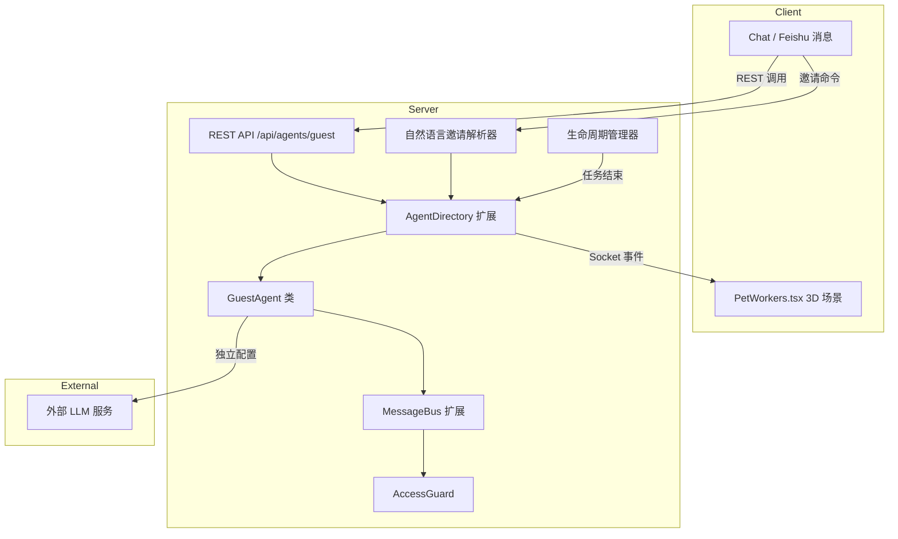

# 设计文档：Guest Agent（访客代理）

## 概述

Guest Agent 机制为 Cube Pets Office 引入临时外部代理参与能力。访客代理在单次任务（Mission）生命周期内存在，通过独立 LLM 配置执行工作，在 3D 场景中可视化呈现，并在任务结束后自动清理。

核心设计原则：

- 最小侵入：复用现有 WorkflowOrganizationNode、RuntimeAgent、MessageBus 等基础设施
- 短暂生命周期：访客代理仅存在于单次 Mission，不持久化到数据库 seed
- 安全隔离：访客代理有独立工作区，无法访问其他代理的 SOUL.md 和长期记忆
- 独立 LLM：每个访客代理使用自己的 model/baseUrl/apiKey 配置

## 架构



### 数据流

1. 用户通过 REST API 或自然语言发起邀请
2. 系统验证并发限制（≤5），创建 GuestAgent 实例
3. GuestAgent 注册到 AgentDirectory，创建临时工作区
4. Socket 事件通知前端渲染新角色
5. 工作流执行期间，GuestAgent 通过 MessageBus 与 Manager 通信
6. 任务结束时，Lifecycle 管理器触发清理：注销代理、删除工作区、通知前端移除角色

## 组件与接口

### 1. 类型定义扩展（shared/）

#### GuestAgentConfig（新增）

```typescript
// shared/organization-schema.ts

export interface GuestSkillDescriptor {
  name: string;
  description: string;
}

export interface GuestAgentConfig {
  model: string;
  baseUrl: string;
  apiKey?: string;
  skills: GuestSkillDescriptor[];
  mcp: WorkflowMcpBinding[];
  avatarHint: string;
}

export interface GuestAgentNode extends WorkflowOrganizationNode {
  invitedBy: string;
  source: "manual" | "feishu" | "natural_language";
  expiresAt: number;
  guestConfig: GuestAgentConfig;
}
```

#### RuntimeAgentConfig 扩展

```typescript
// shared/runtime-agent.ts — 扩展现有接口
export interface RuntimeAgentConfig {
  // ...现有字段
  isGuest?: boolean;
}
```

### 2. GuestAgent 类（server/core/guest-agent.ts，新增）

继承现有 Agent 类，覆盖 LLM 提供者以使用独立配置：

```typescript
export class GuestAgent extends Agent {
  readonly guestConfig: GuestAgentConfig;

  constructor(id: string, config: GuestAgentConfig, orgNode: GuestAgentNode) {
    super({
      id,
      name: orgNode.name,
      department: orgNode.departmentId,
      role: orgNode.role,
      managerId: orgNode.parentId,
      model: config.model,
      soulMd: buildGuestSoulMd(orgNode),
    });
    this.guestConfig = config;
    // 覆盖 deps.llmProvider 为独立配置的 LLM 客户端
  }
}
```

### 3. AgentDirectory 扩展（server/core/registry.ts）

在现有 AgentRegistry 上新增方法：

```typescript
// 新增方法
registerGuest(id: string, agent: GuestAgent): void;
unregisterGuest(id: string): void;
getGuestAgents(): GuestAgent[];
getGuestCount(): number;
isGuest(id: string): boolean;
```

内部使用独立的 `guestAgents: Map<string, GuestAgent>` 存储，与常驻代理分离。`get(id)` 方法同时查找两个 Map。

### 4. REST API（server/routes/guest-agents.ts，新增）

```
POST   /api/agents/guest      — 创建访客代理
GET    /api/agents/guest      — 列出活跃访客代理
DELETE /api/agents/guest/:id  — 移除访客代理
```

POST 请求体：

```typescript
interface CreateGuestRequest {
  name: string;
  config: GuestAgentConfig;
  departmentId?: string; // 可选，默认分配到发起任务的部门
  managerId?: string; // 可选，默认分配到对应部门经理
}
```

POST 响应：

```typescript
interface CreateGuestResponse {
  id: string; // "guest_xxx" 格式
  name: string;
  config: GuestAgentConfig; // apiKey 替换为 "***"
  createdAt: string;
}
```

### 5. 自然语言邀请解析器（server/core/guest-invitation-parser.ts，新增）

```typescript
export interface ParsedInvitation {
  guestName: string;
  skills: string[];
  context: string;
}

export function parseInvitation(message: string): ParsedInvitation | null;
```

使用正则匹配 `@Name` 模式和邀请关键词（"邀请"、"invite"、"请...加入"等）。解析结果传递给 CEO Agent 进行审批判断。

### 6. MessageBus 扩展（shared/message-bus-rules.ts）

扩展 `validateHierarchy` 和 `validateStageRoute`，使访客代理（role 为 "worker"）能与其分配的 Manager 通信：

```typescript
// 在 validateHierarchy 中新增：
// 访客代理视为其 manager_id 指向的 Manager 的直接下属
// 无需修改核心逻辑，因为访客代理的 role="worker" 且 manager_id 已正确设置
```

由于访客代理的 `role` 为 `"worker"` 且 `manager_id` 指向对应 Manager，现有的 `isDirectReport` 和 `validateHierarchy` 逻辑已天然支持。MessageBus 的 `assertAgentExists` 需要扩展为同时查找 guest agents。

### 7. AccessGuard 扩展

现有 `resolveAgentWorkspacePath` 已通过 agentId 做路径隔离。访客代理使用 `guest_xxx` 作为 agentId，自然隔离在 `data/agents/guest_xxx/` 下。无需修改核心逻辑，仅需确保清理时递归删除该目录。

### 8. 生命周期管理器（server/core/guest-lifecycle.ts，新增）

```typescript
export class GuestLifecycleManager {
  async onMissionComplete(workflowId: string): Promise<void>;
  async onMissionFailed(workflowId: string): Promise<void>;
  async leaveOffice(guestId: string): Promise<void>;
  private cleanupWorkspace(guestId: string): void;
  private notifyFrontend(guestId: string, event: "join" | "leave"): void;
}
```

在 workflow 完成/失败的回调中调用，遍历所有访客代理执行清理。

### 9. 前端 3D 渲染扩展（client/）

#### PetWorkers.tsx 扩展

`createDynamicSceneData` 已从 `organization.nodes` 动态生成场景配置。访客代理作为 GuestAgentNode 存在于 nodes 中，只需：

- 为访客代理分配 "Guest Pod" 位置（场景中的第 5 个 slot 或动态偏移）
- 名牌 HTML 中检测 `isGuest` 标记，添加 "Guest" 徽章
- 入场/退场动画通过 `useFrame` 中的 opacity 和 scale 插值实现

#### agent-config.ts 扩展

新增 `resolveGuestVisualConfig(avatarHint: string)` 函数，将 avatarHint 映射到现有动物模型：

```typescript
const AVATAR_HINT_MAP: Record<string, keyof typeof PET_MODELS> = {
  cat: "cat",
  dog: "dog",
  bunny: "bunny",
  tiger: "tiger",
  lion: "lion",
  elephant: "elephant", // ...
};

export function resolveGuestAnimal(hint: string): keyof typeof PET_MODELS {
  return AVATAR_HINT_MAP[hint.toLowerCase()] || "cat"; // 默认猫
}
```

## 数据模型

### GuestAgentConfig

| 字段       | 类型                   | 必填 | 说明             |
| ---------- | ---------------------- | ---- | ---------------- |
| model      | string                 | 是   | LLM 模型标识     |
| baseUrl    | string                 | 是   | LLM API 基础 URL |
| apiKey     | string                 | 否   | LLM API 密钥     |
| skills     | GuestSkillDescriptor[] | 是   | 技能描述列表     |
| mcp        | WorkflowMcpBinding[]   | 是   | MCP 工具绑定     |
| avatarHint | string                 | 是   | 3D 渲染动物提示  |

### GuestAgentNode（继承 WorkflowOrganizationNode）

| 新增字段    | 类型                                       | 说明       |
| ----------- | ------------------------------------------ | ---------- |
| invitedBy   | string                                     | 邀请者 ID  |
| source      | 'manual' \| 'feishu' \| 'natural_language' | 邀请来源   |
| expiresAt   | number                                     | 过期时间戳 |
| guestConfig | GuestAgentConfig                           | 访客配置   |

### Guest Agent ID 格式

`guest_{uuid_v4_short}` — 例如 `guest_a1b2c3d4`

使用 UUID v4 的前 8 位确保唯一性，`guest_` 前缀确保与现有 18 个固定代理 ID 不冲突。

### 内存中的访客代理注册表

```typescript
// AgentRegistry 内部
private guestAgents: Map<string, GuestAgent> = new Map();
```

访客代理不写入数据库，仅存在于内存中。这保证了短暂生命周期语义。

## 正确性属性

_属性是系统在所有合法执行中应保持为真的特征或行为——本质上是关于系统应做什么的形式化陈述。属性是人类可读规范与机器可验证正确性保证之间的桥梁。_

### Property 1: 访客代理创建返回 guest\_ 前缀 ID

_For any_ 合法的 GuestAgentConfig，通过 registerGuest 创建的访客代理 ID 应以 "guest\_" 开头，且 ID 在当前注册表中唯一。

**Validates: Requirements 1.4, 2.1**

### Property 2: register/unregister 往返

_For any_ 合法的 GuestAgent，注册后通过 get(id) 应能找到该代理，注销后通过 get(id) 应返回 undefined。

**Validates: Requirements 2.4**

### Property 3: 注销后注册表清空且工作区删除

_For any_ 已注册的访客代理，调用 unregisterGuest(id) 后，该代理不应出现在 getGuestAgents() 列表中，且 data/agents/{id}/ 目录不应存在。

**Validates: Requirements 2.3, 2.5**

### Property 4: 并发上限不变量

_For any_ 注册操作序列，注册表中的访客代理数量不应超过 5。当已有 5 个访客代理时，尝试注册第 6 个应被拒绝并返回错误。

**Validates: Requirements 2.6, 2.7**

### Property 5: 自然语言邀请解析

_For any_ 包含 "@Name" 模式和邀请关键词的消息字符串，parseInvitation 应返回非 null 结果，且 guestName 字段与 "@" 后的名称匹配。对于不包含邀请模式的消息，应返回 null。

**Validates: Requirements 3.1**

### Property 6: MessageBus 层级验证支持访客代理

_For any_ 访客代理（role="worker"，manager_id 指向某 Manager）和该 Manager，validateHierarchy 应返回 true，validateStageRoute 在 execution/review/revision 阶段应返回 true。

**Validates: Requirements 5.2**

### Property 7: AccessGuard 工作区隔离

_For any_ 访客代理 ID 和任意包含 ".." 的相对路径，resolveAgentWorkspacePath 应抛出错误。对于任意访客代理 ID 和任意其他代理 ID，访客代理不应能解析到其他代理工作区内的路径。

**Validates: Requirements 5.3, 5.6**

### Property 8: 任务结束自动清理所有访客代理

_For any_ 包含 N 个访客代理的已完成工作流，调用 onMissionComplete 后，getGuestAgents() 应返回空列表，且所有 N 个访客代理的工作区目录应被删除。

**Validates: Requirements 5.5**

### Property 9: 访客代理使用独立 LLM 配置

_For any_ GuestAgentConfig 指定的 model 和 baseUrl，创建的 GuestAgent 实例的 LLM 调用应使用该配置中的值，而非系统默认的 LLM 配置。

**Validates: Requirements 6.1**

### Property 10: GuestAgentConfig 序列化往返一致性

_For any_ 合法的 GuestAgentConfig 对象，JSON.parse(JSON.stringify(config)) 应产生与原对象深度相等的结果。

**Validates: Requirements 7.1, 7.2**

### Property 11: API 响应隐藏 apiKey

_For any_ 包含非空 apiKey 的 GuestAgentConfig，通过 API 返回的响应中 apiKey 字段应为 "\*\*\*"。

**Validates: Requirements 7.3**

### Property 12: GuestAgentNode 与组织快照兼容

_For any_ 合法的 GuestAgentNode，将其加入 WorkflowOrganizationSnapshot 的 nodes 数组后，createDynamicSceneData 应能正常处理而不抛出异常，且返回的 sceneAgents 中应包含该访客代理。

**Validates: Requirements 1.5**

## 错误处理

| 场景                          | 处理方式                                                     |
| ----------------------------- | ------------------------------------------------------------ |
| 访客代理数量达到上限（5个）   | 返回 HTTP 409，附带 "Maximum guest agent limit reached" 消息 |
| GuestAgentConfig 缺少必填字段 | 返回 HTTP 400，附带具体缺失字段信息                          |
| 访客代理 LLM 调用失败         | 记录错误日志，通知上级 Manager，标记该访客代理任务为失败     |
| 删除不存在的访客代理          | 返回 HTTP 404                                                |
| 自然语言解析无法识别邀请意图  | 静默忽略，不创建访客代理                                     |
| CEO 拒绝邀请                  | 通过 Socket 事件通知前端，显示拒绝原因                       |
| 访客代理工作区清理失败        | 记录错误日志，不阻塞其他清理操作                             |
| 访客代理尝试路径遍历          | AccessGuard 抛出错误，阻止访问                               |

## 测试策略

### 测试框架

- 单元测试：vitest
- 属性测试：fast-check（已在项目依赖中）
- 每个属性测试至少运行 100 次迭代

### 双重测试方法

**属性测试**（验证通用正确性）：

- 每个正确性属性对应一个属性测试
- 使用 fast-check 生成随机 GuestAgentConfig、消息字符串、路径等
- 每个测试标注对应的设计属性编号
- 标签格式：**Feature: agent-marketplace, Property {N}: {属性标题}**

**单元测试**（验证具体示例和边界情况）：

- REST API 端点的集成测试
- Socket 事件发送的验证
- 具体的邀请消息解析示例
- 边界情况：空配置、超长名称、特殊字符

### 测试文件组织

```
server/tests/
  guest-agent.test.ts          — GuestAgent 类单元测试
  guest-agent.property.test.ts — 属性测试
  guest-lifecycle.test.ts      — 生命周期管理器测试
  guest-invitation.test.ts     — 邀请解析器测试
  guest-api.test.ts            — REST API 集成测试
```

### 属性测试生成器

```typescript
// fast-check 自定义生成器
const guestAgentConfigArb = fc.record({
  model: fc.stringOf(fc.alphaNumeric(), { minLength: 1, maxLength: 50 }),
  baseUrl: fc.constant("http://localhost:8080"),
  apiKey: fc.option(fc.hexaString({ minLength: 16, maxLength: 64 })),
  skills: fc.array(
    fc.record({
      name: fc.string({ minLength: 1, maxLength: 30 }),
      description: fc.string({ minLength: 1, maxLength: 100 }),
    }),
    { maxLength: 5 }
  ),
  mcp: fc.constant([]),
  avatarHint: fc.constantFrom("cat", "dog", "bunny", "tiger", "lion"),
});
```
