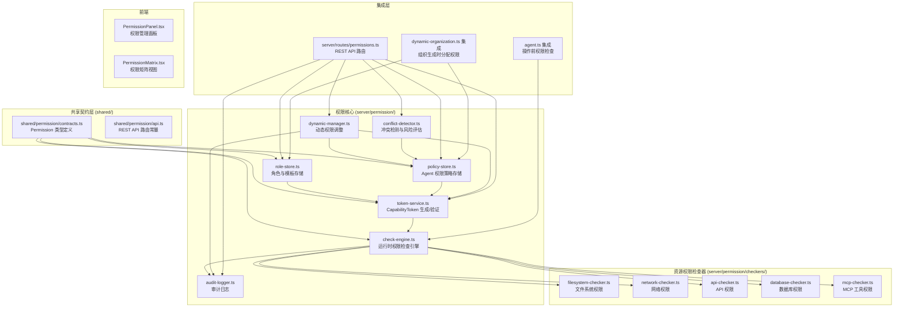

# Agent 细粒度权限模型 设计文档

## 概述

在 secure-sandbox 提供的 Docker 容器物理隔离之上，构建 Agent 治理层权限控制系统。核心思路是通过 Agent-Resource-Action 三维权限矩阵，在 Agent 执行操作前进行逻辑级别的权限校验。系统由五个核心模块组成：权限定义层（角色/模板/策略）、令牌服务（JWT CapabilityToken）、运行时检查引擎、动态权限管理、审计追踪。

与现有模块的关系：

- `access-guard.ts`：现有的路径遍历防护，权限模型在其上层增加 Agent 级别的文件系统权限控制
- `secure-sandbox`：Docker 容器级别的物理隔离，权限模型提供逻辑级别的细粒度控制
- `dynamic-organization.ts`：组织生成时自动分配权限，权限模型提供集成钩子

## 架构



## 组件与接口

### 1. 权限类型定义（共享契约）

```typescript
// shared/permission/contracts.ts

// ─── 资源类型与操作 ───
export const RESOURCE_TYPES = [
  "filesystem",
  "network",
  "api",
  "database",
  "mcp_tool",
] as const;
export type ResourceType = (typeof RESOURCE_TYPES)[number];

export const ACTIONS = [
  "read",
  "write",
  "execute",
  "delete",
  "connect",
  "call",
  "select",
  "insert",
  "update",
] as const;
export type Action = (typeof ACTIONS)[number];

export const RISK_LEVELS = ["low", "medium", "high", "critical"] as const;
export type RiskLevel = (typeof RISK_LEVELS)[number];

// ─── 约束条件 ───
export interface PermissionConstraints {
  pathPatterns?: string[]; // 文件系统路径模式（通配符）
  domainPatterns?: string[]; // 域名白名单（通配符）
  cidrRanges?: string[]; // CIDR 网络范围
  ports?: PortRange[]; // 端口限制
  rateLimit?: RateLimitConfig; // 速率限制
  endpoints?: string[]; // API 端点白名单
  methods?: string[]; // HTTP 方法限制
  parameterConstraints?: Record<string, string>; // 参数正则约束
  tables?: string[]; // 数据库表白名单
  rowLevelFilter?: string; // 行级过滤 WHERE 条件
  forbiddenOperations?: string[]; // 禁止的操作（如 DROP、TRUNCATE）
  maxResultRows?: number; // 最大结果集行数
  queryTimeoutMs?: number; // 查询超时
}

export interface PortRange {
  from: number;
  to: number;
}

export interface RateLimitConfig {
  maxPerMinute: number;
  maxBandwidthBytesPerMinute?: number;
}

// ─── 权限定义 ───
export interface Permission {
  resourceType: ResourceType;
  action: Action;
  constraints: PermissionConstraints;
  effect: "allow" | "deny"; // 允许或拒绝
}

// ─── 角色 ───
export interface AgentRole {
  roleId: string;
  roleName: string;
  description: string;
  permissions: Permission[];
  version: number;
  createdAt: string;
  updatedAt: string;
}

// ─── Agent 权限策略 ───
export interface AgentPermissionPolicy {
  agentId: string;
  assignedRoles: string[]; // roleId 列表
  customPermissions: Permission[]; // 自定义权限（覆盖角色权限）
  deniedPermissions: Permission[]; // 显式拒绝的权限
  effectiveAt: string;
  expiresAt: string | null;
  templateId?: string; // 使用的模板 ID
  organizationId?: string; // 关联的组织 ID
  version: number;
  createdAt: string;
  updatedAt: string;
}

// ─── CapabilityToken ───
export interface CapabilityTokenPayload {
  agentId: string;
  permissionMatrix: PermissionMatrixEntry[];
  iat: number; // issued at (epoch seconds)
  exp: number; // expires at (epoch seconds)
}

export interface PermissionMatrixEntry {
  resourceType: ResourceType;
  actions: Action[];
  constraints: PermissionConstraints;
  effect: "allow" | "deny";
}

export interface CapabilityToken {
  token: string; // JWT 字符串
  agentId: string;
  issuedAt: string;
  expiresAt: string;
}

// ─── 权限检查结果 ───
export interface PermissionCheckResult {
  allowed: boolean;
  reason?: string;
  suggestion?: string;
  matchedRule?: Permission;
}

// ─── 审计日志 ───
export interface PermissionAuditEntry {
  id: string;
  timestamp: string;
  agentId: string;
  operation: string; // "check" | "grant" | "revoke" | "escalate" | "policy_change"
  resourceType: ResourceType;
  action: Action;
  resource: string; // 具体资源标识
  result: "allowed" | "denied" | "error";
  reason?: string;
  operator?: string; // 操作者（系统或管理员）
  metadata?: Record<string, unknown>;
}

// ─── 权限模板 ───
export interface PermissionTemplate {
  templateId: string;
  templateName: string;
  description: string;
  targetRole: string; // 匹配的 Agent role
  permissions: Permission[];
  version: number;
  createdAt: string;
  updatedAt: string;
}

// ─── 风险评估 ───
export interface RiskAssessment {
  agentId: string;
  riskLevel: RiskLevel;
  factors: RiskFactor[];
  timestamp: string;
}

export interface RiskFactor {
  category: string;
  description: string;
  severity: RiskLevel;
}

// ─── 权限冲突 ───
export interface PermissionConflict {
  agentId: string;
  conflictType:
    | "allow_deny_overlap"
    | "excessive_scope"
    | "dangerous_combination";
  permissions: Permission[];
  description: string;
  suggestion: string;
}

// ─── 权限使用报告 ───
export interface PermissionUsageReport {
  agentId: string;
  timeRange: { from: string; to: string };
  totalChecks: number;
  allowedCount: number;
  deniedCount: number;
  resourceBreakdown: Record<ResourceType, { allowed: number; denied: number }>;
}
```

```typescript
// shared/permission/api.ts

export const PERMISSION_API = {
  // 角色管理
  listRoles: "GET    /api/permissions/roles",
  getRole: "GET    /api/permissions/roles/:roleId",
  createRole: "POST   /api/permissions/roles",
  updateRole: "PUT    /api/permissions/roles/:roleId",

  // Agent 权限策略
  getPolicy: "GET    /api/permissions/policies/:agentId",
  assignPolicy: "POST   /api/permissions/policies/:agentId",
  updatePolicy: "PUT    /api/permissions/policies/:agentId",

  // 令牌
  issueToken: "POST   /api/permissions/tokens/:agentId",
  verifyToken: "POST   /api/permissions/tokens/verify",

  // 动态权限
  grantTemp: "POST   /api/permissions/grant-temp",
  revoke: "POST   /api/permissions/revoke",
  escalate: "POST   /api/permissions/escalate",

  // 冲突与风险
  detectConflicts: "GET    /api/permissions/conflicts/:agentId",
  assessRisk: "GET    /api/permissions/risk/:agentId",

  // 审计
  auditTrail: "GET    /api/permissions/audit/:agentId",
  usageReport: "GET    /api/permissions/usage/:agentId",
  violations: "GET    /api/permissions/violations",
  exportReport: "GET    /api/permissions/export",

  // 模板
  listTemplates: "GET    /api/permissions/templates",
  getTemplate: "GET    /api/permissions/templates/:templateId",
  createTemplate: "POST   /api/permissions/templates",
} as const;
```

### 2. 角色与模板存储（RoleStore）

```typescript
// server/permission/role-store.ts

class RoleStore {
  constructor(private db: Database)

  // 角色 CRUD
  createRole(role: Omit<AgentRole, "version" | "createdAt" | "updatedAt">): AgentRole
  getRole(roleId: string): AgentRole | undefined
  listRoles(): AgentRole[]
  updateRole(roleId: string, updates: Partial<AgentRole>): AgentRole

  // 预定义角色初始化
  initBuiltinRoles(): void  // Reader, Writer, Admin, Executor, NetworkCaller

  // 模板 CRUD
  createTemplate(template: Omit<PermissionTemplate, "version" | "createdAt" | "updatedAt">): PermissionTemplate
  getTemplate(templateId: string): PermissionTemplate | undefined
  listTemplates(): PermissionTemplate[]
  getTemplateByRole(targetRole: string): PermissionTemplate | undefined
}
```

预定义角色配置：

| 角色          | 资源类型   | 允许操作             | 约束                     |
| ------------- | ---------- | -------------------- | ------------------------ |
| Reader        | filesystem | read                 | 仅 Agent 工作目录        |
| Writer        | filesystem | read, write          | 仅 Agent 工作目录        |
| Admin         | all        | all                  | 无约束                   |
| Executor      | filesystem | read, write, execute | 仅 Agent 工作目录 + /tmp |
| NetworkCaller | network    | connect, http, https | 域名白名单               |

预定义权限模板：

| 模板           | 匹配 Role      | 包含角色               | 额外权限                  |
| -------------- | -------------- | ---------------------- | ------------------------- |
| CodeExecutor   | CodeExecutor   | Executor               | 禁止网络访问              |
| DataAnalyzer   | DataAnalyzer   | Reader + NetworkCaller | 数据库 select             |
| FileProcessor  | FileProcessor  | Writer                 | 无网络                    |
| ApiCaller      | ApiCaller      | Reader + NetworkCaller | API call                  |
| DatabaseReader | DatabaseReader | Reader                 | 数据库 select，禁止 write |

### 3. Agent 权限策略存储（PolicyStore）

```typescript
// server/permission/policy-store.ts

class PolicyStore {
  constructor(private db: Database)

  getPolicy(agentId: string): AgentPermissionPolicy | undefined
  createPolicy(policy: Omit<AgentPermissionPolicy, "version" | "createdAt" | "updatedAt">): AgentPermissionPolicy
  updatePolicy(agentId: string, updates: Partial<AgentPermissionPolicy>): AgentPermissionPolicy
  deletePolicy(agentId: string): void
  deletePoliciesByOrganization(organizationId: string): void

  // 解析有效权限（角色权限 + 自定义权限 - 拒绝权限）
  resolveEffectivePermissions(agentId: string): Permission[]

  // 版本控制
  getPolicyHistory(agentId: string): AgentPermissionPolicy[]
  rollbackPolicy(agentId: string, version: number): AgentPermissionPolicy
}
```

权限解析优先级（从高到低）：

1. `deniedPermissions`（显式拒绝，最高优先级）
2. `customPermissions`（自定义权限覆盖）
3. 角色权限（`assignedRoles` 中所有角色的权限合并）

### 4. CapabilityToken 服务

```typescript
// server/permission/token-service.ts

class TokenService {
  constructor(
    private policyStore: PolicyStore,
    private roleStore: RoleStore,
    private secret: string  // JWT 签名密钥，从 PERMISSION_TOKEN_SECRET 环境变量读取
  )

  // 生成令牌
  issueToken(agentId: string, customExpiresInMs?: number): CapabilityToken

  // 验证令牌
  verifyToken(token: string): CapabilityTokenPayload

  // 刷新令牌（权限变更后）
  refreshToken(agentId: string): CapabilityToken

  // 内部：将有效权限转换为权限矩阵
  private buildPermissionMatrix(permissions: Permission[]): PermissionMatrixEntry[]
}
```

JWT 结构：

```
Header: { alg: "HS256", typ: "JWT" }
Payload: CapabilityTokenPayload
Signature: HMAC-SHA256(header.payload, secret)
```

默认有效期：工作流执行时长 + 1 小时。环境变量 `PERMISSION_TOKEN_DEFAULT_TTL_MS` 可覆盖（默认 7200000 = 2 小时）。

### 5. 运行时权限检查引擎

```typescript
// server/permission/check-engine.ts

class PermissionCheckEngine {
  constructor(
    private tokenService: TokenService,
    private auditLogger: AuditLogger,
    private checkers: Map<ResourceType, ResourceChecker>
  )

  // 核心检查接口
  checkPermission(
    agentId: string,
    resourceType: ResourceType,
    action: Action,
    resource: string,
    token: string
  ): PermissionCheckResult

  // 批量检查
  checkPermissions(
    checks: Array<{ agentId: string; resourceType: ResourceType; action: Action; resource: string }>,
    token: string
  ): PermissionCheckResult[]

  // 缓存管理
  invalidateCache(agentId: string): void
}
```

检查流程：

```
1. 验证 JWT 令牌签名和有效期
2. 从令牌 payload 提取权限矩阵
3. 查找缓存（LRU cache，key = agentId:resourceType:action:resource）
4. 匹配 deny 规则（优先级最高）
5. 匹配 allow 规则
6. 应用约束条件（委托给对应的 ResourceChecker）
7. 记录审计日志
8. 返回结果
```

缓存策略：LRU 缓存，容量 10000 条，TTL 60 秒。权限变更时通过 `invalidateCache()` 清除。

### 6. 资源权限检查器

```typescript
// server/permission/checkers/filesystem-checker.ts
class FilesystemChecker implements ResourceChecker {
  checkConstraints(
    action: Action,
    resource: string,
    constraints: PermissionConstraints
  ): boolean;
  // 路径模式匹配（通配符 + 正则）
  // 敏感目录黑名单检查
  // 沙箱路径隔离验证
}

// server/permission/checkers/network-checker.ts
class NetworkChecker implements ResourceChecker {
  checkConstraints(
    action: Action,
    resource: string,
    constraints: PermissionConstraints
  ): boolean;
  // 域名白名单匹配
  // CIDR 范围检查
  // 端口范围验证
  // 私有 IP 段拒绝
  // 速率限制检查
}

// server/permission/checkers/api-checker.ts
class ApiChecker implements ResourceChecker {
  checkConstraints(
    action: Action,
    resource: string,
    constraints: PermissionConstraints
  ): boolean;
  // 端点路径模式匹配
  // HTTP 方法验证
  // 参数正则约束
}

// server/permission/checkers/database-checker.ts
class DatabaseChecker implements ResourceChecker {
  checkConstraints(
    action: Action,
    resource: string,
    constraints: PermissionConstraints
  ): boolean;
  // 表名通配符匹配
  // 危险操作拒绝（DROP/TRUNCATE/ALTER）
  // 结果集大小限制
}

// server/permission/checkers/mcp-checker.ts
class McpChecker implements ResourceChecker {
  checkConstraints(
    action: Action,
    resource: string,
    constraints: PermissionConstraints
  ): boolean;
  // 工具 ID 白名单
  // 操作白名单
  // 参数约束
}
```

通用接口：

```typescript
interface ResourceChecker {
  checkConstraints(
    action: Action,
    resource: string,
    constraints: PermissionConstraints
  ): boolean;
}
```

### 7. 动态权限管理

```typescript
// server/permission/dynamic-manager.ts

class DynamicPermissionManager {
  constructor(
    private policyStore: PolicyStore,
    private tokenService: TokenService,
    private auditLogger: AuditLogger
  )

  grantTemporaryPermission(agentId: string, permission: Permission, durationMs: number): void
  revokePermission(agentId: string, permission: Permission): void
  escalatePermission(agentId: string, reason: string, approverList: string[]): string // 返回 escalation ID

  // 临时权限过期清理（定时任务）
  cleanupExpiredPermissions(): void
}
```

### 8. 冲突检测与风险评估

```typescript
// server/permission/conflict-detector.ts

class ConflictDetector {
  constructor(private policyStore: PolicyStore)

  detectConflicts(agentId: string): PermissionConflict[]
  assessRisk(agentId: string): RiskAssessment
}
```

冲突检测规则：

- `allow_deny_overlap`：同一资源同时存在 allow 和 deny 规则
- `excessive_scope`：权限范围过大（如 `*` 通配符覆盖所有资源）
- `dangerous_combination`：危险权限组合（如 filesystem write + network connect = 数据泄露风险）

风险评分矩阵：

| 因素     | 低       | 中            | 高         | 严重       |
| -------- | -------- | ------------- | ---------- | ---------- |
| 权限范围 | 单目录   | 多目录        | 全文件系统 | 系统目录   |
| 网络访问 | 无       | 白名单        | 全域名     | 私有 IP    |
| 数据库   | select   | insert/update | delete     | DROP/ALTER |
| MCP 工具 | 只读工具 | 写入工具      | 执行工具   | 全部工具   |

### 9. 审计日志

```typescript
// server/permission/audit-logger.ts

class AuditLogger {
  constructor(private db: Database)

  log(entry: Omit<PermissionAuditEntry, "id" | "timestamp">): void
  getAuditTrail(agentId: string, timeRange?: { from: string; to: string }): PermissionAuditEntry[]
  getUsageReport(agentId: string, timeRange: { from: string; to: string }): PermissionUsageReport
  getViolations(timeRange?: { from: string; to: string }): PermissionAuditEntry[]
  exportReport(format: "json", timeRange?: { from: string; to: string }): string
}
```

审计日志存储在 `database.json` 的 `permission_audit` 表中。

### 10. 动态组织集成

在 `dynamic-organization.ts` 的 `materializeWorkflowOrganization()` 中增加权限分配钩子：

```typescript
// 伪代码：组织生成后自动分配权限
async function materializeWorkflowOrganization(snapshot, workflowId) {
  // ... 现有逻辑 ...

  // 新增：为每个节点分配权限
  for (const node of snapshot.nodes) {
    const template = roleStore.getTemplateByRole(node.role);
    const policy: AgentPermissionPolicy = {
      agentId: node.agentId,
      assignedRoles: template ? [template.templateId] : ["Reader"],
      customPermissions: [],
      deniedPermissions: [],
      effectiveAt: new Date().toISOString(),
      expiresAt: null,
      templateId: template?.templateId,
      organizationId: workflowId,
    };

    // 应用权限继承：CEO > Manager > Worker
    if (node.role === "ceo") {
      policy.assignedRoles.push("Admin");
    } else if (node.role === "manager") {
      policy.assignedRoles.push("Writer");
    }

    // 应用权限覆盖（如果组织定义中指定）
    if (node.permissionOverrides) {
      policy.deniedPermissions = node.permissionOverrides.denied || [];
      policy.customPermissions = node.permissionOverrides.custom || [];
    }

    policyStore.createPolicy(policy);
  }
}
```

### 11. Agent 操作拦截集成

在 `Agent` 类的文件操作方法中注入权限检查：

```typescript
// agent.ts 修改（伪代码）
class Agent extends RuntimeAgent {
  private permissionToken?: string;

  setPermissionToken(token: string): void {
    this.permissionToken = token;
  }

  saveToWorkspace(
    filename: string,
    content: string,
    scope: AgentWorkspaceScope = "root"
  ): string {
    if (this.permissionToken) {
      const result = permissionCheckEngine.checkPermission(
        this.config.id,
        "filesystem",
        "write",
        resolveAgentWorkspacePath(this.config.id, filename, scope),
        this.permissionToken
      );
      if (!result.allowed) {
        throw new PermissionDeniedError(result.reason, result.suggestion);
      }
    }
    // ... 现有逻辑 ...
  }
}
```

### 12. REST API 路由

```typescript
// server/routes/permissions.ts

// 角色管理
router.get("/api/permissions/roles", listRoles);
router.get("/api/permissions/roles/:roleId", getRole);
router.post("/api/permissions/roles", createRole);
router.put("/api/permissions/roles/:roleId", updateRole);

// Agent 权限策略
router.get("/api/permissions/policies/:agentId", getPolicy);
router.post("/api/permissions/policies/:agentId", assignPolicy);
router.put("/api/permissions/policies/:agentId", updatePolicy);

// 令牌
router.post("/api/permissions/tokens/:agentId", issueToken);
router.post("/api/permissions/tokens/verify", verifyToken);

// 动态权限
router.post("/api/permissions/grant-temp", grantTemporaryPermission);
router.post("/api/permissions/revoke", revokePermission);
router.post("/api/permissions/escalate", escalatePermission);

// 冲突与风险
router.get("/api/permissions/conflicts/:agentId", detectConflicts);
router.get("/api/permissions/risk/:agentId", assessRisk);

// 审计
router.get("/api/permissions/audit/:agentId", getAuditTrail);
router.get("/api/permissions/usage/:agentId", getUsageReport);
router.get("/api/permissions/violations", getViolations);
router.get("/api/permissions/export", exportReport);

// 模板
router.get("/api/permissions/templates", listTemplates);
router.get("/api/permissions/templates/:templateId", getTemplate);
router.post("/api/permissions/templates", createTemplate);
```

### 13. 前端权限管理面板

```typescript
// client/src/components/permissions/PermissionPanel.tsx
// 权限管理主面板：Agent 列表 + 权限配置 + 快速编辑

// client/src/components/permissions/PermissionMatrix.tsx
// 权限矩阵视图：Agent × Resource × Action 热力图

// client/src/components/permissions/AuditTimeline.tsx
// 审计时间轴：权限变更历史

// client/src/lib/permission-store.ts
// Zustand store：权限数据管理 + REST API 调用
```

## 数据模型

### 数据库扩展

在 `database.json` 中新增以下表：

```typescript
interface DatabaseSchema {
  // ... 现有表 ...
  permission_roles: AgentRole[];
  permission_policies: AgentPermissionPolicy[];
  permission_templates: PermissionTemplate[];
  permission_audit: PermissionAuditEntry[];
  permission_escalations: PermissionEscalation[];
}

interface PermissionEscalation {
  id: string;
  agentId: string;
  reason: string;
  requestedPermissions: Permission[];
  approverList: string[];
  status: "pending" | "approved" | "rejected";
  approvedBy?: string;
  createdAt: string;
  resolvedAt?: string;
}
```

### 环境变量

| 环境变量                        | 说明                   | 默认值               |
| ------------------------------- | ---------------------- | -------------------- |
| PERMISSION_TOKEN_SECRET         | JWT 签名密钥           | 随机生成（开发模式） |
| PERMISSION_TOKEN_DEFAULT_TTL_MS | 令牌默认有效期（毫秒） | 7200000 (2h)         |
| PERMISSION_CACHE_SIZE           | LRU 缓存容量           | 10000                |
| PERMISSION_CACHE_TTL_MS         | 缓存 TTL（毫秒）       | 60000 (1min)         |
| PERMISSION_AUDIT_ENABLED        | 是否启用审计日志       | true                 |

## 正确性属性

### Property 1: 权限解析优先级正确性

_For any_ AgentPermissionPolicy 配置（包含 assignedRoles、customPermissions、deniedPermissions），resolveEffectivePermissions 的结果应满足：deniedPermissions 中的权限不出现在有效权限中，customPermissions 覆盖角色权限中的同类型权限。

**Validates: Requirements 2.3, AC-2.3**

### Property 2: JWT 令牌签名完整性

_For any_ 通过 issueToken 生成的令牌，verifyToken 应成功验证；对令牌任意字节的修改应导致验证失败。

**Validates: Requirements 3.2, AC-3.2**

### Property 3: 令牌过期时间正确性

_For any_ 通过 issueToken 生成的令牌（自定义或默认 TTL），令牌的 exp 字段应等于 iat + TTL（秒），且在过期后 verifyToken 应返回失败。

**Validates: Requirements 3.4, AC-3.4**

### Property 4: 权限检查引擎 deny 优先

_For any_ 权限矩阵中同时存在 allow 和 deny 规则匹配同一资源和操作，checkPermission 应返回 denied。

**Validates: Requirements 4.2, AC-4.2**

### Property 5: 文件系统路径模式匹配正确性

_For any_ 路径模式（通配符格式）和目标路径，FilesystemChecker 的匹配结果应与 minimatch 库的结果一致。

**Validates: Requirements 5.2, AC-5.2**

### Property 6: 敏感目录始终拒绝

_For any_ 权限配置（即使是 Admin 角色），对 `/etc`、`/sys`、`/proc`、`~/.ssh` 的访问应始终被拒绝。

**Validates: Requirements 5.4, AC-5.4**

### Property 7: 私有 IP 段默认拒绝

_For any_ 权限配置（除非显式 allow），对 10.0.0.0/8、172.16.0.0/12、192.168.0.0/16 的网络访问应被拒绝。

**Validates: Requirements 6.6, AC-6.6**

### Property 8: 端口范围匹配正确性

_For any_ 端口号（0-65535）和端口范围列表，NetworkChecker 的端口匹配应正确判断端口是否在范围内。

**Validates: Requirements 6.3, AC-6.3**

### Property 9: 危险 SQL 操作始终拒绝

_For any_ 包含 DROP、TRUNCATE、ALTER 关键字的 SQL 操作，DatabaseChecker 应始终拒绝。

**Validates: Requirements 8.4, AC-8.4**

### Property 10: 临时权限自动过期

_For any_ 通过 grantTemporaryPermission 授予的权限，在 duration 过期后，resolveEffectivePermissions 不应包含该权限。

**Validates: Requirements 9.1, AC-9.1**

### Property 11: 权限变更审计完整性

_For any_ 权限变更操作（grant、revoke、escalate、policy_change），审计日志中应存在对应的记录，且包含 agentId、operation、timestamp。

**Validates: Requirements 11.4, AC-11.4**

### Property 12: 权限继承层级正确性

_For any_ 组织结构中的 CEO、Manager、Worker 节点，CEO 的有效权限集应是 Manager 权限集的超集，Manager 的有效权限集应是 Worker 权限集的超集。

**Validates: Requirements 14.5, AC-14.5**

### Property 13: 冲突检测覆盖性

_For any_ 同时包含 allow 和 deny 规则且匹配同一 resourceType + action 的权限配置，detectConflicts 应返回至少一个 `allow_deny_overlap` 类型的冲突。

**Validates: Requirements 10.1, AC-10.1**

### Property 14: 速率限制正确性

_For any_ 配置了 rateLimit 的权限，在超过 maxPerMinute 次检查后，后续检查应返回 denied。

**Validates: Requirements 4.5, 6.5, AC-4.3, AC-6.5**

## 错误处理

| 场景             | 处理方式                       | 错误类型                |
| ---------------- | ------------------------------ | ----------------------- |
| JWT 签名无效     | 拒绝操作 + 审计日志            | `InvalidTokenError`     |
| JWT 已过期       | 拒绝操作 + 提示刷新            | `TokenExpiredError`     |
| 权限检查失败     | 拒绝操作 + 审计日志 + 返回建议 | `PermissionDeniedError` |
| 角色不存在       | 跳过该角色 + 警告日志          | N/A                     |
| 模板不存在       | 使用 Reader 默认角色           | N/A                     |
| 策略不存在       | 拒绝所有操作（零信任）         | `NoPolicyError`         |
| 审计日志写入失败 | 不阻塞操作 + 错误日志          | N/A                     |
| 权限提升请求     | 等待审批 + 通知审批人          | N/A                     |

## 测试策略

### 测试框架

- 单元测试：vitest
- 属性测试：fast-check
- 每个属性测试最少运行 100 次迭代

### 单元测试

重点覆盖：

- RoleStore 的角色 CRUD 和预定义角色初始化
- PolicyStore 的策略 CRUD 和有效权限解析
- TokenService 的 JWT 生成、验证、过期处理
- PermissionCheckEngine 的完整检查流程
- 各 ResourceChecker 的约束条件匹配
- DynamicPermissionManager 的临时权限授予和撤销
- ConflictDetector 的冲突检测和风险评估
- AuditLogger 的日志记录和查询
- 动态组织集成的权限自动分配

### 属性测试

| 属性        | 生成器                            | 标签                                                        |
| ----------- | --------------------------------- | ----------------------------------------------------------- |
| Property 1  | 随机 Permission 数组 + 角色组合   | Feature: agent-permission-model, Property 1: 权限解析优先级 |
| Property 2  | 随机 JWT payload + 随机篡改       | Feature: agent-permission-model, Property 2: JWT 签名完整性 |
| Property 3  | 随机 TTL 值 (1s-24h)              | Feature: agent-permission-model, Property 3: 令牌过期时间   |
| Property 4  | 随机 allow/deny 权限矩阵          | Feature: agent-permission-model, Property 4: deny 优先      |
| Property 5  | 随机路径模式 + 随机路径           | Feature: agent-permission-model, Property 5: 路径模式匹配   |
| Property 6  | 随机权限配置 + 敏感目录           | Feature: agent-permission-model, Property 6: 敏感目录拒绝   |
| Property 7  | 随机 IP 地址                      | Feature: agent-permission-model, Property 7: 私有 IP 拒绝   |
| Property 8  | 随机端口 + 随机端口范围           | Feature: agent-permission-model, Property 8: 端口范围匹配   |
| Property 9  | 随机 SQL 操作字符串               | Feature: agent-permission-model, Property 9: 危险 SQL 拒绝  |
| Property 10 | 随机权限 + 随机 duration          | Feature: agent-permission-model, Property 10: 临时权限过期  |
| Property 11 | 随机权限变更操作序列              | Feature: agent-permission-model, Property 11: 审计完整性    |
| Property 12 | 随机组织结构 (CEO/Manager/Worker) | Feature: agent-permission-model, Property 12: 权限继承层级  |
| Property 13 | 随机 allow/deny 权限对            | Feature: agent-permission-model, Property 13: 冲突检测覆盖  |
| Property 14 | 随机速率限制配置 + 请求序列       | Feature: agent-permission-model, Property 14: 速率限制      |
