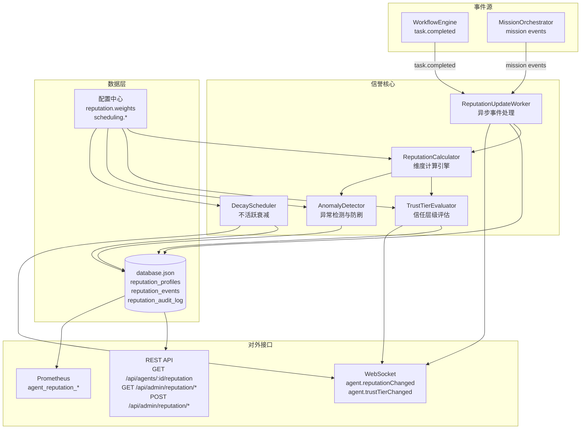

# 设计文档：Agent 信誉系统

## 概述

Agent 信誉系统为 Cube Brain 平台中的所有 Agent 建立统一的多维信誉评分机制。系统采用事件驱动架构，通过监听 `task.completed` 事件异步更新信誉分，不阻塞主工作流。核心组件包括：信誉数据模型（ReputationProfile）、信誉更新引擎（ReputationUpdateWorker）、信任层级评估器（TrustTierEvaluator）、异常检测器（AnomalyDetector）、衰减调度器（DecayScheduler）和运维 API。

信誉数据持久化到 `data/database.json` 的 `reputation_profiles` 和 `reputation_events` 表中，与现有 JSON 数据库模式一致。前端通过 REST API 和 WebSocket 事件获取信誉数据。

## 架构



### 数据流

1. 任务完成 → `task.completed` 事件发射
2. `ReputationUpdateWorker` 接收事件，采集原始信号
3. `AnomalyDetector` 检查是否触发异常/防刷规则
4. `ReputationCalculator` 计算各维度子分变动（受 maxDelta 限制）
5. 更新 `ReputationProfile`（整体 + 角色维度）
6. `TrustTierEvaluator` 评估信任层级变更
7. 生成 `ReputationChangeEvent` 写入数据库
8. 通过 WebSocket 推送变更通知

## 组件与接口

### 1. ReputationService（信誉服务入口）

```typescript
// server/core/reputation/reputation-service.ts
class ReputationService {
  constructor(
    private calculator: ReputationCalculator,
    private evaluator: TrustTierEvaluator,
    private detector: AnomalyDetector,
    private config: ReputationConfig
  ) {}

  /** 处理任务完成事件，异步更新信誉 */
  async handleTaskCompleted(signal: ReputationSignal): Promise<void>;

  /** 查询 Agent 完整信誉档案 */
  getReputation(agentId: string): ReputationProfile | undefined;

  /** 查询 Agent 在指定角色下的信誉 */
  getReputationByRole(
    agentId: string,
    roleId: string
  ): RoleReputationRecord | undefined;

  /** 手动调整信誉分（运维） */
  adjustReputation(
    agentId: string,
    dimension: string,
    delta: number,
    reason: string
  ): void;

  /** 重置信誉到初始值（运维） */
  resetReputation(agentId: string): void;

  /** 获取信誉排行榜 */
  getLeaderboard(options: LeaderboardOptions): LeaderboardEntry[];

  /** 执行不活跃衰减（由 DecayScheduler 调用） */
  applyInactivityDecay(): void;
}
```

### 2. ReputationCalculator（信誉计算引擎）

```typescript
// server/core/reputation/reputation-calculator.ts
class ReputationCalculator {
  constructor(private config: ReputationConfig) {}

  /** 计算各维度子分变动 */
  computeDimensionDeltas(
    current: DimensionScores,
    signal: ReputationSignal,
    streakCount: number
  ): DimensionDeltas;

  /** 计算综合信誉分 */
  computeOverallScore(dimensions: DimensionScores): number;

  /** 应用 maxDelta 限制 */
  clampDeltas(deltas: DimensionDeltas, maxDelta: number): DimensionDeltas;

  /** 指数移动平均 */
  ema(current: number, newValue: number, alpha: number): number;

  /** 比值线性映射（ratio <= 1.0 → 1000, ratio >= 2.0 → 0） */
  ratioToScore(ratio: number): number;
}
```

### 3. TrustTierEvaluator（信任层级评估器）

```typescript
// server/core/reputation/trust-tier-evaluator.ts
class TrustTierEvaluator {
  constructor(private config: ReputationConfig) {}

  /** 根据 overallScore 计算信誉等级 */
  computeGrade(overallScore: number): ReputationGrade;

  /** 根据信誉等级计算信任层级 */
  computeTrustTier(grade: ReputationGrade): TrustTier;

  /** 评估外部 Agent 的信任层级升级 */
  evaluateExternalUpgrade(profile: ReputationProfile): TrustTier;

  /** 检测信誉等级变更并触发事件 */
  evaluateGradeChange(
    oldGrade: ReputationGrade,
    newGrade: ReputationGrade,
    agentId: string,
    taskId: string
  ): ReputationEvent[];
}
```

### 4. AnomalyDetector（异常检测器）

```typescript
// server/core/reputation/anomaly-detector.ts
class AnomalyDetector {
  constructor(private config: ReputationConfig) {}

  /** 检测 24 小时内信誉异常波动 */
  checkAnomalyThreshold(
    agentId: string,
    recentEvents: ReputationChangeEvent[]
  ): AnomalyResult;

  /** 检测刷分模式（低复杂度任务占比过高） */
  checkGrindingPattern(
    agentId: string,
    recentTasks: TaskSummary[]
  ): GrindingResult;

  /** 检测互评串通 */
  checkCollabCollusion(taskforceRatings: CollabRatingPair[]): CollusionResult;

  /** 计算 probation 阶段的阻尼系数 */
  getProbationDamping(profile: ReputationProfile): number;
}
```

### 5. DecayScheduler（衰减调度器）

```typescript
// server/core/reputation/decay-scheduler.ts
class DecayScheduler {
  private intervalHandle: NodeJS.Timeout | null = null;

  /** 启动定时衰减检查（每天执行一次） */
  start(): void;

  /** 停止衰减调度 */
  stop(): void;

  /** 对所有不活跃 Agent 执行衰减 */
  runDecayCycle(): void;
}
```

### 6. AgentDirectory 扩展

```typescript
// 扩展 server/core/registry.ts
class AgentRegistry {
  // ... 现有方法 ...

  /** 获取 Agent 信誉档案 */
  getReputation(agentId: string): ReputationProfile | undefined;
}
```

### 7. WorkflowEngine 集成

在 `WorkflowEngine` 的任务分配逻辑中注入信誉因子：

```typescript
// 扩展 server/core/workflow-engine.ts 的任务分配逻辑
function computeAssignmentScore(
  fitnessScore: number,
  reputationProfile: ReputationProfile,
  taskRole?: string,
  config?: SchedulingConfig
): number;
```

## 数据模型

### ReputationProfile

```typescript
interface DimensionScores {
  qualityScore: number; // 0-1000
  speedScore: number; // 0-1000
  efficiencyScore: number; // 0-1000
  collaborationScore: number; // 0-1000
  reliabilityScore: number; // 0-1000
}

interface RoleReputationRecord {
  roleId: string;
  overallScore: number; // 0-1000
  dimensions: DimensionScores;
  totalTasksInRole: number;
  lowConfidence: boolean; // totalTasksInRole < 10
}

type ReputationGrade = "S" | "A" | "B" | "C" | "D";
type TrustTier = "trusted" | "standard" | "probation";

interface ReputationProfile {
  agentId: string;
  overallScore: number; // 0-1000, 整数
  dimensions: DimensionScores;
  grade: ReputationGrade;
  trustTier: TrustTier;
  isExternal: boolean;
  totalTasks: number;
  consecutiveHighQuality: number; // 连续高质量任务计数
  roleReputation: Record<string, RoleReputationRecord>;
  lastActiveAt: string | null; // ISO 时间戳
  createdAt: string;
  updatedAt: string;
}
```

### ReputationSignal（信誉更新信号）

```typescript
interface ReputationSignal {
  agentId: string;
  taskId: string | number;
  roleId?: string;
  taskQualityScore: number; // 0-100
  actualDurationMs: number;
  estimatedDurationMs: number;
  tokenConsumed: number;
  tokenBudget: number;
  wasRolledBack: boolean;
  downstreamFailures: number;
  collaborationRating?: number; // 0-100, 仅 Taskforce
  taskComplexity?: "low" | "medium" | "high";
  timestamp: string;
}
```

### ReputationChangeEvent（信誉变更事件）

```typescript
interface DimensionDeltas {
  qualityDelta: number;
  speedDelta: number;
  efficiencyDelta: number;
  collaborationDelta: number;
  reliabilityDelta: number;
}

interface ReputationChangeEvent {
  id: number;
  agentId: string;
  taskId: string | number | null;
  dimensionDeltas: DimensionDeltas;
  oldOverallScore: number;
  newOverallScore: number;
  reason: string; // "task_completed" | "inactivity_decay" | "streak_bonus" | "admin_adjust" | "admin_reset"
  timestamp: string;
}
```

### ReputationConfig（配置）

```typescript
interface ReputationConfig {
  weights: {
    quality: number; // 默认 0.30
    speed: number; // 默认 0.15
    efficiency: number; // 默认 0.20
    collaboration: number; // 默认 0.15
    reliability: number; // 默认 0.20
  };
  ema: {
    qualityAlpha: number; // 默认 0.15
    collaborationAlpha: number; // 默认 0.2
  };
  reliability: {
    rollbackPenalty: number; // 默认 30
    downstreamFailurePenalty: number; // 默认 15
    successRecovery: number; // 默认 5
  };
  maxDeltaPerUpdate: number; // 默认 50
  internalInitialScore: number; // 默认 500
  externalInitialScore: number; // 默认 400
  decay: {
    inactivityDays: number; // 默认 14
    decayRate: number; // 默认 10 分/周
    decayFloor: number; // 默认 300
  };
  streak: {
    threshold: number; // 默认 10 次
    qualityMin: number; // 默认 80
    alphaMultiplier: number; // 默认 1.5
  };
  anomaly: {
    threshold: number; // 默认 200
    grindingTaskRatio: number; // 默认 0.8
    grindingTaskCount: number; // 默认 30
    lowComplexityWeight: number; // 默认 0.3
    collusionRatingMin: number; // 默认 90
    collusionDeviationMin: number; // 默认 20
    suspiciousWeight: number; // 默认 0.5
    probationDamping: number; // 默认 0.7
  };
  grades: {
    S: { min: number; max: number }; // 900-1000
    A: { min: number; max: number }; // 700-899
    B: { min: number; max: number }; // 500-699
    C: { min: number; max: number }; // 300-499
    D: { min: number; max: number }; // 0-299
  };
  externalUpgrade: {
    standardTaskCount: number; // 默认 20
    standardMinScore: number; // 默认 500
    trustedTaskCount: number; // 默认 50
    trustedMinScore: number; // 默认 700
  };
  scheduling: {
    reputationWeight: number; // 默认 0.4
    fitnessWeight: number; // 默认 0.6
    competitionMinThreshold: number; // 默认 300
    leadMinScore: number; // 默认 600
    workerMinScore: number; // 默认 300
    reviewerMinQuality: number; // 默认 500
  };
  lowConfidence: {
    taskThreshold: number; // 默认 10
    dampingFactor: number; // 默认 0.6
    roleWeight: number; // 默认 0.4
    overallWeight: number; // 默认 0.6
  };
}
```

### 数据库 Schema 扩展

在 `server/db/index.ts` 的 `DatabaseSchema` 中新增：

```typescript
interface DatabaseSchema {
  // ... 现有表 ...
  reputation_profiles: ReputationProfile[];
  reputation_events: ReputationChangeEvent[];
  reputation_audit_log: ReputationAuditEntry[];
  _counters: {
    // ... 现有计数器 ...
    reputation_events: number;
    reputation_audit_log: number;
  };
}

interface ReputationAuditEntry {
  id: number;
  agentId: string;
  type:
    | "anomaly"
    | "grinding"
    | "collusion"
    | "admin_adjust"
    | "admin_reset"
    | "anomaly_review";
  detail: string;
  snapshot?: ReputationProfile; // 异常前快照
  timestamp: string;
}
```

### REST API

| 方法 | 路径                                  | 说明                               |
| ---- | ------------------------------------- | ---------------------------------- |
| GET  | /api/agents/:id/reputation            | 返回完整 ReputationProfile         |
| GET  | /api/admin/reputation/leaderboard     | 信誉排行榜（支持排序、分页、筛选） |
| POST | /api/admin/reputation/:agentId/adjust | 手动调整信誉分                     |
| POST | /api/admin/reputation/:agentId/reset  | 重置信誉到初始值                   |
| GET  | /api/admin/reputation/distribution    | 信誉分布直方图数据                 |
| GET  | /api/admin/reputation/trends          | 信誉趋势曲线数据                   |

### WebSocket 事件

| 事件名                  | 载荷                                                      | 说明         |
| ----------------------- | --------------------------------------------------------- | ------------ |
| agent.reputationChanged | `{ agentId, oldScore, newScore, grade, dimensionDeltas }` | 信誉变动通知 |
| agent.trustTierChanged  | `{ agentId, oldTier, newTier, reason }`                   | 信任层级变更 |
| reputation.anomaly      | `{ agentId, type, detail }`                               | 异常检测告警 |

## 正确性属性

_正确性属性是一种在系统所有合法执行中都应成立的特征或行为——本质上是关于系统应该做什么的形式化陈述。属性作为人类可读规范与机器可验证正确性保证之间的桥梁。_

### Property 1: 信誉分整数范围不变量

_For any_ ReputationProfile，overallScore 和所有五个维度子分（qualityScore、speedScore、efficiencyScore、collaborationScore、reliabilityScore）均为 [0, 1000] 范围内的整数。
**Validates: Requirements 1.1, 1.6**

### Property 2: 加权综合分公式

_For any_ 五个维度子分和一组权重配置，overallScore 应等于 `Math.round(quality * w.quality + speed * w.speed + efficiency * w.efficiency + collaboration * w.collaboration + reliability * w.reliability)`，且结果被 clamp 到 [0, 1000]。
**Validates: Requirements 1.2**

### Property 3: 维度更新公式正确性

_For any_ 当前维度分数和合法的 ReputationSignal，qualityScore 更新应遵循 EMA(current, taskQualityScore \* 10, alpha)；speedScore 更新应遵循 ratioToScore(actualDurationMs / estimatedDurationMs)；efficiencyScore 更新应遵循 ratioToScore(tokenConsumed / tokenBudget)；reliabilityScore 更新应遵循惩罚/恢复规则。
**Validates: Requirements 2.2**

### Property 4: 单次更新变动幅度限制

_For any_ 信誉更新操作，任意维度的单次变动绝对值不超过 maxDeltaPerUpdate。
**Validates: Requirements 2.4**

### Property 5: 信誉变更事件完整性

_For any_ 信誉更新操作（包括任务完成、衰减、连胜加速、手动调整），系统应生成一条 ReputationChangeEvent，包含正确的 agentId、dimensionDeltas、oldOverallScore、newOverallScore 和 reason。
**Validates: Requirements 2.5, 6.5**

### Property 6: 角色信誉与整体信誉并行更新

_For any_ 带有 roleId 的任务完成事件，系统应同时更新对应的 RoleReputationRecord 和整体 ReputationProfile，且两者的维度变动值一致。
**Validates: Requirements 3.2**

### Property 7: 低置信度标记

_For any_ RoleReputationRecord，当 totalTasksInRole < 10 时 lowConfidence 为 true，当 totalTasksInRole >= 10 时 lowConfidence 为 false。
**Validates: Requirements 3.3**

### Property 8: 任务分配得分公式

_For any_ fitnessScore 和 reputationFactor（= overallScore / 1000），assignmentScore 应等于 fitnessScore _ fitnessWeight + reputationFactor _ reputationWeight。
**Validates: Requirements 4.1**

### Property 9: 角色信誉替代与低置信度回退

_For any_ 带有角色要求的任务分配，当角色信誉 lowConfidence 为 false 时使用角色信誉分；当 lowConfidence 为 true 时使用 roleReputation _ 0.4 + overallReputation _ 0.6 的加权平均。
**Validates: Requirements 4.2**

### Property 10: 信誉阈值过滤

_For any_ 候选 Agent 集合，竞争模式下 overallScore < minReputationThreshold 的 Agent 被排除；Taskforce 组建中 Lead 要求 overallScore >= 600、Worker 要求 overallScore >= 300、Reviewer 要求 qualityScore >= 500。
**Validates: Requirements 4.3, 4.4**

### Property 11: 信誉等级与信任层级映射一致性

_For any_ overallScore，computeGrade 应返回确定性的等级（S/A/B/C/D），且 computeTrustTier 应返回与等级一致的信任层级（S/A→trusted, B→standard, C/D→probation）。
**Validates: Requirements 5.1, 5.2**

### Property 12: 外部 Agent 信任层级升级

_For any_ 外部 Agent 的 ReputationProfile，当 totalTasks >= 20 且 overallScore >= 500 时应升级为 standard；当 totalTasks >= 50 且 overallScore >= 700 时应升级为 trusted；否则保持 probation。
**Validates: Requirements 5.3**

### Property 13: 信誉等级降级事件

_For any_ 信誉等级从高变低的转换（如 A→B），系统应生成 REPUTATION_DOWNGRADE 事件；当降到 D 级时，应额外生成 AGENT_REPUTATION_CRITICAL 告警。
**Validates: Requirements 5.4**

### Property 14: 不活跃衰减规则

_For any_ 不活跃超过 inactivityDays 的 Agent，overallScore 应按 decayRate 衰减但不低于 decayFloor，且所有维度子分保持不变。当 Agent 恢复活跃后，衰减立即停止。
**Validates: Requirements 6.1, 6.2, 6.3**

### Property 15: 连胜加速机制

_For any_ 连续 N 次（N >= streak.threshold）taskQualityScore >= streak.qualityMin 的 Agent，后续信誉更新的 EMA alpha 值应为 alpha \* streak.alphaMultiplier；连续记录断裂后恢复正常 alpha。
**Validates: Requirements 6.4**

### Property 16: 异常波动检测

_For any_ Agent 在 24 小时内的信誉变动序列，当累计变动绝对值超过 anomalyThreshold 时，系统应检测到异常。
**Validates: Requirements 7.1**

### Property 17: 刷分模式检测

_For any_ Agent 在 24 小时内完成的任务序列，当 low 复杂度任务占比 > grindingTaskRatio 且总数 > grindingTaskCount 时，低复杂度任务的信誉更新权重应降低为 lowComplexityWeight。
**Validates: Requirements 7.2**

### Property 18: 互评串通检测

_For any_ Taskforce 中的 Agent 对，当互相给出的 collaborationRating 持续高于 collusionRatingMin 且与其他成员评分偏差 > collusionDeviationMin 时，可疑评分在信誉计算中降权为 suspiciousWeight。
**Validates: Requirements 7.3**

### Property 19: Probation 阶段正向更新阻尼

_For any_ 处于 probation 阶段的外部 Agent，正向信誉更新应乘以 probationDamping 系数（默认 0.7）。
**Validates: Requirements 7.4**

### Property 20: 排行榜排序正确性

_For any_ 排行榜查询结果，返回的 Agent 列表应按指定维度严格降序排列。
**Validates: Requirements 8.4**

## 错误处理

### 信誉更新失败

- 信誉更新过程中发生异常时，记录错误日志但不影响主工作流
- 更新失败的任务信号保留在队列中，下次更新周期重试
- 连续 3 次更新失败后，记录 REPUTATION_UPDATE_FAILED 告警

### 数据一致性

- 信誉更新采用"读取-计算-写入"原子操作，通过 JSON 数据库的同步写入保证一致性
- 衰减操作与正常更新操作互斥，通过简单锁机制避免竞态

### 配置错误

- 权重配置之和不等于 1.0 时，自动归一化并记录警告
- 配置值超出合理范围时，使用默认值并记录警告

### 异常检测误报

- 异常检测暂停信誉更新后，运维人员可通过 API 恢复或回滚
- 暂停期间的任务信号缓存，恢复后按时间顺序重放

## 测试策略

### 属性测试（Property-Based Testing）

使用 `fast-check` 库进行属性测试，每个属性测试运行至少 100 次迭代。

属性测试覆盖的核心领域：

- 信誉分计算公式的数学正确性（Property 2, 3, 8）
- 分数范围和精度不变量（Property 1, 4）
- 等级/层级映射的确定性和一致性（Property 11, 12）
- 阈值过滤的正确性（Property 10）
- 衰减和连胜机制的行为正确性（Property 14, 15）
- 异常检测规则的触发条件（Property 16, 17, 18, 19）

每个属性测试必须标注对应的设计文档属性编号：

- 标签格式：**Feature: agent-reputation, Property {number}: {property_text}**

### 单元测试

单元测试覆盖具体示例和边界情况：

- 内部/外部 Agent 初始化值验证
- API 端点的请求/响应格式验证
- 边界值测试（分数为 0、500、1000 时的行为）
- 错误处理路径（无效输入、缺失数据）

### 集成测试

- 任务完成 → 信誉更新 → WebSocket 推送的端到端流程
- 运维 API 的调整/重置/排行榜功能
- 衰减调度器的定时执行
