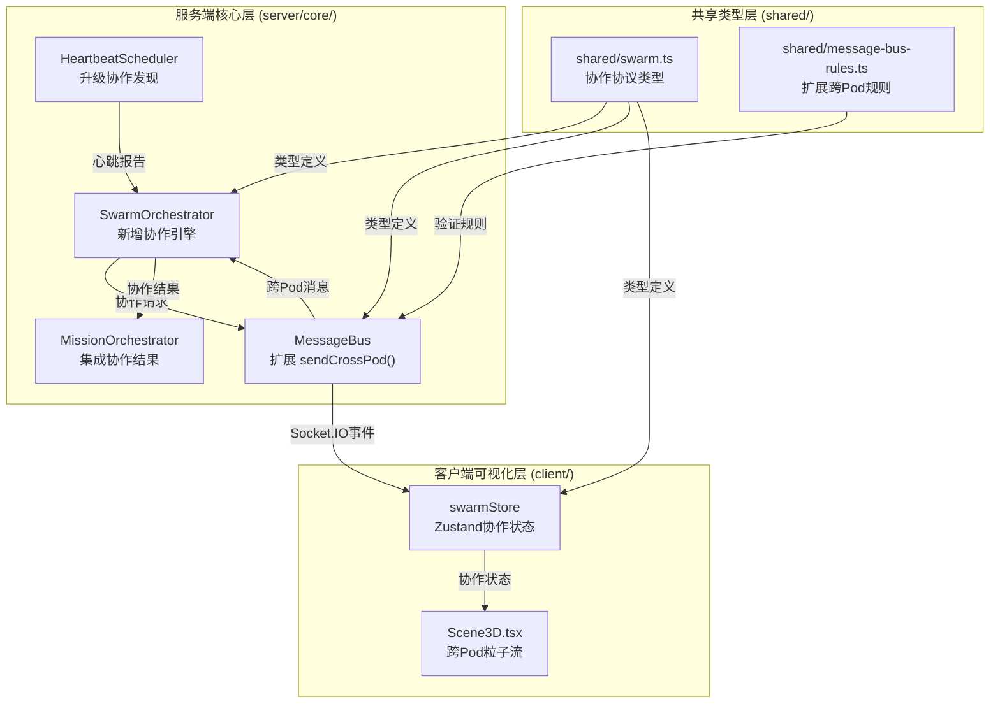
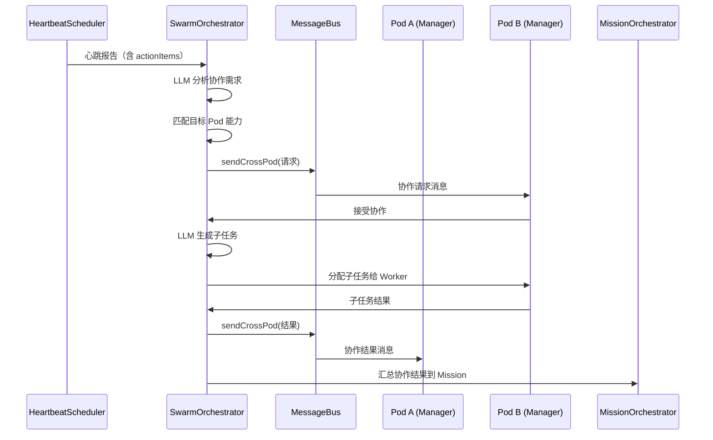
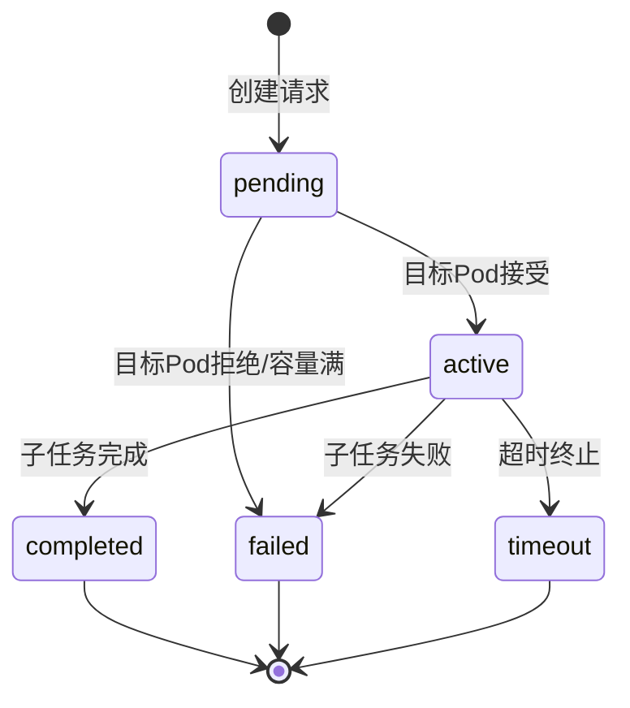

# 设计文档

## 概述

本设计实现跨 Pod 自主协作机制，通过扩展现有 MessageBus、HeartbeatScheduler 和 MissionOrchestrator，新增 SwarmOrchestrator 协作引擎和协作协议类型，使多个 Pod 能够自主发现协作机会、委派子任务并汇总结果。同时在 3D 场景中可视化跨 Pod 协作流。

### 设计决策

1. **Manager-to-Manager 通信模型**：跨 Pod 消息仅允许 Manager 之间直接通信，保持层级结构完整性，避免消息爆炸
2. **摘要优先传输**：跨 Pod 消息默认只传递摘要（前 200 字符），完整内容按需拉取，降低带宽压力
3. **协作深度限制**：默认最大 3 层嵌套协作，防止无限递归
4. **会话数量限制**：默认最多 3 个并发协作会话，防止系统过载
5. **LLM 驱动的协作发现**：复用现有 HeartbeatScheduler 的 LLM 调用能力，分析心跳报告发现协作机会
6. **仅当前 Mission 生命周期**：协作关系不持久化，仅在当前 Mission 内有效

## 架构



### 数据流



## 组件与接口

### 1. 消息总线规则扩展 (`shared/message-bus-rules.ts`)

扩展现有 `validateHierarchy()` 函数，新增跨 Pod 验证逻辑：

```typescript
/** 验证跨 Pod 消息权限：仅允许 Manager-to-Manager */
export function validateCrossPod(
  from: Pick<AgentRecord, "role" | "department">,
  to: Pick<AgentRecord, "role" | "department">
): boolean;
```

**规则**：
- `from.role === "manager"` 且 `to.role === "manager"`
- `from.department !== to.department`（必须跨 Pod）

### 2. 协作协议类型 (`shared/swarm.ts`)

新建文件，定义所有协作相关类型：

```typescript
export interface CollaborationRequest {
  id: string;
  sourcePodId: string;
  sourceManagerId: string;
  requiredCapabilities: string[];
  contextSummary: string;
  depth: number;
  workflowId: string;
  createdAt: number;
}

export interface CollaborationResponse {
  requestId: string;
  targetPodId: string;
  targetManagerId: string;
  status: "accepted" | "rejected" | "busy";
  estimatedCompletionMs?: number;
  reason?: string;
  respondedAt: number;
}

export interface CollaborationResult {
  requestId: string;
  sessionId: string;
  status: "completed" | "failed" | "timeout";
  resultSummary: string;
  subTaskOutputs: SubTaskOutput[];
  completedAt: number;
  errorReason?: string;
}

export interface SubTaskOutput {
  taskId: string;
  workerId: string;
  description: string;
  deliverable: string;
  status: "done" | "failed";
}

export interface CollaborationSession {
  id: string;
  request: CollaborationRequest;
  response?: CollaborationResponse;
  result?: CollaborationResult;
  status: "pending" | "active" | "completed" | "failed" | "timeout";
  startedAt: number;
  updatedAt: number;
  completedAt?: number;
}

export interface PodCapability {
  podId: string;
  managerId: string;
  capabilities: string[];
  currentLoad: number;
  maxConcurrency: number;
}

export interface SwarmConfig {
  maxDepth: number;           // 默认 3
  maxConcurrentSessions: number; // 默认 3
  sessionTimeoutMs: number;   // 默认 300000 (5分钟)
  summaryMaxLength: number;   // 默认 200
}
```

### 3. MessageBus 扩展 (`server/core/message-bus.ts`)

在现有 `MessageBus` 类上新增方法：

```typescript
class MessageBus {
  // 现有方法保持不变...

  /** 发送跨 Pod 消息（仅 Manager-to-Manager） */
  async sendCrossPod(
    fromId: string,
    toId: string,
    content: string,
    workflowId: string,
    metadata?: CrossPodMessageMetadata
  ): Promise<MessageRow>;

  /** 拉取跨 Pod 消息完整内容 */
  async getCrossPodMessageContent(messageId: number): Promise<string>;
}

interface CrossPodMessageMetadata {
  crossPod: true;
  sourcePodId: string;
  targetPodId: string;
  collaborationSessionId?: string;
  contentPreview: string;    // 前 200 字符摘要
}
```

**关键行为**：
- `sendCrossPod` 调用 `validateCrossPod()` 验证权限
- 消息内容存储完整版本，但 Socket.IO 事件仅包含摘要
- 发射 `cross_pod_message` Socket.IO 事件

### 4. SwarmOrchestrator (`server/core/swarm-orchestrator.ts`)

新建核心协作引擎：

```typescript
export class SwarmOrchestrator {
  constructor(options: SwarmOrchestratorOptions);

  /** 分析心跳报告，发现协作机会 */
  async analyzeHeartbeat(report: HeartbeatReport): Promise<CollaborationRequest | null>;

  /** 处理收到的协作请求 */
  async handleRequest(request: CollaborationRequest): Promise<CollaborationResponse>;

  /** 生成并分配子任务 */
  async generateSubTasks(session: CollaborationSession): Promise<SubTaskOutput[]>;

  /** 提交子任务结果 */
  async submitResult(sessionId: string, result: CollaborationResult): Promise<void>;

  /** 获取活跃会话列表 */
  getActiveSessions(): CollaborationSession[];

  /** 获取 Pod 能力注册表 */
  getPodCapabilities(): PodCapability[];

  /** 注册 Pod 能力 */
  registerPodCapability(capability: PodCapability): void;

  /** 终止超时会话 */
  async terminateTimedOutSessions(): Promise<CollaborationSession[]>;
}

interface SwarmOrchestratorOptions {
  messageBus: MessageBus;
  config: SwarmConfig;
  llmProvider: LLMProvider;
  agentDirectory: AgentDirectory;
}
```

**协作流程**：
1. `analyzeHeartbeat()` → LLM 分析心跳报告 → 识别协作需求 → 匹配目标 Pod
2. `handleRequest()` → 验证深度/容量 → 接受或拒绝 → 创建 Session
3. `generateSubTasks()` → LLM 生成子任务 → 分配给 Worker
4. `submitResult()` → 封装结果 → 回传源 Pod → 通知 MissionOrchestrator

### 5. HeartbeatScheduler 升级 (`server/core/heartbeat.ts`)

在现有 `trigger()` 方法完成后，增加协作发现钩子：

```typescript
// 在 trigger() 成功生成报告后
if (this.swarmOrchestrator) {
  await this.swarmOrchestrator.analyzeHeartbeat(report);
}
```

新增方法：
```typescript
class HeartbeatScheduler {
  /** 注入 SwarmOrchestrator 引用 */
  setSwarmOrchestrator(orchestrator: SwarmOrchestrator): void;
}
```

### 6. MissionOrchestrator 集成 (`server/core/mission-orchestrator.ts`)

扩展现有类，支持协作结果汇总：

```typescript
class MissionOrchestrator {
  /** 追加协作结果到 Mission 事件 */
  async appendCollaborationResult(
    missionId: string,
    session: CollaborationSession
  ): Promise<MissionRecord>;
}
```

### 7. 3D 可视化组件

#### Zustand Store (`client/src/stores/swarmStore.ts`)

```typescript
interface SwarmState {
  activeSessions: CollaborationSession[];
  crossPodMessages: CrossPodMessageEvent[];
  addSession(session: CollaborationSession): void;
  updateSession(sessionId: string, update: Partial<CollaborationSession>): void;
  removeSession(sessionId: string): void;
  addCrossPodMessage(event: CrossPodMessageEvent): void;
}
```

#### 粒子流组件 (`client/src/components/three/CrossPodParticles.tsx`)

```typescript
/** 渲染跨 Pod 消息粒子流动画 */
export function CrossPodParticles(): JSX.Element;
```

**视觉规则**：
- 每个活跃 CollaborationSession 使用独立颜色
- 粒子从源 Pod 位置流向目标 Pod 位置
- 活跃 Pod 区域添加发光高亮
- Session 结束后 1 秒内淡出动画
- 透明度随活跃会话数量递减（避免视觉混乱）

## 数据模型

### CollaborationSession 状态机



### 消息元数据扩展

现有 `MessageRow.metadata` 字段扩展，跨 Pod 消息包含：

```typescript
{
  crossPod: true,
  sourcePodId: string,
  targetPodId: string,
  collaborationSessionId?: string,
  contentPreview: string
}
```

### Pod 能力注册表

内存中维护，随 Mission 生命周期创建和销毁：

```typescript
Map<string, PodCapability>  // key: podId
```

能力描述符从 `WorkflowOrganizationDepartment.direction` 和 `WorkflowOrganizationNode.responsibilities` 提取。

### SwarmConfig 默认值

| 配置项 | 默认值 | 说明 |
|--------|--------|------|
| maxDepth | 3 | 最大协作嵌套深度 |
| maxConcurrentSessions | 3 | 最大并发协作会话数 |
| sessionTimeoutMs | 300000 | 会话超时时间（5分钟） |
| summaryMaxLength | 200 | 跨 Pod 消息摘要最大长度 |


## 正确性属性

*属性是系统在所有合法执行中都应保持为真的特征或行为——本质上是对系统应做什么的形式化陈述。属性是人类可读规范与机器可验证正确性保证之间的桥梁。*

### Property 1: 跨 Pod 消息投递与元数据正确性

*For any* 两个分属不同 Pod 的 Manager Agent，通过 `sendCrossPod` 发送消息后，返回的消息记录应包含 `crossPod: true` 元数据、正确的源 Pod ID 和目标 Pod ID，且应发射 `cross_pod_message` Socket.IO 事件。

**Validates: Requirements 1.1, 1.3, 1.4**

### Property 2: 非 Manager 跨 Pod 消息拒绝

*For any* 角色不是 Manager 的 Agent（Worker 或 CEO），尝试通过 `sendCrossPod` 发送消息时，应被拒绝并返回 `cross_pod_unauthorized` 错误码，且不产生任何消息记录。

**Validates: Requirements 1.2**

### Property 3: 跨 Pod 消息摘要截断

*For any* 字符串内容，跨 Pod 消息的 `contentPreview` 字段长度应不超过 `summaryMaxLength`（默认 200）字符。当原始内容长度超过该限制时，预览应为原始内容的前 `summaryMaxLength` 个字符。

**Validates: Requirements 1.5**

### Property 4: CollaborationSession 序列化往返一致性

*For any* 合法的 `CollaborationSession` 对象，执行 `JSON.parse(JSON.stringify(session))` 应产生与原始对象深度相等的结果。

**Validates: Requirements 2.5**

### Property 5: Pod 能力匹配返回相关 Pod

*For any* 能力描述符集合和 Pod 能力注册表，匹配函数返回的所有 Pod 的能力集合应与请求的能力描述符有非空交集。

**Validates: Requirements 3.2**

### Property 6: 协作结果封装保留所有子任务产出

*For any* 子任务产出列表，封装为 `CollaborationResult` 后，结果中的 `subTaskOutputs` 应包含所有输入的子任务产出，且 `status` 应正确反映子任务的整体完成状态（全部成功为 completed，任一失败为 failed）。

**Validates: Requirements 4.3, 4.4**

### Property 7: 协作深度限制执行

*For any* `CollaborationRequest`，当 `depth` 大于配置的 `maxDepth` 时，`handleRequest` 应返回 `rejected` 状态的 `CollaborationResponse`。当 `depth` 小于等于 `maxDepth` 时，不应因深度原因被拒绝。

**Validates: Requirements 5.1**

### Property 8: 并发协作会话数量限制

*For any* 正整数 N 作为 `maxConcurrentSessions` 配置值，当活跃会话数已达 N 时，新的协作请求应被拒绝并返回 `swarm_capacity_exceeded` 状态。当活跃会话数小于 N 时，不应因容量原因被拒绝。

**Validates: Requirements 5.2, 5.5**

### Property 9: 协作请求能力验证

*For any* `CollaborationRequest`，请求中的 `requiredCapabilities` 应属于源 Pod 的合法请求范围（即源 Pod 自身不具备但系统中其他 Pod 具备的能力）。请求自身已具备的能力应被拒绝。

**Validates: Requirements 5.3**

### Property 10: 超时会话自动终止

*For any* `CollaborationSession`，当 `startedAt + sessionTimeoutMs < currentTime` 时，调用 `terminateTimedOutSessions()` 应将该会话状态设为 `timeout`。未超时的会话不应被终止。

**Validates: Requirements 5.4**

### Property 11: 协作结果正确汇总到 Mission

*For any* 已完成的 `CollaborationSession`，调用 `appendCollaborationResult` 后，Mission 的事件列表应包含一条包含源 Pod ID、目标 Pod ID、协作耗时和结果状态的事件记录。

**Validates: Requirements 6.1, 6.3**

## 错误处理

### 消息总线层

| 错误场景 | 错误码 | 处理方式 |
|----------|--------|----------|
| 非 Manager 发送跨 Pod 消息 | `cross_pod_unauthorized` | 抛出 `MessageBusValidationError` |
| 同 Pod 内尝试跨 Pod 发送 | `same_pod_violation` | 抛出 `MessageBusValidationError` |
| Agent 不存在 | `unknown_agent` | 复用现有错误处理 |
| Workflow 不存在 | `unknown_workflow` | 复用现有错误处理 |

### SwarmOrchestrator 层

| 错误场景 | 处理方式 |
|----------|----------|
| 协作深度超限 | 返回 `rejected` 响应，reason 说明深度超限 |
| 并发会话超限 | 返回 `busy` 响应，status 为 `swarm_capacity_exceeded` |
| 能力不匹配 | 记录日志，返回 `null`，不抛出异常 |
| LLM 调用失败 | 记录错误日志，终止当前协作尝试，不影响其他会话 |
| 会话超时 | 自动终止会话，通知双方 Manager，标记 `timeout` 状态 |
| 子任务执行失败 | 在 `CollaborationResult` 中标记 `failed`，包含错误原因 |

### 3D 可视化层

| 错误场景 | 处理方式 |
|----------|----------|
| Socket.IO 连接断开 | 停止渲染新粒子流，保留已有动画直到自然结束 |
| Pod 位置信息缺失 | 跳过该粒子流渲染，不影响其他动画 |
| 过多并发动画 | 通过透明度递减和最大粒子数限制控制 |

## 测试策略

### 测试框架

- **单元测试与属性测试**：vitest（项目已使用）
- **属性测试库**：fast-check（需新增依赖）
- **测试文件**：`server/tests/autonomous-swarm.test.ts`

### 双重测试方法

#### 属性测试（Property-Based Testing）

每个正确性属性对应一个属性测试，使用 fast-check 生成随机输入，最少运行 100 次迭代。

每个测试标注对应的设计属性：
```typescript
// Feature: autonomous-swarm, Property 1: 跨 Pod 消息投递与元数据正确性
// Validates: Requirements 1.1, 1.3, 1.4
```

属性测试覆盖：
- Property 1-3：MessageBus 跨 Pod 消息验证
- Property 4：CollaborationSession 序列化往返
- Property 5：Pod 能力匹配
- Property 6：协作结果封装
- Property 7-8：深度和并发限制
- Property 9：能力验证
- Property 10：超时终止
- Property 11：Mission 结果汇总

#### 单元测试

单元测试聚焦于：
- 具体示例验证（如特定 Agent 配置下的消息发送）
- 边界条件（空能力列表、深度恰好等于上限）
- 集成点（HeartbeatScheduler → SwarmOrchestrator 钩子）
- 错误条件（LLM 不可用、Agent 不存在）

### 测试配置

```typescript
// vitest 配置
{
  test: {
    include: ['server/tests/autonomous-swarm.test.ts'],
    testTimeout: 30000, // 属性测试可能需要更长时间
  }
}

// fast-check 配置
fc.assert(fc.property(...), { numRuns: 100 });
```

### 测试不覆盖的范围

- 3D 渲染效果（需求 7.1-7.5）：需要手动视觉验证
- LLM 输出质量（需求 3.1, 4.1）：LLM 输出非确定性，通过 mock 测试调用流程
- Socket.IO 实时性能（需求 7.5 的 200ms 要求）：需要端到端性能测试
