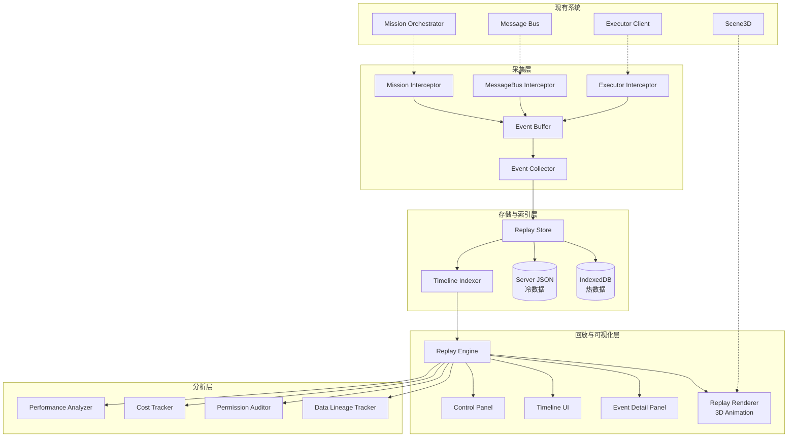

# 设计文档：协作回放系统 (Collaboration Replay)

## 概述

协作回放系统为 Cube Pets Office 平台提供 Mission 执行过程的完整录制与回放能力。系统分为三大层次：

1. **采集层**：通过事件拦截器（Event Interceptor）挂载到现有 Mission Runtime 和 Message Bus，异步采集所有执行事件
2. **存储与索引层**：将事件持久化到 IndexedDB（前端热数据）和服务端 JSON 文件（冷数据），构建多维索引
3. **回放与可视化层**：回放引擎驱动事件按时间顺序回放，3D 渲染器将事件映射为场景动画

系统采用"观察者模式 + 事件溯源"架构，采集层对现有业务代码零侵入（通过中间件/钩子注入），回放层完全基于事件流重建状态。

## 架构



### 集成策略

与现有系统的集成采用"拦截器模式"，不修改现有模块的核心逻辑：

- **Mission Runtime 集成**：在 `MissionOrchestrator` 的关键生命周期点（create、stageTransition、complete、fail）注册回调钩子
- **Message Bus 集成**：包装 `MessageBus.send()` 方法，在消息发送前后采集通信事件
- **Executor 集成**：监听 `/api/executor/events` 回调，采集代码执行和资源访问事件
- **3D 场景集成**：在现有 `Scene3D` 组件旁新增 `ReplayScene3D` 组件，复用 `OfficeRoom` 和 `PetWorkers` 子组件
- **Socket.IO 集成**：复用现有 `mission_event` 通道，新增 `replay_event` 事件类型

## 组件与接口

### 1. Event Collector（事件采集器）

```typescript
// shared/replay/contracts.ts

export const REPLAY_EVENT_TYPES = [
  'AGENT_STARTED', 'AGENT_STOPPED',
  'MESSAGE_SENT', 'MESSAGE_RECEIVED',
  'DECISION_MADE', 'CODE_EXECUTED',
  'RESOURCE_ACCESSED', 'ERROR_OCCURRED',
  'MILESTONE_REACHED',
] as const;
export type ReplayEventType = typeof REPLAY_EVENT_TYPES[number];

export const MESSAGE_TYPES = [
  'INSTRUCTION', 'RESPONSE', 'QUERY', 'RESULT', 'ERROR', 'FEEDBACK',
] as const;
export type MessageType = typeof MESSAGE_TYPES[number];

export const MESSAGE_STATUSES = [
  'SENT', 'RECEIVED', 'PROCESSED', 'FAILED',
] as const;
export type MessageStatus = typeof MESSAGE_STATUSES[number];

export const EXECUTION_STATUSES = [
  'SUCCESS', 'FAILURE', 'TIMEOUT', 'EXCEPTION',
] as const;
export type ExecutionStatus = typeof EXECUTION_STATUSES[number];

export const RESOURCE_TYPES = [
  'FILE', 'DATABASE', 'API', 'NETWORK', 'MCP_TOOL',
] as const;
export type ResourceType = typeof RESOURCE_TYPES[number];

export const ACCESS_TYPES = [
  'READ', 'WRITE', 'DELETE', 'EXECUTE', 'QUERY',
] as const;
export type AccessType = typeof ACCESS_TYPES[number];

export interface ExecutionEvent {
  eventId: string;
  missionId: string;
  timestamp: number;
  eventType: ReplayEventType;
  sourceAgent: string;
  targetAgent?: string;
  eventData: Record<string, unknown>;
  metadata?: Record<string, unknown>;
}

export interface CommunicationEventData {
  senderId: string;
  receiverId: string;
  messageId: string;
  messageContent: string | Record<string, unknown>;
  messageType: MessageType;
  status: MessageStatus;
  forwardChain?: Array<{ agentId: string; timestamp: number }>;
}

export interface DecisionEventData {
  decisionId: string;
  agentId: string;
  decisionInput: Record<string, unknown>;
  decisionLogic: string;
  decisionResult: unknown;
  alternatives?: unknown[];
  confidence: number;
  validation?: { correct?: boolean; betterChoice?: string };
}

export interface CodeExecutionEventData {
  agentId: string;
  codeSnippet: string;
  codeLanguage: string;
  codeLocation?: { file: string; startLine: number; endLine: number };
  executionInput: Record<string, unknown>;
  executionOutput: {
    stdout: string;
    stderr: string;
    returnValue?: unknown;
  };
  executionStatus: ExecutionStatus;
  executionTime: number;
  versionId?: string;
  changeReason?: string;
}

export interface ResourceAccessEventData {
  agentId: string;
  resourceType: ResourceType;
  resourceId: string;
  accessType: AccessType;
  accessResult: {
    success: boolean;
    dataSummary?: string;
    duration: number;
  };
  permissionCheck?: {
    requested: string;
    actual: string;
    rule: string;
    passed: boolean;
  };
  sensitiveDataMasked?: boolean;
}
```

```typescript
// server/replay/event-collector.ts

interface EventCollectorOptions {
  bufferSize?: number;       // 默认 1000
  flushIntervalMs?: number;  // 默认 500ms
  maxRetries?: number;       // 默认 3
}

class EventCollector {
  private buffer: ExecutionEvent[];
  private failedQueue: ExecutionEvent[];

  constructor(store: ReplayStore, options?: EventCollectorOptions);

  /** 异步入队事件，不阻塞调用方 */
  emit(event: Omit<ExecutionEvent, 'eventId' | 'timestamp'>): void;

  /** 批量刷新缓冲区到存储层 */
  flush(): Promise<void>;

  /** 重试失败队列中的事件 */
  retryFailed(): Promise<void>;

  /** 获取采集统计信息 */
  getStats(): { buffered: number; failed: number; total: number };
}
```

### 2. Event Interceptors（事件拦截器）

```typescript
// server/replay/interceptors.ts

/** 挂载到 MissionOrchestrator 的生命周期钩子 */
function installMissionInterceptor(
  orchestrator: MissionOrchestrator,
  collector: EventCollector
): void;

/** 包装 MessageBus.send，采集通信事件 */
function installMessageBusInterceptor(
  messageBus: MessageBus,
  collector: EventCollector
): void;

/** 监听 Executor 回调事件 */
function installExecutorInterceptor(
  collector: EventCollector
): express.RequestHandler;
```

### 3. Replay Store（回放数据存储）

```typescript
// shared/replay/store-interface.ts

interface ReplayStoreInterface {
  /** 追加事件（增量写入） */
  appendEvents(missionId: string, events: ExecutionEvent[]): Promise<void>;

  /** 按条件查询事件 */
  queryEvents(query: EventQuery): Promise<ExecutionEvent[]>;

  /** 获取时间轴概要 */
  getTimeline(missionId: string): Promise<ExecutionTimeline>;

  /** 导出事件流 */
  exportEvents(missionId: string, format: 'json' | 'csv'): Promise<string>;

  /** 验证数据完整性 */
  verifyIntegrity(missionId: string): Promise<boolean>;

  /** 压缩存储 */
  compact(missionId: string): Promise<void>;

  /** 清理过期数据 */
  cleanup(olderThanDays: number): Promise<number>;
}

interface EventQuery {
  missionId: string;
  timeRange?: { start: number; end: number };
  agentIds?: string[];
  eventTypes?: ReplayEventType[];
  resourceIds?: string[];
  limit?: number;
  offset?: number;
}

interface ExecutionTimeline {
  missionId: string;
  events: ExecutionEvent[];
  startTime: number;
  endTime: number;
  totalDuration: number;
  eventCount: number;
}
```

```typescript
// server/replay/replay-store.ts — 服务端实现（JSON 文件）
class ServerReplayStore implements ReplayStoreInterface { ... }

// client/src/lib/replay/replay-store.ts — 前端实现（IndexedDB）
class BrowserReplayStore implements ReplayStoreInterface { ... }
```

### 4. Replay Engine（回放引擎）

```typescript
// client/src/lib/replay/replay-engine.ts

export const PLAYBACK_SPEEDS = [0.5, 1, 2, 4, 8] as const;
export type PlaybackSpeed = typeof PLAYBACK_SPEEDS[number];

export type ReplayState = 'idle' | 'playing' | 'paused' | 'stopped';

interface ReplayEngineState {
  state: ReplayState;
  speed: PlaybackSpeed;
  currentTime: number;
  currentEventIndex: number;
  totalDuration: number;
  eventCount: number;
  filters: ReplayFilters;
}

interface ReplayFilters {
  eventTypes?: ReplayEventType[];
  agentIds?: string[];
  keyword?: string;
}

class ReplayEngine {
  constructor(timeline: ExecutionTimeline);

  play(): void;
  pause(): void;
  resume(): void;
  stop(): void;
  seek(timestamp: number): void;
  setSpeed(speed: PlaybackSpeed): void;
  setFilters(filters: ReplayFilters): void;

  getState(): ReplayEngineState;
  getCurrentEvent(): ExecutionEvent | null;
  getFilteredEvents(): ExecutionEvent[];

  /** 事件回调 */
  onEvent(callback: (event: ExecutionEvent) => void): () => void;
  onStateChange(callback: (state: ReplayEngineState) => void): () => void;
}
```

### 5. Replay Renderer（3D 回放渲染器）

```typescript
// client/src/components/replay/ReplayScene3D.tsx

interface ReplayScene3DProps {
  engine: ReplayEngine;
  timeline: ExecutionTimeline;
}

/** 复用 OfficeRoom + PetWorkers，叠加回放动画层 */
function ReplayScene3D(props: ReplayScene3DProps): JSX.Element;

// 子组件
function AgentActivityOverlay(props: { event: ExecutionEvent }): JSX.Element;
function CommunicationLine(props: { from: string; to: string; active: boolean }): JSX.Element;
function DecisionGlow(props: { agentId: string; confidence: number }): JSX.Element;
function ErrorHighlight(props: { agentId: string }): JSX.Element;
```

### 6. Replay UI 组件

```typescript
// client/src/components/replay/ReplayPage.tsx — 回放主页面
// 布局：3D 场景（中心）+ 时间轴（底部）+ 事件详情（右侧）+ 控制面板（顶部）

// client/src/components/replay/TimelineBar.tsx — 时间轴组件
// client/src/components/replay/ControlPanel.tsx — 播放控制面板
// client/src/components/replay/EventDetailPanel.tsx — 事件详情面板
// client/src/components/replay/SnapshotManager.tsx — 快照管理
// client/src/components/replay/ComparisonView.tsx — 对比分析视图
// client/src/components/replay/TeachingOverlay.tsx — 教学演示覆盖层
// client/src/components/replay/CostTracker.tsx — 成本追踪面板
// client/src/components/replay/PerformancePanel.tsx — 性能分析面板
// client/src/components/replay/DataLineageGraph.tsx — 数据血缘图
// client/src/components/replay/ExportDialog.tsx — 导出对话框
```

### 7. Replay Zustand Store

```typescript
// client/src/lib/replay/replay-store-ui.ts

interface ReplayUIState {
  // 回放状态
  missionId: string | null;
  engine: ReplayEngine | null;
  timeline: ExecutionTimeline | null;

  // UI 状态
  selectedEventId: string | null;
  isFullscreen: boolean;
  isDemoMode: boolean;
  isComparisonMode: boolean;
  comparisonMissionId: string | null;

  // 快照
  snapshots: ReplaySnapshot[];

  // 分析面板开关
  showCostTracker: boolean;
  showPerformance: boolean;
  showDataLineage: boolean;
  showPermissionAudit: boolean;

  // Actions
  loadReplay(missionId: string): Promise<void>;
  selectEvent(eventId: string): void;
  createSnapshot(label: string, note?: string): void;
  jumpToSnapshot(snapshotId: string): void;
  toggleDemoMode(): void;
  startComparison(missionId: string): void;
  stopComparison(): void;
}
```

### 8. 分析组件

```typescript
// client/src/lib/replay/data-lineage.ts
class DataLineageTracker {
  buildLineageGraph(events: ExecutionEvent[]): LineageGraph;
  traceDataPoint(dataId: string): LineageChain;
  traceDecisionInputs(decisionId: string): DataSource[];
  getDataChanges(dataId: string): DataChange[];
}

// client/src/lib/replay/cost-tracker.ts
class CostTracker {
  calculateCumulativeCost(events: ExecutionEvent[], upToTime: number): CostSummary;
  getCostDistribution(events: ExecutionEvent[]): CostDistribution;
  detectCostAnomalies(events: ExecutionEvent[], threshold: number): CostAnomaly[];
  generateOptimizationSuggestions(distribution: CostDistribution): string[];
}

// client/src/lib/replay/performance-analyzer.ts
class PerformanceAnalyzer {
  calculateMetrics(timeline: ExecutionTimeline): PerformanceMetrics;
  detectBottlenecks(timeline: ExecutionTimeline): Bottleneck[];
  analyzeConcurrency(timeline: ExecutionTimeline): ConcurrencyProfile;
  comparePerformance(a: ExecutionTimeline, b: ExecutionTimeline): PerformanceComparison;
}

// client/src/lib/replay/permission-auditor.ts
class PermissionAuditor {
  getPermissionEvents(events: ExecutionEvent[]): PermissionEvent[];
  getViolationStats(events: ExecutionEvent[]): ViolationStats;
  getPermissionChanges(events: ExecutionEvent[]): PermissionChange[];
}
```

### 9. 审计与导出

```typescript
// server/replay/audit-logger.ts
class ReplayAuditLogger {
  logAction(userId: string, missionId: string, action: string): void;
  queryAuditLog(query: AuditQuery): AuditEntry[];
}

// client/src/lib/replay/exporter.ts
class ReplayExporter {
  exportJSON(timeline: ExecutionTimeline): string;
  exportCSV(timeline: ExecutionTimeline): string;
  exportInteractiveHTML(timeline: ExecutionTimeline): string;
  generateReport(timeline: ExecutionTimeline, options: ReportOptions): string;
}
```

### 10. REST API

| 方法 | 路径 | 说明 |
|------|------|------|
| GET | /api/replay/:missionId | 获取 Mission 回放时间轴 |
| GET | /api/replay/:missionId/events | 查询事件（支持过滤参数） |
| GET | /api/replay/:missionId/export | 导出事件流（format=json\|csv） |
| POST | /api/replay/:missionId/snapshots | 创建快照 |
| GET | /api/replay/:missionId/snapshots | 获取快照列表 |
| GET | /api/replay/:missionId/lineage | 获取数据血缘图 |
| GET | /api/replay/:missionId/audit | 获取审计日志 |
| POST | /api/replay/:missionId/verify | 验证数据完整性 |

## 数据模型

### ExecutionEvent（核心事件）

```typescript
interface ExecutionEvent {
  eventId: string;           // UUID v4
  missionId: string;         // 关联的 Mission ID
  timestamp: number;         // 毫秒级 Unix 时间戳
  eventType: ReplayEventType;
  sourceAgent: string;       // 来源 Agent ID
  targetAgent?: string;      // 目标 Agent ID（通信事件必填）
  eventData: CommunicationEventData
    | DecisionEventData
    | CodeExecutionEventData
    | ResourceAccessEventData
    | Record<string, unknown>;
  metadata?: {
    phase?: string;          // Mission 阶段
    stageKey?: string;       // 对应 MissionStage.key
    cost?: number;           // 本次操作成本（美元）
    tokenUsage?: { prompt: number; completion: number };
    checksum?: string;       // 事件数据校验和
  };
}
```

### ExecutionTimeline（时间轴）

```typescript
interface ExecutionTimeline {
  missionId: string;
  events: ExecutionEvent[];
  startTime: number;
  endTime: number;
  totalDuration: number;     // endTime - startTime
  eventCount: number;        // events.length
  indices: {
    byTime: Map<number, number[]>;      // 时间桶 → 事件索引
    byAgent: Map<string, number[]>;     // Agent ID → 事件索引
    byType: Map<ReplayEventType, number[]>; // 事件类型 → 事件索引
    byResource: Map<string, number[]>;  // 资源 ID → 事件索引
  };
  version: number;           // 数据版本号
  checksum: string;          // 整体校验和
}
```

### ReplaySnapshot（快照）

```typescript
interface ReplaySnapshot {
  snapshotId: string;
  missionId: string;
  timestamp: number;         // 快照对应的回放时间点
  createdAt: number;         // 快照创建时间
  label: string;
  note?: string;
  version: number;
  state: {
    eventCursorIndex: number;
    filters: ReplayFilters;
    cameraPosition: [number, number, number];
    cameraTarget: [number, number, number];
    speed: PlaybackSpeed;
  };
}
```

### LineageGraph（数据血缘图）

```typescript
interface LineageNode {
  id: string;
  eventId: string;
  agentId: string;
  dataKey: string;
  timestamp: number;
}

interface LineageEdge {
  from: string;  // LineageNode.id
  to: string;
  transformType: 'pass-through' | 'transform' | 'aggregate' | 'split';
}

interface LineageGraph {
  nodes: LineageNode[];
  edges: LineageEdge[];
}
```

### CostSummary（成本摘要）

```typescript
interface CostSummary {
  totalCost: number;
  byAgent: Record<string, number>;
  byModel: Record<string, number>;
  byOperationType: Record<string, number>;
  anomalies: CostAnomaly[];
}

interface CostAnomaly {
  eventId: string;
  cost: number;
  threshold: number;
  reason: string;
}
```

### PerformanceMetrics（性能指标）

```typescript
interface PerformanceMetrics {
  totalDuration: number;
  stageMetrics: Array<{
    stageKey: string;
    duration: number;
    isBottleneck: boolean;
  }>;
  llmMetrics: {
    callCount: number;
    avgResponseTime: number;
    totalTokens: number;
  };
  concurrency: {
    maxConcurrentAgents: number;
    avgConcurrentAgents: number;
    timeline: Array<{ time: number; activeAgents: number }>;
  };
}
```

### AuditEntry（审计条目）

```typescript
interface AuditEntry {
  id: string;
  userId: string;
  missionId: string;
  action: 'play' | 'pause' | 'seek' | 'export' | 'snapshot' | 'view';
  timestamp: number;
  details?: Record<string, unknown>;
}
```

### 存储结构

**服务端 JSON 文件结构**：
```
data/replay/
  ├── {missionId}/
  │   ├── events.jsonl          # 事件流（JSONL 格式，增量追加）
  │   ├── timeline.json         # 时间轴元数据和索引
  │   ├── snapshots.json        # 快照列表
  │   ├── lineage.json          # 数据血缘图
  │   └── audit.jsonl           # 审计日志
  └── index.json                # 所有 Mission 回放索引
```

**前端 IndexedDB Store**：
```
replay-events     — 事件记录（按 missionId 分区）
replay-timelines  — 时间轴元数据
replay-snapshots  — 快照数据
```


## 正确性属性 (Correctness Properties)

*属性（Property）是一种在系统所有有效执行中都应成立的特征或行为——本质上是对系统应做什么的形式化陈述。属性是人类可读规范与机器可验证正确性保证之间的桥梁。*

以下属性基于需求文档中的验收标准推导而来，每个属性都包含显式的"对于任意"（for all）量化声明，可直接用于属性测试（property-based testing）。

### Property 1: 事件结构完整性

*对于任意* ExecutionEvent，根据其 eventType，eventData 中应包含该类型所要求的全部必填字段：
- MESSAGE_SENT/MESSAGE_RECEIVED → senderId、receiverId、messageId、messageContent、messageType、status
- DECISION_MADE → decisionId、agentId、decisionInput、decisionLogic、decisionResult、confidence
- CODE_EXECUTED → agentId、codeSnippet、codeLanguage、executionInput、executionOutput、executionStatus、executionTime
- RESOURCE_ACCESSED → agentId、resourceType、resourceId、accessType、accessResult

且所有事件的公共字段（eventId、missionId、timestamp、eventType、sourceAgent）均为非空值。

**Validates: Requirements 1.1, 2.1, 2.5, 3.1, 3.3, 3.4, 4.1, 4.2, 4.4, 4.5, 5.1, 5.4, 5.6**

### Property 2: 事件采集非阻塞

*对于任意*事件，调用 `EventCollector.emit()` 应在不等待持久化完成的情况下立即返回（同步入队到内存缓冲区），不阻塞调用方线程。

**Validates: Requirements 1.4**

### Property 3: 采集失败缓冲与重试

*对于任意*事件，当底层存储写入失败时，该事件应被放入失败队列（failedQueue），且失败队列的长度应增加 1。调用 `retryFailed()` 后，成功重试的事件应从失败队列中移除。

**Validates: Requirements 1.6**

### Property 4: 消息内容保真

*对于任意*消息内容（字符串或 JSON 对象），采集后存储的 messageContent 应与原始内容深度相等（`deepEqual`）。

**Validates: Requirements 2.3**

### Property 5: 敏感数据保护

*对于任意*标记为敏感的消息或资源访问事件，存储后的敏感字段值应与原始明文不同（已加密或已脱敏），且通过解密/还原操作应能恢复原始值。

**Validates: Requirements 2.4, 5.5**

### Property 6: 消息转发链路有效性

*对于任意*包含转发链路的通信事件，forwardChain 数组中的每个条目应包含有效的 agentId（非空字符串），且时间戳应严格单调递增。

**Validates: Requirements 2.6**

### Property 7: 决策置信度范围不变量

*对于任意* DecisionEvent，confidence 字段的值应满足 `0 <= confidence <= 1`。

**Validates: Requirements 3.5**

### Property 8: 决策验证标注往返

*对于任意* DecisionEvent，添加验证标注（correct: boolean, betterChoice: string）后，重新读取该事件应返回相同的验证标注值。

**Validates: Requirements 3.6**

### Property 9: 时间轴一致性

*对于任意*由事件列表构建的 ExecutionTimeline：
- `totalDuration` 应等于 `endTime - startTime`
- `eventCount` 应等于 `events.length`
- `startTime` 应等于第一个事件的 timestamp
- `endTime` 应等于最后一个事件的 timestamp
- events 应按 timestamp 升序排列

**Validates: Requirements 6.1**

### Property 10: 多维索引正确性

*对于任意* ExecutionTimeline 和任意查询条件（agentId、eventType、timeRange），通过索引查询返回的事件子集中，每个事件都应满足查询条件，且不遗漏任何满足条件的事件。

**Validates: Requirements 6.2**

### Property 11: 压缩存储体积缩减

*对于任意*包含 10 条以上事件的事件集合，压缩后的序列化体积应小于原始 JSON 序列化体积。

**Validates: Requirements 6.3**

### Property 12: 增量追加不变量

*对于任意* ExecutionTimeline，追加 N 条新事件后：
- `eventCount` 应增加 N
- 原有事件的顺序和内容不变
- 新事件出现在末尾

**Validates: Requirements 6.4, 19.3**

### Property 13: JSON 导出往返

*对于任意* ExecutionTimeline，导出为 JSON 后再解析，应产生与原始时间轴深度相等的对象。

**Validates: Requirements 6.6, 15.1**

### Property 14: 回放引擎状态机

*对于任意*回放引擎操作序列，状态转换应遵循以下规则：
- idle → play → playing
- playing → pause → paused
- paused → resume → playing
- playing/paused → stop → stopped
- 在 playing 状态下暂停后，currentEvent 应保持不变

**Validates: Requirements 7.1, 7.6**

### Property 15: 过滤正确性

*对于任意*事件列表和任意过滤条件（eventTypes 和/或 agentIds），过滤后的结果应满足：
- 结果中每个事件的 eventType 在 eventTypes 集合中（若指定）
- 结果中每个事件的 sourceAgent 或 targetAgent 在 agentIds 集合中（若指定）
- 结果长度 <= 原始列表长度

**Validates: Requirements 7.3, 7.4**

### Property 16: 时间戳跳转正确性

*对于任意*时间轴和任意有效时间戳 T（startTime <= T <= endTime），seek(T) 后当前事件的 timestamp 应是所有事件中 <= T 的最大值。

**Validates: Requirements 7.5**

### Property 17: 关联事件查询

*对于任意*事件 E，查询其关联事件应返回与 E 共享相同 messageId、decisionId 或 resourceId 的所有事件，且不包含不相关的事件。

**Validates: Requirements 9.6**

### Property 18: 血缘追踪连通性

*对于任意*血缘图中的数据点，追溯其血缘链路应返回一条从源头到该数据点的连通路径，路径中每条边的 from 节点等于前一条边的 to 节点。同时，追溯决策事件的输入数据应返回所有直接依赖的数据源节点。

**Validates: Requirements 10.2, 10.3**

### Property 19: 血缘-时间轴集成

*对于任意*血缘图中的节点，其 eventId 应对应 ExecutionTimeline 中的一个有效事件。

**Validates: Requirements 10.4**

### Property 20: 权限违规统计正确性

*对于任意*事件列表，权限违规统计的总违规次数应等于事件中 `permissionCheck.passed === false` 的事件数量，且按类型和 Agent 的分布之和应等于总数。

**Validates: Requirements 11.5**

### Property 21: 成本计算不变量

*对于任意*事件列表和任意时间点 T：
- 截至 T 的累计成本应等于所有 timestamp <= T 的事件的 metadata.cost 之和
- 按 Agent/模型/操作类型的成本分布之和应等于总成本

**Validates: Requirements 12.1, 12.2**

### Property 22: 成本异常检测

*对于任意*事件列表和任意阈值 threshold，检测到的异常事件集合应恰好包含所有 metadata.cost > threshold 的事件。

**Validates: Requirements 12.3**

### Property 23: 性能指标一致性

*对于任意* ExecutionTimeline，计算的性能指标应满足：
- totalDuration 等于 timeline.totalDuration
- 各阶段耗时之和 <= totalDuration
- LLM 调用次数等于 DECISION_MADE 类型事件的数量

**Validates: Requirements 13.1**

### Property 24: 瓶颈检测正确性

*对于任意* ExecutionTimeline，标记为瓶颈的阶段其耗时应 > 所有阶段平均耗时的 2 倍，未标记为瓶颈的阶段其耗时应 <= 2 倍平均耗时。

**Validates: Requirements 13.2**

### Property 25: 并发度分析边界

*对于任意* ExecutionTimeline，分析的并发度应满足：
- maxConcurrentAgents >= 1
- maxConcurrentAgents <= 时间轴中出现的不同 Agent 总数
- 并发度时间线中每个时间点的 activeAgents >= 0

**Validates: Requirements 13.4**

### Property 26: 快照往返

*对于任意*回放状态（包括事件游标、过滤条件、播放速度），创建快照后跳转到该快照，恢复的状态应与创建时的状态深度相等。快照的 label 和 note 在创建和读取之间应保持不变。

**Validates: Requirements 14.1, 14.2, 14.3**

### Property 27: 快照导出/导入往返

*对于任意* ReplaySnapshot，导出为 JSON 后再导入，应产生与原始快照深度相等的对象。

**Validates: Requirements 14.4**

### Property 28: 报告内容定制

*对于任意*报告选项（选择包含的章节集合），生成的报告应仅包含所选章节的内容，不包含未选章节。

**Validates: Requirements 15.3**

### Property 29: 交互式 HTML 包含事件数据

*对于任意* ExecutionTimeline，导出的交互式 HTML 应包含嵌入的事件数据（可从 HTML 中提取并解析为等价的事件列表）。

**Validates: Requirements 15.5**

### Property 30: 事件流差异正确性

*对于任意*两个事件流 A 和 B，差异分析应正确识别：
- 仅在 A 中出现的事件类型
- 仅在 B 中出现的事件类型
- 两者共有的事件类型
且三个集合的并集应等于 A 和 B 的事件类型并集。

**Validates: Requirements 16.4**

### Property 31: 对比结果导出往返

*对于任意*对比分析结果，导出为 JSON 后再解析，应产生与原始结果深度相等的对象。

**Validates: Requirements 16.5**

### Property 32: 交互式回放在决策节点暂停

*对于任意*包含决策事件的时间轴，启用交互式模式后，回放引擎应在每个 DECISION_MADE 事件处自动暂停（状态变为 paused）。

**Validates: Requirements 17.4**

### Property 33: 回放会话录制往返

*对于任意*回放会话（包括注释、书签、播放历史），录制为文件后再加载，应恢复等价的会话状态。

**Validates: Requirements 17.5**

### Property 34: 数据清理正确性

*对于任意*回放数据集合和清理阈值（天数），清理操作后：
- 所有创建时间超过阈值的数据应被删除
- 所有创建时间未超过阈值的数据应保留不变

**Validates: Requirements 19.5**

### Property 35: 版本递增不变量

*对于任意* ExecutionTimeline，每次更新操作后 version 字段应严格递增（新版本 > 旧版本）。

**Validates: Requirements 19.4**

### Property 36: 审计日志完整性

*对于任意*回放操作（play、pause、seek、export），执行后审计日志中应包含一条对应的 AuditEntry，其 action、userId、missionId 与操作参数匹配。

**Validates: Requirements 20.1**

### Property 37: 审计日志查询往返

*对于任意* AuditEntry，通过 userId、missionId 或时间范围查询，应能检索到该条目。

**Validates: Requirements 20.2**

### Property 38: 数据完整性验证

*对于任意*未被篡改的 ExecutionTimeline，完整性验证应返回 true。*对于任意*被修改过事件内容的 ExecutionTimeline（checksum 不匹配），完整性验证应返回 false。

**Validates: Requirements 20.3**

### Property 39: 基于角色的访问控制

*对于任意*用户和 Mission，访问控制应满足：
- 管理员角色可访问所有 Mission 的回放
- 普通用户仅可访问自己创建的 Mission 的回放
- 未授权访问应被拒绝

**Validates: Requirements 20.4**

## 错误处理

### 采集层错误

| 错误场景 | 处理策略 |
|---------|---------|
| 事件入队失败（内存不足） | 丢弃最旧的缓冲事件，记录 warning 日志 |
| 存储写入失败 | 事件进入 failedQueue，指数退避重试（最多 3 次） |
| 拦截器安装失败 | 记录 error 日志，回放功能降级但不影响主业务 |
| 事件数据序列化失败 | 记录原始事件的 eventId 和 eventType，跳过该事件 |

### 存储层错误

| 错误场景 | 处理策略 |
|---------|---------|
| IndexedDB 不可用 | 回退到内存存储，提示用户数据不持久 |
| 服务端 JSON 文件损坏 | 从备份恢复，若无备份则标记该 Mission 回放不可用 |
| 磁盘空间不足 | 触发紧急清理（删除最旧的冷数据），记录告警 |
| 数据完整性校验失败 | 标记数据为不可信，提示用户 |

### 回放层错误

| 错误场景 | 处理策略 |
|---------|---------|
| 时间轴加载失败 | 显示错误提示，提供重试按钮 |
| 3D 渲染异常 | 降级为 2D 事件列表视图 |
| 事件数据解析失败 | 跳过该事件，在时间轴上标记为"数据缺失" |
| 快照恢复失败 | 提示用户快照可能已过期，提供删除选项 |

### 分析层错误

| 错误场景 | 处理策略 |
|---------|---------|
| 血缘图构建失败 | 显示部分血缘信息，标记不完整区域 |
| 成本数据缺失 | 显示"成本数据不可用"，不影响其他功能 |
| 性能分析超时 | 显示已计算的部分指标，标记未完成项 |

## 测试策略

### 测试框架

- **单元测试**：Vitest
- **属性测试**：Vitest + fast-check
- **组件测试**：Vitest + React Testing Library（UI 组件）

### 属性测试配置

- 每个属性测试运行最少 100 次迭代
- 使用 fast-check 的 `fc.assert` 和 `fc.property`
- 每个测试用注释标注对应的设计属性编号
- 标注格式：`// Feature: collaboration-replay, Property N: {property_text}`

### 测试分层

**第一层：数据模型与序列化（Property 1, 4, 7, 9, 13, 27, 31）**
- 事件结构验证
- 消息内容保真
- 置信度范围
- 时间轴一致性
- JSON 导出往返
- 快照导出/导入往返

**第二层：核心引擎逻辑（Property 2, 3, 10, 12, 14, 15, 16, 32）**
- 非阻塞采集
- 失败缓冲
- 索引正确性
- 增量追加
- 状态机转换
- 过滤与跳转
- 交互式暂停

**第三层：分析功能（Property 17, 18, 19, 20, 21, 22, 23, 24, 25, 30）**
- 关联查询
- 血缘追踪
- 权限统计
- 成本计算
- 性能分析
- 事件流差异

**第四层：安全与审计（Property 5, 6, 34, 35, 36, 37, 38, 39）**
- 敏感数据保护
- 转发链路
- 数据清理
- 版本递增
- 审计日志
- 完整性验证
- 访问控制

### 单元测试重点

- 各类事件拦截器的集成测试（模拟 MissionOrchestrator、MessageBus）
- ReplayEngine 的边界条件（空时间轴、单事件时间轴、seek 到边界）
- 存储层的 IndexedDB 和 JSON 文件读写
- 导出器的格式正确性（HTML 结构、CSV 列头）
- 3D 渲染组件的 props 传递（不测试 WebGL 渲染）

### 测试文件结构

```
server/tests/
  replay-event-collector.test.ts
  replay-store.test.ts
  replay-interceptors.test.ts
  replay-audit.test.ts

client/src/lib/replay/__tests__/
  replay-engine.test.ts
  replay-engine.property.test.ts
  cost-tracker.test.ts
  cost-tracker.property.test.ts
  performance-analyzer.test.ts
  performance-analyzer.property.test.ts
  data-lineage.test.ts
  data-lineage.property.test.ts
  permission-auditor.test.ts
  exporter.test.ts
  exporter.property.test.ts
```
