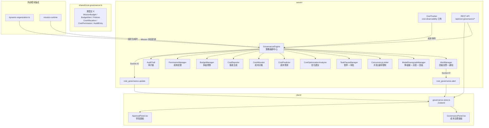

# 设计文档：成本治理策略（Cost Governance Strategy）

## 概述

本模块在已有 cost-observability 模块（被动成本监控）基础上，演进为主动的成本治理系统。核心思路是构建 `GovernanceEngine` 作为策略编排中心，协调预算管理、告警响应、模型降级、并发限制、任务暂停、成本预测和优化建议等子系统，形成"预测 → 预算 → 监控 → 告警 → 响应 → 优化 → 审计"的完整闭环。

设计遵循以下原则：
- **渐进增强**：扩展而非替换 cost-observability 的 CostTracker，新增治理能力通过组合模式叠加
- **策略可插拔**：降级、限流、暂停等策略均为独立模块，通过 GovernanceEngine 统一编排
- **审计优先**：所有治理操作（降级、限流、暂停、审批、权限变更）均记录到 AuditTrail
- **零阻塞**：治理决策在独立的事件循环中执行，不阻塞 LLM 调用主流程
- **前后端一致**：共享类型定义在 `shared/cost-governance.ts`，前后端共用

### 与 cost-observability 的关系

| 维度 | cost-observability | cost-governance-strategy |
|------|-------------------|-------------------------|
| 定位 | 被动监控 | 主动治理 |
| 预算 | 单级预算（max_cost/max_tokens） | 多级预算（组织→部门→项目→Mission） |
| 告警 | 单级预警阈值 | 四级告警（WARNING/CAUTION/CRITICAL/EXCEEDED） |
| 降级 | 软降级/硬降级两级 | 灰度降级 + 降级链 + 自动回滚 |
| 限流 | 无 | 并发限制 + 速率限制 |
| 审批 | 无 | 任务暂停 + 多级审批 |
| 预测 | 无 | 成本预测 + 置信区间 |
| 优化 | 无 | 智能优化建议 + 自动应用 |
| 分摊 | 无 | 多维度成本分摊 |
| 报表 | 历史趋势（最近10次） | 多维度报表 + 异常检测 |
| 权限 | 无 | 基于成本的权限控制 |

## 架构



## 组件与接口

### 1. 共享类型定义 — `shared/cost-governance.ts`

定义前后端共享的成本治理数据结构。依赖已有的 `shared/cost.ts` 中的基础类型。

```typescript
import type { CostRecord, Budget, ModelPricing } from './cost';

// ===== 预算类型 =====
export type BudgetType = 'FIXED' | 'PERCENTAGE' | 'DYNAMIC';
export type BudgetPeriod = 'MISSION' | 'DAILY' | 'HOURLY';
export type Currency = 'USD' | 'CNY';

export interface TokenBudgetByModel {
  model: string;
  maxTokens: number;
}

export interface AlertThresholdConfig {
  percent: number;          // 0-100
  responseStrategy: AlertResponseStrategy;
}

export type AlertResponseStrategy = 'LOG' | 'REDUCE_CONCURRENCY' | 'DOWNGRADE_MODEL' | 'PAUSE_TASK';

export interface MissionBudget {
  missionId: string;
  budgetType: BudgetType;
  tokenBudget: number;
  tokenBudgetByModel?: TokenBudgetByModel[];
  costBudget: number;
  currency: Currency;
  budgetPeriod: BudgetPeriod;
  alertThresholds: AlertThresholdConfig[];
  parentBudgetId?: string;    // 上级预算 ID
  createdAt: number;
  updatedAt: number;
}

// ===== 告警 =====
export type AlertType = 'WARNING' | 'CAUTION' | 'CRITICAL' | 'EXCEEDED';

export interface BudgetAlert {
  alertId: string;
  missionId: string;
  alertType: AlertType;
  threshold: number;
  currentCost: number;
  budgetRemaining: number;
  timestamp: number;
  action: AlertResponseStrategy;
  resolved: boolean;
}

// ===== 模型降级 =====
export interface ModelDowngradePolicy {
  sourceModel: string;
  targetModel: string;
  triggerThreshold: number;   // 0-100
  downgradeConditions: DowngradeCondition[];
}

export interface DowngradeCondition {
  type: 'COST_THRESHOLD' | 'TASK_COMPLEXITY' | 'AGENT_TYPE';
  value: string | number;
}

export interface DowngradeRecord {
  id: string;
  missionId: string;
  sourceModel: string;
  targetModel: string;
  reason: string;
  expectedSaving: number;
  timestamp: number;
  status: 'APPLIED' | 'ROLLED_BACK' | 'FAILED';
  rollbackReason?: string;
}

// ===== 并发/速率限制 =====
export type ConcurrencyLevel = 'NORMAL' | 'LOW' | 'MINIMAL' | 'SINGLE';
export type RateLevel = 'NORMAL' | 'HIGH' | 'MEDIUM' | 'LOW';

export interface ConcurrencyLimitPolicy {
  missionId: string;
  maxConcurrency: number;
  rateLimit: number;          // req/min
  triggerThreshold: number;
  currentConcurrencyLevel: ConcurrencyLevel;
  currentRateLevel: RateLevel;
}

// ===== 任务暂停与审批 =====
export type PauseTrigger = 'BUDGET_EXCEEDED' | 'CRITICAL_THRESHOLD' | 'ANOMALY_DETECTED';
export type ApprovalAction = 'CONTINUE' | 'INCREASE_BUDGET' | 'DOWNGRADE_AND_CONTINUE' | 'CANCEL';
export type ApprovalStatus = 'PENDING' | 'APPROVED' | 'REJECTED' | 'TIMEOUT';

export interface TaskPausePolicy {
  missionId: string;
  pauseTrigger: PauseTrigger;
  pauseDuration: number;      // ms
  requiresApproval: boolean;
}

export interface ApprovalRequest {
  requestId: string;
  missionId: string;
  reason: string;
  currentCost: number;
  budgetRemaining: number;
  suggestedActions: ApprovalAction[];
  approvalLevel: number;      // 审批级别
  status: ApprovalStatus;
  createdAt: number;
  timeoutAt: number;
  resolvedAt?: number;
  resolvedAction?: ApprovalAction;
  resolvedBy?: string;
}

// ===== 成本优化 =====
export type OptimizationType = 'MODEL' | 'PROMPT' | 'CACHE' | 'CONCURRENCY';
export type RiskLevel = 'LOW' | 'MEDIUM' | 'HIGH';
export type OptimizationStatus = 'SUGGESTED' | 'APPLIED' | 'REJECTED' | 'FAILED';

export interface CostOptimizationSuggestion {
  id: string;
  missionId: string;
  type: OptimizationType;
  description: string;
  expectedSaving: number;
  difficulty: 'EASY' | 'MEDIUM' | 'HARD';
  riskLevel: RiskLevel;
  status: OptimizationStatus;
  createdAt: number;
  appliedAt?: number;
}

// ===== 成本预测 =====
export type PredictionMethod = 'HISTORICAL_ANALOGY' | 'COMPLEXITY_ESTIMATE' | 'PRICING_CALCULATION';

export interface CostPrediction {
  missionId: string;
  pointEstimate: number;
  confidenceInterval: { low: number; high: number };
  method: PredictionMethod;
  confidence: number;         // 0-1
  predictedAt: number;
  basedOnProgress?: number;   // 0-1, 基于多少进度预测
}

// ===== 成本分摊 =====
export type AllocationType = 'EQUAL' | 'WEIGHTED' | 'USAGE';
export type AllocationDimension = 'DEPARTMENT' | 'USER' | 'PROJECT' | 'COST_CENTER';

export interface AllocationTarget {
  dimension: AllocationDimension;
  targetId: string;
  targetName: string;
  weight?: number;            // WEIGHTED 模式下的权重
  amount?: number;            // 分摊后的金额
}

export interface CostAllocation {
  allocationId: string;
  missionId: string;
  allocationType: AllocationType;
  totalCost: number;
  allocations: AllocationTarget[];
  createdAt: number;
  updatedAt: number;
}

// ===== 成本报表 =====
export type ReportType = 'SUMMARY' | 'DETAIL' | 'TREND' | 'DISTRIBUTION' | 'COMPARISON';
export type ReportDimension = 'MISSION' | 'AGENT' | 'MODEL' | 'USER' | 'DEPARTMENT' | 'TIME_PERIOD';

export interface CostReportRequest {
  reportType: ReportType;
  dimensions: ReportDimension[];
  timeRange: { start: number; end: number };
  filters?: Record<string, string>;
}

export interface CostReportResult {
  reportType: ReportType;
  generatedAt: number;
  data: CostReportDataItem[];
  anomalies: CostAnomaly[];
  trends?: TrendData;
}

export interface CostReportDataItem {
  dimension: string;
  dimensionValue: string;
  totalCost: number;
  totalTokens: number;
  callCount: number;
  avgCostPerCall: number;
}

export interface CostAnomaly {
  entityType: 'MISSION' | 'AGENT';
  entityId: string;
  entityName: string;
  anomalyType: 'HIGH_COST' | 'RAPID_GROWTH' | 'UNUSUAL_PATTERN';
  description: string;
  severity: 'LOW' | 'MEDIUM' | 'HIGH';
}

export interface TrendData {
  dailyAvg: number;
  weeklyAvg: number;
  monthlyAvg: number;
  growthRate: number;         // 百分比
}

// ===== 预算层级 =====
export type BudgetLevel = 'ORGANIZATION' | 'DEPARTMENT' | 'PROJECT' | 'MISSION';

export interface HierarchicalBudget {
  id: string;
  level: BudgetLevel;
  name: string;
  parentId?: string;
  totalBudget: number;
  usedBudget: number;
  currency: Currency;
  children?: HierarchicalBudget[];
  version: number;
  createdAt: number;
  updatedAt: number;
}

export interface BudgetTemplate {
  id: string;
  name: string;               // 如 "标准编程任务预算"
  description: string;
  defaultBudget: number;
  defaultTokenBudget: number;
  defaultPeriod: BudgetPeriod;
  defaultAlertThresholds: AlertThresholdConfig[];
}

// ===== 成本权限 =====
export interface CostPermission {
  userId: string;
  monthlyBudget: number;
  dailyBudget: number;
  modelRestrictions: string[];  // 允许使用的模型列表
  usedMonthly: number;
  usedDaily: number;
  updatedAt: number;
}

// ===== 审计链 =====
export type AuditAction =
  | 'ALERT_TRIGGERED' | 'DOWNGRADE_APPLIED' | 'DOWNGRADE_ROLLED_BACK'
  | 'CONCURRENCY_LIMITED' | 'RATE_LIMITED'
  | 'TASK_PAUSED' | 'TASK_RESUMED' | 'APPROVAL_REQUESTED' | 'APPROVAL_RESOLVED'
  | 'OPTIMIZATION_APPLIED' | 'BUDGET_CREATED' | 'BUDGET_MODIFIED'
  | 'PERMISSION_CHANGED';

export interface AuditEntry {
  id: string;
  action: AuditAction;
  missionId?: string;
  userId?: string;
  details: Record<string, unknown>;
  timestamp: number;
}

// ===== 治理状态快照 =====
export interface GovernanceSnapshot {
  missionId: string;
  budget: MissionBudget | null;
  currentCost: number;
  budgetUsedPercent: number;
  activeAlerts: BudgetAlert[];
  concurrencyLevel: ConcurrencyLevel;
  rateLevel: RateLevel;
  downgradeRecords: DowngradeRecord[];
  pendingApprovals: ApprovalRequest[];
  optimizationSuggestions: CostOptimizationSuggestion[];
  prediction: CostPrediction | null;
  updatedAt: number;
}
```

### 2. 治理引擎 — `server/core/governance-engine.ts`

GovernanceEngine 是成本治理的核心编排器，监听 CostTracker 的成本事件，协调各子系统执行治理策略。

```typescript
class GovernanceEngine {
  private alertManager: AlertManager;
  private downgradeManager: ModelDowngradeManager;
  private concurrencyLimiter: ConcurrencyLimiter;
  private taskPauseManager: TaskPauseManager;
  private costOptimizer: CostOptimizationAnalyzer;
  private costPredictor: CostPredictor;
  private costAllocator: CostAllocator;
  private costReporter: CostReporter;
  private budgetManager: BudgetManager;
  private permissionManager: PermissionManager;
  private auditTrail: AuditTrail;

  // 核心事件处理
  onCostRecorded(record: CostRecord): void;       // CostTracker 每次记录后回调
  onMissionCreated(missionId: string): void;       // Mission 创建时初始化治理
  onMissionCompleted(missionId: string): void;     // Mission 完成时归档

  // 治理状态
  getSnapshot(missionId: string): GovernanceSnapshot;
  getAuditTrail(missionId?: string): AuditEntry[];
}

export const governanceEngine: GovernanceEngine;   // 单例
```

### 3. 告警管理器 — `server/core/governance/alert-manager.ts`

```typescript
class AlertManager {
  // 根据 MissionBudget 的 alertThresholds 评估告警
  evaluate(missionId: string, currentCost: number, budget: MissionBudget): BudgetAlert[];
  // 执行告警响应策略
  executeResponse(alert: BudgetAlert): void;
  // 通知（Socket.IO + Webhook）
  notify(alert: BudgetAlert): void;
  // 获取活跃告警
  getActiveAlerts(missionId: string): BudgetAlert[];
  // 解除告警
  resolveAlert(alertId: string): void;
}
```

### 4. 模型降级管理器 — `server/core/governance/downgrade-manager.ts`

```typescript
// 预定义降级链
const DOWNGRADE_CHAIN: Record<string, string> = {
  'gpt-4o': 'gpt-4o-mini',
  'gpt-4o-mini': 'glm-4.6',
  'glm-4.6': 'glm-5-turbo',
};

class ModelDowngradeManager {
  // 执行降级（支持灰度比例）
  applyDowngrade(missionId: string, sourceModel: string, grayPercent?: number): DowngradeRecord;
  // 回滚降级
  rollback(recordId: string, reason: string): void;
  // 获取当前有效模型
  getEffectiveModel(missionId: string, originalModel: string, agentId: string): string;
  // 获取降级记录
  getRecords(missionId: string): DowngradeRecord[];
}
```

### 5. 并发限制器 — `server/core/governance/concurrency-limiter.ts`

```typescript
class ConcurrencyLimiter {
  // 设置限制级别
  setConcurrencyLevel(missionId: string, level: ConcurrencyLevel): void;
  setRateLevel(missionId: string, level: RateLevel): void;
  // 请求许可（调用前检查）
  acquirePermit(missionId: string): Promise<boolean>;
  // 释放许可（调用后释放）
  releasePermit(missionId: string): void;
  // 获取当前状态
  getPolicy(missionId: string): ConcurrencyLimitPolicy;
}
```

### 6. 任务暂停管理器 — `server/core/governance/task-pause-manager.ts`

```typescript
class TaskPauseManager {
  // 暂停 Mission
  pauseMission(missionId: string, trigger: PauseTrigger): ApprovalRequest;
  // 处理审批
  resolveApproval(requestId: string, action: ApprovalAction, resolvedBy: string): void;
  // 检查超时
  checkTimeouts(): void;
  // 获取待审批请求
  getPendingApprovals(missionId?: string): ApprovalRequest[];
}
```

### 7. 成本优化分析器 — `server/core/governance/cost-optimizer.ts`

```typescript
class CostOptimizationAnalyzer {
  // 分析 Mission 成本并生成建议
  analyze(missionId: string, records: CostRecord[]): CostOptimizationSuggestion[];
  // 自动应用低风险建议
  autoApply(suggestion: CostOptimizationSuggestion): boolean;
  // 获取建议列表
  getSuggestions(missionId: string): CostOptimizationSuggestion[];
}
```

### 8. 成本预测器 — `server/core/governance/cost-predictor.ts`

```typescript
class CostPredictor {
  // 预测 Mission 成本
  predict(missionId: string, taskDescription?: string, modelName?: string): CostPrediction;
  // 基于实际进度更新预测
  updatePrediction(missionId: string, progress: number, actualCost: number): CostPrediction;
  // 成本模拟
  simulate(params: { model?: string; concurrency?: number; budget?: number }): CostPrediction;
}
```

### 9. 成本分摊器 — `server/core/governance/cost-allocator.ts`

```typescript
class CostAllocator {
  // 创建分摊规则
  createAllocation(allocation: Omit<CostAllocation, 'allocationId' | 'createdAt' | 'updatedAt'>): CostAllocation;
  // 执行分摊计算
  calculate(allocationId: string): CostAllocation;
  // 回溯修改分摊
  retroactiveUpdate(allocationId: string, newAllocations: AllocationTarget[]): CostAllocation;
  // 获取分摊结果
  getAllocation(allocationId: string): CostAllocation | null;
  getAllocationsByMission(missionId: string): CostAllocation[];
}
```

### 10. 成本报表生成器 — `server/core/governance/cost-reporter.ts`

```typescript
class CostReporter {
  // 生成报表
  generate(request: CostReportRequest): CostReportResult;
  // 异常检测
  detectAnomalies(records: CostRecord[]): CostAnomaly[];
  // 趋势分析
  analyzeTrends(records: CostRecord[]): TrendData;
  // 导出
  exportToCSV(report: CostReportResult): string;
  exportToJSON(report: CostReportResult): string;
}
```

### 11. 预算管理器 — `server/core/governance/budget-manager.ts`

```typescript
class BudgetManager {
  // 创建预算
  createBudget(budget: Omit<HierarchicalBudget, 'id' | 'version' | 'createdAt' | 'updatedAt'>): HierarchicalBudget;
  // 更新预算（自动版本控制）
  updateBudget(id: string, changes: Partial<HierarchicalBudget>): HierarchicalBudget;
  // 检查子预算是否超过父预算
  validateHierarchy(childBudget: number, parentId: string): boolean;
  // 获取预算模板
  getTemplates(): BudgetTemplate[];
  // 从模板创建
  createFromTemplate(templateId: string, missionId: string): MissionBudget;
  // 预算对账
  reconcile(budgetId: string): { budget: number; actual: number; variance: number };
  // 获取预算版本历史
  getVersionHistory(budgetId: string): HierarchicalBudget[];
}
```

### 12. 权限管理器 — `server/core/governance/permission-manager.ts`

```typescript
class PermissionManager {
  // 检查用户是否有足够预算创建 Mission
  checkBudget(userId: string, estimatedCost: number): { allowed: boolean; reason?: string };
  // 记录用户成本消耗
  recordUsage(userId: string, cost: number): void;
  // 获取用户权限
  getPermission(userId: string): CostPermission;
  // 更新用户权限（管理员操作）
  updatePermission(userId: string, changes: Partial<CostPermission>): CostPermission;
  // 重置日度/月度计数（定时任务）
  resetDailyUsage(): void;
  resetMonthlyUsage(): void;
}
```

### 13. 审计链 — `server/core/governance/audit-trail.ts`

```typescript
class AuditTrail {
  // 记录审计事件
  record(entry: Omit<AuditEntry, 'id' | 'timestamp'>): AuditEntry;
  // 查询审计记录
  query(filters: { missionId?: string; action?: AuditAction; userId?: string; timeRange?: { start: number; end: number } }): AuditEntry[];
  // 持久化到文件
  persist(): void;
  // 加载历史
  load(): void;
}
```

### 14. REST API — `server/routes/cost-governance.ts`

```typescript
// 治理状态
// GET  /api/cost-governance/:missionId/snapshot    → GovernanceSnapshot
// GET  /api/cost-governance/audit                  → AuditEntry[]

// 预算管理
// POST /api/cost-governance/budgets                → 创建预算
// PUT  /api/cost-governance/budgets/:id            → 更新预算
// GET  /api/cost-governance/budgets/:id            → 获取预算
// GET  /api/cost-governance/budgets/:id/history    → 预算版本历史
// GET  /api/cost-governance/budget-templates       → 预算模板列表
// POST /api/cost-governance/budgets/reconcile/:id  → 预算对账

// 审批
// GET  /api/cost-governance/approvals              → 待审批列表
// POST /api/cost-governance/approvals/:id/resolve  → 处理审批

// 优化建议
// GET  /api/cost-governance/:missionId/suggestions → 优化建议列表
// POST /api/cost-governance/suggestions/:id/apply  → 应用建议

// 成本预测
// POST /api/cost-governance/predict                → 成本预测
// POST /api/cost-governance/simulate               → 成本模拟

// 成本分摊
// POST /api/cost-governance/allocations            → 创建分摊
// GET  /api/cost-governance/allocations/:missionId → 获取分摊

// 成本报表
// POST /api/cost-governance/reports                → 生成报表
// POST /api/cost-governance/reports/export          → 导出报表

// 权限管理
// GET  /api/cost-governance/permissions/:userId    → 获取用户权限
// PUT  /api/cost-governance/permissions/:userId    → 更新用户权限

export function registerGovernanceRoutes(app: Express): void;
```

### 15. Socket.IO 事件 — `server/core/socket.ts` 扩展

```typescript
// 治理状态更新（节流 1s）
export function emitGovernanceUpdate(snapshot: GovernanceSnapshot): void;
// 告警事件（立即广播）
export function emitGovernanceAlert(alert: BudgetAlert): void;
// 审批请求（立即广播）
export function emitApprovalRequest(request: ApprovalRequest): void;
```

### 16. 前端治理 Store — `client/src/lib/governance-store.ts`

```typescript
interface GovernanceState {
  snapshots: Map<string, GovernanceSnapshot>;
  pendingApprovals: ApprovalRequest[];
  
  // Socket 初始化
  initSocket: (socket: Socket) => void;
  // 获取 Mission 治理状态
  fetchSnapshot: (missionId: string) => Promise<void>;
  // 审批操作
  resolveApproval: (requestId: string, action: ApprovalAction) => Promise<void>;
  // 应用优化建议
  applySuggestion: (suggestionId: string) => Promise<void>;
  // 成本预测
  predict: (missionId: string) => Promise<CostPrediction>;
  // 报表
  generateReport: (request: CostReportRequest) => Promise<CostReportResult>;
  exportReport: (report: CostReportResult, format: 'json' | 'csv') => Promise<void>;
}

export const useGovernanceStore = create<GovernanceState>((set, get) => ({ ... }));
```

### 17. 前端治理面板 — `client/src/components/GovernancePanel.tsx`

使用 shadcn/ui + Recharts 构建：
- 预算概览卡片（预算/已消耗/剩余，进度条）
- 告警状态面板（四级告警颜色编码）
- 成本预测卡片（点估计 + 置信区间可视化）
- 优化建议列表（支持一键应用低风险建议）
- 审批请求面板（待审批列表 + 操作按钮）
- 成本报表入口（多维度分析 + 导出）
- 降级状态指示器

### 18. 与动态组织集成 — `server/core/dynamic-organization.ts` 修改

在组织生成流程中注入成本约束：

```typescript
// 组织生成时的成本约束接口
interface CostConstraint {
  maxTotalCost: number;
  modelAssignment: Record<string, string>;  // agentRole → model
}

// 在 generateOrganization 中：
// 1. 根据 MissionBudget 计算 CostConstraint
// 2. 按 Agent 角色优先级分配模型
// 3. 计算预期成本，超预算则调整组织结构
```

## 数据模型

### 汇率表

```typescript
export const EXCHANGE_RATES: Record<string, number> = {
  'USD_TO_CNY': 7.2,
  'CNY_TO_USD': 1 / 7.2,
};

export function convertCurrency(amount: number, from: Currency, to: Currency): number {
  if (from === to) return amount;
  const key = `${from}_TO_${to}`;
  return amount * (EXCHANGE_RATES[key] ?? 1);
}
```

### 并发限制映射

```typescript
const CONCURRENCY_LIMITS: Record<ConcurrencyLevel, number> = {
  NORMAL: Infinity,
  LOW: 0.5,       // 原始并发的 50%
  MINIMAL: 0.25,  // 原始并发的 25%
  SINGLE: 1,      // 单线程
};

const RATE_LIMITS: Record<RateLevel, number> = {
  NORMAL: Infinity,
  HIGH: 100,      // 100 req/min
  MEDIUM: 10,     // 10 req/min
  LOW: 1,         // 1 req/min
};
```

### 预算模板预设

```typescript
export const DEFAULT_BUDGET_TEMPLATES: BudgetTemplate[] = [
  {
    id: 'standard-coding',
    name: '标准编程任务预算',
    description: '适用于一般编程任务，中等成本预算',
    defaultBudget: 5.0,
    defaultTokenBudget: 500000,
    defaultPeriod: 'MISSION',
    defaultAlertThresholds: [
      { percent: 50, responseStrategy: 'LOG' },
      { percent: 75, responseStrategy: 'REDUCE_CONCURRENCY' },
      { percent: 90, responseStrategy: 'DOWNGRADE_MODEL' },
      { percent: 100, responseStrategy: 'PAUSE_TASK' },
    ],
  },
  {
    id: 'data-analysis',
    name: '数据分析任务预算',
    description: '适用于数据分析任务，较高成本预算',
    defaultBudget: 20.0,
    defaultTokenBudget: 2000000,
    defaultPeriod: 'MISSION',
    defaultAlertThresholds: [
      { percent: 50, responseStrategy: 'LOG' },
      { percent: 75, responseStrategy: 'REDUCE_CONCURRENCY' },
      { percent: 90, responseStrategy: 'DOWNGRADE_MODEL' },
      { percent: 100, responseStrategy: 'PAUSE_TASK' },
    ],
  },
];
```

### 持久化文件格式

```json
// data/cost-governance.json
{
  "version": 1,
  "budgets": [...],
  "allocations": [...],
  "permissions": [...],
  "auditTrail": [...],
  "budgetTemplates": [...]
}
```

## 正确性属性（Correctness Properties）

*属性（Property）是指在系统所有合法执行路径中都应成立的特征或行为——本质上是对系统应做之事的形式化陈述。属性是人类可读规格说明与机器可验证正确性保证之间的桥梁。*

### Property 1: 币种转换往返一致性

*For any* 金额 amount 和任意两种货币 A、B，将 amount 从 A 转换到 B 再转换回 A，结果应与原始 amount 在浮点精度范围内相等。

**Validates: Requirements 1.4**

### Property 2: 累计成本与剩余预算不变量

*For any* CostRecord 序列和任意 MissionBudget 配置，GovernanceEngine 计算的累计成本应等于所有记录 cost 之和，剩余预算应等于 costBudget 减去累计成本（下限为 0），budgetUsedPercent 应等于累计成本除以 costBudget（上限为 1.0）。

**Validates: Requirements 2.2, 11.6**

### Property 3: 多维度查询一致性

*For any* CostRecord 集合，按任意维度（模型、Agent、操作类型）过滤后的记录成本之和应等于该维度下所有匹配记录的 cost 之和，且所有维度值的成本之和应等于总成本。

**Validates: Requirements 2.3**

### Property 4: 成本预测单调性

*For any* Mission 的 CostRecord 序列（按时间排序），Cost_Predictor 的预测总成本应始终大于等于当前实际累计成本。

**Validates: Requirements 2.5**

### Property 5: 告警类型与响应策略映射

*For any* MissionBudget 配置和任意累计成本值，当成本达到某个 alertThreshold 的百分比时，GovernanceEngine 应生成对应 alertType 的 BudgetAlert，且该 alert 的 action 应与 alertThreshold 配置的 responseStrategy 一致。当 Mission 配置了自定义阈值时，自定义阈值应覆盖默认阈值。

**Validates: Requirements 3.2, 3.3, 3.6**

### Property 6: 审计链完整性

*For any* 治理操作（告警触发、模型降级、降级回滚、并发限制、速率限制、任务暂停、审批处理、优化建议应用、权限变更），AuditTrail 中应存在对应的 AuditEntry，且 entry 的 action 字段与操作类型匹配，details 中包含操作的关键信息。

**Validates: Requirements 3.5, 4.4, 4.7, 5.6, 6.7, 7.5, 14.5**

### Property 7: 降级链正确性

*For any* 模型名称在降级链中，执行一次降级应返回降级链中的下一个模型。对于降级链末端的模型，降级应返回自身（无法继续降级）。

**Validates: Requirements 4.2**

### Property 8: 灰度降级比例

*For any* 灰度百分比 P（0-100）和 N 个 Agent 的集合（N > 0），灰度降级后被降级的 Agent 数量应在 `floor(N * P / 100)` 到 `ceil(N * P / 100)` 之间。

**Validates: Requirements 4.5**

### Property 9: 降级失败自动回滚

*For any* 降级操作，如果降级后的模型调用失败，GovernanceEngine 应将该 Agent 的有效模型恢复为降级前的模型，且 DowngradeRecord 的 status 应为 'ROLLED_BACK'。

**Validates: Requirements 4.6**

### Property 10: 并发与速率限制级别映射

*For any* ConcurrencyLevel，对应的最大并发数应与预定义映射一致（NORMAL=无限制, LOW=50%, MINIMAL=25%, SINGLE=1）。*For any* RateLevel，对应的速率限制应与预定义映射一致（NORMAL=无限制, HIGH=100/min, MEDIUM=10/min, LOW=1/min）。当成本消耗速率超过阈值时，限制级别应自动提升到下一级。

**Validates: Requirements 5.2, 5.3, 5.4**

### Property 11: 预算超限触发暂停与审批

*For any* Mission，当累计成本超过 MissionBudget 的 costBudget 或达到 CRITICAL 阈值时，GovernanceEngine 应暂停该 Mission 并生成 ApprovalRequest。生成的 ApprovalRequest 应包含所有必填字段（requestId、missionId、reason、currentCost、budgetRemaining、suggestedActions）。

**Validates: Requirements 6.2, 6.3**

### Property 12: 审批超时自动拒绝

*For any* ApprovalRequest，如果在 timeoutAt 时间之前未被处理，其 status 应自动变为 'TIMEOUT'。

**Validates: Requirements 6.6**

### Property 13: 多级审批路由

*For any* 成本金额，审批级别应由成本阈值决定：低成本由低级别审批，高成本由高级别审批。审批级别应随成本单调递增。

**Validates: Requirements 6.5**

### Property 14: 优化建议不变量与自动应用

*For any* CostOptimizationSuggestion，expectedSaving 应为非负数，difficulty 和 riskLevel 应为有效枚举值。*For any* riskLevel 为 'LOW' 的建议，autoApply 应成功执行；riskLevel 为 'HIGH' 的建议，autoApply 应被拒绝。

**Validates: Requirements 7.3, 7.4**

### Property 15: 预测置信区间包含点估计

*For any* CostPrediction，pointEstimate 应满足 confidenceInterval.low ≤ pointEstimate ≤ confidenceInterval.high。

**Validates: Requirements 8.3**

### Property 16: 预测更新融合实际数据

*For any* Mission 在进度 P（P ≥ 0.1）时的预测更新，更新后的 pointEstimate 应大于等于当前实际累计成本，且 basedOnProgress 应等于 P。

**Validates: Requirements 8.4**

### Property 17: 成本模拟变形属性

*For any* 模拟参数，将模型从高成本模型切换到低成本模型后，模拟的 pointEstimate 应小于等于原始模拟的 pointEstimate。

**Validates: Requirements 8.5**

### Property 18: 成本分摊求和不变量

*For any* CostAllocation，所有 AllocationTarget 的 amount 之和应等于 totalCost。对于 EQUAL 分摊，每个 target 的 amount 应等于 totalCost / N（N 为 target 数量）。对于 WEIGHTED 分摊，每个 target 的 amount 应与其 weight 成正比。回溯修改后，求和不变量仍应成立。

**Validates: Requirements 9.2, 9.4, 9.5**

### Property 19: 报表维度过滤与分布一致性

*For any* CostRecord 集合和报表请求，按维度过滤后的结果应是总集的子集。成本分布分析中，所有维度值的成本占比之和应在 99%-101% 范围内（允许浮点舍入误差）。

**Validates: Requirements 10.2, 10.4**

### Property 20: 异常检测

*For any* CostRecord 集合，如果某个 Mission 或 Agent 的成本超过该集合平均值的 3 倍标准差，CostReporter 应将其标记为异常。

**Validates: Requirements 10.5**

### Property 21: 报表 JSON 导出往返一致性

*For any* 有效的 CostReportResult，导出为 JSON 后再解析，应得到与原对象深度相等的结果。

**Validates: Requirements 10.6**

### Property 22: 预算层级约束

*For any* 预算层级结构，子预算的 totalBudget 之和应不超过父预算的 totalBudget。创建超过父预算的子预算应被拒绝。

**Validates: Requirements 11.1, 11.5**

### Property 23: 预算模板实例化

*For any* BudgetTemplate，从模板创建的 MissionBudget 应包含模板的默认预算金额、Token 预算、预算周期和告警阈值配置。

**Validates: Requirements 11.2**

### Property 24: 预算修改审批阈值

*For any* 预算修改操作，如果修改幅度（|新值 - 旧值| / 旧值）超过 20%，系统应要求审批。修改幅度不超过 20% 的操作应直接生效。预算的版本号应在每次修改后递增。

**Validates: Requirements 11.3, 11.4**

### Property 25: 组织成本在预算范围内

*For any* 动态组织生成结果和 MissionBudget，组织的预期总成本应不超过 MissionBudget 的 costBudget。高优先级 Agent 分配的模型成本应大于等于低优先级 Agent 分配的模型成本。

**Validates: Requirements 13.1, 13.2, 13.3, 13.4**

### Property 26: 用户预算检查

*For any* 用户的 CostPermission，当用户的 usedMonthly 加上预估成本超过 monthlyBudget 时，Mission 创建应被拒绝。当用户的 usedDaily 加上预估成本超过 dailyBudget 时，Mission 创建应被拒绝。

**Validates: Requirements 14.3**

## 错误处理

| 场景 | 处理策略 |
|------|---------|
| MissionBudget 配置值非法（负数/零） | 使用默认预算模板兜底，记录 console.warn |
| 未知币种 | 默认使用 USD，记录 console.warn |
| 降级链中无下一级模型 | 保持当前模型不变，记录降级失败到 AuditTrail |
| 降级后模型调用失败 | 自动回滚到原模型，记录回滚原因到 AuditTrail |
| 并发许可获取超时 | 返回 false，调用方可选择排队或跳过 |
| 审批请求超时 | 自动设置状态为 TIMEOUT，记录到 AuditTrail |
| 成本预测数据不足 | 返回基于模型定价的粗略估算，confidence 设为低值 |
| 分摊权重之和为零 | 回退到 EQUAL 分摊，记录 console.warn |
| 报表时间范围无数据 | 返回空报表（空数组），不报错 |
| 持久化文件写入失败 | 记录 console.error，不影响内存中的治理状态 |
| 持久化文件损坏/不存在 | 以空状态启动，记录 console.warn |
| Socket.IO 未初始化 | 治理事件广播静默跳过 |
| 用户权限记录不存在 | 使用默认权限（无限制），记录 console.warn |
| 预算层级校验失败 | 拒绝操作并返回明确错误信息 |
| GovernanceEngine 初始化失败 | 降级为仅监控模式（不执行治理策略），记录 console.error |

## 测试策略

### 属性测试（Property-Based Testing）

使用 **fast-check** 库（与 Vitest 集成）进行属性测试，每个属性至少运行 100 次迭代。

| 属性 | 测试文件 | 说明 |
|------|---------|------|
| Property 1 | `server/tests/cost-governance.test.ts` | 生成随机金额和币种对，验证往返转换一致性 |
| Property 2 | `server/tests/cost-governance.test.ts` | 生成随机 CostRecord 序列和预算，验证累计成本和剩余预算 |
| Property 3 | `server/tests/cost-governance.test.ts` | 生成随机 CostRecord 集合，验证多维度查询求和一致性 |
| Property 4 | `server/tests/cost-governance.test.ts` | 生成随机时序 CostRecord，验证预测 ≥ 实际成本 |
| Property 5 | `server/tests/cost-governance.test.ts` | 生成随机预算和成本，验证告警类型和响应策略映射 |
| Property 6 | `server/tests/cost-governance.test.ts` | 执行随机治理操作，验证 AuditTrail 中存在对应条目 |
| Property 7 | `server/tests/cost-governance.test.ts` | 遍历降级链中的模型，验证降级结果 |
| Property 8 | `server/tests/cost-governance.test.ts` | 生成随机灰度百分比和 Agent 集合，验证降级比例 |
| Property 9 | `server/tests/cost-governance.test.ts` | 模拟降级失败，验证自动回滚 |
| Property 10 | `server/tests/cost-governance.test.ts` | 验证并发/速率限制级别映射和自动提升 |
| Property 11 | `server/tests/cost-governance.test.ts` | 生成随机超预算场景，验证暂停和审批请求生成 |
| Property 12 | `server/tests/cost-governance.test.ts` | 模拟审批超时，验证自动拒绝 |
| Property 13 | `server/tests/cost-governance.test.ts` | 生成随机成本金额，验证审批级别单调递增 |
| Property 14 | `server/tests/cost-governance.test.ts` | 生成随机优化建议，验证不变量和自动应用逻辑 |
| Property 15 | `server/tests/cost-governance.test.ts` | 生成随机预测，验证置信区间包含点估计 |
| Property 16 | `server/tests/cost-governance.test.ts` | 生成随机进度和实际成本，验证预测更新 |
| Property 17 | `server/tests/cost-governance.test.ts` | 生成随机模拟参数，验证模型切换的变形属性 |
| Property 18 | `server/tests/cost-governance.test.ts` | 生成随机分摊配置，验证求和不变量 |
| Property 19 | `server/tests/cost-governance.test.ts` | 生成随机报表请求，验证维度过滤和分布一致性 |
| Property 20 | `server/tests/cost-governance.test.ts` | 生成含异常值的 CostRecord 集合，验证异常检测 |
| Property 21 | `server/tests/cost-governance.test.ts` | 生成随机报表结果，验证 JSON 导出往返 |
| Property 22 | `server/tests/cost-governance.test.ts` | 生成随机预算层级，验证子预算不超过父预算 |
| Property 23 | `server/tests/cost-governance.test.ts` | 使用预算模板创建预算，验证默认值继承 |
| Property 24 | `server/tests/cost-governance.test.ts` | 生成随机预算修改，验证审批阈值和版本递增 |
| Property 25 | `server/tests/cost-governance.test.ts` | 生成随机组织和预算，验证组织成本在预算范围内 |
| Property 26 | `server/tests/cost-governance.test.ts` | 生成随机用户权限和成本，验证预算检查 |

### 单元测试

| 测试场景 | 说明 |
|---------|------|
| GovernanceEngine.onCostRecorded | 验证成本事件触发告警评估和策略执行 |
| AlertManager.evaluate | 验证四级告警触发条件 |
| ModelDowngradeManager.applyDowngrade | 验证降级链执行和灰度控制 |
| ModelDowngradeManager.rollback | 验证降级回滚 |
| ConcurrencyLimiter.acquirePermit | 验证并发许可获取和释放 |
| TaskPauseManager.pauseMission | 验证暂停和审批请求生成 |
| TaskPauseManager.checkTimeouts | 验证超时自动拒绝 |
| CostPredictor.predict | 验证三种预测方法 |
| CostPredictor.simulate | 验证成本模拟 |
| CostAllocator.calculate | 验证三种分摊类型计算 |
| CostReporter.generate | 验证五种报表类型 |
| CostReporter.detectAnomalies | 验证异常检测 |
| BudgetManager.validateHierarchy | 验证预算层级约束 |
| BudgetManager.createFromTemplate | 验证模板实例化 |
| PermissionManager.checkBudget | 验证用户预算检查 |
| AuditTrail.record / query | 验证审计记录和查询 |
| REST API 各端点 | 验证请求/响应格式和错误处理 |

### 测试标注格式

每个属性测试必须包含注释标注：
```typescript
// Feature: cost-governance-strategy, Property N: [属性标题]
```
