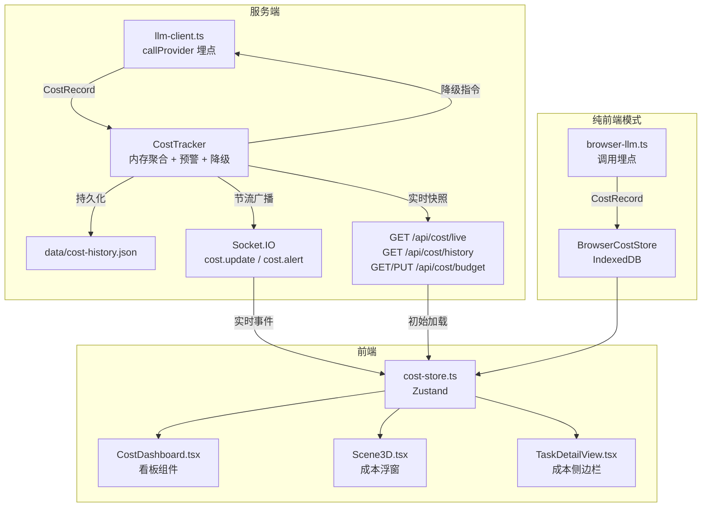
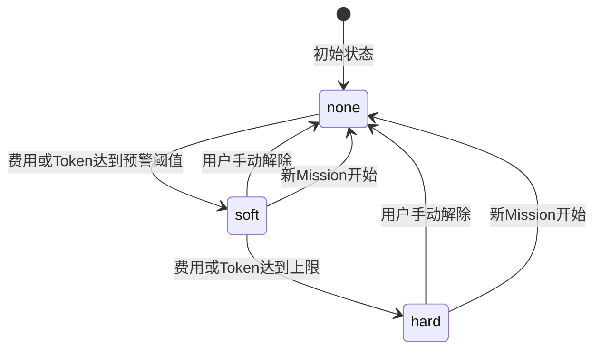

# 设计文档：成本可观测性系统（Cost Observability）

## 概述

本设计为 Cube Pets Office 新增完整的成本可观测性系统。核心思路是在 LLM 调用链路中插入轻量埋点，将成本数据汇聚到 `CostTracker`，通过 REST API 和 Socket.IO 推送到前端 `CostDashboard` 组件进行可视化展示，并在超预算时触发自动降级策略。

设计遵循以下原则：
- **零阻塞**：埋点采集不阻塞 LLM 调用主流程，采用同步内存写入
- **双轨运行**：服务端模式使用内存 + JSON 文件持久化，纯前端模式使用 IndexedDB
- **最小侵入**：对现有 `llm-client.ts`、`socket.ts` 的修改控制在最小范围
- **与 Telemetry 互补**：Telemetry Dashboard 侧重性能指标（响应时间、瓶颈），Cost Observability 侧重费用指标（Token 消耗、预算、降级）。两者共享部分数据源但各自独立聚合

### 与 Telemetry Dashboard 的关系

| 维度 | Telemetry Dashboard | Cost Observability |
|------|--------------------|--------------------|
| 核心关注 | 性能（响应时间、瓶颈 Agent） | 费用（Token 消耗、预算、降级） |
| 数据源 | LLM 调用 + Agent 计时 | LLM 调用 + 定价表 |
| 预警类型 | Agent 响应过慢 | 费用/Token 超预算 |
| 降级能力 | 无 | 模型切换 + Agent 暂停 |
| UI 位置 | 侧滑面板 | 3D 浮窗 + /tasks 侧边栏 |

## 架构



## 组件与接口

### 1. 共享类型定义 — `shared/cost.ts`

定义前后端共享的成本数据结构和定价表。

```typescript
/** 模型单价（每千 Token 美元） */
export interface ModelPricing {
  input: number;   // 每千 input token 美元
  output: number;  // 每千 output token 美元
}

/** 定价表 */
export const PRICING_TABLE: Record<string, ModelPricing> = {
  'glm-5-turbo':  { input: 0.001,   output: 0.002 },
  'glm-4.6':      { input: 0.002,   output: 0.004 },
  'gpt-4o-mini':  { input: 0.00015, output: 0.0006 },
  'gpt-4o':       { input: 0.005,   output: 0.015 },
};

export const DEFAULT_PRICING: ModelPricing = { input: 0.001, output: 0.002 };

/** 费用预估纯函数 */
export function estimateCost(model: string, tokensIn: number, tokensOut: number): number;

/** 单次 LLM 调用成本记录 */
export interface CostRecord {
  id: string;
  timestamp: number;
  model: string;
  tokensIn: number;
  tokensOut: number;
  unitPriceIn: number;
  unitPriceOut: number;
  actualCost: number;
  durationMs: number;
  agentId?: string;
  missionId?: string;
  sessionId?: string;
  error?: string;
}

/** 预算配置 */
export interface Budget {
  maxCost: number;            // 最大费用（美元），默认 1.0
  maxTokens: number;          // 最大 Token 数，默认 100000
  warningThreshold: number;   // 预警阈值百分比，默认 0.8
}

/** 降级策略 */
export interface DowngradePolicy {
  enabled: boolean;
  lowCostModel: string;                // 低成本替代模型，默认 'glm-4.6'
  criticalAgentIds: string[];          // 关键 Agent 白名单（不会被暂停）
}

/** 降级状态 */
export type DowngradeLevel = 'none' | 'soft' | 'hard';

/** 成本预警 */
export interface CostAlert {
  id: string;
  type: 'cost_warning' | 'cost_exceeded' | 'token_warning' | 'token_exceeded';
  message: string;
  timestamp: number;
  resolved: boolean;
}

/** Agent 成本摘要 */
export interface AgentCostSummary {
  agentId: string;
  agentName: string;
  tokensIn: number;
  tokensOut: number;
  totalCost: number;
  callCount: number;
}

/** 实时成本快照 */
export interface CostSnapshot {
  totalTokensIn: number;
  totalTokensOut: number;
  totalCost: number;
  totalCalls: number;
  budgetUsedPercent: number;       // 费用维度已用百分比
  tokenUsedPercent: number;        // Token 维度已用百分比
  agentCosts: AgentCostSummary[];  // 按费用降序
  alerts: CostAlert[];
  downgradeLevel: DowngradeLevel;
  budget: Budget;
  updatedAt: number;
}

/** 历史 Mission 成本摘要 */
export interface MissionCostSummary {
  missionId: string;
  title: string;
  completedAt: number;
  totalTokensIn: number;
  totalTokensOut: number;
  totalCost: number;
  totalCalls: number;
  topAgents: AgentCostSummary[];
}
```

### 2. 服务端成本追踪器 — `server/core/cost-tracker.ts`

```typescript
class CostTracker {
  // 内存状态
  private records: CostRecord[];                        // 当前 Mission 的调用记录
  private missionHistory: MissionCostSummary[];          // 最近 10 次
  private alerts: CostAlert[];
  private budget: Budget;
  private downgradePolicy: DowngradePolicy;
  private downgradeLevel: DowngradeLevel;
  private pausedAgentIds: Set<string>;
  private currentMissionId: string | null;

  // 核心方法
  recordCall(record: CostRecord): void;                  // 同步写入 + 触发预警检查 + 触发广播
  getSnapshot(): CostSnapshot;                           // 计算实时快照
  getHistory(): MissionCostSummary[];
  finalizeMission(missionId: string, title: string): void;
  resetCurrentMission(missionId?: string): void;

  // 预算
  getBudget(): Budget;
  setBudget(budget: Budget): void;                       // 更新预算 + 重新评估预警

  // 降级
  getDowngradeLevel(): DowngradeLevel;
  getEffectiveModel(originalModel: string): string;      // 根据降级状态返回实际模型
  isAgentPaused(agentId: string): boolean;               // 检查 Agent 是否被暂停
  manualReleaseDegradation(): void;                      // 手动解除降级

  // 预警检查
  private checkAlerts(): void;
  private applyDowngrade(): void;

  // 聚合
  getAgentCosts(): AgentCostSummary[];                   // 按 agent_id 聚合
  getSessionCosts(): Map<string, { tokensIn: number; tokensOut: number; cost: number }>;

  // 持久化
  private persistHistory(): void;
  loadHistory(): void;
}

export const costTracker: CostTracker;                   // 单例导出
```

### 3. 服务端成本路由 — `server/routes/cost.ts`

```typescript
// GET  /api/cost/live     → CostSnapshot
// GET  /api/cost/history  → MissionCostSummary[]
// GET  /api/cost/budget   → Budget
// PUT  /api/cost/budget   → Budget（更新后返回）
// POST /api/cost/downgrade/release → 手动解除降级
export function registerCostRoutes(app: Express): void;
```

### 4. Socket.IO 成本广播 — `server/core/socket.ts` 扩展

```typescript
export function emitCostUpdate(snapshot: CostSnapshot): void;   // 节流 500ms
export function emitCostAlert(alert: CostAlert): void;          // 立即广播
```

### 5. LLM 调用埋点与降级 — `server/core/llm-client.ts` 修改

在 `callProvider` 函数中注入成本记录和降级逻辑：

```typescript
// callLLM 修改伪代码
export async function callLLM(messages, options): Promise<LLMResponse> {
  // 1. 检查 Agent 是否被暂停
  if (options.agentId && costTracker.isAgentPaused(options.agentId)) {
    throw new Error(`Agent ${options.agentId} is paused due to budget exceeded.`);
  }

  // 2. 应用降级模型
  const effectiveModel = costTracker.getEffectiveModel(options.model || defaultModel);
  const effectiveOptions = { ...options, model: effectiveModel };

  // 3. 原有调用逻辑...
  const startTime = Date.now();
  const response = await originalCallLLM(messages, effectiveOptions);

  // 4. 记录成本
  costTracker.recordCall({
    id: nanoid(),
    timestamp: startTime,
    model: effectiveModel,
    tokensIn: response.usage?.prompt_tokens ?? 0,
    tokensOut: response.usage?.completion_tokens ?? 0,
    unitPriceIn: getPricing(effectiveModel).input,
    unitPriceOut: getPricing(effectiveModel).output,
    actualCost: estimateCost(effectiveModel, tokensIn, tokensOut),
    durationMs: Date.now() - startTime,
    agentId: options.agentId,
    missionId: options.missionId,
    sessionId: options.sessionId,
  });

  return response;
}
```

### 6. 前端成本 Store — `client/src/lib/cost-store.ts`

```typescript
interface CostState {
  snapshot: CostSnapshot | null;
  history: MissionCostSummary[];
  dashboardOpen: boolean;

  toggleDashboard: () => void;
  initSocket: (socket: Socket) => void;
  fetchInitial: () => Promise<void>;
  updateBudget: (budget: Partial<Budget>) => Promise<void>;
  releaseDegradation: () => Promise<void>;
}

export const useCostStore = create<CostState>((set, get) => ({ ... }));
```

### 7. 前端成本看板 — `client/src/components/CostDashboard.tsx`

使用 shadcn/ui 卡片 + Recharts 图表：
- Token 消耗卡片（input/output 分开，Progress 进度条）
- 实时费用卡片（带预算进度条）
- 剩余预算百分比卡片
- Agent 费用占比饼图（PieChart）
- 历史成本趋势折线图（LineChart，最近 10 次 Mission）
- 预警横幅区域
- 预算设置表单
- 降级操作按钮组

### 8. 3D 场景成本浮窗 — `client/src/components/Scene3D.tsx` 修改

在 Canvas 外层（HTML overlay）右上角添加成本浮窗：
- 显示当前费用和剩余预算百分比
- 预警时边框变红 + 预警图标
- 降级时显示降级状态标识
- 点击展开/收起 CostDashboard

### 9. /tasks 页面成本侧边栏 — `client/src/components/tasks/TaskDetailView.tsx` 修改

在 Mission 详情页中新增"成本"标签页：
- Token 消耗时间线（AreaChart）
- 费用累计曲线（LineChart）
- 实时更新（通过 Socket 事件）

### 10. 纯前端模式 — `client/src/lib/browser-cost-store.ts`

在 `callBrowserLLM` 调用前后采集成本数据，存入 IndexedDB 的 `cost` object store。页面加载时从 IndexedDB 恢复。

## 数据模型

### 费用预估模型

```typescript
export function estimateCost(model: string, tokensIn: number, tokensOut: number): number {
  const pricing = PRICING_TABLE[model] ?? DEFAULT_PRICING;
  return (tokensIn / 1000) * pricing.input + (tokensOut / 1000) * pricing.output;
}
```

关键设计决策：
- 使用模型官方定价表，不做实时计费
- 未知模型使用保守的默认定价兜底
- `estimateCost` 为纯函数，前后端共用

### 预算默认值

```typescript
export const DEFAULT_BUDGET: Budget = {
  maxCost: 1.0,          // 1 美元
  maxTokens: 100000,     // 10 万 Token
  warningThreshold: 0.8, // 80%
};

export const DEFAULT_DOWNGRADE_POLICY: DowngradePolicy = {
  enabled: true,
  lowCostModel: 'glm-4.6',
  criticalAgentIds: [],   // 默认无白名单
};
```

### 降级状态机



### 持久化文件格式

```json
// data/cost-history.json
{
  "version": 1,
  "budget": { "maxCost": 1.0, "maxTokens": 100000, "warningThreshold": 0.8 },
  "downgradePolicy": { "enabled": true, "lowCostModel": "glm-4.6", "criticalAgentIds": [] },
  "missions": [
    {
      "missionId": "...",
      "title": "...",
      "completedAt": 1234567890,
      "totalTokensIn": 5000,
      "totalTokensOut": 3000,
      "totalCost": 0.012,
      "totalCalls": 15,
      "topAgents": [...]
    }
  ]
}
```

### IndexedDB Schema（纯前端模式）

在现有 `browser-runtime-storage.ts` 的 IndexedDB 中新增 `cost` object store：
- keyPath: `"id"`
- 存储 `CostRecord` 和聚合快照


## 正确性属性（Correctness Properties）

*属性（Property）是指在系统所有合法执行路径中都应成立的特征或行为——本质上是对系统应做之事的形式化陈述。属性是人类可读规格说明与机器可验证正确性保证之间的桥梁。*

### Property 1: CostRecord 完整性

*For any* 成功的 LLM 调用（任意 model、tokensIn、tokensOut、agentId、missionId、sessionId），CostTracker 生成的 CostRecord 应包含所有必填字段（id、timestamp、model、tokensIn、tokensOut、unitPriceIn、unitPriceOut、actualCost、durationMs），且 durationMs 为非负数，actualCost 等于 `estimateCost(model, tokensIn, tokensOut)` 的返回值，关联字段（agentId、missionId、sessionId）与输入一致。对于失败的调用，CostRecord 应包含 error 字段。

**Validates: Requirements 1.1, 1.2, 1.3**

### Property 2: estimateCost 纯函数正确性

*For any* 模型名称（包括定价表中存在和不存在的）和任意非负 tokensIn、tokensOut，`estimateCost(model, tokensIn, tokensOut)` 应返回 `(tokensIn / 1000) * pricing.input + (tokensOut / 1000) * pricing.output`，其中 pricing 为定价表中对应模型的定价或默认兜底定价。

**Validates: Requirements 2.3, 2.4**

### Property 3: 聚合指标不变量

*For any* CostRecord 序列，CostSnapshot 中的 totalTokensIn 应等于所有记录 tokensIn 之和，totalTokensOut 应等于所有记录 tokensOut 之和，totalCost 应等于所有记录 actualCost 之和，totalCalls 应等于记录总数。同时，按 agentId 聚合的 AgentCostSummary 列表中，每个 Agent 的 tokensIn、tokensOut、totalCost 应等于该 Agent 对应记录的求和。

**Validates: Requirements 3.1, 3.2, 3.3**

### Property 4: 历史缓冲区有界性

*For any* N 次 Mission 归档操作（N ≥ 0），CostTracker 的历史列表长度应等于 min(N, 10)，且保留的是最近的 10 次。

**Validates: Requirements 3.4, 3.5**

### Property 5: 阈值预警生成

*For any* CostRecord 序列和任意 Budget 配置，当累计费用超过 `Budget.maxCost × Budget.warningThreshold` 时，alerts 中应存在 type 为 `cost_warning` 的预警；当累计费用达到 `Budget.maxCost` 时，应存在 `cost_exceeded` 预警。同理，当累计 Token 总量超过 `Budget.maxTokens × Budget.warningThreshold` 时应存在 `token_warning` 预警，达到 `Budget.maxTokens` 时应存在 `token_exceeded` 预警。

**Validates: Requirements 4.2, 4.3, 4.4, 4.5**

### Property 6: 预算百分比正确性

*For any* CostRecord 序列和任意 Budget 配置（maxCost > 0, maxTokens > 0），CostSnapshot 中的 budgetUsedPercent 应等于 `totalCost / Budget.maxCost`（上限为 1.0），tokenUsedPercent 应等于 `(totalTokensIn + totalTokensOut) / Budget.maxTokens`（上限为 1.0）。

**Validates: Requirements 4.6**

### Property 7: 降级模型切换与恢复

*For any* 模型名称和 DowngradePolicy 配置，当 downgradeLevel 为 `soft` 时，`getEffectiveModel(originalModel)` 应返回 `DowngradePolicy.lowCostModel`；当 downgradeLevel 为 `hard` 时，对于不在 `criticalAgentIds` 中的 Agent，`isAgentPaused(agentId)` 应返回 true，对于在白名单中的 Agent 应返回 false。当用户手动解除降级后，`getEffectiveModel(originalModel)` 应返回 originalModel，所有 Agent 的 `isAgentPaused` 应返回 false。

**Validates: Requirements 5.2, 5.3, 5.4**

### Property 8: 预算更新触发预警重评估

*For any* 已有 CostRecord 序列的 CostTracker 状态，当通过 `setBudget` 将预算降低到当前累计费用以下时，alerts 中应立即出现对应的预警事件。

**Validates: Requirements 6.4**

### Property 9: Socket 广播节流上界

*For any* 在时间窗口 T 内发生的 N 次成本指标变更（N > 0），实际广播的 `cost.update` 事件次数应不超过 `ceil(T / 500) + 1`。

**Validates: Requirements 7.2**

### Property 10: 历史持久化往返一致性

*For any* 有效的 MissionCostSummary 列表和 Budget 配置，将其序列化写入 JSON 文件后再反序列化加载，应得到等价的数据。

**Validates: Requirements 11.1, 11.2**

### Property 11: IndexedDB 往返一致性

*For any* 有效的 CostSnapshot，将其写入 IndexedDB 后再读取，应得到等价的对象。

**Validates: Requirements 12.2, 12.3**

### Property 12: 成本类型 JSON 往返一致性

*For any* 有效的 CostSnapshot 对象，`JSON.parse(JSON.stringify(snapshot))` 应产生与原对象深度相等的结果。

**Validates: Requirements 13.3**

## 错误处理

| 场景 | 处理策略 |
|------|---------|
| LLM 调用返回无 usage 字段 | tokensIn/tokensOut 默认为 0，cost 为 0 |
| 未知模型名称 | 使用 DEFAULT_PRICING 兜底 |
| 持久化文件写入失败 | 记录 console.error，不影响内存中的指标 |
| 持久化文件损坏/不存在 | 以空历史启动，记录 console.warn |
| Socket.IO 未初始化 | emitCostUpdate / emitCostAlert 静默跳过 |
| IndexedDB 不可用（纯前端模式） | 降级为纯内存模式，页面刷新后丢失数据 |
| REST API 请求时无活跃 Mission | 返回零值快照（所有数值为 0，空数组） |
| Agent 被暂停时尝试调用 LLM | 抛出明确错误信息，调用方可捕获并跳过 |
| Budget 配置值非法（负数/零） | 使用 DEFAULT_BUDGET 兜底 |
| 降级策略中的低成本模型不在定价表中 | 使用 DEFAULT_PRICING 计算费用 |

## 测试策略

### 属性测试（Property-Based Testing）

使用 **fast-check** 库（与 Vitest 集成）进行属性测试，每个属性至少运行 100 次迭代。

| 属性 | 测试文件 | 说明 |
|------|---------|------|
| Property 1 | `server/tests/cost-observability.test.ts` | 生成随机 LLM 调用参数，验证 CostRecord 字段完整性和 actualCost 正确性 |
| Property 2 | `server/tests/cost-observability.test.ts` | 生成随机模型名和 Token 数，验证 estimateCost 计算正确性 |
| Property 3 | `server/tests/cost-observability.test.ts` | 生成随机 CostRecord 序列，验证聚合求和（总量 + 按 Agent） |
| Property 4 | `server/tests/cost-observability.test.ts` | 生成随机次数的 Mission 归档，验证缓冲区大小 ≤ 10 |
| Property 5 | `server/tests/cost-observability.test.ts` | 生成随机 CostRecord 序列和 Budget，验证预警触发条件 |
| Property 6 | `server/tests/cost-observability.test.ts` | 生成随机 CostRecord 序列和 Budget，验证百分比计算 |
| Property 7 | `server/tests/cost-observability.test.ts` | 生成随机降级配置和 Agent 列表，验证模型切换和暂停逻辑 |
| Property 8 | `server/tests/cost-observability.test.ts` | 生成随机已有状态，降低预算后验证预警重评估 |
| Property 9 | `server/tests/cost-observability.test.ts` | 模拟快速连续更新，验证广播次数上界 |
| Property 10 | `server/tests/cost-observability.test.ts` | 生成随机历史数据，验证 JSON 序列化往返 |
| Property 11 | 前端测试 | 生成随机快照，验证 IndexedDB 往返 |
| Property 12 | `server/tests/cost-observability.test.ts` | 生成随机快照，验证 JSON 往返 |

### 单元测试

| 测试场景 | 说明 |
|---------|------|
| CostTracker.recordCall | 验证记录写入和快照更新 |
| CostTracker.finalizeMission | 验证 Mission 归档和历史更新 |
| CostTracker.loadHistory（文件损坏） | 验证优雅降级 |
| CostTracker.setBudget | 验证预算更新和预警重评估 |
| CostTracker.getEffectiveModel | 验证降级模型切换 |
| CostTracker.isAgentPaused | 验证 Agent 暂停逻辑 |
| CostTracker.manualReleaseDegradation | 验证手动解除降级 |
| estimateCost | 验证费用计算（已知模型和未知模型） |
| REST API /api/cost/live | 验证响应格式和零值快照 |
| REST API /api/cost/budget PUT | 验证预算更新 |
| 节流逻辑 | 验证 500ms 间隔约束 |

### 测试标注格式

每个属性测试必须包含注释标注：
```typescript
// Feature: cost-observability, Property 1: CostRecord 完整性
```
