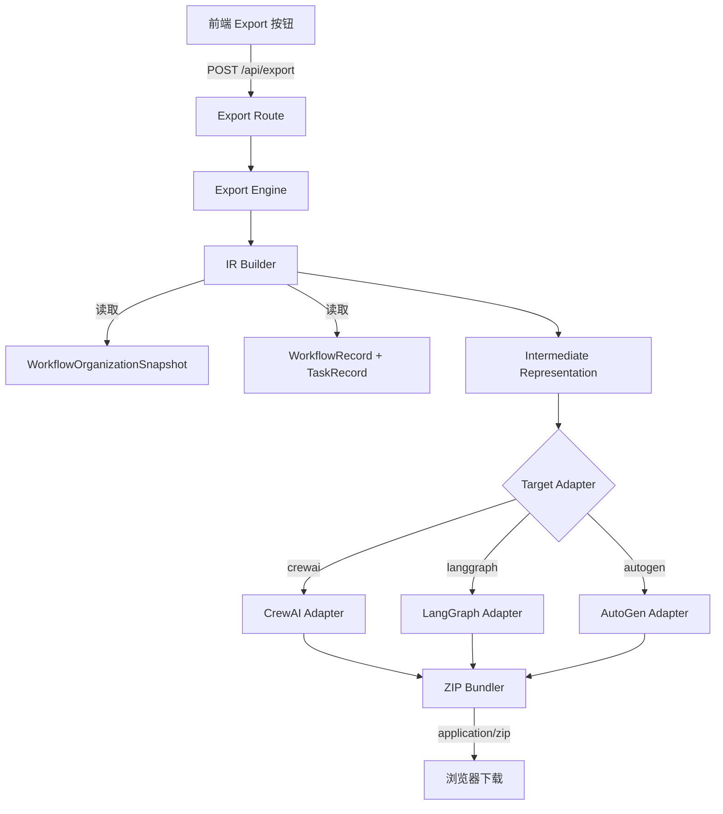

# 跨框架导出 设计文档

## 概述

跨框架导出功能在 Cube Pets Office 现有的动态组织生成、十阶段工作流引擎和 Mission Runtime 基础上，新增一个导出引擎层。该引擎读取已完成工作流的 `WorkflowOrganizationSnapshot`、`WorkflowRecord` 和 `TaskRecord` 数据，先转换为框架无关的中间表示（IR），再通过目标框架适配器生成 CrewAI / LangGraph / AutoGen 的可运行代码和配置文件，最终打包为 ZIP 下载。

核心设计原则：
- **IR 优先**：所有框架适配器基于统一 IR 工作，新增框架只需实现一个适配器
- **纯函数转换**：IR 构建和适配器均为无副作用的纯函数，便于测试
- **最小依赖**：导出引擎不依赖 LLM 调用，仅做数据映射和模板渲染

## 架构



整体流程：
1. 用户在前端点击 Export 按钮，选择目标框架
2. 前端调用 `POST /api/export`，传入 `workflowId` 和 `framework`
3. Export Route 从数据库读取工作流数据和组织结构快照
4. IR Builder 将 Cube 数据模型转换为框架无关的 IR
5. 目标适配器将 IR 转换为特定框架的文件内容（字符串）
6. ZIP Bundler 将文件打包为 ZIP 流返回给前端

## 组件与接口

### 1. IR Builder (`shared/export-schema.ts`)

定义 IR 类型和构建函数。放在 `shared/` 目录下，因为 IR 类型可能被前端用于预览。

```typescript
// 构建 IR 的入口函数
function buildExportIR(
  organization: WorkflowOrganizationSnapshot,
  workflow: WorkflowRecord,
  tasks: TaskRecord[]
): ExportIR
```

### 2. Target Adapters (`server/core/export-adapters/`)

每个适配器是一个纯函数，接收 IR 返回文件列表：

```typescript
interface ExportFile {
  path: string;    // ZIP 内的相对路径
  content: string; // 文件文本内容
}

// 每个适配器的签名
function toCrewAI(ir: ExportIR): ExportFile[]
function toLangGraph(ir: ExportIR): ExportFile[]
function toAutoGen(ir: ExportIR): ExportFile[]
```

### 3. Export Engine (`server/core/exporter.ts`)

编排 IR 构建、适配器调用和 ZIP 打包：

```typescript
type ExportFramework = "crewai" | "langgraph" | "autogen" | "all";

async function exportWorkflow(
  workflowId: string,
  framework: ExportFramework
): Promise<Buffer>  // ZIP buffer
```

### 4. Export Route (`server/routes/export.ts`)

REST API 端点，挂载到 `/api/export`：

```typescript
// POST /api/export
// Body: { workflowId: string, framework: ExportFramework }
// Response: ZIP file stream
```

### 5. 前端 Export UI (`client/src/components/ExportDialog.tsx`)

导出对话框组件，包含框架选择和下载触发逻辑。

## 数据模型

### Intermediate Representation (IR)

```typescript
/** 导出中间表示根对象 */
interface ExportIR {
  version: 1;
  exportedAt: string;              // ISO timestamp
  source: {
    workflowId: string;
    directive: string;
    status: string;
  };
  agents: AgentDefinition[];
  teams: TeamDefinition[];
  pipeline: PipelineDefinition;
  skills: SkillDefinition[];
  tools: ToolDefinition[];
}

/** Agent 定义 */
interface AgentDefinition {
  id: string;
  name: string;
  role: "ceo" | "manager" | "worker";
  title: string;
  responsibility: string;
  goals: string[];
  skillIds: string[];
  toolIds: string[];
  model: {
    name: string;
    temperature: number;
    maxTokens: number;
  };
}

/** 团队定义 */
interface TeamDefinition {
  id: string;
  label: string;
  managerAgentId: string;
  memberAgentIds: string[];
  strategy: "parallel" | "sequential" | "batched";
  direction: string;
}

/** 管道定义 */
interface PipelineDefinition {
  stages: StageDefinition[];
}

/** 阶段定义 */
interface StageDefinition {
  name: string;
  label: string;
  participantRoles: ("ceo" | "manager" | "worker")[];
  executionStrategy: "parallel" | "sequential";
}

/** Skill 定义 */
interface SkillDefinition {
  id: string;
  name: string;
  summary: string;
  prompt: string;
}

/** 工具定义 */
interface ToolDefinition {
  id: string;
  name: string;
  server: string;
  description: string;
  tools: string[];
  connection: {
    transport: string;
    endpoint: string;
  };
}
```

### IR 到 CrewAI 的映射

| IR 概念 | CrewAI 概念 | 文件 |
|---------|------------|------|
| AgentDefinition | Agent (role/goal/backstory) | agents.yaml |
| StageDefinition | Task (description/expected_output/agent) | tasks.yaml |
| TeamDefinition | Crew process (sequential/hierarchical) | crew.py |
| SkillDefinition | Agent backstory 补充 | agents.yaml |

### IR 到 LangGraph 的映射

| IR 概念 | LangGraph 概念 | 文件 |
|---------|---------------|------|
| StageDefinition | StateGraph node | graph.json, main.py |
| AgentDefinition | Node handler function | main.py |
| PipelineDefinition | Edge connections | graph.json |

### IR 到 AutoGen 的映射

| IR 概念 | AutoGen 概念 | 文件 |
|---------|-------------|------|
| AgentDefinition | AssistantAgent config | agents.json |
| TeamDefinition | GroupChat config | group_chat.json |
| PipelineDefinition | GroupChat max_round / flow | main.py |


## 正确性属性

*正确性属性是系统在所有有效执行中都应保持为真的特征或行为——本质上是关于系统应该做什么的形式化陈述。属性是人类可读规范与机器可验证正确性保证之间的桥梁。*

### Property 1: IR 构建保持组织结构完整性

*For any* 有效的 WorkflowOrganizationSnapshot，调用 `buildExportIR` 后，生成的 IR 中 `agents` 数组的长度应等于 snapshot 中 `nodes` 数组的长度，且 `teams` 数组的长度应等于 `departments` 数组的长度。每个 agent 的 id、name、role 应与对应 node 一致。

**Validates: Requirements 1.1, 1.2**

### Property 2: IR 构建保持管道阶段完整性

*For any* 有效的 WorkflowRecord 和 TaskRecord 列表，调用 `buildExportIR` 后，生成的 IR 中 `pipeline.stages` 应包含恰好 10 个阶段，且阶段名称和顺序与 `WORKFLOW_STAGES` 常量一致。

**Validates: Requirements 1.3**

### Property 3: IR 构建保持节点绑定完整性

*For any* 有效的 WorkflowOrganizationSnapshot，调用 `buildExportIR` 后，snapshot 中所有节点的 skills 和 mcp 绑定应完整映射到 IR 的 `skills` 和 `tools` 数组中（去重后），且每个 AgentDefinition 的 skillIds 和 toolIds 应正确引用对应的 SkillDefinition 和 ToolDefinition。

**Validates: Requirements 1.4, 1.5**

### Property 4: CrewAI 适配器输出完整性

*For any* 有效的 ExportIR，调用 `toCrewAI` 后，生成的文件列表应包含 agents.yaml（包含所有 agent 的 role/goal/backstory 条目，且引用了 skills 的 agent 的 backstory 中包含 skill prompt 文本）、tasks.yaml（包含所有 stage 对应的 task 条目）、crew.py（包含 Crew 类定义）和 requirements.txt。

**Validates: Requirements 2.1, 2.2, 2.3, 2.4, 2.5**

### Property 5: LangGraph 适配器输出完整性

*For any* 有效的 ExportIR，调用 `toLangGraph` 后，生成的文件列表应包含 graph.json（包含与 pipeline stages 数量一致的节点和正确的边连接）、main.py（为每个 AgentDefinition 包含对应的节点处理函数定义）和 requirements.txt。

**Validates: Requirements 3.1, 3.2, 3.3, 3.4**

### Property 6: AutoGen 适配器输出完整性

*For any* 有效的 ExportIR，调用 `toAutoGen` 后，生成的文件列表应包含 agents.json（包含所有 agent 的 name/system_message/llm_config 配置）、group_chat.json（包含所有 team 对应的 GroupChat 配置）、main.py（引用所有 agent 和 GroupChat）和 requirements.txt。

**Validates: Requirements 4.1, 4.2, 4.3, 4.4**

### Property 7: ZIP 打包目录结构正确性

*For any* 有效的 ExportIR 和框架选择，当 framework 为单个框架时，ZIP 中的文件应位于根目录；当 framework 为 "all" 时，ZIP 中应包含 crewai/、langgraph/、autogen/ 三个子目录，每个子目录包含对应框架的完整文件。所有情况下 ZIP 根目录都应包含 README.md。

**Validates: Requirements 5.1, 5.2, 5.3, 5.4**

### Property 8: ZIP 文件名格式正确性

*For any* 框架选择和时间戳，生成的 ZIP 文件名应匹配格式 `cube-export-{framework}-{timestamp}.zip`，其中 framework 为 "crewai"、"langgraph"、"autogen" 或 "all"。

**Validates: Requirements 5.5**

### Property 9: 框架参数验证

*For any* 不在 ["crewai", "langgraph", "autogen", "all"] 中的字符串作为 framework 参数，Export_Engine 应拒绝请求并返回错误。

**Validates: Requirements 6.3**

### Property 10: IR 序列化往返一致性

*For any* 有效的 ExportIR 对象，将其序列化为 JSON 字符串后再反序列化，应产生与原始对象深度相等的结果。

**Validates: Requirements 8.3**

## 错误处理

| 场景 | 处理方式 |
|------|---------|
| workflowId 不存在 | 返回 HTTP 404，body: `{ error: "Workflow not found" }` |
| 工作流无关联组织结构 | 返回 HTTP 404，body: `{ error: "No organization found for this workflow" }` |
| framework 参数无效 | 返回 HTTP 400，body: `{ error: "Invalid framework", supported: ["crewai", "langgraph", "autogen", "all"] }` |
| 节点缺少 skills/mcp 字段 | 静默处理，生成空数组，不中断导出 |
| ZIP 打包失败 | 返回 HTTP 500，body: `{ error: "Export packaging failed" }`，不暴露堆栈 |
| 适配器模板渲染异常 | 返回 HTTP 500，body: `{ error: "Export generation failed for {framework}" }` |

## 测试策略

### 属性测试（Property-Based Testing）

使用 `fast-check` 库进行属性测试，每个属性至少运行 100 次迭代。

需要实现的生成器：
- `arbitraryWorkflowOrganizationSnapshot`: 生成随机的组织结构快照（包含 1-5 个部门，每个部门 1-4 个节点，随机 skills 和 mcp 绑定）
- `arbitraryWorkflowRecord`: 生成随机的工作流记录
- `arbitraryTaskRecord`: 生成随机的任务记录列表
- `arbitraryExportIR`: 生成随机的有效 IR 对象

属性测试覆盖：
- **Feature: cross-framework-export, Property 1**: IR 构建保持组织结构完整性
- **Feature: cross-framework-export, Property 2**: IR 构建保持管道阶段完整性
- **Feature: cross-framework-export, Property 3**: IR 构建保持节点绑定完整性
- **Feature: cross-framework-export, Property 4**: CrewAI 适配器输出完整性
- **Feature: cross-framework-export, Property 5**: LangGraph 适配器输出完整性
- **Feature: cross-framework-export, Property 6**: AutoGen 适配器输出完整性
- **Feature: cross-framework-export, Property 7**: ZIP 打包目录结构正确性
- **Feature: cross-framework-export, Property 8**: ZIP 文件名格式正确性
- **Feature: cross-framework-export, Property 9**: 框架参数验证
- **Feature: cross-framework-export, Property 10**: IR 序列化往返一致性

### 单元测试

单元测试聚焦于具体示例和边界情况：
- IR Builder 处理空 skills/mcp 节点的边界情况
- 各适配器对最小 IR（单 agent、单 stage）的输出验证
- API 路由的 400/404/500 错误响应
- ZIP 文件名格式的具体示例

### 测试配置

- 属性测试库：`fast-check`（项目已使用 vitest，fast-check 与 vitest 兼容）
- 每个属性测试最少 100 次迭代
- 每个属性测试必须以注释标注对应的设计属性编号
- 标注格式：`// Feature: cross-framework-export, Property N: {property_text}`
