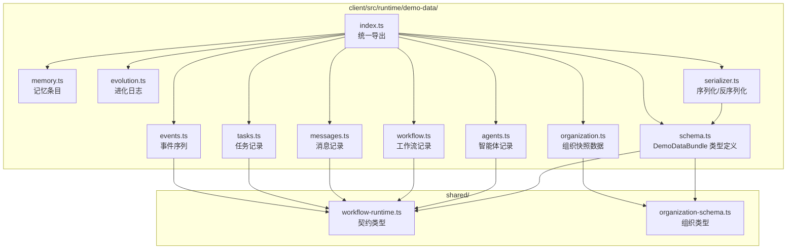

# 设计文档：Demo Data Engine（预录演示数据引擎）

## 概述

本设计文档描述预录演示数据引擎的技术架构，该引擎为 Cube Pets Office 前端 Demo 模式提供数据层支撑。核心目标是构建一套静态可导入的 TypeScript 数据模块和配套的序列化/反序列化工具，使前端能在无 LLM API Key 的情况下驱动完整的十阶段工作流演示。

设计遵循以下原则：

- 数据结构严格符合 `shared/` 目录下的现有契约类型
- 以 TypeScript 模块形式存储，支持 tree-shaking
- 基于现有 18 个 seed agent 定义构建演示组织
- 演示场景为"设计一个手游营销推广方案"

## 架构



## 组件与接口

### 1. DemoDataBundle 类型定义（schema.ts）

定义演示数据包的完整 TypeScript 类型，作为所有数据模块和序列化器的核心契约。

```typescript
import type {
  AgentRecord,
  WorkflowRecord,
  MessageRecord,
  TaskRecord,
  AgentEvent,
} from "@shared/workflow-runtime";
import type { WorkflowOrganizationSnapshot } from "@shared/organization-schema";

/** 记忆条目类型 */
export type MemoryEntryKind = "short_term" | "medium_term" | "long_term";

/** 记忆条目 */
export interface DemoMemoryEntry {
  agentId: string;
  kind: MemoryEntryKind;
  stage: string;
  content: string;
  /** 相对于演示开始时间的毫秒偏移 */
  timestampOffset: number;
}

/** 进化日志条目 */
export interface DemoEvolutionLog {
  agentId: string;
  dimension: string;
  oldScore: number;
  newScore: number;
  patchContent: string;
  applied: boolean;
}

/** 带时间戳偏移的事件 */
export interface DemoTimedEvent {
  /** 相对于演示开始时间的毫秒偏移 */
  timestampOffset: number;
  event: AgentEvent;
}

/** 演示数据包完整类型 */
export interface DemoDataBundle {
  /** 数据包版本标识 */
  version: 1;
  /** 演示场景名称 */
  scenarioName: string;
  /** 演示场景描述 */
  scenarioDescription: string;
  /** 组织快照 */
  organization: WorkflowOrganizationSnapshot;
  /** 工作流记录 */
  workflow: WorkflowRecord;
  /** 智能体记录列表 */
  agents: AgentRecord[];
  /** 消息记录列表 */
  messages: MessageRecord[];
  /** 任务记录列表 */
  tasks: TaskRecord[];
  /** 记忆条目列表 */
  memoryEntries: DemoMemoryEntry[];
  /** 进化日志列表 */
  evolutionLogs: DemoEvolutionLog[];
  /** 带时间戳的事件序列 */
  events: DemoTimedEvent[];
}
```

### 2. 组织快照数据（organization.ts）

基于现有 18 个 seed agent 构建演示组织快照。选取 1 CEO（ceo）、2 Manager（pixel, nexus）和 4 Worker（nova, blaze, flux, tensor）组成演示团队，模拟"设计手游营销推广方案"场景。

组织结构：

- CEO Gateway（ceo）— 根节点
  - Pixel · 游戏部经理（pixel）
    - Nova — 游戏策划（nova）
    - Blaze — 技术实现（blaze）
  - Nexus · AI 部经理（nexus）
    - Flux — 模型训练（flux）
    - Tensor — 数据工程（tensor）

### 3. 事件序列（events.ts）

事件序列按时间戳偏移量排序，覆盖全部十阶段。每个阶段包含：

- `stage_change` 事件标记阶段开始
- `agent_active` 事件标记智能体激活
- `message_sent` 事件标记消息发送
- `score_assigned` 事件标记评分（review 阶段）
- `task_update` 事件标记任务状态变更
- `workflow_complete` 事件标记工作流完成（最后阶段）

时间线设计（30 秒总时长）：
| 阶段 | 偏移范围(ms) | 主要事件 |
|------|-------------|---------|
| direction | 0-2000 | CEO 下发方向 |
| planning | 2000-5000 | Manager 拆解任务 |
| execution | 5000-12000 | Worker 执行任务 |
| review | 12000-15000 | Manager 评审打分 |
| meta_audit | 15000-18000 | 元审计 |
| revision | 18000-21000 | Worker 修订 |
| verify | 21000-23000 | 验证通过 |
| summary | 23000-25000 | 汇总报告 |
| feedback | 25000-27000 | CEO 反馈 |
| evolution | 27000-30000 | 进化更新 |

### 4. 序列化器（serializer.ts）

提供两个核心函数：

```typescript
/**
 * 将 DemoDataBundle 序列化为格式化 JSON 字符串
 */
export function serializeDemoData(bundle: DemoDataBundle): string {
  return JSON.stringify(bundle, null, 2);
}

/**
 * 将 JSON 字符串反序列化为 DemoDataBundle，包含结构验证
 */
export function deserializeDemoData(json: string): DemoDataBundle {
  const parsed = JSON.parse(json);
  validateDemoDataBundle(parsed);
  return parsed;
}
```

验证逻辑（validateDemoDataBundle）检查：

- `version` 字段为 1
- `organization` 存在且 `kind` 为 `"workflow_organization"`
- `workflow` 存在且包含必要字段（id, directive, status）
- `agents` 为非空数组
- `messages` 为数组
- `tasks` 为数组
- `memoryEntries` 为数组，每条包含 agentId、kind、stage、content、timestampOffset
- `evolutionLogs` 为数组，每条包含 agentId、dimension、oldScore、newScore
- `events` 为数组，每条包含 timestampOffset 和 event

验证失败时抛出包含具体字段路径的错误信息，例如：`"Invalid DemoDataBundle: missing field 'organization.workflowId'"`

### 5. 统一导出（index.ts）

```typescript
export type {
  DemoDataBundle,
  DemoMemoryEntry,
  DemoEvolutionLog,
  DemoTimedEvent,
} from "./schema";
export { serializeDemoData, deserializeDemoData } from "./serializer";
export { DEMO_BUNDLE } from "./bundle";
```

其中 `bundle.ts` 组装所有数据模块为完整的 `DemoDataBundle` 实例。

## 数据模型

### DemoDataBundle 字段映射

| 字段                | 类型                           | 来源契约                      | 说明              |
| ------------------- | ------------------------------ | ----------------------------- | ----------------- |
| version             | `1`                            | 自定义                        | 数据包版本        |
| scenarioName        | `string`                       | 自定义                        | 场景名称          |
| scenarioDescription | `string`                       | 自定义                        | 场景描述          |
| organization        | `WorkflowOrganizationSnapshot` | shared/organization-schema.ts | 组织快照          |
| workflow            | `WorkflowRecord`               | shared/workflow-runtime.ts    | 工作流记录        |
| agents              | `AgentRecord[]`                | shared/workflow-runtime.ts    | 智能体列表        |
| messages            | `MessageRecord[]`              | shared/workflow-runtime.ts    | 消息列表（≥20条） |
| tasks               | `TaskRecord[]`                 | shared/workflow-runtime.ts    | 任务列表（≥4条）  |
| memoryEntries       | `DemoMemoryEntry[]`            | 自定义                        | 记忆条目          |
| evolutionLogs       | `DemoEvolutionLog[]`           | 自定义                        | 进化日志          |
| events              | `DemoTimedEvent[]`             | 自定义（包装 AgentEvent）     | 事件序列          |

### 消息流转模式

演示数据中的消息覆盖以下流转路径：

1. CEO → Manager（direction 阶段方向下发）
2. Manager → Worker（planning 阶段任务分配）
3. Worker → Manager（execution 阶段交付提交）
4. Manager → Worker（review 阶段评审反馈）
5. Manager → CEO（summary 阶段汇总报告）

### 记忆条目类型

| 类型     | kind 值       | 触发阶段  | 内容示例         |
| -------- | ------------- | --------- | ---------------- |
| 短期记忆 | `short_term`  | execution | LLM 交互日志片段 |
| 中期记忆 | `medium_term` | summary   | 工作流摘要       |
| 长期记忆 | `long_term`   | evolution | SOUL.md 补丁内容 |

## 正确性属性

_属性是系统在所有有效执行中应保持为真的特征或行为——本质上是关于系统应该做什么的形式化陈述。属性是人类可读规范与机器可验证正确性保证之间的桥梁。_

### Property 1: 序列化 Round-Trip 一致性

_For any_ 有效的 DemoDataBundle 实例，调用 serializeDemoData 序列化后再调用 deserializeDemoData 反序列化，SHALL 产生与原始实例深度相等的对象。

**Validates: Requirements 2.2, 2.3, 2.4**

### Property 2: 事件序列时间戳单调递增

_For any_ 有效的 DemoDataBundle 实例，events 数组中的 DemoTimedEvent 按索引顺序排列时，每个事件的 timestampOffset 应大于或等于前一个事件的 timestampOffset。

**Validates: Requirements 1.3**

### Property 3: 序列化输出为格式化 JSON

_For any_ 有效的 DemoDataBundle 实例，serializeDemoData 的输出字符串应包含换行符和缩进空格，且为合法的 JSON 字符串（JSON.parse 不抛出异常）。

**Validates: Requirements 2.5**

### Property 4: 反序列化无效输入产生描述性错误

_For any_ 不符合 DemoDataBundle 结构的 JSON 字符串（缺少必要字段或字段类型错误），deserializeDemoData 应抛出包含具体字段路径信息的错误。

**Validates: Requirements 2.6**

## 错误处理

### 反序列化错误

- 输入不是有效 JSON：抛出 `SyntaxError`（由 JSON.parse 原生抛出）
- 输入缺少必要字段：抛出 `Error`，消息格式为 `"Invalid DemoDataBundle: missing field '{fieldPath}'"`
- 字段类型不匹配：抛出 `Error`，消息格式为 `"Invalid DemoDataBundle: field '{fieldPath}' expected {expectedType}, got {actualType}"`
- version 不匹配：抛出 `Error`，消息格式为 `"Invalid DemoDataBundle: unsupported version {version}, expected 1"`

### 数据完整性

- 演示数据模块在编译时通过 TypeScript 类型检查确保结构正确
- 运行时通过 validateDemoDataBundle 函数验证反序列化数据的完整性

## 测试策略

### 属性测试（Property-Based Testing）

使用 `fast-check` 库进行属性测试，每个属性至少运行 100 次迭代。

需要构建 `DemoDataBundle` 的 fast-check Arbitrary 生成器：

- 生成符合 `WorkflowOrganizationSnapshot` 结构的随机组织快照
- 生成符合 `AgentRecord`、`MessageRecord`、`TaskRecord` 结构的随机记录
- 生成按时间戳排序的随机事件序列
- 生成覆盖三种类型的随机记忆条目
- 生成包含评分变化的随机进化日志

每个属性测试标注对应的设计属性编号：

- **Feature: demo-data-engine, Property 1: 序列化 Round-Trip 一致性**
- **Feature: demo-data-engine, Property 2: 事件序列时间戳单调递增**
- **Feature: demo-data-engine, Property 3: 序列化输出为格式化 JSON**
- **Feature: demo-data-engine, Property 4: 反序列化无效输入产生描述性错误**

### 单元测试

使用 `vitest` 进行单元测试，覆盖以下场景：

1. **数据完整性验证**（对应需求 1.1-1.7）：
   - 验证 DEMO_BUNDLE 覆盖全部 10 个工作流阶段
   - 验证组织快照包含正确的角色数量（1 CEO、2 Manager、4 Worker）
   - 验证消息数量 ≥ 20 且覆盖三种流转路径
   - 验证任务数量 ≥ 4 且包含完整评分
   - 验证记忆条目覆盖三级记忆类型
   - 验证进化日志包含评分变化和补丁内容

2. **序列化器边界情况**：
   - 空字符串输入反序列化
   - null/undefined 输入反序列化
   - 部分字段缺失的 JSON 输入
   - version 字段不匹配

### 测试互补性

- 属性测试验证序列化/反序列化的通用正确性（跨所有输入）
- 单元测试验证具体演示数据实例的完整性和边界情况
- 两者结合提供全面的覆盖：属性测试捕获通用 bug，单元测试验证具体业务规则
