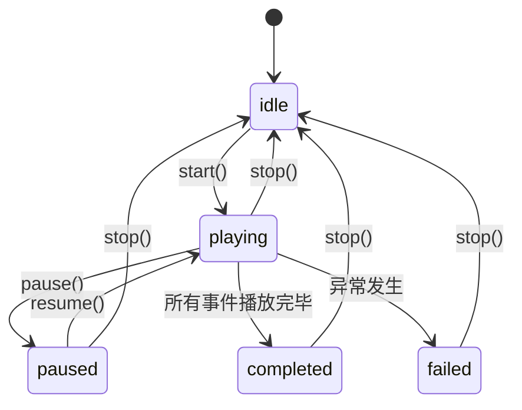
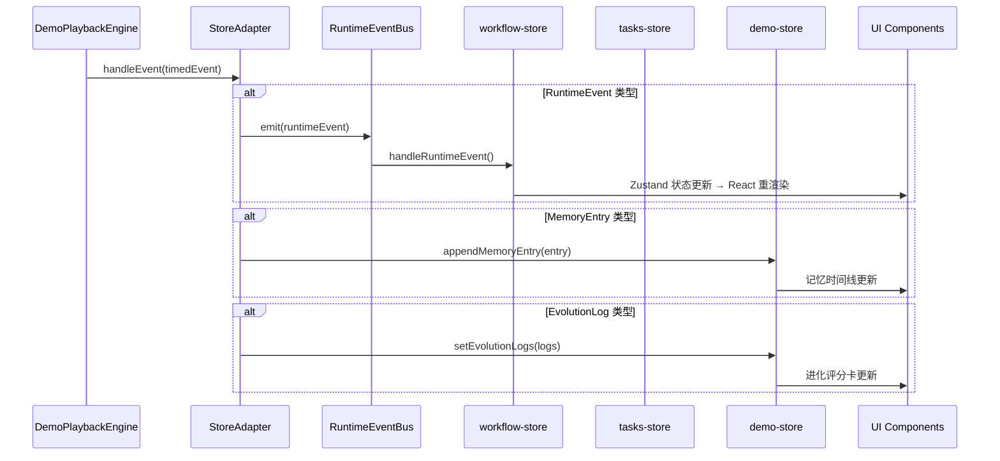

# 设计文档：Demo Guided Experience（演示引导体验）

## 概述

本设计文档描述演示回放引擎与引导体验层的技术架构。核心目标是构建一个基于时间线的事件调度引擎（DemoPlaybackEngine），将 demo-data-engine 提供的 DemoDataBundle 中的 DemoTimedEvent 序列按时间戳偏移量调度到现有的 Zustand 状态管理层（workflow-store 和 tasks-store），从而驱动 WorkflowPanel、Scene3D 等 UI 组件自动响应，实现零配置的完整演示体验。

设计遵循以下原则：

- 演示数据通过 RuntimeEventBus 和 Mission_Store 原生接口流转，复用现有事件处理链路
- 使用 setTimeout 进行事件调度，确保确定性回放
- 不引入新的 npm 依赖
- 记忆和进化可视化尽量复用现有 WorkflowPanel 组件

## 架构

```mermaid
graph TD
    subgraph "入口层"
        Home[Home.tsx<br/>Live Demo 按钮]
        Hook[useDemoMode.ts<br/>Demo 模式 Hook]
    end

    subgraph "引擎层 client/src/runtime/demo-playback/"
        Engine[DemoPlaybackEngine<br/>回放引擎核心类]
        Scheduler[事件调度器<br/>setTimeout 链]
        Adapter[StoreAdapter<br/>Store 写入适配器]
    end

    subgraph "数据层 client/src/runtime/demo-data/"
        Bundle[DEMO_BUNDLE<br/>预录数据包]
        Schema[DemoTimedEvent<br/>事件序列]
    end

    subgraph "状态层"
        WFStore[workflow-store<br/>工作流状态]
        TaskStore[tasks-store<br/>Mission 状态]
        EventBus[RuntimeEventBus<br/>事件总线]
        DemoStore[demo-store<br/>Demo 专属状态]
    end

    subgraph "展示层"
        Scene3D[Scene3D<br/>3D 场景]
        WFPanel[WorkflowPanel<br/>工作流面板]
        MemPanel[MemoryTimeline<br/>记忆时间线]
        EvoPanel[EvolutionScoreCard<br/>进化评分卡]
    end

    Home --> Hook
    Hook --> Engine
    Engine --> Bundle
    Engine --> Scheduler
    Scheduler --> Adapter
    Adapter --> EventBus
    Adapter --> WFStore
    Adapter --> TaskStore
    Adapter --> DemoStore
    EventBus --> WFStore
    WFStore --> Scene3D
    WFStore --> WFPanel
    DemoStore --> MemPanel
    DemoStore --> EvoPanel
    TaskStore --> WFPanel
```



## 组件与接口

### 1. DemoPlaybackEngine（回放引擎核心类）

位置：`client/src/runtime/demo-playback/engine.ts`

回放引擎是一个纯 TypeScript 类，不依赖 React。负责按时间线调度 DemoTimedEvent 序列。

```typescript
export type PlaybackState =
  | "idle"
  | "playing"
  | "paused"
  | "completed"
  | "failed";

export interface PlaybackCallbacks {
  onEvent: (event: DemoTimedEvent) => void;
  onStateChange: (state: PlaybackState) => void;
  onError: (error: Error) => void;
  onMemoryEntry?: (entry: DemoMemoryEntry) => void;
  onEvolutionLog?: (log: DemoEvolutionLog) => void;
}

export class DemoPlaybackEngine {
  private state: PlaybackState = "idle";
  private timers: number[] = [];
  private pausedAt: number | null = null;
  private startTime: number = 0;
  private pendingEvents: DemoTimedEvent[] = [];
  private currentIndex: number = 0;

  constructor(
    private bundle: DemoDataBundle,
    private callbacks: PlaybackCallbacks
  ) {}

  /** 开始回放，调度所有事件 */
  start(): void;

  /** 暂停回放，记录当前进度 */
  pause(): void;

  /** 恢复回放，从暂停位置继续 */
  resume(): void;

  /** 停止回放，清理所有定时器 */
  stop(): void;

  /** 获取当前回放状态 */
  getState(): PlaybackState;

  /** 销毁引擎，释放所有资源 */
  dispose(): void;
}
```

调度策略：

- `start()` 时记录 `startTime = performance.now()`
- 遍历事件序列，为每个事件计算 `delay = event.timestampOffset - elapsed`
- 使用 `setTimeout(callback, delay)` 调度每个事件
- 暂停时清除所有未触发的 timer，记录已播放到的索引
- 恢复时从暂停索引重新计算剩余事件的延迟并重新调度

### 2. StoreAdapter（Store 写入适配器）

位置：`client/src/runtime/demo-playback/store-adapter.ts`

负责将 DemoTimedEvent 转换为对应的 Store 操作，确保演示数据通过原生接口流转。

```typescript
export class DemoStoreAdapter {
  private demoWorkflowId: string;
  private previousTaskId: string | null = null;

  constructor(bundle: DemoDataBundle);

  /** 初始化 Demo mission：写入 MissionRecord、设置当前选中任务 */
  initializeDemoMission(): void;

  /** 处理单个事件，分发到对应 Store */
  handleEvent(timedEvent: DemoTimedEvent): void;

  /** 清理所有演示数据，恢复 Store 状态 */
  cleanup(): void;
}
```

事件分发逻辑：

- `stage_change` → 通过 RuntimeEventBus.emit() 触发 workflow-store 的 handleRuntimeEvent
- `agent_active` → 通过 RuntimeEventBus.emit() 更新 agentStatuses
- `message_sent` → 通过 RuntimeEventBus.emit() 触发 fetchWorkflowDetail
- `score_assigned` → 通过 RuntimeEventBus.emit() 触发 fetchWorkflowDetail
- `task_update` → 通过 RuntimeEventBus.emit() 触发 fetchWorkflowDetail
- `workflow_complete` → 通过 RuntimeEventBus.emit() 设置最终状态

Mission Store 集成：

- `initializeDemoMission()` 调用 tasks-store 的 `createMission()` 创建 kind="demo" 的 MissionRecord
- 将 demo mission 设置为 `selectedTaskId`
- `cleanup()` 时移除 demo mission 并恢复 `selectedTaskId` 到之前的值

### 3. demo-store（Demo 专属状态）

位置：`client/src/lib/demo-store.ts`

管理 Demo 模式特有的状态，包括记忆时间线和进化评分数据。

```typescript
interface DemoState {
  isActive: boolean;
  playbackState: PlaybackState;
  memoryTimeline: DemoMemoryEntry[];
  evolutionLogs: DemoEvolutionLog[];
  currentStage: string | null;

  activate: () => void;
  deactivate: () => void;
  setPlaybackState: (state: PlaybackState) => void;
  appendMemoryEntry: (entry: DemoMemoryEntry) => void;
  setEvolutionLogs: (logs: DemoEvolutionLog[]) => void;
  setCurrentStage: (stage: string | null) => void;
  reset: () => void;
}
```

### 4. useDemoMode Hook

位置：`client/src/hooks/useDemoMode.ts`

React Hook，封装 Demo 模式的生命周期管理。

```typescript
export function useDemoMode() {
  return {
    isActive: boolean;
    playbackState: PlaybackState;
    startDemo: () => void;
    pauseDemo: () => void;
    resumeDemo: () => void;
    stopDemo: () => void;
  };
}
```

生命周期：

1. `startDemo()` → 创建 DemoPlaybackEngine 实例 → 调用 StoreAdapter.initializeDemoMission() → 调用 engine.start()
2. 组件卸载时自动调用 `stopDemo()` → engine.dispose() → StoreAdapter.cleanup()

### 5. Live Demo 入口按钮

位置：修改 `client/src/pages/Home.tsx`

在首页 Mission 入口卡片下方添加"Live Demo"按钮，样式醒目但不喧宾夺主。

```typescript
<button
  onClick={startDemo}
  className="mt-2 inline-flex w-full items-center justify-center gap-2 rounded-2xl border border-[#7CB9E8]/40 bg-[#E8F4FD] px-4 py-2.5 text-sm font-semibold text-[#2E86C1] shadow-sm transition-colors hover:bg-[#D6EAF8]"
>
  {locale === 'zh-CN' ? '🎬 Live Demo' : '🎬 Live Demo'}
  <Play className="h-4 w-4" />
</button>
```

### 6. MemoryTimeline 组件

位置：`client/src/components/demo/MemoryTimeline.tsx`

在 WorkflowPanel 的 memory 视图中展示记忆写入时间线。

```typescript
interface MemoryTimelineProps {
  entries: DemoMemoryEntry[];
}
```

每条记忆条目显示：

- 类型标签（短期/中期/长期），用不同颜色区分
- 关联的 Agent 名称
- 阶段标签
- 内容摘要

### 7. EvolutionScoreCard 组件

位置：`client/src/components/demo/EvolutionScoreCard.tsx`

在 WorkflowPanel 的 evolution 相关视图中展示能力评分变化。

```typescript
interface EvolutionScoreCardProps {
  logs: DemoEvolutionLog[];
  animate: boolean;
}
```

展示内容：

- 每个 Agent 的四维评分变化（accuracy、completeness、actionability、format）
- 数值从 oldScore 平滑过渡到 newScore 的动画效果（CSS transition）
- SOUL.md 补丁内容预览

## 数据模型

### 回放引擎状态机



### 事件调度时间线

回放引擎按 DemoTimedEvent 的 timestampOffset 调度事件。事件序列来自 DemoDataBundle.events，已按 timestampOffset 升序排列。

| 阶段       | 偏移范围(ms) | 主要事件类型                                          |
| ---------- | ------------ | ----------------------------------------------------- |
| direction  | 0-2000       | stage_change, agent_active, message_sent              |
| planning   | 2000-5000    | stage_change, agent_active, message_sent, task_update |
| execution  | 5000-12000   | stage_change, agent_active, message_sent, task_update |
| review     | 12000-15000  | stage_change, agent_active, score_assigned            |
| meta_audit | 15000-18000  | stage_change, agent_active                            |
| revision   | 18000-21000  | stage_change, agent_active, task_update               |
| verify     | 21000-23000  | stage_change, agent_active                            |
| summary    | 23000-25000  | stage_change, agent_active, message_sent              |
| feedback   | 25000-27000  | stage_change, agent_active, message_sent              |
| evolution  | 27000-30000  | stage_change, agent_active, workflow_complete         |

### 记忆条目调度

记忆条目（DemoMemoryEntry）不通过 RuntimeEventBus 分发，而是由回放引擎根据 timestampOffset 直接写入 demo-store。

| 记忆类型    | 触发阶段  | 写入目标                  |
| ----------- | --------- | ------------------------- |
| short_term  | execution | demo-store.memoryTimeline |
| medium_term | summary   | demo-store.memoryTimeline |
| long_term   | evolution | demo-store.memoryTimeline |

### 进化日志调度

进化日志（DemoEvolutionLog）在 evolution 阶段开始时一次性写入 demo-store.evolutionLogs，触发 EvolutionScoreCard 的动画渲染。

### Demo Mission 数据结构

```typescript
// 创建 Demo MissionRecord 时的参数
{
  title: bundle.scenarioName,
  sourceText: bundle.scenarioDescription,
  kind: 'demo',
}
```

### Store 写入适配器数据流



## 正确性属性

_属性是系统在所有有效执行中应保持为真的特征或行为——本质上是关于系统应该做什么的形式化陈述。属性是人类可读规范与机器可验证正确性保证之间的桥梁。_

### Property 1: 事件按时间戳顺序发射

_For any_ 有效的 DemoDataBundle，DemoPlaybackEngine 发射事件的顺序 SHALL 与 events 数组中 timestampOffset 的非递减顺序一致。即对于任意两个连续发射的事件 e*i 和 e*{i+1}，e*i.timestampOffset ≤ e*{i+1}.timestampOffset。

**Validates: Requirements 3.2, 3.4**

### Property 2: 暂停恢复不丢失不重复事件

_For any_ 事件序列和任意暂停时间点，暂停后恢复回放，最终发射的事件集合 SHALL 与不暂停直接播放完毕的事件集合完全相同（相同的事件、相同的顺序、无遗漏、无重复）。

**Validates: Requirements 3.5**

### Property 3: 异常导致 failed 状态转换

_For any_ 回放过程中抛出的异常，DemoPlaybackEngine SHALL 转换到 'failed' 状态，且 onError 回调 SHALL 被调用恰好一次，传入的 Error 对象包含异常信息。

**Validates: Requirements 3.7**

### Property 4: Demo 退出恢复 Store 状态

_For any_ 初始 Mission_Store 状态（selectedTaskId 和 tasks 列表），进入 Demo 模式再退出后，Mission_Store 的 selectedTaskId SHALL 恢复为进入前的值，且 tasks 列表中不包含 kind="demo" 的记录。

**Validates: Requirements 4.5**

### Property 5: 记忆时间线条目包含完整标注

_For any_ DemoMemoryEntry，MemoryTimeline 组件渲染的对应条目 SHALL 包含记忆类型标签（short_term/medium_term/long_term）和关联的 Agent 标识。

**Validates: Requirements 7.4**

### Property 6: 进化评分卡包含全维度数据

_For any_ DemoEvolutionLog 列表，EvolutionScoreCard 组件渲染的输出 SHALL 为每个 Agent 展示 accuracy、completeness、actionability、format 四个维度的 oldScore 和 newScore。

**Validates: Requirements 7.5**

## 错误处理

### 回放引擎错误

| 错误场景                               | 处理方式                                                     |
| -------------------------------------- | ------------------------------------------------------------ |
| DemoDataBundle 为空或无效              | engine.start() 抛出 Error，状态保持 idle                     |
| 事件处理回调抛出异常                   | 捕获异常，调用 onError 回调，状态转为 failed，清理所有定时器 |
| 浏览器标签页不可见（visibilitychange） | 自动暂停回放，标签页恢复可见时自动恢复                       |
| 组件卸载时回放未完成                   | dispose() 清理所有定时器和事件监听，状态转为 idle            |

### Store 写入错误

| 错误场景                         | 处理方式                                           |
| -------------------------------- | -------------------------------------------------- |
| Mission_Store.createMission 失败 | 记录 console.error，状态转为 failed，显示错误提示  |
| RuntimeEventBus.emit 抛出异常    | 捕获异常，记录日志，继续处理后续事件（非致命错误） |
| cleanup() 过程中异常             | 捕获异常，记录 console.warn，尽力恢复状态          |

### UI 错误

| 错误场景                    | 处理方式                               |
| --------------------------- | -------------------------------------- |
| MemoryTimeline 渲染异常     | React Error Boundary 捕获，显示降级 UI |
| EvolutionScoreCard 动画异常 | CSS transition 失败时静态显示最终值    |

## 测试策略

### 属性测试（Property-Based Testing）

使用 `fast-check` 库进行属性测试，每个属性至少运行 100 次迭代。

需要构建的 fast-check Arbitrary 生成器：

- **DemoTimedEvent 序列生成器**：生成按 timestampOffset 升序排列的随机事件序列，事件类型覆盖 stage_change、agent_active、message_sent、score_assigned、task_update、workflow_complete
- **DemoMemoryEntry 生成器**：生成随机记忆条目，kind 覆盖 short_term、medium_term、long_term
- **DemoEvolutionLog 生成器**：生成随机进化日志，包含四维评分变化
- **暂停时间点生成器**：在事件序列的有效时间范围内生成随机暂停时间点

每个属性测试标注对应的设计属性编号：

- **Feature: demo-guided-experience, Property 1: 事件按时间戳顺序发射**
- **Feature: demo-guided-experience, Property 2: 暂停恢复不丢失不重复事件**
- **Feature: demo-guided-experience, Property 3: 异常导致 failed 状态转换**
- **Feature: demo-guided-experience, Property 4: Demo 退出恢复 Store 状态**
- **Feature: demo-guided-experience, Property 5: 记忆时间线条目包含完整标注**
- **Feature: demo-guided-experience, Property 6: 进化评分卡包含全维度数据**

### 单元测试

使用 `vitest` 进行单元测试，覆盖以下场景：

1. **回放引擎生命周期**（对应需求 3.1, 3.3, 3.6）：
   - 验证 start() 后状态转为 playing
   - 验证所有事件播放完毕后状态转为 completed
   - 验证 DEMO_BUNDLE 回放在 30 秒时间线内完成
   - 验证回放完成后工作流状态为 completed

2. **Mission Store 集成**（对应需求 4.3, 4.4）：
   - 验证创建的 MissionRecord 的 kind 字段为 "demo"
   - 验证 demo mission 被设置为当前选中任务

3. **无 API Key 依赖**（对应需求 5.1, 5.2, 5.3）：
   - 验证回放过程中无 fetch 调用到 LLM 端点
   - 验证 Home 页面渲染 Live Demo 按钮

4. **边界情况**：
   - 空事件序列的回放
   - 连续快速 pause/resume 操作
   - 浏览器离线状态下的回放（需求 5.4）

### 测试互补性

- 属性测试验证回放引擎的通用正确性（事件顺序、暂停恢复、错误处理、状态恢复）
- 单元测试验证具体集成点和边界情况
- 两者结合提供全面覆盖：属性测试捕获通用 bug，单元测试验证具体业务规则和 UI 行为
