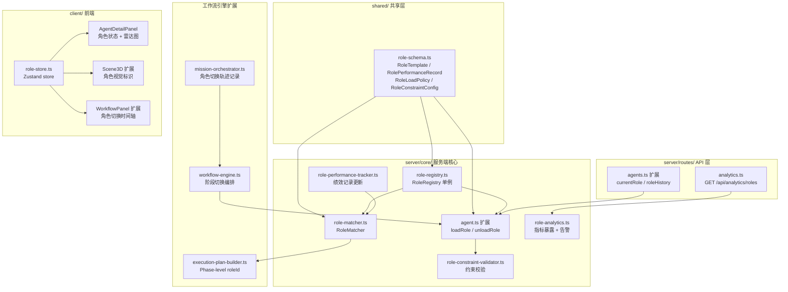

# 设计文档：动态角色系统（Dynamic Role System）

## 概述

动态角色系统在现有动态组织生成模块之上，引入角色模板的运行时加载/卸载机制。核心思路是将角色定义从 Agent 实例中解耦为独立的 `RoleTemplate` 资源，通过 `RoleRegistry` 全局管理，Agent 在任务分配时按需加载角色，任务完成后卸载。

系统由以下核心组件构成：

1. **RoleRegistry** — 角色模板的注册、继承、查询和变更审计
2. **Agent 角色加载/卸载** — 扩展现有 Agent 类，支持运行时角色切换
3. **RoleMatcher** — 基于多维评分的 Agent-角色最优匹配
4. **RolePerformanceTracker** — 分角色绩效档案维护
5. **Phase-level Role Switching** — Mission 阶段级角色切换编排
6. **RoleConstraintValidator** — 角色切换约束校验
7. **RoleAnalyticsService** — 角色使用率分析与告警
8. **前端角色状态展示** — 实时角色状态、雷达图、3D 视觉标识

本设计基于现有代码结构，扩展 `shared/organization-schema.ts`、`server/core/agent.ts`、`server/core/registry.ts`、`server/core/dynamic-organization.ts`、`server/core/execution-plan-builder.ts` 等文件。

## 架构



## 组件与接口

### 1. 角色模板 Schema（shared/role-schema.ts）

新建共享类型文件，定义角色模板及相关类型：

```typescript
import type {
  WorkflowSkillBinding,
  WorkflowMcpBinding,
  WorkflowNodeModelConfig,
} from "./organization-schema.js";

export type AuthorityLevel = "high" | "medium" | "low";
export type RoleSource = "predefined" | "generated";
export type RoleLoadPolicy = "override" | "prefer_agent" | "merge";

export interface RoleTemplate {
  roleId: string;
  roleName: string;
  responsibilityPrompt: string;
  requiredSkillIds: string[];
  mcpIds: string[];
  defaultModelConfig: WorkflowNodeModelConfig;
  authorityLevel: AuthorityLevel;
  source: RoleSource;
  extends?: string; // parentRoleId
  compatibleRoles?: string[];
  incompatibleRoles?: string[];
  createdAt: string;
  updatedAt: string;
}

export interface RoleChangeLogEntry {
  roleId: string;
  changedBy: string;
  changedAt: string;
  action: "created" | "modified" | "deprecated";
  diff: Record<string, { old: unknown; new: unknown }>;
}

export interface RoleOperationLog {
  agentId: string;
  roleId: string;
  action: "load" | "unload";
  timestamp: string;
  triggerSource: string; // missionId or workflowId
}

export interface RolePerformanceRecord {
  totalTasks: number;
  avgQualityScore: number;
  avgLatencyMs: number;
  successRate: number;
  lastActiveAt: string;
  lowConfidence: boolean;
  recentTasks: Array<{
    taskId: string;
    qualityScore: number;
    latencyMs: number;
    timestamp: string;
  }>; // 最多 50 条，Ring Buffer 语义
}

export interface AgentRoleRecommendation {
  agentId: string;
  recommendedRoleId: string;
  roleMatchScore: number;
  reason: string;
}

export interface RoleSwitchTrace {
  agentId: string;
  fromRoleId: string | null;
  toRoleId: string | null;
  phaseId: string;
  timestamp: string;
}

export interface PhaseAssignment {
  agentId: string;
  roleId: string;
}

export interface RoleConstraintError {
  code:
    | "ROLE_SWITCH_DENIED"
    | "AGENT_BUSY"
    | "COOLDOWN_ACTIVE"
    | "AUTHORITY_APPROVAL_REQUIRED";
  agentId: string;
  requestedRoleId: string;
  denialReason: string;
  timestamp: string;
}

export interface RoleUsageSummary {
  roleId: string;
  roleName: string;
  loadTotal: number;
  activeDurationSeconds: number;
  avgMatchScore: number;
}

export interface AgentRoleDistribution {
  agentId: string;
  agentName: string;
  roles: Array<{ roleId: string; roleName: string; percentage: number }>;
}
```

### 2. RoleRegistry（server/core/role-registry.ts）

全局单例，管理角色模板的 CRUD 和继承解析：

```typescript
class RoleRegistry {
  private templates: Map<string, RoleTemplate>;
  private changeLog: RoleChangeLogEntry[];

  register(template: RoleTemplate): void;
  get(roleId: string): RoleTemplate | undefined;
  list(): RoleTemplate[];
  unregister(roleId: string): void;

  // 继承解析：递归合并 parent 的 responsibilityPrompt、requiredSkillIds、mcpIds
  resolve(roleId: string): RoleTemplate;

  getChangeLog(roleId?: string): RoleChangeLogEntry[];
}

export const roleRegistry = new RoleRegistry();
```

继承解析逻辑：

- 如果 `template.extends` 存在，递归获取 parent template
- `responsibilityPrompt` = parent prompt + "\n\n" + child prompt
- `requiredSkillIds` = union(parent, child)
- `mcpIds` = union(parent, child)
- 其他字段（authorityLevel、defaultModelConfig）以 child 为准

### 3. Agent 扩展（server/core/agent.ts）

扩展现有 Agent 类，新增角色加载/卸载能力：

```typescript
// 新增字段
interface AgentRoleState {
  currentRoleId: string | null;
  currentRoleLoadedAt: string | null;
  baseSystemPrompt: string; // 保存原始 SOUL.md prompt
  roleLoadPolicy: RoleLoadPolicy;
  lastRoleSwitchAt: string | null;
  roleSwitchCooldownMs: number; // 默认 60000
  operationLog: RoleOperationLog[];
}

// Agent 类新增方法
class Agent extends RuntimeAgent {
  private roleState: AgentRoleState;

  async loadRole(roleId: string, triggerSource: string): Promise<void>;
  async unloadRole(triggerSource: string): Promise<void>;
  getCurrentRoleId(): string | null;
  getRoleOperationLog(): RoleOperationLog[];
}
```

`loadRole` 执行流程：

1. 调用 `RoleConstraintValidator.validate()` 校验约束
2. 从 `RoleRegistry.resolve(roleId)` 获取完整模板
3. 将 `responsibilityPrompt` 注入 system prompt（追加到 SOUL.md 之后）
4. 调用 `resolveSkills(template.requiredSkillIds)` 加载技能
5. 调用 `resolveMcp(template.mcpIds, agentId, workflowId)` 加载 MCP 工具
6. 根据 `roleLoadPolicy` 合并 model 配置
7. 更新 `currentRoleId`，记录操作日志
8. 通过 Socket.IO 广播 `agent.roleChanged` 事件

`unloadRole` 执行流程：

1. 恢复 `baseSystemPrompt`
2. 卸载角色关联的 skills 和 MCP 工具
3. 恢复 Agent 原始 model 配置
4. 设置 `currentRoleId = null`，记录操作日志
5. 广播 `agent.roleChanged` 事件

角色切换事务性：

- `switchRole(newRoleId)` 内部先保存当前状态快照
- 执行 `unloadRole()` + `loadRole(newRoleId)`
- 任一步骤失败时，从快照恢复

### 4. RoleConstraintValidator（server/core/role-constraint-validator.ts）

集中管理所有角色切换约束校验：

```typescript
class RoleConstraintValidator {
  validate(
    agent: Agent,
    targetRoleId: string,
    context: {
      currentRoleId: string | null;
      hasIncompleteTasks: boolean;
      triggerSource: string;
    }
  ): RoleConstraintError | null;
}
```

校验顺序：

1. **AGENT_BUSY** — Agent 有未完成任务
2. **COOLDOWN_ACTIVE** — 在冷却期内
3. **ROLE_SWITCH_DENIED** — 目标角色在 incompatibleRoles 中，或不在 compatibleRoles 中
4. **AUTHORITY_APPROVAL_REQUIRED** — 从低权限切换到高权限角色

### 5. RoleMatcher（server/core/role-matcher.ts）

多维评分匹配引擎：

```typescript
class RoleMatcher {
  async match(
    task: {
      description: string;
      requiredSkills?: string[];
      requiredRole?: string;
    },
    candidateAgents: Agent[]
  ): Promise<AgentRoleRecommendation[]>;

  private computeScore(
    task: TaskContext,
    agent: Agent,
    role: RoleTemplate
  ): number;

  private inferCandidateRoles(
    taskDescription: string
  ): Promise<Array<{ roleId: string; reason: string }>>;
}
```

评分公式：

```
roleMatchScore =
  skillMatch(task.requiredSkills, role.requiredSkillIds) * 0.35
  + agentCompetency(agent.skillVector, role) * 0.30
  + rolePerformance(agent.rolePerformanceHistory[roleId]) * 0.25 * confidenceCoeff
  + (1 - agent.loadFactor) * 0.10
```

其中 `confidenceCoeff = totalTasks < 10 ? 0.6 : 1.0`

### 6. RolePerformanceTracker（server/core/role-performance-tracker.ts）

绩效数据更新服务：

```typescript
class RolePerformanceTracker {
  updateOnTaskComplete(
    agentId: string,
    roleId: string,
    taskResult: { taskId: string; qualityScore: number; latencyMs: number }
  ): void;

  getPerformance(
    agentId: string,
    roleId?: string
  ): Map<string, RolePerformanceRecord> | RolePerformanceRecord | undefined;
}
```

Ring Buffer 实现：`recentTasks` 数组最大长度 50，超出时移除最早的记录。

更新逻辑：

1. 获取或创建 `RolePerformanceRecord`
2. `totalTasks++`
3. 将新任务推入 `recentTasks`（Ring Buffer）
4. 重新计算 `avgQualityScore`、`avgLatencyMs`、`successRate`
5. 更新 `lastActiveAt`
6. 设置 `lowConfidence = totalTasks < 10`
7. 同步更新 Agent 整体 CapabilityProfile

### 7. Phase-level 角色切换（工作流引擎扩展）

扩展 `ExecutionPlan` 结构，在 Phase 级别支持 Agent-角色分配：

```typescript
// 扩展 shared/executor/contracts.ts
interface ExecutionPlanStep {
  // ... 现有字段
  assignments?: PhaseAssignment[]; // 新增
}
```

工作流引擎在阶段切换时：

1. 检测当前阶段和下一阶段的 Agent-角色分配差异
2. 对需要切换角色的 Agent 执行 `agent.unloadRole()` → `agent.loadRole(nextRoleId)`
3. 检查 `allowSelfReview` 约束
4. 记录切换轨迹到 Mission 原生数据源

### 8. RoleAnalyticsService（server/core/role-analytics.ts）

指标收集与告警：

```typescript
class RoleAnalyticsService {
  // 指标收集
  recordRoleLoad(roleId: string): void;
  recordRoleUnload(roleId: string, durationSeconds: number): void;
  recordRoleSwitch(agentId: string): void;
  recordMatchScore(score: number): void;

  // 告警检查（定时调用）
  checkAlerts(): Array<{
    type: "ROLE_UNUSED" | "AGENT_ROLE_THRASHING";
    detail: string;
  }>;

  // API 数据
  getRoleUsageSummary(): RoleUsageSummary[];
  getAgentRoleDistribution(): AgentRoleDistribution[];
}
```

Prometheus 指标通过 `/metrics` 端点暴露，使用 `prom-client` 库。

### 9. 前端组件

**role-store.ts（Zustand）**：

- 订阅 WebSocket `agent.roleChanged` 事件
- 维护 `agentRoles: Map<agentId, { currentRole, roleHistory }>`

**AgentDetailPanel 扩展**：

- 显示 currentRole（角色名 + 加载时间）
- roleHistory 列表（最近 20 条）
- 多角色绩效雷达图（recharts RadarChart）

**Scene3D 扩展**：

- Agent 头顶标签显示当前角色名
- 角色切换时颜色/图标过渡动画

**WorkflowPanel 扩展**：

- Mission 时间轴上标注角色切换节点
- 不同角色用不同颜色区分

### 10. API 扩展

**GET /api/agents/:id 响应扩展**：

```typescript
{
  // ... 现有字段
  currentRole: { roleId: string; roleName: string; loadedAt: string } | null;
  roleHistory: Array<{
    fromRole: string | null;
    toRole: string | null;
    missionName: string;
    timestamp: string;
  }>;
}
```

**GET /api/analytics/roles**：

```typescript
{
  roleUsageSummary: RoleUsageSummary[];
  agentRoleDistribution: AgentRoleDistribution[];
}
```

**WebSocket 事件**：

```typescript
{
  type: "agent.roleChanged";
  agentId: string;
  fromRoleId: string | null;
  toRoleId: string | null;
  timestamp: string;
}
```

## 数据模型

### 角色模板存储

角色模板持久化到 `data/role-templates.json`，与现有 `database.json` 模式一致：

```typescript
interface RoleTemplateStore {
  templates: RoleTemplate[];
  changeLog: RoleChangeLogEntry[];
}
```

### Agent 角色状态存储

Agent 的角色状态（currentRoleId、rolePerformanceHistory）持久化到 `data/agents/<agentId>/role-state.json`：

```typescript
interface AgentRoleStateStore {
  currentRoleId: string | null;
  currentRoleLoadedAt: string | null;
  roleLoadPolicy: RoleLoadPolicy;
  lastRoleSwitchAt: string | null;
  roleSwitchCooldownMs: number;
  rolePerformanceHistory: Record<string, RolePerformanceRecord>;
  operationLog: RoleOperationLog[]; // 最近 200 条
}
```

### Mission 角色切换轨迹

角色切换轨迹记录到 Mission 事件流中，复用现有 `MissionEvent` 结构：

```typescript
// 新增 MissionEvent type
{
  type: "role_switch",
  message: `Agent ${agentId} switched from ${fromRoleId} to ${toRoleId}`,
  stageKey: phaseId,
  time: Date.now(),
  source: "brain",
  payload: {
    agentId: string;
    fromRoleId: string | null;
    toRoleId: string | null;
    phaseId: string;
  }
}
```

### 角色分析指标存储

分析指标使用内存计数器 + 定期快照到 `data/role-analytics.json`：

```typescript
interface RoleAnalyticsStore {
  roleLoadCounts: Record<string, number>;
  roleActiveDurations: Record<string, number>;
  agentSwitchCounts: Record<string, number>;
  matchScoreHistogram: number[];
  lastUpdated: string;
}
```

## 正确性属性（Correctness Properties）

_属性（Property）是指在系统所有合法执行路径中都应成立的特征或行为——本质上是对系统行为的形式化陈述。属性是人类可读规格说明与机器可验证正确性保证之间的桥梁。_

以下属性基于需求文档中的验收标准推导，每个属性都包含显式的"对于所有"量化声明，可直接转化为 property-based test。

### Property 1: 角色模板注册/查询往返一致性

_对于任意_ 合法的 RoleTemplate，注册到 RoleRegistry 后，通过 `RoleRegistry.get(roleId)` 查询应返回与注册时等价的模板；通过 `RoleRegistry.list()` 查询应包含该模板。

**Validates: Requirements 1.2**

### Property 2: 角色继承解析正确性

_对于任意_ 声明了 `extends: parentRoleId` 的子角色模板，`RoleRegistry.resolve(childRoleId)` 返回的模板应满足：`requiredSkillIds` 是父子技能集的并集，`mcpIds` 是父子 MCP 集的并集，`responsibilityPrompt` 包含父角色的 prompt 内容，且子角色的覆写字段（如 authorityLevel、defaultModelConfig）以子角色为准。

**Validates: Requirements 1.3**

### Property 3: 角色模板变更日志完整性

_对于任意_ 角色模板的创建、修改或废弃操作，RoleRegistry 的变更日志应新增一条包含 changedBy、changedAt 和 diff 的记录；且 LLM 生成的模板 source 为 "generated"，人工预定义的模板 source 为 "predefined"。

**Validates: Requirements 1.4, 1.5**

### Property 4: loadRole 后 Agent 状态正确性

_对于任意_ Agent 和任意合法的 roleId，执行 `agent.loadRole(roleId)` 后，Agent 的 system prompt 应包含该角色的 responsibilityPrompt，`currentRoleId` 应等于 roleId，Agent 应持有该角色关联的 skills 和 MCP 工具。

**Validates: Requirements 2.1**

### Property 5: unloadRole 后 Agent 状态恢复

_对于任意_ 已加载角色的 Agent，执行 `agent.unloadRole()` 后，Agent 的 system prompt 应恢复为基础 SOUL.md prompt，`currentRoleId` 应为 null，角色关联的 skills 和 MCP 工具应被移除，Agent 基础配置保持不变。

**Validates: Requirements 2.2**

### Property 6: 角色切换失败回滚

_对于任意_ Agent 从角色 A 切换到角色 B 的操作，如果切换过程中任一步骤失败，Agent 应回滚到切换前的完整状态（角色 A 完全恢复，包括 system prompt、skills、MCP 工具和 model 配置）。

**Validates: Requirements 2.3**

### Property 7: roleLoadPolicy 模型配置合并

_对于任意_ Agent 和角色模板的 defaultModelConfig 组合：当 roleLoadPolicy 为 "override" 时，Agent 的 model 配置应完全等于角色模板配置；当为 "prefer_agent" 时，应保留 Agent 原始配置；当为 "merge" 时，temperature 应取两者较低值，maxTokens 应取两者较高值。

**Validates: Requirements 2.4**

### Property 8: 角色操作日志完整性

_对于任意_ 角色加载、卸载或约束校验失败事件，系统应记录包含 agentId、roleId、action、timestamp 和 triggerSource（或 denialReason）的日志条目。

**Validates: Requirements 2.5, 5.5, 6.5**

### Property 9: roleMatchScore 加权计算正确性

_对于任意_ 任务、候选 Agent 和角色组合，`roleMatchScore` 应等于：skillMatch _ 0.35 + agentCompetency _ 0.30 + rolePerformance _ 0.25 _ confidenceCoeff + (1 - loadFactor) \* 0.10，其中 confidenceCoeff 在 totalTasks < 10 时为 0.6，否则为 1.0。返回的 AgentRoleRecommendation 列表中每个元素应包含 agentId、recommendedRoleId、roleMatchScore 和 reason。

**Validates: Requirements 3.1, 3.2, 4.4**

### Property 10: requiredRole 约束匹配范围

_对于任意_ 显式声明了 requiredRole 的任务，RoleMatcher.match() 返回的所有推荐结果的 recommendedRoleId 应等于该 requiredRole，不应包含其他角色。

**Validates: Requirements 3.4**

### Property 11: 任务完成更新绩效记录

_对于任意_ 任务完成事件，对应 Agent 当前角色的 RolePerformanceRecord 应满足：totalTasks 递增 1，recentTasks 包含新任务记录（Ring Buffer 最大 50 条），avgQualityScore 和 avgLatencyMs 基于历史数据重新计算，lowConfidence 在 totalTasks < 10 时为 true。

**Validates: Requirements 4.2, 4.3, 4.4**

### Property 12: 绩效历史按 roleId 过滤

_对于任意_ 拥有多角色绩效数据的 Agent，通过 roleId 过滤查询应仅返回该角色的 RolePerformanceRecord，不包含其他角色的数据。

**Validates: Requirements 4.5**

### Property 13: 阶段切换自动角色切换

_对于任意_ Mission 阶段切换，如果下一阶段为同一 Agent 分配了不同的 roleId，工作流引擎应自动执行 unloadRole + loadRole，切换完成后 Agent 的 currentRoleId 应等于下一阶段指定的 roleId。

**Validates: Requirements 5.1, 5.2**

### Property 14: allowSelfReview 约束

_对于任意_ Mission 中同一 Agent 从执行类角色（Coder、Writer）切换到审查类角色（Reviewer、QA）的场景，当 allowSelfReview 为 false 时，系统应禁止该 Agent 审查自己在前一阶段产出的内容，并将审查任务分配给其他 Agent。

**Validates: Requirements 5.3, 5.4**

### Property 15: 角色切换约束校验

_对于任意_ 角色切换请求：(a) 当 Agent 有未完成任务时，应返回 AGENT_BUSY 错误；(b) 当在冷却期内时，应返回 COOLDOWN_ACTIVE 错误；(c) 当目标角色在 incompatibleRoles 中或不在 compatibleRoles 中时，应返回 ROLE_SWITCH_DENIED 错误；(d) 当从低权限切换到高权限时，应返回 AUTHORITY_APPROVAL_REQUIRED 错误。

**Validates: Requirements 6.1, 6.2, 6.3, 6.4**

### Property 16: ROLE_UNUSED 告警触发

_对于任意_ 角色，当其连续 7 天 role_load_total 为 0 时，RoleAnalyticsService 应触发 ROLE_UNUSED 告警。

**Validates: Requirements 7.3**

### Property 17: AGENT_ROLE_THRASHING 告警触发

_对于任意_ Agent，当其在 24 小时内 role_switch_total 超过 20 时，RoleAnalyticsService 应触发 AGENT_ROLE_THRASHING 告警。

**Validates: Requirements 7.4**

### Property 18: API 角色状态响应正确性

_对于任意_ 发生过角色变更的 Agent，GET /api/agents/:id 返回的 currentRole 应反映当前加载的角色，roleHistory 应包含最近的角色切换记录（最多 20 条），且每条记录包含 fromRole、toRole、missionName 和 timestamp。

**Validates: Requirements 8.1, 8.5**

## 错误处理

### 角色加载失败

| 错误场景                             | 处理方式                                               |
| ------------------------------------ | ------------------------------------------------------ |
| roleId 不存在于 RoleRegistry         | 抛出 `ROLE_NOT_FOUND` 错误，Agent 状态不变             |
| 角色模板继承链中存在循环引用         | `resolve()` 检测循环，抛出 `CIRCULAR_INHERITANCE` 错误 |
| resolveSkills 或 resolveMcp 部分失败 | 记录警告日志，跳过不可用的 skill/MCP，继续加载         |
| loadRole 事务中途失败                | 回滚到 loadRole 前的完整状态                           |

### 角色切换约束错误

| 错误码                        | 触发条件                     | 调用方处理               |
| ----------------------------- | ---------------------------- | ------------------------ |
| `ROLE_SWITCH_DENIED`          | 目标角色在黑名单或不在白名单 | 选择其他角色或其他 Agent |
| `AGENT_BUSY`                  | Agent 有未完成任务           | 等待任务完成或转交任务   |
| `COOLDOWN_ACTIVE`             | 在冷却期内                   | 等待冷却期结束           |
| `AUTHORITY_APPROVAL_REQUIRED` | 低→高权限切换                | 提交编排器审批           |

### 角色匹配降级

| 场景                                   | 处理方式                                         |
| -------------------------------------- | ------------------------------------------------ |
| LLM 角色推断失败                       | 回退到基于关键词的规则匹配                       |
| 所有候选 Agent 的 roleMatchScore < 0.3 | 记录警告，返回得分最高的组合并标记 lowConfidence |
| 候选 Agent 列表为空                    | 返回空列表，由工作流引擎决定是否创建新 Agent     |

### 绩效数据异常

| 场景                         | 处理方式                     |
| ---------------------------- | ---------------------------- |
| qualityScore 超出 0-100 范围 | clamp 到 [0, 100]            |
| Ring Buffer 超出 50 条       | 移除最早的记录               |
| 角色状态文件损坏             | 使用默认空状态，记录错误日志 |

## 测试策略

### 测试框架

- 单元测试和属性测试均使用 **Vitest**
- 属性测试使用 **fast-check** 库（`@fast-check/vitest`）
- 每个属性测试至少运行 **100 次迭代**

### 属性测试（Property-Based Tests）

每个正确性属性对应一个独立的属性测试，使用 fast-check 生成随机输入：

| 属性                   | 测试文件                              | 生成器                      |
| ---------------------- | ------------------------------------- | --------------------------- |
| P1: 注册/查询往返      | `role-registry.property.test.ts`      | 随机 RoleTemplate           |
| P2: 继承解析           | `role-registry.property.test.ts`      | 随机父子模板对              |
| P3: 变更日志           | `role-registry.property.test.ts`      | 随机模板 + 随机操作         |
| P4: loadRole 状态      | `agent-role.property.test.ts`         | 随机 Agent + 随机 roleId    |
| P5: unloadRole 恢复    | `agent-role.property.test.ts`         | 随机已加载角色的 Agent      |
| P6: 切换回滚           | `agent-role.property.test.ts`         | 随机 Agent + 模拟失败       |
| P7: roleLoadPolicy     | `agent-role.property.test.ts`         | 随机 policy + 随机配置      |
| P8: 操作日志           | `role-operation-log.property.test.ts` | 随机操作序列                |
| P9: 评分计算           | `role-matcher.property.test.ts`       | 随机任务 + Agent + 角色     |
| P10: requiredRole 约束 | `role-matcher.property.test.ts`       | 随机任务（含 requiredRole） |
| P11: 绩效更新          | `role-performance.property.test.ts`   | 随机任务完成事件            |
| P12: 绩效过滤          | `role-performance.property.test.ts`   | 随机多角色 Agent            |
| P13: 阶段切换          | `phase-role-switch.property.test.ts`  | 随机 Mission 阶段序列       |
| P14: allowSelfReview   | `phase-role-switch.property.test.ts`  | 随机 Agent + 角色切换       |
| P15: 约束校验          | `role-constraint.property.test.ts`    | 随机约束场景                |
| P16: ROLE_UNUSED 告警  | `role-analytics.property.test.ts`     | 随机角色使用数据            |
| P17: THRASHING 告警    | `role-analytics.property.test.ts`     | 随机 Agent 切换数据         |
| P18: API 响应          | `role-api.property.test.ts`           | 随机角色变更历史            |

每个属性测试必须包含注释标签：

```typescript
// Feature: dynamic-role-system, Property 1: 角色模板注册/查询往返一致性
```

### 单元测试

单元测试聚焦于具体示例和边界情况：

| 测试文件                            | 覆盖范围                                           |
| ----------------------------------- | -------------------------------------------------- |
| `role-registry.test.ts`             | 注册重复 roleId、获取不存在的 roleId、循环继承检测 |
| `agent-role.test.ts`                | loadRole 具体场景、unloadRole 具体场景、并发加载   |
| `role-matcher.test.ts`              | 空候选列表、所有 Agent 低分、LLM 推断失败降级      |
| `role-constraint-validator.test.ts` | 各约束错误码的具体触发场景                         |
| `role-performance-tracker.test.ts`  | Ring Buffer 边界（0/1/50/51 条）、分数 clamp       |
| `role-analytics.test.ts`            | 告警阈值边界（第 7 天、第 20 次切换）              |

### 测试组织

```
server/tests/
├── role-registry.test.ts
├── role-registry.property.test.ts
├── agent-role.test.ts
├── agent-role.property.test.ts
├── role-matcher.test.ts
├── role-matcher.property.test.ts
├── role-constraint-validator.test.ts
├── role-constraint.property.test.ts
├── role-performance-tracker.test.ts
├── role-performance.property.test.ts
├── role-analytics.test.ts
├── role-analytics.property.test.ts
├── phase-role-switch.property.test.ts
└── role-api.property.test.ts
```
