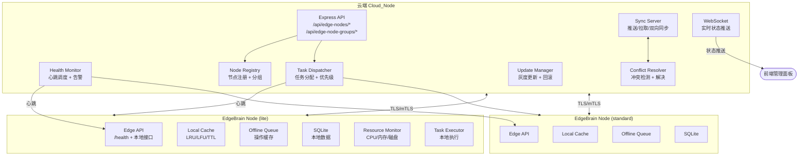

# 设计文档：EdgeBrain 边缘部署

## 概述

EdgeBrain 是 Cube Brain 的轻量级边缘部署方案，允许在本地/边缘环境运行 Agent，处理敏感数据和离线场景。系统采用 Hub-Spoke 架构，云端（Cloud_Node）作为中心节点，多个 EdgeBrain_Node 作为边缘节点。核心设计目标：

1. **离线优先**：边缘节点在网络不可用时仍能独立执行任务
2. **双向同步**：支持云端和边缘的双向数据同步，带冲突解决
3. **资源受限友好**：最小化资源占用，智能缓存策略
4. **数据安全**：敏感数据本地处理，TLS/mTLS 通信加密
5. **多租户隔离**：边缘节点支持多租户数据和执行隔离

## 架构

### 整体架构



### 分层架构

```
┌─────────────────────────────────────────────────────┐
│                    前端层                             │
│  EdgeNodePanel · NodeGroupPanel · SyncStatusPanel    │
│  ResourceChart · HealthDashboard                     │
├─────────────────────────────────────────────────────┤
│                  云端 API 层                          │
│  /api/edge-nodes · /api/edge-node-groups             │
│  /api/edge-sync · /api/edge-updates                  │
├─────────────────────────────────────────────────────┤
│                  云端服务层                            │
│  NodeRegistryService · SyncEngineService             │
│  HealthCheckService · TaskDispatchService             │
│  ConflictResolverService · UpdateManagerService       │
│  NodeGroupService                                     │
├─────────────────────────────────────────────────────┤
│                  边缘节点层                            │
│  EdgeBrainService · LocalCacheService                │
│  OfflineQueueService · ResourceMonitorService         │
│  TenantIsolationService · SecurityService             │
├─────────────────────────────────────────────────────┤
│                  边缘存储层                            │
│  SQLite (per-tenant) · 文件缓存 · 审计日志            │
└─────────────────────────────────────────────────────┘
```

## 组件和接口

### 1. NodeRegistryService（节点注册服务）

负责边缘节点的注册、认证和生命周期管理。

```typescript
interface NodeRegistryService {
  registerEdgeNode(params: RegisterNodeParams): Promise<RegisterNodeResult>;
  unregisterEdgeNode(nodeId: string): Promise<void>;
  getEdgeNode(nodeId: string): Promise<EdgeNodeInfo | null>;
  listEdgeNodes(filter?: NodeFilter): Promise<EdgeNodeInfo[]>;
  updateNodeStatus(nodeId: string, status: NodeStatus): Promise<void>;
}

interface RegisterNodeParams {
  name: string;
  location: string;
  tier: "lite" | "standard" | "premium";
  connectivity: "always-online" | "intermittent" | "offline-first";
}

interface RegisterNodeResult {
  nodeId: string; // UUID
  authToken: string; // JWT
  initialConfig: EdgeNodeConfig;
}
```

### 2. SyncEngineService（同步引擎服务）

负责云端与边缘节点之间的数据同步。

```typescript
interface SyncEngineService {
  syncToEdge(
    nodeId: string,
    dataTypes: DataType[],
    filter?: SyncFilter
  ): Promise<SyncResult>;
  syncToCloud(
    nodeId: string,
    executionResults: ExecutionResult[]
  ): Promise<SyncResult>;
  syncBidirectional(nodeId: string): Promise<BidirectionalSyncResult>;
  getSyncLog(nodeId: string, limit?: number): Promise<SyncLogEntry[]>;
}

interface SyncFilter {
  agentIds?: string[];
  workflowIds?: string[];
  knowledgeBaseIds?: string[];
  sinceVersion?: number;
}

interface SyncResult {
  success: boolean;
  itemsSynced: number;
  bytesTransferred: number;
  checksum: string;
  timestamp: string;
  errors?: SyncError[];
}

type DataType = "agents" | "knowledgeBases" | "workflows" | "executionResults";
```

### 3. ConflictResolverService（冲突解决服务）

负责双向同步中的冲突检测和解决。

```typescript
interface ConflictResolverService {
  detectConflicts(
    localData: VersionedData[],
    remoteData: VersionedData[]
  ): ConflictRecord[];
  resolveConflict(
    conflict: ConflictRecord,
    strategy: ConflictStrategy
  ): ResolvedData;
  resolveManually(
    conflictId: string,
    chosenVersion: "cloud" | "edge"
  ): Promise<ResolvedData>;
  getConflictLog(nodeId: string): Promise<ConflictRecord[]>;
}

interface VersionedData {
  id: string;
  type: DataType;
  version: number;
  lastModifiedTime: string;
  checksum: string;
  data: unknown;
}

interface ConflictRecord {
  conflictId: string;
  dataId: string;
  dataType: DataType;
  cloudVersion: number;
  edgeVersion: number;
  cloudData: unknown;
  edgeData: unknown;
  strategy: ConflictStrategy;
  resolution?: "cloud-wins" | "edge-wins" | "merged" | "pending";
  resolvedAt?: string;
}

type ConflictStrategy = "cloud-wins" | "edge-wins" | "manual" | "merge";
```

### 4. OfflineQueueService（离线队列服务）

负责离线模式下的操作缓存和恢复。

```typescript
interface OfflineQueueService {
  enqueue(operation: PendingOperation): Promise<string>;
  dequeue(count?: number): Promise<PendingOperation[]>;
  markCompleted(operationId: string): Promise<void>;
  markFailed(operationId: string, error: string): Promise<void>;
  retry(operationId: string): Promise<void>;
  getQueueStats(): Promise<QueueStats>;
}

interface PendingOperation {
  operationId: string;
  type: "sync_result" | "sync_config" | "update_status";
  payload: unknown;
  timestamp: string;
  retryCount: number;
  maxRetries: number;
  priority: number;
}

interface QueueStats {
  pending: number;
  failed: number;
  totalSize: number;
}
```

### 5. LocalCacheService（本地缓存服务）

负责边缘节点的智能缓存管理。

```typescript
interface LocalCacheService {
  get<T>(key: string): Promise<CacheEntry<T> | null>;
  set<T>(key: string, value: T, options?: CacheOptions): Promise<void>;
  invalidate(key: string): Promise<void>;
  invalidateByPattern(pattern: string): Promise<number>;
  warmup(): Promise<WarmupResult>;
  getStats(): Promise<CacheStats>;
  evict(strategy?: EvictionStrategy): Promise<number>;
}

interface CacheEntry<T> {
  key: string;
  value: T;
  size: number;
  accessCount: number;
  lastAccessed: string;
  createdAt: string;
  ttl?: number;
}

interface CacheStats {
  hitRate: number;
  totalSize: number;
  entryCount: number;
  lastUpdated: string;
}

type EvictionStrategy = "lru" | "lfu" | "ttl";
```

### 6. ResourceMonitorService（资源监控服务）

负责边缘节点的资源监控和管理。

```typescript
interface ResourceMonitorService {
  getResourceUsage(): Promise<ResourceUsage>;
  checkQuota(resource: "agents" | "workflows"): Promise<QuotaCheck>;
  setThreshold(resource: string, threshold: number): void;
  onThresholdExceeded(callback: (alert: ResourceAlert) => void): void;
}

interface ResourceUsage {
  cpu: { percent: number; cores: number };
  memory: { used: number; total: number; percent: number };
  disk: { used: number; total: number; percent: number };
  timestamp: string;
}

interface ResourceAlert {
  resource: "cpu" | "memory" | "disk";
  currentValue: number;
  threshold: number;
  timestamp: string;
  severity: "warning" | "critical";
}
```

### 7. HealthCheckService（健康检查服务）

负责边缘节点的健康监控。

```typescript
interface HealthCheckService {
  sendHeartbeat(nodeId: string): Promise<HeartbeatResponse>;
  getHealthStatus(nodeId: string): Promise<HealthStatus>;
  startHeartbeatScheduler(intervalMs?: number): void;
  stopHeartbeatScheduler(): void;
}

interface HeartbeatResponse {
  nodeId: string;
  status: "online" | "offline" | "error";
  uptime: number;
  resourceUsage: ResourceUsage;
  syncStatus: { lastSyncTime: string; pendingItems: number };
}

interface HealthStatus {
  nodeId: string;
  status: "online" | "offline" | "error";
  lastHeartbeat: string;
  consecutiveFailures: number;
  details: HeartbeatResponse | null;
}
```

### 8. TaskDispatchService（任务分配服务）

负责将工作流任务分配到合适的边缘节点。

```typescript
interface TaskDispatchService {
  dispatchTask(task: EdgeTask): Promise<DispatchResult>;
  selectNode(selector: EdgeNodeSelector): Promise<string | null>;
  getNodeLoad(nodeId: string): Promise<NodeLoad>;
}

interface EdgeTask {
  taskId: string;
  workflowId: string;
  priority: number; // 1-10, 10 最高
  edgeNodeSelector: EdgeNodeSelector;
  dataClassification?: "normal" | "sensitive";
  requiredAgents: string[];
  requiredKnowledgeBases?: string[];
}

interface EdgeNodeSelector {
  nodeIds?: string[]; // 指定节点
  tier?: ("lite" | "standard" | "premium")[];
  location?: string; // 位置匹配
  groupId?: string; // 节点组匹配
  minCapacity?: { agents: number; storageGB: number };
}

interface DispatchResult {
  success: boolean;
  nodeId?: string;
  reason?: string;
}
```

### 9. NodeGroupService（节点组管理服务）

```typescript
interface NodeGroupService {
  createGroup(params: CreateGroupParams): Promise<NodeGroup>;
  updateGroup(groupId: string, updates: Partial<NodeGroup>): Promise<NodeGroup>;
  deleteGroup(groupId: string): Promise<void>;
  listGroups(): Promise<NodeGroup[]>;
  addNodeToGroup(groupId: string, nodeId: string): Promise<void>;
  removeNodeFromGroup(groupId: string, nodeId: string): Promise<void>;
  batchOperation(
    groupId: string,
    operation: BatchOperation
  ): Promise<BatchResult>;
}

interface NodeGroup {
  groupId: string;
  name: string;
  parentGroupId?: string;
  syncStrategy?: SyncStrategy;
  resourceQuota?: ResourceQuota;
  nodeIds: string[];
}

interface SyncStrategy {
  mode: "push" | "pull" | "bidirectional";
  frequency: "real-time" | "hourly" | "daily" | "manual";
  conflictResolution: ConflictStrategy;
  bandwidth?: number;
  dataFilter?: SyncFilter;
}
```

### 10. TenantIsolationService（多租户隔离服务）

```typescript
interface TenantIsolationService {
  createTenantSpace(tenantId: string): Promise<void>;
  deleteTenantSpace(tenantId: string): Promise<void>;
  getTenantDb(tenantId: string): Promise<TenantDatabase>;
  listTenants(): Promise<string[]>;
  setTenantSyncStrategy(
    tenantId: string,
    strategy: SyncStrategy
  ): Promise<void>;
}
```

### 11. UpdateManagerService（更新管理服务）

```typescript
interface UpdateManagerService {
  pushUpdate(
    nodeId: string,
    updatePackage: UpdatePackage
  ): Promise<UpdateResult>;
  canaryUpdate(
    nodeIds: string[],
    updatePackage: UpdatePackage
  ): Promise<CanaryResult>;
  rollback(nodeId: string): Promise<void>;
  getUpdateHistory(nodeId: string): Promise<UpdateLogEntry[]>;
}

interface UpdatePackage {
  version: string;
  changelog: string[];
  rollbackInfo: { previousVersion: string; rollbackSteps: string[] };
  payload: Buffer;
}

interface UpdateResult {
  success: boolean;
  nodeId: string;
  fromVersion: string;
  toVersion: string;
  timestamp: string;
  error?: string;
}
```

## REST API 设计

### 边缘节点管理

| 方法   | 路径                          | 说明                 |
| ------ | ----------------------------- | -------------------- |
| POST   | /api/edge-nodes               | 注册新边缘节点       |
| GET    | /api/edge-nodes               | 获取边缘节点列表     |
| GET    | /api/edge-nodes/:id           | 获取边缘节点详情     |
| DELETE | /api/edge-nodes/:id           | 注销边缘节点         |
| GET    | /api/edge-nodes/:id/resources | 获取节点资源使用情况 |
| GET    | /api/edge-nodes/:id/health    | 获取节点健康状态     |
| POST   | /api/edge-nodes/:id/update    | 推送更新到节点       |

### 同步管理

| 方法 | 路径                                 | 说明           |
| ---- | ------------------------------------ | -------------- |
| POST | /api/edge-sync/to-edge               | 云端到边缘同步 |
| POST | /api/edge-sync/to-cloud              | 边缘到云端同步 |
| POST | /api/edge-sync/bidirectional         | 双向同步       |
| GET  | /api/edge-sync/:nodeId/log           | 获取同步日志   |
| GET  | /api/edge-sync/:nodeId/conflicts     | 获取冲突列表   |
| POST | /api/edge-sync/conflicts/:id/resolve | 手动解决冲突   |

### 节点组管理

| 方法   | 路径                            | 说明           |
| ------ | ------------------------------- | -------------- |
| POST   | /api/edge-node-groups           | 创建节点组     |
| GET    | /api/edge-node-groups           | 获取节点组列表 |
| PUT    | /api/edge-node-groups/:id       | 更新节点组     |
| DELETE | /api/edge-node-groups/:id       | 删除节点组     |
| POST   | /api/edge-node-groups/:id/batch | 批量操作       |

### 任务分配

| 方法 | 路径                     | 说明               |
| ---- | ------------------------ | ------------------ |
| POST | /api/edge-tasks/dispatch | 分配任务到边缘节点 |
| GET  | /api/edge-tasks/:nodeId  | 获取节点任务列表   |

### 边缘节点本地 API

| 方法 | 路径             | 说明         |
| ---- | ---------------- | ------------ |
| GET  | /health          | 健康检查端点 |
| POST | /api/heartbeat   | 心跳响应     |
| GET  | /api/cache/stats | 缓存统计     |
| GET  | /api/metrics     | 性能指标     |

## 数据模型

### EdgeNode（边缘节点）

```typescript
interface EdgeNode {
  nodeId: string; // UUID
  name: string;
  location: string;
  tier: "lite" | "standard" | "premium";
  status: "online" | "offline" | "syncing" | "error";
  connectivity: "always-online" | "intermittent" | "offline-first";
  capacity: {
    maxAgents: number; // lite:10, standard:50, premium:Infinity
    maxStorageGB: number; // lite:5, standard:20, premium:Infinity
    maxConcurrentWorkflows: number;
  };
  authToken: string; // JWT
  version: string; // EdgeBrain 版本
  groupIds: string[]; // 所属节点组
  tenantIds: string[]; // 关联租户
  lastHeartbeat: string | null;
  consecutiveHeartbeatFailures: number;
  createdAt: string;
  updatedAt: string;
}
```

### SyncLogEntry（同步日志）

```typescript
interface SyncLogEntry {
  logId: string;
  nodeId: string;
  direction: "to-edge" | "to-cloud" | "bidirectional";
  dataTypes: DataType[];
  itemsSynced: number;
  bytesTransferred: number;
  checksum: string;
  status: "success" | "partial" | "failed";
  errors?: SyncError[];
  startedAt: string;
  completedAt: string;
}
```

### VersionedData（版本化数据）

```typescript
interface VersionedData {
  id: string;
  type: DataType;
  version: number; // 递增整数
  lastModifiedTime: string; // ISO 8601
  lastModifiedBy: "cloud" | "edge";
  checksum: string; // SHA-256
  data: unknown;
  isSensitive: boolean;
}
```

### ExecutionResult（执行结果）

```typescript
interface ExecutionResult {
  executionId: string;
  workflowId: string;
  nodeId: string;
  status: "success" | "failed" | "partial";
  output: unknown;
  metrics: {
    startTime: string;
    endTime: string;
    durationMs: number;
    tokensUsed?: number;
  };
  timestamp: string;
  isSensitive: boolean; // 敏感数据只同步摘要
  summary?: string; // 敏感数据的摘要
}
```

### NodeGroup（节点组）

```typescript
interface NodeGroup {
  groupId: string;
  name: string;
  description?: string;
  parentGroupId?: string; // 层级结构
  syncStrategy?: SyncStrategy;
  resourceQuota?: ResourceQuota;
  nodeIds: string[];
  createdAt: string;
  updatedAt: string;
}

interface ResourceQuota {
  maxAgents: number;
  maxStorageGB: number;
  maxConcurrentWorkflows: number;
}
```

### ConflictRecord（冲突记录）

```typescript
interface ConflictRecord {
  conflictId: string;
  nodeId: string;
  dataId: string;
  dataType: DataType;
  cloudVersion: number;
  cloudData: unknown;
  cloudModifiedTime: string;
  edgeVersion: number;
  edgeData: unknown;
  edgeModifiedTime: string;
  strategy: ConflictStrategy;
  resolution: "cloud-wins" | "edge-wins" | "merged" | "pending";
  resolvedAt?: string;
  resolvedBy?: "auto" | "manual";
}
```

### PendingOperation（待同步操作）

```typescript
interface PendingOperation {
  operationId: string;
  type: "sync_result" | "sync_config" | "update_status";
  payload: unknown;
  timestamp: string;
  retryCount: number;
  maxRetries: number;
  priority: number;
  status: "pending" | "in_progress" | "failed";
  lastError?: string;
}
```

## 正确性属性

_正确性属性是系统在所有有效执行中都应保持为真的特征或行为——本质上是关于系统应该做什么的形式化陈述。属性作为人类可读规范和机器可验证正确性保证之间的桥梁。_

### Property 1: 节点注册产生有效唯一标识和正确容量

_For any_ 有效的注册参数（name、location、tier、connectivity），注册操作应返回一个有效的 UUID 格式 nodeId 和 JWT 格式 authToken，且 nodeId 在所有注册中唯一。同时，返回的容量配置应与 tier 对应：lite → (10 Agent, 5GB)，standard → (50 Agent, 20GB)，premium → (无限制)。

**Validates: Requirements 1.1, 1.2, 1.4**

### Property 2: 选择性同步过滤正确性

_For any_ 数据集合和同步过滤条件（dataTypes + filter），syncToEdge 操作应只将匹配过滤条件的数据同步到边缘节点，不匹配的数据不应出现在边缘节点上。

**Validates: Requirements 2.2**

### Property 3: 同步数据完整性校验

_For any_ 同步操作传输的数据，接收端计算的 checksum 应与发送端的 checksum 完全一致。即 checksum(received_data) == checksum(source_data)。

**Validates: Requirements 2.3**

### Property 4: 增量同步只传输变更数据

_For any_ 已同步过的数据集合，当部分数据发生变更后执行增量同步，传输的数据项数量应等于变更的数据项数量，未变更的数据不应被重新传输。

**Validates: Requirements 2.4**

### Property 5: 操作日志完整性

_For any_ 同步操作、冲突解决、资源告警、健康检查或更新操作，系统应创建对应的日志条目，包含操作时间、状态和相关元数据。日志条目数量应等于操作执行次数。

**Validates: Requirements 2.5, 3.5, 4.4, 7.5, 8.5, 11.5**

### Property 6: 执行结果数据完整性

_For any_ 执行结果对象，该对象应包含 workflowId、executionId、status、output、metrics 和 timestamp 六个必填字段，缺少任何字段的执行结果应被拒绝。

**Validates: Requirements 3.2**

### Property 7: 批量同步传输所有项目

_For any_ 包含 N 条执行结果的批量同步请求，同步完成后云端应收到全部 N 条结果，且每条结果的内容与源数据一致。

**Validates: Requirements 3.3**

### Property 8: 网络故障时离线队列缓存

_For any_ 在网络不可用时产生的执行结果或同步操作，该操作应被存储在 Offline_Queue 中，队列中的操作数量应等于离线期间产生的操作数量。

**Validates: Requirements 3.4, 5.2**

### Property 9: 双向同步变更传播

_For any_ 在 bidirectional 模式下，云端修改的数据应出现在边缘节点，边缘节点修改的数据应出现在云端。同步完成后，双方的数据应最终一致。

**Validates: Requirements 4.1**

### Property 10: 数据版本追踪

_For any_ 数据记录，每次修改后 version 应递增 1，lastModifiedTime 应更新为修改时间。version 应为严格递增的正整数序列。

**Validates: Requirements 4.2**

### Property 11: 冲突解决策略一致性

_For any_ 数据冲突和配置的解决策略：当策略为 cloud-wins 时，解决结果应为云端版本；当策略为 edge-wins 时，解决结果应为边缘版本；当策略为 manual 时，冲突应标记为 pending 等待人工处理。

**Validates: Requirements 4.3**

### Property 12: 网络状态检测和模式切换

_For any_ 网络状态变化（online → offline 或 offline → online），EdgeBrain_Node 应在检测到变化后切换到对应的工作模式（在线模式或离线模式）。

**Validates: Requirements 5.1**

### Property 13: 离线队列按时间顺序排空

_For any_ 离线队列中的操作集合，当网络恢复后，操作应按照入队时间从早到晚的顺序同步到云端。

**Validates: Requirements 5.3**

### Property 14: 离线优先模式使用本地缓存

_For any_ 设置为 offline-first 连接模式的边缘节点，数据请求应优先从 Local_Cache 获取，只有缓存未命中时才尝试从云端获取。

**Validates: Requirements 5.4**

### Property 15: 缓存淘汰策略正确性

_For any_ 缓存已满时的新数据插入：LRU 策略应淘汰最近最少访问的条目；LFU 策略应淘汰访问频率最低的条目；TTL 策略应淘汰已过期的条目。

**Validates: Requirements 6.1**

### Property 16: 缓存优先级基于频率和大小

_For any_ 两个缓存条目 A 和 B，如果 A 的访问频率高于 B 且 A 的大小小于等于 B，则在缓存淘汰时 A 的优先级应高于 B（A 应被保留）。

**Validates: Requirements 6.2**

### Property 17: 云端更新触发缓存失效

_For any_ 云端数据更新事件，对应的本地缓存条目应被标记为失效。失效后的下次访问应从云端重新获取数据。

**Validates: Requirements 6.4**

### Property 18: 缓存统计准确性

_For any_ 缓存操作序列（get/set/invalidate），缓存统计接口返回的命中率应等于 (命中次数 / 总访问次数)，缓存大小应等于所有有效条目的大小之和。

**Validates: Requirements 6.5**

### Property 19: 资源监控和阈值响应

_For any_ 资源采集结果，CPU、内存、磁盘使用率应在 [0, 100] 范围内。当任一资源超过配置的阈值时，系统应触发资源回收操作（清理缓存或降低同步频率）。

**Validates: Requirements 7.1, 7.2**

### Property 20: 资源配额强制执行

_For any_ 超过配额限制的操作（如添加超过最大数量的 Agent 或启动超过最大并发数的工作流），该操作应被拒绝并返回配额超限错误。

**Validates: Requirements 7.3**

### Property 21: 心跳失败阈值触发离线标记

_For any_ 边缘节点，当连续心跳失败次数达到或超过配置的阈值（默认 3 次），该节点的状态应被标记为 offline，且不再接收新的任务分配。

**Validates: Requirements 8.3**

### Property 22: 任务分配匹配节点选择器和容量

_For any_ 包含 edgeNodeSelector 的任务和一组边缘节点，Task_Dispatcher 应只将任务分配到同时满足选择器条件和容量要求的节点。不满足条件的节点不应被选中。

**Validates: Requirements 9.1, 9.2**

### Property 23: 任务分配遵循优先级顺序

_For any_ 一组待分配的任务，优先级高的任务应先于优先级低的任务被分配。即分配顺序应与优先级降序一致。

**Validates: Requirements 9.3**

### Property 24: 敏感数据不离开边缘节点

_For any_ 标记为 sensitive: true 的数据，该数据的原始内容不应出现在任何云端同步的 payload 中。同步到云端的只能是执行结果的摘要信息。

**Validates: Requirements 10.2, 10.3**

### Property 25: 敏感数据加密存储

_For any_ 标记为敏感的数据，存储在本地磁盘上的内容应经过 AES-256 加密，直接读取存储文件不应获得明文数据。

**Validates: Requirements 10.4**

### Property 26: 更新验证和失败回滚

_For any_ 更新包，该包应包含 version、changelog 和 rollbackInfo 字段。当更新过程中发生错误时，边缘节点应自动回滚到更新前的版本，回滚后节点版本应等于更新前版本。

**Validates: Requirements 11.2, 11.4**

### Property 27: 灰度更新只影响目标子集

_For any_ 灰度更新操作和指定的测试节点子集，只有子集中的节点应收到更新，子集外的节点版本应保持不变。

**Validates: Requirements 11.3**

### Property 28: 节点组操作传播和继承

_For any_ 节点组配置变更（同步策略、资源配额），组内所有节点应反映新配置。对于层级结构，子组应继承父组配置，除非子组有自己的覆盖配置。批量操作应应用到组内所有节点。

**Validates: Requirements 12.2, 12.3, 12.5**

### Property 29: 数据压缩阈值

_For any_ 同步传输，当数据量超过配置的阈值（默认 1MB）时，传输的数据应经过 gzip 压缩，压缩后的大小应小于原始大小。

**Validates: Requirements 13.3**

### Property 30: RBAC 访问控制

_For any_ 用户和操作组合，只有拥有对应角色权限的用户才能执行该操作。无权限的用户执行操作应返回 403 错误。

**Validates: Requirements 14.4**

### Property 31: 租户生命周期隔离

_For any_ 两个不同的租户，租户 A 的数据操作不应影响租户 B 的数据。每个租户应有独立的同步策略。当租户被删除时，该租户的所有本地数据（数据库、缓存、日志）应被完全清除，清除后不应有任何残留数据。

**Validates: Requirements 15.1, 15.3, 15.4, 15.5**

### Property 32: WebSocket 状态实时推送

_For any_ 边缘节点状态变化事件（online → offline、offline → online、syncing 等），Cloud_Node 应通过 WebSocket 向已连接的前端客户端推送状态更新消息。

**Validates: Requirements 16.5**

## 错误处理

### 网络错误

| 场景             | 处理策略                                                  |
| ---------------- | --------------------------------------------------------- |
| 同步请求超时     | 重试 3 次，间隔指数退避（1s, 2s, 4s），仍失败则入离线队列 |
| 心跳请求超时     | 记录失败次数，达到阈值标记节点 offline                    |
| WebSocket 断开   | 自动重连，指数退避，最大间隔 30s                          |
| 批量同步部分失败 | 成功的项标记完成，失败的项入重试队列                      |

### 数据错误

| 场景            | 处理策略                             |
| --------------- | ------------------------------------ |
| Checksum 不匹配 | 拒绝数据，记录错误日志，触发重新同步 |
| 数据格式无效    | 返回 400 错误，记录详细错误信息      |
| 版本冲突        | 按配置的冲突解决策略处理             |
| 加密/解密失败   | 记录错误日志，拒绝操作，通知管理员   |

### 资源错误

| 场景          | 处理策略                             |
| ------------- | ------------------------------------ |
| 磁盘空间不足  | 触发紧急缓存清理，暂停同步，发送告警 |
| 内存不足      | 降低并发工作流数，清理非活跃缓存     |
| 配额超限      | 拒绝新操作，返回 429 错误            |
| SQLite 锁冲突 | 使用 WAL 模式，重试机制              |

### 更新错误

| 场景         | 处理策略                          |
| ------------ | --------------------------------- |
| 更新包损坏   | 校验失败，拒绝更新，记录日志      |
| 更新过程中断 | 自动回滚到上一版本                |
| 回滚失败     | 标记节点为 error 状态，通知管理员 |

## 测试策略

### 测试框架

- 单元测试和属性测试：Vitest（与项目现有测试框架一致）
- 属性测试库：fast-check（TypeScript 生态最成熟的属性测试库）
- 每个属性测试至少运行 100 次迭代

### 单元测试

单元测试覆盖以下场景：

- 各服务的 CRUD 操作
- API 端点的请求/响应格式验证
- 边界条件（空数据、最大容量、零值）
- 错误处理路径（网络超时、数据损坏、配额超限）
- 前端组件渲染和交互

### 属性测试

每个正确性属性对应一个属性测试，使用 fast-check 生成随机输入：

- **Feature: edge-brain-deployment, Property 1**: 节点注册产生有效唯一标识和正确容量
- **Feature: edge-brain-deployment, Property 2**: 选择性同步过滤正确性
- **Feature: edge-brain-deployment, Property 3**: 同步数据完整性校验
- **Feature: edge-brain-deployment, Property 4**: 增量同步只传输变更数据
- **Feature: edge-brain-deployment, Property 5**: 操作日志完整性
- **Feature: edge-brain-deployment, Property 6**: 执行结果数据完整性
- **Feature: edge-brain-deployment, Property 7**: 批量同步传输所有项目
- **Feature: edge-brain-deployment, Property 8**: 网络故障时离线队列缓存
- **Feature: edge-brain-deployment, Property 9**: 双向同步变更传播
- **Feature: edge-brain-deployment, Property 10**: 数据版本追踪
- **Feature: edge-brain-deployment, Property 11**: 冲突解决策略一致性
- **Feature: edge-brain-deployment, Property 12**: 网络状态检测和模式切换
- **Feature: edge-brain-deployment, Property 13**: 离线队列按时间顺序排空
- **Feature: edge-brain-deployment, Property 14**: 离线优先模式使用本地缓存
- **Feature: edge-brain-deployment, Property 15**: 缓存淘汰策略正确性
- **Feature: edge-brain-deployment, Property 16**: 缓存优先级基于频率和大小
- **Feature: edge-brain-deployment, Property 17**: 云端更新触发缓存失效
- **Feature: edge-brain-deployment, Property 18**: 缓存统计准确性
- **Feature: edge-brain-deployment, Property 19**: 资源监控和阈值响应
- **Feature: edge-brain-deployment, Property 20**: 资源配额强制执行
- **Feature: edge-brain-deployment, Property 21**: 心跳失败阈值触发离线标记
- **Feature: edge-brain-deployment, Property 22**: 任务分配匹配节点选择器和容量
- **Feature: edge-brain-deployment, Property 23**: 任务分配遵循优先级顺序
- **Feature: edge-brain-deployment, Property 24**: 敏感数据不离开边缘节点
- **Feature: edge-brain-deployment, Property 25**: 敏感数据加密存储
- **Feature: edge-brain-deployment, Property 26**: 更新验证和失败回滚
- **Feature: edge-brain-deployment, Property 27**: 灰度更新只影响目标子集
- **Feature: edge-brain-deployment, Property 28**: 节点组操作传播和继承
- **Feature: edge-brain-deployment, Property 29**: 数据压缩阈值
- **Feature: edge-brain-deployment, Property 30**: RBAC 访问控制
- **Feature: edge-brain-deployment, Property 31**: 租户生命周期隔离
- **Feature: edge-brain-deployment, Property 32**: WebSocket 状态实时推送

### 测试文件组织

```
server/tests/edge-brain/
├── node-registry.test.ts          # 节点注册服务测试
├── sync-engine.test.ts            # 同步引擎测试
├── conflict-resolver.test.ts      # 冲突解决测试
├── offline-queue.test.ts          # 离线队列测试
├── local-cache.test.ts            # 本地缓存测试
├── resource-monitor.test.ts       # 资源监控测试
├── health-check.test.ts           # 健康检查测试
├── task-dispatch.test.ts          # 任务分配测试
├── tenant-isolation.test.ts       # 多租户隔离测试
├── security.test.ts               # 安全性测试
├── update-manager.test.ts         # 更新管理测试
└── node-group.test.ts             # 节点组管理测试

client/src/components/edge-brain/__tests__/
├── EdgeNodePanel.test.tsx         # 边缘节点面板测试
└── SyncStatusPanel.test.tsx       # 同步状态面板测试
```
