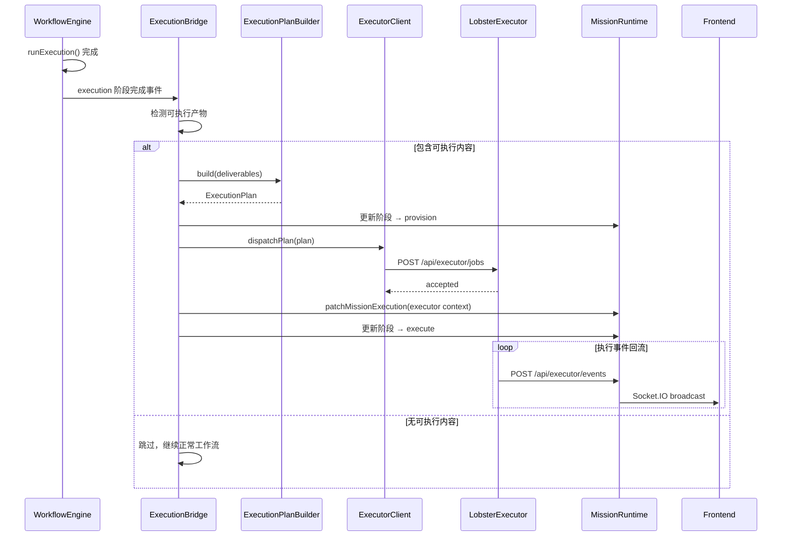

# 设计文档：executor-integration

## 概述

本设计将 WorkflowEngine 的 execution 阶段与 lobster-executor Docker 执行管线连接起来。核心新增组件为 `ExecutionBridge`，它在 WorkflowEngine execution 阶段完成后介入，检测可执行产物、构建 ExecutionPlan、通过 ExecutorClient 分发到 lobster-executor，并依赖现有的 `/api/executor/events` 回调机制将执行结果回流到 MissionRuntime。

### 设计决策

1. **桥接点选择**：在 `runExecution` 完成后、`runReview` 之前插入桥接逻辑，而非修改 `runExecution` 本身。这保持了 WorkflowEngine 十阶段管线的纯净性。
2. **复用现有回调机制**：不新建事件通道，完全复用 `/api/executor/events` 端点和现有的 MissionRuntime 事件处理逻辑（已在 smoke dispatch 中验证）。
3. **ExecutionBridge 作为独立模块**：不将桥接逻辑嵌入 WorkflowEngine 类，而是作为独立的 `ExecutionBridge` 类，通过 WorkflowEngine 事件系统触发。

## 架构



## 组件与接口

### ExecutionBridge

新增文件：`server/core/execution-bridge.ts`

````typescript
interface ExecutionBridgeOptions {
  missionRuntime: MissionRuntime;
  executorBaseUrl: string;
  callbackUrl: string;
  executionMode: "mock" | "real";
  defaultImage: string;
  retryCount: number; // 默认 1
}

interface BridgeResult {
  triggered: boolean;
  reason: string;
  jobId?: string;
  requestId?: string;
}

class ExecutionBridge {
  constructor(options: ExecutionBridgeOptions);

  /**
   * 检测交付物是否包含可执行内容。
   * 检查代码块标记（```）、脚本关键字、以及 metadata 强制标志。
   */
  detectExecutable(
    deliverables: string[],
    metadata?: Record<string, unknown>
  ): { executable: boolean; reason: string };

  /**
   * 完整桥接流程：检测 → 构建计划 → 分发 → 更新 Mission 状态。
   */
  async bridge(
    missionId: string,
    deliverables: string[],
    metadata?: Record<string, unknown>
  ): Promise<BridgeResult>;
}
````

### 产物检测策略

`detectExecutable` 使用以下规则判断交付物是否需要 Docker 执行：

1. **强制标志优先**：`metadata.requiresExecution === true` 强制触发，`=== false` 强制跳过
2. **代码块检测**：交付物中包含 ` ```python`、` ```javascript`、` ```typescript`、` ```bash`、` ```sh` 等可执行语言的代码块
3. **脚本关键字检测**：包含 `#!/bin`、`npm run`、`node `、`python `、`pytest`、`playwright` 等执行相关关键字
4. **置信度阈值**：匹配 2 个以上模式时判定为可执行

### WorkflowEngine 集成点

修改文件：`server/core/workflow-engine.ts` 的 `runPipeline` 方法

在 `runExecution` 完成后、`runReview` 之前插入桥接调用：

```typescript
// 在 runPipeline 中
await this.runExecution(workflowId, organization);
await this.emitStageCompleted(workflowId, "execution");

// ── 新增：ExecutionBridge 桥接 ──
await this.bridgeToExecutor(workflowId);

await this.runReview(workflowId, organization);
```

新增私有方法 `bridgeToExecutor`：

- 收集当前 workflow 所有 task 的 deliverable
- 调用 `ExecutionBridge.bridge()`
- 如果触发了 Docker 执行，等待执行完成或超时

### Mock/Real 模式处理

ExecutionBridge 根据 `executionMode` 配置注入不同的 Job payload：

```typescript
// Mock 模式
payload.runner = {
  kind: "mock",
  outcome: "success",
  steps: 3,
  delayMs: 40,
  summary: "Mock execution completed",
};

// Real 模式
payload.image = this.options.defaultImage;
payload.command = extractCommandFromDeliverable(deliverable);
payload.env = { MISSION_ID: missionId };
```

### 前端组件

修改文件：Mission 详情视图组件

新增 `ExecutorStatusPanel` 子组件：

```typescript
interface ExecutorStatusPanelProps {
  executor?: MissionExecutorContext;
  instance?: MissionInstanceContext;
  artifacts?: MissionArtifact[];
}
```

显示内容：

- 执行器名称和 Job ID
- 当前状态（queued/running/completed/failed）及对应颜色标识
- 最后事件时间
- 进度条（running 状态时）
- 产物列表（名称、类型、描述）

## 数据模型

### 现有数据模型复用

本设计完全复用现有数据模型，不新增数据结构：

- **MissionRecord.executor**: `MissionExecutorContext` — 已有，存储执行器上下文
- **MissionRecord.instance**: `MissionInstanceContext` — 已有，存储容器实例信息
- **MissionRecord.artifacts**: `MissionArtifact[]` — 已有，存储执行产物
- **MissionRecord.securitySummary** — 已有，存储安全沙箱摘要
- **ExecutionPlan** — 已有，由 ExecutionPlanBuilder 构建
- **ExecutorJobRequest** — 已有，由 ExecutorClient 构建
- **ExecutorEvent** — 已有，由 lobster-executor 回调发送

### ExecutionBridge 内部状态

```typescript
interface BridgeState {
  missionId: string;
  status:
    | "idle"
    | "detecting"
    | "building"
    | "dispatching"
    | "waiting"
    | "done"
    | "failed";
  jobId?: string;
  startedAt?: number;
  completedAt?: number;
  error?: string;
}
```

此状态仅在桥接过程中存在于内存，不持久化。Mission 的持久化状态通过 MissionRuntime 管理。

## 正确性属性

_属性（Property）是一种在系统所有合法执行路径上都应成立的特征或行为——本质上是对系统应做什么的形式化陈述。属性是人类可读规格说明与机器可验证正确性保证之间的桥梁。_

### Property 1: 可执行内容检测

_For any_ 包含可执行语言代码块（如 ` ```python`、` ```bash`、` ```javascript` 等）的交付物字符串，`detectExecutable` 应返回 `{ executable: true }`。

**Validates: Requirements 1.1**

### Property 2: 非可执行内容跳过

_For any_ 不包含任何可执行语言代码块且不包含脚本关键字的纯文本字符串，`detectExecutable` 应返回 `{ executable: false }`。

**Validates: Requirements 1.2**

### Property 3: Metadata 强制覆盖

_For any_ 交付物内容，当 `metadata.requiresExecution` 为布尔值时，`detectExecutable` 的返回值应等于该布尔值，无论交付物内容是否包含可执行模式。

**Validates: Requirements 1.3, 1.4**

### Property 4: ExecutionPlan 构建不变量

_For any_ 有效的可执行交付物和 missionId，通过 ExecutionPlanBuilder 构建的 ExecutionPlan 应满足：`plan.missionId === 输入的 missionId`、`plan.sourceText` 包含交付物内容、`plan.objective` 非空、且 `plan.mode` 等于指定的 mode（未指定时默认为 "auto"）。

**Validates: Requirements 2.1, 2.2, 2.4**

### Property 5: 分发后 executor 上下文一致性

_For any_ 成功分发的 ExecutionPlan，分发完成后 MissionRecord 的 `executor` 字段应包含：`name` 非空、`jobId` 与分发响应的 jobId 一致、`requestId` 与分发请求的 requestId 一致、`status` 为 "queued"。

**Validates: Requirements 3.2**

### Property 6: Callback URL 构建正确性

_For any_ 服务器 base URL，ExecutionBridge 构建的 callback URL 应以 `/api/executor/events` 结尾，且为合法的 URL 格式。

**Validates: Requirements 3.5**

### Property 7: 事件到状态映射

_For any_ ExecutorEvent，当 event.type 为 `job.started` 时 Mission executor.status 应为 `running`；当 event.type 为 `job.completed` 时 Mission status 应为 `done`；当 event.type 为 `job.failed` 时 Mission status 应为 `failed`；当 event.type 为 `job.progress` 时 Mission progress 应更新为 event.progress 的值（clamp 到 0-100）。此映射对 mock 和 real 模式的事件一致适用。

**Validates: Requirements 4.1, 4.2, 4.3, 4.4, 7.4**

### Property 8: 模式特定 payload 注入

_For any_ 交付物内容，当 executionMode 为 "mock" 时，构建的 Job payload 应包含 `runner.kind === "mock"`；当 executionMode 为 "real" 时，payload 应包含 `image` 字符串字段和 `command` 数组字段。

**Validates: Requirements 7.1, 7.2**

### Property 9: 异常安全性

_For any_ 在 `bridge()` 执行过程中抛出的异常，Mission 最终状态应为 `failed`，且 Mission events 中应包含错误信息。

**Validates: Requirements 6.4**

## 错误处理

### 分层错误处理策略

| 错误场景                  | 处理方式                                 | Mission 最终状态 |
| ------------------------- | ---------------------------------------- | ---------------- |
| 产物检测异常              | 捕获异常，记录日志，跳过 Docker 执行     | 继续正常工作流   |
| ExecutionPlan 构建失败    | 记录错误，标记 Mission 失败              | failed           |
| ExecutorClient 不可达     | 重试 1 次，仍失败则标记 Mission 失败     | failed           |
| ExecutorClient 分发被拒绝 | 记录拒绝原因，标记 Mission 失败          | failed           |
| ExecutorClient 分发超时   | 记录超时详情，标记 Mission 失败          | failed           |
| 容器执行超时              | 由 lobster-executor 发送 job.failed 事件 | failed           |
| 心跳超时（30 秒无事件）   | HeartbeatMonitor 检测并标记 Mission 失败 | failed           |
| 未预期异常                | 顶层 try-catch 捕获，记录完整错误栈      | failed           |

### 心跳超时机制

新增 `HeartbeatMonitor` 逻辑（可内嵌于 ExecutionBridge 或独立）：

- 分发成功后启动 30 秒定时器
- 每次收到 ExecutorEvent 时重置定时器
- 定时器到期时将 Mission 标记为 failed，原因为 "Executor heartbeat timeout"
- Mission 进入终态（done/failed）时清除定时器

### 重试策略

- ExecutorClient 不可达时重试 1 次，间隔 2 秒
- 不对已被拒绝的请求重试（幂等键冲突等）
- 不对构建失败重试（输入问题，重试无意义）

## 测试策略

### 双轨测试方法

本特性同时使用单元测试和属性测试：

- **单元测试**：验证具体示例、边界情况和错误条件
- **属性测试**：验证跨所有输入的通用属性

### 属性测试配置

- 使用 `fast-check` 作为属性测试库（项目已有依赖）
- 每个属性测试最少运行 100 次迭代
- 每个测试用注释标注对应的设计属性编号
- 标注格式：**Feature: executor-integration, Property {N}: {property_text}**
- 每个正确性属性对应一个独立的属性测试

### 单元测试覆盖

| 测试目标          | 测试内容                                          |
| ----------------- | ------------------------------------------------- |
| detectExecutable  | 各种代码块格式、脚本关键字、纯文本、metadata 覆盖 |
| bridge() 成功路径 | mock 模式完整桥接流程                             |
| bridge() 失败路径 | 构建失败、分发失败、超时                          |
| 心跳超时          | 30 秒无事件后 Mission 标记为 failed               |
| 事件回流          | 各类 ExecutorEvent 正确更新 Mission 状态          |
| 前端组件          | ExecutorStatusPanel 渲染正确的状态信息            |

### 属性测试覆盖

| 属性                              | 测试文件                                                        |
| --------------------------------- | --------------------------------------------------------------- |
| Property 1-3: 产物检测            | `server/core/__tests__/execution-bridge.property.test.ts`       |
| Property 4: Plan 构建不变量       | `server/core/__tests__/execution-bridge.property.test.ts`       |
| Property 5: executor 上下文一致性 | `server/core/__tests__/execution-bridge.property.test.ts`       |
| Property 6: Callback URL          | `server/core/__tests__/execution-bridge.property.test.ts`       |
| Property 7: 事件到状态映射        | `server/core/__tests__/executor-event-mapping.property.test.ts` |
| Property 8: 模式 payload          | `server/core/__tests__/execution-bridge.property.test.ts`       |
| Property 9: 异常安全性            | `server/core/__tests__/execution-bridge.property.test.ts`       |
