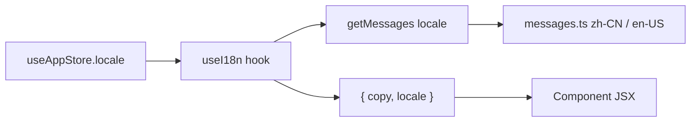

# Design Document: i18n Cleanup

## Overview

This spec migrates 14 files with hardcoded Chinese/English text to the existing i18n system. The project already has a working i18n infrastructure: `messages.ts` holds `zh-CN` and `en-US` dictionaries, `useI18n()` returns a locale-resolved `copy` object, and locale state lives in a Zustand store. The migration is purely additive — new keys are added to the message dictionaries, and components are updated to read from `copy` instead of string literals.

No new libraries, no architectural changes, no new APIs. This is a systematic find-and-replace with type safety.

## Architecture

The existing architecture remains unchanged:



Migration pattern per file:

1. Import `useI18n` from `@/i18n`
2. Destructure `const { copy } = useI18n()` (or `{ copy, locale }` if locale is needed)
3. Replace hardcoded strings with `copy.section.key` references
4. Remove any local `t(locale, zh, en)` helper functions (used in permission components)

### Migration Strategy by Pattern

Three patterns of hardcoded text exist in the codebase:

**Pattern A — Pure hardcoded strings (9 files):**
`TasksPage`, `TaskDetailView`, `CostDashboard`, `TelemetryDashboard`, `CommandInput`, `AlertPanel`, `ReputationBadge`, `ReputationRadar`, `WorkflowPanel` (partial).

These files have English-only or Chinese-only string literals in JSX. Migration: add `useI18n()`, replace literals with `copy.*`.

**Pattern B — Local `t()` helper (3 files):**
`PermissionPanel`, `PermissionMatrix`, `AuditTimeline` each define a local `function t(locale, zh, en)` and pass `locale` as a prop through the component tree.

Migration: remove the `t()` helper, replace `t(locale, '中文', 'English')` calls with `copy.*` references, remove `locale` prop drilling since `useI18n()` reads from the store directly.

**Pattern C — Hardcoded Chinese in inline styles (2 files):**
`ScreenshotPreview`, `TerminalPreview` use inline `style={{}}` with Chinese text and `aria-label` attributes.

Migration: add `useI18n()`, replace Chinese strings with `copy.*`.

## Components and Interfaces

### Message Dictionary Extensions

New top-level sections added to `messages.ts`:

| Section Key     | Covers Files                                                 |
| --------------- | ------------------------------------------------------------ |
| `tasks`         | TasksPage.tsx, TaskDetailView.tsx                            |
| `costDashboard` | CostDashboard.tsx                                            |
| `telemetry`     | TelemetryDashboard.tsx                                       |
| `permissions`   | PermissionPanel.tsx, PermissionMatrix.tsx, AuditTimeline.tsx |
| `sandbox`       | ScreenshotPreview.tsx, TerminalPreview.tsx                   |
| `nlCommand`     | CommandInput.tsx, AlertPanel.tsx                             |
| `reputation`    | ReputationBadge.tsx, ReputationRadar.tsx                     |

The existing `workflow` section in messages.ts already covers WorkflowPanel tabs and labels. Any remaining hardcoded text in WorkflowPanel that isn't already covered will be added under the existing `workflow` key or a new sub-key.

### Component Interface Changes

No public component interfaces change. The only internal change is:

- Permission components stop accepting `locale` as a prop (they read it from `useI18n()` directly)
- The local `t()` helper in permission files is deleted

### Type Safety

The `messages` object is typed with `as const`, and `MessageDictionary` is derived from it. Adding new keys to both `zh-CN` and `en-US` sections maintains type safety. If a key exists in one locale but not the other, TypeScript will flag the structural mismatch at compile time.

## Data Models

No new data models. The only data change is extending the `messages` object in `messages.ts` with new key-value pairs for both locales.

### Example Key Structure

```typescript
// messages.ts additions (zh-CN example)
tasks: {
  missionControl: 'Mission Control',
  taskUniverse: '任务宇宙',
  newMission: '新建任务',
  refresh: '刷新',
  missionQueue: '任务队列',
  searchPlaceholder: '搜索标题、阶段、备注、部门...',
  noMissionsTitle: '暂无任务',
  noMissionsDescription: '在此创建任务或由运行时分发，无需刷新即可出现在队列中。',
  selectMission: '选择一个任务',
  selectMissionDescription: '从左侧列表选择一个任务，查看详情、内部结构、时间线、产物和决策入口。',
  // ... more keys
},
```

## Correctness Properties

_A property is a characteristic or behavior that should hold true across all valid executions of a system — essentially, a formal statement about what the system should do. Properties serve as the bridge between human-readable specifications and machine-verifiable correctness guarantees._

### Property Derivation

The 14 per-component locale-switching criteria (1.1–1.5, 2.1–2.3, 3.1–3.6) and the two dictionary completeness criteria (4.1, 4.2) all reduce to a single structural invariant: the `zh-CN` and `en-US` message dictionaries must be structurally symmetric, and every leaf value must be a non-empty string (or function). If this holds, then every component reading from `copy.*` will get a valid translated string for any locale.

Property 1: Message dictionary structural symmetry
_For any_ key path in the `messages['zh-CN']` object, the same key path must exist in `messages['en-US']`, and vice versa. Furthermore, for any leaf value at any key path in either locale, the value must be a non-empty string or a function.
**Validates: Requirements 1.1, 1.2, 1.3, 1.4, 1.5, 2.1, 2.2, 2.3, 3.1, 3.2, 3.3, 3.4, 3.5, 3.6, 4.1, 4.2**

Property 2: Locale round-trip consistency
_For any_ supported locale value, calling `getMessages(locale)` must return an object structurally identical to the corresponding entry in the `messages` dictionary (no key loss, no mutation).
**Validates: Requirements 5.1, 7.1**

## Error Handling

This migration has minimal error surface:

- **Missing key at runtime**: Prevented by TypeScript's `as const` typing. If a key exists in one locale but not the other, the `MessageDictionary` union type will cause a compile error when accessing the key. No runtime fallback needed.
- **Empty string values**: The property test (Property 1) catches empty strings. At runtime, an empty string would render as blank space — visually obvious but not a crash.
- **Function-typed values**: Some message values are functions (e.g., `title: (agentName: string) => \`Chat with ${agentName}\``). The property test must account for these by checking `typeof value === 'function' || (typeof value === 'string' && value.length > 0)`.
- **Stale locale prop drilling**: After migration, permission components no longer accept `locale` as a prop. If any caller still passes it, TypeScript will flag the unused prop (if strict mode is on) or it will be silently ignored (harmless).

## Testing Strategy

### Unit Tests

Unit tests verify specific migration correctness:

1. **Existing key preservation**: Snapshot the set of existing message keys before migration. After migration, verify all original keys still exist with unchanged values.
2. **No hardcoded text in migrated files**: Static analysis test that greps migrated `.tsx` files for Chinese character ranges (`[\u4e00-\u9fff]`) outside of comments, and for common hardcoded English patterns that should have been migrated.
3. **Technical term exemption**: Verify that known technical terms ("Docker", "API", "Token", "JSON", "RAG", "SOUL.md", "IndexedDB") appear as-is in both locale dictionaries where used.

### Property-Based Tests

Property-based tests use `fast-check` (already available in the project's test ecosystem via Vitest).

- **Minimum 100 iterations** per property test.
- Each test is tagged with its design property reference.

**Property 1 test**: Generate random key paths by walking the `zh-CN` dictionary structure. For each path, assert the same path exists in `en-US` and the leaf is non-empty. Then do the reverse. This effectively tests all ~hundreds of key paths across both locales.

Tag: `Feature: i18n-cleanup, Property 1: Message dictionary structural symmetry`

**Property 2 test**: For each supported locale (`zh-CN`, `en-US`), call `getMessages(locale)` and deep-compare the result against `messages[locale]`. Assert structural identity.

Tag: `Feature: i18n-cleanup, Property 2: Locale round-trip consistency`
