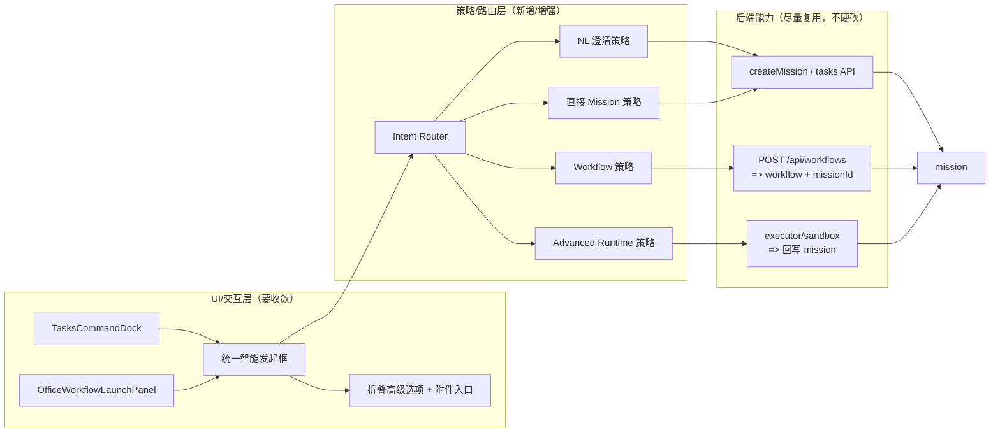
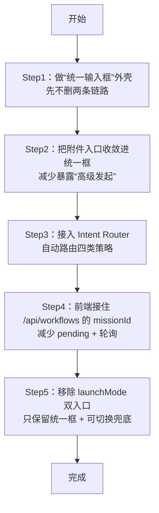

# 统一智能发起框：流程架构图（现状 vs 改造）

> 说明：下面用 **Mermaid** 画流程图。若你的文档渲染器支持 Mermaid，可直接看到图；不支持的话也能按节点文字阅读链路。

---

## 1) 现状：两个入口、两条建模链路（UI 分裂 + 策略分裂）

```mermaid
flowchart TB
  U[用户] --> O{办公室/任务工作台}

  O -->|launchMode=任务命令| A1[任务命令入口\nTasksCommandDock]
  O -->|launchMode=高级发起| B1[高级发起入口\nOfficeWorkflowLaunchPanel]

  %% 任务命令链路：NL 理解/澄清 -> mission
  subgraph L1[链路A：任务命令（NL 命令）]
    A1 --> A2[nl-command-store\n启发式判断/澄清问题]
    A2 -->|需要补问| A3[Clarification 对话\n(补目标/时间/约束/交付物)]
    A2 -->|可直接落队| A4[FinalizedCommand\n(生成 mission brief)]
    A3 --> A4
    A4 --> A5[createMission(autoDispatch)\n=> mission]
  end

  %% 高级发起链路：workflow -> 创建并关联 mission
  subgraph L2[链路B：高级发起（Workflow Launch）]
    B1 --> B2[workflow-store\n组织上下文/团队准备]
    B1 --> B3[附件能力\n上传/解析/OCR]
    B2 --> B4[POST /api/workflows]
    B3 --> B4
    B4 --> B5[服务端创建 workflow\n并同时创建 mission + link]
    B5 --> B6[返回 workflowId\n(实际也已有 missionId)]
    B6 --> B7[pendingLaunch + 轮询 workflow detail\n等待 mission link]
    B7 --> B8[回到任务视图\nOfficeTaskCockpit]
  end

  A5 --> M[任务主落点：mission]
  B5 --> M

  M --> R[后续：任务执行/跟踪/结果]
```

**现状关键差异点（从链路看出来）**

- **任务命令**：先 NL 理解/澄清，再生成 mission（偏“补问 + 快速落队”）。
- **高级发起**：直接 workflow 发起（偏“附件/上下文/组织编排”），再落到 mission（但前端未用上 `missionId`，导致 pending + 轮询）。

---

## 2) 改造目标：一个入口 + 两套后端策略（入口收敛，策略保留）

```mermaid
flowchart TB
  U[用户] --> UI[统一智能发起框\n(一个输入区 + 附件按钮 + 折叠高级选项)]

  UI --> C{Intent Router\n(意图/上下文路由)}

  %% 路由信号
  C -->|有附件| W[走 Workflow 策略]
  C -->|需要附件/解析/OCR\n(文本提到“根据文件/整理文档/从表格提取”)| W
  C -->|需要真实执行/沙盒/运行时\n(文本提到“跑脚本/抓日志/打开网页/容器/沙盒”)| ADV[走 Advanced Runtime 策略]
  C -->|短文本且缺要素\n(目标/时间/约束/交付物不全)| NL[走 NL 澄清策略]
  C -->|纯文本且结构完整\n无附件| MS[直接创建 Mission 策略]

  %% NL 澄清策略
  subgraph S1[策略1：NL 澄清 -> Mission]
    NL --> NL1[nl-command-store\n生成澄清问题/收集补充]
    NL1 --> NL2[FinalizedCommand\n生成 mission brief]
    NL2 --> NL3[createMission(autoDispatch)\n=> mission]
  end

  %% Workflow 策略
  subgraph S2[策略2：Workflow -> Mission（创建即返回 missionId）]
    W --> W1[workflow-store\n附件/上下文/组织编排]
    W1 --> W2[POST /api/workflows]
    W2 --> W3[服务端创建 workflow\n并创建 mission + link]
    W3 --> W4[响应：workflowId + missionId]
    W4 --> W5[前端直接用 missionId\n立即落回 mission 视图\n(弱化/减少轮询)]
  end

  %% Advanced runtime（可选：仍以 mission 作为任务壳）
  subgraph S3[策略3：Advanced Runtime / Sandbox（可选）]
    ADV --> A1[创建/绑定 mission]
    A1 --> A2[运行时执行\n(沙盒/容器/执行引擎)]
    A2 --> A3[回写状态/产物到 mission]
  end

  %% 直接 mission
  subgraph S4[策略4：直接 Mission]
    MS --> M1[createMission\n=> mission]
  end

  NL3 --> M[统一主落点：mission]
  W3 --> M
  A3 --> M
  M1 --> M

  M --> R[后续：任务执行/跟踪/结果]
```

---

## 3) “改动点”在架构图中的定位（哪里动、哪里不动）



---

## 4) 落地顺序（对应上图的最小改动路径）



---

## 5) 路由规则（简版可视化决策树）

```mermaid
flowchart TB
  I[用户输入 + 可选附件 + 模式(预览/真实执行)] --> Q1{是否有附件?}
  Q1 -->|是| WF[Workflow 策略]
  Q1 -->|否| Q2{是否包含“需要文件/解析/OCR/从表格提取”等意图?}
  Q2 -->|是| WF
  Q2 -->|否| Q3{是否包含“执行/跑脚本/沙盒/容器/抓日志/打开网页”等意图?}
  Q3 -->|是| ADV[Advanced Runtime 策略]
  Q3 -->|否| Q4{要素是否缺失?（目标/时间/约束/交付物）}
  Q4 -->|是| NL[NL 澄清策略]
  Q4 -->|否| MS[直接 Mission 策略]
```
