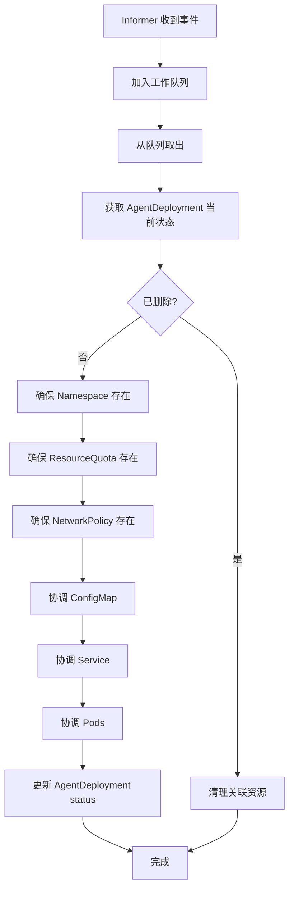
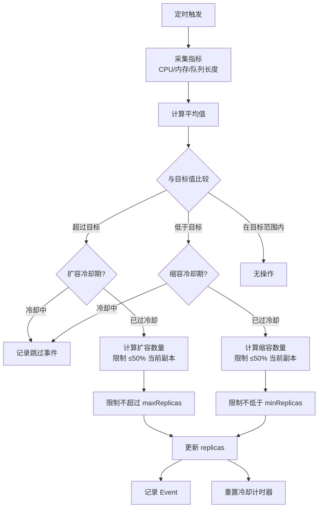

# 设计文档：K8s Agent Operator

## 概述

AgentOperator 是一个基于 TypeScript 的自定义 Kubernetes Operator，使用 `@kubernetes/client-node` 库实现。Operator 遵循 Kubernetes Controller 模式：通过 Informer 监听 AgentDeployment CRD 的变化事件，Reconciler 将实际状态收敛到期望状态。核心组件包括 Controller（协调循环）、Scaler（自动扩缩容）、Webhook Server（准入控制）、Metrics Exporter（Prometheus 指标）和 Migration Tool（Docker Compose 迁移）。前端通过 REST API 和 WebSocket 获取部署状态。

## 架构

```mermaid
graph TB
    subgraph "Kubernetes 集群"
        subgraph "Operator Pod"
            CTRL[Controller<br/>Informer + Reconciler]
            SCALER[Scaler<br/>指标采集 + 扩缩容决策]
            WH[Webhook Server<br/>Validating + Mutating]
            METRICS[Metrics Exporter<br/>/metrics 端点]
            API[REST API Server<br/>部署信息查询]
            WS[WebSocket Server<br/>状态推送]
            LOG[Logger<br/>结构化 JSON 日志]
        end

        subgraph "Tenant Namespace A"
            POD_A1[Agent Pod 1]
            POD_A2[Agent Pod 2]
            SVC_A[Service A]
            CM_A[ConfigMap A]
            RQ_A[ResourceQuota A]
            NP_A[NetworkPolicy A]
        end

        subgraph "Tenant Namespace B"
            POD_B1[Agent Pod 1]
            SVC_B[Service B]
            CM_B[ConfigMap B]
            RQ_B[ResourceQuota B]
            NP_B[NetworkPolicy B]
        end

        APISERVER[Kubernetes API Server]
        METRICS_SERVER[Metrics Server]
        PROM[Prometheus]
    end

    subgraph "外部"
        FE[前端 React App]
        COMPOSE[docker-compose.yml]
        MIGTOOL[Migration Tool CLI]
    end

    CTRL -->|watch/list/create/update/delete| APISERVER
    SCALER -->|query metrics| METRICS_SERVER
    SCALER -->|query /metrics| POD_A1
    SCALER -->|query /metrics| POD_A2
    WH -->|admission review| APISERVER
    PROM -->|scrape| METRICS
    FE -->|REST API| API
    FE -->|WebSocket| WS
    MIGTOOL -->|读取| COMPOSE
    MIGTOOL -->|生成| APISERVER

    CTRL --> POD_A1
    CTRL --> POD_A2
    CTRL --> SVC_A
    CTRL --> CM_A
    CTRL --> POD_B1
    CTRL --> SVC_B
    CTRL --> CM_B
```



### 协调循环流程



### 自动扩缩容决策流程



## 组件与接口

### 1. CRD 类型定义（TypeScript）

```typescript
// src/types/agent-deployment.ts

interface AgentDeploymentSpec {
  replicas: number;
  image: string;
  selector: { matchLabels: Record<string, string> };
  strategy: {
    type: 'RollingUpdate' | 'Recreate';
    rollingUpdate?: { maxSurge: number | string; maxUnavailable: number | string };
  };
  ports?: Array<{ name: string; containerPort: number; protocol?: string }>;
  resources?: {
    requests?: { cpu?: string; memory?: string };
    limits?: { cpu?: string; memory?: string };
  };
  env?: Array<{ name: string; value?: string; valueFrom?: object }>;
  volumeMounts?: Array<{ name: string; mountPath: string; readOnly?: boolean }>;
  livenessProbe?: ProbeConfig;
  readinessProbe?: ProbeConfig;
  config?: Record<string, string>;
  scaling?: ScalingSpec;
  serviceType?: 'ClusterIP' | 'NodePort' | 'LoadBalancer';
  nodeSelector?: Record<string, string>;
  nodeAffinity?: object;
  podAffinity?: object;
  podAntiAffinity?: object;
  topologySpreadConstraints?: object[];
  priorityClassName?: string;
}

interface ScalingSpec {
  minReplicas: number;
  maxReplicas: number;
  targetCPUUtilization?: number;      // 百分比，如 80
  targetMemoryUtilization?: number;   // 百分比，如 80
  targetQueueLength?: number;         // 绝对值，如 10
  scaleUpCooldown?: number;           // 秒
  scaleDownCooldown?: number;         // 秒
}

interface AgentDeploymentStatus {
  readyReplicas: number;
  updatedReplicas: number;
  availableReplicas: number;
  conditions: Array<{
    type: string;
    status: 'True' | 'False' | 'Unknown';
    lastTransitionTime: string;
    reason: string;
    message: string;
  }>;
}

interface ProbeConfig {
  httpGet?: { path: string; port: number };
  exec?: { command: string[] };
  initialDelaySeconds?: number;
  periodSeconds?: number;
  timeoutSeconds?: number;
  failureThreshold?: number;
}
```

### 2. Controller 组件

```typescript
// src/controller/controller.ts

class AgentDeploymentController {
  private informer: k8s.Informer<k8s.KubernetesObject>;
  private workQueue: WorkQueue<string>;
  private reconciler: Reconciler;

  constructor(
    kubeConfig: k8s.KubeConfig,
    reconciler: Reconciler,
    logger: Logger
  );

  // 启动 informer 和工作队列处理循环
  async start(): Promise<void>;

  // 停止 informer 和工作队列
  async stop(): Promise<void>;

  // informer 事件回调
  private onAdd(obj: AgentDeployment): void;
  private onUpdate(oldObj: AgentDeployment, newObj: AgentDeployment): void;
  private onDelete(obj: AgentDeployment): void;
}
```

### 3. Reconciler 组件

```typescript
// src/controller/reconciler.ts

class Reconciler {
  constructor(
    coreApi: k8s.CoreV1Api,
    customApi: k8s.CustomObjectsApi,
    logger: Logger,
    eventRecorder: EventRecorder
  );

  // 主协调入口
  async reconcile(namespacedName: { namespace: string; name: string }): Promise<void>;

  // 子资源协调
  async ensureNamespace(namespace: string): Promise<void>;
  async reconcileConfigMap(deployment: AgentDeployment): Promise<void>;
  async reconcileService(deployment: AgentDeployment): Promise<void>;
  async reconcilePods(deployment: AgentDeployment): Promise<void>;
  async ensureResourceQuota(namespace: string): Promise<void>;
  async ensureNetworkPolicy(namespace: string): Promise<void>;
  async updateStatus(deployment: AgentDeployment): Promise<void>;

  // Pod 构建
  buildPodSpec(deployment: AgentDeployment, index: number): k8s.V1Pod;

  // 更新策略
  async rollingUpdate(deployment: AgentDeployment, existingPods: k8s.V1Pod[]): Promise<void>;
  async recreateUpdate(deployment: AgentDeployment, existingPods: k8s.V1Pod[]): Promise<void>;

  // 回滚
  async rollback(deployment: AgentDeployment, reason: string): Promise<void>;
}
```

### 4. Scaler 组件

```typescript
// src/scaler/scaler.ts

class Scaler {
  private cooldownTracker: CooldownTracker;

  constructor(
    metricsClient: MetricsClient,
    customApi: k8s.CustomObjectsApi,
    logger: Logger,
    eventRecorder: EventRecorder
  );

  // 启动定时扩缩容检查
  start(intervalMs: number): void;
  stop(): void;

  // 对单个 AgentDeployment 执行扩缩容评估
  async evaluate(deployment: AgentDeployment): Promise<ScalingDecision>;

  // 计算期望副本数
  calculateDesiredReplicas(
    currentReplicas: number,
    metrics: PodMetrics,
    scaling: ScalingSpec
  ): number;

  // 应用扩缩容
  async applyScaling(deployment: AgentDeployment, decision: ScalingDecision): Promise<void>;
}

interface ScalingDecision {
  action: 'scale-up' | 'scale-down' | 'no-change' | 'cooldown-blocked';
  currentReplicas: number;
  desiredReplicas: number;
  reason: string;
  metrics: { avgCpu?: number; avgMemory?: number; avgQueueLength?: number };
}

class CooldownTracker {
  isInCooldown(deploymentKey: string, direction: 'up' | 'down'): boolean;
  recordScaling(deploymentKey: string, direction: 'up' | 'down'): void;
  getRemainingCooldown(deploymentKey: string, direction: 'up' | 'down'): number;
}
```

### 5. Metrics Client

```typescript
// src/scaler/metrics-client.ts

class MetricsClient {
  constructor(metricsApi: k8s.MetricsV1beta1Api, httpClient: HttpClient);

  // 从 Metrics Server 获取 Pod 的 CPU/内存使用
  async getPodResourceMetrics(namespace: string, labelSelector: string): Promise<PodResourceMetrics[]>;

  // 从 Pod 的 /metrics 端点获取队列长度
  async getPodQueueMetrics(pods: k8s.V1Pod[]): Promise<PodQueueMetrics[]>;
}

interface PodResourceMetrics {
  podName: string;
  cpuUsageMillicores: number;
  memoryUsageBytes: number;
}

interface PodQueueMetrics {
  podName: string;
  queueLength: number;
}
```

### 6. Webhook Server

```typescript
// src/webhook/webhook-server.ts

class WebhookServer {
  constructor(port: number, tlsCert: string, tlsKey: string, logger: Logger);

  async start(): Promise<void>;
  async stop(): Promise<void>;

  // Validating Webhook handler
  validate(review: AdmissionReview): AdmissionResponse;

  // Mutating Webhook handler
  mutate(review: AdmissionReview): AdmissionResponse;
}
```

### 7. Metrics Exporter

```typescript
// src/metrics/metrics-exporter.ts

class MetricsExporter {
  // 注册所有指标
  registerMetrics(): void;

  // 更新指标值
  setDeploymentReplicas(deployment: string, namespace: string, agentType: string, value: number): void;
  setPodCount(deployment: string, namespace: string, agentType: string, value: number): void;
  incScalingEvents(deployment: string, namespace: string, agentType: string): void;
  setPodCpuUsage(pod: string, deployment: string, namespace: string, value: number): void;
  setPodMemoryUsage(pod: string, deployment: string, namespace: string, value: number): void;
  setPodQueueLength(pod: string, deployment: string, namespace: string, value: number): void;
  observeUpdateDuration(deployment: string, namespace: string, durationSeconds: number): void;
  incPodRestartCount(pod: string, deployment: string, namespace: string): void;

  // 返回 Prometheus 文本格式
  async getMetrics(): Promise<string>;
}
```

### 8. REST API & WebSocket Server

```typescript
// src/api/api-server.ts

class ApiServer {
  constructor(port: number, kubeClient: KubeClient, logger: Logger);

  async start(): Promise<void>;
  async stop(): Promise<void>;

  // REST 端点
  // GET /api/deployments - AgentDeployment 列表
  // GET /api/deployments/:namespace/:name/pods - Pod 列表
  // GET /api/deployments/:namespace/:name/scaling-history - 扩缩容历史
  // GET /api/deployments/:namespace/:name/events - 事件日志
  // GET /api/tenants/:namespace/quota - 租户资源使用情况
  // GET /metrics - Prometheus 指标

  // WebSocket 事件
  // deployment:status-changed - 部署状态变化
  // pod:status-changed - Pod 状态变化
  // scaling:event - 扩缩容事件
}
```

### 9. Migration Tool

```typescript
// src/migration/migration-tool.ts

class MigrationTool {
  // 解析 docker-compose.yml
  parseComposeFile(content: string): ComposeConfig;

  // 将单个 service 转换为 AgentDeployment
  convertService(serviceName: string, service: ComposeService): AgentDeploymentManifest;

  // 转换整个 compose 文件
  convertAll(compose: ComposeConfig): AgentDeploymentManifest[];

  // 生成 YAML 输出
  toYaml(manifests: AgentDeploymentManifest[]): string;
}

interface ComposeService {
  image: string;
  environment?: Record<string, string> | string[];
  volumes?: string[];
  ports?: string[];
  deploy?: { replicas?: number; resources?: object };
}
```

### 10. Logger

```typescript
// src/utils/logger.ts

class Logger {
  constructor(component: string, level?: LogLevel);

  debug(message: string, context?: Record<string, unknown>): void;
  info(message: string, context?: Record<string, unknown>): void;
  warn(message: string, context?: Record<string, unknown>): void;
  error(message: string, context?: Record<string, unknown>): void;
}

// 输出格式：
// {"timestamp":"2024-01-01T00:00:00.000Z","level":"info","component":"reconciler","message":"Pod created","context":{"pod":"agent-abc-0","namespace":"tenant-a"}}
```

### 11. EventRecorder

```typescript
// src/utils/event-recorder.ts

class EventRecorder {
  constructor(coreApi: k8s.CoreV1Api);

  async record(
    involvedObject: { kind: string; name: string; namespace: string; uid: string },
    eventType: 'Normal' | 'Warning',
    reason: string,
    message: string
  ): Promise<void>;
}
```

## 数据模型

### AgentDeployment CRD YAML 示例

```yaml
apiVersion: agent.io/v1alpha1
kind: AgentDeployment
metadata:
  name: ceo-agent
  namespace: tenant-alpha
  labels:
    agent-type: ceo
spec:
  replicas: 2
  image: cube-pets/agent:v1.0.0
  selector:
    matchLabels:
      app: agent
      deployment: ceo-agent
  strategy:
    type: RollingUpdate
    rollingUpdate:
      maxSurge: 1
      maxUnavailable: 0
  ports:
    - name: http
      containerPort: 8080
    - name: metrics
      containerPort: 9090
  resources:
    requests:
      cpu: "100m"
      memory: "128Mi"
    limits:
      cpu: "500m"
      memory: "512Mi"
  env:
    - name: AGENT_TYPE
      value: ceo
    - name: LLM_API_KEY
      valueFrom:
        secretKeyRef:
          name: llm-secrets
          key: api-key
  livenessProbe:
    httpGet:
      path: /healthz
      port: 8080
    initialDelaySeconds: 10
    periodSeconds: 30
  readinessProbe:
    httpGet:
      path: /readyz
      port: 8080
    initialDelaySeconds: 5
    periodSeconds: 10
  config:
    SOUL.md: |
      # CEO Agent
      你是一个 CEO 级别的智能体...
    skills.json: |
      {"skills": ["planning", "delegation"]}
  scaling:
    minReplicas: 1
    maxReplicas: 10
    targetCPUUtilization: 80
    targetMemoryUtilization: 80
    targetQueueLength: 5
    scaleUpCooldown: 60
    scaleDownCooldown: 300
  serviceType: ClusterIP
  nodeSelector:
    node-type: gpu
  topologySpreadConstraints:
    - maxSkew: 1
      topologyKey: topology.kubernetes.io/zone
      whenUnsatisfied: DoNotSchedule
  priorityClassName: high-priority
status:
  readyReplicas: 2
  updatedReplicas: 2
  availableReplicas: 2
  conditions:
    - type: Available
      status: "True"
      lastTransitionTime: "2024-01-01T00:00:00Z"
      reason: MinimumReplicasAvailable
      message: Deployment has minimum availability
```

### 生成的 Pod 模板

```yaml
apiVersion: v1
kind: Pod
metadata:
  name: ceo-agent-0
  namespace: tenant-alpha
  labels:
    app: agent
    deployment: ceo-agent
    agent-type: ceo
    version: blue
    managed-by: agent-operator
  ownerReferences:
    - apiVersion: agent.io/v1alpha1
      kind: AgentDeployment
      name: ceo-agent
      uid: <deployment-uid>
      controller: true
      blockOwnerDeletion: true
spec:
  containers:
    - name: agent
      image: cube-pets/agent:v1.0.0
      ports:
        - name: http
          containerPort: 8080
        - name: metrics
          containerPort: 9090
      resources:
        requests:
          cpu: "100m"
          memory: "128Mi"
        limits:
          cpu: "500m"
          memory: "512Mi"
      env:
        - name: AGENT_TYPE
          value: ceo
      livenessProbe:
        httpGet:
          path: /healthz
          port: 8080
        initialDelaySeconds: 10
        periodSeconds: 30
      readinessProbe:
        httpGet:
          path: /readyz
          port: 8080
        initialDelaySeconds: 5
        periodSeconds: 10
      volumeMounts:
        - name: agent-config
          mountPath: /etc/agent-config
          readOnly: true
  volumes:
    - name: agent-config
      configMap:
        name: ceo-agent-config
  priorityClassName: high-priority
  nodeSelector:
    node-type: gpu
  topologySpreadConstraints:
    - maxSkew: 1
      topologyKey: topology.kubernetes.io/zone
      whenUnsatisfied: DoNotSchedule
```

### 生成的 Service 模板

```yaml
apiVersion: v1
kind: Service
metadata:
  name: ceo-agent
  namespace: tenant-alpha
  labels:
    managed-by: agent-operator
  ownerReferences:
    - apiVersion: agent.io/v1alpha1
      kind: AgentDeployment
      name: ceo-agent
      uid: <deployment-uid>
spec:
  type: ClusterIP
  selector:
    app: agent
    deployment: ceo-agent
  ports:
    - name: http
      port: 8080
      targetPort: 8080
    - name: metrics
      port: 9090
      targetPort: 9090
```

### 生成的 ConfigMap 模板

```yaml
apiVersion: v1
kind: ConfigMap
metadata:
  name: ceo-agent-config
  namespace: tenant-alpha
  labels:
    managed-by: agent-operator
  ownerReferences:
    - apiVersion: agent.io/v1alpha1
      kind: AgentDeployment
      name: ceo-agent
      uid: <deployment-uid>
data:
  SOUL.md: |
    # CEO Agent
    你是一个 CEO 级别的智能体...
  skills.json: |
    {"skills": ["planning", "delegation"]}
```

### 生成的 ResourceQuota 模板

```yaml
apiVersion: v1
kind: ResourceQuota
metadata:
  name: tenant-quota
  namespace: tenant-alpha
spec:
  hard:
    pods: "20"
    requests.cpu: "10"
    requests.memory: "20Gi"
    limits.cpu: "20"
    limits.memory: "40Gi"
```

### 生成的 NetworkPolicy 模板

```yaml
apiVersion: networking.k8s.io/v1
kind: NetworkPolicy
metadata:
  name: tenant-isolation
  namespace: tenant-alpha
spec:
  podSelector: {}
  policyTypes:
    - Ingress
    - Egress
  ingress:
    - from:
        - namespaceSelector:
            matchLabels:
              name: tenant-alpha
        - namespaceSelector:
            matchLabels:
              name: agent-operator
  egress:
    - to:
        - namespaceSelector:
            matchLabels:
              name: tenant-alpha
    - to:
        - namespaceSelector:
            matchLabels:
              name: kube-system
      ports:
        - port: 53
          protocol: UDP
        - port: 53
          protocol: TCP
```

### 扩缩容历史记录数据结构

```typescript
interface ScalingHistoryEntry {
  timestamp: string;
  deploymentName: string;
  namespace: string;
  action: 'scale-up' | 'scale-down';
  fromReplicas: number;
  toReplicas: number;
  reason: string;
  metrics: {
    avgCpuUtilization?: number;
    avgMemoryUtilization?: number;
    avgQueueLength?: number;
  };
}
```

### Docker Compose 到 AgentDeployment 的映射规则

| Docker Compose 字段 | AgentDeployment 字段 | 转换规则 |
|---------------------|---------------------|---------|
| `services.<name>.image` | `spec.image` | 直接映射 |
| `services.<name>.environment` | `spec.env` | 对象转为 `{name, value}` 数组 |
| `services.<name>.ports` | `spec.ports` | `"host:container"` 转为 `{containerPort}` |
| `services.<name>.volumes` | `spec.volumeMounts` + `spec.config` | 绑定挂载转为 ConfigMap |
| `services.<name>.deploy.replicas` | `spec.replicas` | 直接映射，默认 1 |
| `services.<name>.deploy.resources` | `spec.resources` | 转换格式 |
| `services.<name>` (name) | `metadata.name` | 直接映射 |

### REST API 响应数据结构

```typescript
// GET /api/deployments
interface DeploymentListResponse {
  items: Array<{
    name: string;
    namespace: string;
    replicas: number;
    readyReplicas: number;
    updatedReplicas: number;
    image: string;
    agentType: string;
    createdAt: string;
  }>;
}

// GET /api/deployments/:namespace/:name/pods
interface PodListResponse {
  items: Array<{
    name: string;
    status: string;
    cpuUsage: number;
    memoryUsage: number;
    restartCount: number;
    startedAt: string;
  }>;
}

// GET /api/deployments/:namespace/:name/scaling-history
interface ScalingHistoryResponse {
  items: ScalingHistoryEntry[];
}

// GET /api/tenants/:namespace/quota
interface TenantQuotaResponse {
  namespace: string;
  used: { pods: number; cpu: string; memory: string };
  hard: { pods: number; cpu: string; memory: string };
}
```

## 正确性属性

*属性是系统在所有有效执行中应保持为真的特征或行为——本质上是关于系统应该做什么的形式化陈述。属性是人类可读规范与机器可验证正确性保证之间的桥梁。*

### Property 1: AgentDeployment CRD 序列化 round-trip

*对于任何*有效的 AgentDeploymentSpec 对象，将其序列化为 JSON 再反序列化回来，应该产生与原始对象等价的结果。这验证了 CRD 类型定义的完整性和序列化一致性。

**Validates: Requirements 1.1, 1.2, 1.3, 1.4, 1.5**

### Property 2: Pod spec 忠实反映 AgentDeployment 配置

*对于任何*有效的 AgentDeployment，`buildPodSpec` 生成的 Pod 应该满足：
- Pod 的 labels 包含 `app=agent`、`deployment=<name>`、`agent-type=<type>`
- Pod 的 resources 与 AgentDeployment.spec.resources 一致
- Pod 的 env 包含 AgentDeployment.spec.env 中的所有变量
- Pod 的 livenessProbe 和 readinessProbe 与 AgentDeployment.spec 中的配置一致
- Pod 的 nodeSelector、affinity、topologySpreadConstraints、priorityClassName 与 AgentDeployment.spec 一致

**Validates: Requirements 3.2, 3.3, 3.4, 3.5, 13.2, 13.3, 13.4**

### Property 3: 子资源 ownerReference 正确性

*对于任何* AgentDeployment 生成的子资源（Pod、Service、ConfigMap），每个子资源的 ownerReference 应该包含一个条目，指向该 AgentDeployment 的 apiVersion、kind、name 和 uid，且 controller=true。

**Validates: Requirements 3.1, 4.5, 5.5**

### Property 4: Service spec 忠实反映 AgentDeployment 配置

*对于任何*有效的 AgentDeployment，生成的 Service 应该满足：
- Service 的 selector 能匹配到 AgentDeployment 关联的 Pod label
- Service 的 ports 与 AgentDeployment.spec.ports 一致
- Service 的 type 与 AgentDeployment.spec.serviceType 一致

**Validates: Requirements 4.2, 4.3, 4.4**

### Property 5: ConfigMap 忠实反映 AgentDeployment 配置

*对于任何*有 config 字段的 AgentDeployment，生成的 ConfigMap 的 data 应该包含 AgentDeployment.spec.config 中的所有键值对，且生成的 Pod 应该有对应的 volume 和 volumeMount。

**Validates: Requirements 5.1, 5.2, 5.3**

### Property 6: 扩缩容计算正确性

*对于任何*当前副本数、指标数据（CPU 使用率、内存使用率、队列长度）和 ScalingSpec 配置，`calculateDesiredReplicas` 应该满足：
- 当平均使用率超过目标值时，返回值 > 当前副本数
- 当平均使用率低于目标值时，返回值 < 当前副本数
- 返回值始终在 [minReplicas, maxReplicas] 范围内
- 单次变化量不超过当前副本数的 50%（向上取整）

**Validates: Requirements 6.3, 6.4, 6.5, 7.4, 7.5, 7.6, 8.4**

### Property 7: 冷却期阻止扩缩容

*对于任何* CooldownTracker 状态，如果上次扩容时间距今小于 scaleUpCooldown，则 `isInCooldown(key, 'up')` 返回 true；如果上次缩容时间距今小于 scaleDownCooldown，则 `isInCooldown(key, 'down')` 返回 true。冷却期过后，对应方向的 `isInCooldown` 返回 false。

**Validates: Requirements 8.2, 8.3**

### Property 8: 结构化日志格式正确性

*对于任何*日志输出，Logger 产生的每条日志应该是有效的 JSON，且包含 timestamp（ISO 8601 格式）、level（debug/info/warn/error 之一）、component（非空字符串）、message（非空字符串）字段。当 LOG_LEVEL 设置为某个级别时，低于该级别的日志不应该输出。

**Validates: Requirements 15.4, 15.5**

### Property 9: Webhook 验证拒绝无效配置

*对于任何*无效的 AgentDeployment 配置（缺少 spec.image、replicas < 0、maxReplicas < minReplicas、resources.requests > resources.limits），ValidatingWebhook 的 `validate()` 应该返回 `allowed: false` 并包含描述性的错误消息。

**Validates: Requirements 16.1, 16.2, 16.3**

### Property 10: Webhook 变更注入默认值

*对于任何*缺少 livenessProbe 的 AgentDeployment，MutatingWebhook 的 `mutate()` 应该注入默认的 HTTP GET /healthz 探针。*对于任何* AgentDeployment，`mutate()` 后应该包含 `managed-by=agent-operator` label 和 `creation-timestamp` annotation。

**Validates: Requirements 16.4, 16.5**

### Property 11: Docker Compose 迁移转换正确性

*对于任何*有效的 Docker Compose service 配置，MigrationTool 的 `convertService` 应该满足：
- 生成的 AgentDeployment 的 spec.image 与 service.image 一致
- service.environment 中的所有变量出现在 spec.env 中
- service.ports 中的所有端口映射出现在 spec.ports 中
- 缺少的字段（如 resources、probe）有合理的默认值

**Validates: Requirements 17.1, 17.2, 17.3, 17.4, 17.5**

### Property 12: 租户隔离资源完整性

*对于任何*新租户的 AgentDeployment，reconcile 后该租户的 namespace 应该存在，且包含 ResourceQuota（限制 pods、cpu、memory）和 NetworkPolicy（限制跨 namespace 访问）。所有关联资源（Pod、Service、ConfigMap）应该在该 namespace 中。

**Validates: Requirements 11.2, 11.3, 11.4, 11.5, 12.1, 12.2**

### Property 13: Prometheus 指标完整性

*对于任何*指标更新操作后，`getMetrics()` 返回的 Prometheus 文本应该包含对应的指标名称、值和 label（deployment、namespace、agent_type）。所有注册的指标类型（gauge、counter、histogram）应该符合 Prometheus 文本格式规范。

**Validates: Requirements 14.1, 14.2, 14.3, 14.4**

### Property 14: 协调后 Pod 数量一致性

*对于任何*有效的 AgentDeployment（replicas=N），reconcile 完成后，关联的 Pod 数量应该等于 N。如果当前 Pod 数量少于 N，应该创建新 Pod；如果多于 N，应该删除多余的 Pod。

**Validates: Requirements 2.2, 2.4**

## 错误处理

### Kubernetes API 错误

| 错误场景 | 处理策略 |
|---------|---------|
| API Server 不可达 | 指数退避重试（初始 1s，最大 60s），记录 warn 日志 |
| 资源冲突（409 Conflict） | 重新获取最新版本后重试 reconcile |
| 资源不存在（404 Not Found） | 跳过删除操作，记录 info 日志 |
| 权限不足（403 Forbidden） | 记录 error 日志，创建 Warning Event |
| ResourceQuota 超限 | 记录 Warning Event，不重试创建 Pod |
| Webhook TLS 证书过期 | 记录 error 日志，Webhook 拒绝所有请求直到证书更新 |

### 扩缩容错误

| 错误场景 | 处理策略 |
|---------|---------|
| Metrics Server 不可达 | 跳过本次扩缩容评估，保持当前副本数，记录 warn 日志 |
| Pod /metrics 端点不可达 | 将该 Pod 排除在指标计算之外，记录 warn 日志 |
| 指标数据异常（NaN/负数） | 忽略异常数据点，使用其余 Pod 的平均值 |
| 扩容后 Pod 启动失败 | 等待 readiness probe 超时后触发回滚 |

### 迁移工具错误

| 错误场景 | 处理策略 |
|---------|---------|
| docker-compose.yml 格式无效 | 返回解析错误，包含行号和错误描述 |
| 不支持的 Compose 特性 | 记录 warn 日志，跳过不支持的字段，继续转换 |
| image 字段缺失 | 返回错误，image 是必填字段 |

## 测试策略

### 属性测试（Property-Based Testing）

使用 `fast-check` 库进行属性测试，每个属性测试运行至少 100 次迭代。

| 属性 | 测试文件 | 说明 |
|------|---------|------|
| Property 1: CRD round-trip | `src/__tests__/crd-schema.property.test.ts` | 生成随机 AgentDeploymentSpec，验证序列化 round-trip |
| Property 2: Pod spec 忠实性 | `src/__tests__/pod-builder.property.test.ts` | 生成随机 AgentDeployment，验证 buildPodSpec 输出 |
| Property 3: ownerReference | `src/__tests__/pod-builder.property.test.ts` | 验证所有子资源的 ownerReference |
| Property 4: Service spec 忠实性 | `src/__tests__/service-builder.property.test.ts` | 生成随机 AgentDeployment，验证 Service 输出 |
| Property 5: ConfigMap 忠实性 | `src/__tests__/configmap-builder.property.test.ts` | 生成随机 config，验证 ConfigMap 输出 |
| Property 6: 扩缩容计算 | `src/__tests__/scaler.property.test.ts` | 生成随机指标和配置，验证计算结果 |
| Property 7: 冷却期 | `src/__tests__/cooldown.property.test.ts` | 生成随机时间戳和冷却配置，验证冷却逻辑 |
| Property 8: 日志格式 | `src/__tests__/logger.property.test.ts` | 生成随机日志内容，验证 JSON 格式 |
| Property 9: Webhook 验证 | `src/__tests__/webhook.property.test.ts` | 生成随机无效配置，验证拒绝行为 |
| Property 10: Webhook 变更 | `src/__tests__/webhook.property.test.ts` | 生成随机配置，验证默认值注入 |
| Property 11: 迁移转换 | `src/__tests__/migration.property.test.ts` | 生成随机 Compose 配置，验证转换正确性 |
| Property 12: 租户隔离 | `src/__tests__/tenant.property.test.ts` | 验证 namespace 资源完整性 |
| Property 13: 指标完整性 | `src/__tests__/metrics.property.test.ts` | 生成随机指标数据，验证 Prometheus 输出 |
| Property 14: Pod 数量一致性 | `src/__tests__/reconciler.property.test.ts` | 生成随机 replicas，验证 reconcile 后 Pod 数量 |

### 单元测试

使用 `vitest` 进行单元测试，覆盖具体示例和边界情况。

| 测试范围 | 测试文件 | 说明 |
|---------|---------|------|
| Reconciler 创建流程 | `src/__tests__/reconciler.test.ts` | 测试创建 AgentDeployment 后的资源创建 |
| Reconciler 删除流程 | `src/__tests__/reconciler.test.ts` | 测试删除 AgentDeployment 后的资源清理 |
| 滚动更新 | `src/__tests__/rolling-update.test.ts` | 测试 maxSurge/maxUnavailable 行为 |
| 回滚 | `src/__tests__/rollback.test.ts` | 测试新版本启动失败时的回滚 |
| CrashLoopBackOff 告警 | `src/__tests__/health-monitor.test.ts` | 测试 Pod 崩溃循环时的告警 |
| REST API 端点 | `src/__tests__/api-server.test.ts` | 测试各 API 端点的响应格式 |
| WebSocket 推送 | `src/__tests__/websocket.test.ts` | 测试状态变化时的 WebSocket 事件 |
| Event 记录 | `src/__tests__/event-recorder.test.ts` | 测试各场景的 Event 创建 |
| ResourceQuota 超限 | `src/__tests__/quota.test.ts` | 测试超过配额时的告警行为 |

### 测试标签格式

每个属性测试使用以下注释格式标记：

```typescript
// Feature: k8s-agent-operator, Property 6: 扩缩容计算正确性
```

### 测试配置

```typescript
// vitest.config.ts
export default defineConfig({
  test: {
    include: ['src/__tests__/**/*.test.ts'],
    coverage: {
      provider: 'v8',
      include: ['src/**/*.ts'],
      exclude: ['src/__tests__/**', 'src/types/**'],
    },
  },
});
```
