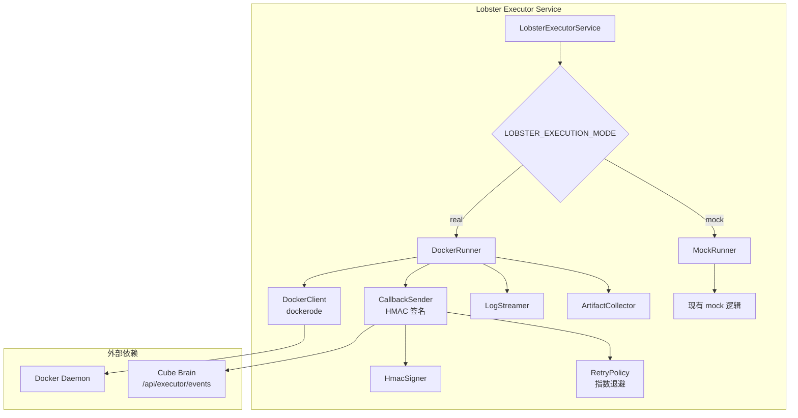

# 设计文档

## 概述

将 Lobster Executor 从纯 mock 实现升级为真实 Docker 容器执行器。核心改动集中在 `services/lobster-executor/src/` 目录，通过引入 `dockerode` 库实现容器生命周期管理，新增 HMAC 签名回调模块将事件推送回 Cube Brain，同时保留 mock 模式以支持无 Docker 环境的开发。

设计遵循"最小侵入"原则：现有的 `LobsterExecutorService` 类保持 submit/getJob/listJobs 等公共接口不变，仅将内部的 `runAcceptedJob()` 方法替换为基于策略模式的 Runner 分发，根据 `LOBSTER_EXECUTION_MODE` 环境变量选择 `DockerRunner` 或 `MockRunner`。

## 架构



## 组件与接口

### 1. JobRunner 接口（策略模式）

```typescript
// services/lobster-executor/src/runner.ts
interface JobRunner {
  run(record: StoredJobRecord, emitEvent: EventEmitter): Promise<void>;
}
```

`LobsterExecutorService.runAcceptedJob()` 将委托给 `JobRunner.run()`，根据配置选择实现。

### 2. DockerRunner

负责真实容器生命周期：

```typescript
// services/lobster-executor/src/docker-runner.ts
class DockerRunner implements JobRunner {
  constructor(
    private docker: Dockerode,
    private callbackSender: CallbackSender,
    private config: DockerRunnerConfig
  )

  async run(record: StoredJobRecord, emitEvent: EventEmitter): Promise<void>
  private createContainer(record: StoredJobRecord): Promise<Dockerode.Container>
  private streamLogs(container: Dockerode.Container, record: StoredJobRecord): Promise<void>
  private collectArtifacts(container: Dockerode.Container, record: StoredJobRecord): Promise<ExecutionPlanArtifact[]>
  private cleanupContainer(container: Dockerode.Container): Promise<void>
}
```

容器创建配置映射：

- `Image`: `payload.image || config.defaultImage || "node:20-slim"`
- `Cmd`: `payload.command`（字符串数组）
- `Env`: `payload.env` 转换为 `["KEY=VALUE", ...]` 格式
- `HostConfig.Binds`: `["<hostWorkspaceDir>:/workspace"]`
- `WorkingDir`: `/workspace`

超时处理流程：

1. 启动 `setTimeout(timeoutMs)` 计时器
2. 超时触发 → `container.stop({ t: 10 })`（SIGTERM + 10 秒宽限）
3. 10 秒后仍运行 → `container.kill({ signal: "SIGKILL" })`
4. 标记 errorCode 为 `"TIMEOUT"`

### 3. MockRunner

封装现有 mock 逻辑，从 `runAcceptedJob()` 中提取：

```typescript
// services/lobster-executor/src/mock-runner.ts
class MockRunner implements JobRunner {
  async run(record: StoredJobRecord, emitEvent: EventEmitter): Promise<void>;
}
```

行为与当前 `runAcceptedJob()` 完全一致，仅做代码搬迁。

### 4. CallbackSender

负责 HMAC 签名和事件投递：

```typescript
// services/lobster-executor/src/callback-sender.ts
class CallbackSender {
  constructor(
    private signer: HmacSigner,
    private config: CallbackConfig
  )

  async send(eventsUrl: string, event: ExecutorEvent): Promise<void>
  private async sendWithRetry(url: string, body: string, headers: Record<string, string>): Promise<void>
}

interface CallbackConfig {
  secret: string;
  executorId: string;
  maxRetries: number;       // 默认 3
  baseDelayMs: number;      // 默认 1000
}
```

重试策略：

- 最多 3 次重试
- 指数退避：`baseDelayMs * 2^attempt`（1s, 2s, 4s）
- 所有重试失败后记录日志，不抛出异常

### 5. HmacSigner

纯函数模块，负责签名计算：

```typescript
// services/lobster-executor/src/hmac-signer.ts
function signPayload(
  secret: string,
  timestamp: string,
  rawBody: string
): string;
function createCallbackHeaders(
  executorId: string,
  secret: string,
  rawBody: string,
  now?: () => Date
): Record<string, string>;
```

签名格式：`HMAC-SHA256(secret, "timestamp.rawBody")`，与 `shared/executor/api.ts` 中定义的 `ExecutorCallbackAuth.signedPayload` 一致。

### 6. LogBatcher

批量聚合日志行，控制发送频率和大小：

```typescript
// services/lobster-executor/src/log-batcher.ts
class LogBatcher {
  constructor(
    private onFlush: (lines: string[]) => void,
    private maxIntervalMs: number,  // 默认 500
    private maxSizeBytes: number    // 默认 4096
  )

  push(line: string): void
  flush(): void
  destroy(): void
}
```

### 7. 配置扩展

扩展 `LobsterExecutorConfig`：

```typescript
// 新增字段
interface LobsterExecutorConfig {
  // ... 现有字段
  executionMode: "real" | "mock";
  defaultImage: string;
  maxConcurrentJobs: number;
  dockerHost?: string;
  dockerTlsVerify?: boolean;
  dockerCertPath?: string;
  callbackSecret: string;
}
```

环境变量映射：

| 环境变量                    | 配置字段          | 默认值         |
| --------------------------- | ----------------- | -------------- |
| LOBSTER_EXECUTION_MODE      | executionMode     | "real"         |
| LOBSTER_DEFAULT_IMAGE       | defaultImage      | "node:20-slim" |
| LOBSTER_MAX_CONCURRENT_JOBS | maxConcurrentJobs | 2              |
| DOCKER_HOST                 | dockerHost        | 平台相关       |
| DOCKER_TLS_VERIFY           | dockerTlsVerify   | undefined      |
| DOCKER_CERT_PATH            | dockerCertPath    | undefined      |
| EXECUTOR_CALLBACK_SECRET    | callbackSecret    | ""             |

### 8. 健康检查扩展

`/health` 端点响应新增字段：

```typescript
interface LobsterExecutorHealthResponse {
  // ... 现有字段
  docker: {
    status: "connected" | "disconnected";
    host?: string;
  };
  features: {
    // 更新
    dockerLifecycle: boolean; // real 模式下为 true
    callbackSigning: boolean; // 有 secret 时为 true
  };
}
```

### 9. 并发控制

使用简单的信号量模式限制并行容器数：

```typescript
class ConcurrencyLimiter {
  constructor(private maxConcurrent: number)
  async acquire(): Promise<void>   // 超过限制时等待
  release(): void
}
```

`LobsterExecutorService` 在调用 `runner.run()` 前 acquire，完成后 release。

## 数据模型

### StoredJobRecord 扩展

```typescript
interface StoredJobRecord {
  // ... 现有字段
  containerId?: string; // Docker 容器 ID（仅 real 模式）
  executionMode: "real" | "mock";
}
```

### Job Workspace 目录结构

```
<dataRoot>/jobs/<missionId>/<jobId>/
├── request.json          # 原始请求（已有）
├── executor.log          # 执行日志（已有）
├── events.jsonl          # 事件记录（已有）
├── result.json           # 执行结果（已有）
├── workspace/            # 挂载到容器的工作目录（新增）
│   └── artifacts/        # 容器输出的工件（新增）
└── stderr.log            # stderr 单独记录（新增）
```

## 正确性属性

_正确性属性是一种在系统所有有效执行中都应成立的特征或行为——本质上是关于系统应该做什么的形式化陈述。属性是人类可读规范与机器可验证正确性保证之间的桥梁。_

### Property 1: 容器创建配置正确性

_For any_ Job payload 包含 image、env、command 和 workspaceRoot 字段的组合，DockerRunner 生成的容器创建选项应正确反映：Image 等于 payload.image（或默认镜像），Env 包含所有 payload.env 键值对，Cmd 等于 payload.command，Binds 包含正确的 workspace 挂载。

**Validates: Requirements 1.1, 1.2, 1.3, 1.4, 4.4**

### Property 2: HMAC 签名验证往返

_For any_ 随机生成的 secret、timestamp 和 rawBody，使用 signPayload 生成签名后，用相同的 secret 和 "timestamp.rawBody" 格式重新计算 HMAC-SHA256 应得到相同的签名值。

**Validates: Requirements 2.2**

### Property 3: 退出码到状态映射

_For any_ 整数退出码，当退出码为 0 时 Job 状态应为 "completed"，当退出码为非零值时 Job 状态应为 "failed"。

**Validates: Requirements 1.8**

### Property 4: 容器清理后文件保留

_For any_ 已完成的 Job（无论成功或失败），容器应被删除，但 Job 的 dataDirectory 中的日志文件和 artifacts 目录应保持存在。

**Validates: Requirements 1.9, 1.10**

### Property 5: 日志流完整性

_For any_ 容器产生的 stdout/stderr 输出序列，Job 的日志文件应包含所有输出行，且顺序一致。

**Validates: Requirements 1.5**

### Property 6: 回调投递覆盖所有事件

_For any_ Job 执行过程中产生的事件序列，每个事件都应触发一次对 callback.eventsUrl 的 HTTP POST 请求。

**Validates: Requirements 2.1**

### Property 7: 回调重试与容错

_For any_ 回调失败场景，CallbackSender 应最多重试 3 次且采用指数退避，所有重试失败后 Job 执行应继续完成而不中断。

**Validates: Requirements 2.4, 2.5**

### Property 8: 日志批量约束

_For any_ 日志行序列，LogBatcher 产生的每个批次大小不超过 4KB，且批次间隔不超过 500 毫秒。

**Validates: Requirements 2.6**

### Property 9: 事件序列顺序

_For any_ 成功完成的 Job，事件序列应以 job.accepted（status: queued）开始，紧接 job.started（status: running），中间包含零或多个 job.progress，最后以 job.completed（status: completed）结束。

**Validates: Requirements 3.1, 3.2, 3.4**

### Property 10: 失败事件内容完整性

_For any_ 失败的 Job，job.failed 事件应包含非空的 errorCode、metrics.durationMs 大于 0、以及 stderr 最后最多 50 行的 detail 信息。

**Validates: Requirements 3.5, 3.6**

### Property 11: Docker 配置映射

_For any_ DOCKER_HOST、DOCKER_TLS_VERIFY、DOCKER_CERT_PATH 环境变量组合，readLobsterExecutorConfig 返回的配置应正确反映这些值，且 DOCKER_HOST 在未设置时应根据平台返回正确的默认值。

**Validates: Requirements 4.1**

### Property 12: 并发 Job 限制

_For any_ 超过 maxConcurrentJobs 数量的并发 Job 提交，同时处于 running 状态的 Job 数量不应超过 maxConcurrentJobs。

**Validates: Requirements 4.5**

## 错误处理

| 场景                           | 处理方式                                   | errorCode                 |
| ------------------------------ | ------------------------------------------ | ------------------------- |
| Docker Daemon 不可用（启动时） | 快速失败，进程退出并输出错误信息           | N/A                       |
| Docker Daemon 不可用（运行时） | Job 标记为 failed                          | `DOCKER_UNAVAILABLE`      |
| 镜像拉取失败                   | Job 标记为 failed                          | `IMAGE_PULL_FAILED`       |
| 容器创建失败                   | Job 标记为 failed                          | `CONTAINER_CREATE_FAILED` |
| 容器执行超时                   | SIGTERM → 10s → SIGKILL，Job 标记为 failed | `TIMEOUT`                 |
| 非零退出码                     | Job 标记为 failed，记录退出码              | `EXIT_CODE_<N>`           |
| 回调投递失败（重试耗尽）       | 记录警告日志，继续执行                     | N/A（不影响 Job 状态）    |
| Artifact 收集失败              | 记录警告日志，Job 仍可完成                 | N/A                       |
| 容器删除失败                   | 记录错误日志，不影响 Job 最终状态          | N/A                       |

## 测试策略

### 测试框架

- 单元测试：vitest
- 属性测试：fast-check（项目已有依赖）
- 每个属性测试最少运行 100 次迭代

### 单元测试

重点覆盖：

- HmacSigner 的签名计算正确性
- CallbackSender 的重试逻辑（使用 mock fetch）
- LogBatcher 的批量和超时行为
- DockerRunner 的容器配置生成（使用 mock dockerode）
- 配置读取的环境变量映射
- ConcurrencyLimiter 的信号量行为
- Mock 模式下现有测试全部通过

### 属性测试

每个正确性属性对应一个属性测试，使用 fast-check 生成随机输入：

| 属性        | 生成器                               | 标签                                                           |
| ----------- | ------------------------------------ | -------------------------------------------------------------- |
| Property 1  | 随机 image/env/command/workspaceRoot | Feature: lobster-executor-real, Property 1: 容器创建配置正确性 |
| Property 2  | 随机 secret/timestamp/body           | Feature: lobster-executor-real, Property 2: HMAC 签名验证往返  |
| Property 3  | 随机整数退出码                       | Feature: lobster-executor-real, Property 3: 退出码到状态映射   |
| Property 8  | 随机长度和内容的日志行序列           | Feature: lobster-executor-real, Property 8: 日志批量约束       |
| Property 9  | 随机 Job 配置 + mock Docker          | Feature: lobster-executor-real, Property 9: 事件序列顺序       |
| Property 11 | 随机环境变量组合                     | Feature: lobster-executor-real, Property 11: Docker 配置映射   |
| Property 12 | 随机并发 Job 数量                    | Feature: lobster-executor-real, Property 12: 并发 Job 限制     |

### 集成测试

- 使用真实 Docker Daemon 的端到端 smoke 测试（扩展现有 `lobster-executor-smoke.mjs`）
- Mock 模式回归测试（现有 `app.test.ts` 不修改，确保通过）
