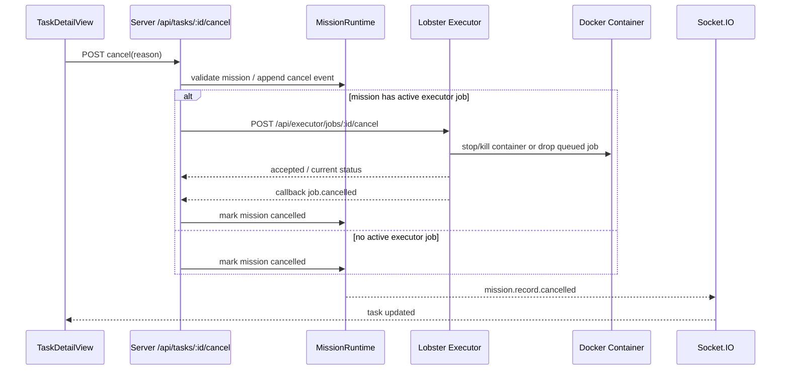

# Mission 取消控制 - 设计文档

## 概述

本设计为现有 Mission Runtime 与 Lobster Executor 补齐“取消任务”的控制链路。目标不是只补一个接口，而是建立从用户动作到 Docker 容器停止、再到 Mission 状态与 UI 回显的一致闭环。

系统边界如下：

- 前端：在任务详情页提供取消入口与状态反馈
- Server：提供 Mission 取消路由，协调 executor 与本地状态
- Executor：实现 job cancel，停止队列中或运行中的任务
- Shared contracts：补充 `cancelled` 终态和对应 Socket 事件

## 设计决策

### 1. Mission 使用独立 `cancelled` 终态

取消和失败的语义不同：

- `failed` 表示系统没有完成目标
- `cancelled` 表示操作者主动停止

因此本设计明确将 `cancelled` 加入 `MissionStatus`，并同步到：

- `shared/mission/contracts.ts`
- `shared/mission/socket.ts`
- `client/src/lib/tasks-store.ts`
- 状态标签、颜色和筛选逻辑

### 2. 取消采用“双阶段闭环”

当 Mission 已关联 executor job 时，取消流程分两段：

1. 服务端接受用户取消请求，向 executor 发起 cancel
2. executor 成功停止任务后回调 `job.cancelled`
3. 服务端据此将 Mission 落为 `cancelled`

对于尚未进入 executor 的 Mission，则直接本地落 `cancelled`。

这样可以保证：

- 真实运行中的 Docker 任务确实被停止
- Mission 终态与 executor 事实保持一致

### 3. 重复取消保持幂等

用户可能会：

- 双击按钮
- 因网络原因重复提交
- 在 Socket 更新到达前再次点击

因此服务端和 executor 都需要幂等：

- Mission 已终态时直接返回当前状态
- Executor job 已终态时直接返回当前 job

### 4. 取消不清理已有产物

取消属于运行控制，不属于清理动作。为了便于定位“为什么取消”以及“取消前跑到了哪里”，本设计要求保留：

- `executor.log`
- `events.jsonl`
- 已产生的 artifacts
- Mission timeline / events

## 架构



## 组件与接口设计

### 1. Shared Contract 扩展

#### `shared/mission/contracts.ts`

- `MISSION_STATUSES` 新增 `cancelled`
- `MissionStatus` 类型同步扩展
- `MissionRecord` 可选新增：
  - `cancelledAt?: number`
  - `cancelledBy?: string`
  - `cancelReason?: string`

说明：

- 这几个字段可以直接支撑 UI 展示和审计
- 不引入额外复杂对象，先保持 MVP 简洁

#### `shared/mission/socket.ts`

- `MISSION_SOCKET_TYPES` 新增 `recordCancelled: "mission.record.cancelled"`
- `MissionSocketRecordEvent["type"]` 联合类型纳入 `recordCancelled`

### 2. Server 侧取消路由

#### 新增路由

```http
POST /api/tasks/:id/cancel
Content-Type: application/json
```

请求体：

```json
{
  "reason": "Wrong input, stop current run",
  "requestedBy": "user",
  "source": "user"
}
```

响应体：

```json
{
  "ok": true,
  "task": { "...": "MissionRecord" },
  "cancelRequested": true,
  "executorCancelForwarded": true
}
```

行为：

- 读取 Mission
- 若 Mission 不存在，返回 404
- 若 Mission 已终态，直接返回当前 Mission
- 若存在活动 executor job，则调用 executor cancel
- 若不存在 executor job，则本地直接取消

### 3. MissionRuntime / MissionStore 扩展

#### 新增方法

- `MissionStore.markCancelled(id, reason?, requestedBy?, source?)`
- `MissionRuntime.cancelMission(id, input)`

`markCancelled()` 负责：

- `status = "cancelled"`
- 清理 `waitingFor`、`decision`
- 为当前进行中的 stage 收尾
- 追加 `MissionEvent`
- 持久化

`MissionRuntime.cancelMission()` 负责：

- 包装 store 调用
- 触发 Socket 广播

### 4. Executor 取消接口

#### `shared/executor/api.ts`

沿用现有保留路由：

```http
POST /api/executor/jobs/:id/cancel
```

响应建议：

```json
{
  "ok": true,
  "jobId": "job_xxx",
  "status": "cancelled",
  "accepted": true
}
```

#### `services/lobster-executor/src/service.ts`

新增能力：

- `cancel(jobId, input)` 方法
- queued job: 标记 `cancelled`，不进入 runner
- running job: 根据 record 中的运行句柄请求停止
- waiting job: 标记 `cancelled`

为此 `StoredJobRecord` 需要额外保存可取消运行上下文，例如：

- `cancelRequested?: boolean`
- `cancellation?: { requestedAt: string; reason?: string }`

#### `services/lobster-executor/src/docker-runner.ts`

运行中的取消实现建议：

- 在 record 上保存 `containerId`
- cancel 请求到达时：
  - 先尝试 `container.stop({ t: 10 })`
  - 超时后回退到 `container.kill({ signal: "SIGKILL" })`
- 统一产出 `job.cancelled`

### 5. Server 事件映射

`server/index.ts` 中 executor callback 处理需调整：

- `job.cancelled` -> `mission.status = cancelled`
- 不再落到 failed 分支
- 取消时写入 summary / detail

### 6. 前端交互设计

#### 入口位置

在 [TaskDetailView.tsx](c:/Users/2303670/Documents/cube-pets-office/client/src/components/tasks/TaskDetailView.tsx) 增加取消主操作按钮，优先放在任务头部状态区或主操作条。

#### 交互规则

- `queued` / `running` / `waiting`：可见
- `done` / `failed` / `cancelled`：隐藏
- 点击后弹出确认框
- 支持填写可选 reason
- 按钮在请求中显示 loading
- 成功后使用 Socket 或本地刷新更新 UI

#### 视觉反馈

- `cancelled` 使用独立状态色，不复用 failed 的危险红
- 推荐使用中性灰棕或石板色系，表达“已停止”而非“报错”

## 数据模型

### MissionRecord 扩展

```ts
interface MissionRecord {
  status: "queued" | "running" | "waiting" | "done" | "failed" | "cancelled";
  cancelledAt?: number;
  cancelledBy?: string;
  cancelReason?: string;
}
```

### MissionEvent 复用

不新增独立 event type，继续复用现有 `failed` / `progress` 并不合适。推荐新增：

```ts
"cancelled";
```

如果本阶段不扩展 `MISSION_EVENT_TYPES`，则至少需要用 `log` 并在 message 中注明取消来源。更推荐直接补齐 `cancelled` 事件类型，避免审计含义模糊。

## 错误处理

### 1. Executor 不可达

当 Mission 已关联活跃 executor job，但取消请求转发失败：

- 接口返回 502 或 503
- Mission 保持原状态
- 追加错误日志，提示用户稍后重试

不建议在 executor 不可达时直接本地标记为 `cancelled`，否则可能出现容器仍在运行但 UI 已显示取消。

### 2. Docker stop 超时

executor 侧应：

- 先 stop
- 超时后 kill
- 若最终仍失败，返回失败信息并保持原 job 状态不变

## 测试策略

### 服务端

- Mission 取消路由单测与集成测试
- `job.cancelled` -> Mission `cancelled` 映射测试
- 幂等取消测试

### Executor

- queued / running / waiting 三种状态取消测试
- Docker stop / kill 路径测试
- 已终态重复取消测试

### 前端

- 按钮显隐测试
- 取消对话框交互测试
- 取消后状态回显测试

## 依赖关系

本 spec 是 `mission-operator-actions` 的前置依赖。后续“终止”动作应复用本 spec 的 cancel 基础设施，而不是另起一套停止链路。
