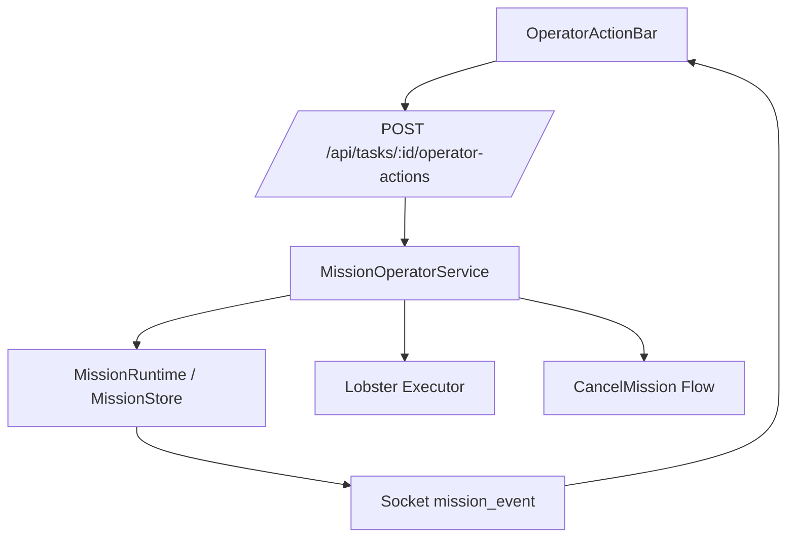

# Mission 操作动作栏 - 设计文档

## 概述

本设计围绕“任务控制台”建立一层独立于执行状态的操作平面。它不直接替代 `MissionStatus`，而是在现有 `queued/running/waiting/done/failed/cancelled` 状态之上补充可由人操作的 `operatorState` 与 `operatorActions`。

这样做的目的，是把“系统跑到了哪一步”和“操作者当前对任务施加了什么控制”分开表达。

## 设计决策

### 1. 用 `operatorState` 覆盖人工干预，而不是继续扩展 `MissionStatus`

如果把 `paused`、`blocked`、`terminating` 全部塞进 `MissionStatus`，会导致：

- 与现有 executor callback 事件难对齐
- 前端很多“是否终态”的逻辑变复杂
- `waiting`、`running`、`paused` 等概念混在同一层，表达会越来越乱

因此本设计采用：

- `MissionStatus`: 表示执行生命周期
- `MissionOperatorState`: 表示人工控制覆盖层

示例：

- `status = running`, `operatorState = paused`
- `status = waiting`, `operatorState = blocked`
- `status = failed`, `operatorState = active`

### 2. 统一单路由动作提交

不为每个动作单独设计路由，而是统一使用：

```http
POST /api/tasks/:id/operator-actions
```

请求体示例：

```json
{
  "action": "pause",
  "reason": "Wait for PM confirmation",
  "requestedBy": "user"
}
```

好处：

- 前后端接口一致
- 动作扩展时不需继续加碎片化路由
- 审计记录结构统一

### 3. `terminate` 复用 cancel 基础设施

`terminate` 本质是更强语义的停止动作，不应重做一套 executor 停止逻辑。因此：

- `terminate` 通过 operator-actions 路由进入
- server 内部转发到 `cancelMission(...)`
- 历史记录写为 `terminate`
- Mission 终态仍为 `cancelled`

### 4. Retry 作为“同一 Mission 的新尝试”

本设计不新建一条独立 Mission，而是在当前 Mission 上新增尝试编号。

新增字段建议：

- `attempt?: number`
- `attemptHistory?: MissionAttemptSummary[]`

这样用户仍在一个详情页里看完整上下文，符合“任务控制台”心智。

## 架构



## 数据模型

### 1. MissionRecord 扩展

```ts
type MissionOperatorState = "active" | "paused" | "blocked" | "terminating";

type MissionOperatorActionType =
  | "pause"
  | "resume"
  | "retry"
  | "mark-blocked"
  | "terminate";

interface MissionOperatorActionRecord {
  id: string;
  action: MissionOperatorActionType;
  requestedBy?: string;
  reason?: string;
  createdAt: number;
  result: "accepted" | "completed" | "rejected";
  detail?: string;
}

interface MissionRecord {
  operatorState?: MissionOperatorState;
  operatorActions?: MissionOperatorActionRecord[];
  blocker?: {
    reason: string;
    createdAt: number;
    createdBy?: string;
  };
  attempt?: number;
}
```

默认约定：

- 未设置时 `operatorState = active`
- `blocked` 时 `blocker` 必须存在

## 后端设计

### 1. MissionOperatorService

建议新增 `server/tasks/mission-operator-service.ts`，集中处理动作，不把逻辑散落在 route 与 runtime 中。

职责：

- 校验动作是否可用
- 执行状态转换
- 调用 executor 控制接口
- 记录 `operatorActions`
- 调用 MissionRuntime 持久化并广播

### 2. 状作动作可用性矩阵

| 当前状态         | operatorState | 可用动作                       |
| ---------------- | ------------- | ------------------------------ |
| queued           | active        | pause, mark-blocked, terminate |
| running          | active        | pause, mark-blocked, terminate |
| waiting          | active        | mark-blocked, terminate        |
| running          | paused        | resume, terminate              |
| queued           | paused        | resume, terminate              |
| any non-terminal | blocked       | resume, terminate              |
| failed           | active        | retry                          |
| cancelled        | active        | retry                          |

### 3. 动作执行语义

#### Pause

- queued: 标记 `operatorState = paused`，阻止继续分发
- running: 调用 executor pause 能力；若底层尚未支持容器 pause，则先落“控制层暂停”，同时阻止后续调度

#### Resume

- paused / blocked -> `operatorState = active`
- 如有 executor 对应 pause 状态，则调用 resume

#### Mark Blocked

- 写入 `operatorState = blocked`
- 写入 `blocker`
- 追加 operator action 记录

#### Retry

- 校验 Mission 处于可重试状态
- `attempt += 1`
- 清理当前终态字段和 blocker
- 重新进入 Mission 运行链路
- 保留历史 artifacts/events/operatorActions

#### Terminate

- `operatorState = terminating`
- 复用 cancel flow
- 最终 Mission 落 `cancelled`

## Executor 设计

### Pause / Resume 扩展

为了支持真正的运行控制，executor API 建议新增：

```http
POST /api/executor/jobs/:id/pause
POST /api/executor/jobs/:id/resume
```

运行中的 Docker 容器：

- pause -> `container.pause()`
- resume -> `container.unpause()`

queued job：

- pause -> 仅标记 paused，不进入 runner
- resume -> 回到 queued 并允许调度

若本阶段 executor 侧先只落控制层状态，也允许分步交付：

1. 先做 server/operatorState/UI 闭环
2. 再补 executor pause/resume 真控制

但最终验收目标仍是端到端可控。

## 前端设计

### 1. 新增 `OperatorActionBar`

建议位置：

- 任务详情页头部信息区下方
- 位于 Overview / Execution tabs 之前

内容：

- 主动作按钮组：Pause / Resume / Retry / Mark Blocked / Terminate
- 最新 blocker / latest operator action 摘要
- 风险提示与 loading 反馈

### 2. 表单交互

#### Pause / Resume / Retry

- 直接点击确认即可
- 若需要 reason，可用简易弹层

#### Mark Blocked

- 必填 reason
- 提交后第一屏显示 blocker 卡片

#### Terminate

- 二次确认
- 危险色按钮
- 支持填写原因

### 3. 状态可视化

页面应同时展示：

- 执行状态：running / waiting / failed / cancelled
- 操作状态：paused / blocked / terminating

推荐规则：

- 执行状态仍是主标签
- 操作状态作为附加 pill 展示

## API 设计

### `POST /api/tasks/:id/operator-actions`

请求：

```json
{
  "action": "mark-blocked",
  "reason": "Need API credential from user",
  "requestedBy": "user"
}
```

响应：

```json
{
  "ok": true,
  "action": {
    "action": "mark-blocked",
    "result": "completed"
  },
  "task": {}
}
```

错误：

- 404: Mission 不存在
- 409: 当前状态不允许该动作
- 400: 缺少必填 reason

## 测试策略

### 后端

- 动作可用性矩阵测试
- `mark-blocked` reason 必填测试
- `terminate` 复用 cancel flow 测试
- `retry` attempt 递增测试

### Executor

- pause/resume API 测试
- queued / running 两类 job 的控制测试

### 前端

- Action bar 按钮显隐测试
- blocker 卡片展示测试
- terminate 风险确认测试

## 交付策略

建议按两阶段落地：

1. 先完成 server/operatorState/UI 版本，至少让用户能看见并操作状态
2. 再补 executor pause/resume 真正的容器级控制

这样可以快速回应社区对“不能切状态”的反馈，同时不给底层执行链路带来一次性过大改动。
