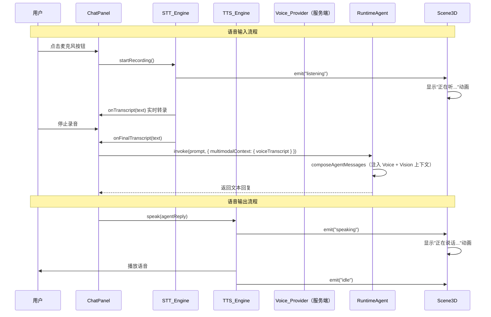

# 设计文档：多模态 Agent（Multi-Modal Agent）

## 概述

本设计在 multi-modal-vision（图片理解）基础上，为 Cube Pets Office 平台增加 TTS（语音输出）和 STT（语音输入）能力，并将 Vision + Voice 统一编排为完整的多模态 Agent 体验。核心思路：

1. 新增 TTS/STT 引擎抽象层，统一浏览器 Web Speech API 和服务端语音服务的调用接口
2. 在 ChatPanel/WorkflowPanel 中集成语音控件（麦克风按钮、TTS 开关、播放按钮）
3. 扩展 AgentInvokeOptions，新增 Multimodal_Context 统一聚合 Vision + Voice 上下文
4. 在 3D 场景中新增 "listening" 和 "speaking" 状态动画
5. 新增服务端 Voice API 路由（POST /api/voice/tts、POST /api/voice/stt）
6. 扩展动态组织的 Agent 能力标签，支持多模态能力优先选择

设计遵循现有架构模式：浏览器优先 + 服务端增强、渐进降级、通过环境变量配置切换。

## 架构

### 数据流



### 模块边界

```
┌──────────────────────────────────────────────────────┐
│                    前端层                              │
│  tts-engine.ts (TTS 抽象层：Browser / Server)         │
│  stt-engine.ts (STT 抽象层：Browser / Server)         │
│  ChatPanel.tsx (语音控件集成)                          │
│  WorkflowPanel.tsx (TTS 播放按钮)                     │
│  PetWorkers.tsx (listening/speaking 动画)              │
├──────────────────────────────────────────────────────┤
│                    共享层                              │
│  runtime-agent.ts (Multimodal_Context 扩展)           │
│  workflow-runtime.ts (AgentEvent voice 状态)           │
├──────────────────────────────────────────────────────┤
│                  服务端层                              │
│  voice-provider.ts (TTS/STT 服务封装)                 │
│  routes/voice.ts (POST /api/voice/tts, /stt)         │
│  ai-config.ts (Voice 配置读取)                        │
│  dynamic-organization.ts (多模态能力标签)              │
└──────────────────────────────────────────────────────┘
```

### 与 multi-modal-vision 的关系

```
multi-modal-vision (已有)          multi-modal-agent (本 Spec)
┌─────────────────────┐           ┌─────────────────────────┐
│ Vision Provider     │           │ Voice Provider (TTS/STT)│
│ VisionAnalysisResult│           │ TTS_Engine / STT_Engine  │
│ visionContexts      │──引用──→ │ Multimodal_Context       │
│ analyzing_image 动画 │           │ listening/speaking 动画  │
│ /api/vision/analyze │           │ /api/voice/tts, /stt    │
└─────────────────────┘           └─────────────────────────┘
```

Multimodal_Context 聚合 visionContexts（来自 multi-modal-vision 的 VisionContext[]）和 voiceTranscript，统一传递给 Agent invoke 层。

## 组件与接口

### 1. TTS 引擎抽象层（client/src/lib/tts-engine.ts）

统一浏览器 SpeechSynthesis 和服务端 TTS 的调用接口：

```typescript
export interface TTSEngineOptions {
  voice?: string;        // 语音名称或 ID
  rate?: number;         // 语速，默认 1.0
  pitch?: number;        // 音调，默认 1.0
  lang?: string;         // 语言，默认 'zh-CN'
}

export interface TTSEngine {
  readonly isAvailable: boolean;
  readonly isSpeaking: boolean;
  speak(text: string, options?: TTSEngineOptions): Promise<void>;
  pause(): void;
  resume(): void;
  stop(): void;
  onStateChange(callback: (state: 'speaking' | 'paused' | 'idle') => void): () => void;
}

export function createBrowserTTSEngine(): TTSEngine;
export function createServerTTSEngine(apiUrl: string): TTSEngine;
export function createTTSEngine(config: VoiceConfig): TTSEngine;
```

BrowserTTSEngine 实现：
- 使用 `window.speechSynthesis` API
- `speak()` 创建 `SpeechSynthesisUtterance`，返回 Promise 在 `onend` 时 resolve
- `isAvailable` 检查 `'speechSynthesis' in window`

ServerTTSEngine 实现：
- `speak()` 发送 POST /api/voice/tts，接收 audio/mpeg 响应
- 使用 `AudioContext` + `AudioBufferSourceNode` 播放音频
- `isAvailable` 通过 GET /api/voice/config 检查服务端 TTS 状态

### 2. STT 引擎抽象层（client/src/lib/stt-engine.ts）

统一浏览器 SpeechRecognition 和服务端 STT 的调用接口：

```typescript
export interface STTEngineCallbacks {
  onInterimTranscript: (text: string) => void;   // 实时中间结果
  onFinalTranscript: (text: string) => void;      // 最终结果
  onError: (error: string) => void;
  onStateChange: (state: 'listening' | 'idle') => void;
}

export interface STTEngine {
  readonly isAvailable: boolean;
  readonly isListening: boolean;
  startListening(callbacks: STTEngineCallbacks): Promise<void>;
  stopListening(): void;
}

export function createBrowserSTTEngine(lang?: string): STTEngine;
export function createServerSTTEngine(apiUrl: string, lang?: string): STTEngine;
export function createSTTEngine(config: VoiceConfig): STTEngine;
```

BrowserSTTEngine 实现：
- 使用 `webkitSpeechRecognition` 或 `SpeechRecognition` API
- `continuous = true`，`interimResults = true`
- 静默超时 3 秒自动停止（通过 `onresult` 事件的时间间隔检测）
- `isAvailable` 检查 `'SpeechRecognition' in window || 'webkitSpeechRecognition' in window`

ServerSTTEngine 实现：
- 使用 `MediaRecorder` API 录制 audio/webm 格式音频
- `stopListening()` 时将录制的音频 Blob 发送到 POST /api/voice/stt
- 不支持实时中间结果（onInterimTranscript 不触发），仅在停止时返回最终结果

### 3. Voice Provider 配置（server/core/voice-provider.ts）

服务端语音服务配置与调用封装：

```typescript
export interface VoiceConfig {
  tts: {
    available: boolean;
    apiUrl: string;
    apiKey: string;
    model: string;
    voice: string;
  };
  stt: {
    available: boolean;
    apiUrl: string;
    apiKey: string;
    model: string;
  };
}

export function getVoiceConfig(): VoiceConfig;

export async function synthesizeSpeech(
  text: string,
  voice?: string
): Promise<Buffer>;

export async function recognizeSpeech(
  audioBuffer: Buffer,
  mimeType?: string
): Promise<{ transcript: string }>;
```

配置读取逻辑：
- TTS: 从 `TTS_API_URL`、`TTS_API_KEY`、`TTS_MODEL`、`TTS_VOICE` 读取
- STT: 从 `STT_API_URL`、`STT_API_KEY`、`STT_MODEL` 读取
- 任一组环境变量缺失则标记对应服务为 `available: false`

### 4. 服务端语音 API 路由（server/routes/voice.ts）

```typescript
// POST /api/voice/tts
// Body: { text: string, voice?: string }
// Response: audio/mpeg binary stream
// Error: 501 (未配置) | 503 (服务不可用)

// POST /api/voice/stt
// Body: audio/webm binary (multipart/form-data, field: "audio")
// Response: { transcript: string }
// Error: 501 (未配置) | 503 (服务不可用)

// GET /api/voice/config
// Response: { tts: { available: boolean }, stt: { available: boolean } }
```

### 5. Multimodal_Context 扩展（shared/runtime-agent.ts）

```typescript
// 来自 multi-modal-vision 的类型（引用，不重新定义）
// interface VisionContext { imageName: string; visualDescription: string; }

export interface MultimodalContext {
  visionContexts?: VisionContext[];    // 来自 multi-modal-vision
  voiceTranscript?: string;            // 语音转录文本
  voiceLanguage?: string;              // 语音语言标识
}

export interface AgentInvokeOptions {
  workflowId?: string;
  stage?: string;
  multimodalContext?: MultimodalContext;
}
```

composeAgentMessages 扩展逻辑：
```typescript
// 在现有 context 注入之后、用户 prompt 之前：
// 1. 注入 visionContexts（已由 multi-modal-vision 实现）
// 2. 注入 voiceTranscript
if (options.multimodalContext?.voiceTranscript) {
  messages.push({
    role: "user",
    content: `[Voice Input] ${options.multimodalContext.voiceTranscript}`,
  });
}
// 3. 最后是用户 prompt
messages.push({ role: "user", content: prompt });
```

消息序列顺序：system → memory context → workflow context → visionContexts → voiceTranscript → user prompt

### 6. 3D 场景语音状态（client/src/components/three/PetWorkers.tsx）

STATUS_BUBBLES 扩展：
```typescript
'zh-CN': {
  listening: '正在听...\n请说出你的指令。',
  speaking: '正在说话...\n请稍等，我来念给你听。',
  // ... 现有状态
},
'en-US': {
  listening: 'Listening...\nGo ahead, I am all ears.',
  speaking: 'Speaking...\nHold on, let me read it out.',
  // ... 现有状态
},
```

animateWorker 新增动画类型：
```typescript
case 'listening':
  // "倾听"动画：头部微倾 + 轻微上下浮动
  group.rotation.z = baseRotation[2] + Math.sin(time * 0.8) * 0.1;
  group.position.y = basePosition[1] + Math.sin(time * 1.5) * 0.01;
  break;

case 'speaking':
  // "说话"动画：轻微点头 + 左右摇摆
  group.rotation.x = baseRotation[0] + Math.sin(time * 3) * 0.06;
  group.rotation.y = baseRotation[1] + Math.sin(time * 1.5) * 0.08;
  group.position.y = basePosition[1] + Math.abs(Math.sin(time * 4)) * 0.015;
  break;
```

### 7. ChatPanel 语音控件集成（client/src/components/ChatPanel.tsx）

在输入框区域新增：
- 麦克风按钮（STT）：位于输入框左侧，点击开始/停止录音
- TTS 开关：位于输入框右侧，toggle 全局 TTS 开关
- 录音指示器：录音时显示脉冲动画
- 播放按钮：TTS 开启时，每条 Agent 回复旁显示播放/停止按钮

状态管理（Zustand store 扩展）：
```typescript
// client/src/lib/store.ts 扩展
interface VoiceState {
  ttsEnabled: boolean;
  setTtsEnabled: (enabled: boolean) => void;
  sttAvailable: boolean;
  ttsAvailable: boolean;
  setSttAvailable: (available: boolean) => void;
  setTtsAvailable: (available: boolean) => void;
}
```

### 8. 动态组织多模态能力标签（server/core/dynamic-organization.ts）

扩展 Agent 能力标签系统：
```typescript
// AgentRecord 扩展（shared/workflow-runtime.ts）
export interface AgentRecord {
  // ... 现有字段
  capabilities?: string[];  // 如 ["vision", "tts", "stt"]
}
```

buildPlannerPrompt 扩展：在 Agent 目录摘要中包含能力标签：
```
Agent: 小明 (worker, 开发部) [vision, tts]
Agent: 小红 (worker, 设计部) [vision, stt]
```

inferTaskProfile 扩展：检测多模态关键词（"语音""朗读""图片""截图""看一下"），在任务 profile 中标记多模态需求。

## 数据模型

### VoiceConfig

| 字段 | 类型 | 必填 | 说明 |
|------|------|------|------|
| tts.available | boolean | ✅ | 服务端 TTS 是否可用 |
| tts.apiUrl | string | ✅ | TTS 服务 API 地址 |
| tts.apiKey | string | ✅ | TTS 服务 API 密钥 |
| tts.model | string | ✅ | TTS 模型名称 |
| tts.voice | string | ✅ | 默认语音名称 |
| stt.available | boolean | ✅ | 服务端 STT 是否可用 |
| stt.apiUrl | string | ✅ | STT 服务 API 地址 |
| stt.apiKey | string | ✅ | STT 服务 API 密钥 |
| stt.model | string | ✅ | STT 模型名称 |

### MultimodalContext

| 字段 | 类型 | 必填 | 说明 |
|------|------|------|------|
| visionContexts | VisionContext[] | ❌ | 视觉分析上下文（来自 multi-modal-vision） |
| voiceTranscript | string | ❌ | 语音转录文本 |
| voiceLanguage | string | ❌ | 语音语言标识（如 "zh-CN"） |

### AgentRecord 扩展

| 字段 | 类型 | 必填 | 说明 |
|------|------|------|------|
| capabilities | string[] | ❌ | Agent 能力标签列表，如 ["vision", "tts", "stt"] |

### 环境变量配置

| 变量 | 默认值 | 说明 |
|------|--------|------|
| TTS_API_URL | (空) | 服务端 TTS 服务 API 地址 |
| TTS_API_KEY | (空) | 服务端 TTS 服务 API 密钥 |
| TTS_MODEL | tts-1 | TTS 模型名称 |
| TTS_VOICE | alloy | 默认语音名称 |
| STT_API_URL | (空) | 服务端 STT 服务 API 地址 |
| STT_API_KEY | (空) | 服务端 STT 服务 API 密钥 |
| STT_MODEL | whisper-1 | STT 模型名称 |


## 正确性属性（Correctness Properties）

*属性（Property）是指在系统所有合法执行路径中都应成立的特征或行为——本质上是对系统应做之事的形式化陈述。属性是人类可读规格说明与机器可验证正确性保证之间的桥梁。*

### Property 1: Voice 配置解析与可用性标记

*For any* TTS_* 和 STT_* 环境变量组合，getVoiceConfig() 返回的配置应满足：当 TTS_API_URL 和 TTS_API_KEY 均存在时 tts.available 为 true，否则为 false；当 STT_API_URL 和 STT_API_KEY 均存在时 stt.available 为 true，否则为 false。所有已配置的环境变量值应正确映射到对应的配置字段。

**Validates: Requirements 7.1, 7.2, 7.3, 7.4**

### Property 2: 语音转录文本注入格式

*For any* 非空的 voiceTranscript 字符串，当通过 MultimodalContext 传递给 composeAgentMessages 时，生成的消息序列中应包含一条 role 为 "user"、content 以 "[Voice Input] " 为前缀且包含该 voiceTranscript 完整内容的消息。

**Validates: Requirements 5.2**

### Property 3: 多模态消息序列排序

*For any* 同时包含 visionContexts 和 voiceTranscript 的 MultimodalContext，composeAgentMessages 生成的消息序列中，所有 "[Vision Analysis]" 消息的索引应小于 "[Voice Input]" 消息的索引，且 "[Voice Input]" 消息的索引应小于最终用户 prompt 消息的索引。

**Validates: Requirements 5.3**

### Property 4: MultimodalContext 序列化 round-trip

*For any* 有效的 MultimodalContext 对象（包含任意组合的 visionContexts、voiceTranscript、voiceLanguage），JSON.stringify 后再 JSON.parse 应产生与原始对象深度相等的结果。

**Validates: Requirements 5.4**

### Property 5: 语音能力检测驱动 UI 可见性

*For any* 浏览器 API 支持状态（SpeechRecognition 可用/不可用、SpeechSynthesis 可用/不可用）和服务端配置状态（STT available/unavailable、TTS available/unavailable）的组合，STT 按钮可见性应等于 (browserSTT || serverSTT)，TTS 开关可见性应等于 (browserTTS || serverTTS)。

**Validates: Requirements 3.6, 3.7**

### Property 6: 语音状态气泡文案完整性

*For any* 语音相关状态（"listening"、"speaking"）和任意支持的 locale（"zh-CN"、"en-US"），getStatusBubble 函数应返回非空字符串。

**Validates: Requirements 4.2, 4.4**

### Property 7: 语音引擎错误恢复

*For any* TTS 或 STT 引擎实例，当底层服务调用抛出异常时，引擎应转换到 idle 状态并通过回调通知错误，而非向调用方抛出未捕获异常。

**Validates: Requirements 1.5, 2.7**

### Property 8: 多模态关键词检测

*For any* 包含多模态关键词（"语音""朗读""图片""截图""看一下"中的任意一个）的工作流指令字符串，inferTaskProfile 函数的输出应包含多模态需求标记。

**Validates: Requirements 6.1**

### Property 9: Planner Prompt 包含能力标签

*For any* 包含 capabilities 字段的 AgentRecord 集合，buildPlannerPrompt 生成的 prompt 字符串中应对每个具有非空 capabilities 的 Agent 包含其能力标签信息。

**Validates: Requirements 6.3**

### Property 10: Voice API 服务失败返回 503

*For any* POST /api/voice/tts 或 POST /api/voice/stt 请求，当底层语音服务调用抛出异常时，API 路由应返回 HTTP 503 状态码和包含错误描述的 JSON 响应体。

**Validates: Requirements 8.3**

## 错误处理

### TTS 引擎失败

| 场景 | 处理策略 |
|------|---------|
| 浏览器 SpeechSynthesis 不可用 | 检查服务端 TTS 配置，可用则使用服务端；均不可用则隐藏 TTS 控件 |
| 服务端 TTS API 超时（>10s） | 回退到浏览器 SpeechSynthesis；浏览器也不可用则静默降级为纯文本 |
| 服务端 TTS API 返回错误 | 记录错误日志，回退到浏览器 SpeechSynthesis |
| 音频播放失败 | 静默降级为纯文本，控制台记录错误 |

### STT 引擎失败

| 场景 | 处理策略 |
|------|---------|
| 浏览器 SpeechRecognition 不可用 | 检查服务端 STT 配置，可用则使用服务端；均不可用则隐藏麦克风按钮 |
| 麦克风权限被拒绝 | 显示权限提示 toast，禁用麦克风按钮 |
| 服务端 STT API 超时（>15s） | 回退到浏览器 SpeechRecognition；浏览器也不可用则显示错误提示 |
| 语音识别返回空结果 | 显示"未识别到语音"提示，保留输入框当前内容 |
| 录音过程中网络断开 | 如使用服务端 STT，自动切换到浏览器 STT 重新开始 |

### Voice API 路由失败

| 场景 | 处理策略 |
|------|---------|
| TTS/STT 环境变量未配置 | 返回 501 Not Implemented |
| 外部语音服务不可用 | 返回 503 Service Unavailable + 错误描述 |
| 请求体格式错误 | 返回 400 Bad Request + 校验错误信息 |
| 音频数据过大（>10MB） | 返回 413 Payload Too Large |

### 核心原则

**语音是增强，不是必需。** 所有语音相关的失败都应优雅降级：TTS 失败降级为纯文本显示，STT 失败保留手动输入。这与 multi-modal-vision 的"Vision 是增强"原则一致，确保核心工作流不受语音功能影响。

## 测试策略

### 双轨测试方法

本功能采用单元测试 + 属性测试的双轨策略：

- **单元测试**：验证具体示例、边界情况和错误条件
- **属性测试**：验证跨所有输入的通用属性

### 属性测试配置

- 使用 [fast-check](https://github.com/dubzzz/fast-check) 作为属性测试库（项目已使用 TypeScript + Vitest）
- 每个属性测试最少运行 100 次迭代
- 每个属性测试必须通过注释引用设计文档中的属性编号
- 标签格式：**Feature: multi-modal-agent, Property {number}: {property_text}**
- 每个正确性属性由一个独立的属性测试实现

### 单元测试覆盖

| 测试范围 | 测试内容 |
|---------|---------|
| TTS 引擎 | BrowserTTSEngine 和 ServerTTSEngine 的创建、speak/pause/stop 状态转换、fallback 逻辑 |
| STT 引擎 | BrowserSTTEngine 和 ServerSTTEngine 的创建、startListening/stopListening 状态转换、静默超时 |
| Voice 配置 | 各种环境变量组合的配置解析、可用性标记 |
| 多模态上下文 | composeAgentMessages 的 voiceTranscript 注入、消息排序 |
| Voice API 路由 | TTS/STT 路由的正常响应、错误响应（501/503）、请求体校验 |
| 3D 状态事件 | listening/speaking 事件的发出和恢复 |
| 动态组织 | 多模态关键词检测、能力标签在 planner prompt 中的包含 |
| 能力检测 | 浏览器 API 可用性检测、UI 控件可见性逻辑 |

### 属性测试覆盖

| 属性 | 测试文件 | 说明 |
|------|---------|------|
| Property 1 | voice-config.property.test.ts | Voice 配置解析与可用性标记 |
| Property 2 | multimodal-context.property.test.ts | 语音转录文本注入格式 |
| Property 3 | multimodal-context.property.test.ts | 多模态消息序列排序 |
| Property 4 | multimodal-context.property.test.ts | MultimodalContext round-trip |
| Property 5 | voice-capability.property.test.ts | 语音能力检测驱动 UI 可见性 |
| Property 6 | voice-status.property.test.ts | 语音状态气泡文案完整性 |
| Property 7 | voice-engine.property.test.ts | 语音引擎错误恢复 |
| Property 8 | multimodal-keywords.property.test.ts | 多模态关键词检测 |
| Property 9 | planner-capabilities.property.test.ts | Planner Prompt 包含能力标签 |
| Property 10 | voice-api.property.test.ts | Voice API 服务失败返回 503 |

### 测试文件位置

- 服务端测试：`server/tests/` 目录（voice-config、voice-api、planner-capabilities、multimodal-keywords）
- 共享层测试：`shared/__tests__/` 目录（multimodal-context）
- 前端测试：`client/src/lib/__tests__/` 目录（voice-capability、voice-status、voice-engine）
