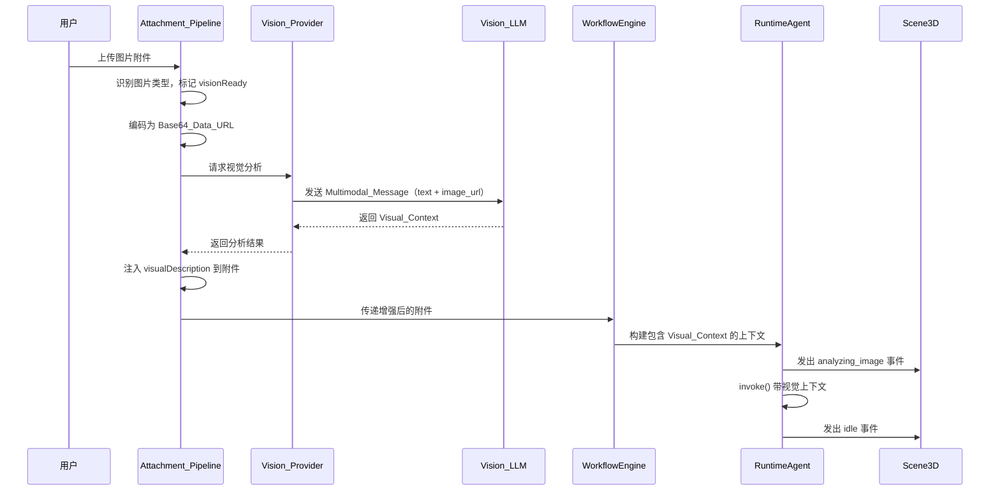

# 设计文档：多模态视觉能力（Multi-Modal Vision）

## 概述

本设计为 Cube Pets Office 平台增加 Vision 能力，使 Agent 能够"看懂"图片并基于视觉信息进行分析和推理。核心思路是：

1. 扩展现有附件管道，在图片识别后增加 Vision LLM 分析步骤
2. 扩展 LLMMessage 类型支持多模态消息格式（text + image_url）
3. 新增独立的 Vision LLM Provider 配置，复用现有重试/熔断机制
4. 将视觉分析结果作为结构化文本注入工作流上下文
5. 在 3D 场景中增加"看图"状态动画

设计遵循现有架构模式：通过 WorkflowRuntime 抽象接口解耦、附件管道渐进增强、LLM Provider 链式 fallback。

## 架构

### 数据流



### 模块边界

```
┌─────────────────────────────────────────────────┐
│                  前端层                           │
│  workflow-attachments.ts (扩展 Vision 处理)       │
│  PetWorkers.tsx (新增 analyzing_image 动画)       │
├─────────────────────────────────────────────────┤
│                  共享层                           │
│  workflow-input.ts (扩展 WorkflowInputAttachment) │
│  workflow-runtime.ts (扩展 LLMMessage 类型)       │
│  runtime-agent.ts (扩展上下文注入)                 │
├─────────────────────────────────────────────────┤
│                  服务端层                         │
│  vision-provider.ts (新增 Vision LLM 封装)        │
│  llm-client.ts (扩展多模态消息支持)               │
│  ai-config.ts (新增 Vision 配置读取)              │
└─────────────────────────────────────────────────┘
```

## 组件与接口

### 1. WorkflowInputAttachment 扩展（shared/workflow-input.ts）

在现有 `WorkflowInputAttachment` 接口上新增字段：

```typescript
export interface WorkflowInputAttachment {
  // ... 现有字段保持不变
  id: string;
  name: string;
  mimeType: string;
  size: number;
  content: string;
  excerpt: string;
  excerptStatus: WorkflowAttachmentExcerptStatus;

  // 新增 Vision 字段
  visionReady?: boolean; // 是否为可视觉分析的图片
  base64DataUrl?: string; // Base64 编码的 data URL
  visualDescription?: string; // Vision LLM 生成的视觉描述
}
```

`excerptStatus` 类型扩展：

```typescript
export type WorkflowAttachmentExcerptStatus =
  | "parsed"
  | "truncated"
  | "metadata_only"
  | "vision_analyzed" // Vision 分析完成
  | "vision_fallback"; // Vision 失败，回退到 OCR
```

### 2. LLMMessage 多模态扩展（shared/workflow-runtime.ts）

```typescript
export type LLMMessageContentPart =
  | { type: "text"; text: string }
  | {
      type: "image_url";
      image_url: { url: string; detail?: "low" | "high" | "auto" };
    };

export interface LLMMessage {
  role: "system" | "user" | "assistant";
  content: string | LLMMessageContentPart[];
}
```

关键设计决策：`content` 使用联合类型 `string | LLMMessageContentPart[]`，保持向后兼容。现有所有使用 `message.content` 作为 string 的代码无需修改，只有 Vision 相关路径会使用数组格式。

### 3. Vision Provider（server/core/vision-provider.ts）

新增独立模块，封装 Vision LLM 调用逻辑：

```typescript
export interface VisionAnalysisResult {
  description: string; // 图片整体描述
  elements: string[]; // 关键视觉元素列表
  textContent: string; // 图片中识别到的文字
  rawResponse: string; // LLM 原始响应
}

export interface VisionProviderConfig {
  apiKey: string;
  baseUrl: string;
  model: string;
  wireApi: "responses" | "chat_completions";
  maxTokens: number;
  detail: "low" | "high" | "auto";
  timeoutMs: number;
}

export function getVisionConfig(): VisionProviderConfig;
export function analyzeImage(
  base64DataUrl: string,
  prompt?: string
): Promise<VisionAnalysisResult>;
export function analyzeImages(
  images: Array<{ base64DataUrl: string; name: string }>,
  prompt?: string
): Promise<Map<string, VisionAnalysisResult>>;
```

配置优先级链：`VISION_LLM_*` → `FALLBACK_LLM_*` → 主 `LLM_*`

### 4. LLM Client 多模态支持（server/core/llm-client.ts）

扩展 `createChatCompletion` 和 `createResponse` 函数，支持 `LLMMessage.content` 为数组格式：

- `chat_completions` API：直接传递 content 数组
- `responses` API：将 `image_url` 条目转换为 `input_image` 格式

```typescript
// responses API 的 input 格式转换
function buildResponsesInput(messages: LLMMessage[]) {
  // 现有逻辑处理 string content
  // 新增：当 content 为数组时，映射为 responses API 格式
  // { type: "input_text", text } → 保持不变
  // { type: "image_url", image_url: { url } } → { type: "input_image", image_url: url }
}
```

### 5. 附件管道扩展（client/src/lib/workflow-attachments.ts）

在现有 `parseImageFile` 函数基础上增加 Vision 分析路径：

```typescript
async function parseImageFile(file: File): Promise<WorkflowInputAttachment> {
  // 1. 编码为 Base64 Data URL
  const base64DataUrl = await fileToBase64DataUrl(file);

  // 2. 尝试 Vision 分析
  try {
    const visionResult = await requestVisionAnalysis(base64DataUrl, file.name);
    return finalizeAttachment(file, visionResult.description, "parsed", {
      visionReady: true,
      base64DataUrl,
      visualDescription: formatVisualContext(visionResult),
    });
  } catch {
    // 3. Fallback 到 OCR
    return existingOcrPath(file);
  }
}
```

注意：浏览器端的 Vision 分析需要通过服务端代理（POST /api/vision/analyze），因为 Vision LLM 的 API Key 不应暴露在前端。对于纯前端模式（browser-runtime），如果用户配置了前端 LLM 且该模型支持 Vision，则可直接在浏览器端调用。

### 6. Agent 上下文注入（shared/runtime-agent.ts）

扩展 `composeAgentMessages` 函数：

```typescript
export function composeAgentMessages(
  config: RuntimeAgentConfig,
  prompt: string,
  memoryRepo: MemoryRepository,
  context: string[] = [],
  options: AgentInvokeOptions = {},
  jsonMode: boolean = false
): LLMMessage[] {
  // ... 现有逻辑

  // 新增：注入视觉上下文
  if (options.visionContexts?.length) {
    for (const vc of options.visionContexts) {
      messages.push({
        role: "user",
        content: `[Vision Analysis] ${vc.imageName}\n${vc.visualDescription}`,
      });
    }
  }

  messages.push({ role: "user", content: prompt });
  return messages;
}
```

### 7. 3D 场景状态扩展（client/src/components/three/PetWorkers.tsx）

新增 `analyzing_image` 状态：

```typescript
// STATUS_BUBBLES 扩展
'zh-CN': {
  analyzing_image: '正在看图...\n让我仔细看看这张图。',
  // ... 现有状态
},
'en-US': {
  analyzing_image: 'Analyzing image...\nLet me take a closer look.',
  // ... 现有状态
},

// animateWorker 新增 'examining' 动画类型
case 'examining':
  // 模拟"仔细端详"的动作：轻微前倾 + 左右扫视
  group.rotation.x = baseRotation[0] + Math.sin(time * 1.2) * 0.08;
  group.rotation.y = baseRotation[1] + Math.sin(time * 0.6) * 0.15;
  group.position.y = basePosition[1] + Math.sin(time * 2) * 0.01;
  break;
```

### 8. Vision 分析 API 路由（server/routes/vision.ts）

新增服务端路由，供前端调用：

```typescript
// POST /api/vision/analyze
// Body: { images: Array<{ base64DataUrl: string; name: string }>, prompt?: string }
// Response: { results: Array<{ name: string; analysis: VisionAnalysisResult }> }
```

## 数据模型

### WorkflowInputAttachment（扩展后）

| 字段              | 类型    | 必填 | 说明                       |
| ----------------- | ------- | ---- | -------------------------- |
| id                | string  | ✅   | 附件唯一标识               |
| name              | string  | ✅   | 文件名                     |
| mimeType          | string  | ✅   | MIME 类型                  |
| size              | number  | ✅   | 文件大小（字节）           |
| content           | string  | ✅   | 解析后的文本内容           |
| excerpt           | string  | ✅   | 摘要文本                   |
| excerptStatus     | string  | ✅   | 解析状态                   |
| visionReady       | boolean | ❌   | 是否可进行视觉分析         |
| base64DataUrl     | string  | ❌   | Base64 编码的图片 data URL |
| visualDescription | string  | ❌   | Vision LLM 生成的视觉描述  |

### VisionAnalysisResult

| 字段        | 类型     | 必填 | 说明               |
| ----------- | -------- | ---- | ------------------ |
| description | string   | ✅   | 图片整体描述       |
| elements    | string[] | ✅   | 关键视觉元素列表   |
| textContent | string   | ✅   | 图片中识别到的文字 |
| rawResponse | string   | ✅   | LLM 原始响应文本   |

### VisionProviderConfig

| 字段      | 类型                              | 必填 | 说明                |
| --------- | --------------------------------- | ---- | ------------------- |
| apiKey    | string                            | ✅   | Vision LLM API Key  |
| baseUrl   | string                            | ✅   | Vision LLM Base URL |
| model     | string                            | ✅   | Vision LLM 模型名称 |
| wireApi   | "responses" \| "chat_completions" | ✅   | API 协议类型        |
| maxTokens | number                            | ✅   | 最大输出 Token 数   |
| detail    | "low" \| "high" \| "auto"         | ✅   | 图片分析精度        |
| timeoutMs | number                            | ✅   | 超时时间（毫秒）    |

### LLMMessageContentPart

| 变体      | 字段                                                               | 说明                             |
| --------- | ------------------------------------------------------------------ | -------------------------------- |
| text      | { type: "text", text: string }                                     | 文本内容                         |
| image_url | { type: "image_url", image_url: { url: string, detail?: string } } | 图片 URL（支持 base64 data URL） |

### 环境变量配置

| 变量                  | 默认值                       | 说明                          |
| --------------------- | ---------------------------- | ----------------------------- |
| VISION_LLM_API_KEY    | (空，回退到 FALLBACK/主 LLM) | Vision LLM API Key            |
| VISION_LLM_BASE_URL   | (空，回退到 FALLBACK/主 LLM) | Vision LLM Base URL           |
| VISION_LLM_MODEL      | (空，回退到 FALLBACK/主 LLM) | Vision LLM 模型名称           |
| VISION_LLM_WIRE_API   | chat_completions             | API 协议类型                  |
| VISION_LLM_MAX_TOKENS | 1000                         | 单次分析最大输出 Token        |
| VISION_LLM_DETAIL     | low                          | 图片分析精度（low/high/auto） |
| VISION_LLM_TIMEOUT_MS | 30000                        | 单次分析超时时间              |

## 正确性属性（Correctness Properties）

_属性（Property）是指在系统所有合法执行路径中都应成立的特征或行为——本质上是对系统应做之事的形式化陈述。属性是人类可读规格说明与机器可验证正确性保证之间的桥梁。_

### Property 1: 图片类型检测准确性

_For any_ 文件，当其扩展名为 jpg、jpeg、png 或 webp，或其 MIME 类型以 "image/" 开头且属于支持的格式时，经过 Attachment_Pipeline 处理后的 WorkflowInputAttachment 的 visionReady 字段应为 true；对于非图片文件，visionReady 应为 false 或 undefined。

**Validates: Requirements 1.1**

### Property 2: Base64 编码 round-trip

_For any_ 有效的图片二进制数据，将其编码为 Base64_Data_URL 后再解码，应得到与原始数据完全相同的二进制内容。

**Validates: Requirements 1.2**

### Property 3: 大图压缩后尺寸约束

_For any_ 大小超过阈值（默认 4MB）的图片文件，经过压缩/降采样处理后生成的 Base64_Data_URL 对应的原始数据大小应不超过该阈值。

**Validates: Requirements 1.3**

### Property 4: Vision 配置解析与 Fallback 链

_For any_ 环境变量组合（VISION*LLM*_、FALLBACK*LLM*_、LLM*\*），getVisionConfig() 返回的配置应遵循优先级链：当 VISION_LLM*_ 存在时使用 VISION*LLM*_ 值；当 VISION*LLM*_ 缺失但 FALLBACK*LLM*_ 存在时使用 FALLBACK*LLM*_ 值；当两者均缺失时使用主 LLM\__ 值。maxTokens 字段应反映 VISION_LLM_MAX_TOKENS 的值（或默认值 1000）。

**Validates: Requirements 2.1, 2.2, 7.1**

### Property 5: 多模态消息格式转换

_For any_ 包含 text 和 image_url 条目的 LLMMessage，当 wireApi 为 "chat_completions" 时，构建的请求体中 message.content 应直接包含该数组；当 wireApi 为 "responses" 时，image_url 条目应被转换为 input_image 格式，text 条目应被转换为 input_text 格式。

**Validates: Requirements 3.1, 3.2, 3.3**

### Property 6: 多模态消息序列化 round-trip

_For any_ 有效的 LLMMessage（content 为 string 或 LLMMessageContentPart 数组），JSON.stringify 后再 JSON.parse 应产生与原始对象深度相等的结果。

**Validates: Requirements 3.4**

### Property 7: 视觉描述存储一致性

_For any_ VisionAnalysisResult，当其被存储到 WorkflowInputAttachment 时，visualDescription 字段应包含 description、elements 和 textContent 的格式化内容，且 content 字段应被更新为 visualDescription 的文本摘要。

**Validates: Requirements 4.2**

### Property 8: 指令上下文包含视觉分析

_For any_ 包含 visualDescription 的 WorkflowInputAttachment 列表，buildWorkflowDirectiveContext 的输出应对每个有 visualDescription 的附件包含 "[Vision Analysis] {name}" 标记及其 visualDescription 内容。

**Validates: Requirements 4.3**

### Property 9: Agent 消息序列中视觉上下文的注入与排序

_For any_ 包含视觉上下文的 AgentInvokeOptions，composeAgentMessages 生成的消息序列中应包含所有 Visual_Context 作为独立的 user message，且这些 Visual_Context 消息应位于最终用户 prompt 消息之前。

**Validates: Requirements 5.1, 5.2**

### Property 10: 视觉上下文触发 maxTokens 增加

_For any_ 包含视觉上下文的 Agent 调用，LLM 调用选项中的 maxTokens 应比无视觉上下文时增加（默认增加 1000 tokens）。

**Validates: Requirements 5.3**

### Property 11: 多图分析时 detail 参数约束

_For any_ 包含多张图片的分析请求，当 VISION_LLM_DETAIL 未显式设置为 "high" 或 "auto" 时，所有 image_url 的 detail 参数应为 "low"。

**Validates: Requirements 7.2**

## 错误处理

### Vision LLM 调用失败

| 场景                     | 处理策略                                                                       |
| ------------------------ | ------------------------------------------------------------------------------ |
| Vision LLM 超时（>30s）  | 终止当前图片分析，回退到 OCR 文字提取，记录 excerptStatus 为 "vision_fallback" |
| Vision LLM 返回 4xx 错误 | 记录错误日志，回退到 OCR，不触发熔断（可能是模型不支持 Vision）                |
| Vision LLM 返回 5xx 错误 | 触发现有熔断机制，尝试 fallback provider，最终回退到 OCR                       |
| Vision LLM 返回空响应    | 视为分析失败，回退到 OCR                                                       |
| 所有 Provider 均不可用   | 所有图片回退到 OCR，工作流正常继续（降级但不中断）                             |

### 图片处理失败

| 场景             | 处理策略                                             |
| ---------------- | ---------------------------------------------------- |
| Base64 编码失败  | 回退到 OCR，记录 "vision_fallback"                   |
| 图片压缩失败     | 尝试使用原始图片（如果在大小限制内），否则回退到 OCR |
| 不支持的图片格式 | 不标记 visionReady，走现有 OCR 路径                  |

### 多图部分失败

当多张图片同时分析时，每张图片独立处理错误。某张图片分析失败不影响其他图片的 Vision 分析。失败的图片单独回退到 OCR。

### 核心原则

**Vision 是增强，不是必需。** 所有 Vision 相关的失败都应优雅降级到 OCR 文字提取，绝不中断工作流执行。这与现有附件系统的容错设计一致。

## 测试策略

### 双轨测试方法

本功能采用单元测试 + 属性测试的双轨策略：

- **单元测试**：验证具体示例、边界情况和错误条件
- **属性测试**：验证跨所有输入的通用属性

### 属性测试配置

- 使用 [fast-check](https://github.com/dubzzz/fast-check) 作为属性测试库（项目已使用 TypeScript + Vitest）
- 每个属性测试最少运行 100 次迭代
- 每个属性测试必须通过注释引用设计文档中的属性编号
- 标签格式：**Feature: multi-modal-vision, Property {number}: {property_text}**
- 每个正确性属性由一个独立的属性测试实现

### 单元测试覆盖

| 测试范围     | 测试内容                               |
| ------------ | -------------------------------------- |
| 图片类型检测 | 各种 MIME 类型和扩展名的识别           |
| Base64 编码  | 正常编码、空文件、大文件               |
| Vision 配置  | 各种环境变量组合的配置解析             |
| 多模态消息   | chat_completions 和 responses 格式转换 |
| 上下文注入   | 视觉上下文在消息序列中的位置           |
| 错误降级     | Vision 失败回退到 OCR 的各种场景       |
| 3D 状态事件  | analyzing_image 事件的发出和恢复       |

### 属性测试覆盖

| 属性        | 测试文件                            | 说明                   |
| ----------- | ----------------------------------- | ---------------------- |
| Property 1  | vision-detection.property.test.ts   | 图片类型检测准确性     |
| Property 2  | base64-encoding.property.test.ts    | Base64 round-trip      |
| Property 3  | image-compression.property.test.ts  | 大图压缩约束           |
| Property 4  | vision-config.property.test.ts      | 配置解析与 fallback    |
| Property 5  | multimodal-message.property.test.ts | 消息格式转换           |
| Property 6  | multimodal-message.property.test.ts | 消息序列化 round-trip  |
| Property 7  | visual-context.property.test.ts     | 视觉描述存储           |
| Property 8  | directive-context.property.test.ts  | 指令上下文包含视觉分析 |
| Property 9  | agent-messages.property.test.ts     | 视觉上下文注入与排序   |
| Property 10 | agent-messages.property.test.ts     | maxTokens 增加         |
| Property 11 | vision-detail.property.test.ts      | 多图 detail 参数       |

### 测试文件位置

所有测试文件放在 `server/tests/` 目录下，与现有测试保持一致。前端相关的属性测试（如 Base64 编码）可放在 `client/src/lib/__tests__/` 目录下。
