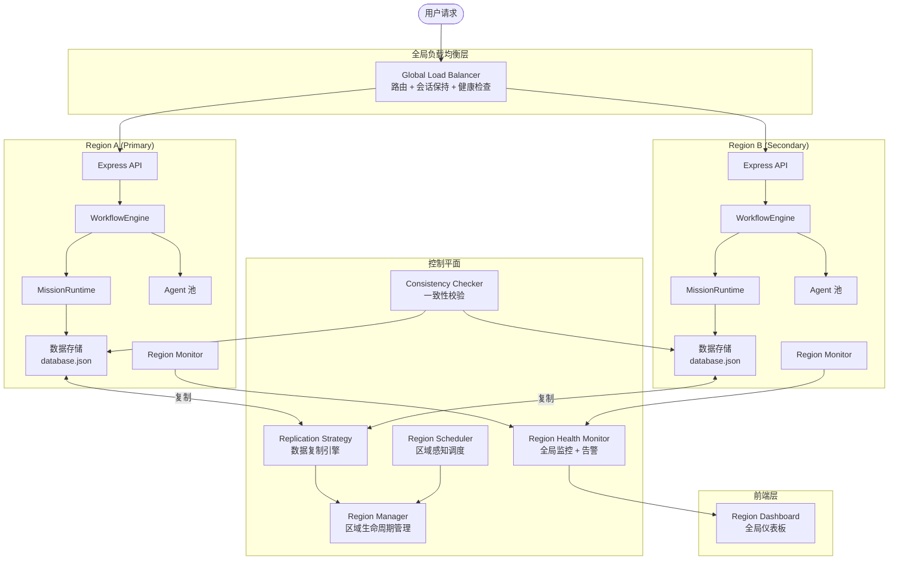

# 多区域灾难恢复系统 设计文档

## 概述

多区域灾难恢复系统为 Cube Pets Office 平台提供跨地理区域的高可用性和灾难恢复能力。系统在现有单区域架构之上引入 Region 抽象层，通过 Region Manager、Replication Strategy、Region Scheduler、Global Load Balancer 和 Region Health Monitor 五大核心组件，实现数据复制、区域感知调度、负载均衡、自动故障转移和实时监控。

设计遵循以下原则：

- **渐进式集成**：不破坏现有 WorkflowEngine、MissionRuntime 等模块，通过适配器模式接入
- **最终一致性优先**：默认采用最终一致性模型，关键数据可选强一致性
- **故障域隔离**：各区域资源完全独立，单区域故障不影响其他区域
- **可观测性**：全链路指标采集、告警和仪表板

## 系统架构



## 组件与接口

### 1. Region Manager（区域管理器）

负责区域的生命周期管理、配置中心和资源隔离。

```typescript
// shared/region/contracts.ts

export type RegionTier = "primary" | "secondary" | "tertiary";
export type RegionStatus = "healthy" | "degraded" | "unavailable";
export type ReplicationMode =
  | "primary-secondary"
  | "multi-master"
  | "eventual-consistency";
export type ReplicationDirection = "one-way" | "bidirectional";
export type ConflictResolutionStrategy =
  | "primary-wins"
  | "timestamp"
  | "custom";
export type SchedulingStrategy =
  | "nearest"
  | "lowest-latency"
  | "load-balanced"
  | "affinity";
export type LoadBalancerAlgorithm =
  | "round-robin"
  | "least-connections"
  | "weighted";

export interface RegionConfig {
  regionId: string;
  name: string;
  location: { lat: number; lng: number };
  tier: RegionTier;
  status: RegionStatus;
  capacity: RegionCapacity;
}

export interface RegionCapacity {
  maxAgents: number;
  maxStorageMB: number;
  maxQPS: number;
  currentAgents: number;
  currentStorageMB: number;
  currentQPS: number;
}

export interface ReplicationConfig {
  mode: ReplicationMode;
  direction: ReplicationDirection;
  maxLagMs: number;
  conflictResolution: ConflictResolutionStrategy;
  bandwidthLimitMBps: number;
}

export interface MultiRegionConfig {
  regions: RegionConfig[];
  replication: ReplicationConfig;
  localRegionId: string;
}

export interface RegionQuota {
  regionId: string;
  tenantId: string;
  maxAgents: number;
  maxStorageMB: number;
  maxQPS: number;
  usedAgents: number;
  usedStorageMB: number;
  usedQPS: number;
}
```

```typescript
// server/region/region-manager.ts

export interface IRegionManager {
  /** 初始化多区域部署 */
  initializeMultiRegion(config: MultiRegionConfig): Promise<InitResult>;

  /** 获取所有区域配置 */
  getRegions(): RegionConfig[];

  /** 获取指定区域配置 */
  getRegion(regionId: string): RegionConfig | undefined;

  /** 更新区域状态 */
  updateRegionStatus(regionId: string, status: RegionStatus): void;

  /** 获取主区域 */
  getPrimaryRegion(): RegionConfig;

  /** 获取全局配置 */
  getGlobalConfig(): MultiRegionConfig;

  /** 获取区域配额 */
  getQuota(regionId: string, tenantId: string): RegionQuota;

  /** 更新区域配额 */
  updateQuota(
    regionId: string,
    tenantId: string,
    quota: Partial<RegionQuota>
  ): void;

  /** 检查配额是否允许操作 */
  checkQuota(
    regionId: string,
    tenantId: string,
    resource: "agents" | "storage" | "qps"
  ): boolean;
}

export interface InitResult {
  success: boolean;
  regions: RegionConfig[];
  errors?: string[];
}
```

### 2. Replication Strategy（复制策略引擎）

负责数据在区域间的复制、binlog 记录和冲突解决。

```typescript
// shared/region/replication.ts

export interface BinlogEntry {
  id: string;
  regionId: string;
  timestamp: number;
  operation: "create" | "update" | "delete";
  collection: string; // agents | workflows | missions | knowledge
  documentId: string;
  version: number;
  data: unknown;
  checksum: string;
}

export interface ConflictRecord {
  id: string;
  timestamp: number;
  collection: string;
  documentId: string;
  localVersion: {
    regionId: string;
    version: number;
    data: unknown;
    timestamp: number;
  };
  remoteVersion: {
    regionId: string;
    version: number;
    data: unknown;
    timestamp: number;
  };
  resolution: ConflictResolutionStrategy;
  resolvedData: unknown;
  resolvedBy: "auto" | "manual";
}

export interface ReplicationStatus {
  sourceRegionId: string;
  targetRegionId: string;
  lagMs: number;
  lastSyncTimestamp: number;
  pendingEntries: number;
  status: "syncing" | "idle" | "error";
}
```

```typescript
// server/region/replication-engine.ts

export interface IReplicationEngine {
  /** 记录写操作到 binlog */
  recordChange(entry: Omit<BinlogEntry, "id" | "checksum">): BinlogEntry;

  /** 将 binlog 条目复制到目标区域 */
  replicateTo(
    targetRegionId: string,
    entries: BinlogEntry[]
  ): Promise<ReplicateResult>;

  /** 获取指定时间戳之后的增量 binlog */
  getIncrementalChanges(sinceTimestamp: number): BinlogEntry[];

  /** 解决冲突 */
  resolveConflict(conflict: ConflictRecord): ConflictRecord;

  /** 手动解决冲突 */
  manualResolveConflict(
    conflictId: string,
    chosenRegionId: string
  ): ConflictRecord;

  /** 获取复制状态 */
  getReplicationStatus(): ReplicationStatus[];

  /** 获取冲突日志 */
  getConflictLog(limit?: number): ConflictRecord[];
}

export interface ReplicateResult {
  success: boolean;
  entriesApplied: number;
  conflicts: ConflictRecord[];
  errors?: string[];
}
```

### 3. Region Scheduler（区域感知调度器）

负责根据策略选择最优区域执行任务。

```typescript
// shared/region/scheduling.ts

export interface SchedulingConfig {
  strategy: SchedulingStrategy;
  preferences: string[]; // 优先区域 ID 列表
  constraints: SchedulingConstraint[];
  failoverPolicy: FailoverPolicy;
  costAware: boolean;
}

export interface SchedulingConstraint {
  type: "region-required" | "region-excluded" | "min-capacity" | "max-latency";
  value: string | number;
}

export interface FailoverPolicy {
  maxRetries: number;
  retryDelayMs: number;
  fallbackRegions: string[];
}

export interface SchedulingDecision {
  selectedRegionId: string;
  strategy: SchedulingStrategy;
  reason: string;
  latencyMs: number;
  alternatives: Array<{ regionId: string; score: number }>;
  timestamp: number;
}
```

```typescript
// server/region/region-scheduler.ts

export interface IRegionScheduler {
  /** 选择最优区域 */
  selectRegion(
    config: SchedulingConfig,
    userLocation?: { lat: number; lng: number }
  ): SchedulingDecision;

  /** 计算到各区域的延迟 */
  calculateLatencies(userLocation: {
    lat: number;
    lng: number;
  }): Map<string, number>;

  /** 获取区域负载评分 */
  getRegionScores(): Map<string, number>;

  /** 执行故障转移 */
  failover(failedRegionId: string, policy: FailoverPolicy): SchedulingDecision;
}
```

### 4. Global Load Balancer（全局负载均衡器）

负责在多个区域间分配请求流量。

```typescript
// shared/region/load-balancer.ts

export interface LoadBalancerConfig {
  algorithm: LoadBalancerAlgorithm;
  healthCheck: HealthCheckConfig;
  sessionAffinity: boolean;
  weights: Record<string, number>; // regionId -> weight
}

export interface HealthCheckConfig {
  intervalMs: number;
  timeoutMs: number;
  unhealthyThreshold: number;
  healthyThreshold: number;
  path: string;
}

export interface RoutingDecision {
  targetRegionId: string;
  algorithm: LoadBalancerAlgorithm;
  sessionId?: string;
  reason: string;
  timestamp: number;
}
```

```typescript
// server/region/global-load-balancer.ts

export interface IGlobalLoadBalancer {
  /** 路由请求到目标区域 */
  route(request: {
    sessionId?: string;
    userLocation?: { lat: number; lng: number };
  }): RoutingDecision;

  /** 更新区域权重 */
  updateWeights(weights: Record<string, number>): void;

  /** 标记区域为不可用 */
  markUnavailable(regionId: string): void;

  /** 标记区域为可用 */
  markAvailable(regionId: string): void;

  /** 获取当前负载分布 */
  getLoadDistribution(): Record<
    string,
    { weight: number; activeConnections: number; qps: number }
  >;
}
```

### 5. Region Health Monitor（区域健康监控器）

负责健康检查、指标采集和告警。

```typescript
// shared/region/monitoring.ts

export interface RegionMetrics {
  regionId: string;
  timestamp: number;
  health: RegionStatus;
  cpu: number; // 0-100
  memory: number; // 0-100
  qps: number;
  errorRate: number; // 0-1
  replicationLagMs: number;
  activeWorkflows: number;
  activeAgents: number;
}

export interface AlertRule {
  id: string;
  name: string;
  condition: string; // e.g. "replicationLagMs > 5000"
  severity: "info" | "warning" | "critical";
  actions: AlertAction[];
}

export interface AlertAction {
  type: "log" | "socket" | "webhook";
  target: string;
}

export interface Alert {
  id: string;
  ruleId: string;
  regionId: string;
  severity: "info" | "warning" | "critical";
  message: string;
  impact: string;
  suggestedAction: string;
  timestamp: number;
  resolved: boolean;
}

export interface ConsistencyCheckResult {
  timestamp: number;
  regionsChecked: string[];
  inconsistencies: Array<{
    collection: string;
    documentId: string;
    regions: Array<{ regionId: string; version: number; checksum: string }>;
    autoRepaired: boolean;
  }>;
  status: "consistent" | "repaired" | "inconsistent";
}
```

```typescript
// server/region/region-health-monitor.ts

export interface IRegionHealthMonitor {
  /** 启动健康检查循环 */
  start(intervalMs: number): void;

  /** 停止健康检查 */
  stop(): void;

  /** 获取区域指标 */
  getMetrics(regionId: string): RegionMetrics | undefined;

  /** 获取所有区域指标 */
  getAllMetrics(): RegionMetrics[];

  /** 添加告警规则 */
  addAlertRule(rule: AlertRule): void;

  /** 获取活跃告警 */
  getActiveAlerts(): Alert[];

  /** 执行一致性检查 */
  runConsistencyCheck(): Promise<ConsistencyCheckResult>;

  /** 获取成本报告 */
  getCostReport(options?: { regionId?: string; tenantId?: string }): CostReport;
}

export interface CostReport {
  timestamp: number;
  totalCost: number;
  byRegion: Record<
    string,
    { compute: number; storage: number; network: number }
  >;
  byTenant: Record<string, number>;
  optimizationSuggestions: string[];
}
```

### 6. Migration Tool（迁移工具）

```typescript
// server/region/migration-tool.ts

export interface IMigrationTool {
  /** 执行从单区域到多区域的迁移 */
  migrate(
    sourceRegionId: string,
    targetRegions: RegionConfig[]
  ): Promise<MigrationResult>;

  /** 验证迁移后的数据一致性 */
  verify(): Promise<ConsistencyCheckResult>;

  /** 回滚迁移 */
  rollback(): Promise<RollbackResult>;

  /** 执行灾难恢复演练 */
  drillRecovery(targetRegionId: string): Promise<DrillResult>;
}

export interface MigrationResult {
  success: boolean;
  migratedCollections: string[];
  totalDocuments: number;
  durationMs: number;
  errors?: string[];
}

export interface RollbackResult {
  success: boolean;
  restoredRegionId: string;
  durationMs: number;
}

export interface DrillResult {
  success: boolean;
  rtoActualMs: number;
  rpoActualMs: number;
  steps: Array<{
    name: string;
    status: "passed" | "failed";
    durationMs: number;
  }>;
}
```

### 7. REST API 路由

```typescript
// server/routes/region.ts

// GET  /api/regions                    — 获取所有区域列表
// GET  /api/regions/:id                — 获取指定区域详情
// POST /api/regions/initialize         — 初始化多区域部署
// GET  /api/regions/:id/metrics        — 获取区域指标
// GET  /api/regions/metrics            — 获取所有区域指标
// GET  /api/regions/alerts             — 获取活跃告警
// POST /api/regions/alerts/rules       — 添加告警规则
// GET  /api/regions/replication/status — 获取复制状态
// GET  /api/regions/replication/conflicts — 获取冲突日志
// POST /api/regions/replication/conflicts/:id/resolve — 手动解决冲突
// GET  /api/regions/consistency        — 执行一致性检查
// GET  /api/regions/:id/quota          — 获取区域配额
// PUT  /api/regions/:id/quota          — 更新区域配额
// GET  /api/regions/cost-report        — 获取成本报告
// POST /api/regions/migrate            — 启动迁移
// POST /api/regions/migrate/rollback   — 回滚迁移
// POST /api/regions/migrate/drill      — 灾难恢复演练
// GET  /api/regions/load-distribution  — 获取负载分布
```

### 8. Socket.IO 事件

```typescript
// shared/region/socket-events.ts

export const REGION_SOCKET_EVENTS = {
  /** 区域状态变化 */
  REGION_STATUS_CHANGE: "region_status_change",
  /** 区域指标更新 */
  REGION_METRICS_UPDATE: "region_metrics_update",
  /** 复制延迟更新 */
  REPLICATION_LAG_UPDATE: "replication_lag_update",
  /** 告警触发 */
  REGION_ALERT: "region_alert",
  /** 故障转移事件 */
  FAILOVER_EVENT: "failover_event",
  /** 一致性检查结果 */
  CONSISTENCY_CHECK_RESULT: "consistency_check_result",
  /** 负载分布更新 */
  LOAD_DISTRIBUTION_UPDATE: "load_distribution_update",
} as const;
```

### 9. 前端 Region Store

```typescript
// client/src/lib/region-store.ts

// Zustand store 管理前端区域状态
// - regions: RegionConfig[]
// - metrics: Map<string, RegionMetrics>
// - alerts: Alert[]
// - replicationStatus: ReplicationStatus[]
// - loadDistribution: Record<string, LoadInfo>
// - consistencyStatus: ConsistencyCheckResult | null
// - costReport: CostReport | null
// - Socket.IO 监听器自动更新状态
// - REST API 调用方法
```

### 10. 前端 Region Dashboard 组件

```typescript
// client/src/components/region/RegionDashboard.tsx
// - 全局区域地图视图（显示各区域位置和状态）
// - 区域状态卡片（healthy/degraded/unavailable 颜色编码）
// - 负载指标图表（CPU、内存、QPS）
// - 复制延迟时间线
// - 告警列表
// - 成本报告面板

// client/src/components/region/RegionMap.tsx
// - 基于区域 location 坐标的简化地图
// - 区域间连线显示复制状态

// client/src/components/region/RegionMetricsCard.tsx
// - 单个区域的指标卡片
```

## 数据模型

### 区域配置存储

区域配置存储在 `data/region-config.json` 中，格式为 `MultiRegionConfig`。

### Binlog 存储

每个区域维护独立的 binlog 文件 `data/region/<regionId>/binlog.jsonl`，每行一条 `BinlogEntry`。

### 冲突日志

冲突记录存储在 `data/region/conflicts.json` 中，格式为 `ConflictRecord[]`。

### 区域指标

实时指标存储在内存中（`Map<string, RegionMetrics>`），历史指标定期快照到 `data/region/metrics-history.json`。

### 备份存储

备份数据存储在 `data/region/<regionId>/backups/` 目录下，每个备份为一个时间戳命名的 JSON 文件。

### 数据版本化

所有可复制的数据记录增加以下元数据字段：

```typescript
interface VersionedRecord {
  _version: number;
  _timestamp: number;
  _regionId: string;
  _checksum: string;
}
```

## 正确性属性（Correctness Properties）

_正确性属性是系统在所有有效执行中都应保持为真的特征或行为——本质上是关于系统应该做什么的形式化陈述。属性作为人类可读规范和机器可验证正确性保证之间的桥梁。_

### Property 1: 初始化正确性

*对于任意*有效的区域配置列表和复制策略，调用 initializeMultiRegion() 后，返回结果应包含所有输入区域，且恰好有一个 primary 区域，每个区域都有独立的存储实例，全局配置中心可访问。
**Validates: Requirements 1.1, 1.2, 1.3, 1.4**

### Property 2: Binlog 记录完整性（Round-Trip）

*对于任意*写操作（create/update/delete），recordChange() 应生成一条 BinlogEntry，且该条目的 collection、documentId 和 operation 与原始操作一致，通过 getIncrementalChanges() 可检索到该条目。
**Validates: Requirements 2.4**

### Property 3: 增量复制正确性

*对于任意*时间戳 T 和 T 之后发生的 N 次写操作，getIncrementalChanges(T) 应恰好返回这 N 条变更记录，不包含 T 之前的记录。
**Validates: Requirements 2.3**

### Property 4: 复制完整性

*对于任意*在主区域执行的写操作，replicateTo() 应将变更应用到目标区域，且目标区域的数据与源区域一致（包括 Agent 定义、知识库、工作流记录等所有数据类型）。
**Validates: Requirements 2.1, 2.2**

### Property 5: 版本元数据不变量

*对于任意*被创建或修改的数据记录，该记录必须包含有效的 \_version（正整数）、\_timestamp（正整数）、\_regionId（非空字符串）和 \_checksum（非空字符串）字段。
**Validates: Requirements 3.2**

### Property 6: 冲突解决正确性

*对于任意*两个来自不同区域的并发修改（相同 documentId），当使用 primary-wins 策略时，主区域的版本应被保留；当使用 timestamp 策略时，时间戳较新的版本应被保留。每次冲突解决都应生成一条 ConflictRecord。
**Validates: Requirements 3.3, 3.4**

### Property 7: 调度器区域偏好

*对于任意*包含 regionPreferences 的调度请求，当偏好列表中存在健康且有容量的区域时，selectRegion() 应返回偏好列表中的某个区域。
**Validates: Requirements 4.1**

### Property 8: 最近区域选择

*对于任意*用户地理位置和一组健康区域，当调度策略为 nearest 时，selectRegion() 应返回地理距离最近的区域（基于 Haversine 公式计算）。
**Validates: Requirements 4.2, 15.2**

### Property 9: 不可用区域排除

*对于任意*区域集合，调度器和负载均衡器永远不应选择状态为 unavailable 的区域。当区域被标记为不可用后，所有后续的 selectRegion() 和 route() 调用都不应返回该区域。
**Validates: Requirements 4.4, 7.2**

### Property 10: 负载均衡算法正确性

_对于任意_ N 个连续请求和 round-robin 算法，请求应在所有健康区域间均匀分配（每个区域的请求数差异不超过 1）。对于 weighted 算法，分配比例应与配置的权重成正比。
**Validates: Requirements 6.2**

### Property 11: 会话亲和性

*对于任意*带有 sessionId 的请求序列，当会话亲和性启用时，所有具有相同 sessionId 的请求应路由到同一区域（前提是该区域保持健康）。
**Validates: Requirements 6.4, 15.4**

### Property 12: 数据最终收敛

*对于任意*一组写操作分布在多个区域，经过足够的复制周期后，所有区域的数据应收敛到相同状态（相同的 documentId 具有相同的最终版本和内容）。
**Validates: Requirements 7.5, 8.1**

### Property 13: 一致性检查自动修复

*对于任意*被检测到的数据不一致（同一 documentId 在不同区域有不同版本），runConsistencyCheck() 应根据冲突解决策略修复不一致，修复后所有区域的该文档应具有相同版本。
**Validates: Requirements 8.3**

### Property 14: 强一致性保证

*对于任意*标记为需要强一致性的写操作，写操作完成后，所有区域应立即可读到最新数据（无复制延迟）。
**Validates: Requirements 8.5**

### Property 15: 区域故障隔离

*对于任意*区域故障事件，其他区域的 API 调用应继续正常响应，不受故障区域影响。
**Validates: Requirements 9.3**

### Property 16: 配额强制执行

*对于任意*区域和租户，当资源使用量达到或超过配额限制时，checkQuota() 应返回 false，新的资源请求应被拒绝。
**Validates: Requirements 9.4, 12.3**

### Property 17: 选择性同步

*对于任意*选择性同步配置和文档集合，仅配置中指定的文档子集应被复制到目标区域，未指定的文档不应出现在目标区域。
**Validates: Requirements 10.2**

### Property 18: Agent 池区域隔离

*对于任意*区域，查询该区域的 Agent 池应仅返回属于该区域的 Agent，不包含其他区域的 Agent。Agent 定义可跨区域同步，但执行状态保持独立。
**Validates: Requirements 11.1, 11.2**

### Property 19: 配额动态更新

*对于任意*配额更新操作，更新后立即调用 checkQuota() 应使用新的配额值，无需重启服务。
**Validates: Requirements 12.5**

### Property 20: 告警阈值触发

*对于任意*指标值超过配置的告警阈值（复制延迟、成本预算等），Region_Health_Monitor 应生成对应的 Alert，且 Alert 包含 regionId、severity、message、impact 和 suggestedAction 字段。
**Validates: Requirements 2.5, 10.5, 13.3, 13.4, 16.5**

### Property 21: 备份点选择

*对于任意*一组备份（不同时间戳），灾难恢复时应自动选择时间戳最新的备份点进行恢复。
**Validates: Requirements 14.4**

### Property 22: 手动区域选择

*对于任意*用户手动指定的目标区域（且该区域健康），route() 应将请求路由到用户指定的区域。
**Validates: Requirements 15.3**

### Property 23: 成本感知调度

*对于任意*一组区域（具有不同成本和延迟），当成本感知调度启用时，selectRegion() 应在满足延迟约束的区域中选择成本最低的区域。
**Validates: Requirements 16.1, 16.2**

### Property 24: 状态变化事件推送

*对于任意*区域状态变化（healthy → degraded、degraded → unavailable 等），系统应通过 WebSocket 发射 region_status_change 事件。
**Validates: Requirements 17.5**

### Property 25: 迁移数据一致性（Round-Trip）

*对于任意*源区域数据集，执行迁移后，目标区域的数据应与源区域完全一致（通过一致性检查验证）。
**Validates: Requirements 18.3**

### Property 26: 迁移回滚

*对于任意*失败的迁移操作，执行 rollback() 后，系统应恢复到迁移前的单区域状态，数据完整无损。
**Validates: Requirements 18.5**

### Property 27: 操作日志完整性

*对于任意*状态变更操作（调度决策、负载均衡决策、故障转移、一致性检查、恢复过程），系统应记录包含操作类型、时间戳和详细信息的日志条目。
**Validates: Requirements 4.5, 6.5, 7.4, 8.4, 14.5, 15.5**

## 错误处理

### 区域故障

- 区域健康检查失败时，标记为 `degraded`；连续多次失败后标记为 `unavailable`
- 不可用区域的流量自动转移到其他健康区域
- 进行中的工作流通过 MissionStore 快照恢复到其他区域
- 故障转移过程记录详细日志

### 复制错误

- 复制失败时记录错误并重试（指数退避）
- 超过最大重试次数后标记复制通道为 `error` 状态
- 复制错误不阻塞主区域的写操作（异步复制）
- 强一致性模式下复制失败会导致写操作失败

### 冲突处理

- 自动冲突解决失败时记录到冲突日志
- 提供手动解决 API
- 未解决的冲突不阻塞系统运行，但会生成告警

### 配额超限

- 超过 QPS 限制时返回 HTTP 429
- 超过存储限制时返回 HTTP 507
- 超过 Agent 数量限制时返回 HTTP 403

### 迁移错误

- 迁移过程中的错误触发自动回滚
- 回滚失败时记录详细日志并告警
- 迁移状态通过 Socket 事件实时推送

## 测试策略

### 测试框架

- 单元测试：vitest
- 属性测试：fast-check（每个属性测试至少 100 次迭代）
- 集成测试：vitest + 内存模拟多区域环境

### 单元测试

- 各组件的核心方法（RegionManager、ReplicationEngine、RegionScheduler、GlobalLoadBalancer、RegionHealthMonitor）
- 边界条件：空区域列表、单区域配置、所有区域不可用
- 错误条件：无效配置、网络超时、数据损坏
- 冲突解决的各种策略

### 属性测试

每个正确性属性对应一个 fast-check 属性测试，使用随机生成的区域配置、数据记录和操作序列验证属性。

- 测试标签格式：`Feature: multi-region-disaster-recovery, Property N: {property_text}`
- 每个属性测试至少 100 次迭代
- 生成器覆盖：随机区域配置、随机地理坐标、随机数据记录、随机操作序列、随机冲突场景

### 集成测试

- 多区域初始化 → 数据写入 → 复制 → 一致性检查 完整流程
- 故障转移场景：模拟区域故障 → 流量切换 → 数据恢复
- 迁移场景：单区域 → 多区域 → 验证 → 回滚

### 测试文件结构

```
server/tests/
  region-manager.test.ts
  replication-engine.test.ts
  region-scheduler.test.ts
  global-load-balancer.test.ts
  region-health-monitor.test.ts
  migration-tool.test.ts
  region-integration.test.ts
```
