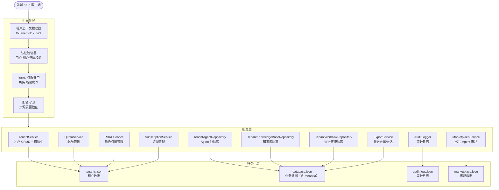
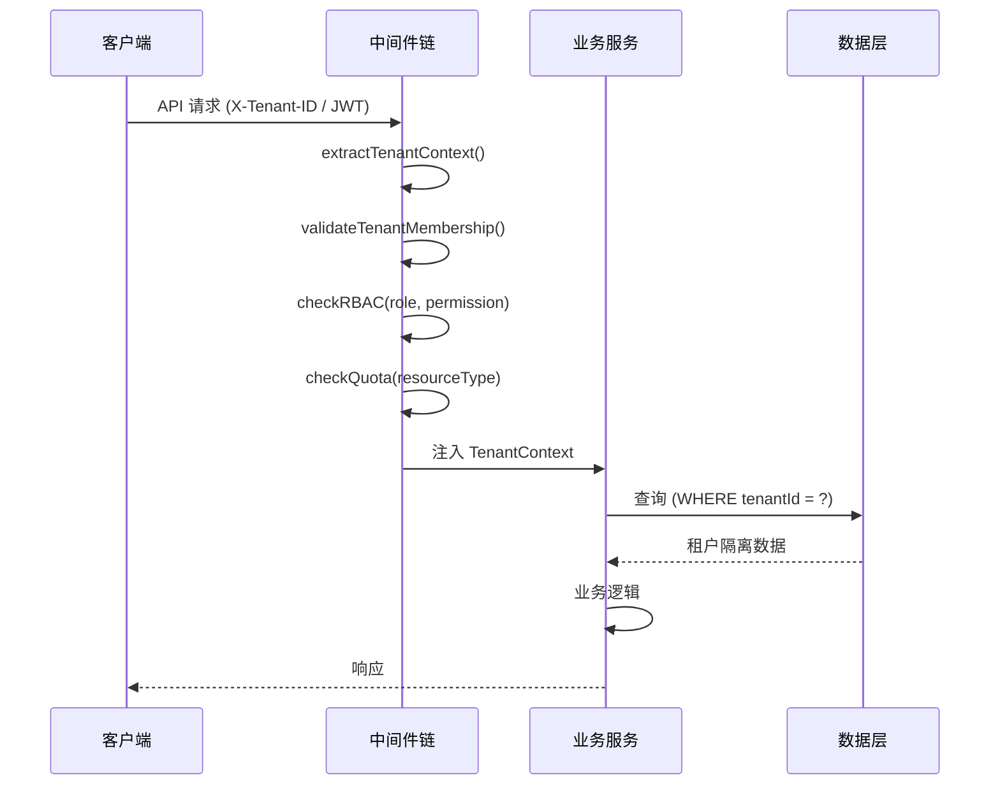

# 设计文档

## 概述

多租户架构为 Cube Pets Office 平台引入完整的租户隔离能力，使平台从单用户演示模式演进为支持多团队/公司独立运营的商业化平台。设计采用逻辑隔离（Shared Database, Separate Schema）策略，在现有 JSON 文件存储基础上扩展租户维度，通过中间件层自动注入租户上下文，实现数据隔离、资源配额管理和基于角色的访问控制。

核心设计决策：
- **数据隔离策略**：采用共享数据库 + 逻辑隔离（tenantId 字段过滤），而非物理隔离（独立数据库），以降低运维复杂度
- **上下文传递**：通过 Express 中间件自动提取和注入租户上下文，业务代码无需手动处理
- **配额管理**：采用内存缓存 + 定期持久化的策略，避免每次操作都读写磁盘
- **RBAC**：采用简单的角色-权限映射表，不引入复杂的权限引擎

## 架构



### 请求处理流程



## 组件和接口

### 1. TenantContext（租户上下文）

租户上下文是贯穿整个请求生命周期的核心数据结构，通过 Express 中间件自动注入到 `req.tenantContext` 中。

```typescript
interface TenantContext {
  tenantId: string;
  userId: string;
  role: TenantRole;
  permissions: Permission[];
  tier: TenantTier;
  quotaUsage: QuotaUsage;
  features: string[];
}

type TenantRole = "owner" | "admin" | "member" | "viewer";
type TenantTier = "free" | "pro" | "enterprise";
type Permission =
  | "agent:create" | "agent:read" | "agent:update" | "agent:delete"
  | "kb:create" | "kb:read" | "kb:update" | "kb:delete"
  | "workflow:create" | "workflow:read" | "workflow:update" | "workflow:delete"
  | "tenant:manage" | "member:manage" | "audit:read"
  | "marketplace:publish" | "marketplace:import"
  | "export:create" | "subscription:manage";
```

### 2. 中间件链

```typescript
// 租户上下文提取中间件
function tenantContextMiddleware(
  req: Request, res: Response, next: NextFunction
): void;

// RBAC 权限守卫工厂
function requirePermission(
  ...permissions: Permission[]
): RequestHandler;

// 配额检查守卫工厂
function requireQuota(
  resourceType: ResourceType, amount?: number
): RequestHandler;
```

### 3. TenantService

```typescript
interface TenantService {
  createTenant(params: CreateTenantParams): Promise<CreateTenantResult>;
  getTenant(tenantId: string): Tenant | undefined;
  deleteTenant(tenantId: string): Promise<void>;
  listTenants(): Tenant[];
}

interface CreateTenantParams {
  name: string;
  tier: TenantTier;
  features?: string[];
  ownerUserId: string;
}

interface CreateTenantResult {
  tenantId: string;
  status: "initialized" | "failed";
  workspace: string;
}
```

### 4. QuotaService

```typescript
interface QuotaService {
  checkQuota(tenantId: string, resourceType: ResourceType, amount: number): QuotaCheckResult;
  getQuotaUsage(tenantId: string): QuotaUsage;
  updateUsage(tenantId: string, resourceType: ResourceType, delta: number): void;
  recalculateUsage(tenantId: string): QuotaUsage;
}

type ResourceType = "agentCount" | "knowledgeBaseSize" | "apiCallsThisMonth";

interface QuotaCheckResult {
  allowed: boolean;
  current: number;
  limit: number;
  resourceType: ResourceType;
}
```

### 5. RBACService

```typescript
interface RBACService {
  assignRole(userId: string, tenantId: string, role: TenantRole): void;
  getUserRole(userId: string, tenantId: string): TenantRole | undefined;
  getPermissions(role: TenantRole): Permission[];
  hasPermission(userId: string, tenantId: string, permission: Permission): boolean;
  listMembers(tenantId: string): TenantMember[];
}

interface TenantMember {
  userId: string;
  role: TenantRole;
  joinedAt: string;
}
```

### 6. MarketplaceService

```typescript
interface MarketplaceService {
  listAgents(filters?: MarketplaceFilters): MarketplaceAgent[];
  importAgent(tenantId: string, marketplaceAgentId: string): string; // returns new agentId
  publishAgent(tenantId: string, agentId: string, metadata: PublishMetadata): string; // returns marketplaceAgentId
  getUsageStats(marketplaceAgentId: string): UsageStats;
}

interface PublishMetadata {
  description: string;
  tags: string[];
  version: string;
  license?: string;
  terms?: string;
}
```

### 7. AuditLogger

```typescript
interface AuditLogger {
  log(entry: AuditLogEntry): void;
  query(tenantId: string, filters?: AuditFilters): AuditLogEntry[];
}

interface AuditLogEntry {
  id: string;
  tenantId: string;
  userId: string;
  operationType: string;
  targetType: string;
  targetId: string;
  result: "success" | "failure";
  detail?: string;
  timestamp: string;
}

interface AuditFilters {
  operationType?: string;
  userId?: string;
  startTime?: string;
  endTime?: string;
  limit?: number;
  offset?: number;
}
```

### 8. ExportService

```typescript
interface ExportService {
  exportTenantData(tenantId: string, dataTypes: ExportDataType[]): Promise<ExportJob>;
  getExportStatus(jobId: string): ExportJob;
  importTenantData(tenantId: string, dataFile: Buffer, format: "json" | "csv"): Promise<ImportResult>;
}

type ExportDataType = "agents" | "knowledgeBase" | "workflows" | "executionRecords";

interface ExportJob {
  id: string;
  tenantId: string;
  status: "pending" | "processing" | "completed" | "failed";
  dataTypes: ExportDataType[];
  format: "json" | "csv";
  downloadUrl?: string;
  createdAt: string;
  completedAt?: string;
}
```

### 9. SubscriptionService

```typescript
interface SubscriptionService {
  upgradeTenant(tenantId: string, newTier: TenantTier): Promise<UpgradeResult>;
  getSubscription(tenantId: string): Subscription;
  cancelSubscription(tenantId: string): Promise<void>;
}

interface Subscription {
  tenantId: string;
  tier: TenantTier;
  billingCycle: "monthly" | "annual";
  status: "active" | "cancelled" | "expired";
  currentPeriodStart: string;
  currentPeriodEnd: string;
}

interface UpgradeResult {
  success: boolean;
  previousTier: TenantTier;
  newTier: TenantTier;
  updatedQuotas: QuotaLimits;
}
```

### 10. REST API 路由

| 方法 | 路径 | 权限 | 说明 |
|------|------|------|------|
| POST | /api/tenants | system | 创建租户 |
| GET | /api/tenants/:id | tenant:manage | 获取租户信息 |
| DELETE | /api/tenants/:id | tenant:manage | 删除租户 |
| GET | /api/tenants/:id/quota | agent:read | 查询配额使用 |
| GET | /api/tenants/:id/subscription | agent:read | 查询订阅信息 |
| PUT | /api/tenants/:id/subscription | subscription:manage | 升级订阅 |
| GET | /api/tenants/:id/members | member:manage | 成员列表 |
| POST | /api/tenants/:id/members/:userId/role | member:manage | 分配角色 |
| GET | /api/tenants/:id/audit-logs | audit:read | 审计日志 |
| POST | /api/tenants/:id/export | export:create | 导出数据 |
| POST | /api/tenants/:id/import | export:create | 导入数据 |
| GET | /api/marketplace/agents | marketplace:import | 浏览市场 |
| POST | /api/agents/import | marketplace:import | 导入 Agent |
| POST | /api/agents/:id/publish | marketplace:publish | 发布 Agent |

## 数据模型

### Tenant（租户）

```typescript
interface Tenant {
  id: string;                    // nanoid 生成
  name: string;
  tier: TenantTier;
  status: "active" | "suspended" | "deleted";
  quotas: QuotaLimits;
  quotaUsage: QuotaUsage;
  features: string[];
  createdAt: string;             // ISO 8601
  expiresAt: string | null;
}

interface QuotaLimits {
  maxAgents: number;             // free: 5, pro: 50, enterprise: -1 (无限)
  maxKnowledgeBaseSizeMB: number; // free: 10240, pro: 102400, enterprise: -1
  maxApiCallsPerMonth: number;   // free: 1000, pro: 50000, enterprise: -1
}

interface QuotaUsage {
  agentCount: number;
  knowledgeBaseSizeMB: number;
  apiCallsThisMonth: number;
  lastRecalculatedAt: string;
}
```

### TenantMembership（租户成员关系）

```typescript
interface TenantMembership {
  userId: string;
  tenantId: string;
  role: TenantRole;
  joinedAt: string;
  updatedAt: string;
}
```

### MarketplaceAgent（市场 Agent）

```typescript
interface MarketplaceAgent {
  id: string;
  name: string;
  description: string;
  tags: string[];
  version: string;
  authorTenantId: string;
  authorUserId: string;
  agentDefinition: Record<string, unknown>; // Agent 配置快照
  visibility: "public";
  license?: string;
  terms?: string;
  importCount: number;
  publishedAt: string;
  updatedAt: string;
}
```

### AuditLogEntry（审计日志条目）

```typescript
interface AuditLogEntry {
  id: string;
  tenantId: string;
  userId: string;
  operationType: string;         // "agent:create", "kb:upload", "workflow:execute" 等
  targetType: string;            // "agent", "knowledgeBase", "workflow" 等
  targetId: string;
  result: "success" | "failure";
  detail?: string;
  timestamp: string;             // ISO 8601
}
```

### ExportJob（导出任务）

```typescript
interface ExportJob {
  id: string;
  tenantId: string;
  status: "pending" | "processing" | "completed" | "failed";
  dataTypes: ExportDataType[];
  format: "json" | "csv";
  compressed: boolean;
  downloadUrl?: string;
  errorMessage?: string;
  createdAt: string;
  completedAt?: string;
}
```

### 数据库 Schema 扩展

现有 `database.json` 中的表需要新增 `tenantId` 字段：

```typescript
// AgentRow 扩展
interface AgentRow {
  // ... 现有字段
  tenantId: string;              // 新增：所属租户
  visibility: "private" | "public"; // 新增：可见性
}

// WorkflowRun 扩展
interface WorkflowRun {
  // ... 现有字段
  tenantId: string;              // 新增：所属租户
}

// MessageRow 扩展
interface MessageRow {
  // ... 现有字段
  tenantId: string;              // 新增：所属租户
}

// TaskRow 扩展
interface TaskRow {
  // ... 现有字段
  tenantId: string;              // 新增：所属租户
}
```

### 新增 JSON 存储文件

```
data/
├── tenants.json                 # 租户数据 + 成员关系
├── marketplace.json             # 市场 Agent 数据
├── audit-logs/
│   └── {tenantId}.json          # 每个租户独立的审计日志文件
└── exports/
    └── {jobId}.json/.csv.gz     # 导出文件
```

### 角色-权限映射

```typescript
const ROLE_PERMISSIONS: Record<TenantRole, Permission[]> = {
  owner: [
    "agent:create", "agent:read", "agent:update", "agent:delete",
    "kb:create", "kb:read", "kb:update", "kb:delete",
    "workflow:create", "workflow:read", "workflow:update", "workflow:delete",
    "tenant:manage", "member:manage", "audit:read",
    "marketplace:publish", "marketplace:import",
    "export:create", "subscription:manage",
  ],
  admin: [
    "agent:create", "agent:read", "agent:update", "agent:delete",
    "kb:create", "kb:read", "kb:update", "kb:delete",
    "workflow:create", "workflow:read", "workflow:update", "workflow:delete",
    "member:manage", "audit:read",
    "marketplace:publish", "marketplace:import",
    "export:create",
  ],
  member: [
    "agent:create", "agent:read", "agent:update",
    "kb:create", "kb:read", "kb:update",
    "workflow:create", "workflow:read",
    "marketplace:import",
  ],
  viewer: [
    "agent:read", "kb:read", "workflow:read",
  ],
};
```


## 正确性属性

*正确性属性是一种在系统所有有效执行中都应成立的特征或行为——本质上是关于系统应该做什么的形式化陈述。属性作为人类可读规范与机器可验证正确性保证之间的桥梁。*

### Property 1: 租户创建返回有效结果

*For any* valid combination of name, tier, and features, calling createTenant() should return a result containing a non-empty tenantId string and a status of "initialized".

**Validates: Requirements 1.1, 1.5**

### Property 2: 租户初始化创建完整资源

*For any* newly created tenant, querying its Agent pool should return an empty list (not an error), querying its knowledge base should return an empty list, and its workspace directory should exist.

**Validates: Requirements 1.2, 1.3**

### Property 3: 租户作用域记录自动关联

*For any* resource (Agent, knowledge base document, workflow) created through a tenant-scoped repository with a given TenantContext, the created record's tenantId field should equal the TenantContext's tenantId.

**Validates: Requirements 3.1, 3.2, 4.1, 4.2, 5.1, 5.2**

### Property 4: 跨租户数据隔离

*For any* two distinct tenants A and B, and any resource (Agent, knowledge base document, workflow, execution record) created by tenant A, querying that resource type from tenant B's context should never include tenant A's resources. Attempting to access tenant A's resource by ID from tenant B's context should return 404.

**Validates: Requirements 3.3, 3.4, 4.3, 5.3, 13.2**

### Property 5: 配额使用一致性

*For any* tenant, after any sequence of resource creation and deletion operations (Agents, documents, API calls), the quotaUsage fields (agentCount, knowledgeBaseSizeMB, apiCallsThisMonth) should equal the actual count/size of resources belonging to that tenant. After recalculateUsage(), the quotaUsage should match the ground truth.

**Validates: Requirements 3.5, 4.4, 5.5, 6.4**

### Property 6: 配额限额执行

*For any* tenant with known quota limits and current usage, checkQuota(tenantId, resourceType, amount) should return allowed=true when usage + amount <= limit, and allowed=false when usage + amount > limit. When allowed=false, the corresponding API operation should return HTTP 429.

**Validates: Requirements 6.1, 6.3**

### Property 7: 租户删除数据清除

*For any* tenant with associated resources (Agents, knowledge base documents, workflows, execution records), after deleteTenant() is called, querying any resource type for that tenantId should return empty results, and the tenant's workspace directory should not exist.

**Validates: Requirements 4.5, 13.4**

### Property 8: RBAC 角色分配与权限执行

*For any* user-tenant pair, assigning a role via assignRole() should make getUserRole() return that role. Each user should have exactly one role per tenant (assigning a new role replaces the old one). *For any* user with a given role, attempting an operation requiring a permission not in that role's permission set should return 403 Forbidden.

**Validates: Requirements 7.2, 7.3, 7.4**

### Property 9: 租户上下文提取与验证

*For any* API request, if the request lacks a tenant identifier (no X-Tenant-ID header and no tenantId in JWT), the middleware should reject it. *For any* request where the user does not belong to the specified tenant, the middleware should return 403 and create an audit log entry. *For any* valid request, the TenantContext should be injected into the request object with correct tenantId, userId, role, and permissions.

**Validates: Requirements 2.1, 2.2, 2.3, 2.4, 2.5**

### Property 10: Marketplace Agent 导入创建私有副本

*For any* marketplace Agent import operation, the resulting Agent in the tenant's pool should have the importing tenant's tenantId, visibility "private", and the same agent definition as the original marketplace Agent. The original marketplace Agent should remain unchanged with visibility "public".

**Validates: Requirements 8.5**

### Property 11: Agent 发布保留元数据

*For any* Agent publish operation with valid metadata (description, tags, version), the resulting marketplace Agent should have visibility "public", contain the original author's tenantId and userId, and preserve all provided metadata fields. Publishing without required metadata (description, tags, version) should fail.

**Validates: Requirements 9.2, 9.3**

### Property 12: 导入计数追踪

*For any* marketplace Agent, each time it is imported by a tenant, the importCount should increase by exactly 1.

**Validates: Requirements 9.4**

### Property 13: 订阅升级更新配额

*For any* tenant upgrading from a lower tier to a higher tier, after upgradeTenant() succeeds, the tenant's quota limits should match the new tier's defined limits, and a subscription change log entry should be recorded.

**Validates: Requirements 10.2, 10.4**

### Property 14: 数据导出/导入往返一致性

*For any* tenant with data, exporting data in JSON format and then importing the exported data into a new tenant should produce equivalent data. Specifically, the imported Agent definitions, knowledge base documents, and execution records should match the originals.

**Validates: Requirements 11.3, 11.5**

### Property 15: 审计日志完整性与不可变性

*For any* significant operation (Agent creation/deletion, document upload, workflow execution, role change), an audit log entry should be created containing non-empty userId, operationType, timestamp, targetId, and result fields. *For any* existing audit log entry, attempting to modify or delete it should fail.

**Validates: Requirements 12.1, 12.2, 12.5**

### Property 16: 审计日志过滤正确性

*For any* audit log query with filters (operationType, userId, time range), all returned entries should match all specified filter criteria. No entry that matches the filters should be excluded from the results.

**Validates: Requirements 12.4**

### Property 17: 租户间配额独立性

*For any* two tenants A and B, tenant A reaching its quota limit for a resource type should not prevent tenant B from creating resources of that type (assuming B has available quota).

**Validates: Requirements 13.3**

### Property 18: 执行环境路径隔离

*For any* two distinct tenants, the storage paths generated for their temporary files and caches should not overlap (neither path should be a prefix of the other).

**Validates: Requirements 5.4**

### Property 19: 仪表盘配额百分比计算

*For any* tenant with quota limits and usage, the displayed usage percentage should equal (usage / limit) * 100, clamped to [0, 100]. When the limit is -1 (unlimited), the percentage should be 0.

**Validates: Requirements 14.3**

## 错误处理

### HTTP 错误码映射

| 场景 | HTTP 状态码 | 说明 |
|------|------------|------|
| 缺少租户标识 | 401 Unauthorized | 请求未包含 X-Tenant-ID 或 JWT tenantId |
| 用户不属于租户 | 403 Forbidden | 用户与租户无关联关系 |
| 权限不足 | 403 Forbidden | 用户角色无对应权限 |
| 资源不存在或跨租户访问 | 404 Not Found | 隐藏资源存在性，防止信息泄露 |
| 配额超限 | 429 Too Many Requests | 附带升级提示信息 |
| 租户已暂停 | 403 Forbidden | 租户状态为 suspended |
| 导出任务失败 | 500 Internal Server Error | 记录错误详情到 ExportJob |

### 错误处理策略

1. **跨租户访问统一返回 404**：不返回 403，避免泄露资源存在性
2. **配额检查失败提供升级路径**：429 响应体包含当前用量、限额和升级链接
3. **审计日志写入失败不阻塞业务**：审计日志写入采用 fire-and-forget 模式，写入失败记录到 console.error
4. **租户删除采用软删除**：先标记 status 为 "deleted"，异步清理数据，防止误删
5. **导出任务超时处理**：导出任务设置最大执行时间（30 分钟），超时标记为 failed

## 测试策略

### 测试框架

- **单元测试**：Vitest（项目已有配置）
- **属性测试**：fast-check（与 Vitest 集成）
- **测试配置**：每个属性测试最少运行 100 次迭代

### 属性测试

属性测试用于验证上述正确性属性，通过随机生成输入来覆盖广泛的场景。每个属性测试必须：
- 引用设计文档中的属性编号
- 标注格式：**Feature: multi-tenant-architecture, Property {number}: {property_text}**
- 最少运行 100 次迭代

关键属性测试：
1. **跨租户数据隔离**（Property 4）：生成随机租户对和资源，验证隔离性
2. **配额使用一致性**（Property 5）：生成随机操作序列，验证配额计数
3. **配额限额执行**（Property 6）：生成随机配额状态，验证 checkQuota 逻辑
4. **RBAC 权限执行**（Property 8）：生成随机角色-权限组合，验证访问控制
5. **数据导出/导入往返**（Property 14）：生成随机租户数据，验证导出导入一致性

### 单元测试

单元测试用于验证具体示例、边界情况和错误条件：
- 各 tier 的配额初始值（free/pro/enterprise）
- 中间件链的错误响应（缺少 header、无效 JWT、用户不属于租户）
- 审计日志的不可变性
- 租户删除的级联清理
- Marketplace Agent 的发布和导入流程
- 导出任务的状态转换

### 测试文件组织

```
server/tests/
├── multi-tenant/
│   ├── tenant-service.test.ts          # TenantService 单元测试
│   ├── tenant-context.test.ts          # 中间件链测试
│   ├── tenant-isolation.test.ts        # 隔离属性测试
│   ├── quota-service.test.ts           # 配额管理测试
│   ├── rbac-service.test.ts            # RBAC 测试
│   ├── marketplace-service.test.ts     # Marketplace 测试
│   ├── audit-logger.test.ts            # 审计日志测试
│   ├── export-service.test.ts          # 导出/导入测试
│   └── subscription-service.test.ts    # 订阅管理测试
```
