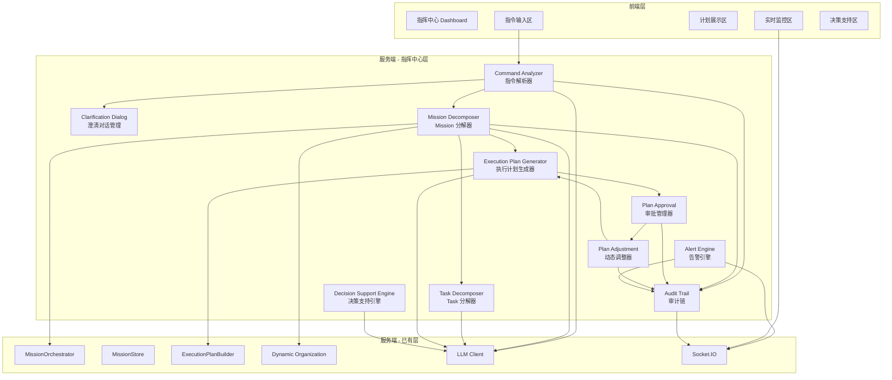

# 自然语言指挥中心 设计文档

## 概述

自然语言指挥中心（NL Command Center）在现有 Mission Runtime 之上构建战略指令层。用户输入一条战略级自然语言指令，系统通过 LLM 解析意图和约束，自动分解为多个 Mission（复用现有 MissionRecord / MissionOrchestrator），为每个 Mission 生成执行计划和组织结构，并提供审批、监控、告警、决策支持和动态调整的完整闭环。

核心设计原则：
- **复用优先**：复用现有 MissionRecord、MissionOrchestrator、ExecutionPlanBuilder、动态组织生成等模块
- **分层解耦**：指挥中心是 Mission 之上的编排层，不修改 Mission 核心状态机
- **LLM 驱动**：指令解析、分解、风险评估均通过 LLM 完成，关键词匹配作为 fallback
- **实时推送**：所有状态变化通过 Socket.IO 推送前端

## 架构



## 组件与接口

### 1. Command Analyzer（指令解析器）

负责接收战略指令并调用 LLM 解析意图、约束和目标。

```typescript
// server/core/nl-command/command-analyzer.ts

interface CommandAnalyzerOptions {
  llmProvider: LLMProvider;
  model: string;
  auditTrail: AuditTrail;
}

class CommandAnalyzer {
  /** 解析战略指令，返回 CommandAnalysis */
  async analyze(command: StrategicCommand): Promise<CommandAnalysis>;

  /** 生成澄清问题 */
  async generateClarificationQuestions(
    command: StrategicCommand,
    analysis: CommandAnalysis
  ): Promise<ClarificationQuestion[]>;

  /** 基于澄清回答更新分析结果 */
  async updateAnalysis(
    command: StrategicCommand,
    analysis: CommandAnalysis,
    answer: ClarificationAnswer
  ): Promise<CommandAnalysis>;

  /** 生成最终确认指令 */
  async finalize(
    command: StrategicCommand,
    analysis: CommandAnalysis
  ): Promise<FinalizedCommand>;
}
```

### 2. Mission Decomposer（Mission 分解器）

将最终确认的指令分解为多个 Mission，识别依赖关系，并触发动态组织生成。

```typescript
// server/core/nl-command/mission-decomposer.ts

interface MissionDecomposerOptions {
  llmProvider: LLMProvider;
  model: string;
  missionOrchestrator: MissionOrchestrator;
  organizationGenerator: typeof generateWorkflowOrganization;
  auditTrail: AuditTrail;
}

class MissionDecomposer {
  /** 将 FinalizedCommand 分解为多个 Mission */
  async decompose(command: FinalizedCommand): Promise<MissionDecomposition>;

  /** 为单个 Mission 生成组织结构 */
  async generateOrganization(
    mission: MissionRecord,
    complexity: number
  ): Promise<WorkflowOrganizationSnapshot>;
}
```

### 3. Task Decomposer（Task 分解器）

将 Mission 进一步分解为具体的 Task。

```typescript
// server/core/nl-command/task-decomposer.ts

interface TaskDecomposerOptions {
  llmProvider: LLMProvider;
  model: string;
  auditTrail: AuditTrail;
}

class TaskDecomposer {
  /** 将 Mission 分解为 Task 列表 */
  async decompose(
    mission: MissionRecord,
    context: MissionDecomposition
  ): Promise<TaskDecomposition>;
}
```

### 4. Execution Plan Generator（执行计划生成器）

基于分解结果生成完整的执行计划，包含时间表、资源分配、风险评估和成本预算。

```typescript
// server/core/nl-command/execution-plan-generator.ts

interface ExecutionPlanGeneratorOptions {
  llmProvider: LLMProvider;
  model: string;
  executionPlanBuilder: ExecutionPlanBuilder;
  auditTrail: AuditTrail;
}

class ExecutionPlanGenerator {
  /** 生成完整的 NL 执行计划 */
  async generate(
    command: FinalizedCommand,
    decomposition: MissionDecomposition,
    taskDecompositions: TaskDecomposition[]
  ): Promise<NLExecutionPlan>;

  /** 基于审批反馈调整计划 */
  async adjustPlan(
    plan: NLExecutionPlan,
    adjustment: PlanAdjustmentRequest
  ): Promise<NLExecutionPlan>;

  /** 计算关键路径 */
  computeCriticalPath(plan: NLExecutionPlan): CriticalPathResult;
}
```

### 5. Plan Approval（审批管理器）

```typescript
// server/core/nl-command/plan-approval.ts

class PlanApproval {
  /** 创建审批请求 */
  async createApprovalRequest(plan: NLExecutionPlan): Promise<PlanApprovalRequest>;

  /** 提交审批意见 */
  async submitApproval(
    requestId: string,
    approverId: string,
    decision: 'approved' | 'rejected' | 'revision_requested',
    comments?: string
  ): Promise<PlanApprovalRequest>;

  /** 检查审批是否完成 */
  isApprovalComplete(request: PlanApprovalRequest): boolean;
}
```

### 6. Alert Engine（告警引擎）

```typescript
// server/core/nl-command/alert-engine.ts

class AlertEngine {
  /** 注册告警规则 */
  registerRule(rule: AlertRule): void;

  /** 评估当前状态，触发匹配的告警 */
  async evaluate(context: AlertContext): Promise<Alert[]>;

  /** 发送告警通知 */
  async notify(alert: Alert): Promise<void>;
}
```

### 7. Decision Support Engine（决策支持引擎）

```typescript
// server/core/nl-command/decision-support.ts

class DecisionSupportEngine {
  /** 生成风险分析 */
  async analyzeRisks(plan: NLExecutionPlan): Promise<RiskAnalysis>;

  /** 生成成本优化建议 */
  async suggestCostOptimization(plan: NLExecutionPlan): Promise<CostOptimizationSuggestion[]>;

  /** 生成资源调整建议 */
  async suggestResourceAdjustment(plan: NLExecutionPlan): Promise<ResourceAdjustmentSuggestion[]>;

  /** 收集执行数据用于学习 */
  async collectExecutionData(plan: NLExecutionPlan): Promise<ExecutionMetrics>;

  /** 生成优化报告 */
  async generateOptimizationReport(): Promise<OptimizationReport>;
}
```

### 8. Audit Trail（审计链）

```typescript
// server/core/nl-command/audit-trail.ts

class AuditTrail {
  /** 记录审计条目 */
  async record(entry: AuditEntry): Promise<void>;

  /** 查询审计日志 */
  async query(filter: AuditQueryFilter): Promise<AuditEntry[]>;

  /** 导出审计日志 */
  async export(filter: AuditQueryFilter, format: 'json'): Promise<string>;
}
```

### 9. REST API 路由

```typescript
// server/routes/nl-command.ts

// 指令管理
POST   /api/nl-command/commands              // 提交战略指令
GET    /api/nl-command/commands              // 指令列表
GET    /api/nl-command/commands/:id          // 指令详情

// 澄清对话
POST   /api/nl-command/commands/:id/clarify  // 提交澄清回答
GET    /api/nl-command/commands/:id/dialog   // 获取澄清对话

// 执行计划
GET    /api/nl-command/plans/:id             // 获取执行计划
POST   /api/nl-command/plans/:id/approve     // 审批执行计划
POST   /api/nl-command/plans/:id/adjust      // 调整执行计划

// 监控与告警
GET    /api/nl-command/dashboard             // 仪表板数据
GET    /api/nl-command/alerts                // 告警列表
POST   /api/nl-command/alerts/rules          // 创建告警规则

// 决策支持
GET    /api/nl-command/plans/:id/risks       // 风险分析
GET    /api/nl-command/plans/:id/suggestions // 优化建议
POST   /api/nl-command/plans/:id/apply-suggestion // 应用建议

// 协作
POST   /api/nl-command/comments              // 添加评论
GET    /api/nl-command/comments              // 评论列表

// 报告
GET    /api/nl-command/reports/:id           // 获取报告
POST   /api/nl-command/reports/generate      // 生成报告

// 历史与模板
GET    /api/nl-command/history               // 历史指令
GET    /api/nl-command/templates             // 模板列表
POST   /api/nl-command/templates             // 保存模板

// 审计
GET    /api/nl-command/audit                 // 审计日志
POST   /api/nl-command/audit/export          // 导出审计日志
```

### 10. Socket.IO 事件

```typescript
// shared/nl-command/socket.ts

// 服务端 → 前端
'nl_command_created'        // 指令创建
'nl_command_analysis'       // 指令解析完成
'nl_clarification_question' // 澄清问题生成
'nl_decomposition_complete' // 分解完成
'nl_plan_generated'         // 执行计划生成
'nl_plan_approved'          // 计划审批通过
'nl_plan_adjusted'          // 计划调整
'nl_alert'                  // 告警通知
'nl_progress_update'        // 进度更新
'nl_suggestion'             // 决策建议
```

## 数据模型

### 核心类型定义

```typescript
// shared/nl-command/contracts.ts

export const NL_COMMAND_CONTRACT_VERSION = '2026-06-01' as const;

// ─── 战略指令 ───

export type CommandPriority = 'critical' | 'high' | 'medium' | 'low';

export type CommandStatus =
  | 'draft'
  | 'analyzing'
  | 'clarifying'
  | 'finalized'
  | 'decomposing'
  | 'planning'
  | 'approving'
  | 'executing'
  | 'completed'
  | 'failed'
  | 'cancelled';

export interface StrategicCommand {
  commandId: string;
  commandText: string;
  userId: string;
  timestamp: number;
  status: CommandStatus;
  parsedIntent?: string;
  constraints: CommandConstraint[];
  objectives: string[];
  priority: CommandPriority;
  timeframe?: CommandTimeframe;
}

export interface CommandConstraint {
  type: 'budget' | 'time' | 'quality' | 'resource' | 'custom';
  description: string;
  value?: string;
  unit?: string;
}

export interface CommandTimeframe {
  startDate?: string;
  endDate?: string;
  durationEstimate?: string;
}

// ─── 指令分析 ───

export interface CommandAnalysis {
  intent: string;
  entities: CommandEntity[];
  constraints: CommandConstraint[];
  objectives: string[];
  risks: IdentifiedRisk[];
  assumptions: string[];
  confidence: number;
  needsClarification: boolean;
  clarificationTopics?: string[];
}

export interface CommandEntity {
  name: string;
  type: 'module' | 'service' | 'team' | 'technology' | 'concept' | 'custom';
  description?: string;
}

// ─── 澄清对话 ───

export interface ClarificationDialog {
  dialogId: string;
  commandId: string;
  questions: ClarificationQuestion[];
  answers: ClarificationAnswer[];
  clarificationRounds: number;
  status: 'active' | 'completed';
}

export interface ClarificationQuestion {
  questionId: string;
  text: string;
  type: 'free_text' | 'single_choice' | 'multi_choice';
  options?: string[];
  context?: string;
}

export interface ClarificationAnswer {
  questionId: string;
  text: string;
  selectedOptions?: string[];
  timestamp: number;
}

export interface FinalizedCommand {
  commandId: string;
  originalText: string;
  refinedText: string;
  analysis: CommandAnalysis;
  clarificationSummary?: string;
  finalizedAt: number;
}

// ─── Mission 分解 ───

export interface MissionDecomposition {
  decompositionId: string;
  commandId: string;
  missions: DecomposedMission[];
  dependencies: MissionDependency[];
  executionOrder: string[][];  // 二维数组，每层可并行
  totalEstimatedDuration: number;
  totalEstimatedCost: number;
}

export interface DecomposedMission {
  missionId: string;
  title: string;
  description: string;
  objectives: string[];
  constraints: CommandConstraint[];
  estimatedDuration: number;  // 分钟
  estimatedCost: number;
  priority: CommandPriority;
}

export interface MissionDependency {
  fromMissionId: string;
  toMissionId: string;
  type: 'blocks' | 'depends_on' | 'related';
  description?: string;
}

// ─── Task 分解 ───

export interface TaskDecomposition {
  decompositionId: string;
  missionId: string;
  tasks: DecomposedTask[];
  dependencies: TaskDependency[];
  executionOrder: string[][];
}

export interface DecomposedTask {
  taskId: string;
  title: string;
  description: string;
  objectives: string[];
  constraints: CommandConstraint[];
  estimatedDuration: number;
  estimatedCost: number;
  requiredSkills: string[];
  priority: CommandPriority;
}

export interface TaskDependency {
  fromTaskId: string;
  toTaskId: string;
  type: 'blocks' | 'depends_on';
}

// ─── 执行计划 ───

export interface NLExecutionPlan {
  planId: string;
  commandId: string;
  status: 'draft' | 'pending_approval' | 'approved' | 'executing' | 'completed' | 'failed';
  missions: DecomposedMission[];
  tasks: DecomposedTask[];
  timeline: PlanTimeline;
  resourceAllocation: ResourceAllocation;
  riskAssessment: RiskAssessment;
  costBudget: CostBudget;
  contingencyPlan: ContingencyPlan;
  createdAt: number;
  updatedAt: number;
}

export interface PlanTimeline {
  startDate: string;
  endDate: string;
  criticalPath: string[];  // mission/task IDs on critical path
  milestones: TimelineMilestone[];
  entries: TimelineEntry[];
}

export interface TimelineEntry {
  entityId: string;
  entityType: 'mission' | 'task';
  startTime: number;
  endTime: number;
  duration: number;
  isCriticalPath: boolean;
  parallelGroup?: number;
}

export interface TimelineMilestone {
  id: string;
  label: string;
  date: string;
  entityId: string;
}

export interface ResourceAllocation {
  entries: ResourceEntry[];
  totalAgents: number;
  peakConcurrency: number;
}

export interface ResourceEntry {
  taskId: string;
  agentType: string;
  agentCount: number;
  requiredSkills: string[];
  startTime: number;
  endTime: number;
}

export interface RiskAssessment {
  risks: IdentifiedRisk[];
  overallRiskLevel: 'low' | 'medium' | 'high' | 'critical';
}

export interface IdentifiedRisk {
  id: string;
  description: string;
  level: 'low' | 'medium' | 'high' | 'critical';
  probability: number;
  impact: number;
  mitigation: string;
  contingency?: string;
  relatedEntityId?: string;
}

export interface CostBudget {
  totalBudget: number;
  missionCosts: Record<string, number>;
  taskCosts: Record<string, number>;
  agentCosts: Record<string, number>;
  modelCosts: Record<string, number>;
  currency: string;
}

export interface ContingencyPlan {
  alternatives: ContingencyAlternative[];
  degradationStrategies: string[];
  rollbackPlan: string;
}

export interface ContingencyAlternative {
  id: string;
  description: string;
  trigger: string;
  action: string;
  estimatedImpact: string;
}

// ─── 审批 ───

export type ApprovalStatus = 'pending' | 'approved' | 'rejected' | 'revision_requested';

export interface PlanApprovalRequest {
  requestId: string;
  planId: string;
  requiredApprovers: string[];
  approvals: ApprovalDecision[];
  status: ApprovalStatus;
  createdAt: number;
  updatedAt: number;
}

export interface ApprovalDecision {
  approverId: string;
  decision: 'approved' | 'rejected' | 'revision_requested';
  comments?: string;
  timestamp: number;
}

// ─── 动态调整 ───

export interface PlanAdjustment {
  adjustmentId: string;
  planId: string;
  reason: string;
  changes: AdjustmentChange[];
  impact: AdjustmentImpact;
  approvalRequired: boolean;
  status: 'proposed' | 'approved' | 'applied' | 'rejected';
  createdAt: number;
}

export interface AdjustmentChange {
  entityId: string;
  entityType: 'mission' | 'task' | 'resource' | 'timeline';
  field: string;
  oldValue: unknown;
  newValue: unknown;
}

export interface AdjustmentImpact {
  timelineImpact: string;
  costImpact: string;
  riskImpact: string;
}

// ─── 告警 ───

export type AlertType = 'TASK_DELAYED' | 'COST_EXCEEDED' | 'RISK_ESCALATED' | 'ERROR_OCCURRED' | 'APPROVAL_REQUIRED';
export type AlertPriority = 'critical' | 'warning' | 'info';

export interface Alert {
  alertId: string;
  type: AlertType;
  priority: AlertPriority;
  message: string;
  entityId: string;
  entityType: 'command' | 'mission' | 'task' | 'plan';
  triggeredAt: number;
  acknowledged: boolean;
  metadata?: Record<string, unknown>;
}

export interface AlertRule {
  ruleId: string;
  type: AlertType;
  condition: AlertCondition;
  priority: AlertPriority;
  enabled: boolean;
}

export interface AlertCondition {
  metric: string;
  operator: 'gt' | 'lt' | 'eq' | 'gte' | 'lte';
  threshold: number;
  unit?: string;
}

// ─── 协作 ───

export interface Comment {
  commentId: string;
  entityId: string;
  entityType: 'command' | 'mission' | 'task' | 'plan';
  authorId: string;
  content: string;
  mentions: string[];
  versions: CommentVersion[];
  createdAt: number;
  updatedAt: number;
}

export interface CommentVersion {
  content: string;
  editedAt: number;
  editedBy: string;
}

// ─── 审计 ───

export type AuditOperationType =
  | 'command_created' | 'command_analyzed' | 'command_finalized'
  | 'clarification_question' | 'clarification_answer'
  | 'decomposition_completed' | 'plan_generated'
  | 'approval_submitted' | 'approval_completed'
  | 'adjustment_proposed' | 'adjustment_applied'
  | 'alert_triggered' | 'comment_created' | 'comment_edited'
  | 'permission_changed' | 'report_generated'
  | 'suggestion_applied' | 'template_saved';

export interface AuditEntry {
  entryId: string;
  operationType: AuditOperationType;
  operator: string;
  content: string;
  timestamp: number;
  result: 'success' | 'failure';
  entityId?: string;
  entityType?: string;
  metadata?: Record<string, unknown>;
}

export interface AuditQueryFilter {
  startTime?: number;
  endTime?: number;
  operator?: string;
  operationType?: AuditOperationType;
  entityId?: string;
  limit?: number;
  offset?: number;
}

// ─── 报告 ───

export interface ExecutionReport {
  reportId: string;
  planId: string;
  summary: string;
  progressAnalysis: ProgressAnalysis;
  costAnalysis: CostAnalysisResult;
  riskAnalysis: RiskAssessment;
  generatedAt: number;
}

export interface ProgressAnalysis {
  totalMissions: number;
  completedMissions: number;
  totalTasks: number;
  completedTasks: number;
  overallProgress: number;
  delayedItems: string[];
  onTrackItems: string[];
}

export interface CostAnalysisResult {
  plannedCost: number;
  actualCost: number;
  variance: number;
  variancePercentage: number;
  costByMission: Record<string, { planned: number; actual: number }>;
  costByAgent: Record<string, number>;
  costByModel: Record<string, number>;
}

// ─── 模板 ───

export interface PlanTemplate {
  templateId: string;
  name: string;
  description: string;
  plan: Omit<NLExecutionPlan, 'planId' | 'commandId' | 'status' | 'createdAt' | 'updatedAt'>;
  version: number;
  versions: TemplateVersion[];
  createdBy: string;
  createdAt: number;
  updatedAt: number;
}

export interface TemplateVersion {
  version: number;
  description: string;
  createdAt: number;
  createdBy: string;
}

// ─── 权限 ───

export type Permission = 'view' | 'create' | 'edit' | 'approve' | 'execute' | 'cancel';
export type UserRole = 'admin' | 'manager' | 'operator' | 'viewer';

export interface PermissionConfig {
  role: UserRole;
  permissions: Permission[];
  scope?: {
    entityType?: string;
    entityId?: string;
  };
}

// ─── 学习与优化 ───

export interface ExecutionMetrics {
  planId: string;
  actualDuration: number;
  actualCost: number;
  plannedDuration: number;
  plannedCost: number;
  durationDeviation: number;
  costDeviation: number;
  completedAt: number;
}

export interface OptimizationReport {
  reportId: string;
  period: { start: number; end: number };
  durationAccuracy: number;
  costAccuracy: number;
  decompositionQuality: number;
  recommendations: string[];
  generatedAt: number;
}
```

### 存储策略

| 数据类型 | 存储位置 | 说明 |
|---------|---------|------|
| StrategicCommand | `data/nl-commands.json` | 服务端本地 JSON |
| ClarificationDialog | 内存 + `data/nl-commands.json` | 嵌入 Command 记录 |
| MissionDecomposition | `data/nl-decompositions.json` | 服务端本地 JSON |
| NLExecutionPlan | `data/nl-plans.json` | 服务端本地 JSON |
| PlanApprovalRequest | 嵌入 NLExecutionPlan | 随计划一起持久化 |
| Alert | 内存 + Socket 推送 | 告警不持久化，审计链记录 |
| AuditEntry | `data/nl-audit.json` | 追加写入 |
| Comment | `data/nl-comments.json` | 服务端本地 JSON |
| PlanTemplate | `data/nl-templates.json` | 服务端本地 JSON |
| ExecutionMetrics | `data/nl-metrics.json` | 追加写入 |

## 正确性属性

*正确性属性是系统在所有合法执行路径上都应保持的特征或行为——本质上是对系统行为的形式化陈述。属性是人类可读规格与机器可验证正确性保证之间的桥梁。*

### Property 1: StrategicCommand 结构完整性

*For any* StrategicCommand object created by the system, the object SHALL contain non-undefined values for commandId, commandText, userId, timestamp, status, constraints (array), objectives (array), and priority fields.

**Validates: Requirements 1.1**

### Property 2: CommandAnalysis 结构完整性

*For any* CommandAnalysis produced by the Command_Analyzer (with mocked LLM), the result SHALL contain non-undefined values for intent, entities (array), constraints (array), objectives (array), risks (array), assumptions (array), and confidence (number between 0 and 1).

**Validates: Requirements 1.2, 1.3**

### Property 3: 审计链记录不变量

*For any* auditable operation (command creation, analysis, clarification, decomposition, approval, adjustment, alert, comment, permission change), after the operation completes, the Audit_Trail SHALL contain exactly one new entry with valid operator, operationType, content, timestamp, and result fields matching the operation.

**Validates: Requirements 1.4, 2.6, 3.6, 4.6, 7.6, 8.6, 10.5, 12.5, 17.4**

### Property 4: 澄清对话接受两种回答类型

*For any* ClarificationQuestion, the Clarification_Dialog SHALL accept both a free-text ClarificationAnswer (with text field) and a selection-based ClarificationAnswer (with selectedOptions field), and both answer types SHALL be stored in the dialog's answers array.

**Validates: Requirements 2.3**

### Property 5: 澄清更新分析并最终确认

*For any* StrategicCommand undergoing clarification, after each ClarificationAnswer is submitted, the Command_Analysis SHALL be updated (confidence or fields change). After all clarification rounds complete, a FinalizedCommand SHALL be produced containing the original commandId, originalText, refinedText, and a complete CommandAnalysis.

**Validates: Requirements 2.4, 2.5**

### Property 6: 分解执行顺序拓扑排序正确性

*For any* MissionDecomposition or TaskDecomposition, the executionOrder SHALL be a valid topological ordering of the dependency graph: for every dependency edge (A depends on B), B SHALL appear in an earlier or same execution group as A. Additionally, all dependency references SHALL point to valid entity IDs within the decomposition.

**Validates: Requirements 3.4, 3.5, 4.4, 4.5**

### Property 7: 分解输出结构完整性

*For any* MissionDecomposition produced by the Mission_Decomposer, each DecomposedMission SHALL contain non-empty missionId, title, description, objectives, and a numeric estimatedDuration and estimatedCost. Similarly, for any TaskDecomposition, each DecomposedTask SHALL contain non-empty taskId, title, description, objectives, requiredSkills, and numeric estimatedDuration and estimatedCost.

**Validates: Requirements 3.2, 3.3, 4.2, 4.3**

### Property 8: 成本预算求和不变量

*For any* NLExecutionPlan, the sum of all missionCosts in the CostBudget SHALL equal the totalBudget. The sum of all taskCosts for a given mission SHALL equal that mission's cost. The cost distribution by Agent and Model SHALL sum to the totalBudget.

**Validates: Requirements 5.5, 15.5**

### Property 9: 时间线关键路径有效性

*For any* NLExecutionPlan with a PlanTimeline, the criticalPath SHALL be the longest path through the dependency graph measured by duration. Every TimelineEntry on the critical path SHALL have isCriticalPath set to true. All TimelineEntry start times SHALL be greater than or equal to the end times of their dependencies.

**Validates: Requirements 5.2**

### Property 10: 审批工作流完整性

*For any* PlanApprovalRequest with N required approvers, the status SHALL remain 'pending' until all N approvers submit 'approved' decisions. When all N approvers approve, the status SHALL transition to 'approved'. If any approver submits 'rejected', the status SHALL transition to 'rejected'.

**Validates: Requirements 7.2, 7.5, 8.4, 11.5, 15.3**

### Property 11: 计划调整更新不变量

*For any* approved PlanAdjustment applied to an NLExecutionPlan, the plan's updatedAt SHALL be greater than its previous updatedAt, and the changes described in the PlanAdjustment SHALL be reflected in the updated plan fields.

**Validates: Requirements 8.5**

### Property 12: 告警规则评估正确性

*For any* AlertRule with a numeric threshold and operator, and *for any* metric value, the Alert_Engine SHALL trigger an alert if and only if the metric value satisfies the operator condition against the threshold. The triggered alert SHALL have the priority specified in the rule.

**Validates: Requirements 10.3, 10.4**

### Property 13: 过滤和排序正确性

*For any* list of MissionRecord entries and *for any* filter criteria (status, priority), the filtered result SHALL contain only entries matching all filter criteria. When sorted by a field, the result SHALL be in the correct order according to the sort specification.

**Validates: Requirements 9.5**

### Property 14: 评论 CRUD 与版本历史

*For any* Comment created on an entity, querying comments for that entity SHALL return the comment. After editing a comment, the comment SHALL have a new version entry in its versions array, and the previous content SHALL be preserved in the version history.

**Validates: Requirements 12.1, 12.3**

### Property 15: @mention 解析正确性

*For any* comment content string containing @mention patterns (e.g., "@userId"), the mention parser SHALL extract all mentioned user IDs. The extracted mentions array SHALL contain exactly the user IDs present in the @mention patterns.

**Validates: Requirements 12.2**

### Property 16: 权限执行正确性

*For any* user with a given role and *for any* operation requiring a specific permission, the permission check SHALL return true if and only if the role's permission set includes the required permission. Fine-grained entity-level permissions SHALL override role-level permissions.

**Validates: Requirements 17.1, 17.2, 17.3**

### Property 17: 审计查询过滤正确性

*For any* set of AuditEntry records and *for any* AuditQueryFilter, the query result SHALL contain only entries matching all specified filter criteria (time range, operator, operationType, entityId). The result SHALL be ordered by timestamp descending.

**Validates: Requirements 16.1, 16.3**

### Property 18: 审计导出 JSON 往返一致性

*For any* set of AuditEntry records, exporting to JSON and then parsing the JSON back SHALL produce an equivalent set of AuditEntry records.

**Validates: Requirements 16.4**

### Property 19: 模板保存/加载往返一致性

*For any* NLExecutionPlan saved as a PlanTemplate, loading the template by templateId SHALL produce a plan structure equivalent to the original (excluding planId, commandId, status, timestamps). Updating a template SHALL increment the version number and preserve the previous version in the versions array.

**Validates: Requirements 19.3, 19.4**

### Property 20: 历史指令克隆产生新 ID

*For any* historical StrategicCommand, cloning it to create a new command SHALL produce a new StrategicCommand with a different commandId but identical commandText, constraints, objectives, and priority.

**Validates: Requirements 19.2**

### Property 21: 执行指标收集与偏差计算

*For any* completed NLExecutionPlan, the collected ExecutionMetrics SHALL contain actualDuration, actualCost, plannedDuration, plannedCost. The durationDeviation SHALL equal (actualDuration - plannedDuration) / plannedDuration, and costDeviation SHALL equal (actualCost - plannedCost) / plannedCost.

**Validates: Requirements 20.1, 20.2**

### Property 22: 报告结构完整性与格式正确性

*For any* ExecutionReport generated for a plan, the report SHALL contain non-empty summary, progressAnalysis, costAnalysis, and riskAnalysis. When exported as JSON, the output SHALL be valid JSON. When exported as Markdown, the output SHALL contain section headers for each analysis area.

**Validates: Requirements 13.1, 13.2**

### Property 23: 计划与实际对比正确性

*For any* CostAnalysisResult, the variance SHALL equal (actualCost - plannedCost), and variancePercentage SHALL equal variance / plannedCost * 100. The sum of costByMission values SHALL equal actualCost.

**Validates: Requirements 13.4**

### Property 24: 偏差检测正确性

*For any* NLExecutionPlan in executing status and *for any* set of current progress data, the deviation detector SHALL flag a task as delayed if its actual progress is below the expected progress at the current time based on the timeline. The detector SHALL flag cost exceeded if actual cost exceeds the budgeted cost.

**Validates: Requirements 8.2**

## 错误处理

### LLM 调用失败

| 场景 | 处理策略 |
|------|---------|
| LLM 超时 | 重试 2 次（指数退避），仍失败则记录 AuditEntry 并返回错误 |
| LLM 返回格式异常 | 尝试 JSON 修复解析，失败则使用 fallback 策略（关键词匹配分解） |
| LLM 不可用 | 使用 fallback LLM（复用现有 llm-client.ts 的 provider 链） |

### 分解失败

| 场景 | 处理策略 |
|------|---------|
| 指令过于模糊 | 触发澄清对话，不直接分解 |
| 分解结果为空 | 返回错误，提示用户细化指令 |
| 依赖关系循环 | 检测循环依赖，拒绝分解并报告具体循环路径 |

### 审批流程异常

| 场景 | 处理策略 |
|------|---------|
| 审批人不存在 | 返回错误，提示配置审批人 |
| 审批超时 | 发送 APPROVAL_REQUIRED 告警，不自动通过 |
| 审批人拒绝 | 标记计划为 rejected，通知创建者 |

### 执行监控异常

| 场景 | 处理策略 |
|------|---------|
| Socket 连接断开 | 前端自动重连，重连后拉取最新状态 |
| 进度数据不一致 | 以服务端 MissionStore 为准，前端重新同步 |
| 告警风暴 | 同类告警 5 分钟内去重，只发送第一条 |

## 测试策略

### 属性测试（Property-Based Testing）

使用 `fast-check` 库进行属性测试，每个属性测试至少运行 100 次迭代。

| 属性 | 测试文件 | 说明 |
|------|---------|------|
| Property 6: 拓扑排序 | `server/tests/nl-command/decomposition.property.test.ts` | 生成随机 DAG，验证执行顺序 |
| Property 8: 成本求和 | `server/tests/nl-command/cost-budget.property.test.ts` | 生成随机成本分布，验证求和不变量 |
| Property 9: 关键路径 | `server/tests/nl-command/critical-path.property.test.ts` | 生成随机依赖图，验证关键路径 |
| Property 10: 审批流程 | `server/tests/nl-command/approval.property.test.ts` | 生成随机审批序列，验证状态转换 |
| Property 12: 告警规则 | `server/tests/nl-command/alert-rules.property.test.ts` | 生成随机指标和规则，验证触发逻辑 |
| Property 13: 过滤排序 | `server/tests/nl-command/filter-sort.property.test.ts` | 生成随机列表和过滤条件，验证结果 |
| Property 15: @mention | `server/tests/nl-command/mention-parser.property.test.ts` | 生成随机评论文本，验证解析 |
| Property 16: 权限 | `server/tests/nl-command/permission.property.test.ts` | 生成随机角色和操作，验证权限检查 |
| Property 17: 审计查询 | `server/tests/nl-command/audit-query.property.test.ts` | 生成随机审计条目和过滤条件 |
| Property 18: 审计导出 | `server/tests/nl-command/audit-export.property.test.ts` | 生成随机审计条目，验证 JSON 往返 |
| Property 19: 模板往返 | `server/tests/nl-command/template.property.test.ts` | 生成随机计划，验证保存/加载往返 |
| Property 23: 成本对比 | `server/tests/nl-command/cost-comparison.property.test.ts` | 生成随机成本数据，验证偏差计算 |

每个属性测试必须包含注释标签：
```typescript
// Feature: nl-command-center, Property 6: 分解执行顺序拓扑排序正确性
```

### 单元测试

| 模块 | 测试文件 | 覆盖内容 |
|------|---------|---------|
| CommandAnalyzer | `server/tests/nl-command/command-analyzer.test.ts` | LLM mock、解析结构、澄清问题生成 |
| MissionDecomposer | `server/tests/nl-command/mission-decomposer.test.ts` | 分解逻辑、依赖识别、组织生成触发 |
| TaskDecomposer | `server/tests/nl-command/task-decomposer.test.ts` | Task 分解、依赖识别 |
| ExecutionPlanGenerator | `server/tests/nl-command/execution-plan-generator.test.ts` | 计划生成、时间线计算、资源分配 |
| PlanApproval | `server/tests/nl-command/plan-approval.test.ts` | 审批流程、多级审批、状态转换 |
| AlertEngine | `server/tests/nl-command/alert-engine.test.ts` | 规则注册、评估、去重 |
| AuditTrail | `server/tests/nl-command/audit-trail.test.ts` | 记录、查询、导出 |
| REST API | `server/tests/nl-command/routes.test.ts` | 路由端点、请求验证、响应格式 |

### 测试工具

- 测试框架：vitest
- 属性测试：fast-check
- LLM Mock：自定义 mock provider，返回预定义 JSON 结构
- HTTP 测试：supertest（复用项目现有模式）
