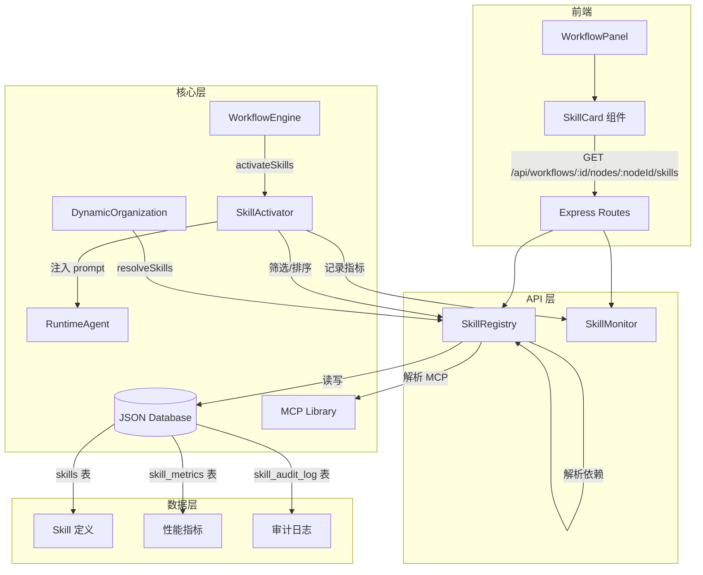

# 设计文档：Plugin / Skill 体系

## 概述

Plugin / Skill 体系在现有 Cube Pets Office 多智能体平台上构建模块化能力框架。核心思路是将 `dynamic-organization.ts` 中硬编码的 `SKILL_LIBRARY` 演进为数据库驱动的 `SkillRegistry`，支持运行时注册、版本管理、依赖解析、灰度发布和性能监控。

设计遵循以下原则：
- **渐进式迁移**：保持与现有 `WorkflowSkillBinding`、`WorkflowOrganizationNode` 类型的兼容
- **最小侵入**：通过扩展而非重写现有模块实现功能
- **数据库驱动**：Skill 定义从硬编码迁移到 JSON 数据库（与现有 `server/db/index.ts` 模式一致）

## 架构



### 数据流

1. **注册流**：管理员 → `registerSkill()` → SkillRegistry → 验证 → 持久化到 DB
2. **装配流**：DynamicOrganization → `resolveSkills(skillIds)` → 依赖解析 → SkillBinding[] → Node.skills
3. **激活流**：WorkflowEngine → `activateSkills(skills, context)` → 筛选/截断 → prompt 注入 → Agent 执行
4. **监控流**：SkillActivator → 记录 metrics → SkillMonitor → 聚合查询

## 组件和接口

### 1. SkillRegistry（`server/core/skill-registry.ts`）

全局 Skill 仓库，负责 Skill 的 CRUD、版本管理、依赖解析和启用/禁用控制。

```typescript
class SkillRegistry {
  /** 注册新 Skill，验证 prompt 模板后持久化 */
  registerSkill(definition: SkillDefinition): SkillRecord;

  /** 将 skillId 列表解析为 SkillBinding[]，自动解析依赖 */
  resolveSkills(skillIds: string[], options?: ResolveOptions): SkillBinding[];

  /** 启用指定版本的 Skill */
  enableSkill(skillId: string, version: string, operator: string, reason: string): void;

  /** 禁用指定版本的 Skill */
  disableSkill(skillId: string, version: string, operator: string, reason: string): void;

  /** 查询 Skill 的所有版本 */
  getSkillVersions(skillId: string): SkillRecord[];

  /** 按 category 和 tags 查询 Skill */
  querySkills(filter: SkillQueryFilter): SkillRecord[];

  /** 将 Skill 的 requiredMcp 解析为 McpBinding[] */
  resolveMcpForSkill(skill: SkillRecord, agentId: string, workflowId: string): WorkflowMcpBinding[];
}
```

### 2. SkillActivator（`server/core/skill-activator.ts`）

负责在 Agent 执行时激活 Skill、注入 prompt 和记录指标。

```typescript
class SkillActivator {
  /** 根据任务上下文筛选并激活 Skill */
  activateSkills(
    skills: SkillBinding[],
    taskContext: string,
    maxSkills?: number
  ): ActivatedSkill[];

  /** 将激活的 Skill prompt 拼接为系统提示片段 */
  buildSkillPromptSection(activatedSkills: ActivatedSkill[]): string;
}
```

### 3. SkillMonitor（`server/core/skill-monitor.ts`）

收集和查询 Skill 执行性能数据。

```typescript
class SkillMonitor {
  /** 记录 Skill 执行指标 */
  recordMetrics(metrics: SkillExecutionMetrics): void;

  /** 查询 Skill 性能数据 */
  getSkillMetrics(skillId: string, timeRange: TimeRange): AggregatedMetrics;

  /** 检查是否需要触发告警 */
  checkAlerts(skillId: string): AlertResult | null;
}
```

### 4. Skill API Routes（`server/routes/skills.ts`）

```typescript
// Skill 管理
POST   /api/skills                              — 注册新 Skill
GET    /api/skills                              — 查询 Skill 列表（支持 category、tags 过滤）
GET    /api/skills/:id/versions                 — 查询 Skill 版本列表
PUT    /api/skills/:id/:version/enable          — 启用 Skill
PUT    /api/skills/:id/:version/disable         — 禁用 Skill

// 工作流节点 Skill 查询
GET    /api/workflows/:id/nodes/:nodeId/skills  — 查询节点的 Skill 列表

// 性能监控
GET    /api/skills/:id/metrics                  — 查询 Skill 性能指标
```

### 5. 前端组件

- **SkillCard**：展示单个 Skill 的 name、summary、category、version、enabled 状态
- **SkillDetailModal**：展示 Skill 详细信息（prompt、MCP 依赖、性能指标）
- 集成到现有 `WorkflowPanel` 的 `OrgView` 中

## 数据模型

### SkillDefinition（输入）

```typescript
interface SkillDefinition {
  id: string;                    // 全局唯一标识符，如 "code-review"
  name: string;                  // 可读名称
  category: string;              // 分类：code | data | security | analysis 等
  summary: string;               // 功能描述
  prompt: string;                // 核心 prompt 模板，包含 {context}、{input} 占位符
  requiredMcp: string[];         // 依赖的 MCP 工具 ID 列表
  version: string;               // 语义化版本号，如 "1.0.0"
  tags: string[];                // 标签集合
  dependencies?: string[];       // 依赖的其他 Skill ID
}
```

### SkillRecord（持久化）

```typescript
interface SkillRecord extends SkillDefinition {
  enabled: boolean;              // 是否启用
  canary?: CanaryConfig;         // 灰度发布配置
  createdAt: string;             // 创建时间 ISO 8601
  updatedAt: string;             // 更新时间 ISO 8601
}

interface CanaryConfig {
  enabled: boolean;              // 是否启用灰度
  percentage: number;            // 流量百分比 0-100
  targetVersion: string;         // 灰度目标版本
}
```

### SkillBinding（运行时）

```typescript
interface SkillBinding {
  skillId: string;
  version: string;
  resolvedSkill: SkillRecord;
  mcpBindings: WorkflowMcpBinding[];
  config?: SkillBindingConfig;
  enabled: boolean;
}

interface SkillBindingConfig {
  temperature?: number;
  maxTokens?: number;
  priority?: number;             // 优先级，用于激活排序
}
```

### SkillExecutionMetrics（监控）

```typescript
interface SkillExecutionMetrics {
  skillId: string;
  version: string;
  workflowId: string;
  agentId: string;
  agentRole: string;
  taskType: string;
  activationTimeMs: number;      // 激活耗时
  executionTimeMs: number;       // 执行耗时
  tokenCount: number;            // token 消耗
  success: boolean;              // 是否成功
  timestamp: string;             // ISO 8601
}
```

### SkillAuditLog（审计）

```typescript
interface SkillAuditLog {
  id: number;
  skillId: string;
  version: string;
  action: "enable" | "disable" | "register" | "version_switch";
  operator: string;
  reason: string;
  timestamp: string;
}
```

### SkillContext（上下文隔离）

```typescript
interface SkillContext {
  skillId: string;
  input: Record<string, unknown>;
  output: Record<string, unknown>;
  state: Record<string, unknown>;
  sideEffects: SideEffect[];
}

interface SideEffect {
  type: "file_write" | "db_operation" | "api_call";
  description: string;
  timestamp: string;
  reversible: boolean;
}
```

### 数据库 Schema 扩展

在 `server/db/index.ts` 的 `DatabaseSchema` 中新增：

```typescript
interface DatabaseSchema {
  // ... 现有表 ...
  skills: SkillRecord[];
  skill_metrics: SkillExecutionMetrics[];
  skill_audit_log: SkillAuditLog[];
  _counters: {
    // ... 现有计数器 ...
    skill_metrics: number;
    skill_audit_log: number;
  };
}
```


## 正确性属性

*属性（Property）是在系统所有有效执行中都应成立的特征或行为——本质上是关于系统应该做什么的形式化陈述。属性是人类可读规范与机器可验证正确性保证之间的桥梁。*

### Property 1: Skill 注册往返一致性
*对于任意*有效的 SkillDefinition，调用 registerSkill() 后，通过 querySkills 或 getSkillVersions 查询应返回等价的 Skill 记录（id、name、category、summary、prompt、requiredMcp、version、tags 字段一致）
**Validates: Requirements 1.1, 1.2, 1.5**

### Property 2: Prompt 模板验证
*对于任意*字符串作为 prompt，验证函数应当且仅当 prompt 包含 `{context}` 和 `{input}` 占位符时返回有效；对于不包含这些占位符的 prompt，registerSkill 应拒绝注册
**Validates: Requirements 1.4**

### Property 3: 版本并存
*对于任意* skillId 和任意一组不同的 version 字符串，分别注册后，getSkillVersions(skillId) 应返回所有已注册的版本，且数量等于注册的不同版本数
**Validates: Requirements 1.3, 6.3**

### Property 4: Skill 解析正确性
*对于任意*一组已注册且启用的 skillId，resolveSkills(skillIds) 应返回 SkillBinding 数组，其中每个 binding 的 skillId 对应输入中的一个有效 skillId
**Validates: Requirements 2.2**

### Property 5: 依赖传递闭包
*对于任意*无环的 Skill 依赖图，resolveSkills([rootSkillId]) 应返回 rootSkill 及其所有传递依赖的完整闭包，且不包含重复项
**Validates: Requirements 2.3, 8.2**

### Property 6: 缺失 Skill 优雅降级
*对于任意*包含有效和无效 skillId 的混合列表，resolveSkills 应返回所有有效 skillId 对应的 SkillBinding，跳过无效的，且不抛出异常
**Validates: Requirements 2.4**

### Property 7: 循环依赖检测
*对于任意*包含循环依赖的 Skill 依赖图，resolveSkills 应检测到循环并返回错误，而非无限递归
**Validates: Requirements 8.3**

### Property 8: 禁用 Skill 过滤
*对于任意*一组 Skill，其中部分被 disableSkill 禁用，resolveSkills 的结果应仅包含启用状态的 Skill；且 disableSkill 后立即调用 resolveSkills 应反映最新状态
**Validates: Requirements 5.2, 5.3**

### Property 9: Skill 激活数量上限
*对于任意*长度大于 N 的 SkillBinding 列表，activateSkills 应返回最多 N 个 Skill（N 为配置的最大值），且返回的是按相关度排序的前 N 个
**Validates: Requirements 3.5**

### Property 10: 优先级排序的 Prompt 拼接
*对于任意*一组具有不同优先级的已激活 Skill，buildSkillPromptSection 生成的 prompt 字符串中，各 Skill 的 prompt 片段应按优先级从高到低排列
**Validates: Requirements 3.2**

### Property 11: 上下文占位符替换
*对于任意* Skill prompt 模板和任意任务上下文字符串，占位符替换后的结果应包含任务上下文内容，且不包含字面量 `{context}` 占位符
**Validates: Requirements 3.3**

### Property 12: MCP 解析正确性
*对于任意* Skill 的 requiredMcp 列表中存在于 MCP 库中的 ID，resolveMcpForSkill 应返回对应的 McpBinding 对象，且数量等于有效 MCP ID 的数量
**Validates: Requirements 4.2**

### Property 13: MCP 不可用时优雅降级
*对于任意*包含有效和无效 MCP ID 的 requiredMcp 列表，resolveMcpForSkill 应返回所有有效 MCP 的绑定，跳过无效的，且不抛出异常
**Validates: Requirements 4.3**

### Property 14: 审计日志完整性
*对于任意* enableSkill、disableSkill 或版本切换操作，操作完成后审计日志中应包含对应的记录，且记录包含 skillId、version、action、operator、reason 和 timestamp 字段
**Validates: Requirements 5.4, 6.5**

### Property 15: 语义化版本验证
*对于任意*字符串，版本验证函数应当且仅当字符串符合语义化版本格式（X.Y.Z，其中 X、Y、Z 为非负整数）时返回有效
**Validates: Requirements 6.1**

### Property 16: 指定版本解析
*对于任意*具有多个版本的 Skill，当 resolveSkills 指定特定版本时，返回的 SkillBinding 应包含该精确版本的 Skill 定义
**Validates: Requirements 6.2**

### Property 17: 灰度流量分布
*对于任意*灰度配置（percentage = P），在大量解析请求中，使用灰度版本的比例应近似于 P%（允许统计误差范围）
**Validates: Requirements 6.4**

### Property 18: 性能指标记录往返
*对于任意* SkillExecutionMetrics，调用 recordMetrics 后，通过 getSkillMetrics 在对应时间范围内查询应包含该指标记录
**Validates: Requirements 7.1, 7.2**

### Property 19: 指标聚合正确性
*对于任意*一组具有不同 version、agentRole、taskType 的指标记录，按维度聚合后的结果应正确反映各维度的分组统计
**Validates: Requirements 7.3**

### Property 20: 告警阈值触发
*对于任意*一组指标记录，当失败率（失败次数/总次数）超过配置阈值时，checkAlerts 应返回告警结果；当失败率低于阈值时，应返回 null
**Validates: Requirements 7.4**

### Property 21: 上下文隔离
*对于任意*两个同时执行的 Skill，修改一个 Skill 的 SkillContext.state 不应影响另一个 Skill 的 SkillContext.state
**Validates: Requirements 9.1, 9.2**

### Property 22: 副作用记录
*对于任意* Skill 执行产生的副作用，SkillContext.sideEffects 数组应包含对应的 SideEffect 记录，且记录包含 type、description 和 timestamp 字段
**Validates: Requirements 9.3**

### Property 23: Skill 卡片渲染完整性
*对于任意* SkillBinding 数据，渲染的 Skill 卡片应包含 name、summary、category、version 和 enabled 状态信息
**Validates: Requirements 10.2**

## 错误处理

| 场景 | 处理策略 |
|------|---------|
| Skill 注册时 prompt 模板无效 | 返回验证错误，拒绝注册，包含具体的缺失占位符信息 |
| resolveSkills 遇到未知 skillId | 记录 warn 日志，跳过该 ID，继续处理其余 Skill |
| 循环依赖检测 | 返回 `CircularDependencyError`，包含循环路径信息 |
| MCP 工具不可用 | 记录 warn 日志，Skill 进入降级模式（无 MCP 绑定但仍可执行） |
| Skill 激活超过上限 | 按优先级排序后截断，记录 info 日志说明被截断的 Skill |
| 数据库读写失败 | 抛出异常，由上层 API 路由返回 500 错误 |
| 版本格式无效 | 返回验证错误，拒绝操作 |
| 灰度配置百分比超出范围 | 钳位到 0-100 范围 |
| 性能指标写入失败 | 记录 error 日志但不阻塞 Skill 执行（监控不应影响业务） |

## 测试策略

### 属性测试（Property-Based Testing）

使用 **fast-check** 库进行属性测试，每个属性测试至少运行 100 次迭代。

测试标签格式：`Feature: plugin-skill-system, Property {N}: {property_text}`

核心属性测试覆盖：
- **SkillRegistry**：Property 1-8, 14-17（注册往返、版本管理、依赖解析、启用/禁用）
- **SkillActivator**：Property 9-11（激活上限、优先级排序、占位符替换）
- **MCP 解析**：Property 12-13（MCP 解析和降级）
- **SkillMonitor**：Property 18-20（指标记录、聚合、告警）
- **SkillContext**：Property 21-22（上下文隔离、副作用记录）
- **前端渲染**：Property 23（卡片渲染完整性）

### 单元测试

单元测试聚焦于具体示例和边界情况：
- 注册一个完整的 Skill 并验证返回值
- 注册缺少必填字段的 Skill 并验证错误
- 解析包含 3 层依赖的 Skill 链
- 解析包含 A→B→C→A 循环的依赖图
- 禁用 Skill 后立即查询验证过滤
- 空 skillIds 列表的 resolveSkills 调用
- 灰度配置为 0% 和 100% 的边界情况
- API 端点的请求/响应格式验证

### 集成测试

- 完整的 Skill 注册 → 解析 → 激活 → 执行流程
- WorkflowEngine 中 Skill prompt 注入的端到端验证
- API 路由与数据库的集成
- 前端组件与 API 的数据流验证
