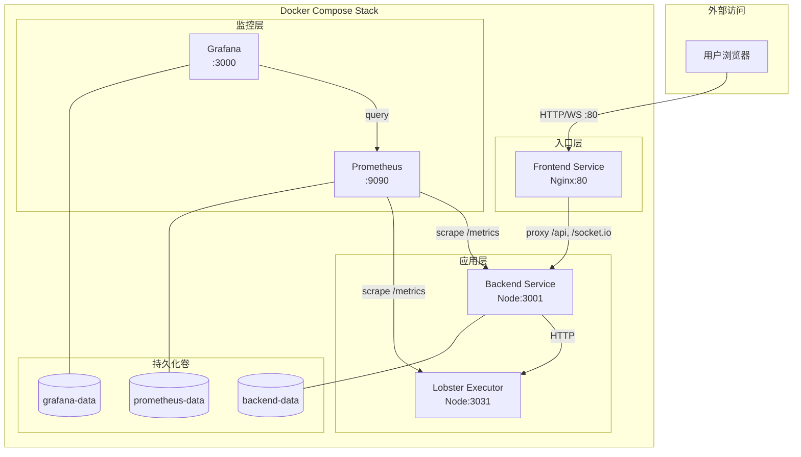
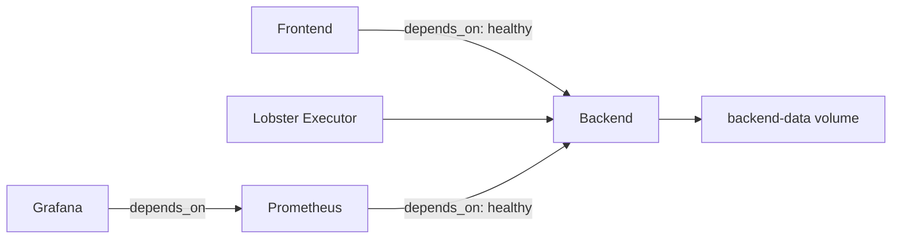

# 设计文档

## 概述

本设计为 Cube Pets Office 提供基于 Docker Compose 的生产级部署方案。整体架构采用五服务编排模式：Nginx 前端静态托管、Node.js 后端、Lobster Executor 执行器、Prometheus 指标采集、Grafana 可视化仪表盘。所有服务通过 Docker 内部网络通信，仅前端 80 端口对外暴露。通过多阶段构建最小化镜像体积，通过健康检查和优雅关闭保障服务可用性，通过部署脚本实现零停机更新。

## 架构



### 服务依赖关系



### 网络拓扑

- 所有服务加入同一个 Docker bridge 网络 `cube-network`
- Frontend (Nginx) 是唯一对外暴露端口的服务（host:80 → container:80）
- Grafana 可选暴露 host:3000 用于运维访问
- Prometheus 仅内部网络可达（安全考虑不对外暴露）
- 服务间通过 Docker DNS 使用服务名通信（如 `http://backend:3001`）

## 组件与接口

### 1. Dockerfile.frontend（多阶段构建）

```
阶段 1 - builder:
  基础镜像: node:20-alpine
  安装 pnpm → 复制 package.json/pnpm-lock.yaml → pnpm install --frozen-lockfile
  复制源码 → pnpm run build（仅 vite build，产出 dist/public/）

阶段 2 - runtime:
  基础镜像: nginx:1.27-alpine
  复制 dist/public/ → /usr/share/nginx/html/
  复制 nginx.conf → /etc/nginx/conf.d/default.conf
  用户: nginx（非 root）
  HEALTHCHECK: curl -f http://localhost/health || exit 1
```

Nginx 配置要点：

- `location /` → 静态文件，try_files $uri $uri/ /index.html（SPA fallback）
- `location /api/` → proxy_pass http://backend:3001
- `location /socket.io/` → proxy_pass http://backend:3001（WebSocket upgrade）
- `location /health` → return 200 "ok"（Nginx 自身健康检查）

### 2. Dockerfile.backend（多阶段构建）

```
阶段 1 - builder:
  基础镜像: node:20-alpine
  安装 pnpm → 复制 package.json/pnpm-lock.yaml → pnpm install --frozen-lockfile
  复制源码 → pnpm run build（esbuild 产出 dist/index.js）

阶段 2 - runtime:
  基础镜像: node:20-alpine
  仅复制 dist/index.js + node_modules（生产依赖）+ package.json
  创建非 root 用户 appuser
  USER appuser
  HEALTHCHECK: wget -qO- http://localhost:3001/api/health || exit 1
  CMD ["node", "dist/index.js"]
```

### 3. Dockerfile.lobster（多阶段构建）

```
阶段 1 - builder:
  基础镜像: node:20-alpine
  工作目录: /app/services/lobster-executor
  复制 lobster-executor 源码 → 安装依赖 → 构建

阶段 2 - runtime:
  基础镜像: node:20-alpine
  仅复制构建产物和生产依赖
  创建非 root 用户 appuser
  USER appuser
  HEALTHCHECK: wget -qO- http://localhost:3031/health || exit 1
  CMD ["node", "dist/index.js"]
```

### 4. docker-compose.yml

```yaml
# 伪代码结构
services:
  frontend:
    build: {context: ., dockerfile: Dockerfile.frontend}
    ports: ["${FRONTEND_PORT:-80}:80"]
    depends_on:
      backend: {condition: service_healthy}
    read_only: true
    tmpfs: [/var/cache/nginx, /var/run, /tmp]
    networks: [cube-network]
    logging: {driver: json-file, options: {max-size: 10m, max-file: "3"}}

  backend:
    build: {context: ., dockerfile: Dockerfile.backend}
    env_file: [.env]
    volumes: [backend-data:/app/data]
    healthcheck:
      test: wget -qO- http://localhost:3001/api/health || exit 1
      interval: 15s, timeout: 5s, retries: 3, start_period: 10s
    networks: [cube-network]
    logging: {driver: json-file, options: {max-size: 10m, max-file: "3"}}

  lobster-executor:
    build: {context: ., dockerfile: Dockerfile.lobster}
    env_file: [.env]
    volumes: [lobster-data:/app/tmp/lobster-executor]
    healthcheck: ...
    networks: [cube-network]

  prometheus:
    image: prom/prometheus:v2.53.0
    volumes:
      - ./deploy/prometheus.yml:/etc/prometheus/prometheus.yml:ro
      - prometheus-data:/prometheus
    depends_on:
      backend: {condition: service_healthy}
    networks: [cube-network]

  grafana:
    image: grafana/grafana:11.1.0
    volumes:
      - ./deploy/grafana/provisioning:/etc/grafana/provisioning:ro
      - ./deploy/grafana/dashboards:/var/lib/grafana/dashboards:ro
      - grafana-data:/var/lib/grafana
    environment:
      GF_SECURITY_ADMIN_PASSWORD: ${GRAFANA_ADMIN_PASSWORD:-changeme}
    depends_on: [prometheus]
    ports: ["${GRAFANA_PORT:-3000}:3000"]
    networks: [cube-network]

volumes:
  backend-data:
  lobster-data:
  prometheus-data:
  grafana-data:

networks:
  cube-network:
    driver: bridge
```

### 5. server/core/prometheus.ts（指标模块）

接口设计：

```typescript
// 初始化 Prometheus 指标收集
function initMetrics(app: Express): void;

// 中间件：记录 HTTP 请求指标
function metricsMiddleware(): RequestHandler;

// GET /metrics 路由处理
function metricsHandler(req: Request, res: Response): void;
```

指标定义：

- `http_requests_total` — Counter，标签：method, path, status_code
- `http_request_duration_seconds` — Histogram，标签：method, path
- `socketio_connections_active` — Gauge
- `nodejs_memory_usage_bytes` — Gauge，标签：type (rss, heapTotal, heapUsed, external)

使用 `prom-client` 库（Node.js 标准 Prometheus 客户端）。

### 6. server/core/logger.ts（结构化日志模块）

接口设计：

```typescript
interface LogEntry {
  timestamp: string; // ISO 8601
  level: "info" | "warn" | "error";
  message: string;
  service: string;
  method?: string; // HTTP method
  path?: string; // HTTP path
  statusCode?: number; // HTTP status code
  durationMs?: number; // 请求耗时
}

// 创建日志记录器
function createLogger(service: string): Logger;

interface Logger {
  info(message: string, meta?: Record<string, unknown>): void;
  warn(message: string, meta?: Record<string, unknown>): void;
  error(message: string, meta?: Record<string, unknown>): void;
}

// Express 请求日志中间件
function requestLogMiddleware(logger: Logger): RequestHandler;
```

实现策略：直接输出 JSON 到 stdout（`console.log(JSON.stringify(entry))`），不引入额外日志框架，保持轻量。

### 7. 优雅关闭模块（server/core/graceful-shutdown.ts）

```typescript
interface GracefulShutdownOptions {
  server: HttpServer;
  timeoutMs?: number; // 默认 30000
  onShutdown?: () => Promise<void>; // 清理回调
}

function setupGracefulShutdown(options: GracefulShutdownOptions): void;
```

行为：

1. 监听 SIGTERM 和 SIGINT 信号
2. 调用 `server.close()` 停止接受新连接
3. 等待现有连接完成或超时
4. 执行 onShutdown 回调（如关闭数据库连接）
5. 退出进程

### 8. deploy/prometheus.yml

```yaml
global:
  scrape_interval: 15s
  evaluation_interval: 15s

scrape_configs:
  - job_name: "cube-backend"
    static_configs:
      - targets: ["backend:3001"]
    metrics_path: /metrics

  - job_name: "cube-lobster"
    static_configs:
      - targets: ["lobster-executor:3031"]
    metrics_path: /metrics
```

### 9. Grafana 预配置

目录结构：

```
deploy/grafana/
├── provisioning/
│   ├── datasources/
│   │   └── prometheus.yml      # 自动配置 Prometheus 数据源
│   └── dashboards/
│       └── dashboard.yml       # 仪表盘提供者配置
└── dashboards/
    └── cube-overview.json      # 预配置仪表盘 JSON
```

仪表盘面板：

- HTTP 请求速率（rate of http_requests_total）
- 请求延迟分位数（histogram_quantile p50/p95/p99）
- 活跃 Socket.IO 连接数
- Node.js 内存使用趋势

### 10. scripts/deploy-prod.sh（零停机更新脚本）

```bash
#!/bin/bash
# 零停机更新流程：
# 1. 拉取最新代码
# 2. 构建新镜像（docker compose build）
# 3. 逐个滚动更新服务：
#    a. docker compose up -d --no-deps --build backend
#    b. 等待 backend 健康检查通过
#    c. docker compose up -d --no-deps --build lobster-executor
#    d. 等待 lobster-executor 健康检查通过
#    e. docker compose up -d --no-deps --build frontend
#    f. 等待 frontend 健康检查通过
# 4. 清理旧镜像
# 5. 输出更新结果
```

### 11. 多环境配置文件

```
.env.dev       — NODE_ENV=development, 宽松日志, mock 模式
.env.staging   — NODE_ENV=staging, 接近生产配置, 可选 mock
.env.prod      — NODE_ENV=production, 严格配置, 真实 LLM/飞书
```

每个文件包含完整的环境变量分组，与 .env.example 对齐。

### 12. Nginx 配置（deploy/nginx.conf）

```nginx
server {
    listen 80;
    server_name _;

    root /usr/share/nginx/html;
    index index.html;

    # SPA fallback
    location / {
        try_files $uri $uri/ /index.html;
    }

    # API 反向代理
    location /api/ {
        proxy_pass http://backend:3001;
        proxy_set_header Host $host;
        proxy_set_header X-Real-IP $remote_addr;
        proxy_set_header X-Forwarded-For $proxy_add_x_forwarded_for;
        proxy_set_header X-Forwarded-Proto $scheme;
    }

    # WebSocket 代理
    location /socket.io/ {
        proxy_pass http://backend:3001;
        proxy_http_version 1.1;
        proxy_set_header Upgrade $http_upgrade;
        proxy_set_header Connection "upgrade";
        proxy_set_header Host $host;
    }

    # 健康检查
    location /health {
        access_log off;
        return 200 "ok";
    }
}
```

## 数据模型

### Prometheus 指标模型

| 指标名                          | 类型      | 标签                      | 说明                                                |
| ------------------------------- | --------- | ------------------------- | --------------------------------------------------- |
| `http_requests_total`           | Counter   | method, path, status_code | HTTP 请求总数                                       |
| `http_request_duration_seconds` | Histogram | method, path              | 请求延迟分布                                        |
| `socketio_connections_active`   | Gauge     | —                         | 当前活跃 WebSocket 连接数                           |
| `nodejs_memory_usage_bytes`     | Gauge     | type                      | Node.js 内存使用（rss/heapTotal/heapUsed/external） |

### 日志条目模型

```typescript
interface LogEntry {
  timestamp: string; // ISO 8601 格式
  level: "info" | "warn" | "error";
  message: string;
  service: string; // 服务标识（backend / lobster-executor）
  method?: string; // HTTP 方法
  path?: string; // 请求路径
  statusCode?: number; // 响应状态码
  durationMs?: number; // 请求处理耗时（毫秒）
  [key: string]: unknown; // 扩展字段
}
```

### 环境配置模型

```typescript
interface EnvironmentConfig {
  // 基础运行
  PORT: number;
  NODE_ENV: "development" | "staging" | "production";

  // 主 LLM
  LLM_API_KEY: string;
  LLM_BASE_URL: string;
  LLM_MODEL: string;

  // 监控
  GRAFANA_ADMIN_PASSWORD: string;
  GRAFANA_PORT: number;
  FRONTEND_PORT: number;

  // ... 其余变量与 .env.example 对齐
}
```

### 健康检查响应模型

```typescript
interface HealthResponse {
  status: "ok" | "degraded" | "error";
  timestamp: string;
  version?: string;
  uptime?: number;
  features: {
    workflows: boolean;
    tasks: boolean;
    feishu: boolean;
    executorCallbacks: boolean;
    missionSocket: boolean;
  };
}
```

## 正确性属性

_属性（Property）是指在系统所有有效执行中都应成立的特征或行为——本质上是关于系统应该做什么的形式化陈述。属性是人类可读规范与机器可验证正确性保证之间的桥梁。_

### Property 1: 日志格式与级别正确性

_For any_ 日志级别（info / warn / error）和任意非空消息字符串，Logger 输出到 stdout 的内容应为有效 JSON，且包含 `timestamp`（ISO 8601 格式）、`level`（与调用级别一致）、`message`（与输入消息一致）、`service`（非空字符串）四个字段。

**Validates: Requirements 5.1, 5.3**

### Property 2: HTTP 请求日志完整性

_For any_ HTTP 请求（任意 method、path、statusCode 组合）经过请求日志中间件处理后，输出的 JSON 日志应额外包含 `method`、`path`、`statusCode` 字段，且各字段值与实际请求/响应一致。

**Validates: Requirements 5.4**

### Property 3: 环境配置完整性

_For any_ 环境配置文件（.env.dev / .env.staging / .env.prod），文件中应包含所有必需环境变量键（PORT、NODE_ENV、LLM_API_KEY、LLM_BASE_URL、LLM_MODEL、EXECUTOR_CALLBACK_SECRET、LOBSTER_EXECUTOR_BASE_URL），且不存在遗漏。

**Validates: Requirements 3.3**

### Property 4: 环境变量缺失检测

_For any_ 必需环境变量的非空真子集缺失，环境变量验证函数应返回包含所有缺失变量名的错误信息，且不会遗漏任何缺失项。

**Validates: Requirements 3.4**

### Property 5: 优雅关闭完成性

_For any_ 正在处理请求的 HTTP 服务器，当收到关闭信号后，服务器应停止接受新连接，并在超时时间内等待所有已接受的请求完成处理后再退出。

**Validates: Requirements 4.3**

### Property 6: Dockerfile 非 root 用户

_For any_ 项目中的 Dockerfile（frontend / backend / lobster），最终运行阶段应包含 USER 指令且指定的用户不是 root。

**Validates: Requirements 1.4**

## 错误处理

### 启动阶段

| 错误场景            | 处理方式                                                  |
| ------------------- | --------------------------------------------------------- |
| 必需环境变量缺失    | 输出缺失变量列表到 stderr，以退出码 1 终止                |
| 端口被占用          | 输出端口冲突错误，以退出码 1 终止                         |
| Docker 网络创建失败 | Docker Compose 自动报错，用户需检查 Docker 守护进程状态   |
| 镜像构建失败        | Docker Compose 输出构建错误，用户需检查 Dockerfile 和依赖 |

### 运行阶段

| 错误场景             | 处理方式                                                               |
| -------------------- | ---------------------------------------------------------------------- |
| 后端服务崩溃         | Docker restart policy（unless-stopped）自动重启，Health_Check 检测恢复 |
| Prometheus 抓取失败  | Prometheus 记录 scrape error，不影响应用服务运行                       |
| Grafana 数据源不可达 | Grafana 仪表盘显示 "No Data"，不影响应用服务运行                       |
| 磁盘空间不足         | 日志轮转（max-size: 10m, max-file: 3）限制日志占用，数据卷需运维监控   |

### 更新阶段

| 错误场景           | 处理方式                                        |
| ------------------ | ----------------------------------------------- |
| 新镜像构建失败     | deploy-prod.sh 脚本中止，旧服务继续运行不受影响 |
| 新容器健康检查失败 | 脚本等待超时后报错，旧容器保持运行              |
| 回滚需求           | 使用上一次构建的镜像 tag 重新部署               |

## 测试策略

### 属性测试（Property-Based Testing）

使用 `fast-check` 库（TypeScript 属性测试标准库），每个属性测试运行至少 100 次迭代。

| 属性                                | 测试目标            | 验证需求 |
| ----------------------------------- | ------------------- | -------- |
| Property 1: 日志格式与级别正确性    | Logger 模块         | 5.1, 5.3 |
| Property 2: HTTP 请求日志完整性     | 请求日志中间件      | 5.4      |
| Property 3: 环境配置完整性          | .env 文件解析       | 3.3      |
| Property 4: 环境变量缺失检测        | 验证函数            | 3.4      |
| Property 5: 优雅关闭完成性          | 关闭模块            | 4.3      |
| Property 6: Dockerfile 非 root 用户 | Dockerfile 静态分析 | 1.4      |

每个属性测试必须标注注释：

```
// Feature: production-deployment, Property N: <property_text>
```

### 单元测试

| 测试目标            | 验证内容                               |
| ------------------- | -------------------------------------- |
| /api/health 端点    | 返回正确的 JSON 结构和状态码           |
| /metrics 端点       | 返回 Prometheus 文本格式，包含必需指标 |
| prometheus.yml 配置 | YAML 语法正确，包含所有抓取目标        |
| Grafana 仪表盘 JSON | JSON 语法正确，包含必需面板            |
| docker-compose.yml  | 服务定义完整，卷和网络配置正确         |
| .dockerignore       | 包含所有必需排除项                     |

### Smoke 测试

部署完成后执行的端到端验证：

1. `curl http://localhost/api/health` — 验证后端健康
2. `curl http://localhost/` — 验证前端页面可访问
3. `curl http://localhost/metrics` — 验证指标端点可用
4. 验证 Grafana 仪表盘可访问（http://localhost:3000）
5. 验证 Prometheus targets 页面显示所有目标为 UP 状态
