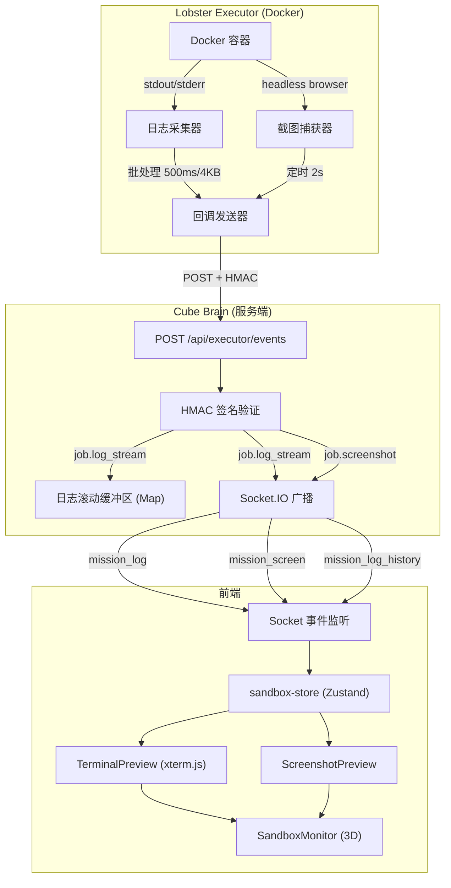
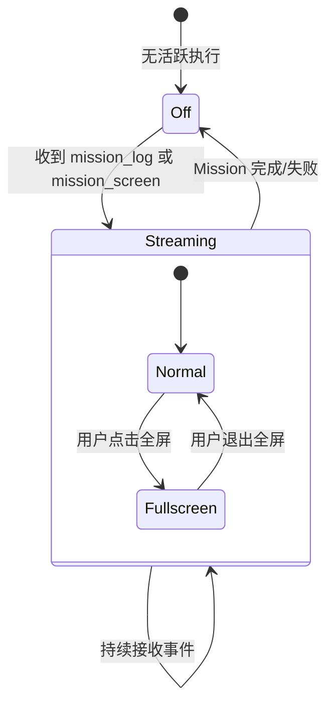

# 设计文档：Sandbox Live Preview

## 概述

本设计为 Cube Pets Office 平台增加沙箱实时预览能力，使用户能在 3D 办公场景中实时查看 Docker 容器的终端输出和浏览器截图。设计分为三层：

1. **协议层**：扩展 ExecutorEvent 类型，新增 `job.log_stream` 和 `job.screenshot` 事件类型
2. **中继层**：Cube Brain 接收执行器事件，维护滚动缓冲区，通过 Socket.IO 转发给前端
3. **展示层**：前端使用 xterm.js 终端组件和截图预览组件，通过 `Html` 桥接嵌入 3D 场景

关键设计决策：
- 复用现有 HMAC 签名回调机制，新事件类型与现有事件共享同一端点和验证逻辑
- 服务端使用内存滚动缓冲区（每 Mission 200 行），不持久化日志流数据
- 前端组件与 3D 场景解耦：纯 React DOM 组件通过 `Html` 桥接，与 scene-mission-fusion 的 MissionIsland 模式一致
- 截图以 base64 内联传输，避免引入文件服务或 CDN 依赖

## 架构



## 组件与接口

### 协议层扩展

#### ExecutorEventType 扩展（shared/executor/contracts.ts）

在现有 `EXECUTOR_EVENT_TYPES` 数组中新增两个事件类型：

```typescript
export const EXECUTOR_EVENT_TYPES = [
  // ... 现有类型
  "job.log_stream",   // 新增：实时日志流
  "job.screenshot",   // 新增：浏览器截图
] as const;
```

#### ExecutorEvent 扩展字段

```typescript
// 在 ExecutorEvent 接口中新增可选字段
export interface ExecutorEvent {
  // ... 现有字段
  stepIndex?: number;              // 日志/截图关联的步骤索引
  stream?: "stdout" | "stderr";   // 日志流类型
  data?: string;                   // 日志数据（最大 4KB）
  imageData?: string;              // base64 编码 PNG 截图（最大 200KB）
  imageWidth?: number;             // 截图宽度
  imageHeight?: number;            // 截图高度
}
```

#### Socket.IO 新事件类型（shared/mission/socket.ts）

```typescript
// 新增 Socket 事件常量
export const SANDBOX_SOCKET_EVENTS = {
  missionLog: "mission_log",
  missionScreen: "mission_screen",
  missionLogHistory: "mission_log_history",
} as const;

export interface SandboxLogPayload {
  missionId: string;
  jobId: string;
  stepIndex: number;
  stream: "stdout" | "stderr";
  data: string;
  timestamp: string;
}

export interface SandboxScreenPayload {
  missionId: string;
  jobId: string;
  stepIndex: number;
  imageData: string;
  width: number;
  height: number;
  timestamp: string;
}

export interface SandboxLogHistoryPayload {
  missionId: string;
  lines: SandboxLogPayload[];
}
```

### 服务端中继层

#### 日志滚动缓冲区（server/core/sandbox-relay.ts）

```typescript
export interface LogBufferEntry {
  missionId: string;
  jobId: string;
  stepIndex: number;
  stream: "stdout" | "stderr";
  data: string;
  timestamp: string;
}

export class SandboxRelay {
  private readonly logBuffers = new Map<string, LogBufferEntry[]>();
  private readonly maxLinesPerMission = 200;

  appendLog(entry: LogBufferEntry): void;
  getLogHistory(missionId: string): LogBufferEntry[];
  clearMission(missionId: string): void;
}
```

职责：
- 维护每个 Mission 的滚动日志缓冲区（最多 200 行）
- 当缓冲区满时，移除最旧的条目（FIFO）
- 提供历史日志查询接口
- Mission 完成/失败时清理缓冲区

#### 事件端点扩展（server/index.ts）

在现有 `/api/executor/events` 处理逻辑中，识别 `job.log_stream` 和 `job.screenshot` 类型：
- `job.log_stream`：写入 SandboxRelay 缓冲区 + 通过 Socket.IO 广播 `mission_log`
- `job.screenshot`：直接通过 Socket.IO 广播 `mission_screen`（不缓冲截图）

#### Socket 历史日志端点

新增 Socket.IO 事件监听 `request_log_history`：
- 客户端发送 `{ missionId: string }`
- 服务端从 SandboxRelay 读取缓冲区，回复 `mission_log_history` 事件

### 前端展示层

#### 新增文件结构

```
client/src/
├── lib/
│   └── sandbox-store.ts              # Zustand store：日志行、截图、连接状态
├── components/
│   ├── three/
│   │   └── SandboxMonitor.tsx         # 3D 监视器对象组 + Html 桥接
│   └── sandbox/
│       ├── TerminalPreview.tsx         # xterm.js 终端组件
│       └── ScreenshotPreview.tsx       # 截图预览组件
```

#### sandbox-store（client/src/lib/sandbox-store.ts）

```typescript
export interface LogLine {
  stepIndex: number;
  stream: "stdout" | "stderr";
  data: string;
  timestamp: string;
}

export interface ScreenshotFrame {
  stepIndex: number;
  imageData: string;
  width: number;
  height: number;
  timestamp: string;
}

export interface SandboxStoreState {
  activeMissionId: string | null;
  logLines: LogLine[];
  latestScreenshot: ScreenshotFrame | null;
  previousScreenshot: ScreenshotFrame | null;  // 用于交叉淡入
  isStreaming: boolean;
  fullscreen: boolean;

  // Actions
  appendLog(line: LogLine): void;
  setLogHistory(lines: LogLine[]): void;
  updateScreenshot(frame: ScreenshotFrame): void;
  setActiveMission(missionId: string | null): void;
  setFullscreen(value: boolean): void;
  reset(): void;
}
```

职责：
- 管理当前活跃 Mission 的日志行（最多 500 行，与 xterm.js scrollback 一致）
- 管理最新截图帧和前一帧（用于交叉淡入动画）
- 管理全屏状态
- 监听 Socket.IO 事件 `mission_log`、`mission_screen`、`mission_log_history`

#### TerminalPreview（client/src/components/sandbox/TerminalPreview.tsx）

```typescript
interface TerminalPreviewProps {
  logLines: LogLine[];
  isStreaming: boolean;
  fullscreen: boolean;
  onToggleFullscreen: () => void;
}
```

职责：
- 初始化 xterm.js Terminal 实例，配置 500 行 scrollback
- 接收 logLines 并写入 Terminal（stdout 默认色，stderr 红色前缀）
- 新输出时自动滚动到底部
- 空闲态显示 "等待执行..."
- 全屏切换按钮

#### ScreenshotPreview（client/src/components/sandbox/ScreenshotPreview.tsx）

```typescript
interface ScreenshotPreviewProps {
  current: ScreenshotFrame | null;
  previous: ScreenshotFrame | null;
  onClickZoom: () => void;
}
```

职责：
- 显示最新截图（``）
- 新截图到达时执行 300ms 交叉淡入过渡（CSS opacity transition）
- 显示时间戳叠加层
- 无截图时显示占位符 "暂无浏览器预览"
- 点击放大功能

#### SandboxMonitor（client/src/components/three/SandboxMonitor.tsx）

```typescript
// 3D 场景中的监视器区域
interface SandboxMonitorInternalState {
  glowIntensity: number;  // 0（关闭）到 1（活跃）
}
```

职责：
- 渲染 1-2 个监视器 3D 对象（BoxGeometry 模拟屏幕 + 支架）
- 通过 `Html` 组件桥接 TerminalPreview 和 ScreenshotPreview
- 根据 isStreaming 状态控制屏幕发光效果（emissive material + useFrame 动画）
- 无活跃执行时显示暗屏
- 定位在办公室右侧，与 MissionIsland 保持视觉距离

### Scene3D 修改

```tsx
<Suspense fallback={null}>
  {/* 现有组件 */}
  <OfficeRoom />
  <PetWorkers />
  <MissionIsland />
  <SandboxMonitor />  {/* 新增 */}
  <ContactShadows ... />
</Suspense>
```

## 数据模型

### 日志批处理逻辑（Executor 端）

```typescript
interface LogBatcher {
  readonly maxIntervalMs: number;  // 500ms
  readonly maxBatchSize: number;   // 4096 bytes

  flush(): { stream: "stdout" | "stderr"; data: string }[];
  append(stream: "stdout" | "stderr", chunk: string): void;
}
```

当满足以下任一条件时触发 flush：
- 距上次 flush 已过 500ms
- 累积数据量达到 4KB
- 步骤完成

### 日志重试逻辑（Executor 端）

```typescript
interface RetryBuffer {
  readonly maxBufferSize: number;  // 65536 bytes (64KB)
  readonly maxRetries: number;     // 3
  readonly baseDelayMs: number;    // 1000ms

  buffer(entry: LogBufferEntry): boolean;  // false = buffer full, drop
  retryAll(): Promise<void>;               // 指数退避重试
}
```

退避策略：`delay = baseDelayMs * 2^attempt`（1s, 2s, 4s）

### 截图捕获配置

```typescript
interface ScreenshotConfig {
  intervalMs: number;      // 默认 2000，范围 [1000, 10000]
  maxWidth: number;        // 800
  maxHeight: number;       // 600
  quality: number;         // PNG 压缩级别
  maxPayloadBytes: number; // 204800 (200KB)
}
```

### 滚动缓冲区数据结构

```typescript
// 服务端内存结构
type LogBufferMap = Map<string, LogBufferEntry[]>;
// key: missionId
// value: 最多 200 条 LogBufferEntry，FIFO 淘汰
```

### 3D 位置常量

```typescript
// Sandbox Monitor 在场景中的位置（办公室右侧）
const MONITOR_POSITION: [number, number, number] = [5.5, 0, 1.0];
const MONITOR_ROTATION: [number, number, number] = [0, -Math.PI / 6, 0];

// 主监视器（终端）Html 偏移
const TERMINAL_HTML_OFFSET: [number, number, number] = [0, 2.2, 0];
// 副监视器（截图）Html 偏移
const SCREENSHOT_HTML_OFFSET: [number, number, number] = [1.2, 2.2, 0];
```

### 状态流转




## 正确性属性

*属性是一种在系统所有有效执行中都应成立的特征或行为——本质上是关于系统应该做什么的形式化陈述。属性作为人类可读规范与机器可验证正确性保证之间的桥梁。*

基于验收标准的 prework 分析，以下属性覆盖协议层、中继层和展示层的核心可测试逻辑。

### Property 1: 日志批处理数据约束

*对任意* 日志块序列（每个块为任意长度的字符串），LogBatcher 的每次 flush 产生的 data 字段长度 SHALL ≤ 4096 字节，且每个 flush 结果包含有效的 stepIndex（非负整数）和 stream（"stdout" 或 "stderr"）字段。

**验证: 需求 1.1, 1.3, 1.4**

### Property 2: 重试缓冲区溢出保护

*对任意* 日志条目序列，RetryBuffer 中缓冲的总数据量 SHALL 不超过 64KB（65536 字节）。当缓冲区已满时，新条目应被丢弃（buffer 方法返回 false）。重试延迟应遵循指数退避：第 n 次重试的延迟为 `baseDelayMs * 2^n`。

**验证: 需求 1.5**

### Property 3: 截图载荷约束

*对任意* 输入图像尺寸 (w, h)，经过缩放后的输出尺寸 SHALL 满足：outputW ≤ 800 且 outputH ≤ 600，同时保持原始宽高比（误差 ≤ 1px）。编码后的 base64 载荷大小 SHALL ≤ 200KB。

**验证: 需求 2.1, 2.3**

### Property 4: 截图间隔钳位

*对任意* 输入间隔值（整数），钳位函数的输出 SHALL 在 [1000, 10000] 毫秒范围内。当输入 < 1000 时输出 1000，当输入 > 10000 时输出 10000，否则输出等于输入。

**验证: 需求 2.2**

### Property 5: 滚动日志缓冲区大小不变量

*对任意* 日志条目追加序列，SandboxRelay 的 logBuffer 中每个 missionId 对应的条目数 SHALL 不超过 200。当追加第 201 条时，最旧的条目应被移除，缓冲区长度保持 200。缓冲区中条目的顺序应与追加顺序一致。

**验证: 需求 3.4**

### Property 6: Stderr 视觉区分格式化

*对任意* LogLine，当 stream 为 "stderr" 时，格式化输出 SHALL 包含 ANSI 红色转义码（`\x1b[31m`）；当 stream 为 "stdout" 时，格式化输出 SHALL 不包含红色转义码。

**验证: 需求 4.3**

### Property 7: 时间戳显示格式化

*对任意* 有效的 ISO 8601 时间戳字符串，格式化函数的输出 SHALL 为非空字符串，且包含小时和分钟信息（HH:MM 格式）。

**验证: 需求 5.3**

## 错误处理

### 协议层错误

| 场景 | 处理方式 |
|------|---------|
| 日志事件 data 字段超过 4KB | Executor 端 LogBatcher 在 flush 时截断，确保不超限 |
| 截图 base64 载荷超过 200KB | Executor 端降低分辨率重新编码，仍超限则跳过该帧 |
| HMAC 签名验证失败 | 服务端返回 401，不处理事件，不中继 |
| 事件类型未知 | 服务端忽略未知类型，返回 200（向前兼容） |

### 中继层错误

| 场景 | 处理方式 |
|------|---------|
| Socket.IO 广播失败 | 记录警告日志，不影响事件端点响应 |
| 日志缓冲区内存压力 | 每个 Mission 最多 200 行，Mission 完成后清理 |
| 客户端请求不存在的 Mission 日志历史 | 返回空数组 |

### 展示层错误

| 场景 | 处理方式 |
|------|---------|
| xterm.js 初始化失败 | 显示降级文本区域（`<pre>` 标签） |
| 截图 base64 解码失败 | 显示错误占位符，保留前一帧 |
| Socket 连接断开 | 显示 "连接中断" 提示，自动重连后请求日志历史补齐 |
| 3D Html 组件渲染失败 | 不影响 3D 场景其余部分，监视器几何体仍可见 |

## 测试策略

### 属性测试（Property-Based Testing）

使用 `fast-check` 库进行属性测试，每个属性至少运行 100 次迭代。

| 属性 | 测试目标 | 生成器 |
|------|---------|--------|
| Property 1: 日志批处理数据约束 | `LogBatcher.flush()` | 生成随机字符串数组（每个 0-8KB），随机 stream 类型 |
| Property 2: 重试缓冲区溢出保护 | `RetryBuffer.buffer()` | 生成随机 LogBufferEntry 序列（data 长度 0-10KB） |
| Property 3: 截图载荷约束 | `resizeScreenshot()` | 生成随机 (width, height) 对（1-4000 范围） |
| Property 4: 截图间隔钳位 | `clampInterval()` | 生成随机整数（-1000 到 100000） |
| Property 5: 滚动缓冲区不变量 | `SandboxRelay.appendLog()` | 生成随机 LogBufferEntry 序列（长度 0-500） |
| Property 6: Stderr 格式化 | `formatLogLine()` | 生成随机 LogLine（随机 stream、随机 data） |
| Property 7: 时间戳格式化 | `formatTimestamp()` | 生成随机有效 ISO 8601 时间戳 |

每个测试需标注注释：`// Feature: sandbox-live-preview, Property N: {property_text}`

### 单元测试

使用 `vitest` 进行单元测试，覆盖以下场景：

- SandboxRelay：空缓冲区查询、单条追加、清理指定 Mission
- LogBatcher：空 flush、单行 flush、超大单行截断
- TerminalPreview：空闲态渲染（isStreaming === false）
- ScreenshotPreview：无截图占位符渲染
- SandboxMonitor：发光效果开关状态
- 事件端点：新事件类型的 HMAC 验证通过/拒绝

### 测试文件结构

```
server/tests/
└── sandbox-relay.test.ts              # SandboxRelay 属性测试 + 单元测试

services/lobster-executor/src/
└── log-batcher.test.ts                # LogBatcher 属性测试 + 单元测试

client/src/components/sandbox/
└── __tests__/
    ├── terminal-preview.test.ts       # 终端组件单元测试
    └── screenshot-preview.test.ts     # 截图组件单元测试

client/src/lib/
└── __tests__/
    └── sandbox-store.test.ts          # Store 逻辑测试
```
