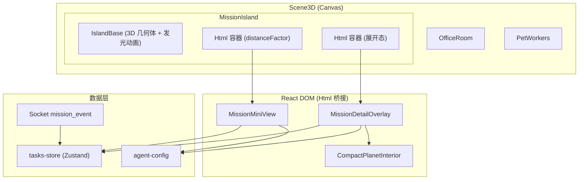
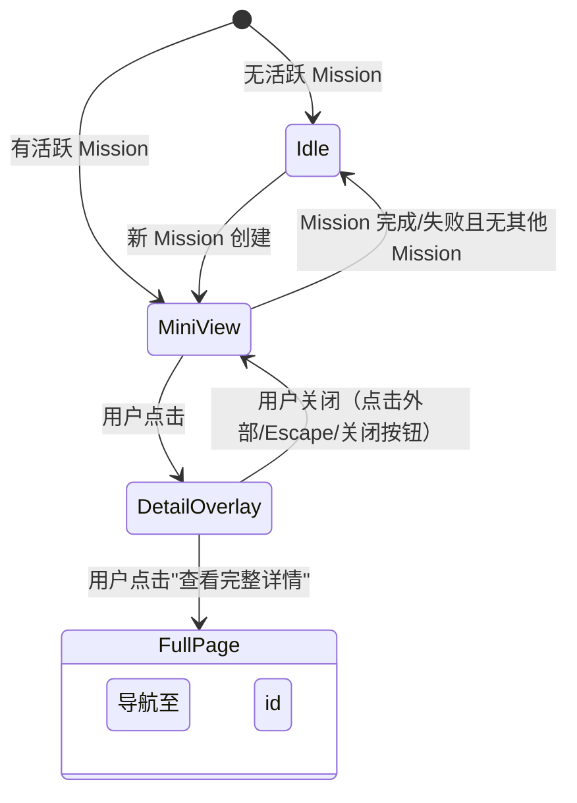

# 设计文档：Scene-Mission Fusion

## 概述

本设计将 Mission 任务驾驶舱的核心状态信息融合进 3D 办公场景，消除用户在 3D 场景和 /tasks 页面之间的导航割裂。核心策略是利用 @react-three/drei 的 `Html` 组件将 React DOM 元素桥接到 3D 空间，复用现有 React 组件和 Zustand tasks-store，不引入后端变更。

关键设计决策：
- 使用 `Html` 组件而非 Three.js 原生重写，大幅降低开发成本
- 复用 tasks-store 数据层，零后端改动
- 分层架构：3D 锚点层 → Mini View 层 → Detail Overlay 层，逐步展开信息密度

## 架构



## 组件与接口

### 新增文件结构

```
client/src/components/
├── three/
│   └── MissionIsland.tsx          # 3D 对象组 + Html 桥接容器
└── tasks/
    ├── MissionMiniView.tsx         # 紧凑摘要 React 组件
    ├── MissionDetailOverlay.tsx    # 详情覆盖面板 React 组件
    └── CompactPlanetInterior.tsx   # TaskPlanetInterior 的紧凑版
```

### MissionIsland（3D 组件）

```typescript
// client/src/components/three/MissionIsland.tsx
interface MissionIslandProps {
  // 无外部 props，内部从 tasks-store 读取数据
}

// 内部状态
interface IslandState {
  expanded: boolean;        // 是否展开 Detail Overlay
  selectedMission: MissionTaskSummary | null;  // 当前展示的 Mission
}
```

职责：
- 渲染基础 3D 几何体（圆柱平台 + 发光环）
- 根据 Mission 运行状态控制发光/脉冲动画（useFrame）
- 管理 expanded 状态（Mini View ↔ Detail Overlay 切换）
- 通过两个 `Html` 组件分别挂载 MissionMiniView 和 MissionDetailOverlay
- 处理点击事件（onClick → setExpanded(true)）
- 响应 Escape 键和外部点击关闭 Detail Overlay

### MissionMiniView（React DOM 组件）

```typescript
// client/src/components/tasks/MissionMiniView.tsx
interface MissionMiniViewProps {
  mission: MissionTaskSummary | null;
  onExpand: () => void;
  onCreateMission: () => void;
}
```

职责：
- 显示 Mission 标题（truncate 40 字符）、阶段标签、进度百分比、迷你进度条
- 显示最多 3 个活跃 Agent emoji 头像
- 空闲态显示"暂无活跃任务" + "创建任务"按钮
- 最大宽度 200px，温暖色调样式

### MissionDetailOverlay（React DOM 组件）

```typescript
// client/src/components/tasks/MissionDetailOverlay.tsx
interface MissionDetailOverlayProps {
  detail: MissionTaskDetail | null;
  onClose: () => void;
  onNavigateToDetail: (taskId: string) => void;
}
```

职责：
- 渲染 CompactPlanetInterior（六阶段环形可视化的缩小版）
- 渲染最近 10 条事件时间线
- 渲染 Agent 列表及状态
- "查看完整详情"和"关闭"按钮
- 淡入/缩放进入动画

### CompactPlanetInterior（React DOM 组件）

```typescript
// client/src/components/tasks/CompactPlanetInterior.tsx
interface CompactPlanetInteriorProps {
  detail: MissionTaskDetail;
}
```

职责：
- TaskPlanetInterior 的精简版，仅保留环形可视化和核心进度信息
- 移除侧边栏详情面板，仅保留中心环形图
- 缩小尺寸适配 Overlay 容器

### useMissionIslandData（自定义 Hook）

```typescript
// client/src/components/three/MissionIsland.tsx 内部
function useMissionIslandData(): {
  selectedMission: MissionTaskSummary | null;
  missionDetail: MissionTaskDetail | null;
  isRunning: boolean;
  activeAgents: Array<{ id: string; emoji: string }>;
}
```

职责：
- 从 tasks-store 读取 mission 列表
- 按优先级选择展示的 Mission：running > waiting > 最近创建
- 提取活跃 Agent 信息（最多 3 个）
- 判断是否有 Mission 正在运行（控制发光动画）

### Scene3D 修改

在 Scene3D.tsx 的 `<Suspense>` 内部，`<PetWorkers />` 之后添加 `<MissionIsland />`：

```tsx
<Suspense fallback={null}>
  {/* 现有灯光和组件 */}
  <OfficeRoom />
  <PetWorkers />
  <MissionIsland />  {/* 新增 */}
  <ContactShadows ... />
</Suspense>
```

## 数据模型

### Mission 选择逻辑

```typescript
function selectDisplayMission(tasks: MissionTaskSummary[]): MissionTaskSummary | null {
  // 优先级 1：运行中的 Mission
  const running = tasks.find(t => t.status === 'running');
  if (running) return running;

  // 优先级 2：等待中的 Mission
  const waiting = tasks.find(t => t.status === 'waiting');
  if (waiting) return waiting;

  // 优先级 3：最近创建的 Mission（按 createdAt 降序）
  const sorted = [...tasks].sort((a, b) => b.createdAt - a.createdAt);
  return sorted[0] ?? null;
}
```

### 活跃 Agent 提取逻辑

```typescript
function extractActiveAgents(
  mission: MissionTaskSummary,
  detail: MissionTaskDetail | null,
  maxCount: number = 3
): Array<{ id: string; emoji: string }> {
  if (!detail) return [];
  return detail.agents
    .filter(a => a.status === 'working' || a.status === 'thinking')
    .slice(0, maxCount)
    .map(a => ({ id: a.id, emoji: getAgentEmoji(a.id) }));
}
```

### 标题截断逻辑

```typescript
function truncateTitle(title: string, maxLength: number = 40): string {
  if (title.length <= maxLength) return title;
  return title.slice(0, maxLength - 1).trimEnd() + '…';
}
```

### 3D 位置常量

```typescript
// Mission Island 在场景中的位置（中后方区域，不遮挡主要工作区）
const ISLAND_POSITION: [number, number, number] = [4.5, 0, -3.5];
const ISLAND_SCALE_DESKTOP = 1.0;
const ISLAND_SCALE_TABLET = 0.85;
const ISLAND_SCALE_MOBILE = 0.7;

// Mini View Html 偏移（相对于 Island 中心上方）
const MINI_VIEW_OFFSET: [number, number, number] = [0, 2.8, 0];
// Detail Overlay Html 偏移
const DETAIL_OVERLAY_OFFSET: [number, number, number] = [0, 3.5, 0];
```

### 状态流转




## 正确性属性

*属性是一种在系统所有有效执行中都应成立的特征或行为——本质上是关于系统应该做什么的形式化陈述。属性作为人类可读规范与机器可验证正确性保证之间的桥梁。*

基于验收标准的 prework 分析，以下属性从可测试的纯函数逻辑中提取，覆盖核心数据处理逻辑。

### Property 1: Mission 选择优先级

*对任意* Mission 列表（包含不同状态的 Mission），`selectDisplayMission` 函数应遵循以下优先级规则：
- 如果列表中存在 status === 'running' 的 Mission，返回该 Mission
- 否则如果存在 status === 'waiting' 的 Mission，返回该 Mission
- 否则返回 createdAt 最大的 Mission
- 空列表返回 null
- 返回的 Mission 的 isRunning 标志应正确反映其 status 是否为 'running'

**验证: 需求 1.3, 4.2**

### Property 2: 标题截断保持前缀不变

*对任意* 字符串 `title` 和最大长度 `maxLength = 40`：
- `truncateTitle(title, maxLength)` 的结果长度 ≤ maxLength + 1（含省略号字符）
- 如果 `title.length <= maxLength`，结果等于原始 title
- 如果 `title.length > maxLength`，结果以 '…' 结尾，且去掉 '…' 后是 title 的前缀

**验证: 需求 2.2**

### Property 3: 活跃 Agent 提取上限与过滤

*对任意* Agent 列表和最大数量 `maxCount = 3`：
- `extractActiveAgents` 返回的数组长度 ≤ maxCount
- 返回的每个 Agent 的 status 均为 'working' 或 'thinking'
- 如果原始列表中 working/thinking 状态的 Agent 数量 ≤ maxCount，则全部返回

**验证: 需求 2.3**

### Property 4: 时间线事件截断

*对任意* 事件列表，Detail Overlay 显示的事件数量 ≤ 10，且当原始列表长度 > 10 时，显示的是最近的 10 条事件（按时间降序）。

**验证: 需求 3.3**

### Property 5: 视口缩放映射

*对任意* 视口宽度 `width`：
- width < 768 → 缩放值为 ISLAND_SCALE_MOBILE (0.7)
- 768 ≤ width < 1280 → 缩放值为 ISLAND_SCALE_TABLET (0.85)
- width ≥ 1280 → 缩放值为 ISLAND_SCALE_DESKTOP (1.0)

**验证: 需求 1.5**

## 错误处理

### 数据缺失场景

| 场景 | 处理方式 |
|------|---------|
| tasks-store 未就绪（ready === false） | Mission Island 不渲染，等待 store 初始化 |
| Mission 列表为空 | 显示 Mini View 空闲态（"暂无活跃任务"） |
| 选中 Mission 的 detail 加载失败 | Mini View 正常显示摘要，Detail Overlay 显示加载中/错误提示 |
| Agent 配置中找不到对应 emoji | 使用默认 emoji（"🤖"）作为 fallback |
| Mission 标题为空字符串 | 显示 fallback 文本（"未命名任务"） |

### 3D 渲染异常

| 场景 | 处理方式 |
|------|---------|
| Html 组件渲染失败 | 不影响 3D 场景其余部分，Mission Island 基础几何体仍然可见 |
| 家具模型加载失败 | 使用简单几何体（CylinderGeometry）作为 fallback |
| 性能帧率低于阈值 | 自动降低发光动画复杂度（减少粒子/降低更新频率） |

### 用户交互异常

| 场景 | 处理方式 |
|------|---------|
| 快速连续点击 Mission Island | 使用 debounce 防止状态抖动（200ms） |
| Detail Overlay 打开时 Mission 被删除 | 自动关闭 Overlay，回退到空闲态 |
| 导航到 /tasks/:id 时 Mission 不存在 | 由现有 TaskDetailPage 的 404 处理逻辑兜底 |

## 测试策略

### 属性测试（Property-Based Testing）

使用 `fast-check` 库进行属性测试，每个属性至少运行 100 次迭代。

| 属性 | 测试目标 | 生成器 |
|------|---------|--------|
| Property 1: Mission 选择优先级 | `selectDisplayMission` 函数 | 生成随机 MissionTaskSummary 数组（随机 status、createdAt） |
| Property 2: 标题截断 | `truncateTitle` 函数 | 生成随机 Unicode 字符串（长度 0-200） |
| Property 3: Agent 提取上限 | `extractActiveAgents` 函数 | 生成随机 TaskInteriorAgent 数组（随机 status） |
| Property 4: 时间线截断 | 时间线截取逻辑 | 生成随机 TaskTimelineEvent 数组（长度 0-50） |
| Property 5: 视口缩放映射 | `getIslandScale` 函数 | 生成随机正整数视口宽度（320-3840） |

每个测试需标注注释：`// Feature: scene-mission-fusion, Property N: {property_text}`

### 单元测试

使用 `vitest` 进行单元测试，覆盖以下场景：

- MissionMiniView 空闲态渲染（mission === null）
- MissionMiniView 活跃态渲染（包含标题、进度、Agent 头像）
- MissionDetailOverlay 关闭按钮和 Escape 键处理
- CompactPlanetInterior 环形可视化渲染
- selectDisplayMission 边界情况（空列表、全部同状态、单元素）
- truncateTitle 边界情况（空字符串、恰好 40 字符、含 emoji）

### 测试文件结构

```
client/src/components/
├── three/
│   └── __tests__/
│       └── mission-island-logic.test.ts    # 纯逻辑属性测试 + 单元测试
└── tasks/
    └── __tests__/
        └── mission-mini-view.test.ts       # Mini View 渲染测试
        └── mission-detail-overlay.test.ts  # Detail Overlay 渲染测试
```
