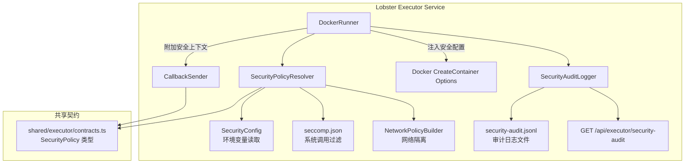

# 设计文档

## 概述

为 Lobster Executor 的 DockerRunner 注入生产级安全沙箱层。核心思路是在 `lobster-executor-real` 已定义的 `DockerRunner.createContainer()` 流程中，通过 `SecurityPolicyResolver` 根据安全等级生成完整的 Docker 安全配置（用户降权、capability 控制、seccomp、资源限制、网络隔离、只读文件系统），并新增 `SecurityAuditLogger` 记录所有安全相关事件。

设计遵循"安全层叠加"原则：不修改 `lobster-executor-real` 的核心执行流程，仅在容器创建配置中注入安全选项，在事件回调中附加安全上下文。

## 架构



## 组件与接口

### 1. SecurityPolicy 类型（共享契约）

```typescript
// shared/executor/contracts.ts 新增

export const SECURITY_LEVELS = ["strict", "balanced", "permissive"] as const;
export type SecurityLevel = (typeof SECURITY_LEVELS)[number];

export interface SecurityResourceLimits {
  memoryBytes: number; // 默认 512MB = 536870912
  nanoCpus: number; // 默认 1.0 核 = 1_000_000_000
  pidsLimit: number; // 默认 256
  tmpfsSizeBytes: number; // 默认 64MB = 67108864
}

export interface SecurityNetworkPolicy {
  mode: "none" | "whitelist" | "bridge";
  whitelist?: string[]; // 域名/IP 列表
}

export interface SecurityPolicy {
  level: SecurityLevel;
  user: string; // 容器运行用户，默认 "65534" (nobody)
  readonlyRootfs: boolean;
  noNewPrivileges: boolean;
  capDrop: string[]; // 默认 ["ALL"]
  capAdd: string[]; // 按等级添加
  seccompProfile?: string; // seccomp profile 路径
  resources: SecurityResourceLimits;
  network: SecurityNetworkPolicy;
}

export interface SecurityAuditEntry {
  timestamp: string;
  jobId: string;
  missionId: string;
  eventType:
    | "container.created"
    | "container.started"
    | "container.oom"
    | "container.seccomp_violation"
    | "container.security_failure"
    | "container.destroyed"
    | "resource.exceeded";
  securityLevel: SecurityLevel;
  detail: Record<string, unknown>;
}
```

### 2. SecurityPolicyResolver

根据安全等级和环境变量生成完整的 SecurityPolicy：

```typescript
// services/lobster-executor/src/security-policy.ts

interface SecurityConfig {
  securityLevel: SecurityLevel;
  containerUser: string;
  maxMemory: string; // 如 "512m"、"1g"
  maxCpus: string; // 如 "1.0"、"2.0"
  maxPids: number;
  tmpfsSize: string; // 如 "64m"
  networkWhitelist: string[];
  seccompProfilePath?: string;
}

function readSecurityConfig(): SecurityConfig;
function resolveSecurityPolicy(config: SecurityConfig): SecurityPolicy;
function toDockerHostConfig(
  policy: SecurityPolicy
): Partial<Dockerode.HostConfig>;
function toDockerCreateOptions(
  policy: SecurityPolicy
): Partial<Dockerode.ContainerCreateOptions>;
```

环境变量映射：

| 环境变量                  | 配置字段           | 默认值                |
| ------------------------- | ------------------ | --------------------- |
| LOBSTER_SECURITY_LEVEL    | securityLevel      | "strict"              |
| LOBSTER_CONTAINER_USER    | containerUser      | "65534"               |
| LOBSTER_MAX_MEMORY        | maxMemory          | "512m"                |
| LOBSTER_MAX_CPUS          | maxCpus            | "1.0"                 |
| LOBSTER_MAX_PIDS          | maxPids            | 256                   |
| LOBSTER_TMPFS_SIZE        | tmpfsSize          | "64m"                 |
| LOBSTER_NETWORK_WHITELIST | networkWhitelist   | []                    |
| LOBSTER_SECCOMP_PROFILE   | seccompProfilePath | undefined（使用内置） |

安全等级预设：

| 配置项          | strict | balanced         | permissive                   |
| --------------- | ------ | ---------------- | ---------------------------- |
| capDrop         | ALL    | ALL              | ALL                          |
| capAdd          | (无)   | NET_BIND_SERVICE | NET_BIND_SERVICE, SYS_PTRACE |
| readonlyRootfs  | true   | true             | false                        |
| noNewPrivileges | true   | true             | true                         |
| network.mode    | none   | whitelist        | bridge                       |
| seccomp         | 最小集 | 标准集           | 宽松集                       |

### 3. Seccomp Profile

```json
// services/lobster-executor/seccomp.json
{
  "defaultAction": "SCMP_ACT_ERRNO",
  "architectures": ["SCMP_ARCH_X86_64", "SCMP_ARCH_AARCH64"],
  "syscalls": [
    {
      "names": [
        "read",
        "write",
        "open",
        "close",
        "stat",
        "fstat",
        "lstat",
        "poll",
        "lseek",
        "mmap",
        "mprotect",
        "munmap",
        "brk",
        "ioctl",
        "access",
        "pipe",
        "select",
        "sched_yield",
        "dup",
        "dup2",
        "nanosleep",
        "getpid",
        "socket",
        "connect",
        "sendto",
        "recvfrom",
        "bind",
        "listen",
        "accept",
        "clone",
        "execve",
        "exit",
        "wait4",
        "kill",
        "fcntl",
        "flock",
        "fsync",
        "fdatasync",
        "truncate",
        "ftruncate",
        "getdents",
        "getcwd",
        "chdir",
        "mkdir",
        "rmdir",
        "unlink",
        "rename",
        "chmod",
        "chown",
        "umask",
        "gettimeofday",
        "getuid",
        "getgid",
        "geteuid",
        "getegid",
        "getppid",
        "getpgrp",
        "setsid",
        "setuid",
        "setgid",
        "getgroups",
        "sigaltstack",
        "rt_sigaction",
        "rt_sigprocmask",
        "rt_sigreturn",
        "uname",
        "arch_prctl",
        "set_tid_address",
        "set_robust_list",
        "futex",
        "epoll_create",
        "epoll_ctl",
        "epoll_wait",
        "openat",
        "newfstatat",
        "readlinkat",
        "getrandom",
        "pread64",
        "pwrite64",
        "writev",
        "readv",
        "exit_group",
        "clock_gettime",
        "clock_nanosleep",
        "epoll_create1",
        "pipe2",
        "dup3",
        "accept4",
        "eventfd2",
        "timerfd_create",
        "timerfd_settime",
        "signalfd4",
        "prlimit64",
        "memfd_create",
        "copy_file_range",
        "statx",
        "rseq",
        "close_range"
      ],
      "action": "SCMP_ACT_ALLOW"
    }
  ]
}
```

被拒绝的危险系统调用包括：mount、umount、reboot、kexec_load、init_module、delete_module、ptrace（strict 模式）、keyctl、bpf 等。

### 4. SecurityAuditLogger

```typescript
// services/lobster-executor/src/security-audit.ts

class SecurityAuditLogger {
  constructor(private dataRoot: string)

  log(entry: Omit<SecurityAuditEntry, "timestamp">): void
  getByJobId(jobId: string): SecurityAuditEntry[]
  getAll(limit?: number): SecurityAuditEntry[]
}
```

审计日志存储在 `<dataRoot>/jobs/<missionId>/<jobId>/security-audit.jsonl`，每行一个 JSON 对象。

### 5. DockerRunner 安全集成

在 `DockerRunner.createContainer()` 中注入安全配置：

```typescript
// docker-runner.ts 修改（伪代码）
private async createContainer(record: StoredJobRecord): Promise<Dockerode.Container> {
  const policy = this.securityPolicy;
  const securityOpts = toDockerCreateOptions(policy);
  const hostConfig = toDockerHostConfig(policy);

  return this.docker.createContainer({
    Image: ...,
    Cmd: ...,
    Env: ...,
    User: policy.user,
    WorkingDir: "/workspace",
    ...securityOpts,
    HostConfig: {
      ...existingHostConfig,
      ...hostConfig,
    },
  });
}
```

### 6. 网络策略实现

- **none 模式**：`NetworkMode: "none"`
- **whitelist 模式**：创建自定义 Docker network，通过 iptables 规则限制出站（在容器启动后通过 `docker exec` 或 init 脚本注入规则）
- **bridge 模式**：使用默认 `NetworkMode: "bridge"`

白名单实现简化方案：在 balanced 模式下，使用 Docker 自定义网络 + DNS 解析限制。完整的 iptables 方案作为后续优化。

### 7. 安全审计 API

```typescript
// services/lobster-executor/src/app.ts 新增路由

// GET /api/executor/security-audit?jobId=xxx
// 响应：{ ok: true, entries: SecurityAuditEntry[] }
```

### 8. 前端安全展示

在 `job.started` 事件的 payload 中附加：

```typescript
{
  securitySummary: {
    level: "strict",
    user: "65534",
    networkMode: "none",
    readonlyRootfs: true,
    memoryLimit: "512MB",
    cpuLimit: "1.0",
    pidsLimit: 256
  }
}
```

前端 `/tasks` 页面在 Job 详情的 Execution tab 中显示安全策略卡片。3D 场景中通过 Socket 事件触发盾牌图标。

### 9. 路径遍历防护

复用 `server/core/access-guard.ts` 的路径校验逻辑，在 workspace 挂载前验证：

```typescript
function validateWorkspacePath(
  requestedPath: string,
  dataRoot: string
): string {
  const resolved = path.resolve(dataRoot, requestedPath);
  if (!resolved.startsWith(path.resolve(dataRoot))) {
    throw new Error("Path traversal detected");
  }
  return resolved;
}
```

## 数据模型

### SecurityPolicy 在 ExecutorEvent 中的传递

```typescript
// ExecutorEvent.payload 扩展
interface SecurityEventPayload {
  securityContext?: {
    level: SecurityLevel;
    user: string;
    networkMode: string;
    readonlyRootfs: boolean;
    capDrop: string[];
    capAdd: string[];
    resources: SecurityResourceLimits;
  };
  securitySummary?: {
    level: SecurityLevel;
    user: string;
    networkMode: string;
    readonlyRootfs: boolean;
    memoryLimit: string;
    cpuLimit: string;
    pidsLimit: number;
  };
}
```

## 正确性属性

### Property 1: 安全等级到容器配置映射正确性

_For any_ SecurityLevel 值（strict / balanced / permissive），resolveSecurityPolicy 生成的 SecurityPolicy 应满足：strict 模式下 capAdd 为空且 network.mode 为 "none"；balanced 模式下 capAdd 包含 "NET_BIND_SERVICE" 且 network.mode 为 "whitelist"；permissive 模式下 capAdd 包含 "NET_BIND_SERVICE" 和 "SYS_PTRACE" 且 network.mode 为 "bridge"。

**Validates: Requirements 1.2, 1.3, 1.4**

### Property 2: 容器用户始终非 root

_For any_ SecurityPolicy 配置组合，toDockerCreateOptions 生成的 User 字段不应为 "root" 或 "0"。

**Validates: Requirements 2.1, 2.2**

### Property 3: Capability drop ALL 不变量

_For any_ SecurityLevel，resolveSecurityPolicy 生成的 capDrop 始终包含 "ALL"。

**Validates: Requirements 2.3**

### Property 4: no-new-privileges 不变量

_For any_ SecurityLevel，resolveSecurityPolicy 生成的 noNewPrivileges 始终为 true。

**Validates: Requirements 2.6**

### Property 5: 资源限制参数正确映射

_For any_ 合法的内存值（1MB-32GB）、CPU 值（0.1-16.0）和 PID 值（1-65535），toDockerHostConfig 生成的 Memory、NanoCpus、PidsLimit 应正确反映输入值。

**Validates: Requirements 3.1, 3.2, 3.3, 3.4**

### Property 6: 只读文件系统与安全等级一致性

_For any_ SecurityLevel 为 "strict" 或 "balanced"，生成的 HostConfig.ReadonlyRootfs 应为 true；为 "permissive" 时应为 false。

**Validates: Requirements 5.1**

### Property 7: 网络模式与安全等级一致性

_For any_ SecurityLevel，生成的 NetworkMode 应与等级预设一致：strict → "none"，balanced → 自定义网络名，permissive → "bridge" 或默认。

**Validates: Requirements 4.1, 4.2, 4.4**

### Property 8: 网络白名单解析正确性

_For any_ 逗号分隔的域名/IP 字符串，parseNetworkWhitelist 应正确分割并去除空白，空字符串返回空数组。

**Validates: Requirements 4.3**

### Property 9: 路径遍历防护

_For any_ 包含 "../" 或以 "/" 开头（且不在 dataRoot 下）的路径字符串，validateWorkspacePath 应抛出错误。

**Validates: Requirements 5.5**

### Property 10: 审计日志字段完整性

_For any_ SecurityAuditEntry，必须包含非空的 timestamp、jobId、missionId、eventType、securityLevel 和 detail 字段。

**Validates: Requirements 6.1, 6.4**

### Property 11: 安全失败事件包含 securityContext

_For any_ 安全相关的 job.failed 事件（errorCode 为 OOM_KILLED、SECCOMP_VIOLATION 或 SECURITY_CONFIG_INVALID），payload 中必须包含 securityContext 字段。

**Validates: Requirements 7.4**

### Property 12: 敏感路径禁止挂载

_For any_ 容器创建配置，HostConfig.Binds 中不应包含 /proc、/sys、/var/run/docker.sock 等敏感宿主机路径。

**Validates: Requirements 5.4**

## 错误处理

| 场景                      | 处理方式                       | errorCode                 |
| ------------------------- | ------------------------------ | ------------------------- |
| 安全配置无效（启动时）    | 快速失败，进程退出             | N/A                       |
| 安全配置无效（运行时）    | Job 标记为 failed              | `SECURITY_CONFIG_INVALID` |
| OOM Kill                  | 容器清理 + 审计日志 + 失败回调 | `OOM_KILLED`              |
| Seccomp 违规导致退出      | 审计日志 + 失败回调            | `SECCOMP_VIOLATION`       |
| 路径遍历检测              | 拒绝创建容器 + 失败回调        | `PATH_TRAVERSAL`          |
| 自定义 seccomp 文件不存在 | 快速失败                       | `SECURITY_CONFIG_INVALID` |
| Docker network 创建失败   | 回退到 none 模式 + 警告日志    | N/A                       |

## 测试策略

### 测试框架

- 单元测试：vitest
- 属性测试：fast-check
- 每个属性测试最少运行 100 次迭代

### 单元测试

重点覆盖：

- readSecurityConfig 的环境变量读取和默认值
- resolveSecurityPolicy 的三种安全等级配置生成
- toDockerHostConfig / toDockerCreateOptions 的配置转换
- parseNetworkWhitelist 的白名单解析
- validateWorkspacePath 的路径遍历防护
- SecurityAuditLogger 的日志写入和查询
- OOM / seccomp 违规场景的错误处理

### 属性测试

| 属性        | 生成器                       | 标签                                                        |
| ----------- | ---------------------------- | ----------------------------------------------------------- |
| Property 1  | 随机 SecurityLevel           | Feature: secure-sandbox, Property 1: 安全等级到容器配置映射 |
| Property 2  | 随机 SecurityPolicy 配置     | Feature: secure-sandbox, Property 2: 容器用户始终非 root    |
| Property 3  | 随机 SecurityLevel           | Feature: secure-sandbox, Property 3: Capability drop ALL    |
| Property 4  | 随机 SecurityLevel           | Feature: secure-sandbox, Property 4: no-new-privileges      |
| Property 5  | 随机资源限制值               | Feature: secure-sandbox, Property 5: 资源限制参数映射       |
| Property 8  | 随机逗号分隔字符串           | Feature: secure-sandbox, Property 8: 网络白名单解析         |
| Property 9  | 随机路径字符串（含恶意路径） | Feature: secure-sandbox, Property 9: 路径遍历防护           |
| Property 12 | 随机 Binds 配置              | Feature: secure-sandbox, Property 12: 敏感路径禁止挂载      |

### 集成测试

- 安全 smoke 测试：验证越权命令拒绝、资源超限、非法网络访问
- 扩展现有 `lobster-executor-smoke.mjs`
