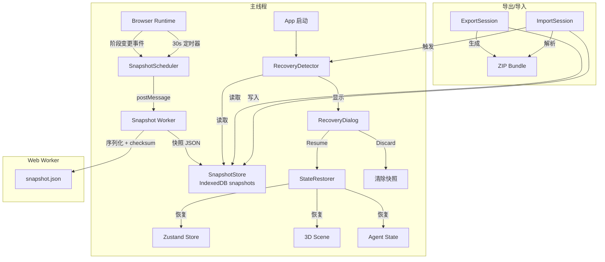
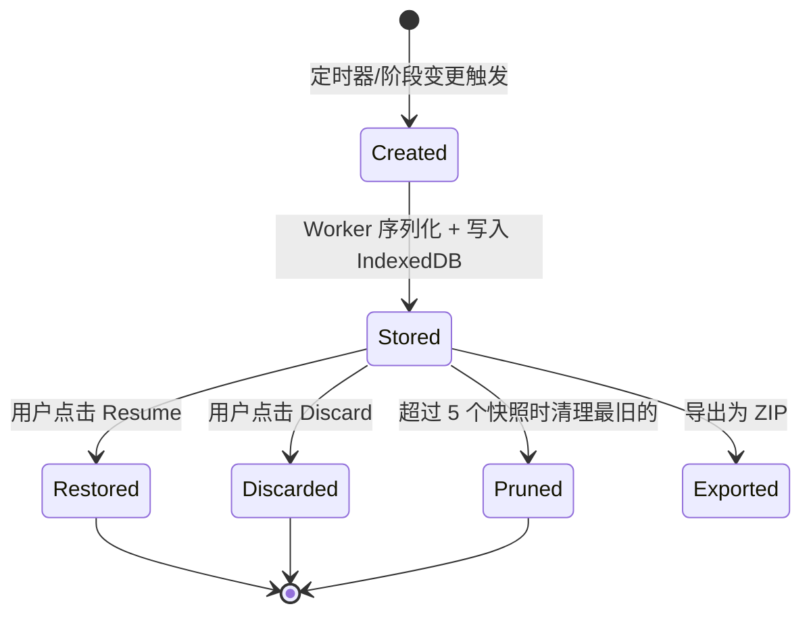

# 设计文档：状态持久化与恢复

## 概述

本设计在现有 `browser-runtime-storage.ts` 的 IndexedDB 持久化层基础上，新增 `snapshots` object store 用于存储 Mission 完整快照。通过定时器 + 阶段变更事件双触发机制自动生成快照，在 Browser Runtime 启动时检测并恢复未完成任务。同时提供 ZIP 格式的会话导出/导入功能，支持跨设备恢复。

核心设计原则：
- 快照生成在 Web Worker 中执行，不阻塞主线程和 3D 渲染
- 服务端快照优先，本地快照作为纯前端模式的兜底
- 快照带版本号和校验和，防止损坏数据恢复
- 最多保留 5 个快照，自动清理旧数据

## 架构



## 组件与接口

### 1. SnapshotRecord 类型（扩展 shared/mission/contracts.ts）

```typescript
interface SnapshotRecord {
  id: string;                          // UUID
  missionId: string;                   // 关联的 MissionRecord.id
  version: number;                     // SNAPSHOT_VERSION 常量
  checksum: string;                    // SHA-256 hex
  createdAt: number;                   // Date.now()
  missionTitle: string;                // 冗余存储，用于列表展示
  missionProgress: number;             // 冗余存储，用于列表展示
  missionStatus: MissionStatus;        // 冗余存储
  payload: SnapshotPayload;
}

interface SnapshotPayload {
  mission: MissionRecord;
  agentMemories: AgentMemorySummary[];
  sceneLayout: SceneLayoutState;
  decisionHistory: MissionDecisionEntry[];
  attachmentIndex: AttachmentIndexEntry[];
  zustandSlice: ZustandRecoverySlice;
}

interface AgentMemorySummary {
  agentId: string;
  soulMdHash: string;
  recentExchanges: any[];
}

interface SceneLayoutState {
  cameraPosition: [number, number, number];
  cameraTarget: [number, number, number];
  selectedPet: string | null;
}

interface MissionDecisionEntry {
  stageKey: string;
  decision: MissionDecision;
  resolved?: MissionDecisionResolved;
  timestamp: number;
}

interface AttachmentIndexEntry {
  name: string;
  kind: MissionArtifact["kind"];
  path?: string;
  url?: string;
  size?: number;
}

interface ZustandRecoverySlice {
  runtimeMode: RuntimeMode;
  aiConfig: AIConfig;
  chatMessages: ChatMessage[];
}
```

### 2. SnapshotStore（扩展 browser-runtime-storage.ts）

在现有 IndexedDB 数据库中新增 `snapshots` object store（需要升级 DB_VERSION 到 2）。

```typescript
// 新增到 STORE_NAMES
const STORE_NAMES = {
  ...existingStores,
  snapshots: "snapshots",
} as const;

// 公开 API
async function saveSnapshot(record: SnapshotRecord): Promise<void>;
async function getSnapshot(id: string): Promise<SnapshotRecord | null>;
async function getLatestSnapshot(missionId?: string): Promise<SnapshotRecord | null>;
async function listSnapshots(): Promise<SnapshotRecord[]>;
async function deleteSnapshot(id: string): Promise<void>;
async function pruneSnapshots(keepCount: number): Promise<void>;
```

### 3. SnapshotScheduler（新模块 client/src/lib/snapshot-scheduler.ts）

负责定时和事件驱动的快照触发。

```typescript
interface SnapshotScheduler {
  start(missionId: string): void;
  stop(): void;
  triggerImmediate(): Promise<void>;
  isRunning(): boolean;
}

function createSnapshotScheduler(options: {
  intervalMs: number;           // 默认 30000
  collectState: () => SnapshotPayload;
  onError?: (error: Error) => void;
}): SnapshotScheduler;
```

### 4. Snapshot Worker（新文件 client/src/workers/snapshot-worker.ts）

在 Web Worker 中执行序列化和校验和计算。

```typescript
// Worker 消息协议
type WorkerRequest = {
  type: "serialize";
  payload: SnapshotPayload;
  missionId: string;
  missionTitle: string;
  missionProgress: number;
  missionStatus: MissionStatus;
};

type WorkerResponse = {
  type: "serialized";
  record: SnapshotRecord;
} | {
  type: "error";
  message: string;
};
```

### 5. RecoveryDetector（新模块 client/src/lib/recovery-detector.ts）

启动时检测未完成快照。

```typescript
interface RecoveryCandidate {
  snapshot: SnapshotRecord;
  isValid: boolean;
  invalidReason?: "checksum_mismatch" | "version_incompatible";
}

async function detectRecoveryCandidate(): Promise<RecoveryCandidate | null>;
async function restoreFromSnapshot(snapshot: SnapshotRecord): Promise<void>;
async function discardSnapshot(snapshotId: string): Promise<void>;
```

### 6. SessionExportService（新文件 client/src/lib/session-export.ts）

```typescript
async function exportSession(missionId?: string): Promise<void>;
async function importSession(file: File): Promise<void>;
async function importSessionFromBase64(encoded: string): Promise<void>;
```

ZIP 结构：
```
session-bundle.zip
├── manifest.json          // { version, checksum, exportedAt }
├── snapshot.json          // SnapshotRecord
└── attachments/           // 附件文件（如有）
    ├── file1.pdf
    └── file2.txt
```

### 7. RecoveryDialog 组件（新文件 client/src/components/RecoveryDialog.tsx）

```typescript
interface RecoveryDialogProps {
  candidate: RecoveryCandidate;
  onResume: () => void;
  onDiscard: () => void;
  isRestoring: boolean;
  restoreProgress: number;      // 0-100
  restorePhase: string;         // "恢复 Mission 数据..." 等
}
```

## 数据模型

### IndexedDB Schema 升级

```
DB_VERSION: 1 → 2

新增 object store:
  snapshots (keyPath: "id")
    - 索引: missionId (非唯一)
    - 索引: createdAt (非唯一)
```

### SnapshotRecord 生命周期



### 快照校验流程

```
1. 读取 SnapshotRecord
2. 提取 payload → JSON.stringify → SHA-256 → hex
3. 比较计算结果与 record.checksum
4. 检查 record.version === SNAPSHOT_VERSION
5. 两项均通过 → isValid = true
```


## 正确性属性

*属性（Property）是一种在系统所有有效执行中都应成立的特征或行为——本质上是关于系统应该做什么的形式化陈述。属性是人类可读规范与机器可验证正确性保证之间的桥梁。*

### Property 1: 快照序列化往返一致性

*For any* 有效的 SnapshotPayload 对象，将其序列化为 JSON 后再反序列化，应产生与原始对象深度相等的结果。

**Validates: Requirements 5.3**

### Property 2: 快照结构完整性

*For any* 生成的 SnapshotRecord，该记录应包含非空的 checksum（SHA-256 hex 格式）、有效的 version 号，以及 payload 中的所有必需字段（mission、agentMemories、sceneLayout、decisionHistory、attachmentIndex、zustandSlice）。

**Validates: Requirements 1.3, 1.4**

### Property 3: 快照修剪不变量

*For any* 快照保存操作序列，SnapshotStore 中的快照数量应始终不超过 5 个，且保留的是最近创建的 5 个快照。

**Validates: Requirements 1.5**

### Property 4: 损坏/不兼容快照检测

*For any* SnapshotRecord，如果其 payload 被篡改（导致 checksum 不匹配）或其 version 与当前 SNAPSHOT_VERSION 不同，detectRecoveryCandidate 应将其标记为 isValid = false 并给出正确的 invalidReason。

**Validates: Requirements 2.5, 2.6**

### Property 5: 恢复候选检测正确性

*For any* SnapshotStore 状态，如果存在 missionStatus 为 running 或 waiting 的快照，detectRecoveryCandidate 应返回最新的该快照作为候选；如果不存在此类快照，应返回 null。

**Validates: Requirements 2.1**

### Property 6: 状态恢复正确性

*For any* 有效的 SnapshotRecord，执行 restoreFromSnapshot 后，Zustand store 的 runtimeMode、aiConfig 和 chatMessages 应与快照中 zustandSlice 的对应值相等。

**Validates: Requirements 2.3**

### Property 7: 丢弃操作移除快照

*For any* 存在于 SnapshotStore 中的快照，执行 discardSnapshot 后，该快照应不再存在于 store 中，且其他快照不受影响。

**Validates: Requirements 2.4**

### Property 8: 导出包完整性

*For any* 有效的 SnapshotRecord，导出生成的 Session_Bundle 应包含 snapshot.json（含完整 SnapshotRecord）、manifest.json（含 version 和 checksum），且 manifest 中的 checksum 与 SnapshotRecord 的 checksum 一致。

**Validates: Requirements 3.1, 3.3**

### Property 9: 导入验证与存储

*For any* 有效的 Session_Bundle，导入后 SnapshotStore 中应存在与 bundle 中 SnapshotRecord 等价的记录；对于 checksum 不匹配或 version 不兼容的 bundle，导入应被拒绝且 store 不发生变化。

**Validates: Requirements 4.1, 4.4**

### Property 10: 恢复源优先级

*For any* 恢复场景，当系统处于 Advanced 模式且服务端快照可用时，应使用服务端快照；当服务端快照不可用但本地快照存在时，应回退到本地快照。

**Validates: Requirements 6.1, 6.2**

### Property 11: 模式切换保留快照

*For any* SnapshotStore 状态，从 Frontend 模式切换到 Advanced 模式后，store 中的快照数量和内容应保持不变。

**Validates: Requirements 6.3**

### Property 12: 快照错误不中断任务

*For any* 快照生成过程中的错误（序列化失败、IndexedDB 写入失败等），SnapshotScheduler 应捕获错误并继续运行，不影响 Mission 执行。

**Validates: Requirements 8.2**

## 错误处理

| 错误场景 | 处理策略 |
|---------|---------|
| IndexedDB 不可用 | 降级为无快照模式，console.warn 提示用户 |
| 快照序列化失败（Worker 错误） | 记录错误日志，跳过本次快照，下次定时器重试 |
| 快照写入 IndexedDB 失败 | 记录错误日志，不中断任务执行 |
| 快照 checksum 校验失败 | RecoveryDialog 提示损坏，仅提供 Discard 选项 |
| 快照版本不兼容 | RecoveryDialog 提示版本不兼容，仅提供 Discard 选项 |
| ZIP 导入解析失败 | 显示错误提示，拒绝导入 |
| ZIP 导入 checksum 不匹配 | 显示错误提示，拒绝导入 |
| Web Worker 创建失败 | 回退到主线程同步序列化（性能降级） |
| IndexedDB 容量不足 | 强制清理所有旧快照后重试，仍失败则降级为无快照模式 |
| URL restore 参数解码失败 | 忽略参数，正常启动应用 |

## 测试策略

### 属性测试（Property-Based Testing）

使用 `fast-check` 库（已在 Vitest 生态中广泛使用）进行属性测试。

每个属性测试配置：
- 最少 100 次迭代
- 每个测试标注对应的设计属性编号
- 标签格式：`Feature: state-persistence-recovery, Property N: <属性标题>`

属性测试覆盖范围：
- Property 1（往返一致性）：生成随机 SnapshotPayload，验证序列化→反序列化等价性
- Property 2（结构完整性）：生成随机 Mission 数据，验证快照包含所有必需字段
- Property 3（修剪不变量）：生成随机保存序列，验证 store 中快照数 ≤ 5
- Property 4（损坏检测）：生成随机快照并篡改 payload/version，验证检测结果
- Property 5（恢复检测）：生成随机 store 状态，验证候选检测逻辑
- Property 6（状态恢复）：生成随机快照，验证恢复后 Zustand 状态匹配
- Property 7（丢弃操作）：生成随机 store 状态和目标快照，验证删除正确性
- Property 8（导出完整性）：生成随机快照，验证导出包结构
- Property 9（导入验证）：生成随机 bundle（有效/无效），验证导入行为
- Property 10（优先级）：生成随机恢复场景，验证源选择逻辑
- Property 11（模式切换）：生成随机 store 状态，验证切换后快照不变
- Property 12（错误韧性）：注入随机错误，验证调度器继续运行

### 单元测试

单元测试聚焦于具体示例和边界情况：
- SnapshotStore CRUD 操作的基本正确性
- DB_VERSION 升级时的 onupgradeneeded 逻辑
- RecoveryDialog 组件渲染（Resume/Discard 按钮可点击）
- URL 参数 `?restore=` 解码的边界情况（空字符串、非法 base64）
- ZIP 文件解析的边界情况（空 ZIP、缺少 manifest.json）
- Web Worker 消息协议的基本收发

### 测试工具

- 测试框架：Vitest
- 属性测试库：fast-check
- 组件测试：@testing-library/react（如需要）
- IndexedDB Mock：fake-indexeddb
