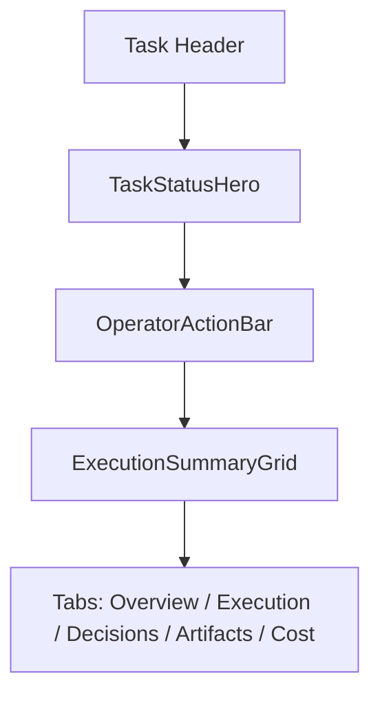

# Task Detail Operations First - 设计文档

## 概述

本设计聚焦 [TaskDetailView.tsx](c:/Users/2303670/Documents/cube-pets-office/client/src/components/tasks/TaskDetailView.tsx) 的第一屏信息架构，将其从“先看 tabs 和内容块”重排为“先看操作与执行摘要，再进入细节”。

## 设计原则

1. 操作优先：先告诉用户能做什么
2. 责任优先：先告诉用户谁在负责
3. 阻塞优先：先告诉用户哪里卡住
4. 细节后置：日志、产物、成本、timeline 留在二级区域

## 设计决策

### 1. 不拆掉 tabs，只把 tabs 下沉

当前页已经积累了大量 Execution / Decisions / Artifacts / Cost 内容，全部推翻成本太高。本设计选择：

- 保留 tabs 结构
- 在 tabs 之前增加一层 `TaskOperationsHero`

### 2. 通过派生数据构建首屏，不强依赖新增接口

优先复用现有 `MissionTaskDetail` 字段：

- `status`
- `decision`
- `decisionPresets`
- `executor`
- `securitySummary`
- `tasks`
- `agents`
- `timeline`
- `missionArtifacts`
- 后续来自 `mission-operator-actions` 的 `operatorState` / `blocker`

若数据不足，再小范围补后端字段。

### 3. 用“摘要卡片 + 主操作条”组合，而不是堆更多面板

推荐第一屏由三块组成：

1. `TaskStatusHero`
2. `OperatorActionBar`
3. `ExecutionSummaryGrid`

## 信息架构

### 1. TaskStatusHero

包含：

- 任务标题
- 主状态标签
- operatorState 附加标签
- 最近更新时间
- 一句执行摘要

### 2. OperatorActionBar

包含：

- 主要操作按钮
- 危险操作按钮
- 若无动作，则显示 passive 状态说明

### 3. ExecutionSummaryGrid

建议最少包含四张卡片：

- `Current owner`
- `Current blocker / waiting reason`
- `Next step`
- `Current stage / runtime`

## 数据派生设计

### 1. Current owner

派生优先级建议：

1. 活跃 operator action 所对应的人类主体
2. 当前 waiting -> `User decision required`
3. 当前活跃 agent / assignee
4. executor 运行时
5. 当前 stage label

建议在 `client/src/lib/tasks-store.ts` 或 `task-helpers.ts` 增加：

- `deriveCurrentOwner(detail)`
- `deriveNextStep(detail)`
- `deriveTaskBlocker(detail)`
- `derivePrimaryActions(detail)`

### 2. Next step

文案决策树示例：

- `waiting` -> `Review and submit the pending decision`
- `operatorState = blocked` -> `Resolve blocker and resume mission`
- `running + executor active` -> `Wait for executor to produce the next artifact`
- `failed` -> `Review failure reason and retry if appropriate`
- `done` -> `Review result artifacts and share outcome`

### 3. Blocker / waiting

优先级：

- blocker
- waiting decision
- paused reason
- no blocker

## 组件设计

建议新增：

- `TaskOperationsHero.tsx`
- `TaskSummaryCard.tsx`
- `TaskBlockerCard.tsx`
- `TaskNextStepCard.tsx`

也可以先在 `TaskDetailView.tsx` 内部实现，待结构稳定后再拆分。

## 布局设计

### 桌面端

- 左侧：标题、状态、主操作
- 右侧：owner / blocker / next step / runtime 摘要卡片

### 移动端

- 状态 Hero
- 主操作条
- owner
- blocker
- next step
- tabs

## 与现有区域的关系

- `DecisionPanel`：若任务在 waiting，仍然保留，但放在第一屏关键摘要之后
- `ExecutorStatusPanel`：降为 Execution tab 内重点内容
- `ArtifactListBlock`：保留在 Artifacts tab，不占首屏
- `Cost` 与 `Timeline`：继续保留在 tab 内

## 测试策略

- 当前负责人派生测试
- next step 派生测试
- 首屏模块顺序测试
- 移动端布局测试

## 交付顺序

1. 先实现派生 helper
2. 再接入 `OperatorActionBar`
3. 再重排 `TaskDetailView` 第一屏结构
4. 最后做桌面 / 移动端微调
