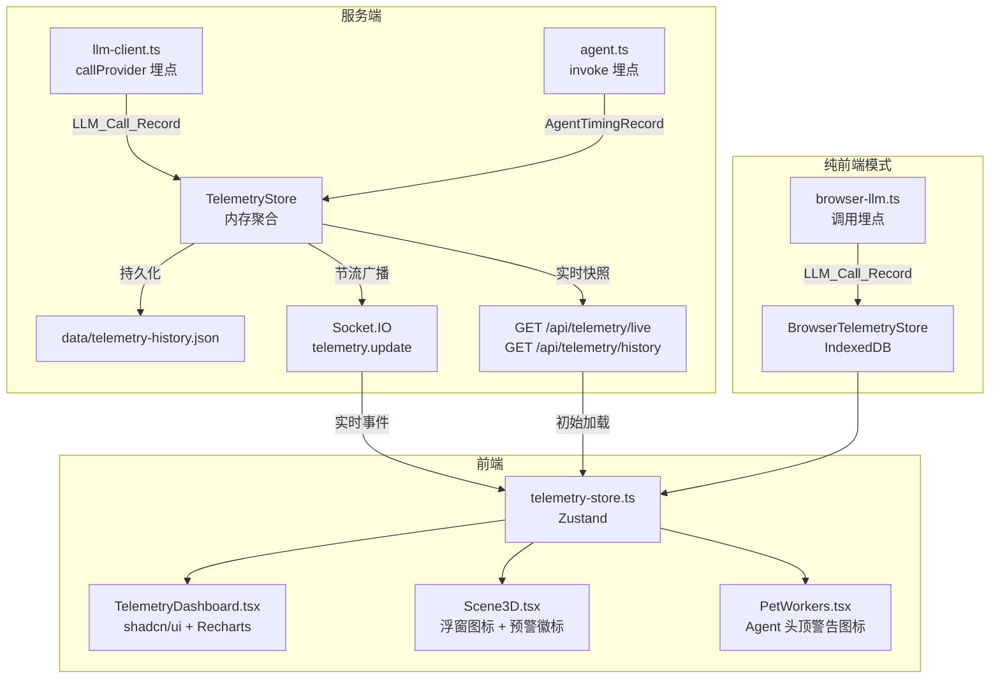

# 设计文档：实时遥测仪表盘（Telemetry Dashboard）

## 概述

本设计为 Cube Pets Office 新增实时遥测仪表盘模块。核心思路是在 LLM 调用链路和 Agent 调用链路中插入轻量埋点，将遥测数据汇聚到 `TelemetryStore`，通过 REST API 和 Socket.IO 推送到前端 `TelemetryDashboard` 组件进行可视化展示。

设计遵循以下原则：

- **零阻塞**：埋点采集不阻塞 LLM 调用主流程，采用同步内存写入
- **双轨运行**：服务端模式使用内存 + JSON 文件持久化，纯前端模式使用 IndexedDB
- **最小侵入**：对现有 `llm-client.ts`、`agent.ts`、`socket.ts` 的修改控制在最小范围

## 架构



## 组件与接口

### 1. 共享类型定义 — `shared/telemetry.ts`

定义前后端共享的遥测数据结构。

```typescript
/** 单次 LLM 调用记录 */
export interface LLMCallRecord {
  id: string;
  timestamp: number; // Unix ms
  model: string;
  tokensIn: number;
  tokensOut: number;
  cost: number; // 预估费用（美元）
  durationMs: number;
  agentId?: string;
  workflowId?: string;
  missionId?: string;
  error?: string; // 失败时记录错误信息
}

/** Agent 响应时间记录 */
export interface AgentTimingRecord {
  agentId: string;
  agentName: string;
  durationMs: number;
  timestamp: number;
  workflowId?: string;
}

/** 预警事件 */
export interface TelemetryAlert {
  id: string;
  type: "agent_slow" | "token_over_budget";
  agentId?: string;
  message: string;
  timestamp: number;
  resolved: boolean;
}

/** 实时指标快照 */
export interface TelemetrySnapshot {
  totalTokensIn: number;
  totalTokensOut: number;
  totalCost: number;
  totalCalls: number;
  activeAgentCount: number;
  agentTimings: AgentTimingSummary[]; // 按平均耗时降序
  missionStageTimings: MissionStageTiming[];
  alerts: TelemetryAlert[];
  updatedAt: number;
}

/** Agent 响应时间摘要 */
export interface AgentTimingSummary {
  agentId: string;
  agentName: string;
  avgDurationMs: number;
  callCount: number;
}

/** Mission 阶段耗时 */
export interface MissionStageTiming {
  stageKey: string;
  stageLabel: string;
  durationMs: number;
}

/** 历史 Mission 指标摘要 */
export interface MissionTelemetrySummary {
  missionId: string;
  title: string;
  completedAt: number;
  totalTokensIn: number;
  totalTokensOut: number;
  totalCost: number;
  totalCalls: number;
  topAgents: AgentTimingSummary[];
  stageTimings: MissionStageTiming[];
}

/** Token 预算配置 */
export interface TelemetryBudget {
  maxTokens: number; // 默认 100000
  warningThreshold: number; // 默认 0.8（80%）
}
```

### 2. 服务端遥测存储 — `server/core/telemetry-store.ts`

```typescript
class TelemetryStore {
  // 内存状态
  private callRecords: LLMCallRecord[]; // 当前 Mission 的调用记录
  private agentTimings: Map<string, AgentTimingRecord[]>; // agentId → 最近 20 次
  private missionHistory: MissionTelemetrySummary[]; // 最近 10 次
  private alerts: TelemetryAlert[];
  private budget: TelemetryBudget;

  // 核心方法
  recordLLMCall(record: LLMCallRecord): void; // 同步写入，触发快照更新
  recordAgentTiming(record: AgentTimingRecord): void;
  getSnapshot(): TelemetrySnapshot; // 计算实时快照
  getHistory(): MissionTelemetrySummary[];
  finalizeMission(missionId: string, title: string): void; // Mission 完成时归档
  resetCurrentMission(): void;

  // 预警
  private checkAlerts(): void; // 每次记录后检查预警条件

  // 持久化
  private persistHistory(): void; // 写入 data/telemetry-history.json
  loadHistory(): void; // 启动时加载
}

export const telemetryStore: TelemetryStore; // 单例导出
```

### 3. 服务端遥测路由 — `server/routes/telemetry.ts`

```typescript
// GET /api/telemetry/live  → TelemetrySnapshot
// GET /api/telemetry/history → MissionTelemetrySummary[]
export function registerTelemetryRoutes(app: Express): void;
```

### 4. Socket.IO 遥测广播 — `server/core/socket.ts` 扩展

```typescript
// 新增函数
export function emitTelemetryUpdate(snapshot: TelemetrySnapshot): void;
// 内部实现节流（500ms 间隔）
```

### 5. LLM 调用埋点 — `server/core/llm-client.ts` 修改

在 `callProvider` 函数中，调用前后记录时间戳，调用完成后将 `LLMCallRecord` 写入 `TelemetryStore`。

```typescript
// callProvider 修改伪代码
async function callProvider(provider, messages, options): Promise<LLMResponse> {
  const startTime = Date.now();
  try {
    const response = await originalCallProvider(provider, messages, options);
    telemetryStore.recordLLMCall({
      id: nanoid(),
      timestamp: startTime,
      model: resolveModel(provider, options.model),
      tokensIn: response.usage?.prompt_tokens ?? 0,
      tokensOut: response.usage?.completion_tokens ?? 0,
      cost: estimateCost(model, tokensIn, tokensOut),
      durationMs: Date.now() - startTime,
    });
    return response;
  } catch (error) {
    telemetryStore.recordLLMCall({
      // ... 记录错误信息
      error: error.message,
      durationMs: Date.now() - startTime,
    });
    throw error;
  }
}
```

### 6. Agent 响应时间埋点 — `server/core/agent.ts` 修改

在 `sharedAgentDependencies.llmProvider` 的 `call` 和 `callJson` 包装中注入计时。

```typescript
llmProvider: {
  call: async (messages, options) => {
    const start = Date.now();
    const result = await callLLM(messages, options);
    // agentId 通过闭包或上下文传递
    telemetryStore.recordAgentTiming({
      agentId, agentName, durationMs: Date.now() - start, timestamp: start
    });
    return result;
  },
}
```

### 7. 前端遥测 Store — `client/src/lib/telemetry-store.ts`

```typescript
// Zustand store
interface TelemetryState {
  snapshot: TelemetrySnapshot | null;
  history: MissionTelemetrySummary[];
  dashboardOpen: boolean;
  toggleDashboard: () => void;
  // Socket 监听和 REST 初始加载
  initSocket: (socket: Socket) => void;
  fetchInitial: () => Promise<void>;
}
```

### 8. 前端仪表盘组件 — `client/src/components/TelemetryDashboard.tsx`

使用 shadcn/ui 卡片 + Recharts 图表：

- Token 消耗/费用卡片（Progress 进度条）
- Top 3 瓶颈 Agent 卡片（排序列表）
- Mission 阶段耗时柱状图（BarChart）
- 活跃 Agent 计数卡片
- 历史趋势折线图（LineChart，最近 5 次 Mission）
- 预警信息高亮区域

侧滑动画使用 framer-motion（项目已有依赖）。

### 9. 3D 场景集成 — `client/src/components/Scene3D.tsx` 修改

在 Canvas 外层（HTML overlay）右上角添加像素风格仪表盘图标按钮，点击切换 `dashboardOpen` 状态。预警时显示红色圆点。

### 10. 纯前端模式 — `client/src/lib/browser-telemetry-store.ts`

在 `callBrowserLLM` 调用前后采集遥测数据，存入 IndexedDB 的 `telemetry` object store。页面加载时从 IndexedDB 恢复。

## 数据模型

### 费用预估模型

```typescript
// 简化的费用预估，基于常见模型定价
const COST_PER_1K_TOKENS: Record<string, { input: number; output: number }> = {
  "glm-5-turbo": { input: 0.001, output: 0.002 },
  "gpt-4o-mini": { input: 0.00015, output: 0.0006 },
  "gpt-4o": { input: 0.005, output: 0.015 },
  // 默认兜底
  default: { input: 0.001, output: 0.002 },
};

function estimateCost(
  model: string,
  tokensIn: number,
  tokensOut: number
): number {
  const pricing = COST_PER_1K_TOKENS[model] ?? COST_PER_1K_TOKENS.default;
  return (
    (tokensIn / 1000) * pricing.input + (tokensOut / 1000) * pricing.output
  );
}
```

### 持久化文件格式

```json
// data/telemetry-history.json
{
  "version": 1,
  "missions": [
    {
      "missionId": "...",
      "title": "...",
      "completedAt": 1234567890,
      "totalTokensIn": 5000,
      "totalTokensOut": 3000,
      "totalCost": 0.012,
      "totalCalls": 15,
      "topAgents": [...],
      "stageTimings": [...]
    }
  ]
}
```

### IndexedDB Schema（纯前端模式）

在现有 `browser-runtime-storage.ts` 的 IndexedDB 中新增 `telemetry` object store：

- keyPath: `"id"`
- 存储 `LLMCallRecord` 和聚合快照

## 正确性属性（Correctness Properties）

_属性（Property）是指在系统所有合法执行路径中都应成立的特征或行为——本质上是对系统应做之事的形式化陈述。属性是人类可读规格说明与机器可验证正确性保证之间的桥梁。_

### Property 1: LLM 调用记录完整性

_For any_ LLM 调用（无论成功或失败），TelemetryStore 中生成的 LLMCallRecord 应包含所有必填字段：id、timestamp、model、tokensIn、tokensOut、cost、durationMs，且 timestamp 应等于调用发起时间，durationMs 应为非负数。

**Validates: Requirements 1.1, 1.3**

### Property 2: Agent 计时记录完整性

_For any_ Agent invoke 调用，TelemetryStore 中生成的 AgentTimingRecord 应包含 agentId、agentName、durationMs、timestamp 字段，且 durationMs 应为非负数。

**Validates: Requirements 2.1**

### Property 3: 滑动窗口平均值正确性

_For any_ Agent 和任意长度的 AgentTimingRecord 序列，TelemetryStore 计算的滑动窗口平均响应时间应等于最近 min(N, 20) 条记录的 durationMs 算术平均值。

**Validates: Requirements 2.2**

### Property 4: 聚合指标不变量

_For any_ LLMCallRecord 序列，TelemetrySnapshot 中的 totalTokensIn 应等于所有记录 tokensIn 之和，totalTokensOut 应等于所有记录 tokensOut 之和，totalCost 应等于所有记录 cost 之和，totalCalls 应等于记录总数。

**Validates: Requirements 3.1**

### Property 5: 历史缓冲区有界性

_For any_ N 次 Mission 归档操作（N ≥ 0），TelemetryStore 的历史列表长度应等于 min(N, 10)，且保留的是最近的 10 次。

**Validates: Requirements 3.2**

### Property 6: 历史持久化往返一致性

_For any_ 有效的 MissionTelemetrySummary 列表，将其序列化写入 JSON 文件后再反序列化加载，应得到等价的列表。

**Validates: Requirements 3.3, 3.4**

### Property 7: Socket 广播节流上界

_For any_ 在时间窗口 T 内发生的 N 次指标变更（N > 0），实际广播的 `telemetry.update` 事件次数应不超过 ceil(T / 500) + 1。

**Validates: Requirements 5.2**

### Property 8: Agent 响应过慢预警生成

_For any_ Agent，当其滑动窗口平均响应时间超过 30000ms 时，TelemetryStore 的 alerts 列表中应存在一条 type 为 `agent_slow` 且 agentId 匹配的活跃预警。

**Validates: Requirements 8.1**

### Property 9: Token 超预算预警生成

_For any_ LLMCallRecord 序列，当累计 Token 总量（tokensIn + tokensOut）超过 Budget.maxTokens × Budget.warningThreshold 时，TelemetryStore 的 alerts 列表中应存在一条 type 为 `token_over_budget` 的活跃预警。

**Validates: Requirements 8.2**

### Property 10: IndexedDB 往返一致性

_For any_ 有效的 TelemetrySnapshot，将其写入 IndexedDB 后再读取，应得到等价的对象。

**Validates: Requirements 9.2, 9.3**

### Property 11: 遥测类型 JSON 往返一致性

_For any_ 有效的 TelemetrySnapshot 对象，`JSON.parse(JSON.stringify(snapshot))` 应产生与原对象深度相等的结果。

**Validates: Requirements 10.3**

## 错误处理

| 场景                           | 处理策略                               |
| ------------------------------ | -------------------------------------- |
| LLM 调用返回无 usage 字段      | tokensIn/tokensOut 默认为 0，cost 为 0 |
| 持久化文件写入失败             | 记录 console.error，不影响内存中的指标 |
| 持久化文件损坏/不存在          | 以空历史启动，记录 console.warn        |
| Socket.IO 未初始化             | emitTelemetryUpdate 静默跳过           |
| IndexedDB 不可用（纯前端模式） | 降级为纯内存模式，页面刷新后丢失数据   |
| 费用预估模型未知               | 使用 default 定价兜底                  |
| REST API 请求时无活跃 Mission  | 返回零值快照（所有数值为 0，空数组）   |

## 测试策略

### 属性测试（Property-Based Testing）

使用 **fast-check** 库（与 Vitest 集成）进行属性测试，每个属性至少运行 100 次迭代。

| 属性        | 测试文件                         | 说明                                        |
| ----------- | -------------------------------- | ------------------------------------------- |
| Property 1  | `server/tests/telemetry.test.ts` | 生成随机 LLMCallRecord，验证字段完整性      |
| Property 2  | `server/tests/telemetry.test.ts` | 生成随机 AgentTimingRecord，验证字段完整性  |
| Property 3  | `server/tests/telemetry.test.ts` | 生成随机长度的计时序列，验证滑动窗口平均值  |
| Property 4  | `server/tests/telemetry.test.ts` | 生成随机 LLMCallRecord 序列，验证聚合求和   |
| Property 5  | `server/tests/telemetry.test.ts` | 生成随机次数的 Mission 归档，验证缓冲区大小 |
| Property 6  | `server/tests/telemetry.test.ts` | 生成随机历史数据，验证 JSON 序列化往返      |
| Property 7  | `server/tests/telemetry.test.ts` | 模拟快速连续更新，验证广播次数上界          |
| Property 8  | `server/tests/telemetry.test.ts` | 生成随机计时序列，验证慢响应预警触发        |
| Property 9  | `server/tests/telemetry.test.ts` | 生成随机调用序列，验证超预算预警触发        |
| Property 10 | 前端测试                         | 生成随机快照，验证 IndexedDB 往返           |
| Property 11 | `server/tests/telemetry.test.ts` | 生成随机快照，验证 JSON 往返                |

### 单元测试

| 测试场景                               | 说明                               |
| -------------------------------------- | ---------------------------------- |
| TelemetryStore.recordLLMCall           | 验证记录写入和快照更新             |
| TelemetryStore.finalizeMission         | 验证 Mission 归档和历史更新        |
| TelemetryStore.loadHistory（文件损坏） | 验证优雅降级                       |
| REST API /api/telemetry/live           | 验证响应格式和零值快照             |
| REST API /api/telemetry/history        | 验证历史列表返回                   |
| estimateCost                           | 验证费用计算（已知模型和未知模型） |
| 节流逻辑                               | 验证 500ms 间隔约束                |

### 测试标注格式

每个属性测试必须包含注释标注：

```typescript
// Feature: telemetry-dashboard, Property 1: LLM 调用记录完整性
```
