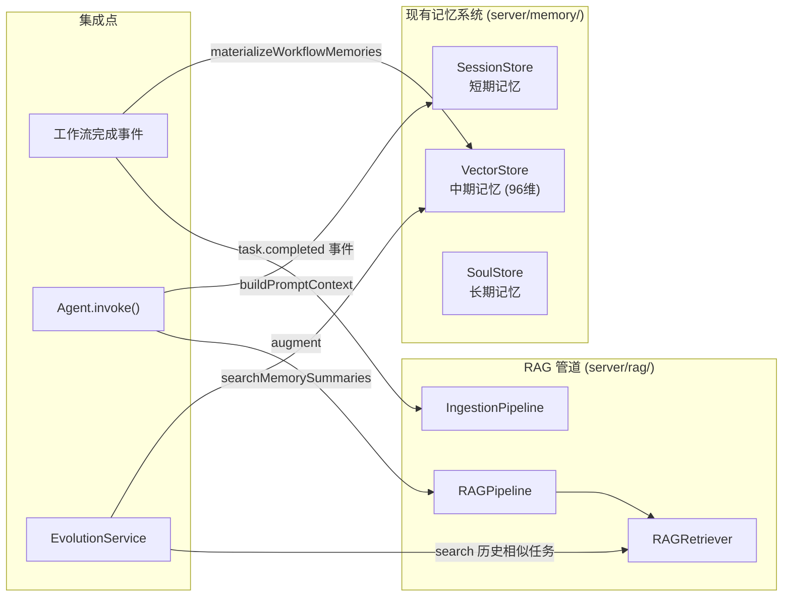

# 设计文档：向量数据库与 RAG 管道

## 概述

本模块为 Cube Brain 平台构建完整的 RAG（Retrieval-Augmented Generation）管道，作为现有三级记忆系统（SessionStore / VectorStore / SoulStore）的语义检索增强层。核心目标是让 Agent 在执行任务前能自动从海量历史数据中检索最相关的上下文，从"每次从零开始"升级为"基于历史经验的增量推理"。

模块采用分层架构：摄入层（Ingestion）→ 分块层（Chunking）→ 嵌入层（Embedding）→ 索引层（Vector Store）→ 检索层（Retrieval）→ 增强层（Augmentation），每层通过接口抽象解耦，支持独立替换和扩展。

与现有记忆系统的关系：
- 现有 VectorStore（96 维本地 token hash）继续服务于工作流摘要的轻量检索
- 新 RAG 管道使用外部 Embedding 模型（如 text-embedding-3-small）生成高维向量，服务于全类型数据的深度语义检索
- 两套系统并行运行，RAG 管道不替换现有记忆系统，而是作为增强层

## 架构

### 整体架构图

```mermaid
flowchart TB
  subgraph Sources["数据源"]
    TaskResult["task.completed"]
    MissionLog["mission.finished"]
    CodeCommit["code.committed"]
    DocUpload["document.uploaded"]
    ManualAPI["POST /api/rag/ingest"]
  end

  subgraph Ingestion["摄入层"]
    EventListener["EventListener<br/>平台事件监听"]
    IngestAPI["IngestAPI<br/>REST 手动摄入"]
    DedupCheck["DedupChecker<br/>幂等去重"]
    Cleaner["DataCleaner<br/>数据清洗"]
    DLQ["DeadLetterQueue<br/>失败暂存"]
  end

  subgraph Chunking["分块层"]
    Router["ChunkRouter<br/>按 sourceType 路由"]
    CodeChunker["CodeChunker<br/>语法感知"]
    ConvChunker["ConversationChunker<br/>对话轮次"]
    DocChunker["DocumentChunker<br/>语义段落"]
    SlidingChunker["SlidingWindowChunker<br/>滑动窗口"]
    PassthroughChunker["PassthroughChunker<br/>不分块"]
  end

  subgraph Embedding["嵌入层"]
    EmbedGen["EmbeddingGenerator<br/>批量嵌入"]
    EmbedProvider["EmbeddingProvider<br/>模型抽象（热切换）"]
  end

  subgraph Storage["索引层"]
    VectorAdapter["VectorStoreAdapter<br/>统一接口"]
    Qdrant["Qdrant"]
    Milvus["Milvus"]
    Pgvector["Pgvector"]
    MetadataDB["rag_chunk_metadata<br/>元数据表"]
  end

  subgraph Retrieval["检索层"]
    Retriever["RAGRetriever<br/>语义检索"]
    KeywordSearch["KeywordSearcher<br/>关键词检索"]
    RRFMerger["RRFMerger<br/>混合合并"]
    ContextExpander["ContextExpander<br/>上下文扩展"]
  end

  subgraph Augmentation["增强层"]
    Pipeline["RAGPipeline<br/>增强生成"]
    Reranker["Reranker<br/>重排"]
    TokenBudget["TokenBudgetManager<br/>预算控制"]
    AugLog["AugmentationLogger<br/>执行日志"]
  end

  subgraph Feedback["反馈层"]
    ImplicitFB["ImplicitFeedback<br/>utilizationRate"]
    ExplicitFB["ExplicitFeedback<br/>helpful/irrelevant"]
    WeightTuner["WeightTuner<br/>权重调优"]
    HardNeg["HardNegativeSet<br/>硬负例集"]
  end

  subgraph Lifecycle["生命周期"]
    LCManager["VectorLifecycleManager"]
    HotCold["Hot/Cold 分层"]
    Purge["批量清理"]
  end

  Sources --> EventListener & ManualAPI
  EventListener & IngestAPI --> DedupCheck
  DedupCheck --> Cleaner
  Cleaner --> Router
  Cleaner -.->|失败| DLQ
  Router --> CodeChunker & ConvChunker & DocChunker & SlidingChunker & PassthroughChunker
  CodeChunker & ConvChunker & DocChunker & SlidingChunker & PassthroughChunker --> EmbedGen
  EmbedGen --> EmbedProvider
  EmbedGen --> VectorAdapter & MetadataDB
  EmbedGen -.->|失败| DLQ
  VectorAdapter --> Qdrant & Milvus & Pgvector

  Retriever --> EmbedProvider
  Retriever --> VectorAdapter
  Retriever --> KeywordSearch
  Retriever --> RRFMerger
  Retriever --> ContextExpander

  Pipeline --> Retriever
  Pipeline --> Reranker
  Pipeline --> TokenBudget
  Pipeline --> AugLog

  Pipeline --> ImplicitFB
  ExplicitFB --> WeightTuner
  ExplicitFB --> HardNeg

  LCManager --> HotCold
  LCManager --> Purge
  LCManager --> VectorAdapter
```



### 与现有记忆系统的集成



集成策略：
- **不侵入现有代码**：RAG 管道通过事件监听接入，不修改 SessionStore/VectorStore/SoulStore 的现有接口
- **Agent.invoke() 增强**：在 `server/core/agent.ts` 的 `invoke()` 方法中增加 RAG 上下文注入钩子，通过注入模式（auto/on_demand/disabled）控制
- **EvolutionService 增强**：自进化引擎可通过 RAGRetriever 检索历史相似任务的完成情况，辅助弱维度分析

### 目录结构

```
server/rag/
├── index.ts                    # 模块入口，导出所有公共接口
├── config.ts                   # RAG 配置管理（rag.* 配置项）
├── ingestion/
│   ├── ingestion-pipeline.ts   # 摄入管道主流程
│   ├── event-listener.ts       # 平台事件监听器
│   ├── data-cleaner.ts         # 数据清洗
│   ├── dedup-checker.ts        # 幂等去重
│   └── dead-letter-queue.ts    # 失败暂存队列
├── chunking/
│   ├── chunk-router.ts         # 分块策略路由
│   ├── code-chunker.ts         # 代码语法感知分块
│   ├── conversation-chunker.ts # 对话轮次分块
│   ├── document-chunker.ts     # 语义段落分块
│   ├── sliding-window-chunker.ts # 滑动窗口分块
│   └── passthrough-chunker.ts  # 不分块（直通）
├── embedding/
│   ├── embedding-generator.ts  # 批量嵌入生成
│   └── embedding-provider.ts   # Embedding 模型抽象接口
├── store/
│   ├── vector-store-adapter.ts # 向量数据库统一接口
│   ├── qdrant-adapter.ts       # Qdrant 适配器
│   ├── milvus-adapter.ts       # Milvus 适配器
│   ├── pgvector-adapter.ts     # Pgvector 适配器
│   └── metadata-store.ts       # 元数据存储
├── retrieval/
│   ├── rag-retriever.ts        # 语义检索服务
│   ├── keyword-searcher.ts     # 关键词检索
│   ├── rrf-merger.ts           # RRF 混合合并
│   └── context-expander.ts     # 上下文扩展
├── augmentation/
│   ├── rag-pipeline.ts         # RAG 增强生成管道
│   ├── reranker.ts             # 重排器
│   ├── token-budget-manager.ts # Token 预算控制
│   └── augmentation-logger.ts  # 增强执行日志
├── feedback/
│   ├── feedback-collector.ts   # 反馈收集
│   ├── weight-tuner.ts         # 权重调优
│   └── hard-negative-set.ts    # 硬负例集
├── lifecycle/
│   ├── lifecycle-manager.ts    # 生命周期管理
│   └── hot-cold-manager.ts     # 冷热分层
└── observability/
    ├── metrics.ts              # Prometheus 指标
    ├── quota-manager.ts        # 配额管理
    └── health-checker.ts       # 健康检查

server/routes/
└── rag.ts                      # RAG 相关 REST API 路由

shared/
└── rag/
    ├── contracts.ts            # RAG 共享类型契约
    └── api.ts                  # RAG REST API 路由常量

client/src/
├── components/
│   └── rag/
│       ├── RAGInfoPanel.tsx    # RAG 增强信息区块
│       ├── RAGDebugPanel.tsx   # 检索调试面板
│       └── RAGFeedback.tsx     # 反馈提交组件
└── lib/
    └── rag-store.ts            # RAG 前端状态管理
```

## 组件与接口

### 1. IngestionPipeline（摄入管道）

```typescript
interface IngestionPipeline {
  /** 摄入单条数据 */
  ingest(payload: IngestionPayload): Promise<IngestionResult>;
  /** 批量摄入 */
  ingestBatch(payloads: IngestionPayload[]): Promise<IngestionBatchResult>;
  /** 获取 Dead Letter Queue 中的失败记录 */
  getDeadLetters(options?: { limit?: number; offset?: number }): Promise<DeadLetterEntry[]>;
  /** 重试 Dead Letter Queue 中的记录 */
  retryDeadLetter(entryId: string): Promise<IngestionResult>;
}

interface IngestionResult {
  success: boolean;
  chunkCount: number;
  sourceId: string;
  deduplicated: boolean;
  error?: string;
}
```

**设计决策**：摄入管道采用同步流水线模式（非消息队列），因为当前平台规模不需要分布式消息队列的复杂性。失败数据写入本地 Dead Letter Queue（JSON 文件），支持手动重试。未来可替换为 Redis/RabbitMQ。

### 2. Chunker 接口族

```typescript
interface Chunker {
  chunk(content: string, metadata: ChunkMetadata): ChunkRecord[];
}

interface ChunkRouter {
  route(sourceType: SourceType): Chunker;
}

// 各 Chunker 实现
class CodeChunker implements Chunker { /* 按函数/类/import 块分割 */ }
class ConversationChunker implements Chunker { /* 按对话轮次分割 */ }
class DocumentChunker implements Chunker { /* 按语义段落分割 */ }
class SlidingWindowChunker implements Chunker { /* 512 tokens, overlap 64 */ }
class PassthroughChunker implements Chunker { /* 整体作为单个 chunk */ }
```

**设计决策**：CodeChunker 使用正则匹配函数/类边界（不引入完整 AST 解析器），在准确性和复杂度之间取平衡。DocumentChunker 按双换行符分段，再按 token 数合并/分割。

### 3. EmbeddingGenerator

```typescript
interface EmbeddingProvider {
  embed(texts: string[]): Promise<number[][]>;
  readonly dimension: number;
  readonly modelName: string;
}

interface EmbeddingGenerator {
  /** 批量生成嵌入 */
  generateBatch(chunks: ChunkRecord[]): Promise<EmbeddedChunk[]>;
  /** 单条生成（用于 query 向量化） */
  generateSingle(text: string): Promise<number[]>;
  /** 切换模型 */
  switchProvider(provider: EmbeddingProvider): void;
}

interface EmbeddedChunk {
  chunk: ChunkRecord;
  vector: number[];
}
```

**设计决策**：EmbeddingProvider 接口抽象允许热切换模型。默认使用 OpenAI 兼容接口（text-embedding-3-small），与现有 llm-client.ts 的 API 调用模式一致。批量处理 batchSize=64，失败时降级为单条重试。

### 4. VectorStoreAdapter

```typescript
interface VectorStoreAdapter {
  /** 创建 collection */
  createCollection(name: string, dimension: number): Promise<void>;
  /** 插入向量 */
  upsert(collection: string, records: VectorRecord[]): Promise<void>;
  /** ANN 搜索 */
  search(collection: string, query: number[], options: SearchOptions): Promise<SearchHit[]>;
  /** 删除向量 */
  delete(collection: string, ids: string[]): Promise<void>;
  /** 获取 collection 信息 */
  collectionInfo(name: string): Promise<CollectionInfo>;
  /** 健康检查 */
  healthCheck(): Promise<HealthStatus>;
}

interface SearchOptions {
  topK: number;
  filter?: Record<string, any>;
  minScore?: number;
}

interface SearchHit {
  id: string;
  score: number;
  metadata?: Record<string, any>;
}
```

**设计决策**：优先实现 Qdrant 适配器（开源、HTTP API 友好、支持过滤索引）。Milvus 和 Pgvector 适配器作为后续扩展。collection 按 `rag_{projectId}` 命名，每个项目独立 collection。

### 5. RAGRetriever（语义检索服务）

```typescript
interface RAGRetriever {
  search(query: string, options: RetrievalOptions): Promise<RetrievalResult[]>;
}

interface RetrievalOptions {
  projectId: string;
  topK?: number;              // 默认 10
  sourceTypes?: SourceType[];
  timeRange?: { start: Date; end: Date };
  agentId?: string;
  codeLanguage?: string;
  minScore?: number;          // 默认 0.5
  mode?: 'semantic' | 'keyword' | 'hybrid';  // 默认 hybrid
  expandContext?: boolean;
  contextWindowChunks?: number; // 默认 1
}

interface RetrievalResult {
  chunkId: string;
  score: number;
  content: string;
  sourceType: SourceType;
  sourceId: string;
  metadata: Record<string, any>;
  highlight?: string;
  totalCandidates: number;
}
```

### 6. RAGPipeline（增强生成管道）

```typescript
interface RAGPipeline {
  augment(task: TaskContext, agent: AgentContext): Promise<AugmentationResult>;
}

interface TaskContext {
  taskId: string;
  projectId: string;
  directive: string;
  stage?: string;
}

interface AgentContext {
  agentId: string;
  role: string;
  capabilities?: string[];
}

interface AugmentationResult {
  ragContext: RAGContext;
  retrievedChunks: RetrievalResult[];
  injectedChunks: RetrievalResult[];
  prunedChunks: RetrievalResult[];
  tokenUsage: number;
  latencyMs: number;
}

interface RAGContext {
  mode: 'auto' | 'on_demand' | 'disabled';
  chunks: Array<{
    content: string;
    sourceType: SourceType;
    sourceId: string;
    score: number;
    status: 'injected' | 'pruned' | 'below_threshold';
  }>;
  totalTokens: number;
  retrievalLatencyMs: number;
}
```

### 7. Reranker

```typescript
interface Reranker {
  rerank(query: string, results: RetrievalResult[]): Promise<RetrievalResult[]>;
}

class LLMReranker implements Reranker {
  // 使用 LLM 对 query-chunk 对进行相关性评分
}

class CrossEncoderReranker implements Reranker {
  // 使用 Cross-Encoder 模型进行重排
}

class NoopReranker implements Reranker {
  // 不重排，直接返回（默认）
}
```

**设计决策**：Reranker 默认使用 NoopReranker（不重排），因为重排会增加延迟和成本。用户可通过配置切换到 LLMReranker 或 CrossEncoderReranker。

### 8. FeedbackCollector

```typescript
interface FeedbackCollector {
  recordImplicit(taskId: string, injectedCount: number, usedCount: number): Promise<void>;
  recordExplicit(feedback: ExplicitFeedback): Promise<void>;
  getStats(options: FeedbackStatsOptions): Promise<FeedbackStats>;
}

interface ExplicitFeedback {
  taskId: string;
  agentId: string;
  helpfulChunkIds: string[];
  irrelevantChunkIds: string[];
  missingContext?: string;
}
```

### 9. VectorLifecycleManager

```typescript
interface VectorLifecycleManager {
  /** 执行定时生命周期任务 */
  runScheduledTasks(): Promise<LifecycleReport>;
  /** 按条件批量清理 */
  purge(options: PurgeOptions): Promise<PurgeResult>;
  /** 提升冷数据到热存储 */
  promote(chunkIds: string[]): Promise<void>;
}

interface PurgeOptions {
  projectId?: string;
  sourceType?: SourceType;
  timeRange?: { before: Date };
}
```

## 数据模型

### 核心类型定义（shared/rag/contracts.ts）

```typescript
export const RAG_CONTRACT_VERSION = '2025-01-01' as const;

export const SOURCE_TYPES = [
  'task_result',
  'code_snippet',
  'conversation',
  'mission_log',
  'document',
  'architecture_decision',
  'bug_report',
] as const;

export type SourceType = (typeof SOURCE_TYPES)[number];

export interface IngestionPayload {
  sourceType: SourceType;
  sourceId: string;
  projectId: string;
  content: string;
  metadata: Record<string, any>;
  timestamp: string;       // ISO 8601
  agentId?: string;
}

export interface ChunkRecord {
  chunkId: string;          // `${sourceType}:${sourceId}:${chunkIndex}`
  sourceType: SourceType;
  sourceId: string;
  projectId: string;
  chunkIndex: number;
  content: string;
  tokenCount: number;
  metadata: ChunkMetadata;
}

export interface ChunkMetadata {
  // 通用字段
  ingestedAt: string;
  lastAccessedAt: string;
  contentHash: string;
  // 代码专用字段
  codeLanguage?: string;
  functionSignature?: string;
  imports?: string[];
  // 对话专用字段
  turnIndex?: number;
  speaker?: string;
}

export interface RetrievalResult {
  chunkId: string;
  score: number;
  content: string;
  sourceType: SourceType;
  sourceId: string;
  metadata: ChunkMetadata;
  highlight?: string;
  totalCandidates: number;
}

export interface RAGAugmentationLog {
  logId: string;
  taskId: string;
  agentId: string;
  projectId: string;
  mode: 'auto' | 'on_demand' | 'disabled';
  retrievedChunkIds: string[];
  injectedChunkIds: string[];
  prunedChunkIds: string[];
  tokenUsage: number;
  latencyMs: number;
  timestamp: string;
}

export interface DeadLetterEntry {
  entryId: string;
  payload: IngestionPayload;
  error: string;
  failedAt: string;
  retryCount: number;
  stage: 'clean' | 'chunk' | 'embed' | 'store' | 'metadata';
}

export interface FeedbackRecord {
  feedbackId: string;
  taskId: string;
  agentId: string;
  projectId: string;
  helpfulChunkIds: string[];
  irrelevantChunkIds: string[];
  missingContext?: string;
  utilizationRate: number;
  timestamp: string;
}

export interface LifecycleLog {
  logId: string;
  operation: 'archive' | 'delete' | 'orphan_cleanup' | 'promote' | 'purge';
  affectedCount: number;
  collection: string;
  executedAt: string;
  durationMs: number;
  details?: Record<string, any>;
}
```

### 元数据表结构（rag_chunk_metadata）

```typescript
interface RagChunkMetadataRow {
  chunk_id: string;          // PK
  source_type: SourceType;
  source_id: string;
  project_id: string;
  chunk_index: number;
  content_hash: string;
  token_count: number;
  code_language: string | null;
  function_signature: string | null;
  agent_id: string | null;
  ingested_at: string;
  last_accessed_at: string;
  storage_tier: 'hot' | 'cold';
  metadata_json: string;     // 扩展元数据 JSON
}
```

### 配置模型（rag.* 配置项）

```typescript
interface RAGConfig {
  enabled: boolean;                    // 全局开关
  embedding: {
    provider: 'openai' | 'local';     // 嵌入模型提供者
    model: string;                     // 模型名称
    dimension: number;                 // 向量维度
    batchSize: number;                 // 批量大小，默认 64
    apiKey?: string;
    baseUrl?: string;
  };
  vectorStore: {
    backend: 'qdrant' | 'milvus' | 'pgvector';
    connectionUrl: string;
  };
  chunking: {
    [key in SourceType]?: {
      strategy: string;
      maxTokens: number;
      minTokens: number;
      overlap?: number;
      windowSize?: number;
    };
  };
  retrieval: {
    defaultTopK: number;               // 默认 10
    defaultMinScore: number;           // 默认 0.5
    defaultMode: 'semantic' | 'keyword' | 'hybrid';
    contextWindowChunks: number;       // 默认 1
  };
  augmentation: {
    mode: 'auto' | 'on_demand' | 'disabled';
    tokenBudget: number;               // 默认 4096
    reranker: 'noop' | 'llm' | 'cross_encoder';
  };
  lifecycle: {
    archiveAfterDays: number;          // 默认 90
    deleteAfterDays: number;           // 默认 365
    scheduleIntervalHours: number;     // 默认 24
  };
  quota: {
    [projectId: string]: {
      maxVectors: number;
      maxDailyEmbeddingTokens: number;
    };
  };
}
```

### API 设计（shared/rag/api.ts）

```typescript
// RAG REST API 路由常量
export const RAG_API = {
  // 摄入
  INGEST:           'POST /api/rag/ingest',
  INGEST_BATCH:     'POST /api/rag/ingest/batch',

  // 检索
  SEARCH:           'POST /api/rag/search',

  // 反馈
  FEEDBACK:         'POST /api/rag/feedback',
  FEEDBACK_STATS:   'GET  /api/rag/feedback/stats',

  // 任务 RAG 数据
  TASK_RAG:         'GET  /api/workflows/:workflowId/tasks/:taskId/rag',

  // 管理
  ADMIN_HEALTH:     'GET  /api/admin/rag/health',
  ADMIN_REEMBED:    'POST /api/admin/rag/reembed',
  ADMIN_PURGE:      'POST /api/admin/rag/purge',
  ADMIN_BACKFILL:   'POST /api/admin/rag/backfill',
  ADMIN_DLQ:        'GET  /api/admin/rag/dlq',
  ADMIN_DLQ_RETRY:  'POST /api/admin/rag/dlq/:entryId/retry',
  ADMIN_METRICS:    'GET  /api/admin/rag/metrics',
} as const;
```

### API 请求/响应类型

```typescript
// POST /api/rag/ingest
interface IngestRequest {
  payload: IngestionPayload;
}
interface IngestResponse {
  success: boolean;
  chunkCount: number;
  deduplicated: boolean;
  error?: string;
}

// POST /api/rag/search
interface SearchRequest {
  query: string;
  options: RetrievalOptions;
}
interface SearchResponse {
  results: RetrievalResult[];
  totalCandidates: number;
  latencyMs: number;
  mode: 'semantic' | 'keyword' | 'hybrid';
}

// POST /api/rag/feedback
interface FeedbackRequest {
  taskId: string;
  agentId: string;
  helpfulChunkIds?: string[];
  irrelevantChunkIds?: string[];
  missingContext?: string;
}

// GET /api/admin/rag/health
interface HealthResponse {
  status: 'healthy' | 'degraded' | 'unhealthy';
  vectorStore: { connected: boolean; backend: string };
  embeddingModel: { available: boolean; model: string };
  collections: Array<{ name: string; vectorCount: number; status: string }>;
  deadLetterQueue: { count: number };
}

// POST /api/admin/rag/purge
interface PurgeRequest {
  projectId?: string;
  sourceType?: SourceType;
  before?: string;  // ISO 8601
}
interface PurgeResponse {
  deletedCount: number;
  durationMs: number;
}
```

### RRF 混合检索算法

```typescript
/**
 * Reciprocal Rank Fusion 合并算法
 * 将语义检索和关键词检索的结果按排名倒数加权合并
 *
 * score(d) = Σ 1 / (k + rank_i(d))
 * k = 60 (常数，平衡高排名和低排名的权重差异)
 */
function rrfMerge(
  semanticResults: SearchHit[],
  keywordResults: SearchHit[],
  k: number = 60
): SearchHit[] {
  const scores = new Map<string, number>();

  for (const [rank, hit] of semanticResults.entries()) {
    scores.set(hit.id, (scores.get(hit.id) || 0) + 1 / (k + rank + 1));
  }
  for (const [rank, hit] of keywordResults.entries()) {
    scores.set(hit.id, (scores.get(hit.id) || 0) + 1 / (k + rank + 1));
  }

  return Array.from(scores.entries())
    .sort((a, b) => b[1] - a[1])
    .map(([id, score]) => ({ id, score }));
}
```

## 正确性属性

*正确性属性是一种在系统所有有效执行中都应成立的特征或行为——本质上是关于系统应该做什么的形式化陈述。属性作为人类可读规范与机器可验证正确性保证之间的桥梁。*

### Property 1: 数据源类型路由正确性

*For any* 有效的 SourceType，摄入管道应接受该数据并将其路由到对应的 Chunker 实现；*for any* 无效的 SourceType，摄入管道应拒绝该数据。

**Validates: Requirements 1.1, 2.1**

### Property 2: IngestionPayload 结构完整性

*For any* 摄入的数据，生成的 IngestionPayload 应包含所有必需字段（sourceType、sourceId、projectId、content、metadata、timestamp），且字段类型正确。

**Validates: Requirements 1.2**

### Property 3: 摄入幂等性

*For any* IngestionPayload，连续摄入两次（sourceType + sourceId + contentHash 相同）后，向量数据库中的记录数应与摄入一次相同。

**Validates: Requirements 1.6**

### Property 4: 失败数据进入 Dead Letter Queue

*For any* 在摄入流水线任意阶段（clean/chunk/embed/store/metadata）失败的 IngestionPayload，该数据应出现在 Dead Letter Queue 中，且 DLQ 条目包含失败阶段和错误信息。

**Validates: Requirements 1.5**

### Property 5: ChunkRecord 结构与代码元数据完整性

*For any* 输入内容和 sourceType，分块后生成的每个 ChunkRecord 应包含所有必需字段（chunkId、sourceType、sourceId、projectId、chunkIndex、content、tokenCount）；*for any* code_snippet 类型的 chunk，metadata 应额外包含 codeLanguage 和 functionSignature。

**Validates: Requirements 2.2, 2.3**

### Property 6: Chunk token 数范围不变量

*For any* 输入内容（长度 >= 64 tokens），分块后生成的每个 ChunkRecord 的 tokenCount 应在 [64, 1024] 范围内。

**Validates: Requirements 2.4**

### Property 7: 分块配置覆盖

*For any* 自定义的 rag.chunking 配置和 sourceType，Chunker 应使用自定义配置中的参数（如 windowSize、overlap）而非默认值。

**Validates: Requirements 2.5**

### Property 8: 嵌入批量失败降级为单条重试

*For any* 一批 chunks，当批量嵌入调用失败时，每个 chunk 应被单独重试；最终成功嵌入的 chunk 数应等于单条重试中成功的数量。

**Validates: Requirements 3.2**

### Property 9: 向量按 projectId 分 collection

*For any* 一组具有不同 projectId 的 IngestionPayload，摄入完成后，每个 projectId 的向量应存储在独立的 collection 中。

**Validates: Requirements 3.4**

### Property 10: 向量-元数据同步一致性

*For any* 成功摄入的 chunk，向量数据库中应存在对应向量，且 rag_chunk_metadata 表中应存在对应元数据行，两者的 chunkId 一致。

**Validates: Requirements 3.5**

### Property 11: 检索过滤合规性与结果完整性

*For any* 带过滤条件（sourceTypes、agentId、codeLanguage、timeRange、minScore）的检索请求，返回的每个 RetrievalResult 应满足所有过滤条件，且包含所有必需字段（chunkId、score、content、sourceType、sourceId、metadata）。

**Validates: Requirements 4.1, 4.3**

### Property 12: RRF 混合合并排序正确性

*For any* 两个排序列表（语义检索结果和关键词检索结果），RRF 合并后的结果中，同时出现在两个列表中的项应排在仅出现在一个列表中的项之前（在排名相近的情况下）。

**Validates: Requirements 4.4**

### Property 13: 上下文扩展包含相邻 chunk

*For any* 检索命中的 chunk（chunkIndex = N），当 expandContext 启用且 contextWindowChunks = W 时，返回结果应包含 chunkIndex 在 [N-W, N+W] 范围内的所有存在的相邻 chunk。

**Validates: Requirements 4.5**

### Property 14: Reranker 保持结果集不变量

*For any* 检索结果列表，经过 Reranker 重排后，结果集应是原始结果集的排列（不增加也不减少元素）。

**Validates: Requirements 5.2**

### Property 15: Token 预算不变量与来源标注

*For any* 一组检索到的 chunks 和 token 预算 B，RAGPipeline 注入的 chunks 的总 token 数应 <= B，且每个注入的 chunk 应带有 sourceType、sourceId、score 标注。

**Validates: Requirements 5.3, 5.4**

### Property 16: 注入模式行为正确性

*For any* augment 调用，当 mode=disabled 时，injectedChunks 应为空；当 mode=on_demand 且未显式请求时，injectedChunks 应为空。

**Validates: Requirements 5.5**

### Property 17: 增强执行日志记录

*For any* 成功的 augment 调用，rag_augmentation_log 中应存在对应记录，包含 taskId、agentId、retrievedChunkIds、injectedChunkIds、tokenUsage、latencyMs。

**Validates: Requirements 5.6**

### Property 18: utilizationRate 计算正确性

*For any* 注入了 N 个 chunks 且实际使用了 M 个 chunks 的任务（N > 0），utilizationRate 应等于 M/N。

**Validates: Requirements 6.1**

### Property 19: 显式反馈记录与硬负例集构建

*For any* 包含 irrelevantChunkIds 的显式反馈提交，反馈应被完整记录（helpfulChunkIds、irrelevantChunkIds、missingContext），且 irrelevantChunkIds 中的每个 chunk 应出现在硬负例集中。

**Validates: Requirements 6.2, 6.4**

### Property 20: 低利用率告警触发

*For any* 连续 N 次（N >= 阈值）augment 调用的 utilizationRate 低于配置阈值，系统应发出 RETRIEVAL_GAP_DETECTED 告警。

**Validates: Requirements 6.3**

### Property 21: 访问时间戳更新与冷热提升

*For any* 被检索命中的 chunk，其 lastAccessedAt 应被更新为当前时间；*for any* 存储在 cold collection 中的 chunk 被检索命中时，该 chunk 应被提升到 hot collection。

**Validates: Requirements 7.1, 7.3**

### Property 22: 生命周期定时任务与操作日志

*For any* 超过 archiveAfterDays 未访问的 hot 记录，生命周期任务应将其归档到 cold collection；*for any* 超过 deleteAfterDays 的 cold 记录，应被删除；每次操作应产生 rag_lifecycle_log 记录。

**Validates: Requirements 7.2, 7.5**

### Property 23: 按条件批量清理

*For any* purge 请求带有 projectId/sourceType/timeRange 过滤条件，只有匹配条件的记录应被删除，不匹配的记录应保持不变。

**Validates: Requirements 7.4**

### Property 24: 项目级配额拒绝

*For any* 已达到最大向量数量配额的 projectId，新的摄入请求应被拒绝并返回配额超限错误。

**Validates: Requirements 8.2**

### Property 25: Token 消耗分解一致性

*For any* 一组操作（embedding/reranking/augmentation），按操作类型分别统计的 token 消耗之和应等于总 token 消耗。

**Validates: Requirements 8.3**

### Property 26: 全局开关行为

*For any* RAG 操作（ingest/search/augment），当 rag.enabled=false 时，操作应返回空结果或被跳过，不产生任何向量写入或 API 调用。

**Validates: Requirements 8.5**

### Property 27: Chunk 状态标签互斥完整性

*For any* augmentation 结果中的 chunk，其状态应恰好是 injected、pruned、below_threshold 三者之一。

**Validates: Requirements 9.2**

## 错误处理

### 摄入层错误处理

| 错误场景 | 处理策略 |
|---------|---------|
| IngestionPayload 字段缺失/类型错误 | 返回 400 Bad Request，不进入管道 |
| 数据清洗失败（内容为空/编码异常） | 写入 DLQ，stage='clean' |
| 分块失败（token 计数异常） | 写入 DLQ，stage='chunk' |
| Embedding API 调用失败（批量） | 降级为单条重试 |
| Embedding API 调用失败（单条） | 写入 DLQ，stage='embed' |
| 向量数据库写入失败 | 写入 DLQ，stage='store'，支持重试 |
| 元数据表写入失败 | 写入 DLQ，stage='metadata' |
| 配额超限 | 返回 429 Too Many Requests |
| 幂等去重命中 | 返回成功，deduplicated=true |

### 检索层错误处理

| 错误场景 | 处理策略 |
|---------|---------|
| Query 向量化失败 | 降级为纯关键词检索 |
| 向量数据库连接失败 | 返回空结果 + 降级标记 |
| Reranker 调用失败 | 跳过重排，使用原始排序 |
| 上下文扩展查询失败 | 返回原始结果，不扩展 |
| Token 预算计算溢出 | 使用保守估算（按字符数 * 1.5） |

### 生命周期错误处理

| 错误场景 | 处理策略 |
|---------|---------|
| 定时任务执行失败 | 记录错误日志，下次调度重试 |
| 冷热迁移失败 | 保持原 tier 不变，记录日志 |
| 批量清理部分失败 | 返回已删除数量 + 失败数量 |

### 全局降级策略

当 RAG 管道整体不可用时（向量数据库断连 + Embedding 模型不可用）：
1. 自动切换到 `rag.enabled=false` 模式
2. Agent.invoke() 跳过 RAG 增强，仅使用现有记忆系统
3. 摄入数据写入 DLQ，待恢复后批量重试
4. 健康检查 API 返回 `status: 'unhealthy'`

## 测试策略

### 测试框架

- 单元测试 + 属性测试：Vitest + fast-check
- 属性测试库：fast-check（TypeScript 生态最成熟的 PBT 库）
- 每个属性测试最少运行 100 次迭代

### 属性测试（Property-Based Testing）

每个正确性属性对应一个属性测试，使用 fast-check 生成随机输入：

| Property | 生成器策略 | 关键断言 |
|----------|-----------|---------|
| P1: 数据源类型路由 | `fc.constantFrom(...SOURCE_TYPES)` + `fc.string()` | 有效类型被接受并路由正确 |
| P2: Payload 结构 | `fc.record({ sourceType, sourceId, ... })` | 所有必需字段存在且类型正确 |
| P3: 摄入幂等性 | 随机 Payload | 两次摄入后记录数不变 |
| P4: DLQ 写入 | 随机 Payload + 注入失败 | 失败数据出现在 DLQ |
| P5: ChunkRecord 完整性 | 随机内容 + sourceType | 必需字段存在，代码类有额外元数据 |
| P6: Token 范围 | 随机长文本 | 所有 chunk tokenCount ∈ [64, 1024] |
| P7: 配置覆盖 | 随机配置 + sourceType | 使用自定义参数 |
| P8: 批量失败降级 | 随机 batch + 注入批量失败 | 单条重试数 = 成功数 |
| P9: projectId 分 collection | 随机 projectId 集合 | 每个 projectId 独立 collection |
| P10: 向量-元数据同步 | 随机 chunk | 向量和元数据行一致 |
| P11: 检索过滤 | 随机过滤条件 | 结果满足所有过滤条件 |
| P12: RRF 合并 | 两个随机排序列表 | 双列表项排名更高 |
| P13: 上下文扩展 | 随机 chunkIndex + windowSize | 包含相邻 chunk |
| P14: Reranker 不变量 | 随机结果列表 | 重排后集合不变 |
| P15: Token 预算 | 随机 chunks + budget | 总 token <= budget |
| P16: 注入模式 | 随机 mode | disabled/on_demand 行为正确 |
| P17: 增强日志 | 随机 augment 调用 | 日志记录存在 |
| P18: utilizationRate | 随机 N, M (M <= N) | rate = M/N |
| P19: 反馈与硬负例 | 随机反馈 | 记录完整 + 硬负例集包含 irrelevant |
| P20: 低利用率告警 | 随机 utilizationRate 序列 | 连续低于阈值时告警 |
| P21: 访问时间戳 | 随机 chunk 访问 | lastAccessedAt 更新 + cold→hot |
| P22: 生命周期任务 | 随机年龄分布的记录 | 归档/删除正确 + 日志存在 |
| P23: 批量清理 | 随机过滤条件 | 只删除匹配记录 |
| P24: 配额拒绝 | 随机 projectId 在配额边界 | 超限时拒绝 |
| P25: Token 分解 | 随机操作序列 | 分项之和 = 总量 |
| P26: 全局开关 | 随机操作 + enabled=false | 无写入无调用 |
| P27: 状态标签 | 随机 augmentation 结果 | 每个 chunk 恰好一个状态 |

### 单元测试

单元测试聚焦于具体示例和边界情况：

- 各 Chunker 实现的边界情况（空内容、超长内容、特殊字符）
- RRF 合并的具体数值验证
- Token 预算边界（恰好等于预算、超出 1 token）
- DLQ 重试逻辑
- 配置热加载
- API 路由的请求/响应格式验证

### 测试标签格式

每个属性测试使用以下注释标签：

```typescript
// Feature: vector-db-rag-pipeline, Property 3: 摄入幂等性
test.prop([ingestionPayloadArb], { numRuns: 100 }, (payload) => {
  // ...
});
```
