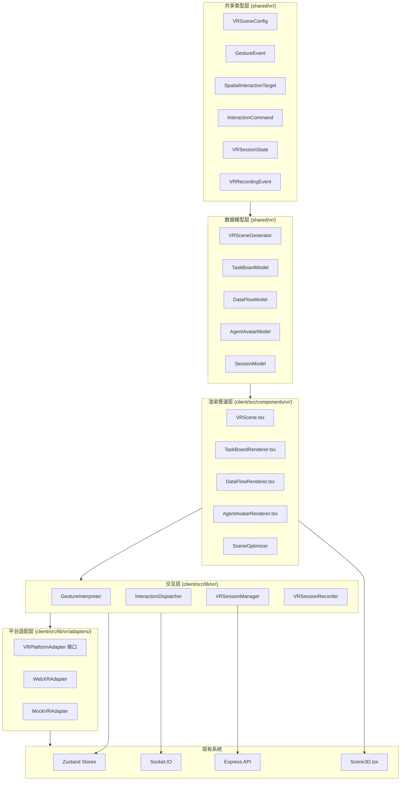

# AR/VR 扩展模块 设计文档

## 概述

AR/VR 扩展模块在现有 Cube Pets Office 3D 场景（React Three Fiber + Three.js）基础上，构建沉浸式 VR 交互层。当前阶段聚焦于核心数据模型、渲染管道和平台适配接口的实现，VR 硬件集成作为远期演进方向。

设计原则：
- 分层架构：数据模型层 → 渲染管道层 → 交互层 → 平台适配层
- 与现有 Scene3D / PetWorkers 架构兼容，复用 Zustand 状态管理和 Socket.IO 实时通信
- MockVRAdapter 优先：所有功能可在浏览器中通过鼠标/键盘模拟 VR 交互进行开发和测试
- 性能预算：目标 90+ FPS，LOD + 流式加载 + 自适应质量

## 架构



### 目录结构

```
shared/vr/
  types.ts              # 所有 VR 共享类型定义
  scene-generator.ts    # VRSceneGenerator 纯函数
  board-model.ts        # TaskBoard 数据模型转换
  flow-model.ts         # DataFlow 数据模型转换
  avatar-model.ts       # AgentAvatar 数据模型
  session-model.ts      # VR 会话数据模型
  recording-model.ts    # 录制事件数据模型

client/src/lib/vr/
  gesture-interpreter.ts    # 手势解释器
  interaction-dispatcher.ts # 交互分发器
  session-manager.ts        # 会话管理器
  session-recorder.ts       # 会话录制器
  scene-optimizer.ts        # 场景优化器
  vr-store.ts               # VR Zustand store
  adapters/
    platform-adapter.ts     # VRPlatformAdapter 接口
    webxr-adapter.ts        # WebXR 实现
    mock-adapter.ts         # Mock 实现

client/src/components/vr/
  VRScene.tsx               # VR 场景根组件
  TaskBoardRenderer.tsx     # 3D 任务看板
  DataFlowRenderer.tsx      # 3D 数据流图
  AgentAvatarRenderer.tsx   # Agent 虚拟形象
  VRManagementPanel.tsx     # 2D 管理面板

server/routes/
  vr-sessions.ts            # VR 会话 API 路由
```

## 组件与接口

### 1. VRPlatformAdapter 接口

```typescript
interface VRPlatformAdapter {
  readonly name: string;
  readonly isImmersive: boolean;

  initialize(config: VRAdapterConfig): Promise<void>;
  dispose(): void;

  // 输入
  getGestureStream(): Observable<RawGestureData>;
  getHeadPose(): VRPose;
  getHandPose(hand: 'left' | 'right'): VRHandPose | null;

  // 渲染
  beginFrame(): void;
  endFrame(): void;
  getProjectionMatrix(eye: 'left' | 'right'): Matrix4;

  // 会话
  requestSession(): Promise<VRSessionHandle>;
  endSession(): void;
  isSessionActive(): boolean;
}
```

### 2. VRSceneGenerator

纯函数，接收组织快照和任务状态，输出场景配置。与现有 `createDynamicSceneData()` 模式一致。

```typescript
function generateVRScene(
  organization: WorkflowOrganizationSnapshot,
  tasks: TaskRecord[],
  options?: VRSceneOptions
): VRSceneConfig;
```

### 3. GestureInterpreter

将原始手势数据映射到高级交互命令，支持可配置的手势映射表。

```typescript
class GestureInterpreter {
  constructor(mappingConfig: GestureMappingConfig);
  interpret(event: GestureEvent): InteractionCommand | null;
  updateMapping(config: GestureMappingConfig): void;
}
```

### 4. InteractionDispatcher

将交互命令路由到对应的业务逻辑处理器。

```typescript
class InteractionDispatcher {
  register(commandType: string, handler: InteractionHandler): void;
  dispatch(command: InteractionCommand, target: SpatialInteractionTarget): Promise<void>;
  unregister(commandType: string): void;
}
```

### 5. TaskBoardRenderer

将 TaskState 转换为 3D 看板对象，支持多种视图模式。

```typescript
// React Three Fiber 组件
function TaskBoardRenderer(props: {
  tasks: TaskRecord[];
  viewMode: 'list' | 'kanban' | 'gantt';
  onTaskDrag: (taskId: number, newStatus: string) => void;
  remoteCursors?: RemoteCursor[];
}): JSX.Element;
```

### 6. DataFlowRenderer

将工作流执行轨迹转换为 3D 数据流图。

```typescript
function DataFlowRenderer(props: {
  nodes: DataFlowNode[];
  edges: DataFlowEdge[];
  layout: 'force-directed' | 'hierarchical' | 'circular';
  onNodeDrillDown: (nodeId: string) => void;
  animationSpeed: number;
}): JSX.Element;
```

### 7. VRSessionManager

管理多用户 VR 会话，通过 Socket.IO 同步状态。

```typescript
class VRSessionManager {
  createSession(userId: string): VRSessionState;
  joinSession(sessionId: string, userId: string): void;
  leaveSession(sessionId: string, userId: string): void;
  broadcastPose(sessionId: string, userId: string, pose: VRUserPose): void;
  broadcastAction(sessionId: string, action: VRUserAction): void;
  getActiveSessions(): VRSessionState[];
  onStateChange(callback: (state: VRSessionState) => void): () => void;
}
```

### 8. SceneOptimizer

动态调整渲染质量，维持目标帧率。

```typescript
class SceneOptimizer {
  constructor(config: OptimizerConfig);
  evaluateFrame(metrics: FrameMetrics): QualityAdjustment;
  getLODLevel(distance: number): LODLevel;
  shouldLoadObject(objectId: string, viewFrustum: Frustum): boolean;
  shouldUnloadObject(objectId: string, viewFrustum: Frustum): boolean;
}
```

### 9. VRSessionRecorder

记录场景事件为事件流，支持回放控制。

```typescript
class VRSessionRecorder {
  startRecording(sessionId: string): void;
  stopRecording(): VRRecordingData;
  recordEvent(event: VRRecordingEvent): void;

  // 回放
  loadRecording(data: VRRecordingData): void;
  play(): void;
  pause(): void;
  seek(timestamp: number): void;
  setPlaybackSpeed(speed: number): void;
  filterEvents(filter: RecordingFilter): void;
  addAnnotation(timestamp: number, text: string): void;
}
```

## 数据模型

### VRSceneConfig

```typescript
interface VRSceneConfig {
  metadata: {
    workflowId: string;
    generatedAt: string;
    version: number;
  };
  zones: VRZone[];
  objects: VRSceneObject[];
  lighting: VRLightingConfig;
}

interface VRZone {
  id: string;
  departmentId: string;
  label: string;
  position: [number, number, number];
  size: [number, number, number];
  colorTheme: string;
  agentIds: string[];
}

interface VRSceneObject {
  id: string;
  type: 'task_board' | 'data_flow' | 'agent_avatar' | 'comm_panel' | 'decoration';
  position: [number, number, number];
  rotation: [number, number, number];
  scale: [number, number, number];
  interactionHotspot: BoundingBox | null;
  metadata: Record<string, unknown>;
}
```

### GestureEvent

```typescript
type GestureType = 'point' | 'grab' | 'pinch' | 'swipe' | 'rotate';

interface GestureEvent {
  id: string;
  type: GestureType;
  hand: 'left' | 'right';
  position: [number, number, number];
  direction: [number, number, number];
  intensity: number;       // 0.0 - 1.0
  timestamp: number;
}
```

### InteractionCommand

```typescript
type CommandType = 'select' | 'drag' | 'scale' | 'rotate' | 'delete' | 'drill_down';

interface InteractionCommand {
  id: string;
  type: CommandType;
  targetId: string;
  parameters: Record<string, unknown>;
  sourceGestureId: string;
  timestamp: number;
}
```

### SpatialInteractionTarget

```typescript
type InteractionTargetType = 'task_card' | 'data_node' | 'agent_avatar' | 'board_panel' | 'flow_edge';

interface SpatialInteractionTarget {
  id: string;
  type: InteractionTargetType;
  boundingBox: BoundingBox;
  supportedCommands: CommandType[];
  callbackId: string;
}

interface BoundingBox {
  min: [number, number, number];
  max: [number, number, number];
}
```

### VRBoardObject

```typescript
interface VRBoardObject {
  boardId: string;
  viewMode: 'list' | 'kanban' | 'gantt';
  panels: VRBoardPanel[];
  cards: VRTaskCard[];
  interactionHotspots: SpatialInteractionTarget[];
}

interface VRTaskCard {
  taskId: number;
  title: string;
  description: string;
  priority: 'low' | 'medium' | 'high' | 'critical';
  assignedAgentId: string;
  progress: number;        // 0.0 - 1.0
  status: string;
  timestamp: string;
  position: [number, number, number];
  size: [number, number];
}

interface VRBoardPanel {
  id: string;
  label: string;
  position: [number, number, number];
  size: [number, number];
  cardIds: number[];
}
```

### VRDataFlowGraph

```typescript
interface VRDataFlowGraph {
  nodes: DataFlowNode[];
  edges: DataFlowEdge[];
  layout: 'force-directed' | 'hierarchical' | 'circular';
  animationParams: FlowAnimationParams;
}

interface DataFlowNode {
  id: string;
  type: 'agent' | 'task';
  label: string;
  position: [number, number, number];
  status: string;
  metadata: Record<string, unknown>;
}

interface DataFlowEdge {
  id: string;
  sourceId: string;
  targetId: string;
  directed: boolean;
  weight: number;
  dataPackets: DataPacket[];
}

interface DataPacket {
  id: string;
  dataType: string;
  size: number;
  timestamp: number;
  progress: number;        // 0.0 - 1.0，动画进度
  content?: unknown;
}

interface FlowAnimationParams {
  speed: number;
  particleSize: number;
  trailLength: number;
}
```

### AgentAvatar 模型

```typescript
type AgentVRStatus = 'idle' | 'working' | 'error' | 'offline';

interface AgentAvatarConfig {
  agentId: string;
  name: string;
  role: string;
  department: string;
  modelId: string;         // 预设模型库 ID 或参数化配置
  position: [number, number, number];
  status: AgentVRStatus;
  currentTask: string | null;
  skills: string[];
  statusColor: string;     // 绿=#22C55E, 黄=#EAB308, 红=#EF4444, 灰=#9CA3AF
}

interface AgentDetailPanel {
  agentId: string;
  name: string;
  role: string;
  responsibilities: string[];
  skills: string[];
  currentTask: string | null;
  recentMessages: Array<{
    from: string;
    content: string;
    timestamp: number;
  }>;
}
```

### VR 会话模型

```typescript
interface VRSessionState {
  sessionId: string;
  createdAt: number;
  users: VRUserState[];
  sceneConfig: VRSceneConfig;
  status: 'active' | 'paused' | 'ended';
}

interface VRUserState {
  userId: string;
  displayName: string;
  headPose: VRPose;
  leftHandPose: VRHandPose | null;
  rightHandPose: VRHandPose | null;
  gazeDirection: [number, number, number];
  annotations: VRAnnotation[];
  lastUpdated: number;
}

interface VRPose {
  position: [number, number, number];
  rotation: [number, number, number, number]; // quaternion
}

interface VRHandPose extends VRPose {
  fingers: VRFingerPose[];
  gesture: GestureType | null;
}

interface VRFingerPose {
  finger: 'thumb' | 'index' | 'middle' | 'ring' | 'pinky';
  joints: VRPose[];
}

interface VRAnnotation {
  id: string;
  userId: string;
  position: [number, number, number];
  text: string;
  createdAt: number;
  expiresAt: number | null;
}
```

### 录制事件模型

```typescript
type VRRecordingEventType =
  | 'user_action'
  | 'state_change'
  | 'communication'
  | 'data_flow_update'
  | 'annotation';

interface VRRecordingEvent {
  id: string;
  type: VRRecordingEventType;
  timestamp: number;
  userId: string | null;
  objectId: string | null;
  data: Record<string, unknown>;
}

interface VRRecordingData {
  sessionId: string;
  startTime: number;
  endTime: number;
  events: VRRecordingEvent[];
  annotations: VRRecordingAnnotation[];
}

interface VRRecordingAnnotation {
  id: string;
  timestamp: number;
  userId: string;
  text: string;
}

interface RecordingFilter {
  timeRange?: { start: number; end: number };
  userIds?: string[];
  objectTypes?: VRRecordingEventType[];
}
```

### VR 管理面板 API

```typescript
// GET /api/vr-sessions
interface VRSessionListResponse {
  sessions: Array<{
    sessionId: string;
    status: 'active' | 'paused' | 'ended';
    userCount: number;
    createdAt: number;
    scenePreviewUrl: string | null;
  }>;
}

// POST /api/vr-sessions
interface CreateVRSessionRequest {
  sceneParams: {
    layout: string;
    colorScheme: string;
    interactionSensitivity: number;
  };
}

// WebSocket events
// 'vr_session_update' → VRSessionState
// 'vr_user_pose' → { sessionId, userId, pose }
// 'vr_user_action' → { sessionId, userId, action }
// 'vr_notification' → { sessionId, targetUserId, message }
```


## 正确性属性（Correctness Properties）

*属性（Property）是在系统所有合法执行中都应成立的特征或行为——本质上是对系统应做之事的形式化陈述。属性是人类可读规格说明与机器可验证正确性保证之间的桥梁。*

### Property 1: 场景生成完整性

*For any* 合法的 WorkflowOrganizationSnapshot 和 TaskRecord 列表，VRSceneGenerator 生成的 VRSceneConfig 应包含完整的 metadata（workflowId、generatedAt、version）、非空的 zones 列表和 objects 列表，且每个 VRSceneObject 应包含有效的 position、rotation、scale 和 interactionHotspot 字段。

**Validates: Requirements 1.1, 1.3**

### Property 2: 部门到区块的映射守恒

*For any* 包含 N 个部门的 WorkflowOrganizationSnapshot，VRSceneGenerator 生成的 VRSceneConfig 应恰好包含 N 个 VRZone，每个 zone 的 departmentId 与输入部门一一对应，且每个 zone 的 agentIds 包含该部门下所有 Agent。

**Validates: Requirements 1.2**

### Property 3: VRSceneConfig 序列化往返一致性

*For any* 合法的 VRSceneConfig 对象，将其序列化为 JSON 再反序列化后，应产生与原始对象深度相等的结果。

**Validates: Requirements 1.4**

### Property 4: 手势与交互目标 Schema 验证

*For any* 随机生成的 GestureEvent 和 SpatialInteractionTarget，运行时验证函数应确认所有必填字段存在且值在合法范围内（intensity 在 0.0-1.0 之间，position 为三元组，supportedCommands 非空）。

**Validates: Requirements 2.1, 2.2**

### Property 5: 手势解释一致性

*For any* GestureEvent 和 GestureMappingConfig，GestureInterpreter 对同一手势事件和同一映射配置的多次调用应产生相同的 InteractionCommand（或 null）。更换映射配置后，相同手势应按新配置产生对应命令。

**Validates: Requirements 2.3, 2.5**

### Property 6: 交互分发路由正确性

*For any* 已注册的 InteractionHandler 集合和 InteractionCommand，InteractionDispatcher 应将命令路由到与 command.type 匹配的 handler，且未注册类型的命令不应触发任何 handler。

**Validates: Requirements 2.4**

### Property 7: 任务看板转换完整性

*For any* TaskRecord 列表，TaskBoardRenderer 生成的 VRBoardObject 应包含与输入等量的 VRTaskCard，每张卡片的 title、description、priority、assignedAgentId、progress、status、timestamp 字段均从对应 TaskRecord 正确映射。

**Validates: Requirements 3.1, 3.3**

### Property 8: 看板视图模式有效性

*For any* TaskRecord 列表和任意视图模式（list、kanban、gantt），TaskBoardRenderer 应生成有效的 VRBoardObject，且所有任务卡片均被分配到至少一个面板中。

**Validates: Requirements 3.2**

### Property 9: 看板 WebSocket 同步一致性

*For any* 任务更新事件序列，TaskBoardRenderer 接收事件后的看板状态应与直接从最新 TaskState 重新生成的看板状态一致。

**Validates: Requirements 3.4**

### Property 10: 看板 CRDT 汇聚性

*For any* 两个用户对同一看板的并发编辑操作序列，无论操作以何种顺序应用，最终看板状态应相同。

**Validates: Requirements 3.6**

### Property 11: 数据流图生成正确性

*For any* 合法的 WorkflowExecutionTrace，DataFlowRenderer 生成的 VRDataFlowGraph 中每个节点的 type 应为 'agent' 或 'task'，每条边的 sourceId 和 targetId 应指向图中存在的节点，且节点数量应与输入中的 Agent 和任务数量之和一致。

**Validates: Requirements 4.1, 4.2**

### Property 12: 数据包有效性

*For any* VRDataFlowGraph 中的 DataPacket，其 progress 值应在 0.0 到 1.0 之间，且其所属边的 sourceId 和 targetId 应指向图中存在的节点。

**Validates: Requirements 4.3**

### Property 13: 布局算法有效性

*For any* VRDataFlowGraph 和任意布局算法（force-directed、hierarchical、circular），布局后所有节点应具有有限的 position 值（无 NaN 或 Infinity）。

**Validates: Requirements 4.4**

### Property 14: 数据流 WebSocket 同步一致性

*For any* 通信事件序列，DataFlowRenderer 接收事件后的图状态应包含所有已接收事件对应的节点和边。

**Validates: Requirements 4.6**

### Property 15: Agent 虚拟形象生成完整性

*For any* AgentRecord，AgentAvatarGenerator 生成的 AgentAvatarConfig 应包含正确的 name、role、department，且 statusColor 应与 status 枚举值正确对应（idle→绿、working→黄、error→红、offline→灰）。

**Validates: Requirements 5.1, 5.2**

### Property 16: Agent 状态 WebSocket 同步

*For any* Agent 状态变化事件，AgentAvatarConfig 的 status 和 statusColor 应在接收事件后更新为与事件一致的值。

**Validates: Requirements 5.3**

### Property 17: 会话管理不变量

*For any* create/join/leave 操作序列，VRSessionManager 应维持以下不变量：(a) 每个活跃会话的 users 列表不包含重复用户，(b) leave 操作后用户不再出现在会话中，(c) 会话中无用户时状态变为 ended。

**Validates: Requirements 6.1**

### Property 18: 多用户状态复制

*For any* VR 会话中的用户操作（姿态更新、交互动作、标注创建），该操作应在同一会话的所有其他用户状态中可见。

**Validates: Requirements 6.2, 6.3, 6.5**

### Property 19: 会话 CRDT 汇聚性

*For any* 多用户并发场景状态变更序列，无论变更以何种顺序应用到各用户的本地状态，所有用户的最终场景状态应相同。

**Validates: Requirements 6.6**

### Property 20: 适配器行为一致性

*For any* VRPlatformAdapter 实现（WebXRAdapter、MockVRAdapter），在相同输入下应产生相同的数据模型输出（场景配置、交互命令的数据层行为一致）。

**Validates: Requirements 7.2**

### Property 21: 运行时适配器切换

*For any* 适配器切换操作，切换后系统应使用新适配器处理后续输入，且切换前的场景状态应保持不变。

**Validates: Requirements 7.5**

### Property 22: 优化器自适应调整

*For any* FrameMetrics 输入，SceneOptimizer 应产生有效的 QualityAdjustment。当帧率低于目标阈值时，质量应降低；当帧率高于目标阈值时，质量应保持或提升。

**Validates: Requirements 8.1, 8.5**

### Property 23: LOD 单调性

*For any* 两个距离值 d1 < d2，SceneOptimizer.getLODLevel(d1) 的细节级别应大于或等于 getLODLevel(d2) 的细节级别（近处细节更高）。

**Validates: Requirements 8.2**

### Property 24: 流式加载/卸载正确性

*For any* 视锥体（Frustum）和场景对象集合，视锥体内的对象应被标记为加载，视锥体外且超过卸载阈值的对象应被标记为卸载。

**Validates: Requirements 8.3**

### Property 25: 录制往返一致性

*For any* VRRecordingEvent 序列，录制后导出为事件日志格式再导入，应产生与原始序列相同的事件列表（时间戳、类型、数据完全一致）。

**Validates: Requirements 9.1, 9.4**

### Property 26: 录制过滤正确性

*For any* VRRecordingData 和 RecordingFilter，过滤后的事件应为原始事件的子集，且每个过滤后的事件都满足过滤条件（时间范围内、用户匹配、类型匹配）。

**Validates: Requirements 9.2**

### Property 27: 回放跳转一致性

*For any* VRRecordingData 和目标时间戳 t，跳转到 t 后的回放状态应等价于从头播放到 t 时的状态。

**Validates: Requirements 9.3**

## 错误处理

### 场景生成错误
- 当 WorkflowOrganizationSnapshot 为空或无效时，VRSceneGenerator 返回包含错误信息的空场景配置
- 当部门数量超过空间容量时，采用分页或缩放策略，记录警告日志

### 手势识别错误
- 当手势数据不完整或无法识别时，GestureInterpreter 返回 null，不触发任何命令
- 当交互目标不存在或已被移除时，InteractionDispatcher 忽略命令并记录警告

### WebSocket 连接错误
- 当 WebSocket 断开时，系统缓存本地操作，重连后自动同步
- 当 CRDT 合并失败时，回退到最后已知一致状态并通知用户

### VR 平台错误
- 当 VR 会话初始化失败时，自动降级到 MockVRAdapter（2D 模式）
- 当帧率持续低于 45 FPS 时，SceneOptimizer 强制降低到最低质量级别

### 录制错误
- 当录制存储空间不足时，自动停止录制并保存已有数据
- 当回放数据损坏时，跳过损坏事件并继续播放，记录错误日志

## 测试策略

### 测试框架

- 单元测试和属性测试：Vitest + fast-check
- 属性测试库：fast-check（TypeScript 属性测试库）
- 每个属性测试最少运行 100 次迭代

### 双轨测试方法

**属性测试（Property-Based Testing）**：
- 验证所有正确性属性（Property 1-27）
- 使用 fast-check 生成随机输入
- 每个属性对应一个独立的属性测试
- 测试标签格式：`Feature: vr-extension, Property N: {property_text}`

**单元测试（Unit Testing）**：
- 验证具体示例和边界情况
- 覆盖错误处理路径
- 测试 WebSocket 集成（使用 mock）
- 测试 API 端点（使用 supertest 或类似工具）

### 测试覆盖重点

| 层级 | 属性测试 | 单元测试 |
|------|---------|---------|
| 数据模型层 | P1-P4, P7, P11, P15, P25 | Schema 边界值、空输入 |
| 交互层 | P5, P6 | 未知手势类型、无效目标 |
| 渲染管道层 | P8, P12, P13 | 视图切换、空数据 |
| 实时同步层 | P9, P10, P14, P16-P19 | 断连重连、消息丢失 |
| 平台适配层 | P20, P21 | 初始化失败、降级 |
| 性能优化层 | P22-P24 | 极端帧率、边界距离 |
| 录制回放层 | P25-P27 | 空录制、损坏数据 |

### 属性测试配置

```typescript
import { fc } from 'fast-check';

// 每个属性测试的最小迭代次数
const MIN_ITERATIONS = 100;

// 示例：Property 3 - VRSceneConfig 序列化往返
// Feature: vr-extension, Property 3: VRSceneConfig 序列化往返一致性
test('Property 3: VRSceneConfig serialization round-trip', () => {
  fc.assert(
    fc.property(arbitraryVRSceneConfig(), (config) => {
      const serialized = JSON.stringify(config);
      const deserialized = JSON.parse(serialized);
      expect(deserialized).toEqual(config);
    }),
    { numRuns: MIN_ITERATIONS }
  );
});
```
