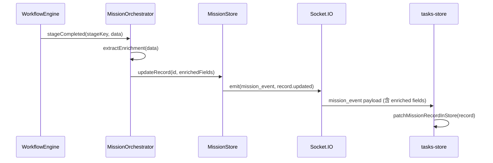

# 设计文档: Workflow 寄生依赖解耦

## 概述

本设计将 tasks-store.ts 和任务驾驶舱组件从"Mission + Workflow 双源"模式迁移为 Mission 原生单源模式。核心变更分四个阶段：

1. **盘点阶段** — 精确记录所有寄生依赖点，输出 inventory.md
2. **数据补齐阶段** — 在 MissionRecord 上新增 organization、workPackages、messageLog、agentCrew 可选字段，由 MissionOrchestrator 在工作流阶段完成时填充
3. **切换阶段** — 通过 `useMissionNativeData` 特性开关，让 tasks-store 的 summary/detail 构建函数从 MissionRecord 原生字段读取数据
4. **清除阶段** — 移除 workflow 补充层代码、imports、Socket 监听，验证架构边界

本 spec 与 `mission-native-projection` spec 有重叠：后者负责 `/api/planets` 路由实现和 mission-client 迁移，本 spec 聚焦于 tasks-store 内部的 workflow 依赖清除。两者的 MissionRecord 数据丰富化（需求 2）是共享工作，应协调实施。

## 架构

### 当前架构（解耦前）

```mermaid
graph TD
    UI[任务驾驶舱 UI] --> TS[tasks-store.ts]
    TS --> MC[mission-client.ts]
    TS --> WS[workflow-store.ts]
    TS -->|workflow_* events| SOCK_W[Workflow Socket]
    TS -->|mission_event| SOCK_M[Mission Socket]
    MC --> API_T[/api/tasks]
    WS --> API_W[/api/workflows]
    API_T --> MS[MissionStore]
    API_W --> DB[(Workflow DB)]
    
    subgraph "寄生依赖（待移除）"
        WS
        SOCK_W
        API_W
        DB
    end
```

### 目标架构（解耦后）

```mermaid
graph TD
    UI[任务驾驶舱 UI] --> TS[tasks-store.ts]
    TS --> MC[mission-client.ts]
    TS -->|mission_event| SOCK_M[Mission Socket]
    MC --> API_T[/api/tasks]
    MC --> API_P[/api/planets]
    API_T --> MS[MissionStore]
    API_P --> MS
    
    WS[workflow-store.ts] --> WP[WorkflowPanel.tsx]
    WS -->|workflow_* events| SOCK_W[Workflow Socket]
    
    note1[tasks-store 与 workflow-store 零交叉]
```

### 数据丰富化流程



## 组件与接口

### 1. 依赖盘点工具（inventory.md）

盘点以手动审查 + grep 辅助方式进行，输出结构化 markdown 表格：

```markdown
| 文件 | 行号 | 依赖类型 | 访问的数据字段 | UI 用途 | Mission 原生替代 |
|------|------|----------|---------------|---------|-----------------|
| tasks-store.ts | 42 | import | useWorkflowStore | 获取 workflow detail | MissionRecord enriched fields |
| ... | ... | ... | ... | ... | ... |
```

分类维度：
- **import 依赖** — tasks-store.ts 对 workflow-store 的 import 语句
- **组件引用** — TaskDetailView/TaskPlanetInterior/task-helpers 中的 workflow 数据读取
- **Socket 监听** — tasks 相关代码中的 workflow_* 事件监听
- **类型交叉** — shared/mission/ 对 shared/workflow-runtime.ts 的类型依赖

### 2. MissionRecord 扩展字段（shared/mission/contracts.ts）

在 MissionRecord 接口中新增四个可选字段：

```typescript
// 新增类型定义
interface MissionOrganizationSnapshot {
  departments: Array<{
    key: string;
    label: string;
    managerName?: string;
  }>;
  agentCount: number;
}

interface MissionWorkPackage {
  id: string;
  workerId: string;
  description: string;
  deliverable?: string;
  status: 'pending' | 'running' | 'passed' | 'failed' | 'verified';
  score?: number;
  feedback?: string;
  stageKey?: string;
}

interface MissionMessageLogEntry {
  sender: string;
  content: string;
  time: number;
  stageKey?: string;
}

interface MissionAgentCrewMember {
  id: string;
  name: string;
  role: 'ceo' | 'manager' | 'worker';
  department?: string;
  status: 'idle' | 'working' | 'thinking' | 'done' | 'error';
}

// 扩展 MissionRecord
interface MissionRecord {
  // ... 现有字段保持不变 ...
  organization?: MissionOrganizationSnapshot;
  workPackages?: MissionWorkPackage[];
  messageLog?: MissionMessageLogEntry[];
  agentCrew?: MissionAgentCrewMember[];
}
```

设计决策：
- 所有新字段均为 `optional`，确保向后兼容
- `MissionOrganizationSnapshot` 是 `WorkflowOrganizationSnapshot` 的精简版，只保留 UI 所需的部门列表和 agent 计数，避免引入 workflow 类型依赖
- `MissionWorkPackage` 对应 workflow 的 `TaskRecord`，但使用 mission 域的命名和精简字段
- `MissionMessageLogEntry` 只保留最近消息摘要，不存储完整消息历史

### 3. MissionOrchestrator 丰富化钩子（server/core/mission-orchestrator.ts）

在 MissionOrchestrator 中新增 `enrichMissionFromWorkflow()` 方法：

```typescript
class MissionOrchestrator {
  // 在工作流阶段完成回调中调用
  private enrichMissionFromWorkflow(
    missionId: string,
    workflowId: string,
    completedStage: string
  ): void {
    const workflow = this.runtime.workflowRepo.getWorkflow(workflowId);
    if (!workflow) return;

    const updates: Partial<MissionRecord> = {};

    // planning 阶段完成后：填充 organization 和 agentCrew
    if (completedStage === 'planning' || completedStage === 'direction') {
      updates.organization = this.extractOrganization(workflowId);
      updates.agentCrew = this.extractAgentCrew(workflowId);
    }

    // execution/review 阶段完成后：填充 workPackages
    if (['execution', 'review', 'revision', 'verify'].includes(completedStage)) {
      updates.workPackages = this.extractWorkPackages(workflowId);
    }

    // 每个阶段完成后：更新 messageLog（最近 50 条）
    updates.messageLog = this.extractMessageLog(workflowId, 50);

    this.missionStore.update(missionId, updates);
    // Socket 广播由 missionStore.update 内部触发
  }

  private extractOrganization(workflowId: string): MissionOrganizationSnapshot {
    // 从 workflow 的 organization snapshot 提取精简版
    // ...
  }

  private extractAgentCrew(workflowId: string): MissionAgentCrewMember[] {
    // 从 agentDirectory 提取参与 agent 列表
    // ...
  }

  private extractWorkPackages(workflowId: string): MissionWorkPackage[] {
    // 从 workflow tasks 转换为 MissionWorkPackage
    // ...
  }

  private extractMessageLog(workflowId: string, limit: number): MissionMessageLogEntry[] {
    // 从 workflow messages 提取最近 N 条摘要
    // ...
  }
}
```

### 4. tasks-store 特性开关与原生构建函数

```typescript
// tasks-store.ts 顶部
const useMissionNativeData = false; // 验证通过后翻转为 true

// 原生 summary 构建（不依赖 workflow-store）
function buildNativeSummaryRecord(mission: MissionRecord): MissionTaskSummary {
  return {
    id: mission.id,
    title: mission.title,
    status: mission.status,
    progress: mission.progress,
    kind: mission.kind,
    currentStageKey: mission.currentStageKey ?? null,
    currentStageLabel: mission.stages.find(s => s.key === mission.currentStageKey)?.label ?? null,
    departmentLabels: mission.organization?.departments.map(d => d.label) ?? [],
    taskCount: mission.workPackages?.length ?? 0,
    completedTaskCount: mission.workPackages?.filter(
      wp => wp.status === 'passed' || wp.status === 'verified'
    ).length ?? 0,
    messageCount: mission.messageLog?.length ?? 0,
    activeAgentCount: mission.agentCrew?.filter(
      a => a.status === 'working' || a.status === 'thinking'
    ).length ?? 0,
    summary: mission.summary ?? null,
    waitingFor: mission.waitingFor ?? null,
    createdAt: mission.createdAt,
    updatedAt: mission.updatedAt,
    completedAt: mission.completedAt ?? null,
    // ... 其他字段
  };
}

// 原生 detail 构建（不依赖 workflow-store）
function buildNativeDetailRecord(mission: MissionRecord): MissionTaskDetail {
  return {
    ...buildNativeSummaryRecord(mission),
    stages: buildMissionInteriorStages(mission),
    agents: buildNativeInteriorAgents(mission),
    timeline: buildMissionTimeline(mission),
    artifacts: buildMissionArtifacts(mission),
    decisionPresets: buildMissionDecisionPresets(mission),
    instanceInfo: buildMissionInstanceInfo(mission),
    logSummary: buildNativeLogSummary(mission),
    // ... 其他字段
  };
}

// 原生 agent 构建（从 agentCrew 而非 workflow agents）
function buildNativeInteriorAgents(mission: MissionRecord): TaskInteriorAgent[] {
  const agents: TaskInteriorAgent[] = [];
  
  if (mission.agentCrew) {
    for (const member of mission.agentCrew) {
      agents.push({
        id: member.id,
        name: member.name,
        role: member.role,
        department: member.department ?? '',
        status: member.status,
        stageKey: mission.currentStageKey ?? 'receive',
        stageLabel: mission.stages.find(s => s.key === mission.currentStageKey)?.label ?? '',
        progress: undefined,
        currentAction: undefined,
        angle: 0,
      });
    }
  }

  // 始终包含 mission-core agent
  agents.push({
    id: 'mission-core',
    name: 'Mission Core',
    role: 'orchestrator',
    status: inferMissionCoreAgentStatus(mission.status),
    stageKey: mission.currentStageKey ?? 'receive',
    stageLabel: mission.stages.find(s => s.key === mission.currentStageKey)?.label ?? 'Receive',
    angle: 0,
  });

  return withAgentAngles(agents, buildMissionInteriorStages(mission));
}

// 原生 log summary 构建（从 messageLog 而非 workflow messages）
function buildNativeLogSummary(mission: MissionRecord): string[] {
  if (!mission.messageLog?.length) return [];
  return mission.messageLog.slice(-10).map(
    entry => `[${entry.sender}] ${entry.content}`
  );
}
```

### 5. hydrateTaskData 分支逻辑

```typescript
async function hydrateTaskData(options?: { preferredTaskId?: string | null }) {
  if (useMissionNativeData) {
    await hydrateNativeTaskData(options);
  } else {
    await hydrateTaskDataLegacy(options); // 现有逻辑重命名
  }
}

async function hydrateNativeTaskData(options?: { preferredTaskId?: string | null }) {
  // 1. 调用 listMissions() 获取 MissionRecord[]
  // 2. 对每个 mission 调用 buildNativeSummaryRecord()
  // 3. 如果有 selectedTaskId，调用 getMission(id) 获取完整 record
  // 4. 调用 buildNativeDetailRecord() 构建详情
  // 5. 不调用 workflow-store 的任何方法
}
```

### 6. 清除阶段

清除阶段在 `useMissionNativeData` 永久设为 true 后执行：

- 删除 `import { useWorkflowStore } from "./workflow-store"` 及所有 workflow-store 引用
- 删除所有 `WorkflowDetailRecord`、`WorkflowTaskRecord`、`WorkflowMessageRecord` 等类型定义
- 删除 `syntheticWorkflowFromMission()`、`findSupplementalWorkflow()`、`loadMissionSupplementMap()` 等桥接函数
- 删除 `buildSummaryRecord()`（workflow 版）、`buildDetailRecord()`（workflow 版）等旧构建函数
- 删除 `loadWorkflowDetailRecord()`、`hydrateWorkflowTaskData()` 等 workflow 数据加载函数
- 将 `buildNativeSummaryRecord` 重命名为 `buildSummaryRecord`
- 将 `buildNativeDetailRecord` 重命名为 `buildDetailRecord`
- 删除 `useMissionNativeData` 常量
- 验证 shared/mission/ 目录无 workflow-runtime.ts 或 workflow-kernel.ts 的 import

## 数据模型

### MissionRecord 扩展字段

| 字段 | 类型 | 来源 | 填充时机 |
|------|------|------|----------|
| organization | MissionOrganizationSnapshot? | WorkflowOrganizationSnapshot 精简 | planning 阶段完成后 |
| workPackages | MissionWorkPackage[]? | TaskRecord[] 转换 | execution/review/revision/verify 阶段完成后 |
| messageLog | MissionMessageLogEntry[]? | MessageRecord[] 摘要 | 每个阶段完成后（最近 50 条） |
| agentCrew | MissionAgentCrewMember[]? | AgentDirectory 快照 | planning 阶段完成后 |

### MissionTaskSummary 字段来源对比

| 字段 | Workflow 补充层来源 | Mission 原生来源 |
|------|-------------------|-----------------|
| departmentLabels | workflow organization snapshot | mission.organization.departments |
| taskCount | workflow tasks.length | mission.workPackages.length |
| completedTaskCount | workflow tasks.filter(passed) | mission.workPackages.filter(passed/verified) |
| messageCount | workflow messages.length | mission.messageLog.length |
| activeAgentCount | workflow agent directory | mission.agentCrew.filter(working/thinking) |

### MissionTaskDetail 字段来源对比

| 字段 | Workflow 补充层来源 | Mission 原生来源 |
|------|-------------------|-----------------|
| agents | workflow agentDirectory + tasks | mission.agentCrew + workPackages |
| logSummary | workflow messages | mission.messageLog |
| artifacts (reports) | workflow report paths | mission.artifacts |
| stages | mission.stages (已原生) | mission.stages (不变) |
| timeline | mission.events (已原生) | mission.events (不变) |

## 正确性属性

*正确性属性是在系统所有有效执行中都应成立的特征或行为——本质上是关于系统应该做什么的形式化陈述。属性是人类可读规范与机器可验证正确性保证之间的桥梁。*

### Property 1: MissionRecord 丰富化字段向后兼容

*For any* MissionRecord, the record SHALL be valid regardless of which combination of enrichment fields (organization, workPackages, messageLog, agentCrew) are present or absent. A MissionRecord with none of the new fields SHALL be indistinguishable in behavior from the pre-migration format.

**Validates: Requirements 2.1, 2.2, 2.3, 2.4, 2.7**

### Property 2: 阶段完成丰富化完整性

*For any* workflow stage completion event with associated organization, tasks, and messages data, when the MissionOrchestrator processes the stage completion, the resulting MissionRecord SHALL contain: (a) organization field populated if the completed stage is 'planning' or 'direction', (b) workPackages field populated if the completed stage is 'execution', 'review', 'revision', or 'verify', (c) messageLog field always populated with the most recent messages (up to 50).

**Validates: Requirements 2.5, 2.6**

### Property 3: 原生 Summary 构建完整性

*For any* MissionRecord with populated enrichment fields (organization, workPackages, messageLog, agentCrew), the native summary builder SHALL produce a valid MissionTaskSummary where: (a) departmentLabels derives from organization.departments, (b) taskCount equals workPackages.length, (c) completedTaskCount equals workPackages filtered by 'passed' or 'verified' status, (d) messageCount equals messageLog.length, (e) activeAgentCount equals agentCrew filtered by 'working' or 'thinking' status.

**Validates: Requirements 3.2**

### Property 4: 原生 Detail 构建完整性

*For any* MissionRecord with populated enrichment fields, the native detail builder SHALL produce a valid MissionTaskDetail where: (a) stages array length equals mission.stages.length, (b) agents array contains at least one agent with id 'mission-core', (c) timeline derives from mission.events, (d) logSummary derives from mission.messageLog.

**Validates: Requirements 3.3**

### Property 5: 数据源等价性（变形属性）

*For any* MissionRecord that has a corresponding WorkflowRecord with equivalent data, the MissionTaskSummary produced by the native builder (buildNativeSummaryRecord) SHALL have equivalent field values to the MissionTaskSummary produced by the legacy workflow builder (buildSummaryRecord) for the following fields: status, progress, departmentLabels, taskCount, completedTaskCount, messageCount, activeAgentCount.

**Validates: Requirements 3.7**

## 错误处理

### MissionOrchestrator 丰富化

| 场景 | 处理方式 |
|------|----------|
| workflowId 对应的 workflow 不存在 | 跳过丰富化，MissionRecord 保持现有字段，不报错 |
| extractOrganization 返回空数据 | organization 字段设为 undefined，不影响其他字段 |
| extractWorkPackages 抛出异常 | catch 并 log warn，workPackages 保持上一次值 |
| extractMessageLog 返回空数组 | messageLog 设为空数组 [] |

### tasks-store 原生构建

| 场景 | 处理方式 |
|------|----------|
| mission.organization 为 undefined | departmentLabels 返回空数组 [] |
| mission.workPackages 为 undefined | taskCount/completedTaskCount 返回 0 |
| mission.messageLog 为 undefined | messageCount 返回 0，logSummary 返回空数组 |
| mission.agentCrew 为 undefined | activeAgentCount 返回 0，agents 只包含 mission-core |

### 特性开关回退

| 场景 | 处理方式 |
|------|----------|
| useMissionNativeData = true 但原生数据不完整 | 使用默认值（0、空数组），不回退到 workflow 路径 |
| useMissionNativeData = false | 完全使用现有 workflow 补充层逻辑，不调用原生构建函数 |

## 测试策略

### 单元测试

使用 vitest 框架：

- **MissionRecord 丰富化测试**
  - extractOrganization 正确转换 WorkflowOrganizationSnapshot 为 MissionOrganizationSnapshot
  - extractWorkPackages 正确转换 TaskRecord[] 为 MissionWorkPackage[]
  - extractMessageLog 正确截取最近 N 条消息
  - 丰富化不影响 MissionRecord 现有字段
  - workflow 不存在时丰富化安全跳过

- **原生构建函数测试**
  - buildNativeSummaryRecord 在所有丰富化字段为 undefined 时返回合理默认值
  - buildNativeDetailRecord 始终包含 mission-core agent
  - buildNativeLogSummary 正确截取最近 10 条消息

- **架构边界验证测试**
  - grep 验证 tasks-store.ts 无 workflow-store import（清除阶段后）
  - grep 验证 shared/mission/ 无 workflow-runtime import（清除阶段后）

### 属性测试

使用 fast-check 库，每个属性测试运行至少 100 次迭代。

- **Property 1 测试**: 生成随机 MissionRecord（随机组合有/无 enrichment 字段），验证 record 始终有效
  - Tag: **Feature: workflow-decoupling, Property 1: MissionRecord 丰富化字段向后兼容**

- **Property 2 测试**: 生成随机阶段完成事件（含 organization/tasks/messages 数据），验证丰富化结果符合阶段规则
  - Tag: **Feature: workflow-decoupling, Property 2: 阶段完成丰富化完整性**

- **Property 3 测试**: 生成随机 MissionRecord（含 enrichment 字段），验证 buildNativeSummaryRecord 输出字段正确派生
  - Tag: **Feature: workflow-decoupling, Property 3: 原生 Summary 构建完整性**

- **Property 4 测试**: 生成随机 MissionRecord（含 enrichment 字段），验证 buildNativeDetailRecord 输出结构完整
  - Tag: **Feature: workflow-decoupling, Property 4: 原生 Detail 构建完整性**

- **Property 5 测试**: 生成配对的 MissionRecord + WorkflowRecord（数据等价），验证两条构建路径输出等价
  - Tag: **Feature: workflow-decoupling, Property 5: 数据源等价性**
