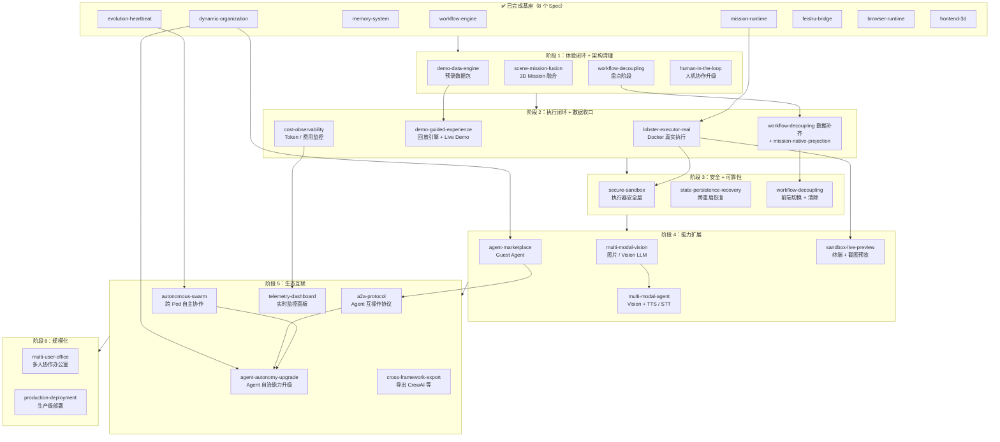
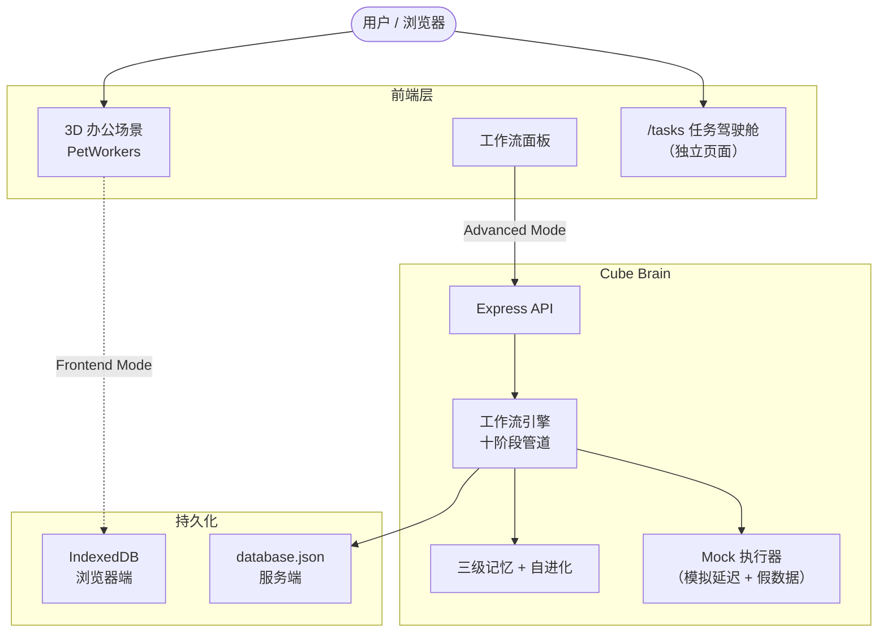
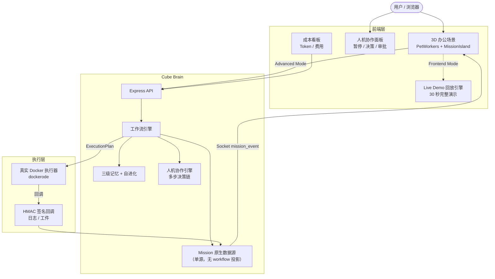
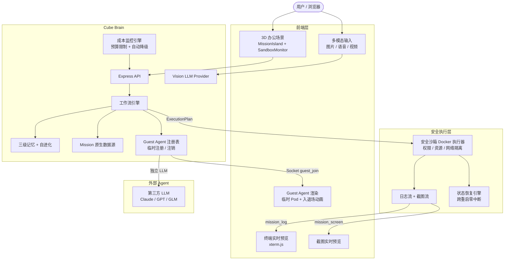
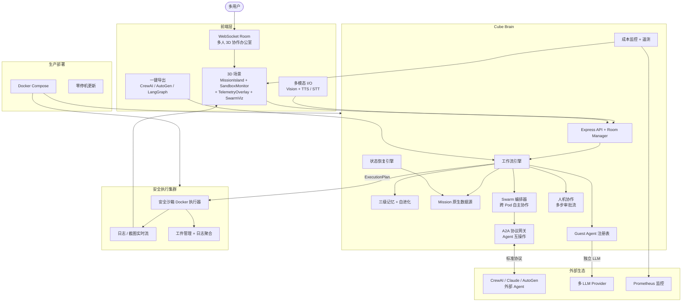

# Spec 执行路线图与架构演化

## 当前状态总览

28 个 Spec，其中 8 个已完成，21 个待开发（含新增 agent-autonomy-upgrade）。

### 已完成（基座层）

| Spec | 提供的能力 |
|------|-----------|
| workflow-engine | 十阶段工作流管道 |
| dynamic-organization | LLM 驱动的动态组织生成 |
| memory-system | 三级记忆（短期/中期/长期） |
| evolution-heartbeat | 自进化引擎 + 心跳调度 |
| mission-runtime | Mission 状态机 + ExecutionPlan + 执行器契约 |
| feishu-bridge | 飞书消息中继 |
| browser-runtime | 纯前端运行时（IndexedDB + Web Worker） |
| frontend-3d | 3D 场景 + 工作流面板 + 任务驾驶舱 |

---

## 依赖关系图

---

## 推荐执行顺序（6 个阶段）

### 阶段 1：体验闭环 + 架构清理（2-3 周）

目标：让用户 30 秒内看到完整流程，同时清理技术债。

| Spec | 类型 | 并行度 | 说明 |
|------|------|--------|------|
| demo-data-engine | 纯前端 | 可并行 | 预录数据包，无外部依赖 |
| scene-mission-fusion | 纯前端 | 可并行 | 3D 场景内嵌 Mission 状态 |
| workflow-decoupling (盘点) | 分析 | 可并行 | 摸清 workflow 寄生依赖点 |
| human-in-the-loop | 跨前后端 | 可并行 | 升级现有 decision 机制 |

产出：
- Live Demo 数据包就绪
- 3D 场景信息密度提升（不再需要跳转 /tasks）
- workflow 依赖清单完成
- 人机协作界面升级

### 阶段 2：执行闭环 + 数据收口（2-3 周）

目标：真实 Docker 执行 + Mission 原生数据源统一。

| Spec | 类型 | 依赖 | 说明 |
|------|------|------|------|
| lobster-executor-real | 后端 | mission-runtime | Docker 真实容器执行 |
| demo-guided-experience | 纯前端 | demo-data-engine | 回放引擎 + Live Demo 入口 |
| workflow-decoupling (数据补齐) + mission-native-projection (后端) | 跨前后端 | 盘点完成 | MissionRecord 丰富化 + /api/planets |
| cost-observability | 跨前后端 | 无 | Token/费用监控（LLM 调用层埋点） |

产出：
- 指令 → 真实 Docker 执行 → 产物回传 完整闭环
- Live Demo 可用
- Mission 数据通道补齐
- LLM 成本可见

### 阶段 3：安全 + 可靠性（1-2 周）

目标：生产级安全和可靠性保障。

| Spec | 类型 | 依赖 | 说明 |
|------|------|------|------|
| secure-sandbox | 后端 | lobster-executor-real | 执行器安全层（权限/资源/网络隔离） |
| state-persistence-recovery | 跨前后端 | 无 | 跨重启/崩溃自动恢复 |
| workflow-decoupling (前端切换+清除) | 纯前端 | 数据补齐完成 | tasks-store 瘦身 30%+ |

产出：
- 执行器安全可控
- 长任务零中断
- tasks-store 从 2800+ 行降到 ~1800 行

### 阶段 4：能力扩展（2-3 周）

目标：Agent 能力从"文本"扩展到"多模态 + 外部协作"。

| Spec | 类型 | 依赖 | 说明 |
|------|------|------|------|
| multi-modal-vision | 跨前后端 | 无 | 图片/截图 Vision LLM 分析 |
| multi-modal-agent | 跨前后端 | multi-modal-vision | Vision + TTS/STT，宠物"能看能说" |
| agent-marketplace | 跨前后端 | dynamic-organization | Guest Agent 临时加入办公室 |
| sandbox-live-preview | 跨前后端 | lobster-executor-real | 3D 场景内终端 + 截图预览 |

产出：
- Agent 能处理图片/语音
- 外部 Agent 可临时加入协作
- 执行过程实时可视

### 阶段 5：生态互联（2-3 周）

目标：从封闭系统走向开放生态。

| Spec | 类型 | 依赖 | 说明 |
|------|------|------|------|
| autonomous-swarm | 后端 | evolution-heartbeat | 跨 Pod 自主协作 |
| a2a-protocol | 跨前后端 | agent-marketplace | Agent 互操作标准协议 |
| agent-autonomy-upgrade | 跨前后端 | autonomous-swarm, a2a-protocol, dynamic-organization | Agent 自治能力升级（自评估/竞争执行/动态协作） |
| cross-framework-export | 跨前后端 | workflow-engine | 导出为 CrewAI/AutoGen/LangGraph |
| telemetry-dashboard | 跨前后端 | cost-observability | 3D 场景实时监控面板 |

产出：
- Pod 之间自主发起子任务
- 与 CrewAI/Claude 等外部 Agent 互操作
- Agent 自评估、竞争执行、动态协作网络
- 一键导出到其他框架
- 全局监控看板

### 阶段 6：规模化（2-3 周）

目标：从单用户演示走向多人生产环境。

| Spec | 类型 | 依赖 | 说明 |
|------|------|------|------|
| multi-user-office | 跨前后端 | 大部分基座 | 多人同时进入办公室 |
| production-deployment | DevOps | 大部分基座 | Docker Compose + Prometheus + 零停机 |

产出：
- 多人协作办公室
- 一键生产部署

---

## 架构演化路径

### 当前架构（Phase 0）

特征：演示原型，mock 执行，双轨数据源（workflow + mission），单用户。

### 阶段 1-2 后架构

特征：真实执行闭环，单源数据，人机协作，30 秒 Demo，成本可见。

### 阶段 3-4 后架构

特征：安全执行，多模态，外部 Agent 加入，成本可控，状态可恢复。

### 阶段 5-6 后架构（目标态）

特征：多人协作，自主 Agent 社会，跨框架互操作，生产级部署，全局可观测。

---

## 关键协调点

| 协调点 | 涉及 Spec | 说明 |
|--------|-----------|------|
| MissionRecord 丰富化 | workflow-decoupling + mission-native-projection | 同一件事，只做一次 |
| 执行器安全 | lobster-executor-real → secure-sandbox | 先有真实执行器，再加安全层 |
| 多模态 | multi-modal-vision → multi-modal-agent | vision 是 agent 多模态的前置 |
| 外部 Agent | agent-marketplace → a2a-protocol | 先有 Guest Agent，再有标准协议 |
| 监控 | cost-observability → telemetry-dashboard | 先有成本埋点，再有全局面板 |
| 3D 场景扩展 | scene-mission-fusion → sandbox-live-preview | 共享 Html 桥接模式 |
| 数据源 | workflow-decoupling → 所有前端 spec | 解耦完成后前端代码更干净 |
| Agent 自治能力 | autonomous-swarm + a2a-protocol + dynamic-organization → agent-autonomy-upgrade | 自治能力升级依赖 Swarm 编排、A2A 协议和动态组织生成 |

## 风险提示

- lobster-executor-real 是最大的单点风险：sandbox-live-preview、secure-sandbox、production-deployment 都依赖它
- workflow-decoupling 的盘点阶段必须在任何前端 spec 之前完成，否则新代码可能引入新的 workflow 依赖
- multi-user-office 是复杂度最高的 spec，建议放到最后，等其他能力稳定后再做
