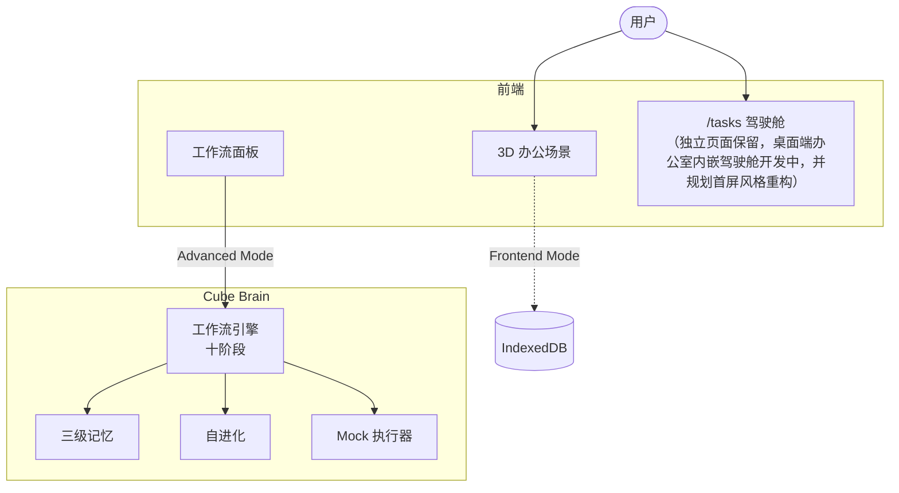
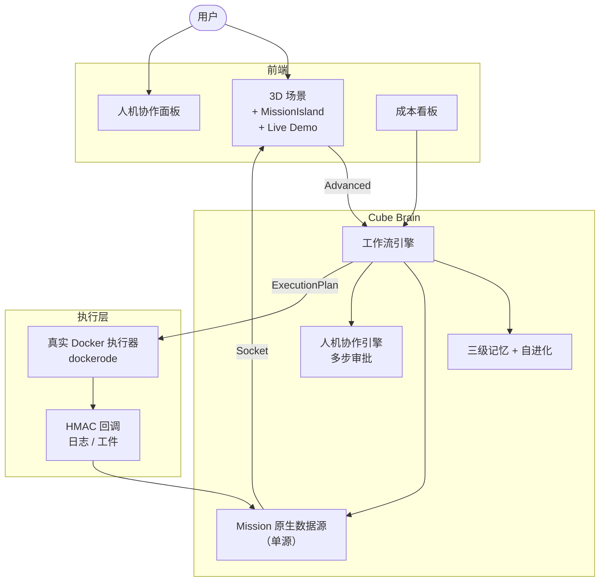
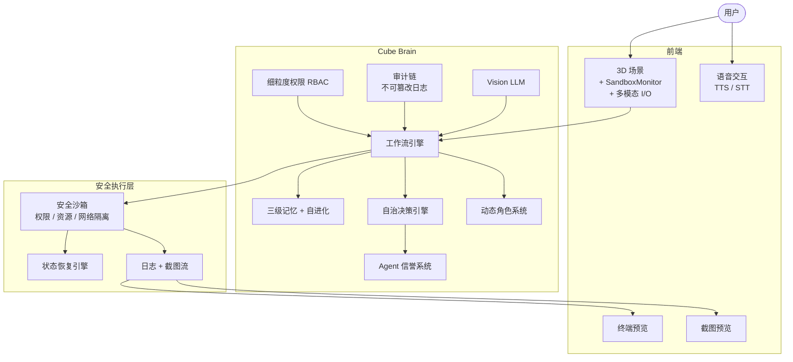
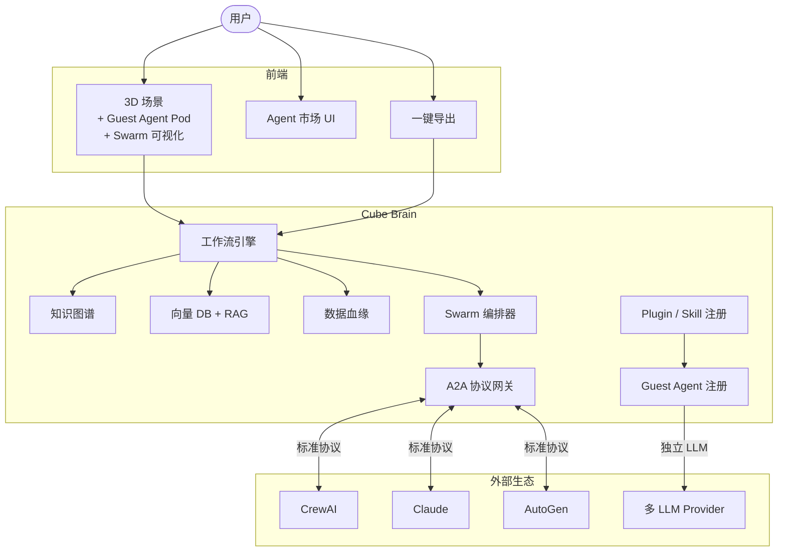
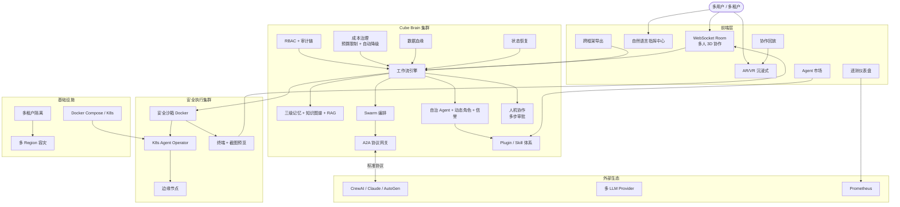

# Spec 执行路线图与架构演化

## 当前状态总览

本文件创建于 46 个 Spec 阶段；截至 2026-04-13，`.kiro/specs` 已扩展为 65 个目录。下文保留路线图创建时的阶段划分与历史统计口径，用于追溯依赖关系；其中 `workflow-artifacts-display` 已完成功能开发，当前仅剩最终检查点待验收。按领域分为 8 个大类的主路线仍然成立，但当前实现范围已经超过本路线图创建时的口径。

### 已完成基座（8 个）

| Spec                 | 能力                                        |
| -------------------- | ------------------------------------------- |
| workflow-engine      | 十阶段工作流管道                            |
| dynamic-organization | LLM 驱动的动态组织生成                      |
| memory-system        | 三级记忆（短期/中期/长期）                  |
| evolution-heartbeat  | 自进化引擎 + 心跳调度                       |
| mission-runtime      | Mission 状态机 + ExecutionPlan + 执行器契约 |
| feishu-bridge        | 飞书消息中继                                |
| browser-runtime      | 纯前端运行时（IndexedDB + Web Worker）      |
| frontend-3d          | 3D 场景 + 工作流面板 + 任务驾驶舱           |

### 后续新增 / 补充 Spec（13 个）

| Spec                         | 状态         | 简述                                       |
| ---------------------------- | ------------ | ------------------------------------------ |
| ai-enabled-sandbox           | 已完成       | Docker 容器 AI 能力注入                    |
| executor-integration         | 已完成       | WorkflowEngine ↔ Docker 执行桥接           |
| holographic-ui               | 已完成       | 全息 UI 收口                               |
| workflow-artifacts-display   | 待最终检查点 | 工作流产物展示与下载（功能开发已完成）     |
| mission-cancel-control       | 已完成       | 任务取消端到端闭环                         |
| mission-operator-actions     | 已完成       | 任务状态操作栏与动作模型                   |
| task-detail-operations-first | 已完成       | 任务详情页首屏重排                         |
| execution-language-refresh   | 未开始       | 文案从方案叙事收敛到执行协作               |
| mission-ui-polish            | 未开始       | 任务控制台 UI 收尾打磨                     |
| office-task-cockpit          | 开发中       | 办公室成为默认执行壳，桌面端内嵌任务驾驶舱 |
| office-cockpit-first-screen-refresh | 规划中 | 办公室驾驶舱首屏风格重构，收敛主次关系与信息密度 |
| i18n-cleanup                 | 未开始       | 前端国际化与文案清理                       |
| frontend-demo-mode           | 待补任务     | spec 目录已存在，但尚未形成 `tasks.md`     |

### 维护说明

下文的 8 个阶段划分保留为原始路线图，用于追溯依赖和架构演化路径；其中“待开发 38 个”的表格是路线图创建时的历史视角，不再代表当前仓库的实时完成度。

### 当前近端补完插队项（2026-04-10）

这 5 个 spec 属于现有任务驾驶舱与详情页的产品收口，不改变原 8 阶段主路线，只是把“执行结果展示”继续补齐为“执行控制台”。

| 优先级 | Spec                         | 依赖                                              | 目标                                             |
| ------ | ---------------------------- | ------------------------------------------------- | ------------------------------------------------ |
| P0     | mission-cancel-control       | workflow-artifacts-display / executor-integration | 打通取消入口、执行器中断、状态落库与 UI 反馈     |
| P0     | mission-operator-actions     | mission-cancel-control                            | 补齐暂停 / 恢复 / 重试 / 标记阻塞 / 终止         |
| P1     | task-detail-operations-first | mission-operator-actions                          | 首屏前置主操作、负责人、blocker、下一步          |
| P1     | execution-language-refresh   | 无硬依赖，可与上项并行                            | 文案从“动态组队/方案感”收口到“执行/交付/协作”    |
| P2     | mission-ui-polish            | 前 4 项基本稳定后                                 | 统一反馈时机、按钮层级、状态可见性、空态与错误态 |

### 当前近端工作台主线延伸（2026-04-13）

- `office-task-cockpit` 已进入开发中，不是新增业务域，而是把既有任务、workflow、scene 三条体验主线收口到办公室。
- 桌面端办公室主壳、三栏驾驶舱与右侧上下文 tab 基础已落地，`/tasks` 继续保留为全屏工作台与深链页。
- V1 继续采用“统一入口、双通道发起、桌面优先”的策略推进。

### 当前近端桌面体验收口（2026-04-13）

- `office-cockpit-first-screen-refresh` 不是新增业务域，而是 `office-task-cockpit` 的后续桌面首屏体验收口项。
- 目标是在不削减任务、workflow、Agent、记忆、历史与主操作能力的前提下，把办公室首屏从多块同级卡片并列收敛为单主轴驾驶舱。
- V1 继续采用“Scene3D 主视觉、统一驾驶台、右侧任务优先详情、移动端保守兼容”的策略推进。

### 历史待开发清单（路线图创建时，38 个）

| 领域                | Spec                           | 简述                              |
| ------------------- | ------------------------------ | --------------------------------- |
| **A. 体验与演示**   | demo-data-engine               | 预录演示数据包                    |
|                     | demo-guided-experience         | 回放引擎 + Live Demo              |
|                     | scene-mission-fusion           | 3D 场景内嵌 Mission 状态          |
|                     | collaboration-replay           | 协作过程回放系统                  |
|                     | nl-command-center              | 自然语言指挥中心                  |
|                     | vr-extension                   | AR/VR 扩展                        |
| **B. 执行与安全**   | lobster-executor-real          | Docker 真实容器执行               |
|                     | secure-sandbox                 | 执行器安全沙箱                    |
|                     | sandbox-live-preview           | 终端 + 截图实时预览               |
|                     | state-persistence-recovery     | 跨重启/崩溃恢复                   |
| **C. 数据架构**     | workflow-decoupling            | Workflow 寄生依赖解耦             |
|                     | mission-native-projection      | Mission 原生数据源 + /api/planets |
|                     | data-lineage-tracking          | 数据血缘追踪                      |
|                     | knowledge-graph                | 知识图谱集成                      |
|                     | vector-db-rag-pipeline         | 向量数据库 + RAG 管道             |
| **D. Agent 能力**   | agent-autonomy-upgrade         | Agent 自治能力升级                |
|                     | dynamic-role-system            | 动态角色系统                      |
|                     | agent-reputation               | Agent 信誉系统                    |
|                     | multi-modal-vision             | 图片/Vision LLM                   |
|                     | multi-modal-agent              | Vision + TTS/STT                  |
|                     | human-in-the-loop              | 人机协作升级                      |
| **E. 生态互联**     | agent-marketplace              | Guest Agent 临时加入              |
|                     | agent-marketplace-platform     | Agent 市场平台                    |
|                     | a2a-protocol                   | Agent 互操作协议                  |
|                     | cross-framework-export         | 导出 CrewAI/AutoGen/LangGraph     |
|                     | autonomous-swarm               | 跨 Pod 自主协作                   |
|                     | plugin-skill-system            | Plugin/Skill 体系                 |
| **F. 治理与合规**   | cost-observability             | Token/费用监控                    |
|                     | cost-governance-strategy       | 成本治理策略                      |
|                     | agent-permission-model         | 细粒度权限模型                    |
|                     | audit-chain                    | 审计链/不可篡改日志               |
|                     | telemetry-dashboard            | 实时遥测仪表盘                    |
| **G. 多用户与租户** | multi-user-office              | 多人协作办公室                    |
|                     | multi-tenant-architecture      | 多租户架构                        |
| **H. 部署与运维**   | production-deployment          | Docker Compose 生产部署           |
|                     | k8s-agent-operator             | K8s 编排                          |
|                     | edge-brain-deployment          | 边缘部署                          |
|                     | multi-region-disaster-recovery | 多 Region 容灾                    |

---

## 全局依赖关系图

```mermaid
flowchart TB
  subgraph F0["✅ 已完成基座"]
    WE[workflow-engine]
    DO[dynamic-organization]
    MS[memory-system]
    EH[evolution-heartbeat]
    MR[mission-runtime]
    FB[feishu-bridge]
    BR[browser-runtime]
    F3[frontend-3d]
  end

  subgraph P1["Phase 1 · 体验闭环"]
    DDE[demo-data-engine]
    SMF[scene-mission-fusion]
    WD[workflow-decoupling]
    HITL[human-in-the-loop]
  end

  subgraph P2["Phase 2 · 执行闭环"]
    LER[lobster-executor-real]
    DGE[demo-guided-experience]
    MNP[mission-native-projection]
    CO[cost-observability]
  end

  subgraph P3["Phase 3 · 安全与可靠"]
    SS[secure-sandbox]
    SPR[state-persistence-recovery]
    APM[agent-permission-model]
    AC[audit-chain]
  end

  subgraph P4["Phase 4 · Agent 进化"]
    AAU[agent-autonomy-upgrade]
    DRS[dynamic-role-system]
    AR[agent-reputation]
    MMV[multi-modal-vision]
    MMA[multi-modal-agent]
  end

  subgraph P5["Phase 5 · 知识与数据"]
    KG[knowledge-graph]
    VDR[vector-db-rag-pipeline]
    DLT[data-lineage-tracking]
  end

  subgraph P6["Phase 6 · 生态互联"]
    AM[agent-marketplace]
    AMP[agent-marketplace-platform]
    A2A[a2a-protocol]
    CFE[cross-framework-export]
    AS[autonomous-swarm]
    PSS[plugin-skill-system]
  end

  subgraph P7["Phase 7 · 治理与可观测"]
    CGS[cost-governance-strategy]
    TD[telemetry-dashboard]
    NLC[nl-command-center]
    CR[collaboration-replay]
  end

  subgraph P8["Phase 8 · 规模化"]
    MUO[multi-user-office]
    MTA[multi-tenant-architecture]
    PD[production-deployment]
    K8S[k8s-agent-operator]
    ED[edge-brain-deployment]
    MRD[multi-region-disaster-recovery]
    VR[vr-extension]
  end

  %% Phase 0 → Phase 1
  F0 --> P1

  %% Phase 1 内部 + → Phase 2
  DDE --> DGE
  WD --> MNP
  MR --> LER

  %% Phase 2 → Phase 3
  LER --> SS
  LER --> SPR

  %% Phase 3 → Phase 4
  DO --> AAU
  DO --> DRS
  EH --> AR
  APM --> AR

  %% Phase 4 → Phase 5
  MS --> KG
  MS --> VDR
  MMV --> MMA

  %% Phase 5 → Phase 6
  AAU --> AM
  AM --> AMP
  AM --> A2A
  EH --> AS
  PSS --> AMP

  %% Phase 6 → Phase 7
  CO --> CGS
  CO --> TD
  AC --> TD
  DLT --> TD

  %% Phase 7 → Phase 8
  MUO --> MTA
  PD --> K8S
  K8S --> ED
  K8S --> MRD
  MTA --> MRD
  CR --> VR
```

---

## 推荐执行顺序（8 个阶段）

### Phase 1：体验闭环 + 架构清理（2-3 周）

目标：30 秒 Demo + 清理技术债 + 人机协作。

| Spec                 | 类型        | 说明                          |
| -------------------- | ----------- | ----------------------------- |
| demo-data-engine     | 纯前端      | 预录数据包                    |
| scene-mission-fusion | 纯前端      | 3D 内嵌 Mission               |
| workflow-decoupling  | 分析+前后端 | 盘点 → 数据补齐 → 切换 → 清除 |
| human-in-the-loop    | 跨前后端    | 升级 decision 为通用审批流    |

### Phase 2：执行闭环 + 数据收口（2-3 周）

目标：真实 Docker 执行 + Mission 单源 + 成本可见。

| Spec                      | 依赖                | 说明                      |
| ------------------------- | ------------------- | ------------------------- |
| lobster-executor-real     | mission-runtime     | Docker 真实容器           |
| demo-guided-experience    | demo-data-engine    | 回放引擎 + Live Demo      |
| mission-native-projection | workflow-decoupling | /api/planets + 前端迁移   |
| cost-observability        | 无                  | LLM 调用层 Token/费用埋点 |

### Phase 3：安全与可靠性（2 周）

目标：生产级安全 + 零中断 + 权限 + 审计。

| Spec                       | 依赖                  | 说明               |
| -------------------------- | --------------------- | ------------------ |
| secure-sandbox             | lobster-executor-real | 权限/资源/网络隔离 |
| state-persistence-recovery | 无                    | 跨重启/崩溃恢复    |
| agent-permission-model     | 无                    | 细粒度 RBAC        |
| audit-chain                | 无                    | 不可篡改操作日志   |

### Phase 4：Agent 能力进化（2-3 周）

目标：Agent 更聪明、更灵活、能看能说。

| Spec                   | 依赖                 | 说明                 |
| ---------------------- | -------------------- | -------------------- |
| agent-autonomy-upgrade | dynamic-organization | 自主决策 + 目标分解  |
| dynamic-role-system    | dynamic-organization | 运行时角色切换       |
| agent-reputation       | evolution-heartbeat  | 信誉评分 + 信任权重  |
| multi-modal-vision     | 无                   | 图片/截图 Vision LLM |
| multi-modal-agent      | multi-modal-vision   | Vision + TTS/STT     |

### Phase 5：知识与数据增强（2 周）

目标：Agent 拥有结构化知识和精准检索能力。

| Spec                   | 依赖          | 说明                  |
| ---------------------- | ------------- | --------------------- |
| knowledge-graph        | memory-system | 实体/关系图谱         |
| vector-db-rag-pipeline | memory-system | 向量库 + RAG 检索增强 |
| data-lineage-tracking  | 无            | 数据血缘追踪          |

### Phase 6：生态互联（2-3 周）

目标：开放 Agent 生态 + 跨框架互操作。

| Spec                       | 依赖                                    | 说明                          |
| -------------------------- | --------------------------------------- | ----------------------------- |
| agent-marketplace          | agent-autonomy-upgrade                  | Guest Agent 临时加入          |
| agent-marketplace-platform | agent-marketplace + plugin-skill-system | Agent 市场 UI                 |
| a2a-protocol               | agent-marketplace                       | 标准化 Agent 互操作           |
| cross-framework-export     | workflow-engine                         | 导出 CrewAI/AutoGen/LangGraph |
| autonomous-swarm           | evolution-heartbeat                     | 跨 Pod 自主协作               |
| plugin-skill-system        | 无                                      | Plugin/Skill 注册与发现       |

### Phase 7：治理与可观测（2 周）

目标：全局监控 + 成本治理 + 自然语言运维。

| Spec                     | 依赖                             | 说明                |
| ------------------------ | -------------------------------- | ------------------- |
| cost-governance-strategy | cost-observability               | 预算限制 + 自动降级 |
| telemetry-dashboard      | cost-observability + audit-chain | 3D 实时监控面板     |
| nl-command-center        | 无                               | 自然语言运维指挥    |
| collaboration-replay     | 无                               | 协作过程回放        |

### Phase 8：规模化部署（3-4 周）

目标：多人 + 多租户 + K8s + 边缘 + 容灾 + VR。

| Spec                           | 依赖                  | 说明                    |
| ------------------------------ | --------------------- | ----------------------- |
| multi-user-office              | 大部分基座            | 多人 3D 协作            |
| multi-tenant-architecture      | multi-user-office     | 租户隔离                |
| production-deployment          | 大部分基座            | Docker Compose 生产部署 |
| k8s-agent-operator             | production-deployment | K8s 编排                |
| edge-brain-deployment          | k8s-agent-operator    | 边缘节点部署            |
| multi-region-disaster-recovery | k8s + multi-tenant    | 多 Region 容灾          |
| vr-extension                   | collaboration-replay  | AR/VR 沉浸式办公室      |

---

## 架构演化路径

### Phase 0 · 当前架构

特征：演示原型 · mock 执行 · 双轨数据源 · 单用户

---

### Phase 1-2 后 · 执行闭环

特征：真实执行闭环 · 单源数据 · 人机协作 · 30 秒 Demo · 成本可见

---

### Phase 3-4 后 · 安全 + Agent 进化

特征：安全沙箱 · Agent 自治 · 动态角色 · 信誉系统 · 多模态 · 权限审计

---

### Phase 5-6 后 · 知识增强 + 开放生态

特征：知识图谱 + RAG · 数据血缘 · Guest Agent · Swarm 自主协作 · A2A 互操作 · Plugin 体系

---

### Phase 7-8 后 · 目标态（全部 52 个 Spec 完成）

特征：

- 多人 VR 协作办公室
- 自治 Agent 社会（自主决策 + 信誉 + 动态角色）
- 知识图谱 + RAG 增强记忆
- 开放生态（A2A + Plugin + Agent 市场）
- 全链路治理（权限 + 审计 + 成本 + 血缘）
- 自然语言运维 + 协作回放
- K8s + 边缘 + 多 Region 容灾
- 多租户隔离

---

## 关键依赖链

| 依赖链       | 路径                                                                                              | 说明                        |
| ------------ | ------------------------------------------------------------------------------------------------- | --------------------------- |
| 执行链       | mission-runtime → lobster-executor-real → secure-sandbox → k8s-agent-operator → edge/multi-region | 从 mock 到生产级执行集群    |
| 数据链       | workflow-decoupling → mission-native-projection → data-lineage-tracking                           | 从双轨到单源到全链路追踪    |
| Agent 进化链 | dynamic-organization → agent-autonomy → dynamic-role → agent-reputation → autonomous-swarm        | 从固定角色到自治社会        |
| 知识链       | memory-system → knowledge-graph / vector-db-rag                                                   | 从文本记忆到结构化知识      |
| 生态链       | agent-marketplace → agent-marketplace-platform → a2a-protocol                                     | 从 Guest Agent 到开放互操作 |
| 治理链       | cost-observability → cost-governance → telemetry-dashboard                                        | 从可见到可控到可观测        |
| 安全链       | agent-permission-model → audit-chain → secure-sandbox                                             | 从权限到审计到沙箱          |
| 部署链       | production-deployment → k8s → edge → multi-region                                                 | 从单机到全球                |
| 多用户链     | multi-user-office → multi-tenant → multi-region                                                   | 从单人到多租户到容灾        |

## 风险矩阵

| 风险                                  | 影响范围                                                               | 缓解                            |
| ------------------------------------- | ---------------------------------------------------------------------- | ------------------------------- |
| lobster-executor-real 延期            | sandbox-live-preview, secure-sandbox, k8s, edge, multi-region 全部阻塞 | 优先投入，mock 模式保底         |
| workflow-decoupling 不彻底            | 所有前端 spec 可能引入新的 workflow 依赖                               | 盘点阶段必须先完成              |
| multi-region-disaster-recovery 复杂度 | 依赖 k8s + multi-tenant 两条链                                         | 放到最后阶段                    |
| a2a-protocol 标准不成熟               | 互操作可能需要频繁调整                                                 | 先做 agent-marketplace 验证模式 |
| vr-extension 硬件依赖                 | 用户覆盖面窄                                                           | 放到最后，作为锦上添花          |
