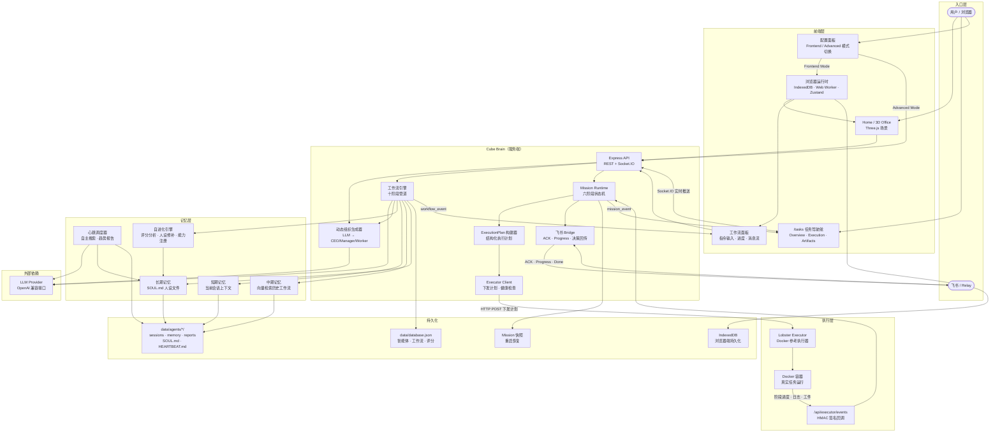

<p align="center">
  
</p>

<h1 align="center">Cube Pets Office</h1>

<p align="center">
  在 3D 办公室里观察 AI 智能体协作——无需任何配置。<br/>
  Watch AI agents collaborate in a 3D office — no setup required.
</p>

<p align="center">
  <a href="https://opencroc.github.io/cube-pets-office/"><strong>👉 在线体验</strong></a>
</p>

<p align="center">
  
  
  
  
</p>

## 这是什么？

Cube Pets Office 是一个开源的多智能体可视化教学平台。

输入一条自然语言指令，系统会自动组建一支 AI 团队——CEO 拆解方向、经理分配任务、Worker 并行执行、互相评审打分、审计修订、最终汇总进化。整个过程在 3D 办公场景中实时呈现。

它不只是生成文档。系统会把任务规划成结构化的执行计划，下发到 Docker 容器中真实运行，页面上展示的是执行状态、运行日志、工件链接和最终结果——而不是一份 Markdown 报告。

不需要 API Key 就能体验可视化和交互流程。接入 LLM + 执行器后可以跑完整的真实任务闭环。

## 你会看到什么


```
你输入: "制定本季度用户增长策略"

系统执行:

  1. 🏢 动态组建      根据任务内容生成 CEO、经理、Worker 团队结构
  2. 📋 CEO 拆解      CEO 将指令分解为各部门方向
  3. 🎯 经理规划      每位经理为下属 Worker 分配具体任务
  4. ⚡ Worker 执行    Worker 并行产出交付物
  5. 📝 经理评审      经理按 4 个维度打分（满分 20），低于 16 分退回修订
  6. 🔍 元审计        独立审计员检查质量与合规性
  7. 🔄 修订          被退回的 Worker 根据反馈修改
  8. ✅ 验证          经理逐条确认反馈是否被回应
  9. 📊 汇总          部门报告汇总为 CEO 级综合报告
  10. 🧬 进化         智能体从评分中学习，自动更新自身人设

3D 办公室实时显示每个智能体的状态——思考中、执行中、评审中、空闲。
```

## 两种使用方式

### 纯体验（不需要 API Key）

打开[在线演示](https://opencroc.github.io/cube-pets-office/)，或者本地运行：

```bash
npm install
npm run dev:frontend
```

你会看到完整的 3D 场景、动态组织可视化、工作流面板和交互界面——全部在浏览器里运行，不需要服务端。

### 接入 LLM（完整模式）

想用真实的 AI 模型跑多智能体工作流：

```bash
cp .env.example .env
# 编辑 .env，填入你的 API Key 和模型配置
npm run dev:all
```

最小 `.env` 配置：

```dotenv
LLM_API_KEY=你的密钥
LLM_BASE_URL=https://api.openai.com/v1
LLM_MODEL=gpt-4o
```

输入一条指令，观察完整的十阶段管道用真实 AI 响应执行。

### 接入执行器（真实任务执行）

在完整模式基础上，启动 Docker 执行器，让任务不只停留在 AI 规划，而是真正跑起来：

```bash
# 终端 1：启动主服务
npm run dev:all

# 终端 2：启动 lobster 执行器
cd services/lobster-executor && npm start
```

系统会把 AI 生成的执行计划下发到执行器，页面上实时展示容器状态、日志和产物。

## 架构总览



### 数据流说明

```
┌─────────────────────────────────────────────────────────────────────┐
│                        两条并行主线                                  │
├─────────────────────────────────────────────────────────────────────┤
│                                                                     │
│  预演主线（Frontend Mode）                                           │
│  用户 → 浏览器运行时 → IndexedDB → 3D 场景 + 工作流面板              │
│  不需要服务端，适合演示和教学                                         │
│                                                                     │
│  执行主线（Advanced Mode）                                           │
│  用户 → Express API → 动态组织 → 十阶段管道 → Mission Runtime        │
│       → ExecutionPlan → Docker 执行器 → 回调 → 任务驾驶舱            │
│  需要 LLM 配置，可选接入执行器和飞书                                  │
│                                                                     │
├─────────────────────────────────────────────────────────────────────┤
│                        Mission 执行链路                              │
├─────────────────────────────────────────────────────────────────────┤
│                                                                     │
│  receive → understand → plan → provision → execute → finalize       │
│     ↑                                         ↓                     │
│     │    ExecutionPlan 结构化计划              │                     │
│     │    ┌─────────────────────┐              │                     │
│     │    │ image / command     │              │                     │
│     │    │ env / mounts        │   HTTP POST  │                     │
│     │    │ timeout / criteria  │ ──────────→  Docker 执行器          │
│     │    └─────────────────────┘              │                     │
│     │                                         │                     │
│     └──── /api/executor/events ◄──────────────┘                     │
│           状态 · 日志 · 工件 · 决策请求                               │
│                    ↓                                                 │
│           /tasks 任务驾驶舱实时展示                                   │
│                                                                     │
└─────────────────────────────────────────────────────────────────────┘
```


### 核心设计思路

- **动态组织** — 每次任务生成不同的团队结构，编程任务和营销策略会得到完全不同的角色配置
- **层级委派** — CEO → 经理 → Worker，消息严格按层级传递，不允许越级
- **20 分评审制** — 每份交付物按准确性、完整性、可操作性、格式四个维度打分，低于 16 分自动退回修订
- **三级记忆** — 短期（当前会话）、中期（向量检索历史工作流）、长期（持续演化的人设文件）
- **自进化** — 每轮工作流结束后，智能体分析自己的弱项维度，自动修补人设定义
- **双运行时** — 同一套工作流引擎可以跑在浏览器里（IndexedDB + Web Worker）或服务端（Express + JSON），不绑定任何一端

## 不只是生成报告

传统的多智能体框架最终产出通常是一份文档或 JSON。Cube Pets Office 多走了一步：

```
指令 → 动态组织 → 结构化执行计划 → Docker 容器真实执行 → 产物回传 → 页面展示
```

系统会把 AI 规划的结果转化为结构化的 `ExecutionPlan`（包含镜像、命令、环境变量、超时、验收标准），下发到远端 Docker 执行器。执行器在容器里跑完任务后，把阶段进度、运行日志、工件文件和最终结果通过回调接口打回来。

页面上你看到的不是一份 Markdown，而是：

- **任务状态** — receive → understand → plan → provision → execute → finalize 六阶段实时推进
- **执行器信息** — 当前容器镜像、命令、工作目录、退出码
- **运行日志** — 执行过程中的逐行日志摘要
- **工件链接** — 执行产出的文件、报告、截图等可下载工件
- **决策入口** — 执行中可以暂停等待人工确认，在页面上直接提交决策恢复执行

任务驾驶舱（`/tasks`）提供 Overview / Execution / Artifacts 三个视图，支持实时 Socket 推送，不需要手动刷新。

## 功能一览

| 功能 | 状态 |
|------|------|
| 3D 办公室 + 智能体实时状态 | ✅ |
| 动态组织生成 | ✅ |
| 十阶段工作流管道 | ✅ |
| 20 分制评审系统 | ✅ |
| 元审计（独立质量检查） | ✅ |
| 三级记忆（短期 / 中期 / 长期） | ✅ |
| 向量检索历史工作流 | ✅ |
| 自进化（人设自动修补） | ✅ |
| 心跳（智能体自主报告） | ✅ |
| 能力注册表 | ✅ |
| Mission 任务状态机 + 六阶段推进 | ✅ |
| 结构化执行计划生成（ExecutionPlan） | ✅ |
| Docker 执行器契约 + 回调接口 | ✅ |
| 任务驾驶舱（实时状态 / 日志 / 工件） | ✅ |
| 执行中暂停 + 人工决策恢复 | ✅ |
| 纯浏览器模式（不需要服务端） | ✅ |
| 服务端模式（完整 LLM 执行） | ✅ |
| 中英文切换 | ✅ |
| 移动端适配 | ✅ |
| GitHub Pages 部署 | ✅ |
| 附件输入（PDF、Word、Excel、OCR） | ✅ |
| 结构化报告输出 + 下载 | ✅ |
| Docker 真实容器生命周期管理 | 🚧 开发中 |

## 适合谁？

- **AI 研究者** — 探索多智能体协调模式、层级委派和评审机制
- **学生** — 学习智能体架构、任务分解、评估与进化
- **开发者** — 作为构建自己 agent 系统的可视化参考
- **技术博主** — 找一个有视觉冲击力的 demo 来写文章
- **好奇的人** — 看看让 AI 智能体经营一间办公室会发生什么

## 技术栈

| 层 | 技术 |
|----|------|
| 3D 场景 | Three.js、React Three Fiber、Drei |
| 前端 | React 19、Vite、TypeScript、Zustand |
| 后端 | Express、Socket.IO、TypeScript |
| AI 接入 | OpenAI 兼容接口（任意提供商） |
| 存储 | 浏览器: IndexedDB / 服务端: 本地 JSON |

## 项目结构

```
client/     前端应用、3D 场景、工作流面板、任务页面
server/     Express API、工作流引擎、动态组织、记忆系统
shared/     共享类型与契约
data/       运行时数据（已 gitignore）
scripts/    开发脚本与验证工具
```

## 常用命令

```bash
npm run dev:frontend   # 只启动前端（纯体验）
npm run dev:all        # 启动前端 + 服务端（完整模式）
npm run dev:stop       # 停止本地开发进程
npm run build:pages    # 构建 GitHub Pages 静态产物
npm run check          # TypeScript 类型检查
```

## 参与贡献

欢迎 PR。代码库通过 `npm run check`（TypeScript 严格模式）。如果你想了解核心逻辑，推荐从这两个文件开始：

- 工作流引擎：`server/core/workflow-engine.ts`
- 浏览器运行时：`client/src/runtime/browser-runtime.ts`

## 文档

- [ROADMAP.md](./ROADMAP.md) — 开发阶段与完成状态
- [CHANGELOG.md](./CHANGELOG.md) — 近期变更记录
- [docs/](./docs/) — 契约规范与架构说明

## License

MIT

## Star History

[](https://star-history.com/#opencroc/cube-pets-office&Date)
