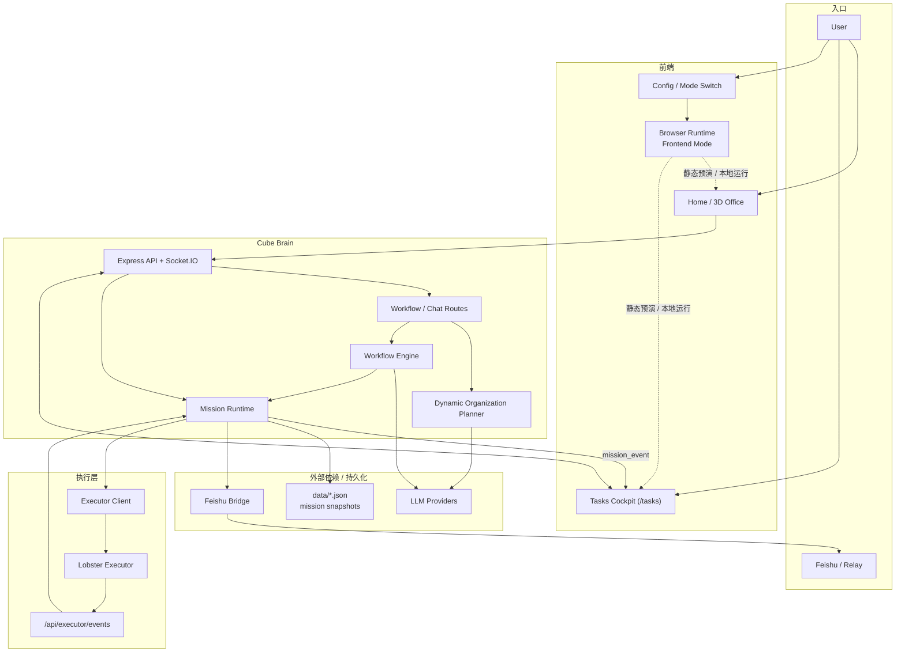

<p align="center">
  
</p>

<h1 align="center">Cube Pets Office</h1>

<p align="center">
  将自然语言指令编排成动态组织，并把协作过程以 3D 办公空间、任务驾驶舱和 mission 控制面板可视化展示的多智能体控制台。
</p>

<p align="center">
  
  
  
  
  
</p>

<p align="center">
  <a href="https://opencroc.github.io/cube-pets-office/"><strong>Live Demo</strong></a>
  |
  <a href="https://github.com/opencroc/cube-pets-office"><strong>GitHub</strong></a>
</p>

## 30 秒了解它

Cube Pets Office 是一个把这条链路端到端串起来的实验性原型：

1. 用户输入自然语言指令，或从 Feishu / relay 进入复杂请求
2. 系统按任务内容动态生成组织，而不是写死固定 18 个角色
3. 组织节点携带职责、skills、MCP 和模型配置进入执行链路
4. 前端把组织、阶段、消息流、任务细节和 3D 场景联动展示出来

你可以把它理解成一个把 “自然语言 -> 动态组织 -> mission / workflow -> 可视化反馈” 放在同一个工作台里的多智能体控制台。

## 核心链路



更具体一点看，可以把它理解成两条并行但会汇合的主线：

- 预演主线：用户直接打开前端，在 `Frontend Mode` 下由浏览器本地 runtime 驱动界面，用于静态演示、交互预览和 GitHub Pages。
- 执行主线：用户请求进入 `Advanced Mode` 后，前端通过 `/api` 和 `Socket.IO` 接入 Cube Brain，由动态组织、workflow / mission runtime、Feishu bridge、executor callback 一起完成真实任务推进。

## 当前能做什么

- 动态组织生成：按任务临时生成 CEO / manager / worker 结构
- Skills / MCP 装配：节点能力随组织一起进入执行链路
- 双运行模式：支持浏览器前端预演模式和服务端高级执行模式
- Mission 控制平面：支持任务列表、任务详情、决策恢复、executor 回调和 Feishu relay / webhook 接入
- `/tasks` 任务驾驶舱：支持 `Overview / Execution / Artifacts` 视图、单屏详情、长文本弹窗、工件下载和决策入口
- 附件输入工作流：支持“文字 + 附件”一起发布指令
- 附件全文导入：文本、PDF、Word、Excel、图片 OCR 解析后会以全文导入 workflow，界面仅显示预览
- GitHub Pages 演示：提供静态体验入口，右上角展示仓库链接
- 中英文切换：默认中文，支持持久化保存
- 移动端适配：首页、工具栏、工作流面板、配置与聊天都已适配手机布局
- Three.js 场景：动态组织与 3D 办公室联动，区域标签与家具已改造成临时 Pod 风格

## 运行模式

### Frontend Mode

默认模式，适合本地体验和静态演示。

- 不依赖服务端即可进入界面
- 适合查看 3D 场景、动态组织展示和交互流程
- GitHub Pages 也走这条纯前端预演链路

### Advanced Mode

完整执行链路模式。

- 连接 `/api` 与 `Socket.IO`
- 由服务端生成组织、装配 skills / MCP，并推进真实 workflow
- 开启 mission、Feishu、executor 等联调能力
- 需要 `.env` 中的模型配置

## 快速开始

### 1. 安装依赖

```bash
npm install
```

### 2. 只看界面和交互

```bash
npm run dev:frontend
```

默认地址：

- 前端：`http://localhost:3000`

### 3. 跑完整高级模式

先复制环境变量模板：

```bash
cp .env.example .env
```

最小可用的高级模式配置示例：

```dotenv
PORT=3001
NODE_ENV=development

LLM_API_KEY=your_api_key_here
LLM_BASE_URL=https://api.openai.com/v1
LLM_MODEL=gpt-5.4
LLM_WIRE_API=responses
LLM_REASONING_EFFORT=medium
LLM_TIMEOUT_MS=90000
LLM_MAX_CONCURRENT=9999
```

启动完整链路：

```bash
npm run dev:all
```

默认地址：

- 前端：`http://localhost:3000`
- 后端 API：`http://localhost:3001/api`

也可以分开启动：

```bash
npm run dev:frontend
npm run dev:server
```

### 4. 常用校验

```bash
npm run check
```

```bash
npm run dev:stop
```

## 配置总览

完整字段见 [.env.example](./.env.example)。如果你只是第一次接手项目，先看这张分组表就够了。

| 配置组 | 什么时候需要 | 关键变量 | 默认值 / 说明 |
| --- | --- | --- | --- |
| 基础运行 | 跑服务端高级模式时 | `PORT`, `NODE_ENV` | 默认 `3001`, `development` |
| 主 LLM | 只要要走服务端组织 / workflow | `LLM_API_KEY`, `LLM_BASE_URL`, `LLM_MODEL`, `LLM_WIRE_API` | `.env.example` 默认指向 OpenAI 兼容接口 |
| Fallback LLM | 主模型不可用时再启用 | `FALLBACK_LLM_*` | 可选，默认是第二套兜底模型配置 |
| 任务上下文 | 想调 workflow 上下文压缩策略时 | `WORKFLOW_CONTEXT_*` | 有默认值，通常先不用改 |
| Mission smoke | 跑 smoke 脚本时 | `MISSION_SMOKE_ENABLED`, `MISSION_SMOKE_*` | 默认关闭 |
| Executor callback | 需要校验 executor 回调签名时 | `EXECUTOR_CALLBACK_SECRET`, `EXECUTOR_CALLBACK_MAX_SKEW_SECONDS` | 留空时不做签名校验 |
| Lobster executor | 跑本地 executor 或集成 smoke 时 | `LOBSTER_EXECUTOR_BASE_URL`, `LOBSTER_EXECUTOR_PORT`, `LOBSTER_EXECUTOR_DATA_ROOT` | 默认走本地 `3031` |
| Feishu relay | 接 OpenClaw relay 或飞书复杂请求时 | `FEISHU_ENABLED`, `FEISHU_MODE`, `FEISHU_RELAY_SECRET`, `FEISHU_BASE_TASK_URL` | 本地模板默认 `mock` 模式 |
| Feishu webhook / delivery | 接真实飞书事件与回传时 | `FEISHU_WEBHOOK_*`, `FEISHU_MESSAGE_FORMAT`, `FEISHU_APP_ID`, `FEISHU_APP_SECRET`, `FEISHU_TENANT_ACCESS_TOKEN` | 真实接入时再填 |

### 推荐理解方式

- 只想看产品原型：不用改 `.env`，直接跑前端
- 想跑完整 workflow：先把 `LLM_*` 配好
- 想联调 executor：再补 `LOBSTER_*` 和 `EXECUTOR_CALLBACK_*`
- 想接飞书：最后补 `FEISHU_*`

## 附件输入

- 支持同时输入战略指令文本和附件文件
- 当前支持的附件类型：`txt / md / json / csv / pdf / docx / xlsx / xls / png / jpg / jpeg / webp / bmp / gif`
- 浏览器端会先尝试解析附件内容，再把解析结果与文件元数据一起送入 workflow
- 工作流使用附件全文内容，面板里只展示预览，不会直接铺开整份文件
- 若文件暂时无法解析，系统会保留文件名、类型、大小和失败说明

## 技术栈

- 前端：React 19、Vite、TypeScript、Zustand
- 3D：Three.js、React Three Fiber、Drei
- 后端：Express、Socket.IO、TypeScript
- AI 接入：OpenAI 兼容接口
- 本地存储：JSON 数据文件

## 项目结构

```text
client/   前端应用、3D 场景、工作流面板、聊天与任务页面
server/   API、Socket、Workflow Engine、Mission 路由、动态组织生成
shared/   共享类型与工具
data/     本地运行期数据和 Agent 产物
scripts/  启动、停止、构建、smoke 验证脚本
docs/     任务契约、双仓边界、executor 说明等文档
```

## 常用命令

- `npm run dev:frontend`：只启动前端预演
- `npm run dev:server`：只启动服务端
- `npm run dev:all`：同时启动前端与服务端
- `npm run dev:stop`：停止项目相关本地开发进程
- `npm run build`：构建生产版本和服务端产物
- `npm run build:pages`：构建 GitHub Pages 静态产物
- `npm run check`：TypeScript 类型检查
- `node scripts/mission-integration-smoke.mjs`：验证 relay ACK / progress / done / failed、executor 回调、`/api/tasks` 与 mission Socket 闭环
- `node scripts/mission-restart-smoke.mjs`：验证 mission 快照在服务重启后的恢复路径

## 主要 API

### Workflow / Chat

- `POST /api/workflows`：启动新工作流
- `GET /api/workflows`：获取工作流列表
- `GET /api/workflows/:id`：获取工作流详情
- `POST /api/chat`：统一的服务端聊天入口
- `GET /api/agents`：获取当前 Agent / 节点信息
- `GET /api/config/ai`：查看当前 AI 配置来源与运行参数

### Mission / Tasks

- `GET /api/tasks`：获取 mission / tasks 列表
- `GET /api/tasks/:id`：获取 mission 详情
- `POST /api/tasks/:id/decision`：提交 mission 决策
- `POST /api/executor/events`：接收 lobster executor 回调事件并写回 mission runtime

### Feishu

- `POST /api/feishu/relay`：接入 OpenClaw relay，请求复杂任务时先 ACK，再进入 staged progress
- `POST /api/feishu/relay/event`：手动推送 relay progress / waiting / done / failed / decision
- `POST /api/feishu/webhook`：接入飞书 webhook / 卡片回调

## Mission 集成现状

- 前端任务页已挂到 `/tasks` 和 `/tasks/:taskId`，高级模式下会与现有 workflow 视图并存
- 任务详情页采用 `Overview / Execution / Artifacts` 三栏任务驾驶舱布局，适合 16:9 屏幕持续观察
- 服务端同时保留原 workflow Socket 事件与新的 `mission_event`
- executor 回调默认支持 HMAC-SHA256 校验
- smoke 路由默认关闭，仅在 `MISSION_SMOKE_ENABLED=true` 时暴露

## GitHub Pages 部署

仓库内置了 GitHub Pages 专用构建和工作流。

- Pages 构建命令：`npm run build:pages`
- 工作流文件：`.github/workflows/deploy-pages.yml`
- 构建输出目录：`dist/public`

Pages 版本特性：

- 使用仓库子路径正确设置 `base`
- 强制停留在前端预演模式
- 不连接服务端，不执行真实高级 workflow
- 右上角展示 GitHub 仓库入口，方便访问和点 Star

## 当前边界和风险

- GitHub Pages 版本仍是静态演示版，不提供真实服务端执行
- `/tasks` 目前仍主要消费 workflow 投影层，mission 原生数据源还在继续收口
- 超大附件目前仍走浏览器端解析，极大 PDF / OCR 图片在弱机器上仍可能更慢
- `services/lobster-executor` 当前是 mock-first 参考实现，真实 Docker 生命周期还未完全产品化
- 动态组织已经跑通，但跨任务长期记忆、自主演化和组织优化仍在 roadmap 上
- 一些历史文档仍保留旧的“固定 18 Agent”叙事，正在逐步清理

## 文档入口

- [ROADMAP.md](./ROADMAP.md)：阶段规划与完成状态
- [CHANGELOG.md](./CHANGELOG.md)：近期面向读者的变化记录
- [docs/mission-contract-freeze.md](./docs/mission-contract-freeze.md)：mission / executor / socket 契约冻结说明
- [docs/mission-worktree-dual-repo.md](./docs/mission-worktree-dual-repo.md)：双仓参考与并行改造边界
- [docs/executor/lobster-executor.md](./docs/executor/lobster-executor.md)：lobster executor 说明

## License

MIT

## Star History

[](https://star-history.com/#opencroc/cube-pets-office&Date)
