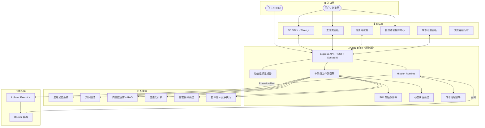

<p align="center">
  
</p>

<h1 align="center">🐾 Cube Pets Office</h1>

<p align="center">
  <strong>在 3D 办公室里观察 AI 智能体协作——无需任何配置</strong><br/>
  Watch AI agents collaborate in a 3D office — no setup required.
</p>

<p align="center">
  <a href="https://opencroc.github.io/cube-pets-office/"><strong>👉 在线体验 Live Demo</strong></a>
</p>

<p align="center">
  
  
  
  
  
  
</p>

---

## ⚡ 项目概述

Cube Pets Office 是一个**从 0 实现的开源多智能体可视化平台**。输入一条自然语言指令，系统自动组建 AI 团队——CEO 拆解方向、经理分配任务、Worker 并行执行、互相评审打分、审计修订、最终汇总进化。整个过程在 3D 办公场景中实时呈现。

它不只是生成文档。系统会把任务规划成结构化的执行计划，下发到 Docker 容器中真实运行，页面上展示的是执行状态、运行日志、工件链接和最终结果——而不是一份 Markdown 报告。

**不需要 API Key** 就能体验可视化和交互流程。接入 LLM + 执行器后可以跑完整的真实任务闭环。

相比同类多智能体框架，我们拥有 🚀 **六大核心优势**：

> 🏢 **动态组织生成**：不是固定角色，而是根据任务内容动态生成 CEO / 经理 / Worker 团队结构。编程任务和营销策略会得到完全不同的组织配置。

> 🧬 **自进化智能体**：每轮工作流结束后，智能体分析自己的弱项维度，自动修补人设定义。三级记忆（短期 / 中期 / 长期）让智能体越用越聪明。

> 🎯 **20 分评审制**：每份交付物按准确性、完整性、可操作性、格式四个维度打分，低于 16 分自动退回修订。独立审计员进行元审计，确保质量与合规。

> 🐳 **真实执行闭环**：不止于 AI 规划——结构化执行计划下发到 Docker 容器真实运行，页面实时展示容器状态、日志和产物。

> 🔀 **双运行时架构**：同一套工作流引擎可以跑在浏览器里（IndexedDB + Web Worker）或服务端（Express + JSON），不绑定任何一端。

> 💰 **全链路成本治理**：从被动监控到主动治理——多级预算、四级告警、灰度模型降级、并发限流、任务暂停审批、成本预测与优化建议，形成完整闭环。

---

## 🪄 一次完整的执行流程

告别传统的数据看板，在 Cube Pets Office，一切由一个简单的问题开始：

```
你输入: "制定本季度用户增长策略"
```

| 步骤 | 阶段 | 主要操作 | 参与组件 |
|:----:|------|---------|---------|
| 1 | 🏢 动态组建 | 根据任务内容生成 CEO、经理、Worker 团队结构 | 动态组织生成器 + LLM |
| 2 | 📋 CEO 拆解 | CEO 将指令分解为各部门方向 | 工作流引擎 + LLM |
| 3 | 🎯 经理规划 | 每位经理为下属 Worker 分配具体任务 | 工作流引擎 + LLM |
| 4 | ⚡ Worker 执行 | Worker 并行产出交付物 | 工作流引擎 + LLM |
| 5 | 📝 经理评审 | 经理按 4 维度打分（满分 20），低于 16 分退回 | 评审系统 |
| 6 | 🔍 元审计 | 独立审计员检查质量与合规性 | 审计引擎 |
| 7 | 🔄 修订 | 被退回的 Worker 根据反馈修改 | 工作流引擎 + LLM |
| 8 | ✅ 验证 | 经理逐条确认反馈是否被回应 | 评审系统 |
| 9 | 📊 汇总 | 部门报告汇总为 CEO 级综合报告 | 工作流引擎 |
| 10 | 🧬 进化 | 智能体从评分中学习，自动更新自身人设 | 自进化引擎 |

> 3D 办公室实时显示每个智能体的状态——思考中 💭、执行中 ⚡、评审中 📝、空闲 😴

---

## 🚀 快速开始

### 方式一：纯体验（不需要 API Key）

打开 [在线演示](https://opencroc.github.io/cube-pets-office/)，或者本地运行：

```bash
npm install
npm run dev:frontend
```

完整的 3D 场景、动态组织可视化、工作流面板和交互界面——全部在浏览器里运行。

### 方式二：接入 LLM（完整模式）

```bash
cp .env.example .env
# 编辑 .env，填入你的 API Key
npm run dev:all
```

最小 `.env` 配置：

```dotenv
LLM_API_KEY=你的密钥
LLM_BASE_URL=https://api.openai.com/v1
LLM_MODEL=gpt-4o
```

### 方式三：接入执行器（真实任务执行）

```bash
# 终端 1：启动主服务
npm run dev:all

# 终端 2：启动 lobster 执行器
cd services/lobster-executor && npm start
```

系统会把 AI 生成的执行计划下发到 Docker 执行器，页面上实时展示容器状态、日志和产物。

---

## 🏗️ 系统架构



### 数据流：两条并行主线

```
预演主线（Frontend Mode）
  用户 → 浏览器运行时 → IndexedDB → 3D 场景 + 工作流面板
  不需要服务端，适合演示和教学

执行主线（Advanced Mode）
  用户 → Express API → 动态组织 → 十阶段管道 → Mission Runtime
       → ExecutionPlan → Docker 执行器 → 回调 → 任务驾驶舱
  需要 LLM 配置，可选接入执行器和飞书
```

---

## 📂 项目代码结构

```
cube-pets-office/
├── client/                          # 🖥️ 前端应用
│   ├── src/
│   │   ├── components/              # UI 组件
│   │   │   ├── Scene3D.tsx          # Three.js 3D 办公室场景
│   │   │   ├── ChatPanel.tsx        # 工作流对话面板
│   │   │   ├── CostDashboard.tsx    # 成本可观测看板
│   │   │   ├── TelemetryDashboard   # 实时遥测仪表盘
│   │   │   ├── GovernancePanel      # 成本治理面板
│   │   │   ├── knowledge/           # 知识图谱可视化
│   │   │   ├── rag/                 # RAG 管道界面
│   │   │   ├── replay/              # 执行回放组件
│   │   │   └── reputation/          # 信誉评分展示
│   │   ├── lib/                     # 状态管理 (Zustand stores)
│   │   ├── runtime/                 # 浏览器运行时引擎
│   │   └── hooks/                   # React Hooks
│   └── public/                      # 静态资源 + 3D 模型
│
├── server/                          # 🧠 服务端
│   ├── core/
│   │   ├── workflow-engine.ts       # 十阶段工作流引擎
│   │   ├── dynamic-organization.ts  # 动态组织生成器
│   │   ├── mission-runtime.ts       # Mission 六阶段状态机
│   │   ├── cost-tracker.ts          # 成本追踪器
│   │   ├── governance/              # 成本治理子系统
│   │   │   ├── alert-manager.ts     # 四级告警管理
│   │   │   ├── budget-manager.ts    # 多级预算管理
│   │   │   ├── downgrade-manager.ts # 灰度模型降级
│   │   │   └── audit-trail.ts       # 审计链
│   │   ├── memory/                  # 三级记忆系统
│   │   ├── knowledge-graph/         # 知识图谱引擎
│   │   ├── rag/                     # RAG Pipeline
│   │   ├── skills/                  # Skill 热插拔
│   │   ├── roles/                   # 动态角色系统
│   │   ├── reputation/              # 信誉评分
│   │   └── autonomy/                # 自评估 + 竞争执行
│   ├── routes/                      # REST API 路由
│   └── tests/                       # 测试套件 (Vitest + fast-check)
│
├── shared/                          # 📦 前后端共享
│   ├── cost.ts                      # 成本基础类型 + 定价表
│   ├── cost-governance.ts           # 成本治理类型 + 常量
│   ├── llm/contracts.ts             # LLM 多提供商抽象
│   ├── rag/contracts.ts             # RAG Pipeline 契约
│   ├── skill/contracts.ts           # Skill 注册契约
│   ├── export/contracts.ts          # 跨框架导出契约
│   └── ...                          # 8 个契约模块
│
├── services/                        # 🐳 执行器
│   └── lobster-executor/            # Docker 参考执行器
│
└── docs/                            # 📖 文档与规范
```

---

## ✅ 功能模块完成状态

### 🔧 核心引擎

| 功能 | 状态 | 说明 |
|------|:----:|------|
| 3D 办公室 + 智能体实时状态 | ✅ | Three.js 场景，实时显示思考/执行/评审/空闲 |
| 动态组织生成 | ✅ | 根据任务内容 LLM 生成 CEO/经理/Worker 结构 |
| 十阶段工作流管道 | ✅ | 组建→拆解→规划→执行→评审→审计→修订→验证→汇总→进化 |
| 20 分制评审 + 元审计 | ✅ | 四维度打分，独立审计员质量检查 |
| 三级记忆系统 | ✅ | 短期（会话）/ 中期（向量检索）/ 长期（SOUL.md 人设） |
| 自进化 + 心跳 | ✅ | 评分分析→人设修补→能力注册，自主搜索趋势报告 |
| Mission 任务状态机 | ✅ | receive→understand→plan→provision→execute→finalize |
| 双运行时 | ✅ | 浏览器 IndexedDB + 服务端 Express，同一套引擎 |

### 🤖 智能体能力

| 功能 | 状态 | 说明 |
|------|:----:|------|
| Skill 热插拔体系 | ✅ | 运行时注册/卸载技能，不重启服务 |
| 动态角色切换 | ✅ | Agent 运行时切换角色，适应任务变化 |
| 自评估 + 竞争执行 | ✅ | Agent 自我评估能力，竞争择优执行 |
| 信誉评分系统 | ✅ | 基于历史表现的信誉积累与衰减 |
| 多模态编排 | ✅ | 语音 + Vision 统一编排 |
| 人工审批流 | ✅ | 通用审批 + 决策链，支持暂停等待人工确认 |

### 🧠 知识与检索

| 功能 | 状态 | 说明 |
|------|:----:|------|
| 向量数据库 + RAG 管道 | ✅ | 7 步 Pipeline：加载→分块→嵌入→索引→检索→重排→生成 |
| 结构化知识图谱 | ✅ | 实体/关系/推理，支持可视化探索 |
| 附件输入 | ✅ | PDF、Word、Excel、图片 OCR |

### 📊 可观测性与治理

| 功能 | 状态 | 说明 |
|------|:----:|------|
| 实时遥测仪表盘 | ✅ | 事件总线 + Recharts 可视化 |
| 成本可观测性 | ✅ | Token 追踪、模型定价、Agent 成本分布 |
| 主动成本治理 | ✅ | 多级预算 / 四级告警 / 灰度降级 / 审计链 |
| 长任务恢复 | ✅ | 浏览器端 IndexedDB 持久化，断点续跑 |
| 执行回放 | ✅ | Mission 执行过程录制与时间线回放 |

### 🔗 交互与集成

| 功能 | 状态 | 说明 |
|------|:----:|------|
| 自然语言指挥中心 | ✅ | 自然语言→结构化命令，智能路由 |
| 3D 场景 Mission 融合 | ✅ | Mission 状态实时映射到 3D 智能体动画 |
| 跨框架导出 | ✅ | 一键导出为 CrewAI / LangGraph / AutoGen 格式 |
| 演示引擎 + 引导体验 | ✅ | 预录数据包 + 步骤引导，零配置体验 |
| 飞书集成 | ✅ | ACK / Progress / 决策回传 |
| 中英文 / 移动端 | ✅ | i18n 双语切换，响应式布局 |

### 🚧 开发中 & 规划中

| 功能 | 状态 | 说明 |
|------|:----:|------|
| Docker 真实容器生命周期 | 🚧 | 容器创建/启动/监控/销毁全链路 |
| 安全沙箱 + 实时终端 | 🚧 | 隔离执行环境 + 终端预览 |
| Agent 权限矩阵 | 🚧 | 细粒度工具/资源/网络权限控制 |
| 跨 Pod 自主协作 | 📋 | 多节点 Agent 集群协作 |
| A2A 互操作协议 | 📋 | 跨框架 Agent 通信标准 |
| Agent 交易市场 | 📋 | Guest Agent 机制 + 信誉交易 |
| 多人实时协作 | 📋 | 多用户同时操作同一 Office |
| K8s Agent Operator | 📋 | Kubernetes 原生 Agent 编排 |

---

## 📈 项目规模

| 维度 | 数据 |
|------|------|
| TypeScript 源码 | **567 文件 / ~110,000 行** |
| 服务端 (server/) | 266 文件 / ~60,800 行 |
| 前端 (client/) | 238 文件 / ~40,700 行 |
| 共享层 (shared/) | 52 文件 / ~7,800 行 |
| 功能模块 | **38 个 spec，已完成 29 个** |
| 契约模块 | 8 个（shared/ 下冻结） |
| Commits | 212+ |

---

## 🛠️ 技术栈

| 层 | 技术 |
|----|------|
| 3D 场景 | Three.js、React Three Fiber、Drei |
| 前端 | React 19、Vite、TypeScript、Zustand、Recharts、shadcn/ui |
| 后端 | Express、Socket.IO、TypeScript |
| AI 接入 | OpenAI 兼容接口（任意提供商） |
| 知识检索 | 向量数据库、RAG Pipeline、知识图谱 |
| 测试 | Vitest、fast-check（属性测试） |
| 存储 | 浏览器: IndexedDB / 服务端: 本地 JSON |
| 部署 | GitHub Pages（前端）/ Docker（执行器） |

---

## 🎯 适合谁？

| 角色 | 用途 |
|------|------|
| 🔬 AI 研究者 | 探索多智能体协调模式、层级委派和评审机制 |
| 🎓 学生 | 学习智能体架构、任务分解、评估与进化 |
| 👨‍💻 开发者 | 作为构建自己 agent 系统的可视化参考 |
| ✍️ 技术博主 | 找一个有视觉冲击力的 demo 来写文章 |
| 🧐 好奇的人 | 看看让 AI 智能体经营一间办公室会发生什么 |

---

## 📦 常用命令

```bash
npm run dev:frontend   # 只启动前端（纯体验）
npm run dev:all        # 启动前端 + 服务端（完整模式）
npm run dev:stop       # 停止本地开发进程
npm run build:pages    # 构建 GitHub Pages 静态产物
npm run check          # TypeScript 类型检查
```

---

## 🤝 参与贡献

欢迎 PR。代码库通过 `npm run check`（TypeScript 严格模式）。推荐从这两个文件开始了解核心逻辑：

- 工作流引擎：`server/core/workflow-engine.ts`
- 浏览器运行时：`client/src/runtime/browser-runtime.ts`

---

## 📖 文档

- [ROADMAP.md](./ROADMAP.md) — 开发阶段与完成状态
- [CHANGELOG.md](./CHANGELOG.md) — 近期变更记录
- [docs/](./docs/) — 契约规范与架构说明

---

## 📄 License

MIT

---

## ⭐ Star History

[](https://star-history.com/#opencroc/cube-pets-office&Date)
